## 模板非类型参数

模板的非类型参数啊，模板的非类型参数，也就是说你说的模板参数列表里边儿不都是。定义参数用来抽象化类型的嘛，

也就是都是定义类型参数的嘛，还可以定义非类型参数吗？当然是可以的了啊，当然是可以的了。那么，我们来举个例子啊，我们来举个例子。在这里边儿呢，我们写一个写一个数组啊，写一个数组那么。比如说呢，对于这个数组呢，我们进行一个。冒泡的排序啊，冒泡的排序。

我们需要把这个数组元素的个数是不是也传进去啊啊？但是呢？我们现在可以选择呢，==用模板来实现一个sort，==对于任何类型的数数据我都可以进行冒泡排序。啊，这里边不仅仅是整数，对吧？另外一个呢？我在这里边呢。哎，大家来看一下，我在这里边儿就定义了一个模板类型参数啊，模板类型参数。type name定义的是类型参数，

这个是用来接受类型的，这个是一个。

==非类型参数啊，非类型参数本身都是常量啊，都是常量，就是只能使用啊。只能使用而不能修改，就是不能写的==

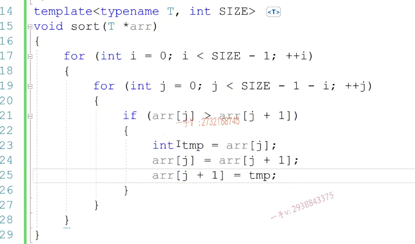

下面这个错了，没有指定参数

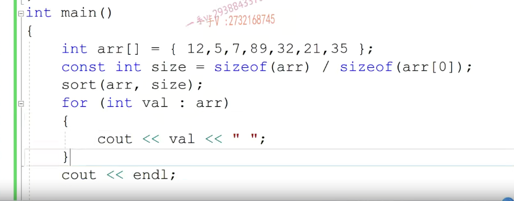

要指定参数，size是常量，可以直接定义为7

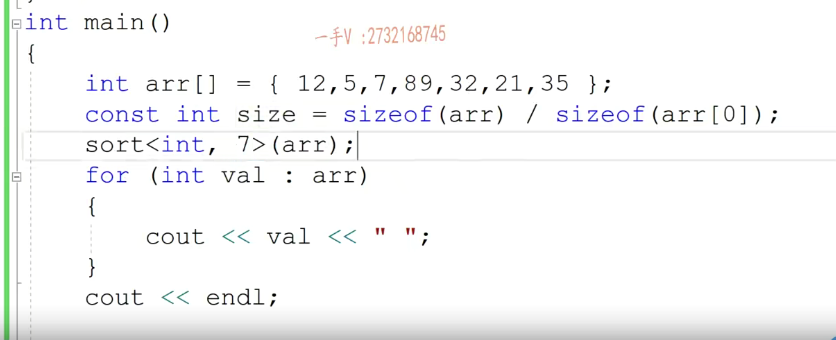

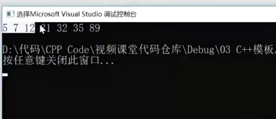

## 类模板

我们用了这个class，用的这个class。 class sequencestack，现在是一个类名称，还是一个模板名称？请问一下，这现在是一个模板名称啊？这现在是一个==模板名称==。

模板名称，模板名称。不是类名啊，那么public private，其实其他的代码呢？跟我们以前写的一模一样，现在就是涉及我们具体数据类型的时候都得用到t。

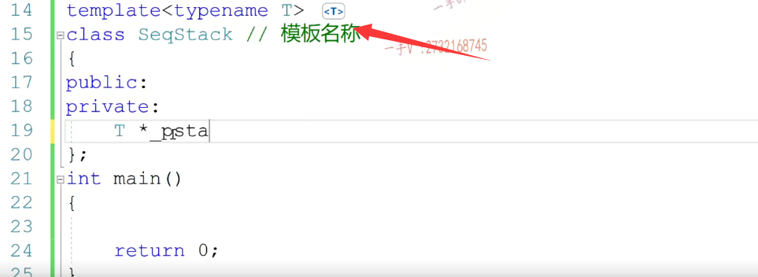

我们在这实现一个可增长的栈。先定义一个指针，然后描述栈顶，

我要描述你占顶位置的，是不是都是用整形啊？因为数组的下标都是整形嘛？对不对？你这个数组要进行你这个栈的底层数组要进行扩容，扩容的话呢？在这里边儿啊，我肯定得需要记录一个size啦。啊，管你数组里边存的是什么类型的元素？数组的长度呢大小。那我肯定也是用一个整形来记录啊，所以这里边儿呢，用的都是整形跟我们具体的数据的类型t呀。

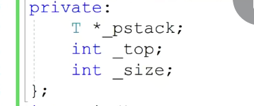

好在这儿,我们写一个构造函数啊，我们写这个构造函数呢，可以给一个默认值啊来做我们的这个。初始的内存的这个初始化啊，在这里边很明显。呃，这个类产生的这个对象啊，这个指针啊，要占用外部的资源。所以我们这个类的析构函数，我们一定要提供。既然呢，这个类啊，==定义的对象有一个指针要指向外部的堆内存==，所以==这个类的对象发生默认的拷贝构造跟赋值==了。是一定有问题的。啊，他们是一定有问题的，所以在这里边，我们需要给他重写拷贝构造和复制啊，那么，在这里边看一下啊.

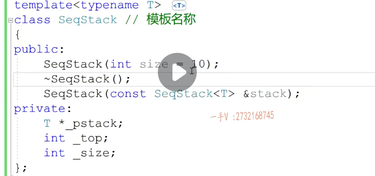

这现在是模板名。其实呢，我们想把它因为我们构造函数跟析构函数的名字呢都得。是类名称吗？啊，模板名加上我们的这个。类型参数，类型参数列表哎才构成我们的类名。类名称才构成我们的这个类名称。对了吧啊，才构成这个类名称。但是这样写呢，很明显啊，

比较复杂。所以我们C加加里边儿说呢，除了构造跟析构函数。这个模板后边的尖括号可以省略啊，其他的不要省略。

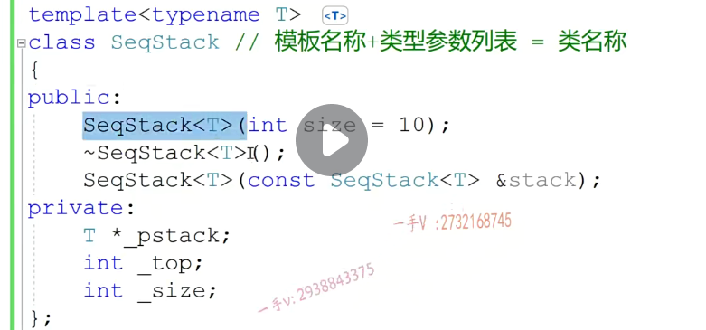

拷贝构造，构造函数，析构函数可以省略后面的尖括号

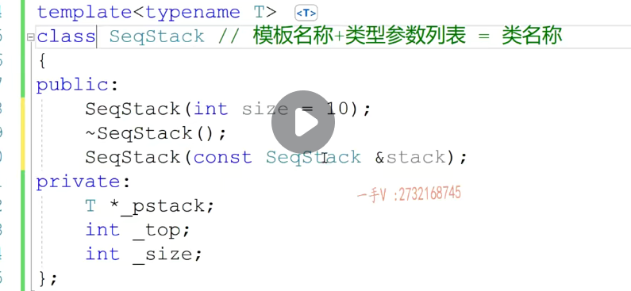

我们说建议啊，大家呢？就是在这写上吧啊，构造和析构含和析构。函数名。不用加。哎参数列表，其他出现。模板的地方都加上。

类型参数列表。因为我们不可能是想使用模板的，我们在其他地方使用，一定是把它当做类型来使用的。所以呢，希望大家在除了构造跟析构函数名字，我们在把它用作类型的时候呢，一定要给它加上监控2t，这是一个非常好的编程的习惯，

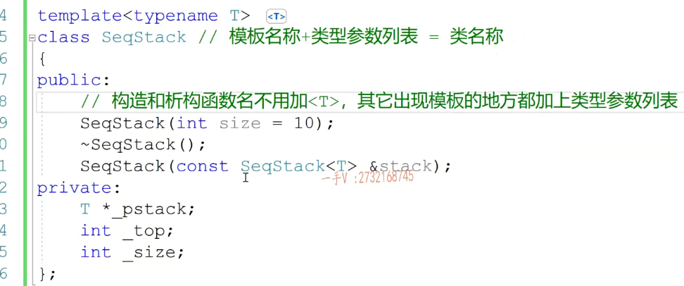

赋值，我们说要==返回当前类型的引用。我们当时说过这个是要支持连续复制==的，对吧？==连续复制==啊。

这个用作类型，所以呢，sequence tag后边加括号t呢，括号t比较省啊比较省。在这里边同样的啊，跟我们拷贝构造的这个参数列表就是一样的，这是它的赋值运算符的。重载函数啊，赋值运算符的重载函数。希望注意一下啊，注意一下。好在这里边呢，

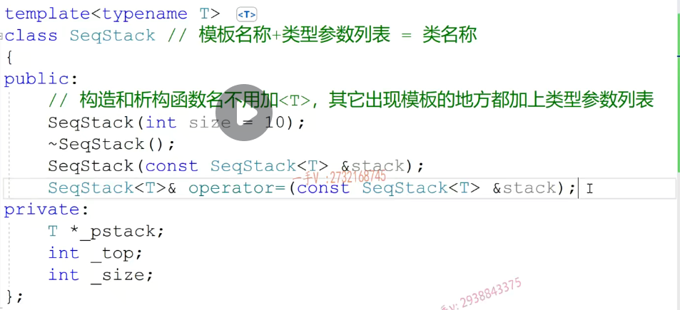

### 只读方法构造

我们还添加了push。对不对const t啊？还有pop。还有top这里边，我们之前给大家说了啊，写这些方法。如果这个==方法只涉及读而不涉及写，我们尽量把它实现成const的长方法==，这样一来呢，普通对象能调。长对象是不是也能调用啊？你要是把它写成普通方法，那就只有普通对象能调了，这是跟this指针的类型有关系。对着没啊，希望记住在大家记住这么一个C++里边儿写成员方法啊，记住这么一个建议好吧。对于==只读操作接口==呢，

我们。把它写成const方法，长方法。

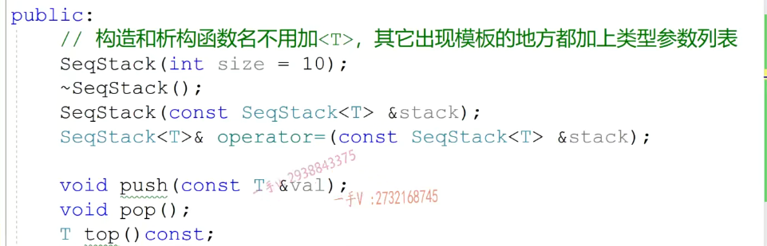

==full判断是否满的接口，还有一个判断是否空的接口啊,为空为满==。当然在这里边，我们还需要支持它的这个内容的。

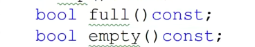

==扩展扩容==。是不是啊？要支持这个扩容啊扩容。那在这儿呢，

我们就给他写一个私有的方法啊，私有的方法。在这里边呢int。我们写一个私有的方私有的接口，因为这个扩容是给我们内部的push接口用的，对吧？当我们添加给这样添加元素的时候，发现占满了，要进行扩容啊。

我们在这里边儿写一个expand啊，这个扩容的接口啊，扩容。顺序栈。底层数组按二倍二倍。的方式扩容啊，

顺序上。==顺序整底层数组按二倍的方式进行一个扩容==。==二倍的方式进行一个扩容==，好了吧啊？二倍的方式进行一个扩容操作。好，我们来一一看一看啊。

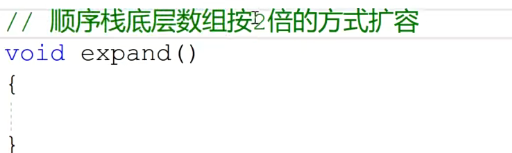

### 回顾一开始的构造函数

初始化列表的方式写构造函数

大家接受一下这这种风格啊，我们C++的开源代码上一般的构造函数呢，都是这么来写的，包括这个大括号的布置都是这么布置的啊。

呃，他们把这个成员变量的初始化呢，一般呢都会写到我们的构造函数的初始化列表当中。希望大家注意一下啊，希望大家注意一下。因为这里是初始化。写到大括号里边算赋值，对不对啊？说实话，肯定生成的指令更少嘛，效率会更高一点。

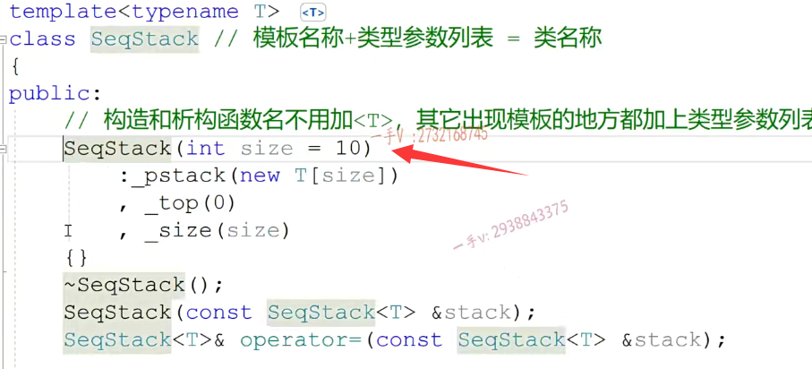

这是析构函数啊，析构函数在这里边呢，

那就是释放我们的。空间呗。是不是释放我们的空间啊啊？好，这跟之前一样，用到类型的时候用t来表示就行了

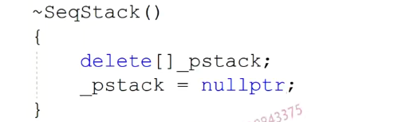

### 拷贝构造的步骤

先可以初始化列表

拷贝构造还记着没有？那当然了，在这里边儿既然是构造函数，也有初始化列表的，在这儿我们可以先把这个相应的这个top初始化一下top是stack的。top啊。然后呢？这里边有杠size是stacked杠size。

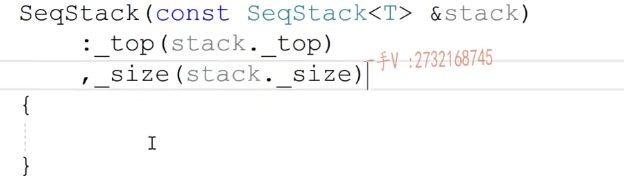

哎，下边儿就不好做了，在这里边儿呢，我们应该是p斯泰克等于newt中括号啊。杠size，因为size，这已经初始化过了，对吧？==根据这个外部引用的外部的对象size啊，然后呢，要把数据呢，是不是一个拷一个一个拷贝过来啊？在这里边儿千万不要用，不要用memory copy进行拷贝==。好不好？ 

因为这t类型我们不知道它是个什么类型，它要是个内置编译器的简内置类型的话，那你用memcpy没有问题，但是它t要是个对象。而且T这个对象呢。它还会发生前拷它的前拷贝是有问题的，那么你在这里边儿用memory coffee做的全部都是浅拷贝了，对不对？我们应该用for循环。因此I=0 I小于。top啊，加加I这样吧，我们拷贝到站顶就可以了，不用整个都拷贝啊。我们size代表是它底层这个数组的空间，

比如1000个啊，但是有1000个空间，它并不说是就放1000个元素啊，它有可能只放了100个元素，是不是？那我们在这里边儿啊，只考占里边儿有效元素就行了，这个top是从零开始的，所以呢，当我们放一个增加一个，放一个增加一个，这个top是记录的，是我们元素的个数啊。我们数组是从零开始算的，所以这里边是小于而不是小于，

等于如果你top这里边是从负一开始的，那在这儿呢，你就要小于等于了，好注意一下啊，注意一下。

在这儿呢，我们_pstack[i]=stack._pstack[i]。得进行这样一个。赋值操作。没问题吧，赋值操作啊，这个其实会调用每一个相应对象的就t类型对象的复制运算和重载。因为t类型，如果它的前拷贝有问题，我们用户一般也会给这个类型呢，

提供自定义的复制运算和重载，在这里边儿就能够用到了。啊，防止我们对象前靠背的发生。好吧t类型，因为我们不知道是什么类型，这是模板类型，任何类型都可以的啊。好，这个拷贝构造在这里边就完了。

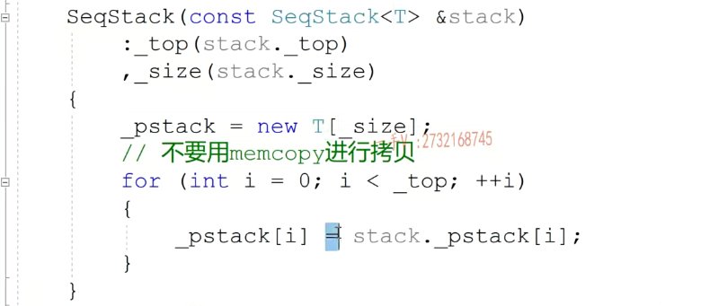

### 赋值=

赋值还记不记得我们分为了==三步第一步呢？首先是防止自赋值。retur你 this.==

啊，完了以后呢，==需要释放原来的空间==。对吧，接着呢，那就剩我们拷贝构造一样啦啊，那就是。用你==外部传进来的这个对象的top给我的top初始化一下，用你的size给我的size初始化一下==。然后呢，==再根据你的大小呢，给我开辟空间==。哎，然后呢？把你的数据再付付给我啊，

然后呢？就完了？in this.对的吧，return新this啊，return新this。return型this。这就是我们的复值运算符的重载。

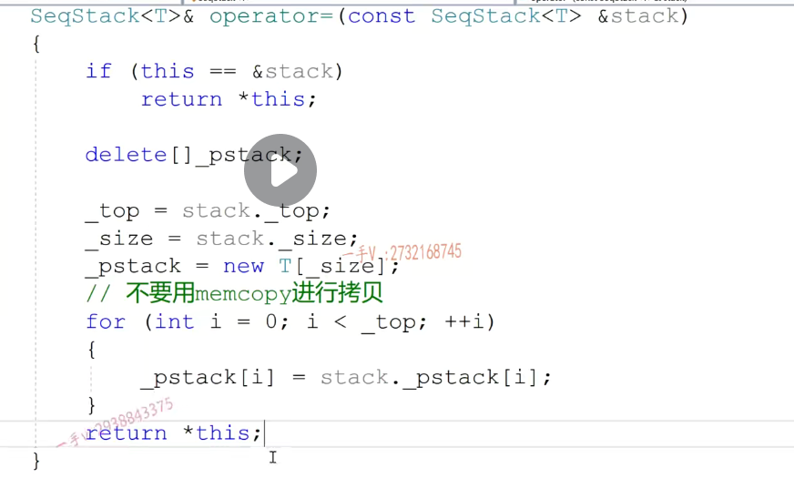

 push啊，push在这里边呢，我们得要用，如果你full啊，==这样已经full了，我们要用expand==。进行扩容，

扩容好了以后，我们就可以用stack中括号谁呀？gump stack.中括号什么东西呢？嗯，这里边我们应该用这个。top吧，先放在加是不是啊？等于value，这就是push入站操作啊。==入栈操作==

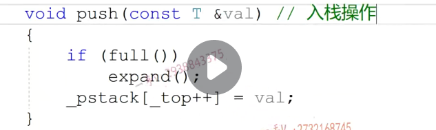

==出栈操作啊。==

==if empty，如果空了，我们什么也不做啊==，否则呢，在这里边儿对于top进行一个减减就行了。这就是所谓的。出着啊，出着。出战操作。初战操作。

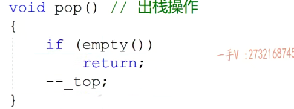

那么这个top呢？是返回站点元素对吧？我们有的同学在这top里边儿，还要判断这个站为空。

我我我们就不知道返回什么top了啊，其实这个top我们外部用的时候呢，有一般都分跟这个empty呢来结合使用的啊，如果这样不empty的话，我们才。使用top对不对？才使用top啊，那如果你非得想写的话呢？在这里边儿empty那empty我返回什么东西呢？我也不知道t什么类型啊，是不是？没关系，你可以去through啊through一个字符串啊stack is。empty.我们抛出异常，

也是属于啊抛异常。剖异常也是。这个。呃，也代表这个函数逻辑。结束也就是返回了，还是返回了？那也就是说你through这个。异常的这个字符串类型的异常啊，需不需要跟这个返回值这个t这个类型保持一致呢？呃，不需要不需要啊。抛出异常本身就是结束函数就是函数，这个执行流结束的一种方式啊，我们不需要呢。

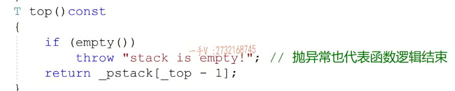

full的话呢，那在这里边就是return谁啊？杠top等于谁杠size？empty就是return谁呀？啊，

return杠top=0了。对不对的啊？就returntop=0了。注意一下啊，这是阵满。占满诶满。这个是震空。这个是返回阵顶元素啊。

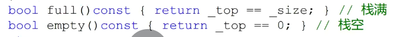

那这个是扩容对吧？扩容我们要先定一个，比如注意是t啊，不是int啊tmp。等于new题，不要用mo loc了好不好？

不要用mo loc了，我们在写代码过程中啊，同学们在学C加加的时候。从保保留了C语言的这个逻辑思维总是转不过弯来啊，我们之前说了==C加加就用new跟delete==。好吧，因为这就个t是t类型，不知道是。编辑的内置类型有可能是我们对象的类型类类型了。那在这里边儿，==它需要调用默认的构造，它需要调用构造函数的==，对吧？==你malloc是调用不了构造函数的mo loc，只能开辟内存==。

==new人家是有开辟内存，还有初始化==。对于类类型来说，所谓的初始化就是调用相应的构造函数

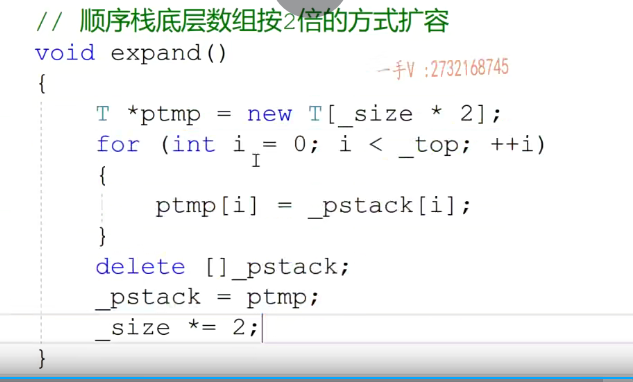

对于类类型来说，所谓的初始化就是调用相应的构造函数。中括号原来的两倍啊，然后for循环inti=0 I小于这里边儿，小于杠top或者杠size都行，因为已经满了嘛。是不是那我们既然前边是top的话，我们这也是top吧？我们拷拷贝过来啊。拷贝一下。从诶。从我现在的我现在是新申请了一块内存嘛。对吧，

是原来大小的两倍嘛。呃，再进行一个for循环，把原来这个指针指向的这个内存里边满了嘛，对吧？元素一个一个拷贝到这来。啊，拷贝完了以后呢，我们就可以把原来的这块旧内存呢，就给它delete掉，注意加中括号。啊，因为原来执行的数组对吧？看一下我们前边刚写的时候没有出错吧？嗯，

都对着呢是吧？都加中括号了。然后然后呢？让我这个。站对象的成员变量杠PS，然后呢，指向我们新的内存就是这个PT mp。好了吧，当然啦，这里边top用不用变啊？top没有变是吧？top没有变。塞子要变一下，塞子是原来的两倍了啊。CS是原来的两倍了。

好在这里边呢，我们就把一个。用模板实现的这个顺序这呢，我们就输出完了。一劳永逸，一劳永逸啊，一劳永逸在这里边呢，我们只要写一套这样的栈。啊，我们在。任何地方想使用占想存取任意的类型的元素，我们都可以使用它，我们先用相应的类型去实例化它就行了。我们在这里边儿，为了图方便，

把所有的成员方法都在==类内实现，==

都在例题内实现对吧如果你要在==类外实现==，就比如说这个push。好吧啊，这个入站操作对不对？我们在类体内呢，只进行了一个什么？声明声明对吧？那它的实现在哪里？实现在内外实现啊，内外实现我们当时给大家说过在内外实现成员方法这前边儿一定要加什么？诶seq stack。前面是不是一定要加类的作用域啊？但是这这现在是类吗？sequence tag这是不是类呀？

这不是类，这只是个模板名称啊，那类名怎么来呀？==类名是模板名称加参数列表啊==。类型参数。尖括号儿参数列表才能构成一个类型，但是这个t呢，已经用不到我们上边儿定义的这个t了。因为不管是类模板还是函数模板啊，它所定义的模板参数列表里边儿的这个类型参数啊，只能延迟到类或者函数的左括号儿。到右括号完了就到这就完了。再往这儿要你，你要做的话，那你只能是重新怎么样啊？

tmp late只能重新去定义这个t类型参数了。啊，重新去定义这个题，其实这里边儿定义t或e都无所谓啊，无所谓无所谓，这只是个名字表示，最终呢，你想用什么类型呢？去实例化。这样它就在这里边用什么类型呢啊？就是出来了一个用。某个类型哎。做某个类型的入入站操作的这么一个push啊方法。对吧，这是在内外啊，

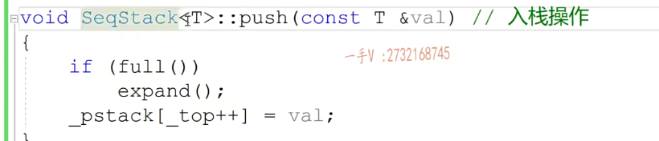

要注意template的范围，上面的错了

因为不管是类模板还是函数模板啊，==它所定义的模板参数列表里边儿的这个类型参数啊，只能延迟到类或者函数的左括号儿。到右括号完了就到这就完了==。再往这儿要你，你要做的话，那你只能是重新怎么样啊？

==tmp late只能重新去定义这个t类型参数了==。啊，重新去定义这个题，其实这里边儿定义t或e都无所谓啊，无所谓无所谓，这只是个名字表示，最终呢，你想用什么类型呢？去实例化。这样它就在这里边用什么类型呢啊？就是出来了一个用。某个类型哎。做某个类型的入入站操作的这么一个push啊方法。对吧，这是在内外啊，

需要加上模板定义

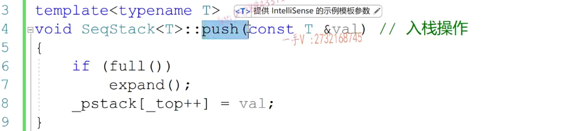

这是我们用整形十里画的这么一个阵啊。编译了一下。那么注意啊，当我们用整形实例化这个类模板的时候呢，哎，它们编译阶段呢，就会呢，在我们模板啊，跟我们模板啊。实例化一份专门处理整形的类出来啊，专门处理整形的。这个类出来。对吧，而且由于呢，它呢只这个我们对象用的时候在这里边儿，

只用到了它的这个构造函数啊。还有它的这个初中与和析构函数，所以它在给我们实例化这个整形实例化这个sequence tag的时候呢。这个实例画出来这个类啊，模板类啊类模板经过实例化嘛，对吧？经过实例化。得到的是模板类啊，到这个模板类的时候啊。你看看啊，得到这个模板类的时候，模板类的时候啊。在这里边，只有构造方法和结构方法。其他方法都没有，

为什么？因为我们在这里边根本没用到啊，什么时候它会实例化这个类的时候呢？就是它实例化的这个类呢，就是class类名就是这个啊，这里边儿的方法都包含哪些方法呢？在这里边刚写的这个呢，就只包含了构造结构啊，如果在这里边呢，你调用它了的，这个push操作啊push操作push 20。啊。783025，那在这儿呢，再调用它的pop啊。

还定了它的这个s一点top方法。那他现在给你实例化的这个类，里边就包含了构造。初中语的析构还有push top top，也就是说这是。所谓的类模板的选择性。实例化啊，选择性实例化就是当我们啊，用某一个类型实例化，这个类模板得到了一个模板类的时候啊，得到这个模板类的时候，==这个模板类呢？里边儿到底都有多少成员方法呢？是不是我们写的成员方法它都有呢？并不是我们编译器主要看的是我们。在代码书写过程中都使用过哪些方法，就都调用过它的哪些方法==。

对于能够调用到的方法呢，它在实例化的过程中。才会给到我们最终的这个模板类啊，没有调用到它就不会产生。这也是减少了我们编辑的工作。对了吧啊，减少我们编辑的工作。大家看一下，在这里边，我们用一个。模板实现了这么一个栈啊，用一个模板实现了这么一个栈。这是一个类模板啊，

这现在是一个类模板。类模板。这个地方是它的所谓的实例化。啊，实例调这个实例化的地方，实例化以后呢，就会产生这么一个东西。叫做模板类啊。模板类是从一个模板实例化的一个类型。啊，是从一个模板实例化的一个类型。对的吧，是从一个模板实例化的类型啊。好，注意一下啊，

我们注意一下这个跟类模板模板类啊是。相关的一些内容。大家呢，可以自己呢去试着去书写一下。这里边的这个。代码，比如说我们之前呢，还用oop写过这个循环队列，对吧？那么大家试着可以用这个模板啊？实现一下这个循环队列或者用模板呢？实现一下我们的这个链表结构啊，链表结构。嗯，熟悉一下我们类模板的使用，

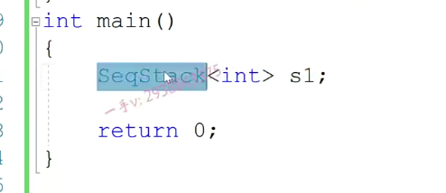

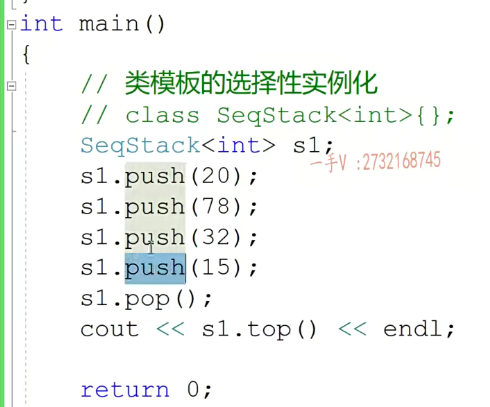

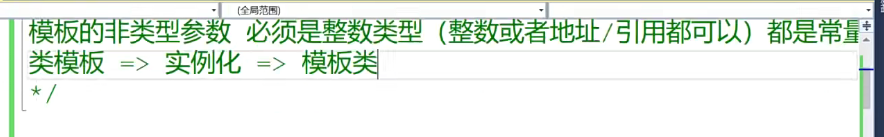

这现在是一个类模板。==类模板。这个地方是它的所谓的实例化==。啊，==实例调这个实例化的地方，实例化以后呢，就会产生这么一个东西。叫做模板类啊==。模板类是从一个模板实例化的一个类型。啊，是从一个模板实例化的一个类型。对的吧，是从一个模板实例化的类型啊。好，注意一下啊，

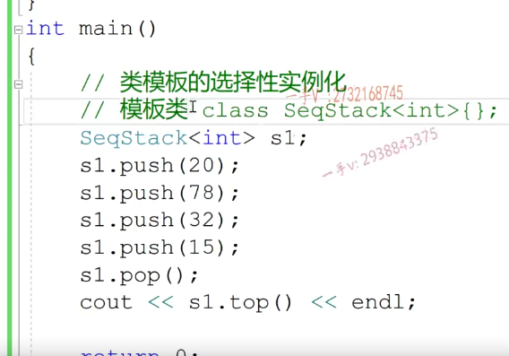

还比较好的一点呢，就是类模板可以去加类这个默认的这个类型参数的啊。默认的这个类型参数的。注意一下啊，默认的这个类型参数，这都是可以的，这都是可以的。OK了吧

### 加了默认值

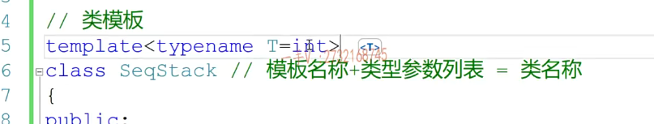

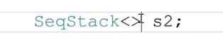