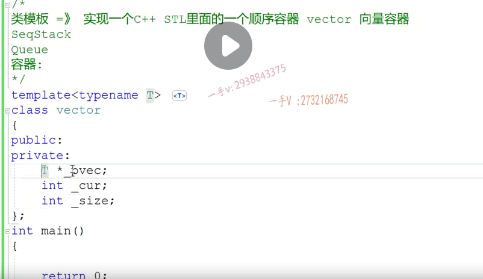

那么这节课我们类模板主要是想实现一个啊。

实现一个c++stl里面的一个。顺序啊，顺序容器顺序容器叫做vector，相信写过一些C++代码，用过一些C++stl里边类库的。呃，同学们应该都对这个vector并不陌生啊，我们把它经常叫做一个向量容器，对吧？那么，首先，容器这个概念是很好理解的啊，容器的这个概念是很好理解的，比如说我们。

这个杯子杯子就是一个容器啊，里边儿装水对吧？果篮儿就是个容器，里边儿装各种各样的，这个水果儿。我们之前写的这个。栈啊stack啊，还有这个队列啊，其实他们定义的这个对象啊，都叫做容器，他们定义的对象都叫做容器。啊，都可以叫做容器。

==容器类vector也是一个容器啊，叫向量容器==，那么通过它的这个容器的名字向量容器。我们应该就能知道它的底层==数据结构肯定也是一个数组嘛==，向量啊，==内存是连续的是不是，而它的内存是可扩容的==，

==二维扩容==，那其实写起来跟我们上节课写的这个站呢，区别不是很大啊，区别不是很大。

我们在实现一些跟这个向量容器啊。嗯，相关的一些常用的这个成员方法啊，我们再熟悉一下我们类模板的语法OK吧？好，那我们首先需要定一个模板类型参数啊，首先要定一个模板类型参数，

模板类型参数class。vector向量容器对吧？向量容器啊，底层是一个指针啊，_pvec。还有呢，一个指向当前就表示当前的有效元素的个数 _ cur 啊，因为要扩容呢，我们是不是在记录一个扩容内存的总长度 _size  

对吧，这个其实呢，跟我们上节课所讲的这个战呢，是一模一样的

但是我们更改一下我们,就像我们类库里边的vector实现的一样。它相当于呢，底层呢，维护的也是一个数组，但是它并不是用一个指针，两个整数来维护的啊，那这是数组的，整个的空间。那么这个空间呢？可能只放了我们一部分的，是不是数据啊？他用了三个指针

杠first呢，表示起始的位置啊，杠last呢，指向的是最后一个元素的，后继的这个位置的。地址，然后呢我们杠杠end呢,  _end表示是我们数组最后一个位置的后继位置的。这么一个地址OK吧，所以在这呢，我们给这个vector定义成三个。

那么大家来跟我看一下这个vector啊，vector构造函数在这里边。大家来看看啊vector构造函数，

我们呢，给它传一个size吧嗯，我们给它传一个size，这表示是什么东西呢？这表示的是相当于给我们底层默认开辟的这么一个空间，对吧啊？那在这儿呢我们？来看一下。我们该怎么去实现它们啊？

==杠first=newt中括号size是不是那杠last？那现在还没有有效元素呢，所以杠last就指向了杠first。这个空间的起始位置啊，然后杠n的就等于杠first加上这个size==。这个能够看明白吧？

==_end = _first +size   不包括first 自己  ，所以 _end指向最后一个元素后面一个==

然后还有它的析构啊VC vector析构的话，就把这个空间呢整个delete掉，因为。new的时候呢，这是一个数组的样子，对吧？所以delete的时候呢？呃delete跟指针的中间要加这个中括号，完了以后呢，我们可以把这个。啊，记住析构函数要加括号啊，完了我们把这个指针呢_last等于杠end给它都制成一个nullptr

#### 防止浅拷贝

很明显，这个容器类生成的容器对象啊，它的内存里边儿放的都是指针，要指向外部的空间的。对吧，所以呢，==这个对象发生的浅拷贝啊，肯定是有问题的，所以基于这一点，我们需要给他提供啊，这个拷贝构造函数啊，==拷贝构造函数。那么，注意我们上节课在讲类模板的时候说了啊，

#### 拷贝构造

第一步：

这现在vector只是一个模板名字啊，我们在这里边用函数名的时候，这函数名必须跟类名是一样的，那你类名呢？就得模板名加上监工2t。我们说啊，==构造跟析构函数的这个模板名后边加括号t是可以省略好吧，其他地方就不要省略啊，其他地方就不要省略了==
。

那么在这里边呢，实际上啊。==我要先根据你的空间大小，千万不要把他的这个。first last跟end赋给我当前对象的first last end，这样做的就是一个前拷贝了，（不能直接把别人对象的指针拿过来直接赋值，那样是浅拷贝）==

是不是我要根据你的大小啊？那么rhs引用的容器的这个。底层数组空间的大小是什么呀？那就肯定是rhs的n的减去什么rhs的。是不是first啊？这就是他的空间大小吧？对不对呢？哎，这是他空间大小啊。

==深拷贝：开辟新的内存，first指向新的内存==

这开辟空间了，开辟内存了，我们肯定是不是还得往里边拷贝数据啊啊？==拷贝数据是拷贝有效元素就行了，不用把整个空间的东西都拷贝过来啊，==没有意义。

所以在这里边儿呢，我们可能要定一个len ,拷贝的这个长度啊，==拷贝的长度那有效元素==，那就是。rhs的杠last-rhs的杠。first.

根据人家的啊，有效元素的个数。那么，现在再进行一个for循环inti=0 I小于len加加I那么？杠first中括号I=rhs的杠first中括号I。这是不是就把元素呢？我们就都复过来了，

复过来了以后呢？我们这个last啊，我们把这个last也复一下last=first，加上一个l有效元素的。个数嘛，对吧？end呢等于什么呀？first+1个上面那个size。按钮指向的是整个数组空间的末尾的后继位置，对吧？last指向的是最后一个有效元素的后继位置。OK的嘛，这是我们的拷贝构造啊，拷贝构造，

==更新一下其他指针==

#### 赋值重载函数

我们还要给他==提供这个赋值重载函数啊==，赋值重载函数方式，他们的赋值默认的赋值也是做一个浅拷贝。

==默认给的是浅拷贝==

我们应该做三件事情啊，之前我们都讲过先排除自负值return新this。完了以后把原来的这个空间呢，要释放掉，是不是剩下的就跟我们拷贝构造是不是一模一样了啊

==第三件事直接将拷贝构造代码复制过来==

最后加上

这个当前对象返回去，因为这个赋值要支持连续的赋值啊，这个我们在之前的这个OP基础的课程里边都给大家讲过了啊

在这儿呢，我们还想给大家提供一个方法。他的push back方法啊，push back方法vector的push back经常会用到啊，经常会用到这是向。向容器末尾添加元素啊，我们把这个参数也给人家写出来。对不对？

在这儿的话，我们==肯定是full了的==话，我们是不是要==expand呀？要扩容呢？是不是扩容好了以后呢？我们相当于就是给我们的last那个地方啊，赋一个value完了以后呢，再让我这个指针是不是加加往后跑一个呀==？

在这里边儿呢，是我们的pop back啊，pop back是干什么事情呢？pop back呢是从末尾删除元素啊。从容器末尾删除删除元素啊，从容器末尾删除元素，也就是说这里边是empty()的话呢，我们就什么也不做了。啊，否则的话呢，就return 。你删除元素，你注意啊，

注意从末尾删除元素在这里边呢，我们做的就是减减。杠last把这个指针呢往前倒退一下。没问题吧啊，这个指针往前倒退一下，

后继位置那么在这里边当删除一个元素的话呢？嗯，我last了就。变到这个地方啊，就变到这个地方，对不对啊？

就变到这个地方，相当于呢，最后一个有效的元素呢，就是这个位置。那相当于你就是把原来。把原来这个位置的这个元素呢？就删除掉了好吧，就不用它了，因为我们last放到这，==我们就访问不到它了==啊。

我还想提供一个back方法啊。这是干嘛用的呢？这是。

返回容器末尾的元素值啊，返回容器。末尾的这个元素的值。返回容器末尾的元素。变速的值。变错的值。好，那这在这里边，我直接返回一个新。这一定要是杠last- 1呢啊，因为last放的是最后一个有效元素的后继位置。对的吧啊，后继位置。要进行一个简易操作。啊，

简易操作，要不然呢？不能直接给last建议用啊！==last指向的这个地方呢？并不是我们有效元素的==，这个存储的有效元素好吧？嗯，好了，我们给这个vector提供了这么几个方法啊，

==ast其实也是最后一个有效元素的末尾==

当然在这里边还可以提供full。这是只读接口儿，所以我==写成const长方法，普通对象和长对象就都可以调了啊==，这个是return for的话是。last，

是不是等于这个end呀啊？然后呢？这个==empty是什么呀？empty是return。first.等于last，那相当于就没有有效元素嘛first=last如果满的话就last=end==了。

我们其实还可以提供size这个东西返回什么呀？返回呢？我们容器里边元素的个数。那这样的话，那这就是last减谁啊？减first。这是什么啊？

==last first last-first就是我们向量容器里边儿元素的个数==

last是指向有效元素的后一个，否则可能就是_last - first+1  ，==左闭右开，不需要加一==

我们应该还有一个函数没有实现是吧？嗯，这就是这个expand。扩容函数啊，扩容函数只是给我公有接口啊，内部的公有接口调用，

所以这个expand我们直接实现在这个私有的里边就行了啊。spend.啊，这个是什么东西呢？这个是。容器的2倍扩容。容器的2倍扩容啊，容器的2倍扩容操作接口啊，==容器的2倍扩容操作接口==

size等于这个是last啊，不应该是end。==现在last跟end一样，因为满了要扩容嘛==last跟end是不是肯定指向的是同一个位置啊？first啊，first。那么在这儿呢？我先开辟一个空间啊2×sis 2×sis，然后for循环I=0 I小于sis加加I。先进行数据的拷贝，对吧？

先进行数据的拷贝，对吧？这是我开辟的新内存嘛，把我老内存上的数据呢，一个for循环都往新内存上进行一个拷贝。对的吧啊，

老内存就是我杠first的中括号I吧。是不是然后再把老内存呢？给它怎么样啊？delete掉，然后呢？让我first呢？指向我们新内存的起始地址。这是我们新内存扩容以后的新内存，对吧？然后呢？这个杠last要等于杠first加上谁呀？加上这个size啊，杠n的等于杠first加上要二倍的，是不是size呀？或者在这里边杠n的等于last+size也行啊，

因为现在是二倍扩容了嘛，对吧？这些指针呢，都要指向新的内存了

这些指针都要重新去复制啊，来看一下这个扩容先计算了，我们要扩容的这个，原来这个内存的这个大小。啊原原来内存的大小。然后在这里边==new了一个二倍的==，这个大小的新空间。然后用于负循环，把原来老内存上这个指针指向老内存上的数据呢，==全部拷贝到我这个开辟的新内存上来==。啊，

然后==再把原来的内存释放掉==。==再让我的成员变量指向我们新的内存==，并做一个合适的，==正确的初始化操作啊==。好，那么这些。方法我们就实现完了

测试：

测试一下pop_back（)

==因为我现在从末尾输出，所以应该第一个去除了==，

==因为这里没有给随机种子，所以随机数每次都是一样的==

好，大家在这里边看一下啊，我们在这呢，我们就用我们的类模板啊，实现了一个这么一个容器类啊，容器类。vector.希望大家。把它理解一下啊，可以动手自己去写一下啊，可以大家可以动手自己去写一下。好，但是呢，这个容器实现的还不够充分，

它里边有很大的问题啊，它的问题呢，并不在于我们这里边哪块代码上的这个。呃，逻辑有错误啊，那么这个我们现在写的这个容器到底跟库里边的容器呢？还差什么还差什么东西啊？产一个非常重要的东西啊，非常重要的东西叫做。==空间配置器allocator==。那容器为什么要空间配置器啊那

#### 空间配置器

我们只有一个类型参数啊，对应的就是人家的这个杠ty，而人家还有一个模板类型参数呢，用的是默认的一个allocate是容器的空间配置器。容器为什么要空间配置器？不用空间配置器怎么样？

好，我们把这个放到下节课，主要呢还是围绕我们今天讲的这个vector，我们先给出问题啊。我们给出一些感触，给出问题点嗯，基于这个问题怎么解决呢？那就只能是使用容器的空间配置器来解决。啊好，那么对于这节课，大家先熟悉这个vector的这个书写。下节课我们再来讲容器，空间配置器相关的一些应用原理好。