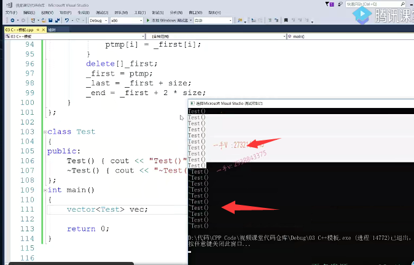

# 容器空间配置allocator

大家好，欢迎继续收看石磊老师的视频课程啊。那上一节课，我们用类模板实现了一下这个容器vector啊，这节课呢，我们来看一下，我们现在实现了这个vector。还有什么样的问题，我们演出来，我们容器的一个非常重要的这个部分啊，有控件配置器。

来回忆一下上节课所讲的这个victor啊，这是构造析构拷贝构造赋值还有。push back末尾添加元素pop back，从末尾删除元素，

还有是返回。末尾元素的值啊。for empty和size。呃，for empty size。那么在这呢，我们有三个成员，变量是三个指针啊，是三个指针。first last和end first指向的是我们。向量容器底层那个数组的动态开辟的堆上的那个数组的提示地址last是最后一个元素的后继位置。end是整个空间的容呃，数组空间的后续位置啊expand是容器的2倍扩容函数。好。我们来看一下啊，

我们来看一下。首先呢？这是我们定义了一个vector容器啊。从理论上来说呢，我们现在定义了一个容器，给里边并没有添加任何的东西。是不是啊啊？

那我们看一看啊，我们在这儿呢。定了一个test，这么一个类型啊test，这么一个类型。那么在这我们给他添加了这个。构造函数。构造函数我们加了一下，

打印啊，给构造函数加了一下打印。然后再给析构函数加一下这个打印啊，析构函数加一下打印。大家来看啊，我现在呢，用test这个类型实例化了一下，这个vector容器啊。==用test类型实例化了一下vector容器==。刚说了，这现在是定义了一个vector容器，我们没有给里边儿push过添加过任何东西啊。我们运行一下，我们这个代码看看。

这就是让我们非常头疼的地方啊，非常头疼的地方啊，为什么这么说呢？那在这儿看一下一个空容器，竟然给我构造了十个test对象。那出作用域虚构的时候呢？又去析构了十个。

test对象为什么是十个test？为什么构造这么多东西呢？我现在根本是定了一个空容区嘛，这里没没有放任何东西，你为什么要构造这么多对象？那么，同学们应该知道啊，在这呢，

我们调用vector的构造函数，在这里边，因为你用new操作。newt size.还是底里边构造啊，给每一个空间上可以构，那么在这里边我们用了这个new操作符啊。new一个数组啊哎，它不仅仅会开辟空间，还会去给它构造对象，对吧？按new。所以在这里边构造十个对象，但我请问大家，这对象是你想要的吗？

那比如说我们用户给传了一个1100万。那也就是说呢，我们只是定了一个容器，只是定了一个容器，对象在这里边儿都就要给我构造1000个test对象，一万个test对象。那么，出作用域又要去虚构1000次，虚构一万，这个不合理吧？是不是不合理啊？==这肯定不合理的啊，这是我们第一点问题。==

## 开辟内存与对象构造分开

在这里边呢，我们有这么一个需求啊，什么需求呢就是。==需要把内存开辟和对象构造分开处理。==当我定义容器这个对象的时候啊，在这里边呢，我底层应该只是开辟空间。应该只给容器底层这个数组开辟空间。啊，而不能去构造对象。==但这里边你要用new的话new把这两件事就一下做完了==。对不对？另外，析构的时候啊。你也不能啊，当然了，

因为这里边现在打印，因为我们构造了十个对象，到时候就要析构。

更重要的是，我们在vector的这个析构函数里边儿啊，你直接用了一个delete，那它相当于把这个first指针啊，指向的数组的每一个元素啊。都给你当做一个有效的test对象，给你析构一遍，

### 应该去析构容器有效的元素，而不是把每个元素当做test对象来析构

我们应该是什么操作呀？啊，我们应该怎么操作？我们应该是数组，你可能很长，

但是里边儿呢，可能就只有几个。里边可能就只有几个元素。对吧，里边可能就只有几个元素，那么你应该在容器不需要的时候把这有效的元素去析构掉。你有几个有效元素，你析构几次，然后把整个的数组内存是不是给释放掉啊？而你不能够用delete，你用delete的话，这是当于呢？嗯，是不是把这个？数组的每一个元素都当做一个test对象，

给你去析构啊。这个不正确啊。不正确。在这里边应该是析构容器有效的元素，然后释放整个容器底层的内存空间。

## 有效的元素

last到end是没用的

对不对啊？这个话不能这么说啊。析构容器有效的元素，然后。然后释放first指针。指向的。堆内存没问题吧啊，指向的这个堆内存。这个容器嘛，现在是容器的对象，

现在是三个成员变量。是杠first杠last。杠end那么现在指向了这个位置，是不是我们刚才？给大家举例子，后边全画满了啊，这个first现在实现的是这。这个last指向的是最后一个有效元素的后继位置。end指向的是这里。数组整个空间的后继位置对的吧啊，那应该delete的时候应该把这个指针指向的堆内存上有效的对象。析构掉，然后把整个的内存再释放掉啊

另外一个，我们来看一看这里边啊，当我们给。这里边添加一些对象啊，那我定义定义一些对象t1t2t3。我们加一些。横杠啊，加一些小横杠。横线，我们来。对比一下。这是把t1。t2.t3给它push进去了。完了以后呢，

我们还做了一个VC点pop back的动作。跟这我也加一个。

大家来想一下，你这个所谓的pop back。是怎么做的啊？还有你这个push back。按道理来说，我们这个push back呀，应该是容器，只有内存，只开辟了内存，没有在内存上构造过对象。当我不止back的时候，你用这里边的t1t2t3相当于呢？用t1在容器底层的内存某一个位置上构造了一个新对象，

只跟t1一样。唉，再用t2在容器底层的内存上构造了一个新的对象，跟值跟t2一样，再用t3在容器底层的某一块儿内存上构造了一个新的对象，值跟t3一样。

### 现在我们做的new 是已经放好了test对象

而现在不是，而现在因为你这个生成容器的时候呢，底层呢，用了一个new，所以在这里边儿，它相当于每一个位置都已经放了一个test对象，都已经放了一个test对象。啊而而而我们现在呢？而大家现在呢？

### 而我们push_back()感觉像是在赋值

在这里边呢？pushback t1t2t3相当于用一个t1给底层的这个test对象赋个值。赋个值。赋个值，赋个值。==这个逻辑不正确。是吧啊，逻辑不正确，==我底层应该容器生成的时候只有内存，而没有对象push back的时候应该直接是一个拷贝构造就完了。

### 我们现在写的pop_back()相当于last指针减减

### 下次添加相当于覆盖了，找不到之前的内存资源了

pop back.同学们想一想啊，这个容器呢？底层的这个对象很有可能啊，它占用外部资源了，就是这个test的对象啊，它有可能占用了外部资源。而我们现在所有的pop back的话呢，直接只是把last指针减减了一下啊，last指针指向这个地方。==相当于我们这个对象就访问不到了，下一次我们再给里边儿添加一个对象的话，我们把对象的值直接就写到这里边儿来了==。那么，我们这个test呢？原来外部的这个堆内存啊，内存资源。就找不着啦，因为它的指针被覆盖了嘛，对不对？

那实际上我们运行看一下。大家来看。

### 删除元素时，需要去析构这个对象

在pop back，在从容器中，真真正正去删除一个元素的时候。你有没有把那个对象给析构掉呢？你在删除这个test对象的时候，容器数组里边这个test对象的时候，==你有没有把这个对象析构掉呢？你必须得析构它，因为这个对象有可能占用了外部的资源==。你不能不管啊，==不能只把指针呢，从前往后移一下。==对的吧，不能把指针只能从把指针啊，应该是从后往前移一下。这个对象一定要虚构。

### 但是不能用delete 因为我们不希望数组的内存资源也释放

### 只希望删除这个对象的资源

### ==对象的析构和内存释放也要分开==

但是你不能用delete，你不能用delete去析构它啊，为什么呢？因为你delete析构，它delete还有不仅仅会调用这个对象的析构函数，它还做一个free操作。在这里边，我们从容器里边删除一个元素的话，应该只是析构这个对象并不释放。这个数组的堆内存对吧？因为这是我们容器的内存啊。所以在这里边pop back，

我们需要。需要这个是需要析构对象，也就是说。==只需要虚构虚构对象。你说我们要把要把这个对象的析构和内存释放，也分离开。==

很明显在这里边，==我们delete就把这两件事情做完了==。而在呢，这里呢，我们需要把内存开辟跟对象的构造分离开。

## new 把内存开辟和对象构造完成了

==这里边一个new把这两件事情就做完了==

所以我们在容器的这个开发过程中呢，我们是设计内存管理，我们是不可能直接用new。

或者delete。或者delete。那么大家看一下，通过我们这样的，刚刚才这样的一个事例讲解，不知道大家能不能把这个？容器现在所面临的问题了解的。核心的问题就是在使用上。啊，我们用了new跟delete。

## 总结

有问题再重复一遍。定义容器的时候。我们呢？应该只是。定了一个空容器，

里边没有，不应该包含任何的对象，但是它却构造了诗词，因为我们用new。从容器删除元素的时候呢，并没有如果里边放的是对象，你应该调用这个test对象的析构函数，一定要析构呢，因为这个对象有可能占用外部资源。对吧，现在没有这样的话，因为是我们没有写，我们给他加一个成员变量指针指向对象的一个资源，那么这个test对象就占用外部资源了。你再去把它从容器中删除的话呢？

test对象从容器中删除的话，一定要调用它的吸垢。啊，一定要调用，有一定要有析构这个对象调用它的析构函数啊。

好，这就是我们今天所要说的啊，容器的空间配置器。那么在这里边啊，我们容器容器的空间配置器啊。容器的这个空间配置器。这个allocator。无非呢，就是做三件事。做四件事，

应该是做四件事。做四件事情，就是把就是内存开辟啊。内存释放。对象。对象构造。和对象析构。啊，对象构造和对象析构。

你看呢，在这里边，我先把这个。拷贝下来好的吧，一会我们把我们的代码用空间配置器改造完了以后呢，我们再搁。这个呢，进行一个对比啊。

## 实现空间配置器

好，那我们来实现一个自己的控件配置器，大家看到啊CA加标准库里边也实现了一个名字叫allocated的控件配置器。那么，为了跟人家区分一下，我们稍微改改名字叫做class，我们写个大写的吧CA qr。注意，虽然我们名字呢，跟库里边儿呢，我们用了一个大写，但是它里边儿的方法，我们采用的都是一模一样啊，

方法采用的都是一模一样

### 1.负责内存开辟

在这里边，首先内存开辟啊。叫做allocate。size杠t是一个on size in t类型size。这是根据内存大小呢，来开辟空间的啊，根据内存大小来开辟空间的，所以是负责内存开辟啊。负责。开辟内存或者负责内存开辟啊，那负责内存开辟呢，那我们肯定都知道用mo loc呗。是不是这还用说？只只做内存开辟嘛size of t，

这是一个类型的大小。啊，这是给个个数就行了，那我总共开辟的内内存大小是不是就这么大？

### 2.负责内存释放

另外一个day allocate。cate they allocate.啊，这是干什么的？这是负责内存释放啊，负责这个内存释放。这里边做的事情呢，就是free。内存释放只负责内存释放free。

### 3.负责对象构造

### 我们指定的地址里边，构造一个值为value的对象

对象构造对象构造就是construct。啊，

在我们指定的地址里边，构造一个值为value的对象啊。这个是专门负责对象构造，叫做construct，大家注意这些方法，到时候我们在使用到在我们面试过程中呢，我们如果谈到容器的空间配置器的时候呢？C++库里边儿默认实现了一个名字叫做allocator的空间配置器，你看我们用户可以不用传，因为这个空间配置器这个采用的啊，默认采用的都是我们C++库提供的，这个allocator。对吧，它有四个重要的方法。

allocator deallocate。应该是allocate啊，开辟内存de locate construct这里边儿呢，是在已经存在的一个开辟好的内存上去，构造一个值为value的对象。在这边注意一下，这里边我们采用的是定位new啊，定位new。跟目前new不一样的地方是所谓的，这里边所谓的这个定位new啊，是在我们指定的内存上。指定的内存上。去构造一个值为value的对象，这会调用啊，我们t类型对象的一个拷贝构造。

好的吧啊，这是定位new。

### 定位new

### 4.负责对象析构

大家注意一下，另外一个就是destroy destroy。这个是负责对象析构啊，负责对象析构。把p这个指针指向的对象析构掉。析构函数一般跟这个类的名称是不是一样啊？这里边t是类型嘛啊，那我们给t的前边呢？加一个波浪号。这个是不是就代表？就这个东西啊，这个东西就。

代表了啊t->p类型的析构函数啊，那这相当于就调用了p指向的对象的析构函数。就只负责对象的这个析构，

### 看来T应该是一个类名

这个是负责对象的构造。大家看一下我们现在呢，就把这个。空间配置器就定义完了啊。

啊，定义自己的定义容器的空间配置器。和C++标准库的allocator实现一样啊，它们默认的内存管理呢，都是用malloc跟free。

我们还可以采用内存池的方式呢啊，来实现在我的CA加进阶呃课程的这个视频课程里边呢，我们会给大家剖析一下stl的。==二级空间配置器的这个内存池的这么一个实现==。到时候请大家呢？可以继续留意一下啊。好，

那我们现在要把这个空间。添加到我们的这个vector上来，对吧？那我们我们需要给vector呢？再添加一个新的。allocator啊，那你要听他这么一个参数的话，

模板类型参数。那么，用户使用这个vector的时候，是不是就得用这个a lock呀啊？就得给a lock指定一个。那么，在这里边儿，我们可以免了让用户指定，因为大部分我们这个allocator都已经够用了啊。千万不要光给个allocator，这里边儿是类型参数，需要一个类型，而你这只是一个模板名称好吧。所以后边儿也要加上尖括号t。这个按模板名称加上尖括号。

参数列表就构成我们一个类型了，这个t呢，用的是我们前边定的这个t可以直接用起来。

好，那我们现在呢？给我们这个容器呢啊，给我们这个容器就可以添加一个新的成员变量叫做。allocator就是定义容器的空间配置器对象。啊。allocator你如果用户不传的话，默认用的就是这个allocate好吧？我们可以公布一个参数啊，我们可以公布一个参数啊，或者说是我们也不用让用户自己传递了吧，你要让用户自己传递也行啊。

就是说const。const.a lock对吧all oc啊，这个你如果。啊，你让人家用户默认用这个就行了。

当然，你也可以从外边传进来啊。你是不是也可以从外边传进来啊？对啊，用起来呢，就是像这样一样qr。all oc.哎，外部用户呢，

可以传一个自定义的这个。allocator进来，把我的底层的成员变量allocator是不是初始化一下？那现在我们简单一点，我们就不需要传递了，我们直接用我们默认的这个。

### 用空间配置器来改造之前实现的vector

现在改造一下啊，把我们的代码就在这里边，我们不能够直接通过new开辟空间了。你给我开辟空间，你还给我，我每一个这个数组的元素上都给我构造一个test对象，我不需要那么多无效的对象，所以在这里边儿呢。

down first等于。哎，容器底层所有的内存管理内存，开辟内存释放对象构造系统。现在都通过我们的空间配置器来啊，开闭内存allocate。是不是多少？给个数量就行了size就行了啊，我们elegant呢，下边呢会给这个size乘以个size of t。这个就只实现了开辟空间了。

大家看一看。能不能理解现在呢？就是。说容器啊。

容器底层。啊。==内存开辟。内存释放，对象构造和析构都通过allocator空间配置器来实现==啊，都通过这个allocator空间配置器来实现。

### 析构还是用allocator实现，而不是直接去delete

### 析构有效元素

析构的话不能这么做了。我们说你应该析构有效的，

是不是元素啊？先for循环inti=0啊，或者说是通过我们指针来进行p。等于啊杠first对吧？然后p呢？不等于啊杠last。啊p不等于杠last。然后在这里边儿加加p。到last才是有效元素嘛，不能到end不能等那一团，试图把我们。first指向的数组的每一个元素都当做一个test对象去给我析构，我没有，我不一定有那么多有效对象，对吧？先析构对象在这里边儿，通过allocate allocator是吧的析构dst Roy。

==只要给我一个正确的对象的地址就行了==。这里边就是p了。IP从first指针遍历到last对吧？因为last前一个刚好不用变last，last是最后一个有效元素的后继位置。

唉，这个就是。把。first.first，指针指向的数组的有效。元素进行什么析构操作？没问题了吧，

### 析构有效的对象后，释放数组堆上内存

然后再干嘛呀？释放整个内存。d把谁传进来呀？first传进来，这就干嘛呢？释放。啊，

释放。堆上的数组内存啊，释放堆上的数组内存。好吧，然后我们可以把三个值针呢都制成nullptr。一个好的习惯，是不是在这你看跟我刚才做的，我应该是把。

有效的对象先析构，然后再把整个数组内存释放。这是我们容器里边实现的.

### 使用allocator改造构造函数

构造函数

必须的啊。好了，这个是拷贝构造，唉，

在这我们需要。看一下，这只是开辟空间，对吧？allocate cap allocate.长度是多长呢？size这里边size对吧？在这里边就不是说是赋值了，我现在是一个。==刚开辟好的空间，你需要拿你啊，在我开辟好的这个空间上啊。去给我直接构造对象就行了==。没有问题吧，

去给我直接构造对象就可以了。啊，好了，在这里边，我们用长度也依然可以啊，用长度依然可以，我们来。把这个。我们不删代码，把这个代码留到这，方便大家查看啊。allocator点。这是要在已有的内存上构造对象，那就是construct是不是啊？内存地址是什么？

内存地址就是first+I呗？那具体的数据是多少？具体的数据呢？就是构造一个有rhs引用的。呃，这个。容器的底层数组的di后元素。

### 赋值运算符

好的吧。这个是赋值，

是赋值，这个也不正确呀，这个你不能delete呀，跟我们的析构一样，唉。跟我们的析构是一样的，你应该是在这里边啊把。因为赋值模式，我两个容器都已经存在了，这个应该是不是先把当前容器啊？里边的有效的对象先析构掉。对吧，再把我们当前容器的内存全部释放掉。然后干嘛呢？然后重新开辟空间，

那这一部分呢？就跟我们的。这个拷贝构造是不一样的啦。大家注意一下，这里边的这个实线啊。

###  push_back()函数

push back。可不是这个样子了，push back。push back现在的意思是，在last指针指针指向的内存构造一个值为。value的是不是对象啊？你应该用的是allocator的construct，在我杠last这个地方构造一个值为value的对象，这样才是正确的。

啊，这样才是正确的。做完以后呢，让我这个last指针做一个加加操作。

### pop_back()函数

删除你也不能这样做，对不对？你应该不仅要把杠last指针。呃，减减。还需要虚构。删除的元素，所以在这里边应该是啊，==你也可以先减减减的话last刚好就指向。你原来末尾那个元素了，因为last指向的是后继位置嘛==，

是吧？然后呢alocatolk it。是虚构，是不是destroy？杠last。okay了，注意一下顺序啊，注意一下顺序，这个才正确，==一定要析构对象呢==。这些东西都不用改

## 扩容操作

另外一个就是我们的扩容啊，扩容在这里边不能这么写了，扩容我先是要。开辟空间，

你不需要在我这空间上给我构造那么多t类型无效的对象，对吧？点allocate allocate开辟空间2×size大小的空间。然后在这里边是构造。all ct or点construct。在哪里呢？ttmp+I这第一个是需要一个地址，在这个地址上构造值为。这个的对象。是不是这个我就不删除了，就放到这里边，大家可以通过对比来看一下我们为什么要这样修改？然后在这里面不能直接delete，是不是不能直接delete你看for循环啊？我应该把有效的元素先要进行析构，

不能够直接去delete，相当于把first指向数组每一个元素都当做一个有效对象进行析构。都会调用他们的析构函数啊，在这里边应该是p=firstp不等于杠last加加p在这里边呢，先杠aloctor。点。是虚构destroy destroy。p完了以后呢？teal locator的day allocate。把first指针指向的内存呢给释放掉。然后让我指针指向新的这个内存块儿e last跟end也重新进行初始化。啊，这才是一个正确。

我们来看一下我们的这个修改完了以后就是我们采用了空间配置器实现的，我们这个容器。到底符不符合我们的这个要求呢？重新生成一下，我们的这块的代码啊，哎呦，有点问题啊。嗯，destroy啊。我们在这里边儿直接用s定义我们这个空间配置器吧啊，这是公有的跟库里边儿一样，这些方法都是在我们外部容器中直接可以调用的啊。==class没有写限限定符，默认就是私有的==，是不是啊？

好了，现在我

们编译通过，我们直接来运行。

啊，大家来看。现在是不是跟我们预想的一样了？这三个构造是我们test t1t2t3，这个构造肯定会大于。大家现在来看一下啊，在这里边vec。vec在这里边会调用我们test对象的拷贝构造哦，我们没有给test对象打印拷贝构造，我一会来打印一下啊。在这里边儿，大家看pop back的时候有没有调用我们test对象的一个析构函数呢？

有没有有这就正确？这是不是就正确了啊？

最后的这三个析构是我们刚开始站上的t1t2t3，那还多的这两个析构是谁呢？哎，这两个析构就是我们刚抛500克嘛，它相当于把t3这个对象给析构了。啊，现在这两个析构就是析构t1跟t2的，没有任何的问题。是不是没有任何的问题啊？

现在我把这个test。的这个拷贝构造呢，也给大家打印一下啊const。大家来看这里边呢？

三个这t1t2t3容器定义容器的时候，它底层只开辟了内存，没有构造任何无效的对象，这是正确。当push_back三个对象的时候，你看应该在底层呢，用t1在我vector的底层的某一个内存上拷贝构造了一个新的对象，只跟t1t2t3同理。pop_back()的时候把t3给吸够了，出作用域容器里边儿的t2t1对象吸够，然后栈上t3t2t1，依次进行吸够。跟刚才比。是不是我们现在用容器的空间配置器做的才是正确的事情啊，要不然你这么多对象的构造虚构。

嗯，你这效率也太低了吧？是不是效率也太低了？而且你不正确呀，不正确。尤其从容器删除元素的时候，你根本就没有调用。容器里边儿对象的这个析构函数，你有问题的，万一这个对象呢，占用了外部资源，你岂不是把外部资源就丢了吗

# 总结

啊好。那么，通过这一节课的讲解呢？

我们主要给大家说明了==容器空间配置器的重要性==。容器没有空间配置器是绝对不行的啊，==空间配置器主要给容器就做了这四个操作的分离==。注意一下，体会一下啊，在我们后边呢，我们在涉及到这些内容的时候呢，希望大家呢啊，不要忘记啊，不要忘记。容器空间配置器allocator。

好，不管是我们顺序容器vector，还是我们其他的像deque list有关联容器，

对吧啊？有序关联容器跟无序关联容器。只要你是容器，你空间配置器就离不开的啊，离不开的allocator，好希望大家一定要好好。注意一下好吧啊，把空间配置器好好理解，我们在真真正正写容器代码的时候。对于内存的开辟，释放对象的构造，析构都是通过空间配置器来的。

==不再是我们原来的啊new跟delete直接在代码上裸奔啊==。

==尤其是添加元素释放这个删除元素的时候。我们通过空间配置器是怎么去控制==的？

好，那我们这节课的内容就讲到这里，希望大家呢好好的去把它理解一下啊，自己动手多写一写。

