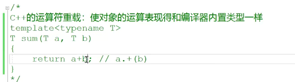

# 运算符重载：

重载。这个CA加载这个运算符重载呢，它有什么一个呃意义呢啊，我们来看一下CA的运算符重载它的意义是是使。啊，对象的运算啊，运算表现的和。这个编译器内置类型一样。你说重载有什么好处呢？对吧啊？重载的好处你一般你看不出来，

但是呢，你就像我们刚学的模板代码。那么。大家来看一下，我这里边儿写了一个sum函数，但是这个sum函数跟我们以前不一样的地方在于这个AB啊。这两个变量的类型啊。都没有指定的类型，都是我们用的这个类型参数来定的一个类型啊，就是它可以是任意我们用户实例化的这个类型。那么，在这里边儿，我们如果做a+b的话a+b操作的话呢？做a+b操作的话。啊，

那么如果这是个编译器的，这个内置类型的话，那在这里边a+b编译器自己是可以做的。对的吧啊，但是如果这里边AB这个t类型啊，如果是一个对象类型的话。那么，也就意味着AA跟b它是两个对象。那对象跟对象之间该怎么相加呢？对象跟对象之间该怎么相加？啊。那编译器它是不知道对象跟对象之间怎么相加的，那这里边就要用到运算符重载了

加一个operator啊，这个operator加合起来呢，就是它所谓的成员方法。啊，就是加法运算符的重载函数。好的吧，那么这是运算符重载的这个第一节课，我们就以一个复数类啊，复数类来给大家讲解一下，我们运算符重载一些。基本的大家需要了解掌握的内容啊。

先写成一个普通的类，不写成类模板啊，对于一个复数类来说呢，它有实部跟虚部对吧？我们都写成一个int吧啊，都写成一个intm real跟m image，那在这里边儿呢？

我们有一个。有一个构造函数可以传一个r，再传一个I。那我们在这里边儿给一个。00啊，就是实部是零，虚部也是零的，这么一个默认值啊，然后用这个参数的r给m real初始化，然后再用这个I给。image进行一个初始化。OK了，这是它的构造函数啊，这是它构造函数，那么也就是说我们可以在我们幂函数里边儿啊。

定义两个复数类出来，这是定义两个复数类出来啊，这是实部跟虚部都是实。这个呢是？实部跟虚部呢，都是22时。啊，没有问题吧？那我们如果现在想做这样的一个操作呢？就是com 3=com 1+com 2，

com 3=com 1+com 2，啊，那这个是什么意思呢？comp+comp 2。就是两个复数类对象的相加。那编辑肯定是不知道这两个对象怎么相加的。

啊，那编译器怎么去解释这段话呢？在这里边就试图啊去找看左边的这个符号，这个加法，==这个符号运算符啊，左边的这个对象。有没有啊？它有没有一个成员方法叫做加号方法==啊，然后呢，==把com 2当做呢实参呢传进来，当然了，这个函数名不能叫加号了，对吧？它给这所有运算符前面都加一个关键字，叫做operator==。

这个就是所谓的复数类对象呢。加法运算符的重载函数啊，叫加法运算符的重载函数。这叫加法运算符的重载函数

这个加法运算符的，==它的这个返回值。需不需要的？需要的，因为他要把一个返回值呢赋给一个另外一个complex类似性的一个对象==，所以呢，==这个加法运算符重载函数呢，也必须得返回一个复数类==。叫做complex operator加对吧？

因为你这个实参呢，因为你在这里边这个实参传递的也是一个啥东西啊？==实参传递的是不是也是一个附属类对象啊？所以在这儿我要用一个引用来接收它啊。引用来接收它com。==

不可能加数跟被加数是不变的，对吧？所以呢，在这里边儿呢？我们。需要定义一个新对象啊，这个新对象的十步呢，就等于我当前对象的这个十步，加上我com对象的是不是实部啊？

啊，这个当。这个comp。啊，我们在这儿区分一下吧，好吧，定义的这个变量名字有点太像了啊。这个comp的这个虚部等于当前对象的这个虚部，再加上src的。这个虚部，然后又然后呢？把comp是不是再返回去呀啊？把comp再返回回去。把comp再返回去。

#### 思考能否返回引用？

==我是生成了一新对象，注意当我们返回一个对象的时候，它的造价是很大的，所以我们一般考虑呢，还能不能返回对象的引用对吧？==

但是很明显返回对象的引用就是返回对象的指针。==我们应该保证啊，当这个函数运行完以后啊，这个对象呢，它的内存还是依然存在的，否则我们就不能去返回它的指针或者引用。那就不安全。==

那我们看你这个靠谱对象呢，是一个你这个函数的局部对象，那也就是说随着你这个函数运行完战争回退，你这个对象本身的内存是不是也交给系统了？啊，

所以==你千万不能返回一个局部变量或局部对象的指针，或者引用只能像上面这样写==

#### 优化

我们有一些同学呢，唉，如果==理解我们对象的优化==啊，那他可能写出来更优秀的一些代码。return complex在这里边儿，this在这里边儿就是当前对象的。十步加上src的十步。啊，那当前对象的虚部，再加上src的。虚部。没有问题吧？

啊，看看它就是这个样子的啊，它就这个样子的，跟上面比的话呢，==它会少一个我们临时对象的构造跟析构。效率是比较高的==，至于这部分对象的优化啊，以及对象在我们函数调用过程中啊，那个背后呢，都调用哪些函数？哪些函数是可以优化掉的？啊，请大家可以留意那个石磊老师的这个视频课程C++进阶课程部分的内容啊。

输出30 30

那在这里边儿呢，我们再来看一下complex comp comp 4=comp 1，加上一个20。这个。是什么意思呢？大家来想一想，这个是什么意思？

这个呢，我们的本意呢，就是想让啊。把它这个20呢加到我们comp 1啊，跟我们comp 1相加。啊，==这个20呢，就相当于作为一个复数的一个实部存在==了，然后首先考虑一下，看这个能不能编译通过啊？

==可以直接写成这样，因为本身就是这样调用的==

我能不能把一个整数呢？转成复数类型的。啊，把一个整数转成复数类型，那我们编辑就会在复数里边复数，这个类里边找啊。我们这个复数类有没有提供一个带整形参数的构造函数啊？带整形参数的构造函数。这样呢，他就可以把一个整数转成这个复数类型了，complex类型了啊，转成complex类型了。就是所谓的生成临时对象。没问题吧，==生成临时对象==，

#### 临时对象

==20可以当成临时的生成对象==

为什么可以当成临时对象？

刚才20生成临时对象的原因是什么？==20生成临时对象是因为左边儿complex调用了中间这个加法运算符，重载把20当做实参传到这里了，==

那么人家的形参类型是一个当前复数类型的一个引用变量。==它要引用一个整数，这是引用不了的，你要引用左右两边儿这个类型肯定是一样的==，

所以在这里边儿涉及一个实参的类型到形参类型的一个类型，==转换类型强转==。哎，==这个整型怎么转成complex复数类型呢？那么编译器才去找看我复数类型有没有带整型参数的构造函数==？来生成一个临时对象。没问题吧啊。

因为这里边儿我们这样写一个构造函数相当于。不带参数也能构造，不带参数相当于这两个字是整形参数呢，都有默认值了嘛，或者是我们带一个整形参数，而是。唉，这里边相当于给r传了，给实部传了，给虚部没有传虚部，就用默认值，或者说是我们这样也可以构造，就是我们的实部跟虚部，

我们都传了相应的值了。对不对啊？实部跟虚部我们都传了相应的值了。都传了相应的值了。啊，大家。考虑一下，我们==写了这么一个构造函数，相当于可以构造三种不同的==，这个复数对象啊，构造三种不同的，这个复数对象。

==带有默认值的构造函数===

但是呢，在这里边儿30在这里边儿没有任何的。趋势需要做一个类型转换了，

所以在这儿我们==编译器没有理由去看见这个整数。就做类型转换==，否则在这里边儿，我想做一个嗯，我想做一个10+20，我都做不了了，为什么？因为他只要看见整数，他就给我进行。类型转换把整数给我转成复数类类型。这个不正确吧，肯定不正确，所以在这里边，我们直接去运行，这个的话我们看到啊。

我们看到。它这里边没有找到接受complex类型的全局啊，全局运算符。反正这个是无论如何，这个是编译不过。==30不可能在这里边儿进行一个引这个临时对象的生成的==，==因为在这里边儿没有。任何地方说是要把整形是不是转成辅助类类型啊啊没有的？没有把整型转成复数类类型的，这样的一个需求==。

那么注意一下，在这里边我们看到啊，编译器做对象运算的时候会。==调用用对象的运算符重载函数，重载函数，那么这个函数呢？就是优先必用==。成员方法。如果没有成员方法。

==没有就在全局作用域。找合适的运算符，重载函数啊，它就在全局作用域。==

去找这个合适的运算符，重载函数了啊，就在全局作用域，找合适的运算符，重载函数。现在很显然，我们这个里这个运算符左边是个30啊。所以这里边儿根本就无法调用到我们的这个成员方法，==这个加法运算不同的函数。所以编译器呢，也不会去考虑呢，我们成员方法的这个加法运算不重载==。那怎么办呢？因为呢？它除了找我们对象的成员方法，

==有没有合适的运算符重载它还会去全局呢？去找我们全局有没有合适的运算符==，重载函数，所以在这里边呢，唉，我们可以在==全局提供一个加法运算补充的==，也就是说这里边儿就变成了什么样子的呢啊？

==这是个全局函数，就是类外边儿的函数，你能不能在类外边儿的函数里边儿访问对象的私有成员变量呢==？这不行的是吧？有些同学说那我给这。==辅助类里边儿提供get rail跟get image的方法。公有方法在这里边儿，通过这样公有方法来访问他们的实部跟虚部，这可不可以呢？这当然也是可以的==，但是我们还有一种比较简便的方法呢。就是说呢，定一个友元函数。

#### 友元函数

友元函数friend。这意思什么呢？就是我这个全局的方法成为你这个类的朋友了吗？是朋友的话呢，我就能够。访问一下你的这个。实部跟虚部了嘛？对吧，是朋友的话，我就能够访问一下你的这个实部跟虚部了。对不对的啊？就能够访问你的real跟image。

大家看到现在最后一个30加上complex1？啊，在这里边儿这个就会调用呢，全局的方法，全局的方法，把30传给lhs。那就是把整形转成complain，你看这里边儿==涉及类型转换了==，它===需要把30这个实参的整形类型转成形参的这个复数类类型==。

在这里边儿，它就会怎么怎么做呢？

#### 整形 类型转化为  复数类型

==它就会看我们复数类类型呢，有没有一个带整型参数的构造函数？来生成一个临时对象==，让lhs引用。那它就生成了一个实部是30虚部是零的，这么一个临时对象了，对吧啊？rhs呢？引用的是com 1啊，引用的是com 1，

上面儿complex三跟complex四后边儿的这两个加法呢？

因为左边儿是对象。所以==它优先调用成员方法就是优先调用这个成员方法的，这个加法运算符重载==，

### 有了全局，将局部去掉

就是既然已经有全局的了，在这儿我们其实可以把这个局部的呢都给它怎么样啊？把这个局部的我们都可以给它。屏蔽掉啊，我们这个代码毙掉对吧？我们直接用全局的就行了，这个全局的就比较强大了，不仅仅可以做对象，跟对象的运算，还可以做对象，

跟整数的运算，还可以做整数，跟对象的运算

改成直接这样看，不需要使用成员方法

==重载编器去匹配的时候先优先匹配成员方法，成员方法没有合适的重载呢。再去匹配我们。全局的运算符的重载函数啊。==

### 前置++和后置++的重载

如果我们只写这么一个函数的话，

==我们根本就不知道这是做前置加加还是后置加加的==？对吧，那我们CA加规则上给我们这样的一个规则就是呢啊，你还可以提供一个带整形参数的。加价运算和重载函数这个整形参数没有任何的用处啊，没有任何的用处，你你不用这个参数，本身这个参数仅仅就是为了区分跟这不带参数的加价运算和重载函数，一个重载的关系。它们俩是一个重载的关系，那只要是C++编译器，在看到这个运算符重载的时候，他看到如果这个括号呢，==它没有参数，那这就是一个前置的。这就是一个前置的操作==。加加运算符的重载啊，==不带参数的就是前置加加。带一个整形参数的呢，这个就是。后置加价==。

#### 后置++ 和前置++都需要返回值

==这个后置加加运算符呢，应该也要返回值==的，是不是返回它原？原来的旧址，那也就是说呢，它应该是这么一个操作。这么一个函数，

而==前值加加呢？也要返回一个值返回加完以后的值==是吧？这个是不太整洁，也不是compare啊，sorry。operator加加不带整形参数的

complex operator，加加这个是整数，那么注意啊，==这个做的是返回它的旧值==啊，那就complex先。==保留他的旧值==嗯，然后呢，再把人家当前对象本身的这个。==实部加等一再把虚部加等一再返回原来的旧值==。
对着呢吧唉complex operator operator加加不带参数的加加运算符的重载啊。

那在这里边呢？呃，那就是==先加呗，先加的就是m real加等1m image加等。一然后呢？return this==，这次把对象本身呢？给我们返回回去。对了吗？== * this可不是这个函数的局部对象 ==

==*this 是和对象一起存在的，我们可以返回引用==

星this还是存在的，所以我们应该给返回值呢？加一个。引用啊，加一个引用。返回呢。复数对象类型的这么一个引用。

效率就高，不用产生临时对象。啊，没问题吧？而这个呢是不行的，因为这是个局部对象，这个函数完了，这个靠谱内存也没了，你不能把它的地址。带回去带出去对吧？但是呢，虽然呢，不能返回引用，但是我们。知道我们对象优化的同学呢，

#### 后置++优化写法

应该就不会写。这么一个。局部对象的代码了，应该人家是只会直接会写这样的一个函数吧，哎，I'm real这个加加I'm image加加。唉，人家写这么一个函数，==也是把原来老对象的值返回回去，完了以后rio跟MH进行加加，==

==少了一个我们com对象的构造跟析构的过程==。这里边儿还是涉及一样，是跟我们刚才那个写代码一样，涉及对象的优化，请大家留意c加进阶课程的内容啊，部分内容。

==减减运算符重载==是不是道理也是一样的了？啊，道理也是一样的。

okay吧，道理也是一样的。好，请大家仔细的去理解一下刚才所说的内容啊，

#### +=运算符

在这里边儿呢，我们还可以给它提供更多的，比如说是。==加等com 2==，这叫复合复制运算符对吧？复合复制运算符，这相当于把com 2的实部跟虚部啊。都加到com 1身上去，这个相当于就是com 1调用了它的。加等运算符的重载函数呢，

然后在这里边儿把com 2当做实参，是不是传进来了？当然你也可以写成一个全局方法，因为呢，我们编译器啊。首先，优先找的是对象的成员方法，成员方法没有相应的运算符，重载它就会去全局去找合适的运算符，重载那你可以在全局去提供一个。加等那这样一来呢，全局的方法不需要有对象来调，所以呢，除了这个运算符，剩下的com 1跟com 2都当做实参传进来了。

是不是啊？那我们在这里边只用到了count加对象加等另外一个对复数对象啊

==我们就写到成员函数==，也可以写成全局

加等运算符的重载函数，那减等乘等除等。啊，那应该都是一样的，对吧啊，应该都是一样的。都是一样。

## 模板写法

比如说我们写了一个show啊，在里边儿ta。那你看啊，我但我在这里边儿相当于就是我接收一个对象，或者接收一个变量，然后在这个受函数里边儿进行一个统一的一个打印。那我模板代码这样写的，我作为模板代码的开发者，在这里边儿我并不知道将来用户会给这个t。

用什么类型给它实例化？==如果是用整形实例化的话，那在这里边儿是这个直接打印一个整形==，这是没有任何问题的，但是==万一用户在这里边儿用了一个自定义的类类型，比如说complex==。那这相当于就是一个。complex对象呢？那在这如何用cout的去打印一个complex对象呢？怎么打印呢？如何在这里边儿用sell打印一个complex对象？能打印吗？打印不了。而且我也我们也不知道这个类型呃，

那有人说是在这里边儿，

因为复数对象提供这个show了我们在这里边儿能不能去用a调用一下show啊？这个你觉得妥吗？这肯定也不妥啊，对吧？==我们哪知道人家这个用户给这个t实例化类型里边有没有show方法==呀？我们根本不知道啊

所以呢，为了达到通用，就是让对象的表现形式，这个是什么表现形式啊啊？就是对象。信息的是不是输出啊？哎，让对象呢这个打印。跟我们内置类型一样，

也就是说你最好是给我支持这样的打印。最好是给我支持这样的打印see out打印call on b。哎，这是这样打印，那就。太好了，那我将来我打印的这个对象跟打印内置类型是不是都一模一样啊？你就是写模板代码，你在这里边打印这个。用模板类型参数定义的对象a，那也没有关系啊，如果你是内置类型编译器，会直接打印，如果说是你是自定义的对象啊。呃。

我只要呢，==给对象提供相应的输出运算符的重载函数==。那我们这个对象。也是可以用我们标准的输出流来直接输出到我们的屏幕上啊，就是我们的控制台应用程序上就那个黑屏黑框上。对的吧啊。大家。理解一下啊，大家理解一下。大家把它理解一下啊，理解一下

### 输出运算符重载

输出运算符重载函数啊，==对象没有在左边。所以不可能提供成成员方法==，因为你要提供成成员方法对象。应该需要在左边，你左边儿的对象定相应运算符的重载函数，把右边儿的对象当做实参传进去了。对不对的啊？那在这儿呢？我们只能把这个==输出运算符提供成全局方法==了，那提供成全局方法，这个全局方法就不需要什么对象来调了啊

这个函数要不要返回值呢？是要的，你不能给它返回void，你要返回void的话呢，那它就会拿这个函数返回void继续往输出缓冲区里边放一个end l。那这个肯定是不行的吧啊，这个肯定是不行的。那word是无法把这个end l放到输出流里边的，那也就是说，

为了进行连续的输出，我们应该。最后呢，这个运行完了，应该把这个cout ，cout再继续返回。是吧

STD里边的o stream类型啊o stream引用。输出运算符重载o stream啊out在这里边儿，可不要给这个留对象前面加个const啊，留对象留里边儿不断放东西，不断从流里边儿取东西，那流是不断变化的。不能加const OK吧？const意味着就是硫不能变了啊，

==ostream不能加const,流是会改变的==

#### 重载 输出运算符

### 输入运算符重载

？

