### 输入运算符的重载

输入运算符的重载，对吧？那同样呢？在这里边，我们直接提供一个输入运算符的重置In stream引用。

好printer输入运算符  In  stream，==注意流，不要用流的参数，不要用const修饰OK吧==？流是不断变化。这是输入在这边儿，我们肯定要改变src所引用的对象，所以在这里边儿啊，这个形参呢，

也不要再加count了OK？唉，这个不能起out，这个应该起in是吧？这个in呢，就是我们在这里边的这个cin好吧？ce那么在这儿呢就是。输入一个src的。十步再输入一个src的MA位置。是不是虚部啊？return in啊return in把这个输入流呢？返回回去，把输入流呢，返回回去。那当然，

在这里边儿，你访问了src的私有成员变量，所以在这儿呢，需要把这个依然定义成。友元啊

重载运算符，不代表之前的运算符不能用，我们就是用之前的运算符，去完成现在的对象的运算

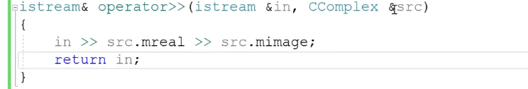

定义成友元

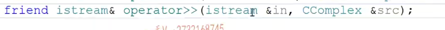

效果：

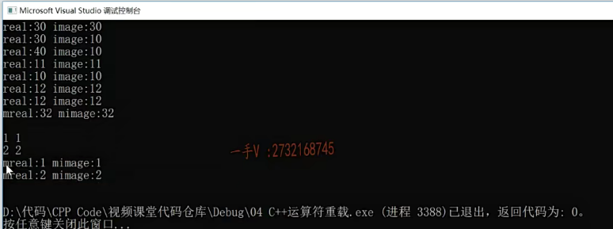

大家都知道啊，在我们的这个C语言里边啊，我们使用这个字符串的时候操作的都是char *啊，

那也叫char数组嘛，是不是来存储我们字符串啊？有诸多不太方便的地方.

又能有哪些不太方便的地方呢？那么首先呢？这个字符串数组呢啊？

这个是数组嘛，定义数组的时候大小都是得固定的，对吧啊？

其实这些数组进行比较大小的时候呢？字符串连接的时候呢啊，我们都得调用相应的字符串操作函数，而且还得考虑这内存够不够用。

给它一个默认构造吧。

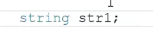

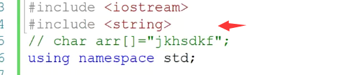

下面这个是拷贝构造，说明这个string肯定是不是提供了const叉新参数的这个构造函数了啊可以把char*转化为string对象

还有等等一些操作都可以

这个string呢？提供了相应的加法，运算符的重载函数啊。哎，它肯定是提供了一个全局的，因为它不仅可以做字符串对象相加，还可以做字符串对象呢，加上cos的叉星。还可以做const叉星，加上字符串对象都行，那在这儿我们能不能去打印这个STR 6呢？

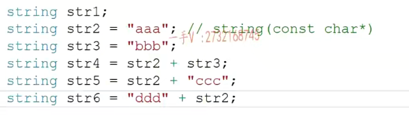

那在这儿我们能不能去打印这个STR 6呢？

可不可以？咱们看到这个应该是没有任何问题的啊，这个是没有任何问题的，那在这里边我们还可以进行字符串的比较STR 5大于STR 6，很好的事呢，在这里边我们不用记忆那些不同名字的库函数了，而直接用跟我们内置类型一样的比较。就就关系运算符进行比较，它们的大小就可以了，大于大于等于小于小于等于等于对吧？这些都有啊，那我们在这里边儿演示。上几个啊六。对吧啊，那这个我们直接把字符串打印出来吧，

输出。然后是这个在输出啊，这个字符串打印这个字符串是吧啊？这个else的话呢，我们打印一下，这个就是它。小于它。前后都加个空格好吧呃。那我们再去这个访问的时候啊，再去访问的时候呢，

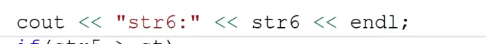

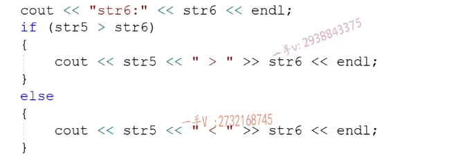

我们还可以用这样的一个东西啊int size应该intl吧，等于STR六点lens。唉string还有一个lens方法可以返回它所管理的字符串，有效字符串的长度在这里边inti=0 I小于len。加加I。

哎，这时候我还可以这样访问呢。suit.STR 6中括号I。哎，每输出一个，再加个回车。啊，不是加个回车，再加个空格儿。好的吧，这个相当于还定对象啊，把对象可以当做数组名来使用来访问这个字符串对象底层指定的序号的那个字符。这肯定是==给对象提供了中括号，就是下标运算符的重载函数==了啊。

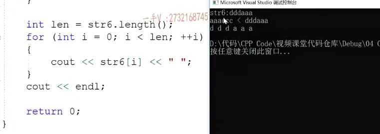

string    转为  char *

我们可能呢，把这个字符串有一需求，想转成串儿星，

对吧？比如说这里边有一个差八分啊，差八分。那在这个差八分里边呢，就需要我们把这个string 6里边的字符串拷贝到这个八分里边。怎么拷贝呢？注意一下，那你现在用了c的叉星了，是不是那你拷贝就得用？字符串操作函数了啊，那么注意一下stl六点c杠STR，大家注意一下啊。==字符串对象的.c_str()可以把这个对象管理的字符串返回成一个const char*==，二星类型就是返回成C语言的这个。叉星类型的字符串类型的，

那我们就可以调用一个string copy唉，把这个。string对象的这个内部的字符串呢，拷贝到我们c的这个字符串数组里边来，字符数组里边来OK，

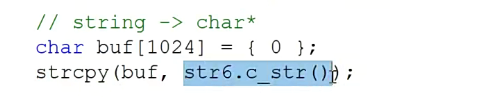

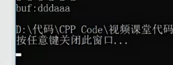

自定义实现String 

 它的成员变量是不是就应该就是一个指针啦？杠pstr嘛。是不是的啊？就指针。它其实就是对一个叉星指针字符，串指针的一个封装。

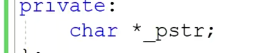

那么在这里边呢，应该提供一个const char *类型的这个指针的入参啊，接受用户传闻的一个字符串。字符字符串当时给大家都说过了啊，如果这个p呢，不等于null的时候。

唉，我们呢，肯定要是new char。然后strlen。注意要加个一，因为strlen是计算p指向的字符串，有效字符的个数，==但是我们字符串结束，一定要加个杠零==，对吧？要给杠零把位置加上。然后在这里边通过s string copy给杠pstr。呃，这个指针指向的这个内存进行拷贝字符串拷贝数据。

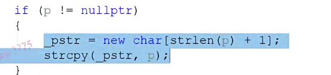

如果在这里边儿p等于空的话，

怎么办呢？p等于呢？p等于呢？我们说了，不要让底层的这个指针直接指成呢？这样一来的话，也就意味着通过我们string这个构造函数构造的string对象呢，==有可能底层指针是有内存有数据的，有可能底层的这个指针是空==。对不对？所以在这里边呢？那我们后边在其他方法写的时候呢，每次都得判断时，针对象底层指针为空的话怎么样？不为空的话怎么样比较麻烦，

==不能这样子，否则我们如果之前有数据，那么就会被置成null,有可能底层指针是有内存有数据的，有可能底层的这个指针是空==

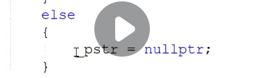

针对象底层指针为空的话怎么样？不为空的话怎么样比较麻烦，

对吧？我们在这儿呢，给它开辟一个空间。赋成杠铃，这个我们在最开始学oop的时候呢，

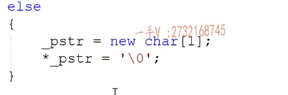

在写这个string类型的一个构造析构拷贝构造跟赋值函数的时候。我们曾经说过这个问题，好吧啊，那很明显在这里边呢，这个类的析构函数肯定也是需要我们提供的delete中括号杠pstr。啊，把这个指针指向了这个字符串。删掉内存删掉啊，然后呢，再把这个指针呢？

制成一个空好吧啊，制成一个空。

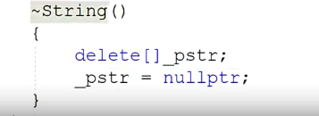

在这儿很明显，我们的这个string呢对象，它的前拷贝是有问题的，所以在这里边儿呢。我们把它的这个拷贝构造也实现一下

#### 定义拷贝构造函数，实现深拷贝

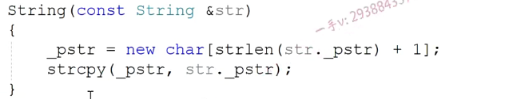

#### 赋值运算符重载

我们要去实现一下这个赋值运算符的重载呢，首先要排除自赋值。没问题吧，不要一上来就把自己给删了啊。然后呢，删除当前对象占用的原来的资源，其实在这里边儿，我们这是一个通用的方法，如果我们可以记录一下字符串的长度的话，

那也就意味着。如果你现在给我的这个字符串呢？还没我当前。是不是长啊？那我相当于就直接我的内存就足够存你传进来的这个字符串了啊，我就不用再释放再开辟了。

#### 通用写法

==在这里边，我们相当于写了一个赋值函数的，一个通用的，一个做法，一上来就是防止自赋值。在释放指针指向的原先的内存，然后再根据你src引用对象的底层的这个有效字符串的长度，重新给我当前的这个指针。开辟空间，==

然后拷贝数据在这里边，我也return星this了啊，我return星this了。

#### 加上拷贝构造

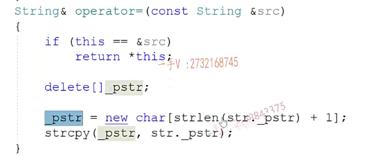

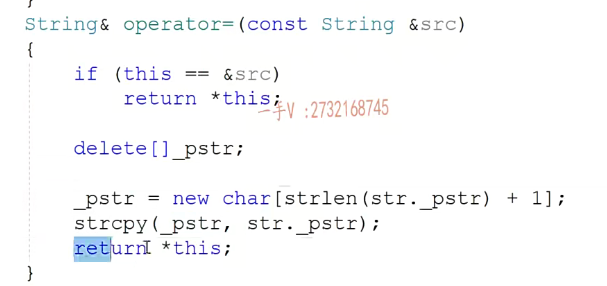

们看到我们还需要给它提供，是不是全局的加法运算符的重载函数啊？那我们提供一下加法。const string.这个是lhs，还有const strain rhs。那么这个啊，稍微有点儿讲究这个方法，稍微有点儿讲究，我希望大家可以先写一下，

我先讲其他方法，我们最后呢，再实现这个加法操作。OK吧

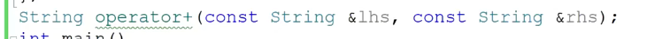

那在这里边还有大于号，两个大于大于运算符重载函数，对象调用大于运算符的重载函数，把STR 6还是string对象当做参数传进去。结果要作为一个if语句，这个逻辑值的判断，所以呢，我根据调用的地方，我就可以知道这个函数呢。原型应该是这么一个样子。没问题的吧啊，

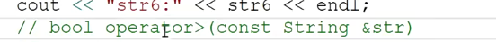

在这里边呢，我们给出来。这几个。我们说了啊，对于我们的方法来说，如果它只涉及读，不涉及写，你最好就把它写成什么呀？啊，把它写成长方法OK吧，它普通对象长对象，它都可以调，一定要记住这个啊，否则呢，我们CN加在做大型工程，大型代码的时候，你会发现很多很多很多。编译性的错误，如果我们这个写代码的时候注意这个可以给我们减少很多代码，编译性错误啊。

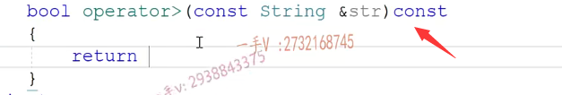

实际上，两个字符串string对象比较大小，那就是它底层的叉儿星是不是在比较大小啊？在这里边儿得需要调用string cmp函数杠p str STR的杠pstr。来进行一个大小比较。没问题吧啊，那相对来说，我们再多实现两个吧，在这是小雨，那这就是。

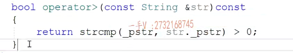

小于这儿是什么呀？等于那这儿就是什么等于了好吧，两个字符串呢？判断两个字符串对象的大于操作，小于操作以及。等于操作。好的吧啊，注意这是对象的大于小于等于运算符的重载函数啊，运算符的重载函数。

==就是封装C语言代码==

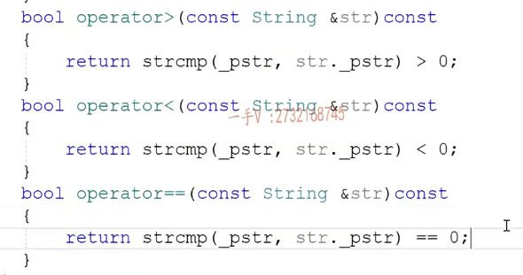

### .length()

我们简单int length，这是只读写成长方法。return是谁啊？杠pstr有效字符的个数不包括杠零啊

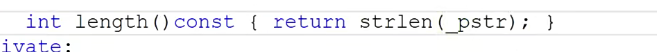

括号运算符的重载同学们来看，中括号运算符的重载相当于stl 6啊，==调用了自己中括号运算符的重载==。

==那把谁省下来了，是不是把这个下标省下来了啊？那么下标i就作为我们实参就传进来了==。那需要返回值吗？肯定需要返回值了，那就返回什么返回这个字符串对象底层第I个元素的。是不是值啊？

那它字符串底层都是叉儿类型吗？是不是char类型啊啊？为了支持数组方式的读，也为了支持数组方式的，

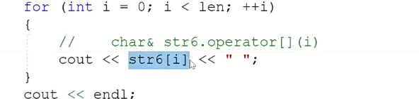

是不是去修改啊？所以呢，我们把相应位置的。引用给返回回来了啊，

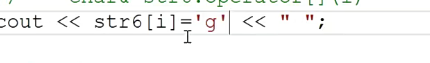

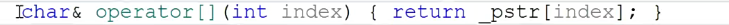

我们还提供一个。我们这两个方法，我们都会提供啊，这是这个是普通方法，这个是==常方法==，你看==普通方法返回的是个普通的char 引用==啊，就是它的结果呢？就是这个方法呢，哎，你外边儿呢，你可以通过这样的方式来读读第六号元素。唉，==接收它==你还可以呢，

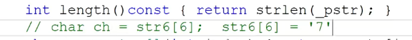

没问题吧，所以我们返回值是一个const叉，应用是无法进行赋值的，

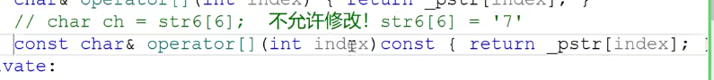

在这里边，我们是不是有一个c杠STR啊？就是返回字符串对象底层管理的x2星嘛，返回成一个const x2星啊

输出运算符

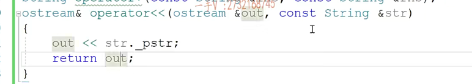

最后呢？我们这里边是不是还有一个cout要打印？是不是字符串啊？当然在这里边就是o stream引用。输出运算符o stream out，然后const string STR。

在这呢，我们就是一个out输出谁啊STR的杠pstr。啊，我们直接输出就行了，加不加回车由我们用户外部使用者的用用户来决定啊？return out这里边访问了string对象的私有成员变量，所以在这呢，我们得把它干嘛一下呀？定义成什么呀？定义成友元。

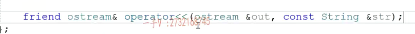

我们同学们呢，直接呢。用STR cat来连接lhs的杠pstr跟rhs的杠pstr。大家来看，把这个字符串对象的指针指向的字符串直接链到它里，这是肯定不行的，因为呢，==这个指针指向的这个字符串内存它根本就没有任何额外的这个多余的空间==。我们在进行构造对象的时候，都是根据外边传进来的字符串的尺寸呢，是不是来开辟空间的一个不多，一个不少？在这呢，首先呢，

你肯定不能这么写了

我肯定是得。先new一个叉长度是谁的长度啊？是lhs的杠pstr。加string len rhs的杠pstr再加个一呀。再加个一。哎，这两个字符串呢，不包含杠零的有效字符的个数，再加个杠零的位置对吧？

然后呢？得先进行CP y。对吧？得先把我的左左操作数的这个lhs的这个。指针指向的字符串拷贝到我的新开辟的这个空间里边儿，

然后呢，再来一个连接的函数啊。PT mp.啊，然后再来一个连接的函数，包括右边儿这个参数的引用的字符串对象底层指针指向的字符串。没有问题吧

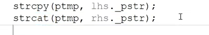

没有问题吧，然后再怎么样呢？然后再返回stream gt mp。啊，好了，这个肯定也要定义什么要定义是不是有缘啊？定义有缘

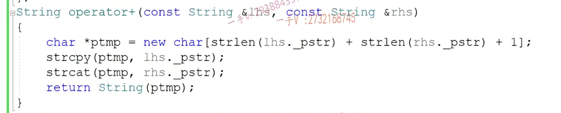

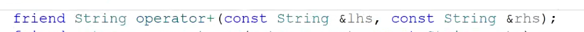

因为它底层也是个指针，指向的是一个字符串数组对对不对？我们可以给这个字符串对象呢，提供中括号运算符的重载函数。啊，提供中括号运算符的重载函数，我们就可以办到了。

好在这里边儿大家考虑最后一个问题，就是这加法运算符的重载函数啊，你办的不妥，为什么不妥呢？因为你发现啊，

这个叉儿。指针指向的这个new，你并没有delete过它。你没有delete delete过它？没有对这个。==是不是内存泄露，你每次调用加法操作字符串的相加都会造成内存泄露==，这是很严重的。所以在这里边呢，我们只能这样去做啊string tmp PT mp用你这个字符串呢，==先构造一个string对象。然后再把你这个对象返回去。这是没有办法的事情==。但是这样做的效率太低了，你在这里边儿，

==不去构造对象的话，构造临时对象，不会调用析构函数，这个指针也没有去delete==

#### 定义对象去调用析构

你有一个大块儿内存，好不容易把字符串拷贝了，用这个指针传到这个time里边儿去的话呢。在这里边构造函数里边，又要根据你传进来的这个指针指向的字符串的大小，开辟内存。对不对？在这完了以后呢，我们就可以放心的把谁给释放掉啊，把这个指针指向的内存给释放掉。这是一个局部对象啊，除了这个函数的话呢，它析构把它里边的。字符串内存就释放掉，这个是返回回去。

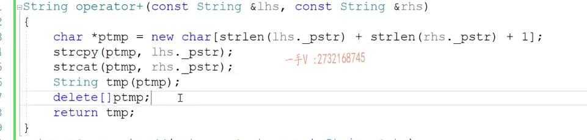

