大家好，欢迎继续收看石磊老师的视频课程啊，上节课呢，我们说到了这个string啊，我们说到了CA加的这个字符串类型string类型。啊四种类型，我们说呢？此种类型呢，给我们提供了常用于啊，常用于字符串操作的相应的运算符，重载函数，比如说关系运算符。还有这个。嗯，中括号运算符重载函数对吧？

还有输入输出啊以及加法对吧？字符串相加连接啊，相当于字符串连接的这么一些运算符重载函数。可以让我们操作字符串啊，和操作那个其他类型啊，就是操作我们编译器的内置的基本类型啊。呃，一样啊，一样简单。对吧呃，希望通过对于字符串的学习掌握两点，第一点呢，就是对于==我们运算符重载==啊。有一个更进一步的了解，另外一个呢就是。对于这里边的这个==string类型==啊。能够。这个用起来啊，能够用起来上节课，

我们最后讲到了这个string的加法，运算符，重载函数。我们说呢，我们最后改成这个样子，说是没有问题，功能上是可以的，而且这个new啊，对应的delete呢，我们也出现了。啊，

这个new对应的这个delete我们也出现了。

==但是我们说呢，它的效率呢，并不是很好啊，它的效率并不是很高==。那这个大家下去想的怎么样呢？在这里边儿说它效率不好的主要原因就是呢，首先呢，在这里边儿ptemp这个指针我们定了一个指针。指向了new出来的一块大的内存。给它进行字符串拷贝，跟字符串连接以后，把它呢当做一个参数，传到我们构造的一个temp字符串对象里边儿。那么，

在temp字符串构造函数里边呢？又会根据我们外边传进来的这个指针啊字符串呢？开辟字符串底层的这个指针的内存，进行数据拷贝。啊，那么在这儿呢？我们又把这个字符串内存给delete了。当我们return tmp以后呢？我们tmp是一个这个函数的局部对象。tmp要析构，又要把。刚才在构造函数中new的那块儿内存给delete掉啊，两次new，两次delay掉，太麻烦了，太麻烦了。是吧，

### 优化的方法

所以在这里边，我们应该这样子做一下，比现在这个操作，那就能更好一点。啊，能更好一点，那就是说我直接定义了一个temp。我直接定义了一个temp对象。啊，在time对象呢

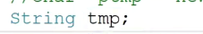

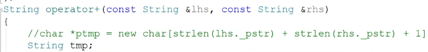

因为我这定了一个友元函数嘛，对吧？加法运算复杂函数，

我直接给它的底层。点_pstr。我直接给它的底层呢。进行一个内存开辟啊。

因为我们通过我们string这个类型的构造函数构造起来的这个。对象它是一定有空间的，对吧？它是一定有空间的，所以我们不怕它里边儿出现这个空指针啊。等于new，那就是把这段呢？啊，直接写到我们的。tmp对象的这个常用变量指针里边给它开个空间。

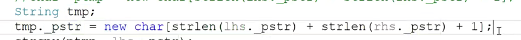

那在这拷贝的时候呢，

就直接拷贝到我这个。函数啊，局部对象。的这个底层的这个指针指向的这个字符串里边

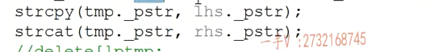

return tmp那这个new对应的这个delete什么时候呢？那==出了这个作用域tmp这个对象是要析构的==，析构的时候呢？哎，它就会把它底层的这个指针。给它delete掉。但其实呢？这个呢，肯定比我们刚才的写法呢，肯定要好少了一次，

看一下我们的功能是否啊？功能是没有任何问题的啊，功能是没有任何问题的。好，但是其实呢，这还不是我们最优的解法。啊，这个代码还不是最优秀的，因为这里边返回的是一个time的值。这里边儿可我如果想返回引用，那可是不行的啊。我们说了tmp在这里边只是一个函数的局部对象。

除了这个加法，运算符重载函数啊。tmp这个对象啊，叫虚构，所以我们不能把一个局部对象的地址或者引用给人家返回到函数的外边去。是吧啊，所以在使用这个加法运算符重载函数的时候呢，我们为了带出这个tmp是一定会产生临时对象。那在这临时对象的。拷贝构造啊，又会涉及到我们大量的内存的开辟，看看看拷贝构造。啊，临时对象，到时候析构又涉及内存的释放，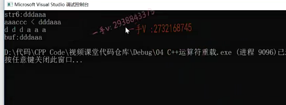

这里边儿我们一定要给我们的string类型提供优质引用参数的拷贝构造跟复制重载函数。这里边儿呢，一直还是我们说的对象的优化问题，这个==放到我们的进阶课程里边儿==，专门对于对象的优化进行一个深入的讲解啊。那大家最起码到现在为止，能够写出这样的一个版本，而不要写刚才的那样的代码。啊，最起码呢，我们少一次内存的new，但delete操作效率能高一些。好吧okay，这是上节课我们遗留问题的一个解答啊。

# 本节课内容

我们包含了库里边string这个头文件。这是我们自定义的一个string字符串类型啊。我们先用一下库里边的。strings tre等于。hello,world.那么string定义的这个对象。

叫不叫啊？叫容器吗？啊st restrain的对象叫容器吗？叫不叫容器？它也叫啊，它也叫，因为它底层是不是放了放了一组叉儿类型的，是不是字符啊？啊，它的底层放了一组串类型的字符。它的底层放了一组串类型的字符。所以呢，它也叫容器。

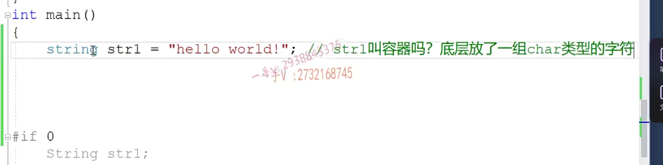

我们想用指针呢诶，我想用指针。来遍历。它底层的这个。字符串数组。我怎么指向它的数组的名呢？哎，对于这个字符串对象，我根本不知道人家底层那个成员变量叫什么名字，而且就是我就是知道。我也不可能访问，因为成员变量一般都被写成私有的。对吧那？大家来看，有这么一种方式呢？

可以遍历我们这个容器啊，可以遍历我们这个字符串容器什么样方式呢？大家来看一下。那在这里边儿STR一点begin。for循环，it不等于stre的end加加it。在这里边呢，我们再来see out sing it。see out.啊，输出一下。这个叫什么呀？这个iterator就叫做我们容器的迭代器啊，容器的迭代器类型。那今天我们这一节课呢，

还有我们下一节课，我们主要讲的这个核心内容就是容器的迭代器

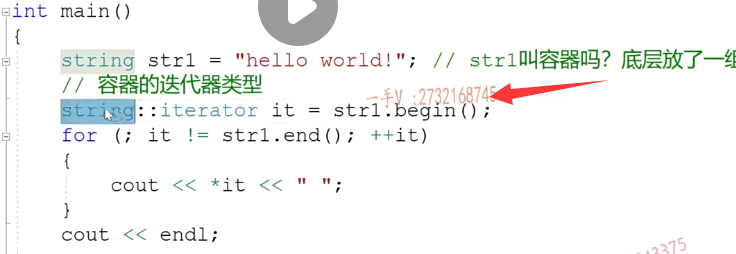

你看。外这个容器类型是外层类，==外层类加了作用域嵌套类==啊，那这段儿代码到底是什么意思呢啊？到底是什么意思呢？我们把它放到。我们的这个画图板上啊，

来看一下。我们把它放到画图板上来看一下。好，那么我们假设啊，我们假设呢，这也就是我们的string对象。啊string对象。string对象。它里边呢，有一组有一组字符串啊，有一组字符串。对吧，存了各种各样的字符。那我们现在呢？那对于这些内容呢？

我们能看见吗？对于这些内容。==对于这些内容，我们是根本看不见的==。okay吧，因为对于字符串对象的这个底层成员变量来说呢，==那东西都是私有的。我们根本看不见==，我们看不见。啊，我们根本就是看不见的。

我们根本看不见。那我们想迭代。字符串对象底层的这些字符的时候呢，我们该怎么办呢啊？

我们用迭代器是怎么做到的呢？

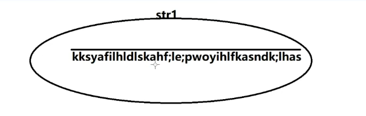

我们用迭代器是怎么做到的呢？大家来看。首先呢，容器有这么一个方法。哎，容器有这么一个比干方法。这是容器的方法，不是迭代器的方法，我们看来看它是用字符串对象调这个begin返回的是什么呢？返回的是这个它底层啊，首元素的。迭代器表示。那么，相当于it呢？这个迭代器就指向了容器底层元素的首元素。

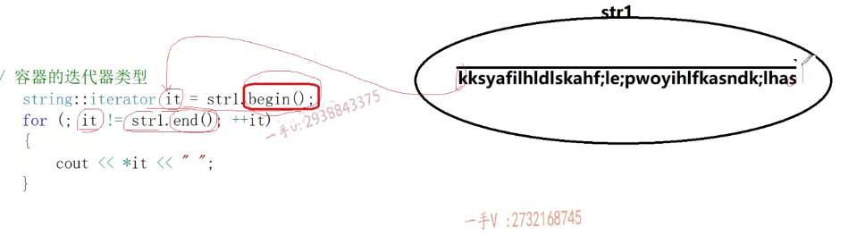

对于我们使用者来说，我们就只需要知道it指向了这个字符串，哎，底层。首元素啊，首元素。那么，你看在循环的过程中呢？it不等于stre的end啊，迭代器这个迭代器啊跟。it这个迭代器跟这个string对象的end进行比较string这个字符串对象的end表示什么呢？它表示的是最后一个元素。后继位置的。哎，后继位置的这个对代体。

大家来看，这是里边并没有用小雨。啊，小雨。而是用不等于也就是说呢，对于容器底层的数据结构，它是以什么样的？它是以这个数组方式来存储的字符，还有。还是以链表存储的字符，还是以哈希表存储的字符，还是以红黑树存储的字符，我们不用关心。我们根本不用关心，而且我们也不能假设呢，

它的内存谁大谁小，我们只需要不断的遍历啊，遍历到最后一个字符，以后呢，往最后再往后边再走。哎，就跟这个end相等，那我们就要跳出了，所以不等于end。啊，这个end是最后一个元素的后继位置，这样呢，我们就可以把最后一个元素也遍历到了啊，也遍历到了。那么，

在循环的过程中，这个a它要进行一个加加。那么，至于it加加呢？说明的是我这迭代器要从当前的这个字符跳到下一个元素去遍历。

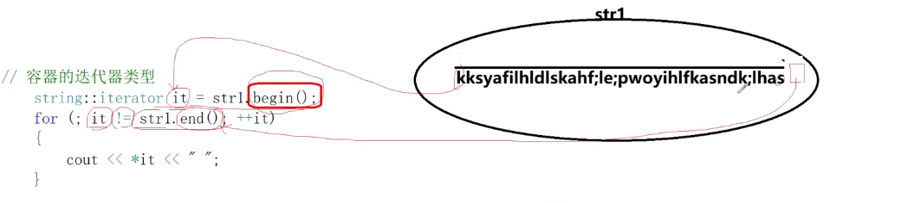

那么，在这里边儿打印的时候，对于迭代器进行一个解引用啊，那我们就说呢，迭代器就跟一个面向对象的指针一样，对吧？哎，迭代器指向容器底层的这个数据，那么对于迭代器仅引用它访问的就是容器底层的数据。

那么有这么一句话，就是迭代器呢？==迭代器可以透明的访问啊，容器内部的元素==。啊，内部的元素的值。元素的这个值啊，迭代器可以透明的访问容器内部的元素的值。反而容器内部的元素的值。透明的我们根本不需要知道你这个容器底层是是什么数据结构，就像这个字符串对象一样，我管你底层呢，这是什么数据结构数组名叫什么，我不需要知道。我只需要定一个呢，

哎，你这个容器类型特定的迭代器对吧啊，特定的迭代器。因为这个迭代器不可能设置成统一的，因为毕竟不同容器底层的数据结构不一样，对吧？所以呢，每一种容器都有自己的迭代器，所以你看这个迭代器呢，设计成了我们容器的嵌套类型。那么容器呢？有笔跟和摁的方法分别返回了首元素的迭代器和末尾元素，后继位置的迭代器。唉，我们负循环过程中用当前迭代器不等于容器末尾元素，

后继位置迭代器，然后对于迭代器进行加加。哎，那也就是说把我们容器底层的元素全部变了一变，至于你底层是什么数据结构，怎么推进，怎么从一个元素到下一个元素，我不管。这==全部都封装在了这个迭代器的加加运算符重载函数里边==，那么==对于迭代器还提需要提供星号运算符重载==。来访问迭代器所迭代元素的值。OK吧。这个迭代器呢？非常重要啊，迭代器非常重要，

## 泛型算法

那我们后边儿在sc+stl里边儿的泛型算法，大家会看到泛型算法呢？啊，==泛型算法==。泛型算法嗯，它的参数呢？接收的啊，都是迭代器。啊，泛型算法是一组全局的函数啊，是一组全局的函数，它是给。所有。容器用的那么你既然给==所有容器用的不同的容器底层的数据结构是不一样，有的容器底层是数组，有的容器底层是链表，有的容器底层是哈希表，有的容器底层是红黑树==。

对吧，我们常用的数据结构啊，甚至有的容器呢，我们底层甚至是一张图。对不对？那么你既然你既然写的这个泛型算法是给所有的容器用的，那你们最起码这个泛型算法。是不是他得有一套？方式能够统一的，能够统一的遍历。所有的容器的元素啊。是不是当我写泛型算法的时候，

我都不知道将来用户呢？会让这个泛型算法去处理。哪种容器？那我在写这个发型算法的时候，我最起码我要处理容器的元素，==我最起码是把把容器的元素，我要访问一遍啊。那我有什么方式能够统一的去遍历所有容器的元素呢？你只有这种方式迭代器==。啊，第六题。所以呢，这也就是为什么啊，为什么？为什么我们的这个？

==泛型算法啊，参数呢，接收的就都是迭代器啊==，都是这个迭代器。都是这台器。诶，对于这个迭代器容器的这个迭代器呀，要好好理解一下，

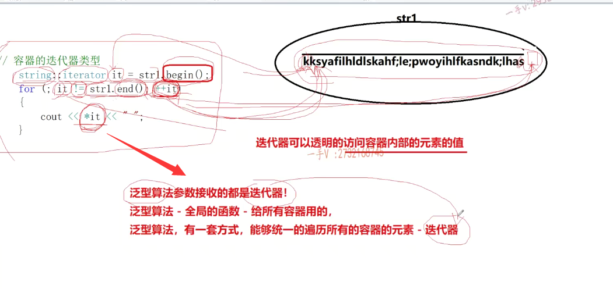

后面呢，我们在操作容器的过程中。是少不了，到处都要应用这个迭代器啊。好。首先呢，大家来看一下啊。

## 嵌套类型的迭代器实现

那我们现在在这里边，把我们的这个类型改成我们自己的类型string。string.啊string。okay，那我们首先要做的是给我们提供一个嵌套类型iterator呢？

是不是啊？aterritor.呃。这是给string字符串类型提供。嗯，迭代器的实现啊。

那我的这个迭代器不就是作为你的嵌套类，不就是为了迭代你这个字符串对象底层的这个字符串数组吗？你说一个字符串数组迭代，一个字符串数组用什么用下标也可以用指针，当然也可以的嘛。比如说是个p。

没问题吧啊，当然。诶。在我们的这个。在我们的这个容器里边，还得提供两个方法，一个是begin方法，一个是end方法。begin呢，返回的是容器底层首元素的迭代器的表示。啊。那end。

end返回的是。容器末尾元素后继位置的迭代器的。表示哎，迭代器的表示。迭代器指向的是一个位置啊

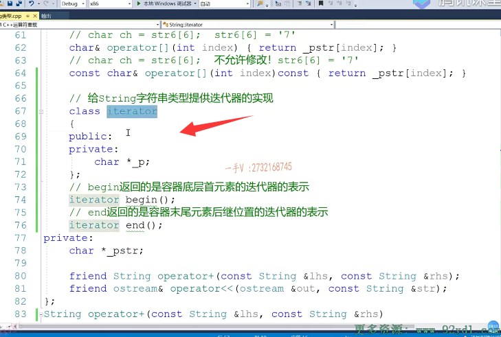

### 对char* 包装，返回的还是迭代器类型，  begin()   end()

它就是对于叉形指针的一个封装，你既然要指向一个位置，那你的参数肯定也得需要接受一个什么嘛。接触一个指针嘛，对不对？我们可以在构造函数的初始化列表里边儿用用户传进来这个指针给我们成员变量叠代器成员变量这个指针进行初始化。所以同学们在这里边，请问啊，我这个笔根是不是什么叫首元素啊啊？这个杠pstr指向的是不是就是string对象底层那个叉形数组的首元素啊？

哎，我们用它来构造一个iterator，这是不是相当于就是我们定义的一个迭代器，让迭代器指向了我们容器底层的首元素啦？诶，这个iterator杠pstr。对吧啊，再加上一个什么？再加上一个我们所谓的认识方法。就是字符的长度。这是不是这个指针的地址？是不是就指向了我们末尾元素后继的位置？就是最后一个字符，后边那个位置。啊，

其实在这儿这样写的话，就指向了我们杠铃的位置，因为杠铃不是不属于我们字符串中有效的，是不是字符啊？啊好了，你看一看，注意这两个呢，是容器的方法，可不是迭代器的方法OK吧？

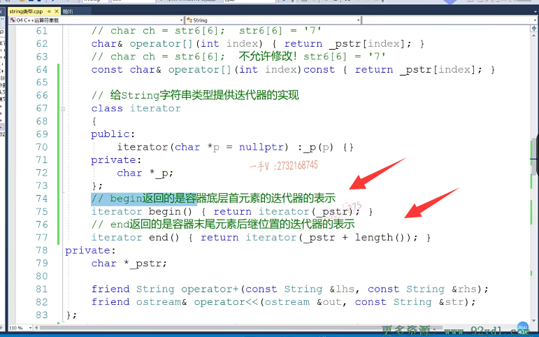

好，我们来看一看啊，在这里边儿哎，我们容器的begin返回了，我们受元素迭代器，那也就是我们生成了一个迭代器，

让迭代器的底层的这个指针指向了我们这个数组的起始位置。看这不是了吗？对不对啊？

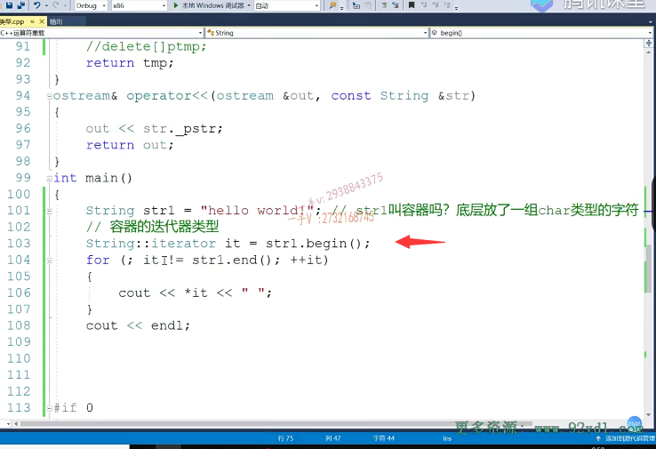

### != 的重载

然后呢？我们还要实现不等于运算符的重载两个迭代器，对于字符串的两个迭代器。不相等。啊，不相等。那就是说明两个迭代器不相等，==两个迭代器不相等，指的就是它底层指针的不相等==。好的吧。

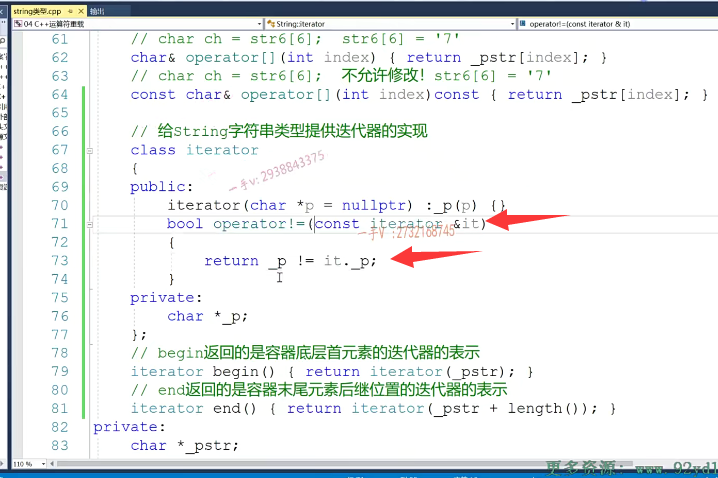

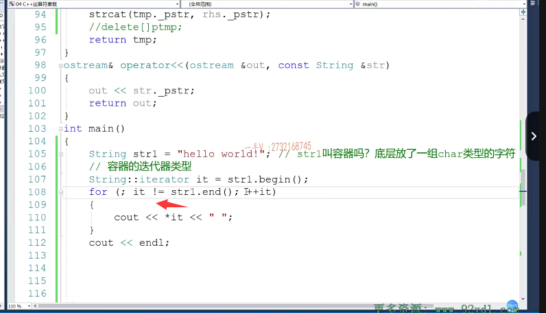

### ++it 的 前置++重载

okay，再来看这里边是不是有一个加加运算符前置的加加运算符重载啊啊？

前置降价运算不重讲，我们之前看了啊，我们之前看了人家返回的是一个引用啊，人家返回的是个引用我们来大家来看一看啊。这个应该还有。你看哎，在这我们学复数类的时候，后置加加呢，返回的是一对象。那是要产生临时量的。啊，因为它返回的是个老对象是吧？先返回旧对象的值，再给我们当前的对象的是不虚无加加，而这个前置加加呢？

返回的就是对象本身，返回的是引用，所以呢，不会产生临时对象。所以对于我们面向对象的这个对象来说啊，采用==前置++效率会高一点啊，就免了生成临时对象。==

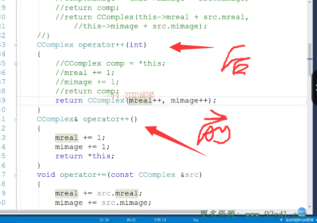

### 补充运算符重载

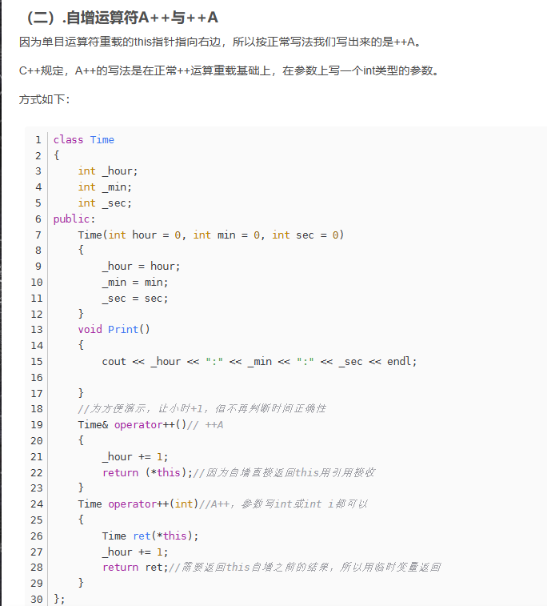

### 前置++重载

OK吧，所以在这儿呢，我们给迭代器用的都是前置的，加加好这里边儿没有用到这个返回值，所有的迭代器的加加。也就意味着，从当前位置到下一个位置，那我们这个string底层是个数组，

所谓的加加呢，就是让这个指针进行一个加加了。加加杠pstr哎，加加。杠pstr。

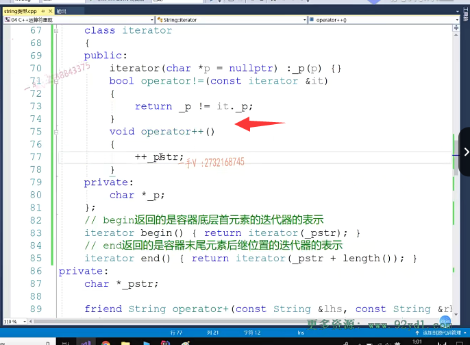

OK吧，那完了以后呢？

解引用 重载

这里边儿有我们迭代器的解引用运算符重载函数，所以这儿就是呢，我们char引用operator信号。啊，==你给迭代器解引用啊，那你相当于就是给这迭代器底层的这个指针解引用==嘛，是不是？啊，

因为迭代器所谓迭代器指向容器底层元素，就是我们这个指针迭代器底层的这个指针指向了。哎，容器呢？底层的这个叉形数组。

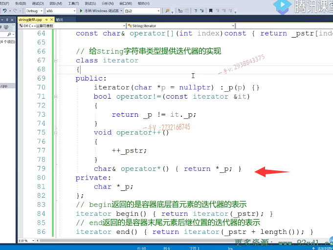

迭代器提供的最经典的三个方法不等于前置加加以及星号运算不存在。以及呢，我们给容器提供的比根和n的方法啊。我们可以运行一下。嗯，这里边儿有点儿问题是吧？哎，它这里边儿啊，

迭代器的加加这里边儿是杠p啊，这是给迭代器迭代器成员变量加加好吧？不要写错了啊。

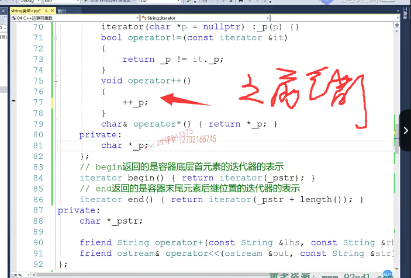

OK，在这儿我们看能不能打印出来hello word呀？可以吧？哎，在这里边儿可以打印出来hello word，这就是通过迭代器呢？对我们容器的元素进行了一个访问，

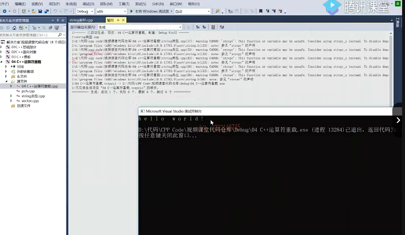

### for each()方法

那其实呢，在C加加幺幺里边啊，C加加幺幺里边对于这个迭代器的使用有一种更加简便的方式啊。在这里边就是叉ch，然后STR 1哎，

以fore的方式。这就是。for each的方式。来遍历容器的内部。元素的值啊。看一下我们能不能打印出来？看一下能不能打印出来啊？嗯。哎，我们是依然可以打印出来的，对吧？哎，依然可以打印出来的。

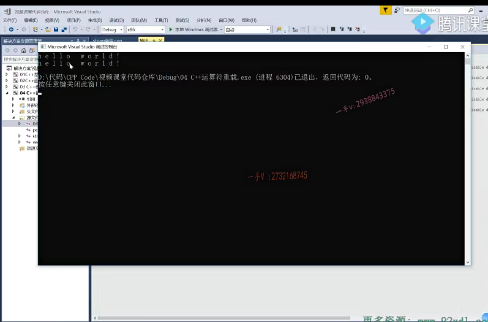

### for each 底层还是迭代器 ，不能没有begin(),end()

其实呢，大家呢？

哎哎，我们把for each这个打印保留着，那只要我们把这个begin和end啊一去掉。你看看啊，看看。我们这个for each还能用吗？哎，它报错了，未找到可用的begin函数，针对string这个类容器类型未找到可调用的end函数。啊，针对这个可针对类型思准，所以那也就是说啊，同学们在这儿呢，所谓的fore来遍历容器其底层呢？

哎，其底层。还是？通过迭代器进行遍历的。所以呢，在这里边呢，我们刚给呀，刚给我们的这个谁呀，刚给我们的这个。容器呢，把比根和n的方法去掉，以后呢，我们就发现我们用fore呢，也就无法去遍历我们的是不是容器了？哎

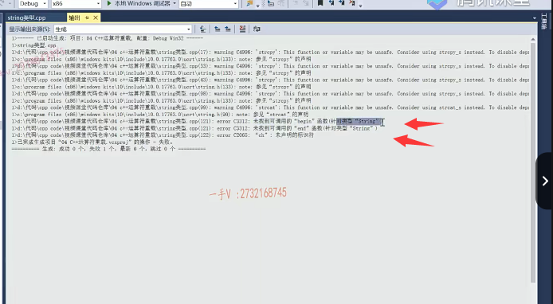

### 迭代器都是嵌套类型，是在类中的，string：：iterator

### 可以使用auto

这里边呢，给的是容器里边元素的值。a元素的类型对应的变量相当于把容器里边的值一个一个赋给ch哎。那我们把b跟n的放开，我们现在看。一切OK。一切OK。好的吧啊，这也是用迭代器来遍历我们容器的元素，只不过比这种更简单，一般来说呢，容器的这个迭代器类型都是嵌套类型，可能比较长，所以我们。在定义的时候呢，

我们也可以采用C++给我们幺幺提供的这个auto啊，自动呢，根据我们等号的。就是这个赋值的，这个右边的这个类型来推导我们左边类型啊，我们写起来就会。更简单方便一点啊，更简单方便一点okay吧。

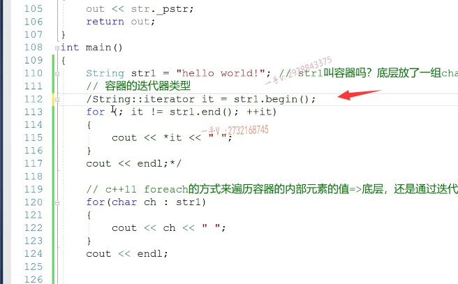

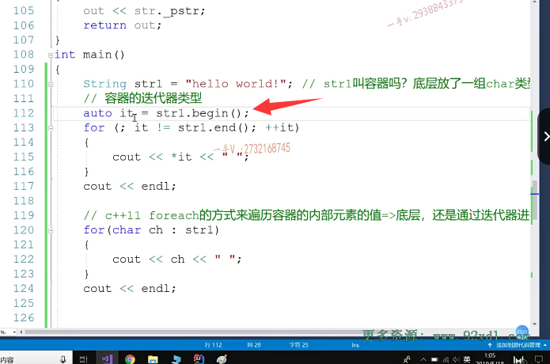

### 提供统一的方式

那我再强调一下。再强调一下。迭代器的功能是什么啊？迭代器的功能。主要就是。提供一种统一的方式。

来遍历，来透明的遍历容器啊，这一句话呢，好好理解一下，

首先提供统一的方式，也就是说呢，以后我们不管遇见的是string容器。还是vector decon list，甚至包括我们的map set？所有容器的这个迭代器的使用方式呢？使用方式都是一模一样的。先定义迭代器指向受元素。调用容器的笔根。啊，

这个it呢？在不等于容器的末尾元素就是容器的end加加it来，再通过迭代器进行用来访问容器的每一个元素。都是统一的。

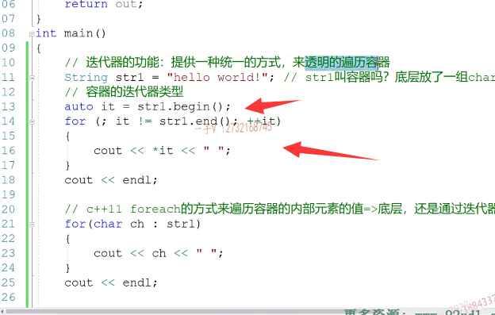

### 透明的遍历

### 全部封装在++ 运算符 重载函数当中

那么，为什么叫做可以透明的遍历容器呢？因为我们根本不需要知道。容器的底层。到底是什么数据结构？啊，我们不需要知道。那么，==全部不同数据结构的遍历呢？全部被封装了。在这个迭代器的加加运算符重在函数里面。==

这里边儿我们还说了用for each呢，其实本质呢，也是通过迭代器来遍历我们容器内容的啊。注意在这里边，我们给时俊的。实现的这个迭代器以及给容器提供的begin()和end()的方法，begin()返回的是哪个位置的迭代器

end返回的是哪个位置的迭代器？

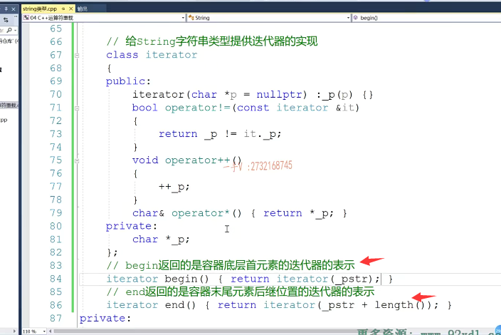

好希望大家呢，能够在之前的时针类型上啊，自行的去实现一下这个迭代器类型。

## vector 中添加迭代器的实现 ---自行实现下

那么我们之前呢还？学过这个，自己写过这个vector啊，

类似于我们库里边的这个vector，还给这个vector呢，实现了空间配置器allocator。那么，这节课我们留一个小的问题，就是我们能不能呢？给victor也提供一下。哎，因为它也是个容器嘛，给它提供迭代器iterator的实现可以通过呢。上面这种。统一的，透明的边例容器的方式来访问我们vector里边所有的元素的值呢？希望大家下去先自行实现一下okay，那我们这节课的这个内容就到这里。
