# 第四节课

# vector容器的迭代器实现

大家好，欢迎收看诗磊老师的视频课程。上一节课我们讲了这个string类型的呃迭代器啊，我们说string定义的这个对象呢，在我们C加加里边儿做字符串啊，是比较简单方便的啊。呃string对象本身容器，我们提供了一种针对所有容器啊，都是统一的遍历，所有容器的一种。方式啊，方式就是迭代器，然后我们可以透明的去遍历为容器，我们不用管啊，容器底层的这个。

数据结构到底是什么啊？到底是什么？我们迭代器配合容器的比根和end方法，再配合迭代器相应的一些运算符的重载。比如说呢？加加不等于以及星号运算符的重载，我们就可以用迭代器把容器的元素全部给它遍历了一遍历啊。那么这个这节课呢？我们主要嗯还是讲迭代器，迭代器这个概念非常的这个重要啊。我们把之前的这个。我们实现了这个vector容器拿出来啊！vector容器的代码拿出来，那么既然vector也是一个容器，那我们就需要给它实现一下迭代器了。

啊，那么通过这个vector的这个进一步的学习，我们再来体会一下，对于容器来说怎么去？提供啊迭代器的这个实现。首先我们说了啊，这个不同容器的底层数据结构肯定是不同的。那么，数据结构不同，在数据结构上遍历类元素的方式呢？肯定也是有所区别的，对吧？那么为什么啊？为什么在这里边儿？我们先把这个画图板打开。

为什么在这里边我们说呢？用这个迭代器iterator。呃，可以遍历就是。遍历啊，

### 底层数据结构具体的遍历方式呢？都给它封装在了这个迭代器的加加运算符重载函数里面

所有容器它们的这个。方式都是一样的呢啊，那还记不记得我们用迭代器遍历我们的这个代码auto it？哎，然后呢？我们容器呢？哎，容器container先提供一个begin方法，这个begin方法返回的是这个容器底层啊。首元素首元的第一个元素的这个迭代器的表示啊，

然后我们可以用for循环不等于啊，不等于container and。end访问的是最后一个元素的，后面的一个位置啊，后面的一个位置不等于end。啊，这这样的话呢，就可以把我们容器的最后一个元素呢，就访问到了加加it。那么在这里边呢？再通过这个迭代器接引用。来访问迭代器所迭代的元素的值，其实呢，我们为什么说用迭代器遍历所有容器的方式都是一样的？那是因为呢哎。

当我们遍历完当前元素以后，从当前元素跳到下一个元素，那么我们把底层容器，底层数据结构具体的遍历方式呢？都给它封装在了这个迭代器的加加运算符重载函数里面。

就对于我们用户来说，我们只需要知道给迭代器进行一个加加操作，那我们就能获取容器的下一个元素了。至于容器底层是什么数据结构，数组链表。啊战队列或者是我们哈希表红黑数无所谓的，我们不需要知道作为使用方，我们不需要了解底层的这个原理，我们。只知道呢，

底层数据元素的遍历全部被封装在迭代器相应运算符的重载函数里边。

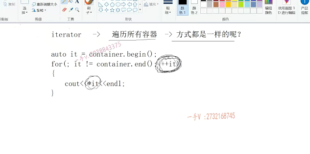

### 泛型算法    可以统一的方式遍历所有容器的元素

啊，上节课我们也这个。给大家说了这么一个问题，就是我们CA+stl里边儿还有一组东西呢，叫做泛型算法，泛型算法呢，这是一组全局的算法，全局的函数结构是给。所有容器都能使用的啊，都可以使用的。那为什么一组函数用模板写的就泛型嘛啊，泛型跟类型无关的，这么一组函数啊，算法能给所有的容器都可以使用呢？

啊，那你要给所有容器作为通用的算法，是不是你就得用一种统一的方式？你首先应该把所有容器的元素先遍历一遍呐。==是不是你不能够用一种统一的方式遍历所有容器的元素，你怎么给所有的容器都适用==呢？都适用你这一套算法呢。是的吧呃。

### 泛型算法的一大特点： 接收的参数都是容器的迭代器

所以呢，我们算学算法非常大的一个特点就是啊，参数都是接收的，==是接收的参数。接收的都是容器的迭代器==啊，参数。接收的都是容器的迭代器啊，

都是容器的迭代器。那么，这是我们算型算法的一大特点啊，一大特点。

## 中括号运算符重载

好那么。来看一下啊，首先呢，我们从实现上来说，我们给我们vector也提供一下相应运算符的重载。我们给我们victor也提供一下我们。==之前给string提供的，哎，这个叫什么呀？中括号运算符的存在==，那么这样一来呢，

我们也可以呢，把我们的这个vector呢，哎，当做数组，千万不要一样来使用。啊，因为我们知道vector底层呢，它也是一个数组，对吧？==它的数据结构也是一个数组vector，本身就叫做向量容器了啊，底层是一个数组==。所以在这呢，那也就意思是说底层呢，它返回的就是哎。

first杠。中括号index哎，这个数组以first为数组起始地址的index后为元素的值。当然，在这里边儿，

### 需要判断下标合法性

我们应该加以判断啊，加以判断，加以判断，判断什么东西呢？判断这个index啊，判断这个index。我们应该判断一下它的合法性啊，比如说是因。next.小于零啊，

小于零。是吧，或者什么呢？或者是index。啊，index已经大于等于size了。size是我们元素的个数，对吧？如果要按序号下标来讲的话，是从零开始算的，所以I index小于零或者index大于等于size的话，这个下标就是非法的。啊，这个下标就是非法的，那我们在这可以抛一个异常啊。那么，在这里边应该就是一个index。啊，index。嗯。我们来看看啊，你们我我们直接写吧index out或者是给它抛出一个out of range.exception.啊，这么一个字符串对吧？嗯，看见这名字就知道，

就是已经越界了是吧？一个越界异常。哎，那这样应该呢，我们你看我们vector就可以通过这样的方式，哎，防我们容器底层啊，第二化为元素。容器底层数的第二号位元素的值，使用起来就比较方便了好吧嗯。

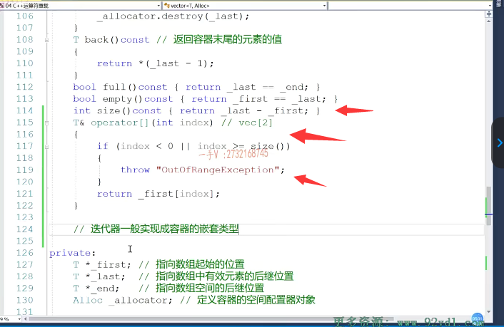

## 迭代器一般实现为容器的嵌套类型

我们给容器提供叠代器，首先第一个啊就是。迭代器一般实现成啊容器的嵌套类型。因为不同的容器底层数据结构不一样，那么具体迭代的方式也就不一样了，

对吧？而我们向外边儿提供的都是我们迭代器相应的运算符重载函数。把具体容器底层数据结构的这个差异性啊，都封装在了迭代期，相应运算物的重载函数里边了啊。aterritor

## 迭代器的实现

### 成员遍历量 

### 容器的begin(),end()

那既然呢，我这个迭代器是用来遍历你这个vector容器的，那我而且我实现成你的嵌套嵌套类，那我当然知道你底层有什么东西了。是不是啊？我当然知道你底层有什么东西了。那在这儿呢，我遍历你的时候呢啊，我遍历你的时候，

那我在这儿，我就你你底层是个数组嘛？vector底层是个数组，那遍历为数组当然就得用一个指针了。是不是啊？遍历遍历数组当然就得用一个指针了。好，那么还需要啊？

需要给容器提供begin begin和end方法。这个began返回的是我们首元素容器底层首元素的迭代器aterritor。那我们首元素就是first指向的这个位置嘛，对不对？我们的这个end呢？end是。eat or end是不是刚好就是last这个位置啊？啊last这个位置就是最后一个元素的后继位置。是吧，那当然了，我们需要给我们的迭代器提供一个相应的。

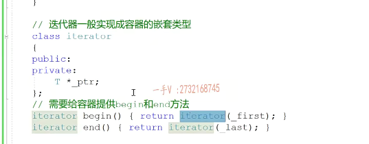

### 迭代器相应的构造函数

是吧，那当然了，我们需要给我们的迭代器提供一个相应的。iteator Ptr相应的一个构造函数。好了，==这是我们给迭代器提供相应的一个构造函数==。

其实，==所谓的迭代器指向容器的某一个元素就是迭代器底层的这个指针。指向了容器底层这个数组的某一个位置是吧==？

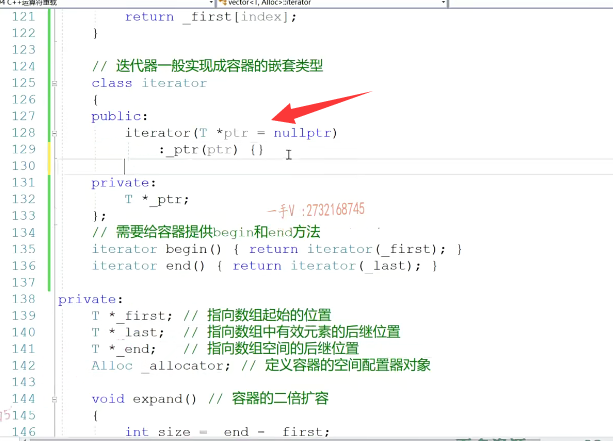

### 迭代器指向某一个位置，就是指针指向数组的某一个位置

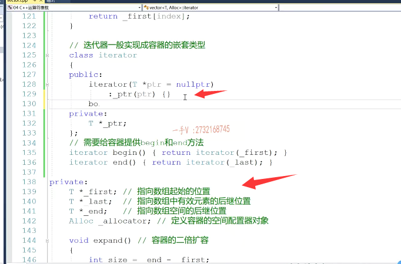

## 不等于重载

### 其实就是比较迭代器底层的指针是否等于

对于迭代器使用，肯定要提供。不等于运算符的重载嘛啊，不等于运算符的重载cost。cons teter it or.

这前给大家说过啊，我们这些只读不写的这个常元方法，最好把它实现成常方法，这样普通对象跟常对象都可以调。少了我们很多CA加代码，写完以后编译性的错误啊诶，希望大家这一点呢，能够牢记而return。所以迭代器是不是指向同一个地方，那就是迭代器底层成员遍历量，这个指针是不是指向同一个地方？所以==迭代器比较不等于其实就是我们迭代器底层的这个指针在比较不等于==okay吧

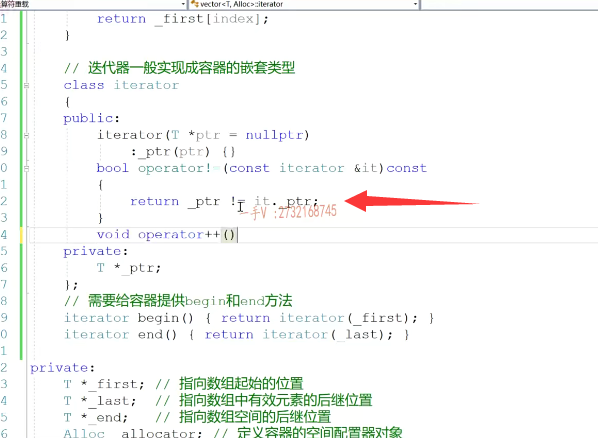

## 前置加加重载

迭代器的前置加加运算符重载为什么？要用前置加加而不用迭代器的后置加加，因为迭代器是对象，

对于前置加加来说呢，我们是不用产生任何临时量的，因为前置加加就是改遍历对象本身的值。然后再返回是吧？==后置加减，要把对象原先的值返回回去啊，再跟我们对象这个值再进行一个加或者一个减减。啊，它要产生临时量的，要产生临时量==这个效率呢，不算非常高啊，效率不算非，所以对于我们对象的加价呢，我们。般都采用前置加价，

这个我们在==讲这个运算和承载呢复数类的==时候给大家说过啊。

这里边迭代器加加。啊，那就是从当前元素到下一个元素，那我们在这儿作为迭代器的实现，我们知道啊，它遍历的这个容器的底层是一数组，所以呢？所谓的这个迭代器加加就是我们这个指针加加。啊，就是我们的这个指针加加。

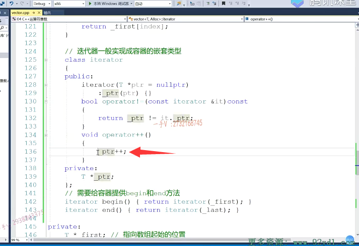

## 解引用重载

迭代器仅引用迭代器仅引用啊，

就是我们底层的谁解引用啊？啊杠ptr。没问题吧啊，就是这杠ptr。

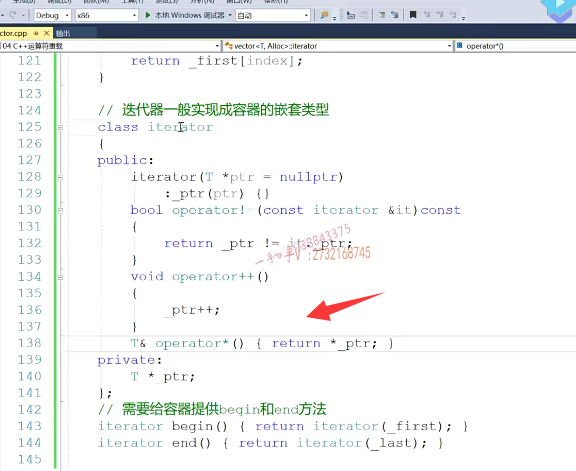

## 常方法和普通方法 解引用

好，其实呢，在这里边呢，我们这种方法呢，一般可以提供嗯。可以怎么说呢啊？呃，我们给它提供成这个，能不能提供成长方法？这个也可以，

是不是这个长方法普通对象跟长对象？都能来钓。是吧啊，都能来调。我们把它实现成一个普通的方法，为什么呀？因为在这里边儿呢，我们这是代表是一个普通的迭代器对象，普通的迭代器对象作为借引用，也就是说呢。你看它可以通过这样的东西呢，它不仅仅啊，你看它如果说我们用整形实例画的话，它不仅仅可以仅仅用。用来读取它还可以进行用用来赋值啊赋值，

所以我们在这里边儿呢嗯，这个对象本身呢。就是怎么说呢啊，我们就把它当做一个普通的指针是吧，如果说是你想把它当做一个长指针就是。你只能访问而不能修改，我们可以专门给他再提供一个。长方法就写成这个样子的啊，你返回值呢，也被const修饰了，这样一来呢，你看我们这个是可以做就可以读的，但是。叠代器及应用能不能通过叠代器及应用给容器底层指向的元素位置赋值呢？修改它的值呢？

修改不了的因为。这个==返回值是已经const引用了，它不能再作为左值==了，对吧啊？我们可以。对于这种方法，我们可以提供两个嗯。好，那这提供完了以后呢

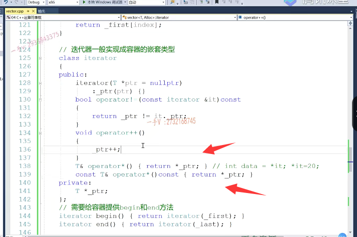

## 总结流程

那我们来看啊，我们就是给容器实现迭代器非常简单，

第一步呢，就是给这个。容器呢，提供一个嵌套类，提供迭代器的实现啊，

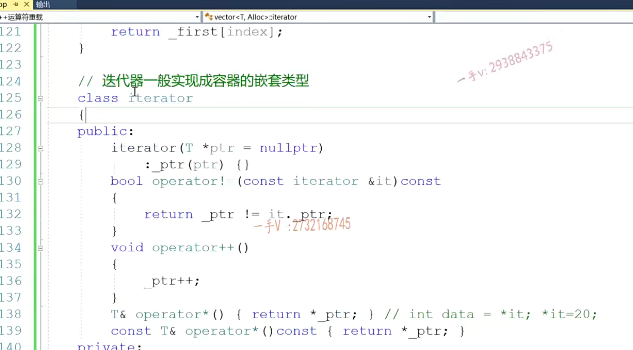最经典的四个方法就是构造函数不等于运算符重载前置加加重载以及星号节引用的重载。

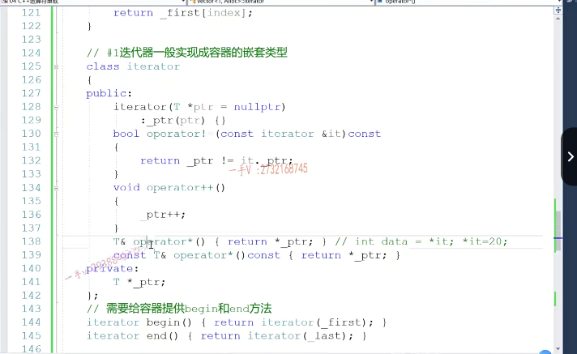

## 迭代器成员遍历量选择

啊，==那么迭代器有什么样成员遍历量==呢？最主要就是看我们容器的底层数据结构是什么？容器底层数据结构需要用一个什么样的遍历量来这个遍历，那我们就定一个什么样的遍历量作为我们迭代器的。成员遍历量。

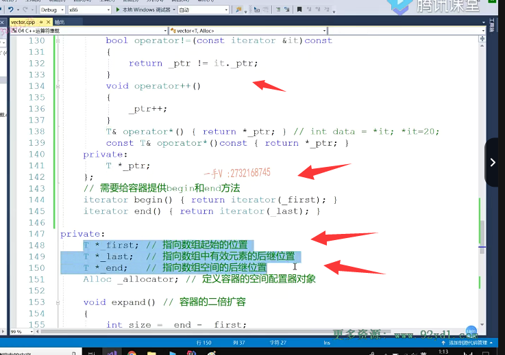

另外，给我们容器提供相应的比根和n的方法，比根返回的是首元素的迭代器。表示end表示的是最后返回的是最后一个元素后继位置的。迭代器的表示。这就OK了。那我们用的时候呢，

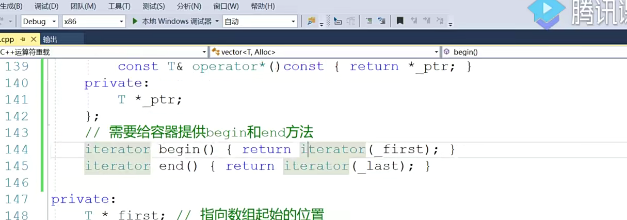

## 测试

就可以这样去用了。比如说我们上边呢，先定一个vector啊，定一个vector话呢，然后呢我们？在这呢，给它添加上20个元素吧啊。20元素VC点push back rand磨上100。1到100啊1到100。

然后呢？在这里边儿，我们就可以啊，实际上呢，我们真真正正访问的时候是这样访问的，等于VC的。

beginfor循环it不等于VC的end加加it。然后在这里边，我们去访问一下新it。啊，然后在这里边呢，我们再。输出个回车是吧？我们来看一下我们这些元素呢，能不能给它打印出来呢？

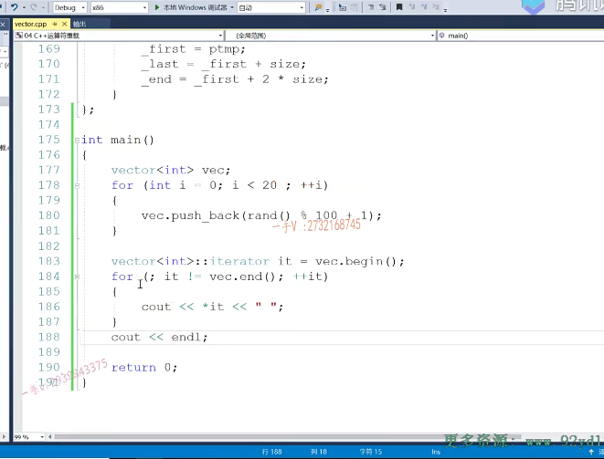

### 结果

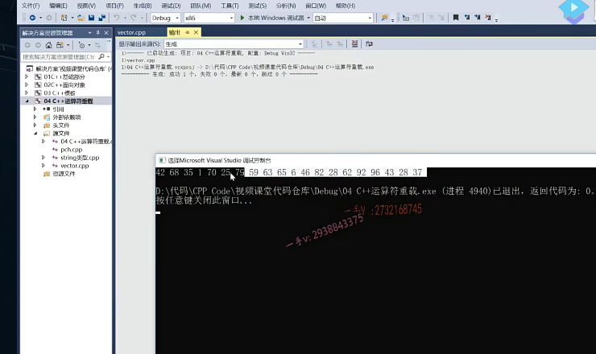

### vec[i]中括号重载   测试

嗯，vector里边的元素呢，就被我现在通过迭代器的方式进行一个打印了。对吧，当然了，我们刚才还有这个嗯，

比如size=vec的size，我们刚还给它提供了相应的这个运算符的重载，还记得吗？就是中括号运算符的重载vec中括号I呃随机访问数组随机访问。呃，这个效率也非常高的oe是不是这个也可以遍历啊？这个也可以遍历。啊，也可以遍历量，没有问题的啊，

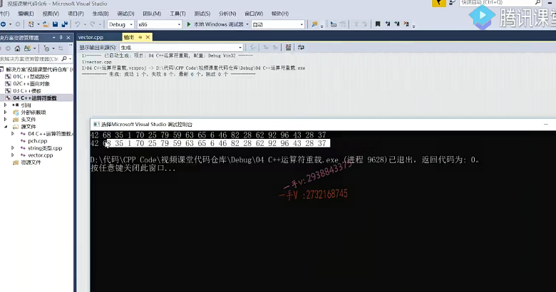

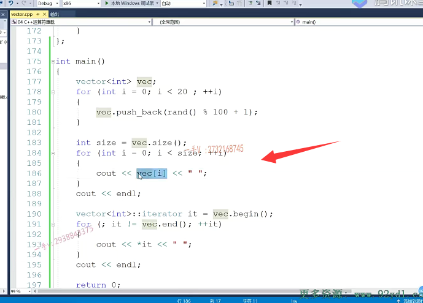

## 中括号重载  去遍历的意义 

### 不适用于所有容器

但是大家要知道啊，对于vector底层是一个向量容器，所以它底层内存是连续的。而我们给它提供这种中括号运算符，重载函数是有意义的，

因为这随机访问对于底层数据结构是数组的容器来说呢，它随机访问的效率非常高，是o1。但是呢，并不是所有的容器都会给它提供中括号运算符重载啊，

并不是所有的容器都会给它提供中括号运算符重载啊，像我们底层是链表哈希表或者红黑树。对的吧，这样呢，它根本就不支持中括号运算符串，因为它们的内存不是连续的，不是线性的。OK吧啊，不是连续的，所以给他们提供中国运算和重载函数，没有任何的意义，没有任何意义。啊，所以这个方式访问容器只能是说针对于我们vector有用啊vector有意义。并不是针对所有容器都是通用的，而只有我们通过迭代器遍历的方式，才是针对所有容器都是通用的。

当然，你如果嫌这个太长的话呢，在这里边我们可以用c加幺幺里边的凹凸啊来定义我们的遍历量。啊，我们会根据它初始化的这个右边的这个值呢来推导我左边的it的这个类型，因为begin返回的就是一个iterator，所以这个it。就是我们vector里边的aterritor迭代器类型啊，迭代器类型。

好，实际中呢，我们在使用CA+stl里边的容容器的时候呢？就比如说使用vector啊，我们在操作它的时候，我们也可以用我们这个迭代器。接代器来进行一个。实现啊，用迭代器来进行实现，当然你遍历的时候还可以用什么来遍历啊，还可以用for each来遍历，还可以用for each来遍历啊for each来遍历。那么CA+uu里边给我们容器提供了这个fore的实现啊，上节课其实我们给大家也看fore，其实呢？

其底层原理呢啊就是通过容器的迭代器。来实现。容器遍历的啊，因为它要找容器的闭根和摁的方法，对吧？我们上节课的时候呢？我们也看到了啊，看到了我们编译器给我们的一些提示啊。在这里边，我们同样呢可以进行一个打印，我们打印value，

这意思就是说呢，把容器里边的每一个元素呢都给value赋个值，哎，我们value呢就可以访问到了。

啊，在后边我们打过回车。这个也是可以遍历列的。好了吧，

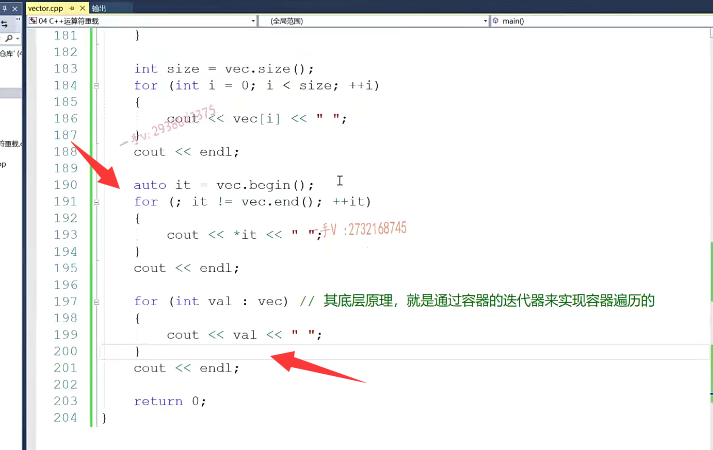

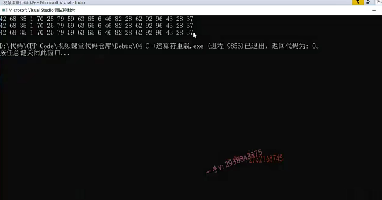

就是对于vector这个向量容器来说，你可以用中括号运算符重载函数来遍历它，你也可以用这个迭代器来遍历访问容器。你也可以用这种简单的for each的方式来遍历仿容器都是可以的啊，都是可以的，都是可以的。

# 总结

好了，那么今天这节课呢？主要还是加强啊，借助了我们之前写过的这个vector这个容器啊，来加强大家对于这个容器迭代器的这个理解迭代器的理解。好，

下一节课呢，我们要讲一个非常重要的内容，就是我们容器迭代器的失效问题。

迭代器在哪些场景下应用的时候会出现迭代器失效的问题呢？我们在这个找工作的过程中在。面经上啊，迭代器失效，现在家里边儿容器迭代器失效也是经常被问到涉及的一个问题啊。好，那我们下节课再详细来说。