## 迭代器失效

大家好，欢迎继续收看石磊老师的视频课程。这一节课呢，我们主要讲解一个内容呢，就是。迭就是这个迭代器的失效问题啊，迭代器的失效问题。什么是迭代剂的失效问题？迭代剂为什么会失效？啊，那这个问题该怎么解决？以及我们最后呢，在我们上节课所学习的这个vector，那个我们自己实现的vector源码上。我们来自己实现一下啊，

依据它CA+stlvector底层的这个迭代器啊，我们来自己实现一下。什么叫所谓的迭代器失效？我们探究一下它的原理。okay，那么在这里边，首先呢，我包含了一下CA+stl库里边的这个vector，这个容器啊。那我们用。==这个库里边儿的这个vector的容器先来演示一下什么叫迭代器失效的问题。==

# 容器中删除偶数元素

### 会产生迭代器失效问题

那我现在需要做这么一个业务啊，就是把vec容器中啊，容器中。所有的这个偶数全部删除。啊，全部删除。那在这里边做的话呢，我应该定一个迭代器，是不是定一个迭代器啊先？获取呢容器底层首元素的这代气啊，然后再是负循环at不等于VC点end。啊it不等于这个vec点n的再加加it。啊，在加加这个里头。对了吧啊，

通过迭代器呢，从当前元素变到下一个元素。如果说。这个模上二。等于了零。这就表示，我们当前在用这个it迭代器遍历vector容器的时候呢，碰见了一个偶数，对吧？那么，我们可以调用它的erase哎erase这个方法呢？给它传入一个迭代器。就是把叠代剂a它指向了当前的这个元素呢，从容器当中删除掉啊。vector呢，

还提底层提供了insert跟erase啊，这两个增加删除的方法啊insert呢。

第一个参数接收一个迭代器，第二个参数呢？接收一个value跟我们之前用的push back不一样，push back呢，只需要传一个数据就行了。因为它默认呢，就是把元素添加到容器的末尾当中的。而这个insert呢，是把这个元素添加到迭代器指向的位置啊erase呢，是接收一个迭代器。那你就是说呢，你给一位子一个迭代器，它就把迭代器啊迭代的。

这个位置的元素呢，就给你删除掉了OK吧？==那如果我在这里边加个break==，它表示什么意思呢？啊，它表示的是。

==只删除容器当中第一个碰见的这个偶数，只删除一个我们来运行一下==这个代码看一看。只删除一个。嗯，这个进程是没有任何问题的

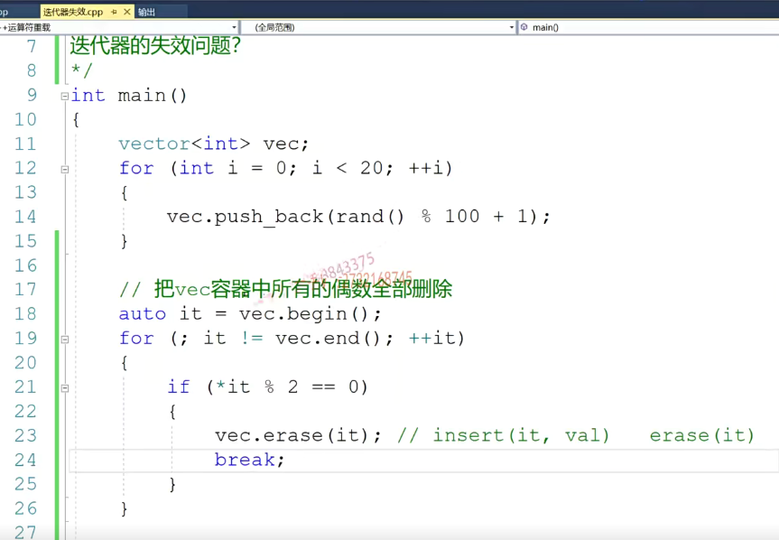

那如果我把break去掉，

这是什么意思？这是删除容器中所有的偶数。啊，我们看一下。哎，这个进程的这个结束完，返回码已经不是零了，也就是说呢？这个这个时候呢，进程运行呢，出现了意外的这个终止啊，出现了意外的终止就不可预期的错误。啊正进程不是正常，这个结束运行的。啊，

那为什么会出现这样的问题呢？那这里边儿呢？==就出现了我们所谓的迭代器失效的问题啊，迭代器失效的问题==

第一次调用啊，调用erase，以后。迭代器it就失效了。迭代器呢就失效了。没问题吧啊。失效了，那第一次调用arise it就已经失效了。哎，

==失效了，以后呢，我们再进行一个给它加加。那么，它就有问题了，==

==因为对于一个已经失效的迭代器啊，对它在进行一个加加运算符重载函数的调用。我们代码叫。产生这个不可预期的错误了啊，这是个非法操作。==

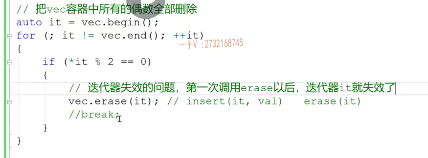

我们再来看第二个场景。那么，第二个场景呢？我们想打算这么做嗯，就是给vec。容器中。所有的所有的偶数后偶数前面吧，前面添加一个。添加一个什么东西呀？添加一个小雨。偶数值小于偶数值一的数字，那就是个奇数了，对吧？同样的，我们定义一个迭代器，

指向容器的这个笔杆。for循环a，它不等于。VC的end，加加it。在这里边啊。我判断啊，当前。a叠代器迭代的位置呢的元素的值直接用了嘛？那就是如果能够够被二整除的话，说明它是一个偶数。那我就要在当前的这个偶数的这个位置，把偶数挤到后边去，是不是嗯vector是个向量容器底层？的存储数据的是一个数组啊，

是一个数组。那么，你在某一个元素呢？添加一个元素的话，==添加一个新的值的话呢？后边原来的值都要向后挪==是吧？给这个it地方啊，添加一个比偶数值小于一的一个数字，那就说奇数。如果只增加一次，我看一下这个运行的这个情况啊，==如果只增加一次，我发现我进程是正常的==，这个结束。

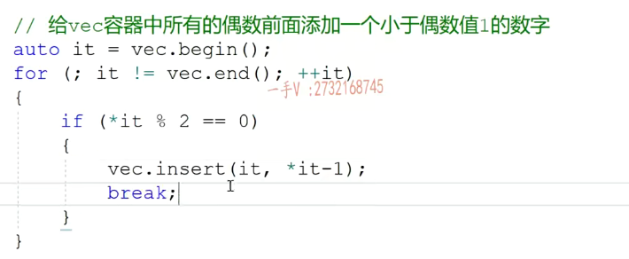

那我现在同样的，我把这个break去掉，也就是说呢，在这里边啊。我需要添加多次。啊，需要是添加多次啊，添加多次。这里边儿呢，先不用管我们程序的逻辑正不正确啊，逻辑就是正确，它也运行不下去啊，它也运行不下去。为什么呢？在这里边儿跟我们刚才遇到的问题是一样的进程呢，

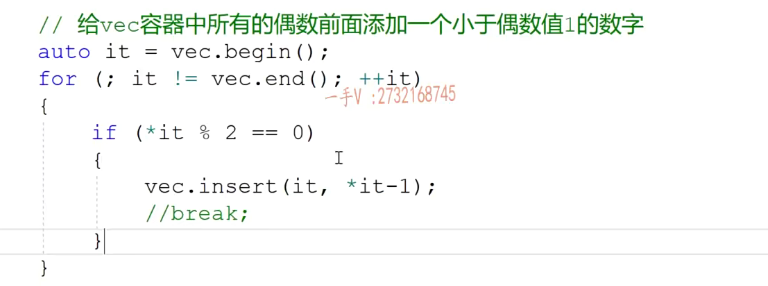

意外终止啊，意外终止。也就是说这里边呢？这里的迭代器在第一次。insert之后。啊，这个iterator。就失效了啊e就失效了。失效了就没有用，也就是当你==第一次insert以后呢？当前这个失效==了，你再对它进行一个加加的话，==你对一个失效的iterator再进行一个加加==。运算符重载函数的调用，那这就是已经没有意义的事情，

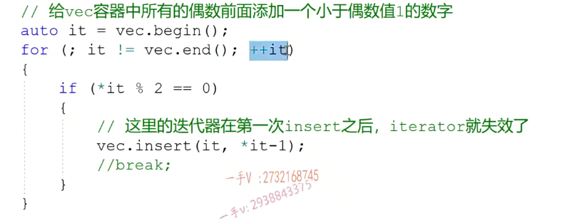

有一堆的这个元素。乐队的元素。这是我们vec。那你注意啊，当我用迭代器进行便利的时候呢，我用迭代器从它的首元素开始，一个一个元素进行便利啊，便利到这个再到这个再到这。假如说呢，我给它到这里边的话，我检测出来，这里边有一个偶数，比如说是88。

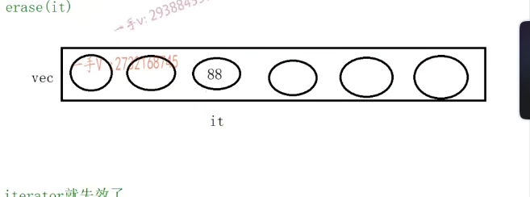

那我在这里边啊，进行一个删除操作啊，我就是要把这个元素删除掉。把a它指向的这个元素删除掉，那么你注意啊，当你删除这个元素以后呢？那也就是说这个位置。==删除点在这个位置,到我们容器末尾的位置==。啊，所有你之前生成出来的迭代器。就都失效了啊。==迭代器全部失效==。这代器全部失效，那也就是说在这里边儿啊，

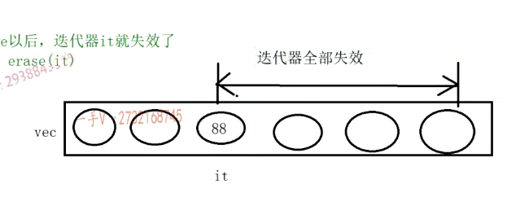

# 迭代器失效的底层原理

大家看啊，你这个it删除了你it所指向的位置的元素。==你包括你这个it本身也就失效了啊，那这个失效底层代表的是什么呢？===那大家先记住结论。我们一会儿在我们上节课的这个vector，==我们源码上呢，我们来来给它实现一下啊，这个迭代器==。底层啊，更加全面的这个迭代器的一些其他内容就包含我们控制迭代器失效的这段段代码，我们刚才我们到时候再看一下它==所谓的迭代器失效的底层原理==是什么？在这里边，我们先记住，当我删除迭代器指向的元素的时候呢，

我这一删迭代器本身以及原来指向后边儿某一些元素迭代器呢。就全部失效了，用不了了嗯，你再对迭代器做任何的加加或者不等于啊，

## 没有扩容  和 发生扩容的情况分析

增加。会分为两种情况，==一种情况是当你增加它没有扩容的时候啊，没有扩容的时候啊==。什么地方的迭代器失效了呢？就是。这个是删除的情况啊，删除删除情况啊，这个是增加情况。==这个是增加元素的，这个情况啊，这还是未扩容的时候，就是什么意思呢？就是当你这就跟删除一样你==。

删除点或者增加点之前的迭代器呢？都是好的。但是你删除点跟增加点之后的迭代器就全部失效。啊，就全部失效了。那就像我们这里边儿，如果你给当前的这个it指向的位置添加了一个新元素的话，那么这个it本身。到我们。整个儿容器后边儿所有元素位置上的迭代器呢啊，如果你持有某个元素的迭代器，那全部都失效了。那这个迭代器本身也失效，不能够再对它进行一些加价运算的，或者是像这样的关系运算不能再做。

做了的话，我们代码就要出现异常了啊，就要出现错误了。

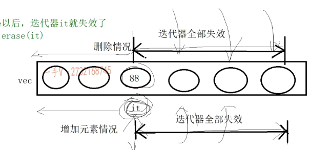

增加还有一种情况就是扩容了。啊，增加还有一种情况就是扩容，==扩容==了以后呢？它的内存呢？它就是在其他地方重新是不是==又开辟了一块儿内存啊==？对吧，那相当于呢，你原来你在原来这个容器底层内存上所保持的这些迭代器，那就全部都失效了。因为迭代器我们知道嘛，

迭代器它本身是不是对于vector来说，它==vector底层数据结构是一数组==，所以用vector的这个迭代器，它底层拥有的就是一个指针嘛。是吧，你==现在通过一个增加操作，导致我容器底层都扩容了==，==扩容就是我分配了另外一块儿内存，在内存的另外一块儿地方==。保存了数据，那你这个==迭代原来的迭代器就就都指向原来的老内存==，那就完全==全部都失效==了。啊，如果扩容的话，那在这里边。

原来的迭代器就全部失效了。全部失效。全部失效啊，全部失效。

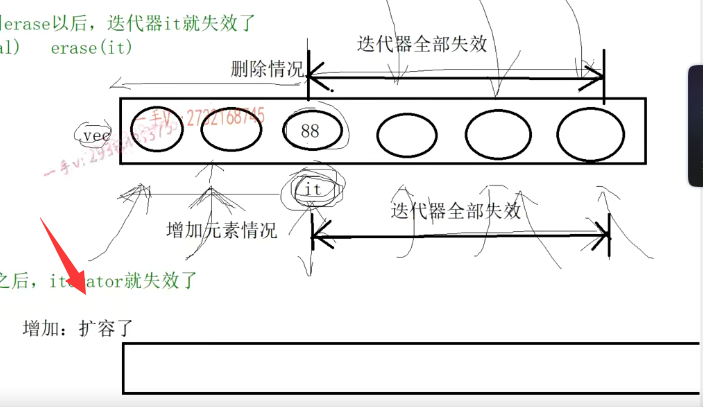

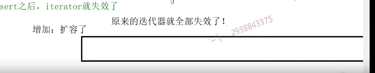

### 迭代器为什么会失效？

我们就是如何去解决这个迭代器失效的问题啊？如何去解决迭代器失效的问题？那么，大家来看一下啊，首先我们在这里边列一下啊。

就是第一个问题，就是迭代器为什么会失效？

## 调用erase方法

a。当这个容器调用用这里边儿，

==我们虽然用的是vector举例子，但其实放到其他容器都是一模一样的啊==，包括得list，还有我们关联容器。他们都有insert的erase啊，当容器调用erase方法后啊方法后。啊，迭代器。啊，当前位置到。到这个容器末尾元素的所有的迭代器全部失效了。啊，全部失效。

当前位置到容器末元素的所有迭代器全部失去了啊，

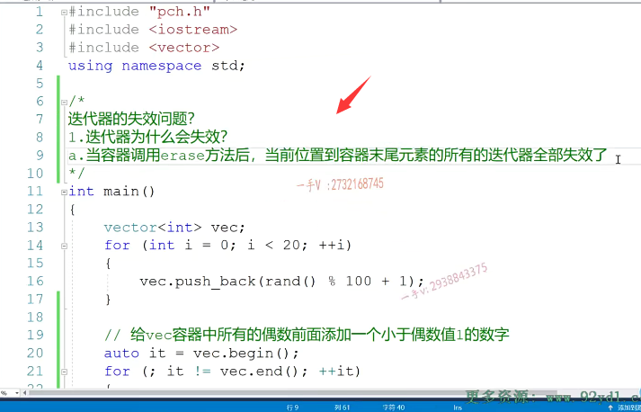

也就是说我们删一次可以，

因为你删一次，第一次删之前你这迭代器还有用。啊，你删一次这迭代器就失效了，你就不能再用了，但是此时如果你break掉的话，你就没有问题，但是如果你想啊，没有没有break，你想继续做其他操作你。又把这个已经经过删除失效了的迭代器继续给它做这样的运算啊，加加减减运算。关系运算，那么它代码就要抛除异常了啊。

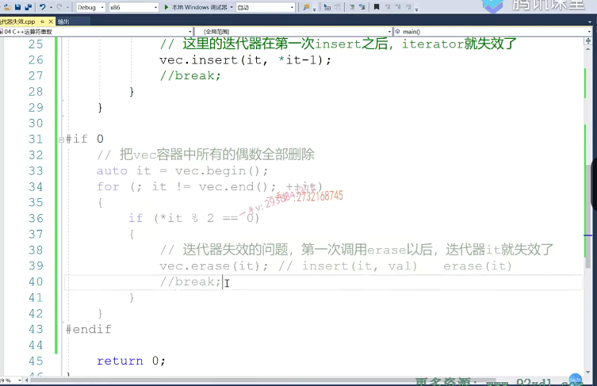

## 调用insert方法

## 没有发生扩容

b里边分为了b1，就是当容器啊调用。erase那其实我们就合到一块儿了啊，调用insert方法。调用insert方法后啊，==当前位置到这个容器末尾的元素的所有的代替器就全部失效了==，对吧啊？但是呢，==就是插入点到删除点，就是首元素。这个是到插入点或者是删除点。啊，再到我们末尾元素对吧啊？这块儿呢，迭代器就这一部分的这个迭代器。全部失效。   ==那首元素的插入点或删除点，这部分叠在一起呢啊，叠在一起依然有效，因为前边呢没动过嘛==，对不对啊？前边没动过。

## 发生扩容

### 全部迭代器失效

但是呢，如果对于这个删除了，对于增加来说。如果引起容器扩容。啊引起容器内层扩容。那么，相当于我们底层要重新开辟，是不是新的内存啊啊？那么，原来的这个容器底层的这些。==元素的迭代器啊，原来容器。的所有的迭代器就全部失效了，因为连内存都变了==。

是不内存都变了呀啊，内存都变了，你原来的迭代器，它底层的指针指向的原来都是容器的旧内存。啊，现在让你做了一个插入操作，引起容器扩容了，分配了一块儿新的内存，那你原来所有迭代器就全部失效了。是吧，注意这三种情况，应该说是啊，三种情况。c说的是我们扩容的时候啊。

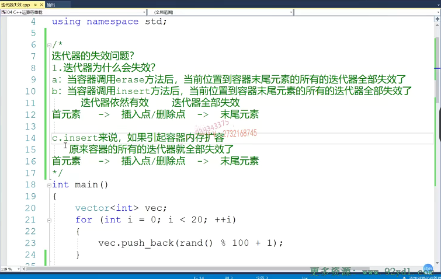

那么第二个就是迭代器失效了以后。

问题该怎么解决啊？问题该怎么解决？那么，这个解决的办法也很简单，就是对。啊对。这个插入。删除点的迭代器进行更新操作啊，你要对插入删除点的这个迭代器呢？要进行一个更新操作okay吧，更新操作。

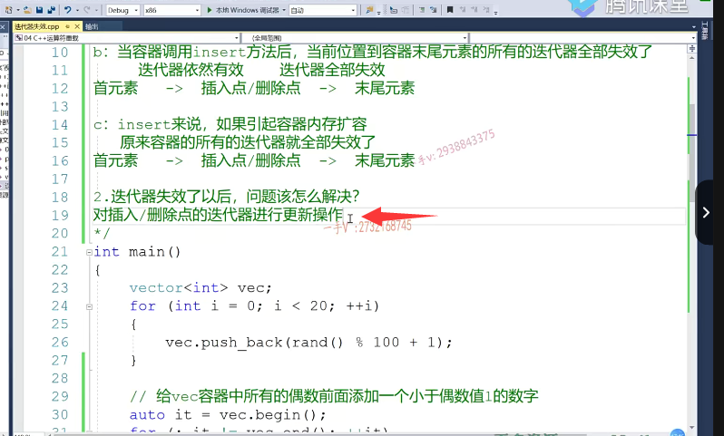

# 解决迭代器失效问题

那么第二个就是迭代器失效了以后。

问题该怎么解决啊？问题该怎么解决？那么，这个解决的办法也很简单，==就是对这个插入。删除点的迭代器进行更新操作啊==，你要对插入删除点的这个迭代器呢？要进行一个更新操作okay吧，更新操作。那怎么更新呢？我们来看一下啊。那我们首先来看第一个。我们这里边的这个删除。

啊，删除。大家注意一下啊erase跟insert呢，我们看一下人家的这个原型啊，原型哎，人家都会返回来一个新的迭代器。==也就是说erase跟insert呢，它插入完给当前位置，插入完元素以后呢啊，那由于当前位置到后边的迭代器是不全部失效了==？哎，它会返回，它会返回，那后边儿如果你还没有持有后边儿元素的迭代期，那就不用关注了。

唉，因为你刚这个==it指向的是当前元素嘛，所以你在当前元素的位置呢，去增加一个元素，把当前元素挤到后边去了==。==或者是把当前元素给删掉了，那当前指向当前位置的这个迭代器就是当前的这个it，它就失效了==。啊，那么当你进行一个增加或者删除操作呢？它会把操作完的，就是当前这个位置的一个新的迭代器。啊，新的a。返回啊，

新的iterator的返回就给你。

生成一个当前位置的哎，合法的一个迭代器给你再返回回来，所以呢，我们在这里边呢哎。==用它的返回值把我们的这个循环变量就是这个，当前这个迭代器it去给它更新一下啊==，去给它更新一下。注意更新了以后呢，我们这个迭代器呢，就有效了，你注意一下，你不能光关注这个迭代器的更新，保持迭代器有效。我们还需要关注呢，

我们程序逻辑的这个正确性啊，==当你删除了元素了以后，后边儿的元素都会往前挪。对吧，后边的元素都会往前挪一个啊，所以呢，如果删除了这个it就不要加加了==。

啊，应该继续呢，在当前位置进行判断，因为后边那元素刚挪到当前位置来了，对吧？如果说是我没有删除，那就是当前元素，它不是偶数我的这个迭代器才需要进行一个。

加加操作，==所以我把这个for循环呢，直接改成while循环==，我只需要一个迭代器的判断条件就行了。啊，迭代器的判断条件就可以了。然后呢？我在这里边呢，进行一个我的这个打印啊。

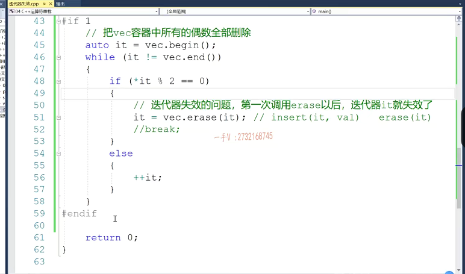

我们来在这之前进行一个打印for循环inter vvec，用我们的这个for each来打印一下它的这个内容啊。see out v.操作完了以后，我们再进行一个打印。我们来看一下啊，

到底有没有把我们的这个偶数呢？都进行一个删除啊。全部省计数了。偶数呢，就全部删掉了。对吧28。啊八十二二你像你像这一组全部是偶数啊。全部是偶数，那就是65后边儿就剩到434328以上，剩37那就OK了

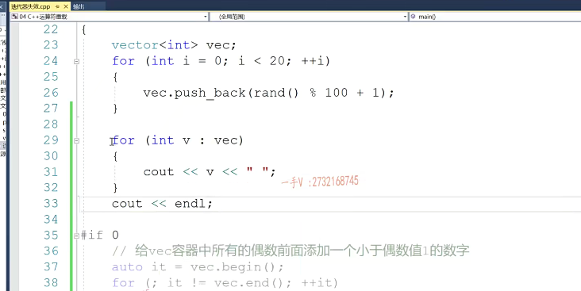

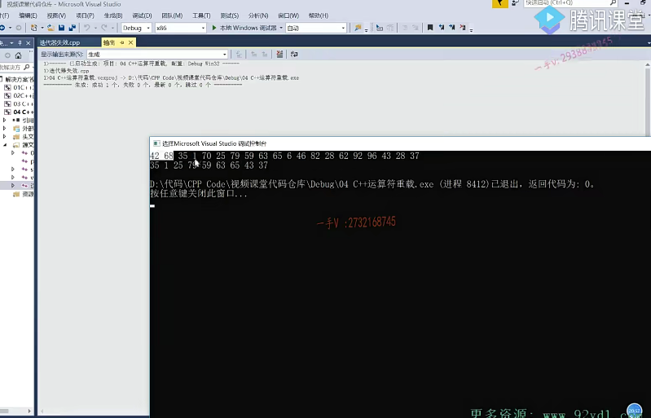

## 总结

啊，注意一下，这里边逻辑这个是更新。当前，删除位置的迭代器。

啊，一定要更新。好了，那这段代码呢？删除那我们就做正确了，那也就是说后面我们在写代码的过程中，如果涉及到啊，用迭代器呢来便利啊。容器的过程中，涉及到我们通过迭代器。来删除。或者是在当前位置增加新元素，而且做连续的操作啊，连续连续多次的操作就一定要记着对这个迭代器要进行一个更新。在这儿呢，

## insert()解决

我们再来看一下这个插入。

插入以后呢，当前这个位置的迭代器呢？it也就呢失效了啊，不管你容器底层有没有扩容？对吧诶，我都要用insert的返回值把我当前的这个循环变量叠在一起，更新一下。更新一下。那你要注意啊，要注意，如果是偶数的话呢？哎，当前元素是偶数，我判断了以后我在当前位置增加了一个元素。

### 插入后原来的元素就被挤到后面去了

本来就把我。==当前这个位置的偶数呢？就挤到后边儿去了，因为在当前位置添加一个元素，原来的元素是不是都要挤到后边儿去啊==？啊，那就不要加加加一次a它了，那一次a它的话相当于又判断我后边儿那个偶数了，我后边儿那偶数我刚才已经判断过了。啊，判断过了以后给当前位置添加了一个新元素，把它刚才判断的这个偶数挤到后边儿去了，你再加加it，这个it又跑到。刚才我们判断这个偶数上那这个循环就完不了了，

### 如果满足条件需要加2次，不满足只需要加一次

所以在这里边呢，我们增加一个元素以后。我们it要加两次。要加两次。对吧，如果没有碰到偶数，那我们只加一次就行。好了，我们看一看我们结果的打印，那么这样一来呢诶。大家看一下我们是不是给所有的这个偶数，前边呢都添加了一个小于一的这么一个奇数呢？没有问题的吧啊，这就是我们所谓的继电器失效。我们要给。

哎，这个。当前的迭代器变量要通过函数的返回值进行一个更新啊，

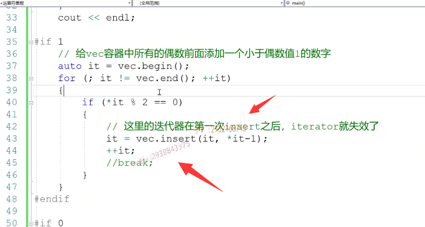

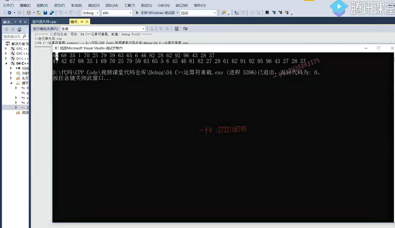

## 总结

### 迭代器失效的解决办法，就是更新迭代器

同样的，如果我们在vector使用过程中啊，容器使用过程中用迭代器进行连续的插入操作的话，记着一定要对这个。迭代器变量啊，这个循环变量要进行一个函数返回值的一个更新，这个迭代器才能保持有效。好，这就是我们说的啊，给大家介绍的这个容器使用过程中，为了迭代器的这个失效问题啊，失效问题。

啊，以及我们如何去解决这个迭代器的失效问题，那我们这些成员方法呢，都已经考虑到这些问题了是吧？人家给我们提供的途径就是通过返回值呢？啊，给我们返回回来当前位置新的这个迭代器有效的迭代器，哎，我们把我们迭代变量。这个更新一下就可以了。好，这段代码呢，我就先说到这儿啊，先说到这儿，这时候我们把这个迭代器失效的问题，

我们介绍完了。

# 迭代器失效的原理

当然有的同学肯定是想研究一下其原理，研究一下其原理，对吧？那我们就在我们上一节课的这个代码上啊。啊，上节课代码上我们直接给大家说一下它这个东西啊，实现的原理到底是什么？因为我们这个课程呢，不宜过于长过于长的话呢，大家可能就听的有点儿头疼了啊，所以呢，这段儿代码我就在下边儿呢，就直接写好了。

我们在课堂上给大家直接演示一下就可以了OK吧，直接演示一下就可以了，那么有兴趣的同学呢，可以跟着我们的课程呢。下去呢，在这个vector的源码上自行添加一下，好好体会一下我们在CA+stl库里边儿是如何给这个容器啊？实现它底层迭代器的这个失效的问题的。okay

好了，那么跟我再回忆一下，我们刚说了啊。像这个删除操作啊，删除跟增加这增加我们没引起扩容对吧？就是当前位置之前的所有元素迭代器，

如果你持有相应。元素迭代器的话，迭代器是不会失效的，因为前边元素没动过嘛，是吧？但如果你删除或者是增加点。啊，这儿改动了，那么从这个点到后边儿，所有元素的迭代器，如果你持有了相应元素的迭代器呢？迭代器就全部失效了。好吧，如果对于增加操作来说，你增加了一个元素，

或者增加了一组元素，导致容器扩容了，也就是容器底层的内存。在内存中的位置都改变了，哎，那么。原来容器所有元素，如果你持有了某个元素的电器，全部就都失效了。这一点搞清楚啊，这一点搞清楚。好，那我们来说一下呢，我们代码上的实现。大家来看。

# 迭代器失效解决方法  代码实现

## 需要提供迭代器  是哪个容器的迭代器

首先呢，在这里边儿，我们给这个iterator啊，就是我们容器的迭代器呢，哎，之前呢，我们是不是只是给它增加了一个？指针哎，因为我们这个容器呢，底层是一个数组嘛，用迭代器去遍历它的话呢，就是一个指针。okay了吧啊。另外呢，我们现在给容器给我们迭代器呢，

还添加了一个这么一个成员变量就是。让我们迭代器知道我当前呢？哎，我当前迭代的到底是哪一个容器对象？因为大家需要知道的，还有一点就是。迭代器的这个失效啊。应该是d吧，我们说一下d。不同容器的迭代器是不能进行比较。运算的啊，不同容器的叠代器，你去比较它们是没有任何意义的，也就是说两个叠代器呢，进行不等于比较或者等于比较呢？

啊，只能是同一个容器的迭代器进行比较才有意义嘛，唉，我判断呢，我这两个迭代器是不是指向一个容器的同一个位置了？啊，那这样才有意义，两个容器肯定是两个内存上不同的地方，你去比较它们的迭代器呢，没有任何的意义，所以呢，当我们去比较的时候呢，我们就会出现。啊，错误的叫做iterator incompatible啊的一个。

错误啊，就是迭代器不匹配对吧？所以在这里边我们我们也为了模拟这个东西呢。哎，我们需要给迭代器添加一个指向当前对象的一个啊指针。指向了当前容器对象的指针。没有问题吧啊，

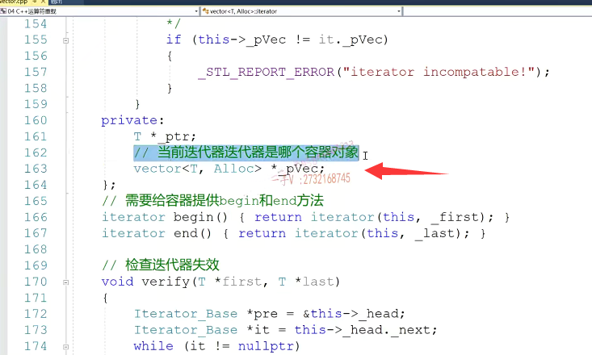

那么。在这里边。我们给这个迭代器呢？又添加了啊，又添加了这么一个构造函数添加了这么一个参数啊，就是接受啊，外边儿传进来的一个容器对象的这个地址。

啊，给我们这个迭代器的成员变量呢，做一个初始化操作，在这里边儿呢，我们通过迭代器的构造函数，把外边儿容器的一个。地址呢？传进来给我们的成员变量赋个值是吧啊？这里边儿现在做这个事情，

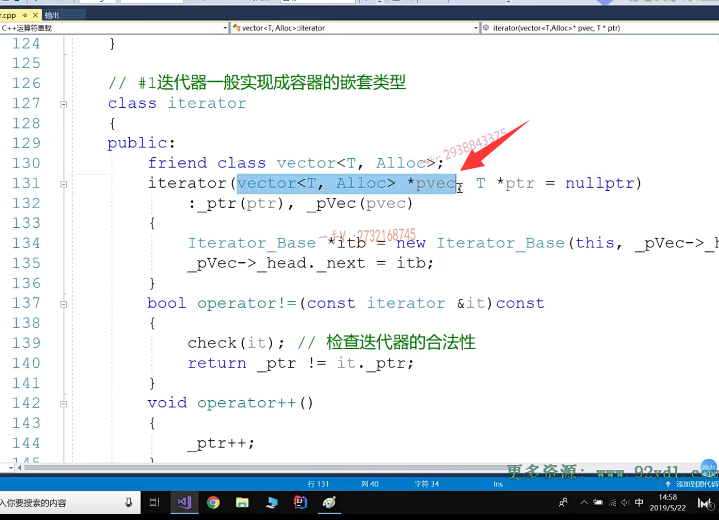

先不关注

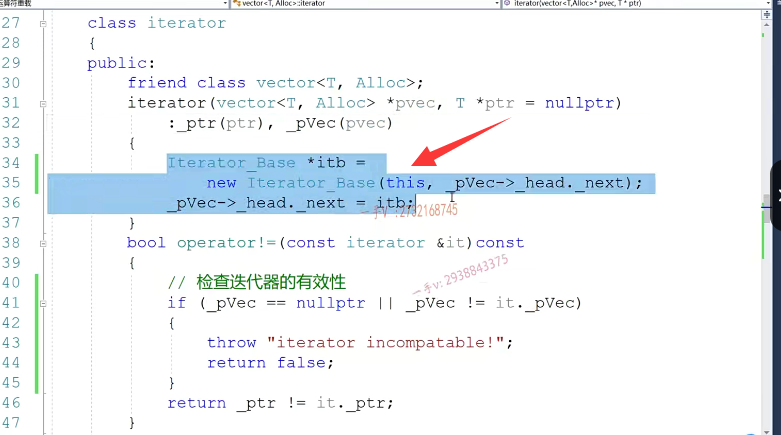

我们看一下迭代器的，其他的成成员方法。那么，在这里边儿，我们给迭代器提供的不等于运算符，

要加这么一个东西啊，就是说呢，==如果你要对两个迭代器的这个进行比较。啊，如果迭代器底层的这个指针。就是它指向的这个容器是空的==，这个就表示迭代器失效了，或者是迭这个指针不为空，那也就是说呢，当前迭代器所迭代的容器。跟你传进来这个it所迭代的这个容器不一样，就它那这就是我们刚说的，你再用两个不同容器的迭代器再进行比较。这是没有意义的啊，这是没有意义的。

那么，这里边我们抛一个异常intact incompatible。没问题吧，那异常也是结束我们函数逻辑的一种方式，这里边就不需要return force。okay啊。

okay啊。那么如果呢？你迭代器有效，而且呢，你们俩迭代的都是同一个容器，那我再对你们俩。这个迭代器的底层指针进行一个比较，这才是有意义的

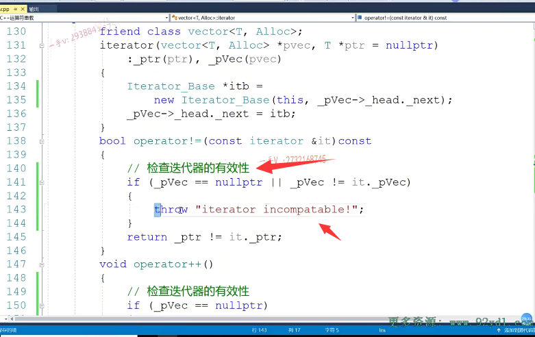

那么，如果对于加价运算符重载函数，

如果你这个。迭代器呢？已经失效了，也就是说呢，迭代器底层指向它所遍历的容器的这个指针。已经为空了啊，那为什么为空刚开始肯定是不为空的，因为我们创建迭代器的时候已经给它传入了相应的这个对象，它所迭代的容器的对象。那什么时候为空，我们后边再来看，如果迭代器有效的话，我们再进行加价操作啊。

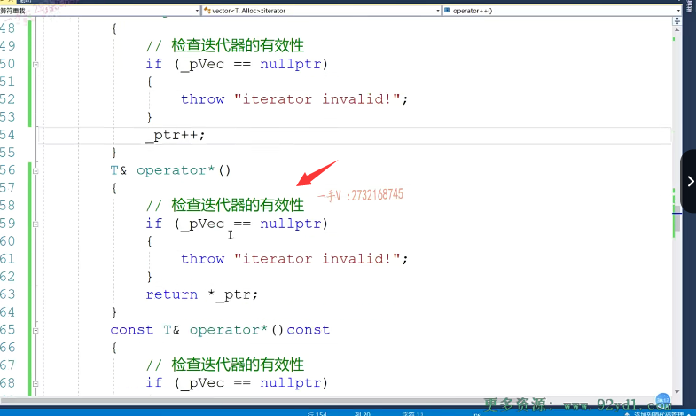

## operator* 重载

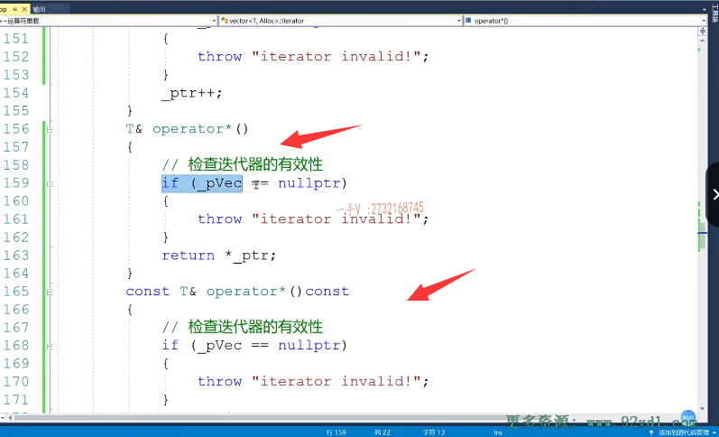

那这个迭代器是空的话，那就相当于迭代器呢？

失效了。这同样的道理，对吧？这就是给迭代器呢？先添加了一个指向我们容器的这么一个指针。大家搞清楚。也就是说呢，我们容器呢，现在我们迭代器呢，现在可以知道我到底现在迭代的是哪一个？容器，

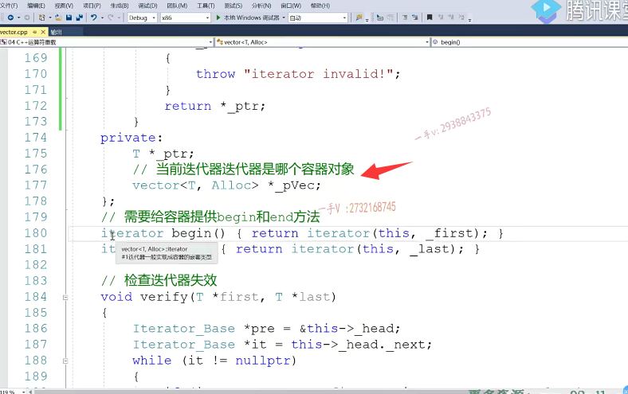

然后呢？在创建这个首元素跟末尾元素后继位，这个代替的时候大家看一下啊。在这里边儿给它串建当前的this，

因为这两个方法是我们容器的方法啊。那这个this是不是就指向我们当前容器对象的这个指针啊？所以我们就把this呢，直接通过iterator迭代器的构造函数给它传进来。放在mp vec，所以杠PM呃杠pve c呢？我们有容器通过容器创建这个迭代器，我们这个。是，肯定是。不会为空的，对吧？我们可以在这里边儿也给它一个默认值啊，你通过容器创建的这个迭代器，它肯定是不会为空的啊，

它肯定是不会为空的。啊，那它之所以在这里边有空，是因为我们迭代器被失效了啊，迭代器失效了。

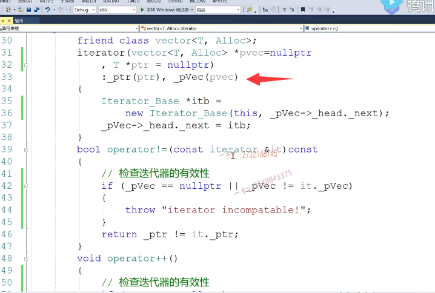

好，我们再来看，我们再来看接下来的，这是添添加了这么一个成员变量，大家知道啊，现在迭代期变成两个了。第一个呢？这个指针呢？指向的是啊，这个。

当前，容器底层的这个数据结构啊，我们这个指针呢？指向的。指向的是我们迭代器所迭代的容器对象。

## 总结

### 两个指针，一个是指向底层数据结构，一个是指向迭代器所迭代的容器对象

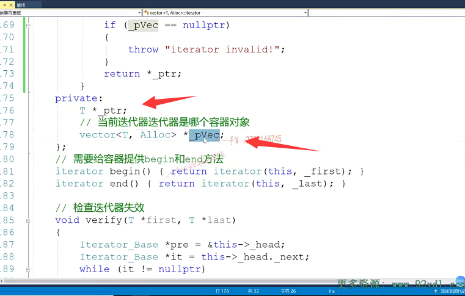

现在我们在删除或者增加的时候呢，它会把当前的这个位置呢，它这个迭代器。呃，失效掉它怎么失效呢？在这里边儿，大家来看一下啊，注意看一下，仔细分析一下啊，在这我们添加了这么一个。

就是给容器啊，给容器添加了这么一个结构体，叫it alit or base，这个结构体里面呢，维护了一个指向某一个迭代器的指针。哎，又定义了指向下一个iterate base节点的一个next地址。啊，那也是next指针保存地址对吧？那么在这里边我们定了一个头结点。明眼的同学都能看到啊，这里边儿我们想打算用一个链表用来记录什么东西呢啊，当然用来记录呢。我们用户呢，从我们这个容器里边获取的。

哪个元素的？是不是迭代器呀啊？哪个元素的迭代器？我们把这个呢，就都记录在我们以亥的为头节点的。这个eternal eternal base链表当中。好了吧，这个需要注意一下啊，这个需要注意一下，

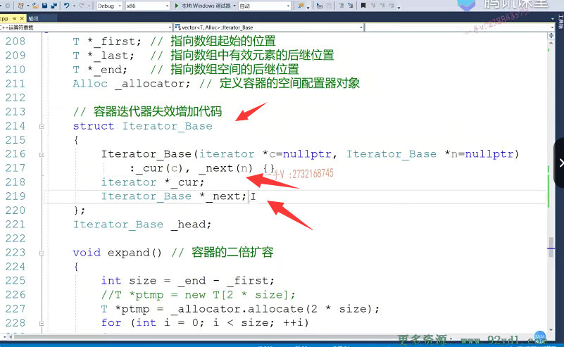

## 要让迭代器失效，重新更新

我们把这个呢拷贝过来吧。这是给容器提供了这么一个东西，==就是我们要把所有的迭代器都记录下来啊，记录了以后呢？当我们发现呢，通过哪个迭代器进行了增加或者删除，那我们就要给相应的迭代器呢，要让它失效。啊要呢失效让迭代器要重新更新。==

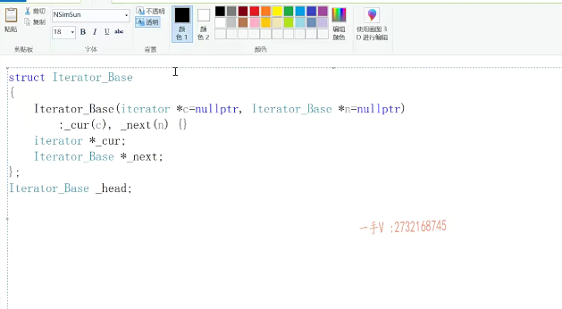

好，再来看。这是我们刚才的这个。递代器的这个构造函数了啊。叠代器的构造函数。迭代器的构造函数迭代器的构造函数是不是相当于就新生成了一个迭代器呀？啊，通过这个。通过这段代码，通过这段代码，我们呢？哎，

心生。成当前容器某一个元素。啊某一个位置。元素的迭代器。这不是有一个地址嘛，对不对啊？那么，在这个叠叠器的这个构造函数里边，你看我们就生成了啊，我们就生成了。生成了一个a terri TOR base。这么一个新的节点啊，这个this是谁的地址呢？就是当前新生成的迭代器对象。就是当前迭代器对象，

当前元素迭代器对象的地址，这是我们iter的构造函数嘛，没问题吧？这是记录的是我们。哎，当前的这个新生成的迭代器的对象啊，这相当于一个头插法一样啊。

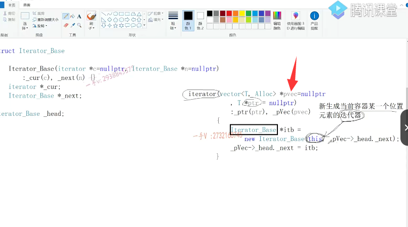

## 画图描述

这就是我们iterator的构造函数，第二个参数是next。啊，那么我们画一下这个呢，是我们头结点这个是。第一个节点，这个是第二个节点，对吧啊？

这是我们地址域。这个是我们的head。啊，这是其他的两个iterator base类型的节点。iterator base类型的节点。==头节点里边不放数据是吧？放数据没有意义，那我们在这里边儿放的就是一个什么呀？我们在这里边放的就是一个iterator的指针==。啊，

==数据域里边儿我们放的就是iterator指针。每一个结点的数据域。哎，都存放了一个从我们容器获取我们容器内部某一个元素的某一个位置==，

元素的是不是迭代器呀啊？类似这种。我这个相当于就这两句话了啊，这两句话这两句话相当于就是一个头插法。头插法，我现在又新生成了一个结点。对吧啊。把我当前一个新的这个迭代器就是this嘛，现在新生成这个迭代器对象的这个地址呢写到。数据域里边。啊，这是一个新的一个迭代器。新的aterritor。没问题吧，然后再把我iterator的next制成我头节点的next，

那就是这样去连接一下。再让呢头结点的next指向我当前的这个星结点b是吧？就这样哎，那就是把我们新的这个it呢，就连接到我们的这个链表上去了。啊，我们仿照的就是我们库底层的这个实现来做的。

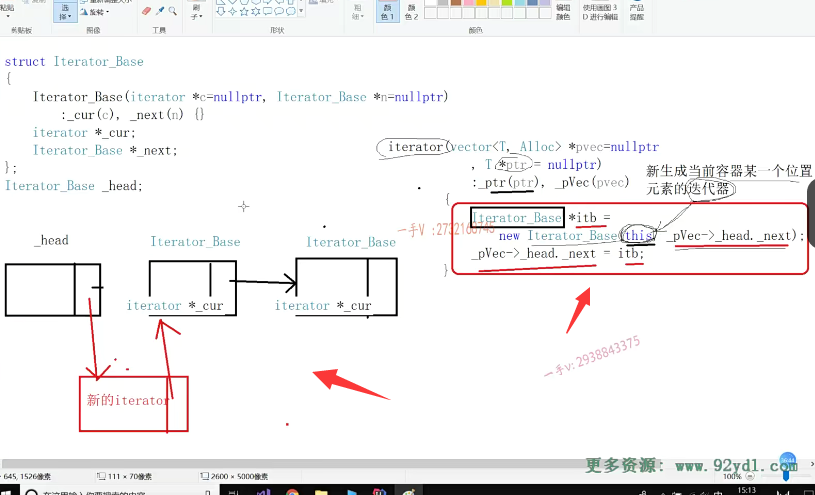

那也就是说，其实呢，我们底层呢，维护这样的一个链表啊，把我们所有从这个容器中获取的某个元素迭代器呢？都记录在这条链表当中了。都记录在这条链表当中了。啊，

注意一下，这每一个iterator呢？指向的一个iterator对象。它都包含了两个东西，第一个就是一个指针，指向了我们容器的底层数组的某一个元素，第二个呢？就是我们的呃。一个容器的地址。指向一个容器的指针。对吧啊，注意一下这两个。

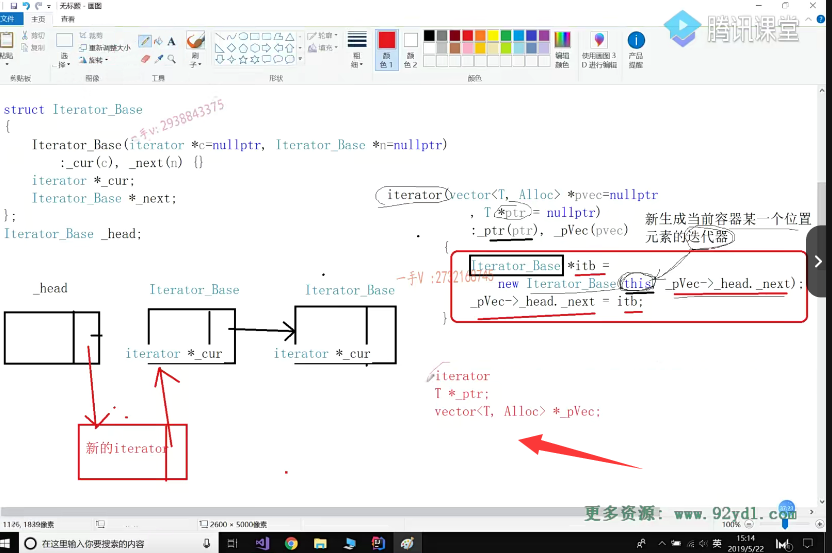

### verify()检查last-1

好看一下，现在呢？现在呢啊，

现在呢，我们要做一个。pop back操作，你看一下pop back。我在pop back的原来代码上呢，我们库里边实现了一样，加一个verify，因为pop back呢是从当前。这个末尾元素进行删除的，所以在这里边very fine，你要删这个检查一下last- 1 last。

erase(),insert()中 verify() 使用

对吧，那假如说在这里边，如果我们调用的是erase it。那对于这个函数，

我们要检查哪一段儿呢？哎，我们就要检查呢。it就是当前位置的这个。当前，数组元素位的这个地址一下到我们last。这个位置中间所有的迭代器都要进行检查，如果你迭代器包含在这个区间的话，我就让你的迭代器。失效啊，这个就表示呢，我删除末尾元素了，那你之前获取的末尾元素的浏览器就要失效。没问题吧，同样的在这里边儿，

如果你是insert的话，在当前位置差一个value，那么insert里边儿就有一个verify也是这么一个样子。要从当前插入。节点的这个地方啊，给出了这个位置的地址到我们。末尾地址元有效元素末尾地址。都要进行一个verify。啊，检验检查是吧啊

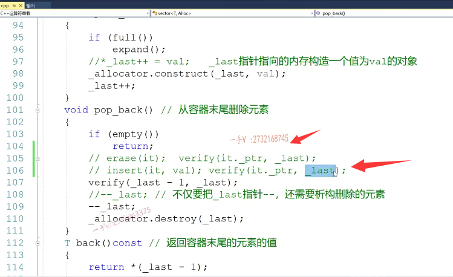

## verify()遍历链表，删除链表中存在这个范围内的节点

### 链表节点上value记录的都是迭代器的地址，需要将迭代器中的pvec置空

### 然后删除这个节点

那verify里边到底做什么事情呢？大家来看一下。verify里边儿做的事情就是这么一个事情，就这么一个事情。相当于就是遍历链表啊，这个pre指向了链表的头结点，就是指向了这个头结点啊。这个it呢，指向的就是第一个结点。就指向应该是这第一个节点，对吧？他就在判断啊，如果呢，我遍历你这个链表，我发现呢，你这个链表上啊。呃，链表上记录了哪一个迭代器？哪一个迭代器？对吧啊。

迭代的这个地址啊，迭代的这个元素地址是在我检查的这个范围之内，你看大于first。小于等于last。没问题吧，我就==让你这个迭代器失效==。我就让你这个迭代器失效。那所谓的失效，就是把迭代器指向了迭代器，哎，它的这个。成员变量。啊，==把指向迭代器cur这个cur就是指向迭代器的指针==，那迭代器里边儿是不是？

==有一个m_pvec 呀，把迭代器呢，所迭代的容器的这个指针直接置空==，也就是说呢。我们代码上一检查呢，这个迭代器的这个指向容器的指针为空了，就说明这个迭代器失效了。哎，然后呢？把这个结点删除掉，因为我们要连续检查，所以在这里边delete当前结点以后呢，重置it，让它继续向后检查。那也就是说，

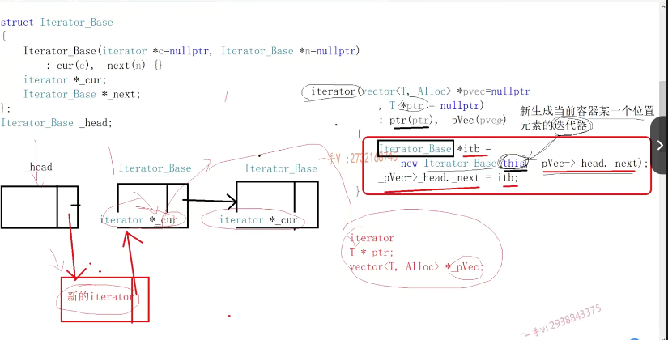

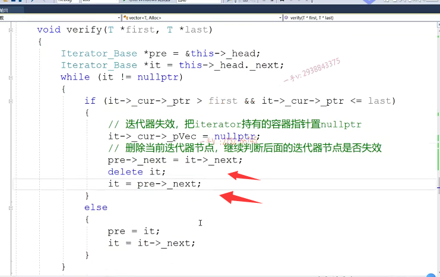

那也就是说，

在这里边儿，它所谓的这个在我们就做了增加删除操作以后啊，它就会呢。把我们当前结点。的地址以及到末尾的这个地址呢？啊，全部进行检查。怎么检查呢？就在这个。存储了我们迭代器的这个链表上进行便利，发现我们哪一个迭代器指针所指向的迭代器。它的这个。哎，迭代的这个元素的这个指针呢？在我们检查的这个范围之内。

它就要把相应迭代器的这个指向容器的这个指针置成空，就代表呢，它已经是一个失效的迭代器了。啊，失效的迭代器了。没问题吧啊，所以这就是我们刚才在这里边儿看到，为什么我们说第一次删除或者第一次插入的时候啊，当前位置的迭代器就失效了。因为你在进行一个插入的时候，你在进行一个插入的时候。没问题吧，你是不是从当前这个位置进行一个插入啊啊？当前位置进行一个插入。那插入了以后呢？

它就会在当前这个地址呢，跟日照末尾呢，进行一个检查。在我们的这个链表上搜索，如果呢？你链表上只链表上记录的这个迭代器的这个地址呢？哎，在我的这个。范围区间之内，我就让你这个迭代器呢，指向容器的这个指针，让它成为空指针，也就是说迭代器失效了，

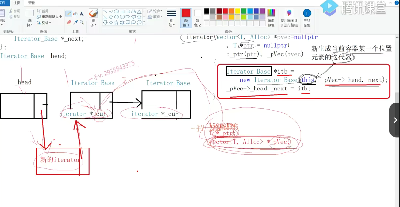

在这里边儿应该给first也加一个。大于等于啊，

包含了两边的这个边界啊，包含了两边的这个边界。没问题吧？它的实现思路库里边实现思路就是这个样子啊，这个大家呢可以。跟着这个思路呢呃，去体会一下，去体会一下我们。容器底层迭代器失效的这个问题到底是怎么实现的啊？在这里边儿，我唯一没有做的一一点呢，就是去释放这个去释放我们这个。什么东西呢？就释放我们这个链表啊的控件，这里边儿往往没有去写，

在这里边儿写这么写，这一段核心代码呢，主要是。给大家嗯，让大家搞清楚容器底层迭代器的这个失效到底怎么实现的，在这里边给大家写了一个非常简单的例子，

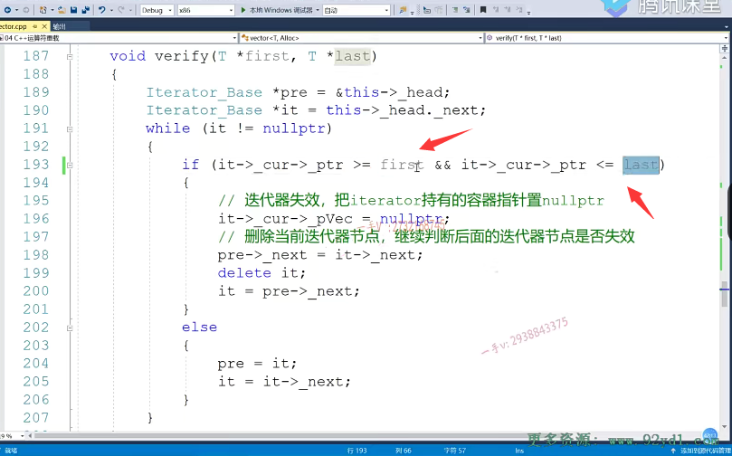

是说你看。当我呢？啊，首先获取了一个容器，末尾迭代器。对吧，如果我们没有这个power back，就没有做删除的话，我们来看一下这两个叠在一起能不能进行一个？

合法的比较是没有任何问题的，它俩它俩打印出来是个零啊，因为它们比较的是不相等，因为它们都是指向n的，肯定是相等的，不相等的就是零了。

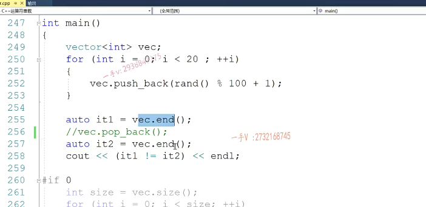

对吧，但是如果说是pull back，你想啊pull back里边儿会ver if verify verify是不是？last- 1都什么呀？verify last- 1，二次减一。是不是到last呀啊？在这儿我们应该是这个是给了前一个的，这个地址是吧？

这是给了当前位置前一个的地址。给了当前位置。

### first这个等于加不加自己去检查一下

前一个的地址啊，前一个的地址，所以在这里边儿，我们这个first呢，first至于等不等于啊，这个我们。嗯，具体的这个情况，大家可以在自己写完了以后呢，再应验证的时候呢呃，仔细的去检查一下啊，仔细的去检查一下。好，

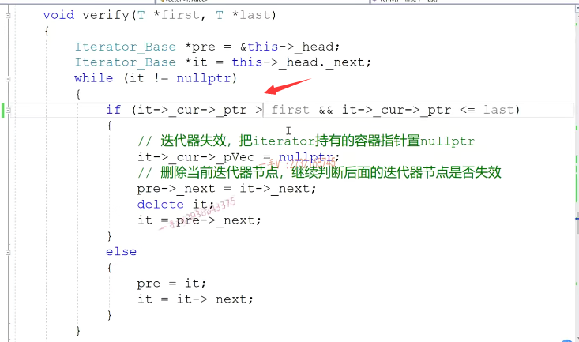

我们来看看啊，我现在运行了，very very它在。这个链表上啊，它在这个链表上就找啊，那肯定能找着嘛，因为我们at 1创建了一个新的迭代器，这个at 1这个迭代器呢，肯定在我们链表上某一个地方记录着呢。啊，而且我们at 1这个迭代器的这个指针对吧？肯定是在这个区间的啊，在这个区间的话呢，它就会把我们迭代器进行一个失效处理。是不是啊？

是需要处理，所以我们迭代器在进行比较操作的时候呢啊，迭代器的不等于运算符重载函数的时候我发现。迭代器底层指向容器的指针已经为空迭代器失效了啊。这就是我们底层迭代其失效的核心原理。

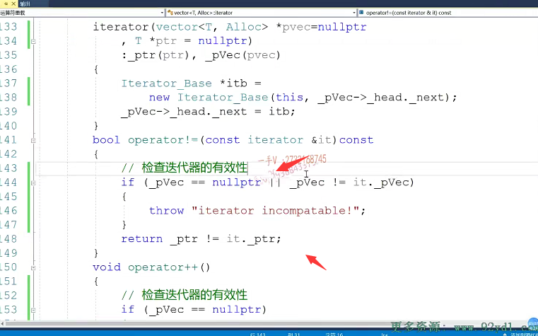

这是2 VS 2017的版本，随着这个版本的提高，库里边儿的代码呢？嗯，越来越庞大啊，这是呢。

呃，我通过呢查看这个容器底层的源码，给大家抠出来这一块儿迭代器。实现这个这台器失效的，这个核心的这个。呃，设计啊，核心的这块儿呢，是个设计，希望大家通过这块儿的问题呢，能够了解一下啊，

## 总结

## 下节课会写insert和erase的迭代器失效处理

当然在这里边儿，我们==没有给这个vector实现insert跟erase==，但如果我们实现的话呢？那么，

你注意insert跟。insert和这个erase呢，要返回。啊，当前位置新的这台器，因为当前位置呢。在这里边儿。啊，已经被失效了啊，当前为这个代替在做增加或删除的时候呢，这代已经被失效，一定要进行一个更新。呃，那如果我们下节课，这个可以安排的话，

我们下节课带着大家呢，一起把这个呢？vector的insert跟erase来写一下，我们再继续看一下这个迭代器的时效问题。好，那这节课先到这里。

