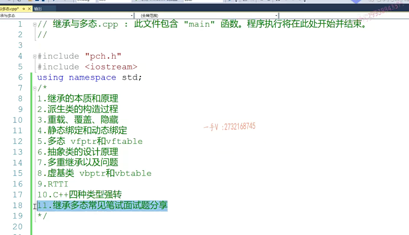
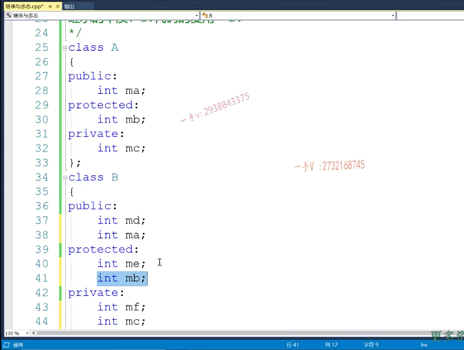
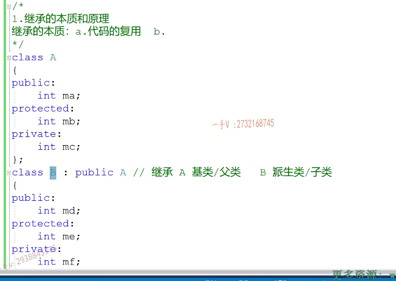
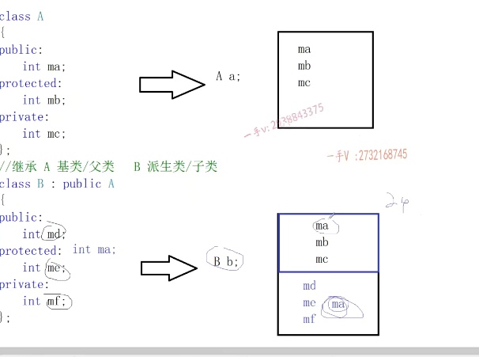
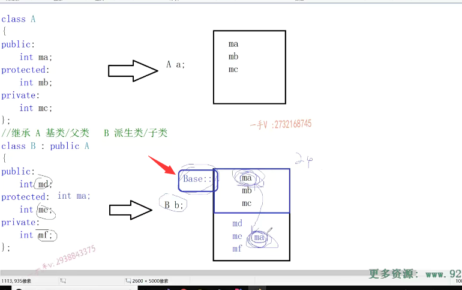
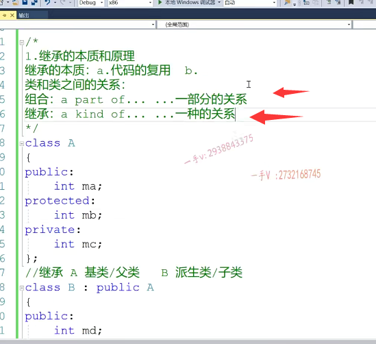
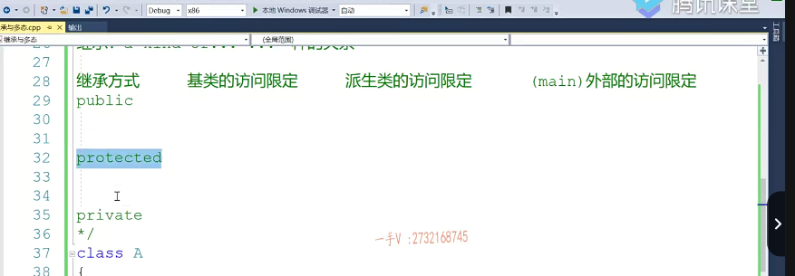

继承的本质和原理：

大家好，欢迎继续收看石磊老师的视频课程。上一节课呢，我们把这个运算符重载这一部分的这个。嗯，基本内容给大家讲完了啊，

从这一节课开始呢，我们开始进入C++的下一部分啊，下一部分也是在我们oop语言里边非常重要的一部分，就是继承。和多态啊，继承和多态。那么，不管是学C++还是学其他的，这个面向对象语言继承跟多态呢？

是一都是非常重要的，这个一部分啊。那么，在这一部分里边儿，我们主要讲解呢的这个内容，我先给大家在这里边儿列了啊，主要讲我们==继承的本质原理==。

==派生类的构造过程==。是在我们继承过程中。

==我们成员方法的重载覆盖跟隐藏啊。重载覆盖面隐藏==。是有哪些区别和联系呢？

还有我们什么是==静态绑定的动态绑定==啊，这也是我们在面试过程中的一个。非常高频的这么一个面试问题啊，

我们应该怎么样去回答才显得这个啊？这个问题回答的这个角度或者是层次都比较不错的。

==那么，什么是多态啊？==

我们在我们软件设计里边儿应用多态，到底能给我们带来什么样的好处呢啊？

另外一个就是抽象类，一般在面试中比较喜欢问==什么类设计成抽象类==，为什么设计成抽象类？

设计层出现了，有什么好处啊？诸如此类的问题。那前面儿我们说的继承呢，都属于==单一的继承==啊，那我们从第七点开始嗯，

我们来说一说==多继承==。啊，在c++里边儿多继承有什么好处，以及它所面临的一些问题啊，以及我们在==多继承里边儿涉及的这么一个虚基类==啊，

==虚基类跟抽象类==，我们同学们呢？呃，比较容易把这个名字搞混，对吧啊？那么它们到底有什么样的区别？

那么在我们继承动态里边儿，有两个指针，两个表vbp tr跟vbtable。叫==虚函数指针跟虚基类指针==，

你这个是==虚函数表跟虚机类表==，它们到底存储的都是什么样的内容呢？

然后我们会说一说==rtti运行时的类型信息==啊，对我们C++代码有什么样的影响，

最后我们来说一下，在C++里边儿专门。啊，提供了==四种类型强转方式==。在我们讲课的过程中呢，我们会在各个模块儿上给大家分享一下该部分啊，常见的这个笔试面试的这个问题啊。好，那我们。这一节呢，我们先讲呢。

前两个部分啊，前两个部分。好，大家来看一下。继承啊，什么叫继承啊？继承的这个本质啊，继承的本质。啊，它的本质目的之一呢就是。做代码的复用啊，做代码的复用代码的复用当然了啊，我们还有另外一层更重要的这个。功能这个我们等我们上完继承与多态这一部分上完了以后呢，大家对于继承都在有一定的掌握程度，

以后我回过来再写第二。写这个第二点啊，我们到时候就。就能一个更好更深的一个体会了。我们先来看这个代码的复用。那来看一下啊，

我们先来看这个代码的复用。那来看一下啊，我在这里边儿写了一个类a啊，我给它写了呢三个。不同权限的。成员变量分别是MA MB和MC啊。然后呢？我又定义了一个b，那么在b里边呢？假设我给它里边有md me MF。但是呢b这个类呢，

它也有mam bmc这三个属性，当然你的选择之一是可以把MA。MB.MC这三个属性呢，你给b也写一遍。这个就很麻烦。对吧，这个就很麻烦了，比如说呢，这个呢，唉，这个这个类表示一个人这么一个类人嘛，都有姓名，年龄跟性别是吧？这个是我老师或者学生，

这个类老师或者学生已经除了你，比如说学生呢，有考试成绩，有学号之类的，但是他也有人最基本的是不是一个？姓名，年龄跟性别呀唉，我就不用呢，给这个学生这个类再写一个mam bmc了。我直接呢，可以通过哎，这样继承的方式。来复用唉，我从a里边儿继承来的这个mam bmc。代码的复用啊，

在这里边呢，大家来看一下啊，我们在定义的类的后边加一个冒号，再写一个访问。限定符啊，再写一个访问限定符，然后呢，再写一个前面儿已经定义过的类，这个就叫做继承。

啊，继承。==A叫做这个基类啊，或者也有叫父类==，对吧？==b称作。这个派生类==，

或者称作==子类==啊，都可以，但是学术一点儿的名词呢？那应该常叫做这个==基类和派生类==啊

这个类型定一个对象啊，这个对象呢，还是12个字节啊，还是12个字节？mam bmc啊，我们考虑的叉八六体系啊，叉八六体系32位平台下啊。MA整数是四个字节对吧？整数是四个字节在这里边儿三四一十2a的大小，就12个字节啊。那么，我们来看b啊。b定义一个对象，那么大家不要认为我看b里边儿只有三个整型，成员变量就感觉呢b。

啊，也是12个字节no

b呢，现在叫做派生类，它有两部分啊，它有两部分，第一部分呢是从鸡类继承而来的，它从鸡类继承了谁啊？对它从基类继承了mam bmc，那么派生类还有自己的谁呀md？me和什么MF唉，所以呢，这个就叫做代码的复用，我们派生类可以从a里边继承来成员。啊，

就像我们b一样的，所以b这个对象现在内存呢是二十四个字节。

而且呢，如果我们在派生类b里边儿再写个MA啊，再写个MA，再写个MA，那么注意呢？它内存呢？现在就是28个字节了，对不对？而且呢，哎，在这里边有有有的人说诶，你这个b里边有个MA。

从a里边儿也继承了一个MA这个名字，编译器会不会给我们报错？说是名字冲突了，会不会呢？不会的啊，不会的，为什么==因为作用域不同==，大家可以这样理解，就是我们派生了从基类继承来成员的时候，相当于呢，唉，还附带了我们基类的这个作用域。唉，还附带了我们机理的这个作用域。

作用域

呃，

就是base。作用域那么这个MA是我们派生类自己的成员，对吧？自己的成员就是派生类作用域下。而这个呢？基类的这个MA基类继承来的这个MA呢？唉，是我们基类作用以下的，所以作用又不同，那我们派生类跟基类的名字呢？就成员名字是可以。一样啊，这个不会产生什么冲突，大家不用担心这一点。好了，

那么注意一下啊。在这里边儿搞清楚这两点问题啊，就是类和。类和。类之间的关系啊，我们有两种常用的这个组合和继承啊。组合呢，是两个类间的关系，满足呃part of。就是。一部分的关系啊，这个是呃。kind of.啊，看的就是异种的关系。

啊，你比如说学生是人的一种唉，那么这两个类呢，就应该设计成继承的关系了。鸡肋是人。派生类是学生，学生可以从人这个里类里边儿继承了哎人通用的姓名，年龄，性别，这些成员属性啊。好的吧啊，这是一点。这是一点。

那么我们现在来考虑一个问题啊。那么

从派生类，从基类继承来的这些成员？呃b从a继承来了mam bmc。那派生类对从基类继承来的这些成员的访问限定。是什么呢？那就比如说在我们的这个派生类，有一个fuc函数。啊，有一个fuc函数，那么在这个fuc函数里边呢？呃，对于从ag乘来的ABC。能不能访问？访问权限是什么？这个我们要考虑一下啊，

你代码复用你派生类，把基类的代码复用过来了。那你到底能不能访问？怎么个访问法啊？这个我们要搞清楚啊。那我们列这样这样的一个表啊，这样的一个表就是继承方式。啊基类的访问限定，然后是派生类的访问限定。然后就是外部哎，你可以把它所谓的外部，你可以把它想象成这个内方法啊，外部的。访问限定OK吧，继承方式继承方式，

这就叫继承方式跟我们的访问权限呢是一样的，访问权限有三种，所以继承方式呢也有三种。啊，继承方式也有三种。分别是公有的继承，保护的继承以及私有的继承。

OK吧。好，我们来一个一个看一下，现在我们考虑公有的继承，公有继承。那么b从a里边儿继承了这个MA，你说这个MA呢？这个成员在基类里边儿是公有的。

啊，就激励的访问限定。就成员在激烈的访问，现在这是公有的，那么在派生类里边儿是什么呢？唉，公有继承基类里边儿的公有成员，那在派生的里边儿还是公有的成员？OK了吧，那也就是说继承来了以后呢？这个MA啊，跟md的这个角色呢，是一模一样啊，没什么变化。那也就在这里边儿呢，

我可以直接访问我当前的这个MA的值。这是没有任何问题的啊，那在外部能不能访问呢？当然是OK的，当然是OK的。啊，因为MA是属于我b的公有的成员在外部呢，当然能访问公有的成员了。对吧b点MA啊。end l.这可是当然可以访问的了。啊，但是因为我们在这里边儿呢呃，没有进行，是不是一个初始化呀啊它？

给我们报错了，嫌我们MA没有初始化。是不是啊？那在这里边儿呢？我们就不初始化了OK吧？我初始化，我们提供一个构造函数，进行一个初始化就行。那从访问权限上来说呢，现在这个MA在这里边儿是可以访问的啊，是可以访问的。可以访问好。我们主要关注一下访问权限。那这个就完了，公有继承方式下基类的公有成员在派生类里边儿还是公有的啊，
