大家好，欢迎收看石磊老师的视频课程。啊，我们这节课呢？呃，接着往下讲，下一个这个内容啊，下一个内容我们该讲这个重载。隐藏。和覆盖啊，重载隐藏和覆盖。在继承结构中啊，我们这个激励派生类的里边儿的一些相关性的成员方法呢，我们经常用三种关系呢。来描述他们啊，

来描述他们就是这个。重载隐藏和覆盖当然了。我们今天的这一部分课程呢，可能覆盖还讲不了，因为覆盖涉及了虚函数啊，我们到下一节课我们再讲，所以今天呢，我们主要是把重载隐藏。和基类跟派生类之间的互相。指向啊，用指针或者引用互相指向或者互相引用来把他们这些关系呢，我们理清楚我们后边呢来讲这个。虚函数静态动态绑定以及多态啊，打下一个知识的基础。好，

我们继续呢，先给出来一个例子。啊，跟我们上节课所采用的例子呢，比较相似啊。public private在这里边给一个成员变量MA啊，我给了一个成员变量MA。在这呢，我再给一个构造函数啊。mad at a初始化，我们不用加什么打印了啊，我们构造过程析构过程已经研究过了。在这儿我给呢啊，在这儿我给我们的这个基类呢，添加了这么一个show函数啊，

show函数我需要加一下的。这是基类里边，我们不带任何参数的show函数。这个show呢，是我们一个带整形参数的show函数啊show。的一个整形参数的收函数啊。

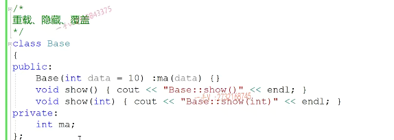

我现在写了一个派生类derived，从我们的base基类继承而来。啊。从我们的base积累继承而来。那么在这里边呢，写成员变量。啊，我们。复习一下上节课的内容，

对吧？基类的成员怎么初始化啊？哪怕你把他基类的写成protect，派生类了能够访问。MA也不能直接给MA初始化，你得通过呢基类的构造函数来给基类继承来的成员呢，是不是初始化呀？再拿这个m data给我派生类，自己的MB成员变量初始化一下。啊，初始化一下好。我们就先写这么一个代码，现在呢？我定义了啊，我定义了，

定义了一个派生类的对象。

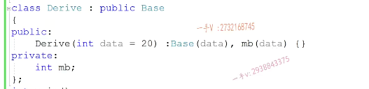

然后呢？我用我派生类对象来定这个不带参数的事物方法啊，我派生类本身呢没有。名字为show的这么一个成员方法，但是呢，我们派生类从基类继承来的这两个方法。啊，所以不管是这样调用，还是我们哎，这样调用。我们呢，派生类都会去调用相应的从基类继承来的，这个不带参数的，跟带一个整形参数的。

啊，跟这个带一个整形参数的这个方法

好，大家来看。调用到了吧？是不是调用到了我们派生类？从积累继承来的这这两个不带参数，跟带一个整形参数的方法啊。啊电用上没有任何的问题啊，大家把这个呢先搞清楚，那电用上没有任何的问题

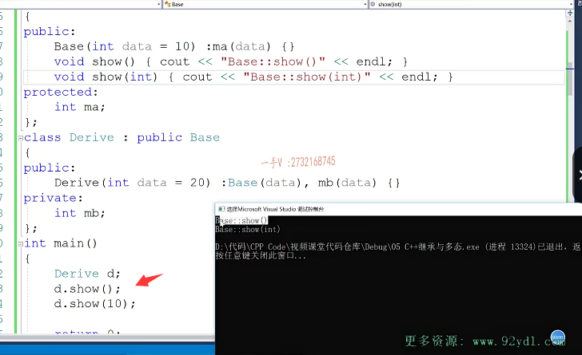

那么接下来呢，我们给配称类呢，也添加了这么一个方法。

sea out.啊叫派生类的，不带参数的，这个show方法。派生了一种不带参数的，这个show方法啊。那么，现在我们来看一下。派生类现在利用这个事物的话。那他肯定是先优先调用自己的手了，对吧啊？那优先在自己的座右铭底下去找。相应的成员名字吧，自己派生类，自己没有相应的成员名字，

才从基类继承来的，这个成员里边是不是去找啊？肯定是这个样子的啊。那么，当我们调用一个带整形参数的show的时候，那==我们发现派生里边儿并没有啊，自己他自己并没有一个带整形参数的show方法==。他==从基类继承来了一个带整形参数的书方法啊。那它能不能地有用呢==？我们来看一下啊。诶，在这里边，==我们出错了==。啊，我们把这个错误的信息拷贝一下。

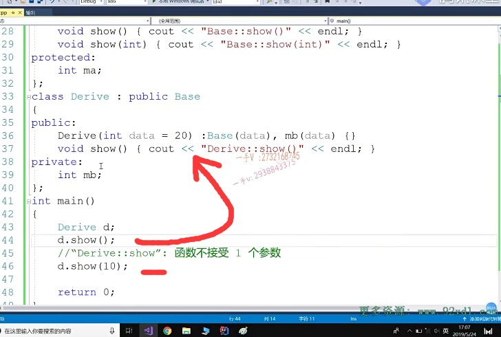

上边儿这个调用是没有问题的，这调用的肯定是我们派生了自己的受方法啊，这个调用就有问题了。唉，根据提示呢，我们能看出来它其实还是想调用我们派生类的，这个不带参数的数方法。唉，那你他他就认为你给他传了一个参数，而他根本不需要参数，他为什么不调用从基类继承来的这个成员呢？那么，这里边大家就要搞清楚了啊，搞清楚。基类跟派生类里边儿的成员名字可不可以相同？

相同是没有问题的，我们第。这个第一部分的这个继承第一部分内容的时候呢，就已经说过啊，就已经说过这个派生类跟基类的名字呢，它是可以重复的。不会产生冲突，因为作用域不同嘛，对吧？一个是派生类，自己的作用域，一个还有积累的作用域啊。那么，名字相同的成员啊，他就要产生关系了啊，

## 函数重载

他就要产生关系了，我们在这里边儿写一下，==首先第一个呢就是。重载关系==。大家如果看过我前边儿的这个讲重载的这个课程的话，你应该还记得啊，您还记得我们重载呢是必须。啊，这个一组函数。要重载。必须处在。同一个作用域当中。必须处在同一个作用域当中，而且呢，是而且是函数名字相同。

啊参数列表不同。而且是函数名字相同，参数列表不同的一组函数呢，就称作函数重载

所以呢？函数重载这两个算不算呢？==这两个就算函数重载关系==啊，这里边儿的这个一跟这里边儿的这个。二一跟二，它是属于函数同等关系。

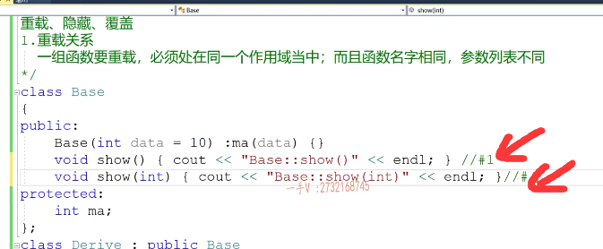

能不能说这个和这个是重载关系呀？==绝对不能，这两个的作用域根本就不同==啊，这两个的作用域根本就不同。

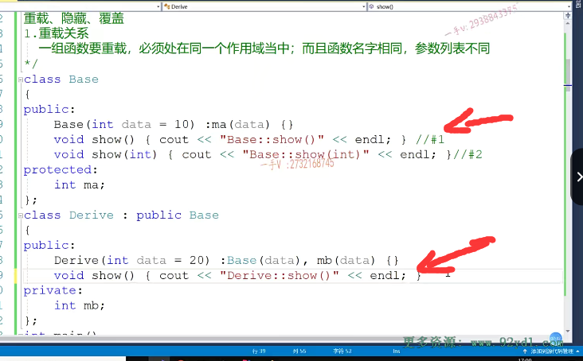

如果这两个真的是算重载关系的话，在这里边我们通过派生类对象调用在整形参数的时候，那它就应该根据用户传闻的这个整形参数。来匹配带整形参数的是不是show版本啊？但是它现在根本匹配不到它，==还是一直在调用呢自己的这个show==。所以，==重载关系只能说是在基类的方法。或者是派生类的一组方法中==，重载不能在基类跟派生类中团重载，因为作用域不同。

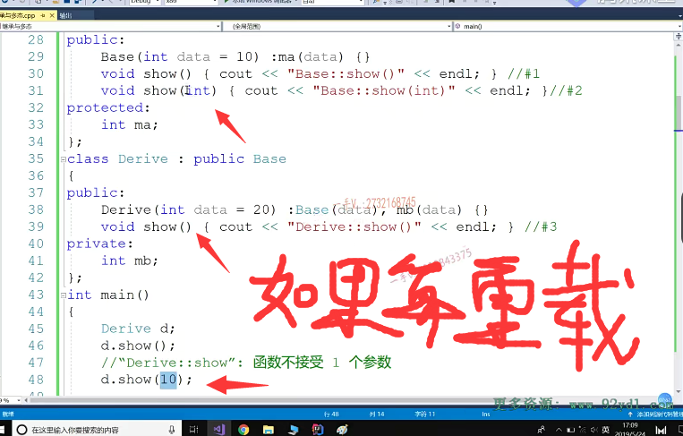

## 隐藏：

第二个注意一下这个隐藏的。关系啊，

隐藏主要指的就是在继承结构当中了啊，那么在继承结构当中。啊，==在继承结构当中==。那么，==派生类的同名成员==把==基类的同名成员给隐藏掉==了。

啊。给隐藏掉了，也就是说呢，这两个现在属于什么关系呀？隐藏关系名字相同，函数名字相同，派生类的这个数吧，积累的这个数，

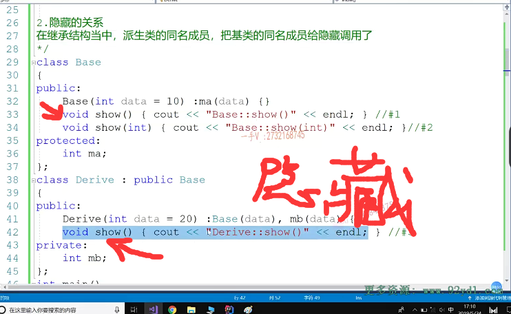

那这两个是什么关系啊？这两个也是隐藏关系啊，这两个也是隐藏关系，注意隐藏这里边儿一定要搞清楚啊，我们后边儿还会给大家说覆盖。覆盖覆盖的是什么？隐藏隐藏的是什么？隐藏主要指的是啊，作用域的隐藏。

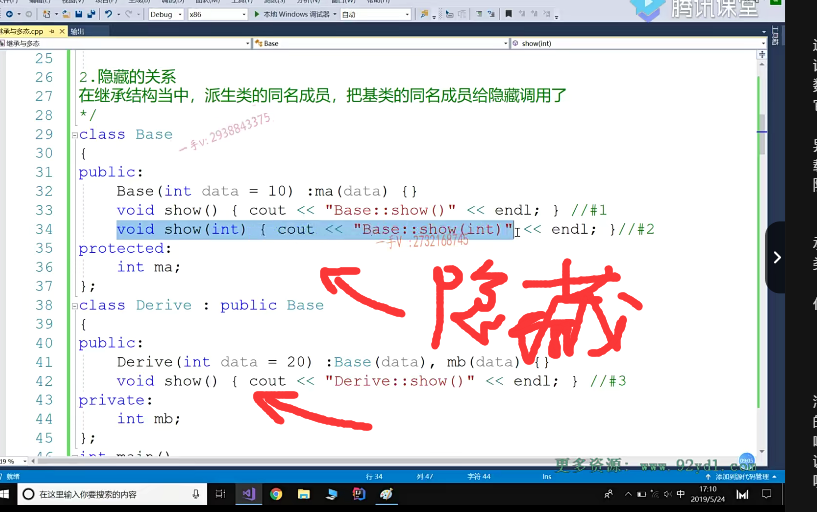

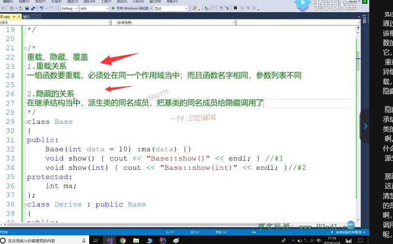

好吧。那在这里边儿，你看d调用受，因为派生类已经有一个名字受了，所以呢，派生类的这个受。

啊，我们先把底下这个屏蔽，就把派生类这个同名名词书给隐藏掉。注意派生类对象哎，调用派生类跟鸡类的同名成员的时候。把积累的这个。同名字的成员就被隐藏掉了，你如果想调用。基类里边儿的，那你得给这个方法前边儿加作用域，这个就==指明作用域掉==了，那掉的肯定是我们就是。基类里边是个不带参数的，这个数的方法。好的吧。

现在你应该能明白，这里边儿为什么错，因为我派生的里边儿已经有一个名字叫做show的方法了。所以他把从基里继承来的这个带整形参数的show呢，给隐藏掉，也就在这里边啊，派生类调用这个show一定调用的是自己的这个show。不可能定的是，从基类继承来的，这个带整形参数隐藏了吗？是不是隐藏了？如果你要调用的话，你可以通过指定基类的作用域。

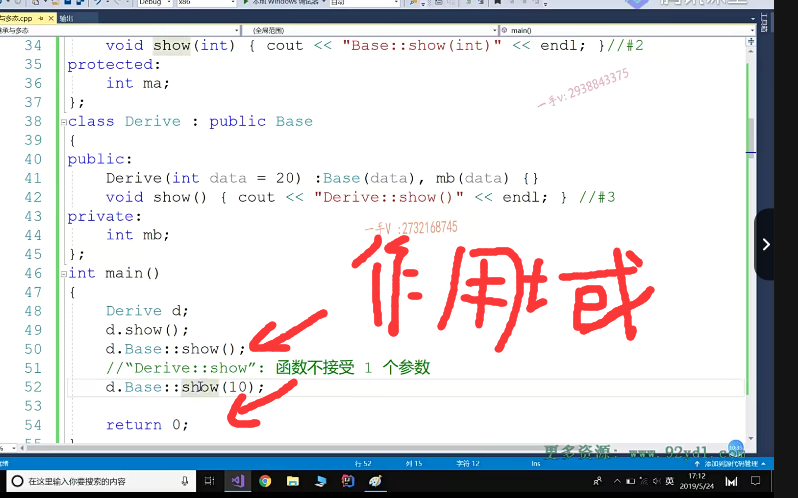

哎，这样一来呢，

这就是说呢，调用的是我派生类，从积累继承来的。带整形参数的show。好的吧，但是呢，你==绝对不可能通过派生类对象直接调用这个从基类继承来带整形参数的show==。==除非你这函数名字不相同，否则配成类的同名成员就把基类的同名成员给隐藏掉了==，

==指的是作用域的隐藏==啊，因为在这里边它优先。==派生类自己作用域的show名字成员==。

==没有的话才去基类==里面找。啊，没有的话才去基类里边找。没问题吧，

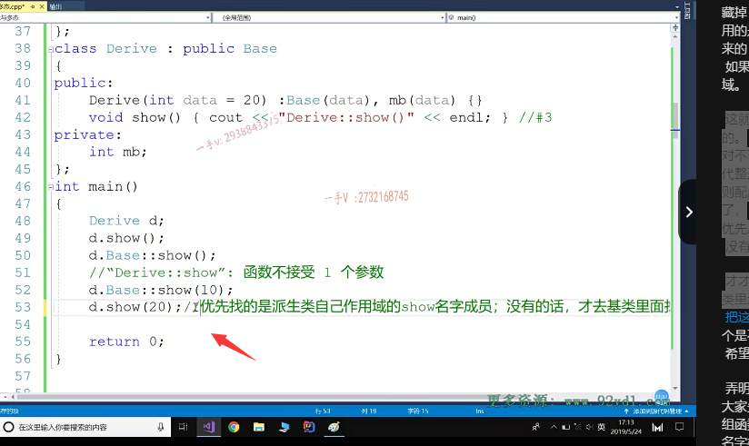

大家要把这个要搞清楚OK，把这个要搞清楚。好，所以这个是不行的啊，这个是不行的。啊，这个是不行的，不能调用的。希望大家把这个呢先。弄明白啊，

弄明白好了。那我们这个问题就先讲到这里，就是大家先搞清楚啊，

==重载和隐藏的关系==啊，==重载是一组函数呢。它必须处在同一个作用域当==中，而函数名字相同，参数是不是列表不同啊？

那么==隐藏==呢？指的是啊。==派生类跟基类的名字啊，不管是成员变量还是成员方法，名字相同了。啊，名字相同了==。

现在我用==派生类对象来调用这个名字的时候==啊，==你只能调用派生类自己的名字，如果你企图调用基类的。同名字的成员，那是调不了的，因为派生类的这个名字，把基类的同名的这个成员给隐藏了==，你要调，除非==加基类的作用域==。

好的吧，覆盖呢，因为涉及虚函数，我们呢，后边在讲虚函数的时候呢，讲完虚函数，

我们再给大家把覆盖的这个概念再。给出来啊。

## 基类对象  派生类 对象

## 基类指针   派生类指针

现在呢？跟我再看一个非常重要的问题啊，在这里边我们研究一下这么一个东西就是基类对象。啊到派生类对象的转换啊，然后是派生类对象。到基类对象的转换。再者是基类指针，那么这个是同引用的啊，我们讲指针引用是一个意思好吧？呃，指向这个派生类对象。然后就是派生类指针，那当然也是同引用了啊。

指向这个基类对象。啊，我们为什么要研究这个呢？==因为这个是我们后边在使用多态的时候的一个语言的一个基础啊基础。我们要搞清楚。==

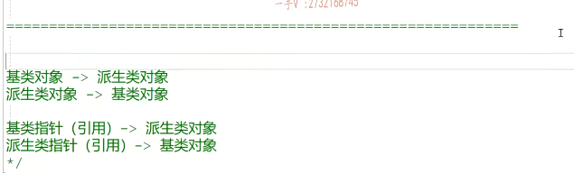

首先在这里边，我们看第一个问题啊，这是我们第二个问题，第一个问题啊啊，首先大家要搞清楚一个概念啊，我们把那这个继承结构啊。也说成啊，也说成也说成，从上到下的结构。没问题吧，

==这个上呢，指的就是我们基类的方向==，==下呢，指的就是派生类的方向啊==。你看我们基类都写到上边儿嘛，对吧？派生类都写到下边儿，所以我们在看资料的时候，我们上转到下。下转到上唉，==上转到下，我们应该就知道这是说的是基类转成派生类对吧==？如果是===下转到上。指的就是派生类转成是不是基类==啊啊？这个首先呢，这么一个知识的这个常理呢，

大家首先要搞明白啊，两种说法都指的是一个意思

大家首先要搞明白啊，两种说法都指的是一个意思。好，现在在我们main函数中呢，我们给咱定义上啊，一个派生类对象。啊，这是基类对象，再定义上一个派生类对象。好了吧，我们先看这个啊。基类到派生类对象的转换是否可以呢？就是把一个激励对象啊，我们倒过来吧，好吧，

跟我们的赋值语句刚好是对应上啊，那也就是说是。b=d.,

派生类对象d,基类对象是b。

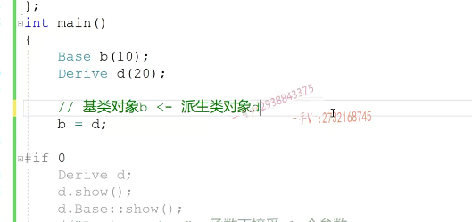

我们把这个画成两部分啊，这个红色的部分呢，就是我们派生类特有的成员。OK吧啊，这是我们积累部分的成员base。这是我们的派生类，现在呢？我们做的事情啊，是什么事情呢？是把一个d付给b就是派生类对象付给这个基类对象。好。好了，那这个能不能负呢？把下边的负到上边去。是不是可不可以呢？

这个看起来当然是可以了啊，因为为什么呢？因为你积累对象是不是只需要这么一点儿啊？哎，我派生类，我这么大，我相当于我把派生类积累部分。直接赋给你这个积累对象b就行了嘛。这没有任何问题的嘛，是不是我们来看一下到底是不是这个样子？没有任何的问题啊。OK，这个可以的吧啊，这个大家要注意一下，这个可以的。

这个可以的啊。你==可以这样理解一下基类==呢，==基类一般代表人==是不是啊？代表一个人代表一个比较通用的这么一个角色人。而==派生类呢啊，代表一个比我们基类啊这个。逻辑意义上更严格的这么一个实体类型，比如说呢，==

==基类代表人，我们派生的就是学生或者老师==。我现在是右边儿付给左边儿是吧？==我现在需要一个人。我给你一个学生行不行==？派生类学生嘛，是吧？

可以吧？你需要一个人，我给你个老师行不行都行？所以这个转换是没有问题的，

我们再来看一看啊，这个是派生类的类型对象，这个赋给基类对象，也就是说这是一个从什么到什么的转换啊？啊，==类型从下到上的转换可不可以的==？OK，没有问题的啊，或者我们也用yes or no吧yes，这个是没有问题的啊，没有问题的。

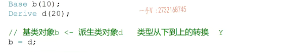

好了，我们反过头来看第二个啊。我们把箭头也画过来啊，画过来跟我们的赋值语句刚好对上，那这个是什么呀？这个是把基类对象。积累对象b付给一个d啊。先从逻辑语义上来看一下，我现在人家需要的是一个派生类对象，比如说人家需要一个学生，对吧？==我需要学生干嘛呢？需要学生给我做一个高等数学==，比如说解微积分的题。我现在拿一个鸡肋对象，

==我在街道上随便拉一个人过来。行吗？不可能的吧==，你在街道上随便拉一个人，他不一定会解微积分的问题呀。所以你在这里边儿积累对象，赋给派生类对象，

我们再从图上看一下啊。d=b.==你把基类对象给派生类对象==。你==基类对象就只有这么大==，你==最多只能把派生类对象基类部分==呢，==是不是内存给赋了给初始化了==，那==派生类自己的这一部分，你打算怎么做==？

唉，计算机是个死的吧，是不是啊？计算机是个死的，你没有告诉他，他就不会去做啊。啊，你没有告诉他，他就不会去做啊。好吧，所以呢，把一个鸡肋的一个对象赋给一个派生的对象no，这是不行的OK，这是不行的啊，

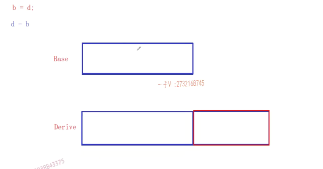

这是不行的。你看一下这个是类型是从哪里到哪里的转换啊？这是类型从基类就是==从上是不是到下==的？转换啊no，==这个转换是不允许的啊==，不允许的注意一下。

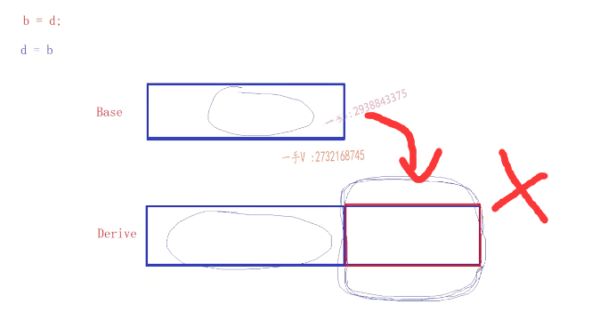

第三个。那指针指向我们，就用左边指向右边，对吧啊？你来看，这是一个我们的星PB基类的指针。指向了一个派生类对象啊PB是一个基类的指针d是一个派生类对象啊direct派生类对象。那在这里边可不可以指向呢？我们把这个拿到图上来。

看一下。唉，指向可不可以？指向没有问题的吧，基类指针唉，基类指针因为我派生类本身是不是就有两部分组成啊？一个是从基类是不是继承来的成员，一个就是我们派生类是不是自己的定义的，是不是成员啊？哎，不是得，是dr。drive derive是不是那因为呢？你这个指针是一个基类类型的指针，也就是说呢，

==当你这个基类指针指向派生类对象的时候，你可以指向==。而且呢，==但是呢，你只能访问是不是派派生类基类这一部分的成员啊==？

### 基类指针指向派生类对象，但是派生类特有的访问不了

==派生类特有的，你访问不到==，

==因为你的指针的类型限制了指针解引用的能力嘛==。对吧，==你类型就是base，也就是说你仅仅用你只能访问这么大的区域==。是不是？OK，那这个是没有问题的啊，这个是可以的，

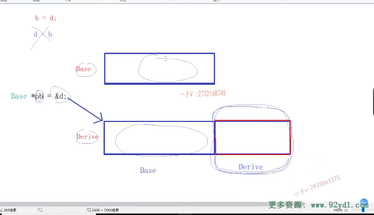

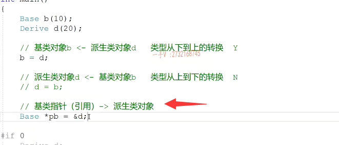

### 修改一下，不理解为指针指向，而是理解为赋值

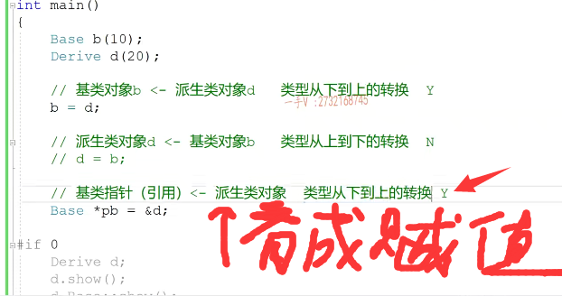

我们看一看啊，你这这个一等号右边的是什么类型吗？配生类的类型赋给等号是不是左边了？啊，那行，那我们写成统一的吧啊，复成。负乘等号左边儿的，这个是不是就是类型从？下到上的是不是转换啊下嘛？这是派生类对象的地址嘛？赋给了我们的是不是基类的一个指针啊？就是从下到上的转换这个OK不？你会发现呢？你看它默认都是==只支持类型从下到上的转换==就

==是派生类转成基类类型==，==不管是对象还是我们指针引用==。哎，从上到下的转换是不行的，我们看到这PB调用。受啊PB调用受。以及PB调用带整形参数的show。哎，我们来看一看这个代码的，这个打印结果啊。看看我们刚说了啊，==基类指针呢，可以指向派生类对象==，这个我们大家一定要记好。==这是我们经典的多态的使用方式==，

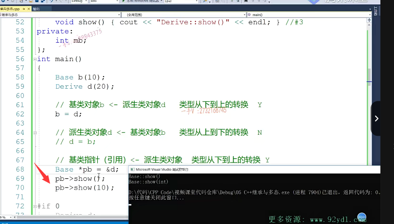

对吧啊？好，那大家现在先不理解多肽，==先给我们看这个基类指针是可以指向派生类对象，但是由于指针的类型只是个基类类型。所以限制了指针的能力呢，只能访问派生类基类部分的成员啊，包括成员变量和成员方法==。所以在这里边，你看打印的都是派生类，从基类继承来的成员。==okay啊，派生类自己的这个show呢？它是无论如何也访问不了的==（==**因为还没有使用虚函数**==）。啊，

无论如何也访问不了。okay吧啊，它访问不了。好，==除非你做类型强转==啊，那这个我们先不说，因为你就是类型强转的啊。

==因为你就是类型强转的啊==。大家可以看一下吧。因为实际上==你内存上是不是就是一个派生类对象==啊啊，你作为一个类型强者，你把==这个指针呢强转成派生类的类型==。那由于这个指令类型呢，是derive，那就变了嘛，那编译的时候就去derive里边去看这个show了。

对的吧啊。好了，这现在是不是定我们成了direct不带参数的这个数方法呀啊？注意默认情况下呢啊，他只能访问谁啊，只能访问啊，派生类从积累继承类的成员

==类型强转后，他的解引用范围变大了==

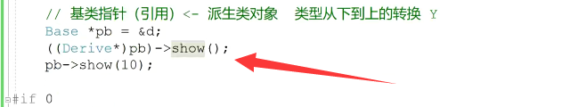

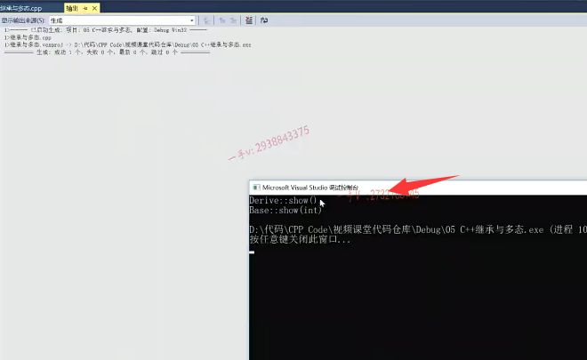

最后一个，我们再来看这个派生类指针。啊，我们也倒过来okay？在这里边儿，我是一个派生类类型的指针pd，我现在指向我的基类对象。

啊，我看看这个。在这里边儿是一个基派生类的指针，但是你却只指向了一个基类的对象。基类的对象的内存只有这么大，但是呢，当==派生类的这个指针一仅有因为它是一个derive类型==，所以。所以==它访问的内存就是这么大的。那么，实际上，内存在我们的内存当中啊，只有这一段儿是不才是合法==的呀？这一段呢？根本就没有，

还没有分配给，是不是我们当前啊？当前的是不是应用啊？但是由于指针的类型是个类型，你指针建议用访问的内存就是这么多，那对于这一块儿来说呢，指针如果你访问到这儿的话，那纯粹就是一个内存的非法访问了。那么，程序运行的这个结果啊，就不是我们能预期的到的了。好了吧，所以这里边儿是不是存在内存非法访问啊？指针。的类型决定了指针的能力太强了，

==一解引用它访问的肯定要大于我们内存上这个基类==。对向内存的空间里，==因为一个derive，它长这么大呢？它就访问这么大，但是这这一块儿内存呢，根本还没有分配给我们当前的解引用呢==。对不对？所以这个肯定是有有危险的啊，有危险的，所以你看它默认的支不支持我们这样的一个类型转换啊？它也不支持这样的类型转换的吧，这样类型转换，你看是把基类的类型转成派生类的类型，是不是也是从==上到下的转换==啊？

可不可以呢？==不可以==，

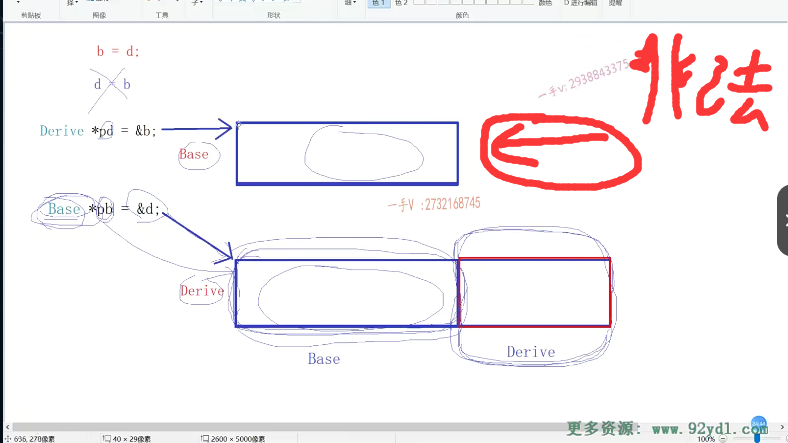

所以从这四个呢，你搞清楚，当我们在继承结构中啊，在继承结构中。我们把总结写到这儿吧啊，在继承结构，在继承结构中啊。这个进行类型。进行上下的类型转换啊，转换默认只支持。从什么啊，从下到上的类型的转换啊，这才是正确的。

这才是正确的OK的啊，从从上到下的转换呢，是有问题的。好了吧啊，我们把这个写到呢，我们的这里吧。总结啊，在继承结构中进行上下的类型转换啊，默认的支持，从下到上的类型转换，这才是OK的啊，这才是OK的。好。那这个是不行的啊，这个是不行的，

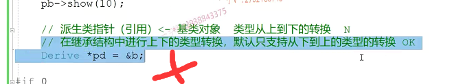

==默认的支持从下到上的类型转换==

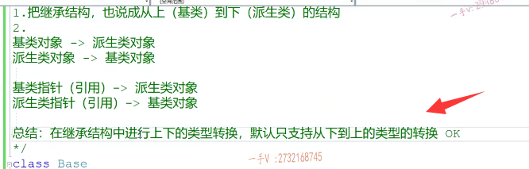

如果你非要让他做的话，你可以把灯泡这个右边的这个这个东西呢，给它做一个类型强转啊，强转成派生类类型的指针。但是这个是非常危险的。好吧，非常危险，非常危险啊，那你此时呢？通过调用呢？你的受方法，这里边访问的是谁的受方法呀？嗯，这里边儿访问的是不是就是我们这个派生类的这个书方法？是不是派生类的说方法？

派生类的收方法。啊派生类的收方法。但是实际上内存中有没有派生类对象啊？实际内存中根本就没有派生类对象的。对不对？那实际我们内存中根本就没有派生类对象。好的吧啊，所以你调用这个方法，这派生类也就只是加个打印，如果派生类在这里边儿方法访问了派生类成员的某一些。资源的话，那你在这儿肯定是有问题的，==因为你内存上根本就没有派生类的这个对象==。==但是这调用现在肯定是没有问题的。调用肯定是没有问题的==。

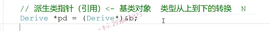

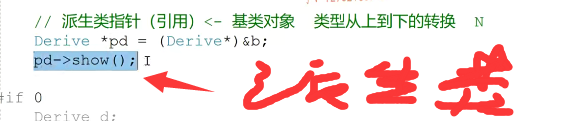

好的吧啊，第二个肯定说明，因为你在做沥青强制管这个不安全啊，涉及。==涉及了内存的非法访问==。好不好啊？设计了内存的非法访问。所以呢，在这里边啊，我们==只支持类型，从下到上的转换==，而且尤其是在这里边，基类指针指向派生类对象。这个是没有问题的，注意这个指针。

访问方法的时候，默认访问派生类从积累继承类的成员啊，因为指针的类型已经决定了，只能访问贝斯作文笔下的成员。啊，配生力作用于底下自己的成员是访问不了的，这这个指针类型决定了指针的能力。好的吧，行，那么在我们这个这次课当中呢啊，我们主要讲的就是这个重载隐藏以及我们。

==在继承结构中，我们积累跟派生类对象，包括对象本身以及指针跟引用在上下转换的过程中。啊，哪些是支持的？哪些是不支持的？这是我们后边儿内容的一个基础==，

希望大家呢啊，自己呢也在。编译器上呢，去实践一下啊，检验检验啊，这一部分的内容呢，了解清楚好，那我们下次课再见。

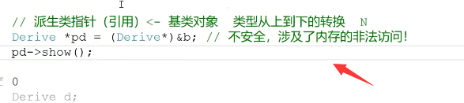

