大家好，欢迎继续收看石磊老师的视频课程啊，那么这一小节呢，我们主要来讲这个。==虚函数静态绑定和静态绑定==。绑定和动态绑定啊，和动态绑定这一部分的内容呢，应该是属于非常重点的内容啊，应该是属于非常重点的内容，非常核心的内容。啊，那么希望大家呢？用点心啊。

我们来写这么一个。基类，

这个基类呢，跟我们前一节课写的那个一样啊，一样那么protect。在这里边儿，我们给一个成员变量MA好吧，这是贝斯的构造OK，我们给它的成员变量初始化一下。在这里边儿呢，提供了一个不带参数的show，大家注意看一看啊，不带参数的show。又给他提供了一个带整形参数的show啊see out base。在整形参数的show。okay，

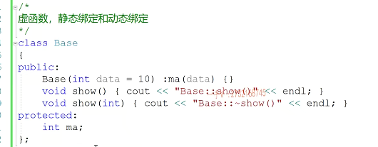

我现在呢，

又来一个派生类derive public base。public private派生类里边儿有一个成员变量叫做MB啊，那么在这里边儿呢？有一个参数，我们利用基类的构造函数给基类，从基类继承来的成员MA初始化一下，又给MB初始化一下。好吧，在派生类里边儿呢，我们又给了一个不带参数的show啊derive。手。好了。那在这里边儿这个类呢？这个基类跟派生类应该大家都是非常熟悉的了，对吧？

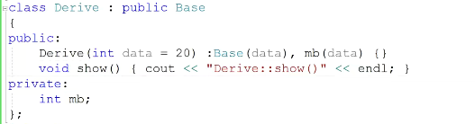

我们现在在这里边儿写几段儿代码啊？我定义了一个dr derive，定义了一个派生类对象啊，然后呢，用了一个基类的指针。指向了这个派生类对象，然后呢，通过这个派生类对象呢，调用了这个。售方法。啊，调用了这个受方法，那在这儿呢，我又调用了一下，带整形参数的，

这个受方法。在这边儿，我==还想打印一些类型信息==啊，

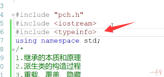

把这个C++的这个tab infer这个头文件呢，我们包含上了啊，包含上了。在这儿我打印一下，叫做type ID啊，我们打印大小都打印出来吧。base积累的大小。基类类型啊，定义的对象的大小就是我们打印一下我们这个类型的尺寸。基类跟派生类类型的尺寸是多大是吧？再打印一下tabid啊，

这个谁呢？PB的类型。再打印一下。星PB的类型。啊，我们给了这么一段儿内涵书中啊，我们给了这么一段儿代码。

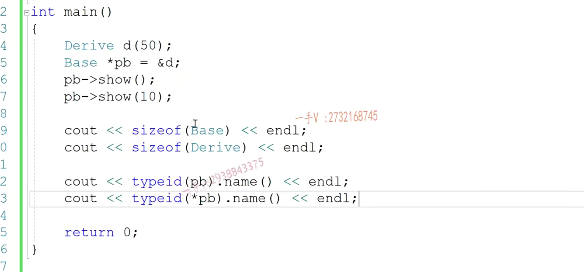

大家来先思考一下啊。这段代码当我运行以后呢？这段代码。这个。它的这个打印输出。到底是什么样子的啊？它的打印输出到底是什么样子的？这是几类？

有两个show方法，这是派生类。有一个说方法啊。这个打印是什么样子的呢？在这儿呢，==这个PB调用时候这基类指针指向派生类对象啊，这类型是从下到上的转换==,我们前边儿说过了，这个是可以的，对吧？然后呢？通过PB指向我们的这个带整形参数的事物，由于呢？这里边儿的这个。基类类型啊，

基类类型啊，是一个base就是指针的类型，是基类类型base是一个。呃。基类类型。所以在这里边儿，==虽然用这个指针指向了派生类对象，但是通过这个指针调用的方法呢，都是我们派生类从基类出来的派生类自己的==，这这个能不能调用派生类自己的show呢？调用不到的OK。

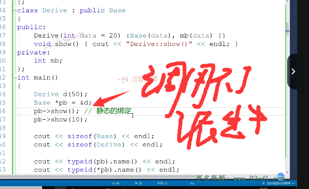

所以同学们，我们一一看一下，在这里边是属于一个。所谓的==静态的绑定==，这个绑定啊，指的就是函数的调用啊，指的就是绑定，指的是函数的调用，所谓的这个静态的呀，就是。编译时期的。大家都知道这是我们。C++是我们高级的源代码，对吧？那么高级的源代码呢？首先要被被编译成汇编码。

再从汇编码呢，被我们汇编器再编译成机器码，

是不是大家来看看啊？在这里边儿那个调用我们的这个方法的时候，你看一下啊，这都是call。啊，这个对应的指令呢？是这个样子的，我就写到后边了啊。这个呢，接下来在整形参数的时候呢，调用的这个指令呢，函数调用的指令是这个样子的。

大家来看一下。提供的指令是这个样子。大家看看啊，这个==是在编译期间是不是做==的呀？把我们高级源代码编成我们的汇编码。好编成汇编嘛。你看==编成汇编码的时候，这些都已经指定==了，这调用的就是base基类，作用于底下的数。而且还把这函数的这个地址啊，给你放到这里边儿了。对吧啊。那么注意一下。这是不是编译阶段就已经确定好了函数调用呢？

是不是编译阶段确定的？生成指令都已经指定了哪个作用域，底下的哪个名字的函数了吗？这==当然是静态绑定了==。

编译时期的绑定。

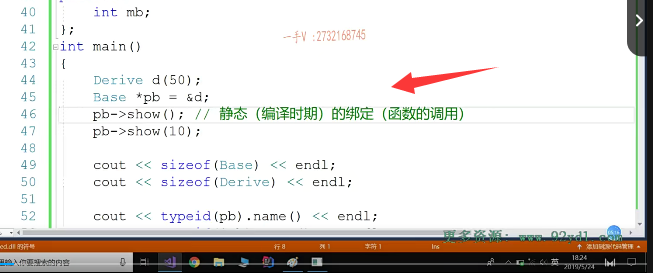

底下这个也也是属于静态绑定。好了吧。唉，编辑器在编译这两个代码的时候一看，嗯，前面调用方法的这个指针是一个基类类型好，他就去基类类型里边儿。去看了这个方法，直接进行调用了静态网点。好吧，注意一下啊，

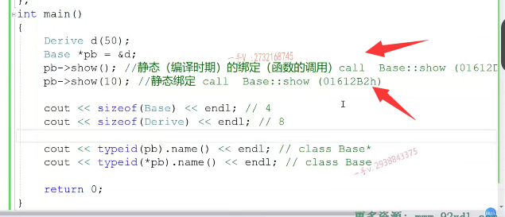

汇编指令

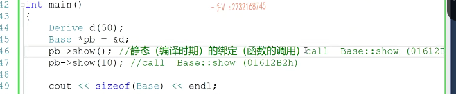

## 大小

编译时期的绑定。那这个大小是多大呢？这个类型的尺寸，这个类型只有一个成员变量MA，所以它的尺寸应该是个四吧？那么derive呢？有一个自己的成整形成员变量，还从基类继承了一个整形成员变量MA，所以。派生类类型的尺寸应该是八吧？

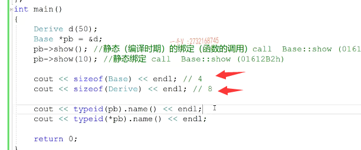

## 类型

PB的类型，这个变量的类型，这==C++也属于静态类型语言==,就是你定义变量一定要指定类型，而且这个变量定义了以后，这个类型是不可能改变，所以PB定义的时候呢？是base*，所以你打印pp的类型，它肯定也是base* *。没问题吧，只不过通过tayeid打印出来类型的时候呢，在这里边儿==类类型前边儿一般都可以加个class==。啊，注意一下。那这个type ID打印指针解引用的类型就是指针指向的类型啊。在这里边儿呢PB是basea *，那星PB那就是贝斯了啊，就是base了。打印类类型，它要加一个class，没错吧啊

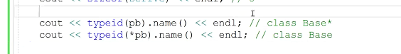

基类指针指向派生类，仍然调用的还是基类的方法。

打印出来的内容

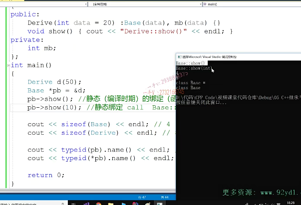

那到这儿，我们现在添加内容了，因为我们这节课呢，

讲了一个核心的问题，就是虚函数好吧，现在。我把。我基类里边的这两个函数啊，我都给它写成这么一个函数了，就是在这个成员方法的前面呢？加了一个vertu关键字啊，这就变成这个虚函数了。虚函数了啊，虚函数。虚函数那下边这个呢？也是虚函数啊，下边这个也是虚函数。来注意呢，

我在这里边要解释一些内容啊。

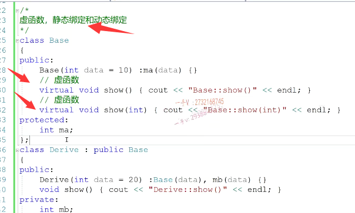

## 虚函数

我在这里边要解释一些内容啊。首先跟我来看一下。我一个类里边定义了虚函数。到底发生了什么事情呢？一个类里边儿，现在我们定义虚函数了啊，一个类里边儿，我们现在定义虚函数了。虚函数了

首先那么。这个==总结一==啊。

如果类里面定义了虚函数。那么，编译阶段注意是编译阶段啊，==编译器需给这个类类型产生一个唯一的vf table==叫做==虚函数表==啊，叫做虚函数表。注意在编译阶段就给这个类类型产生一个唯一的虚函数表啊，虚函数表中。主要存储的内容就是rtti信息，rtti指针和虚函数的地址。

啊。来我画一下，大家看一下啊。这一个表呢？哎，这个表呢，

## 虚函数表

就是我们的这个base这个类型的base这个类型的vf table。base这个类型的虚函数表啊，虚函数表。那么，这个虚函数表呢？这里边放的东西呢啊？你可以==理解成都是整数==对吧？都是整数。那在这儿呢，

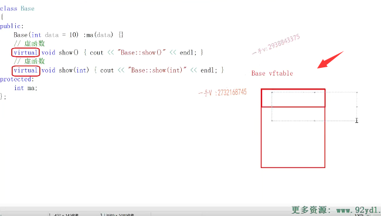

那在这儿呢，第一个呢，放的是我们==rtti的指针==。rtti是什么呢？大家看一下rtti是run tap tap。information.

叫做==运行时的类型信息==。没问题吧？你可以这么简单的理解。理解什么呢？就这个==指针指向的就是一个常量字符串==，你也可以认为它就是==类型字符串==啊，这相当于是一个。类型，字符串。唉，这个类型字符串存的是什么类型呢？==你这张表是哪个类型产生的==？==它存的就是什么类型呢==？

我这张表当然是。

编译base，这个类型所产生的。所以这个rtti指针指向的类型字符串呢，你就。就是base嘛，没错吧

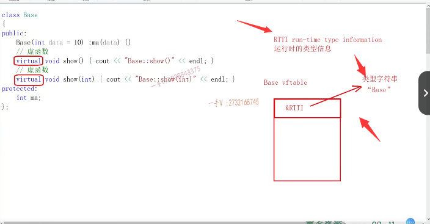

哎，好了。另外呢？我们存了一个整数，叫做一个偏移量，唉，这个偏移量呢？它==大部分的情况下都是零==，为什么是零啊零？

表示啥意思？这个东西后边儿一会儿再说OK吧？

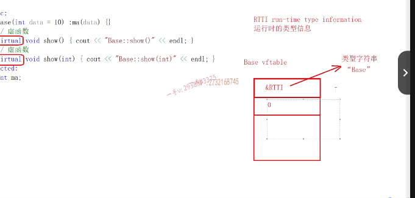

接下来呢，它放的还是整数，我们整数跟地址呢，其实都是用整数来表示的，对吧？现在我这个类里边有两个虚函数呢。okay，所以在这里边儿呢？他传了啊。这两个虚函数的什么呀地址，==他把这两个虚函数的地址存下来了。==

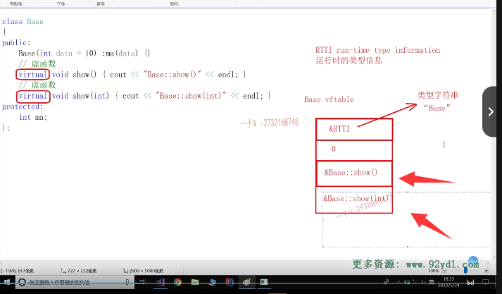

一个类里面定义了，我们写了一个啊，===一个类里边啊==，就==Base类里边定义了虚函数==。那么，在编译阶段，编译阶段啊，不是运行啊，==编译阶段就要给这个类型==啊，给这个类型啊，给这个类型==一个类型对应一张虚函数表==，给这个类型产生了唯一的一个虚函数表。==虚函数表里边主要放的是什么内容==呢啊？它主要放的呢？

就是我们的，你看在这里边，我给大家写了。==就是rtti指针和虚函数的地址==

其实对于我们大家来说，==最重要的就是这个rtti指针跟这个虚函数的地址==。注意啊，注意。

## 虚函数表的内存位置

那么。当程序运行时。每一张虚函数表，因为我们程序中可能会有很多类啊，

每个类里边是不是都有可能有虚函数啊，==一个类型产生一张虚函数表==，==一个类型产生一张虚函数表==。那么，当程序运行时，这==每一张虚函数表呢，都会加载到内存的rodata去==。就是跟我们==常量字符串，同一个内存区==，

那也就是说==虚函数表呢，是放在常量区==的，就是rodata区的，只读数据区read only嘛。就是这张表呢，==它是只能读而不能改的，你要是敢通过指针偏移找到这张虚函数表，你要写里边儿内容，我们程序就要给你报错了==

OK吧。时候呢，刚说了啊，它是牵扯到ro去的，一定要记住。它是只读不能写的。

那当运行的时候呢，执行我们一个函数，唉，我们定义了b1跟b2这两个基类类型的对象。

基类类型的队员，我们分开写了好不好？base类型的对象啊，我们来看一下。

那么，同学们注意一下啊。我们这个对象呢？

哎，==它的内存呢，就不仅仅是四个字节==啦。他现在呢？

从这个内存里边对象内存里边有个MA。还要存一个呀，vfptr叫做虚函数指针啊，虚函数指针。

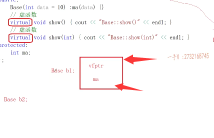

那也就是说，现在这个基类定义的对象，这八个字节了，它==除了原来的整数成员变量MA==。现在==还有一个指向这个对象类型==呢，==就是指向base类型的虚函数表的这么一个虚函数指针==。okay.啊，那么同样的啊，同样的。我们base 2呢？就是==base定义的b2这个基类对象，它内存也是八个字节了。它除了MA，还有一个fptr啊==

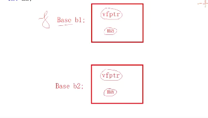

由于他们俩呢，这==两个对象都是base类型==，所以他们的==虚函数指针指向的呢都是我们这张虚函数表==。

同学们注意唉，这个虚函数指针呢？指向的虚函数表，==指向的是虚函数表，虚函数地址的起始部分==啊。虚函数地址的起始部分，这个无所谓，指向开始的内存还是指向哪里的啊？

啊，因为呢，在这里边儿呢，我们访问虚函数呢，就方便很多了啊，访问上边儿可以通过指针的减减来来访问嘛，下边儿通过指针的。加法来访问上面，通过指针的减法偏移来访问。这是没有关系的。啊好。注意一下啊。

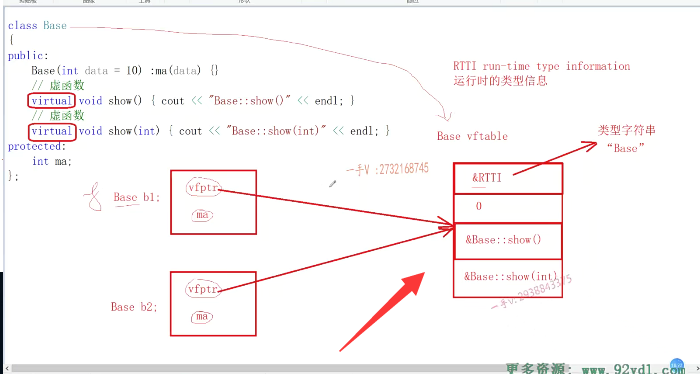

那么，这是总结二，

总结二就是一个类里面。定义了虚函数。这个类定义的对象。其内存，其==运行时内存中==内存中。==开始部分**多**存储一个叫做vfp tr虚函数指针的东西==。==多存储一个vfp tr。虚函数指针啊==，多存储一个VIP叫虚函数指针。啊，

==指向相应类型的虚函数表vf table==。没问题吧啊，==一个类型定义的这个n个对象==。它们的vfp tr指向的都是指向的。都是同一张啊，==同一张虚函数表==，同一张虚函数表。就像我们这里边画的。没问题吧啊。

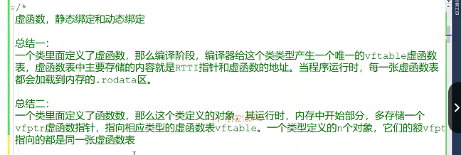

虚函数的个数不影响对象内存大小，但是影响虚函数表的大小。

没问题吧啊。再来总结第三个。总结三。

就是一个类里面。==虚函数的个数不影响对象内存大小==，这正确理解啊，就是如果你有一个虚函数了。那么，这个类型定义的对象就会增大四个字节，有vfp tr。对不对啊？那在这里边，如果你有三个趋函数。我对象里边儿对象不可能说就是增加三个虚函数指针，==**还是一个虚函数指针**==？对不对啊？

也就是说==它不影响对象内存的大小==，但是影响谁的大小啊？影响的是？==影响的是虚函数表的大小==，因为虚函数表里边儿又存了虚函数的，是不是地址啊？你多一个虚函数在这里边儿，就要多存一项，多一项嘛，==存虚函数地址当然虚函数表会变大的==。对于这块儿是我们面试中啊，面试官在如果问到这块儿的话呢，非常非常非常常问的一个。关心的这个问题啊，一个类里边儿==虚函数的个数不影响对象内存的影响的是虚函数表的大小==。

不影响对象内存的影响的是虚函数表的大小。注意好，这就是呢，我们这个唉基类里边儿呢，现在base类型里边儿有虚函数了。啊，那类里边儿有虚函数，对于我们当前类型在编译。啊，运行阶段，它定义的对象都有什么样的影响？大家看看。就是这样的影响。

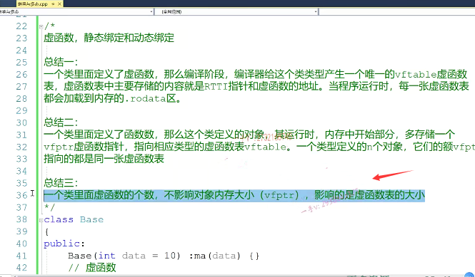

## 派生类方法

这个我们接下来看这个派生类的啊，接下来看派生类有什么变化？

配生类看起来好像没有虚函数。对不对？看起来好像没有虚函数，但实际上有没有呢？

**总结四**，我们把总结四写到这儿啊。

如果==派生类中的方法==和==基类继承来的某个方法的返回值，函数名、参数列表都相同==。而且呢，==基类的方法是虚函数==。

==那么派生类的这个方法。自动处理成。虚函数啊==，你看我们的这个派生类的这个方法。返回值跟积累的这个函数的返回值是一样的。函数名也是一样的。参数列表那也是一样的。对的吧，参数列表也是一样的。那么，这两个的关系呢？就是一个什么关系呢啊？这两个关系呢？就是一个。==覆盖的关系啊，覆盖的关系==，

我们之前说隐藏，==隐藏的是派生类的同名的这个成员==。把==基类同名成员的这个作用域给隐藏了==，相当于==隐藏的是作用域==，对吧？那我们呢？一会儿说完再给出我们完整的覆盖的定义啊，这两个现在就是覆盖的关系。我们派生类这个函数本身就是虚函数。唉，==virtual你不写virtual除派生类的这个函数呢，都自动被处理成这个虚函数啊，自动被处理成虚函数==了，这你要注意一下。好，

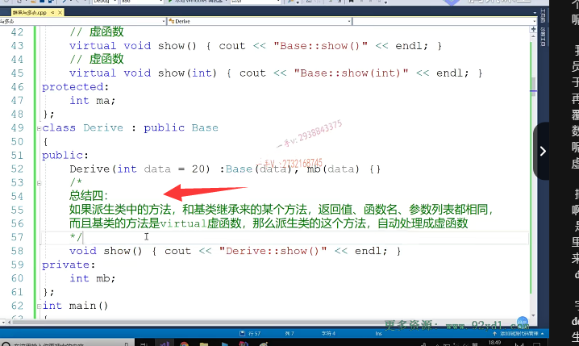

我们先不考虑呢，我们派生类这个函数，那它最起码呢，

因为它继承了base，所以它从我们的基类里边儿呢，是不是也继承了这两个虚函数了？所以呢，我们先画一下在编译阶段啊，在编译阶段。编译阶段，我们呢，会给我们derive这个类型啊。derive这个类型。产生这个虚函数表啊derive这个类型也产生虚函数表，因为它从基类继承来了虚函数了。对着呢吧。唉，虚函数表里边先放的是我就不画横杠了啊。

rtti指针。rtti指针指向的是一个类型信息嘛，是不是你可以认为是一个类型字符串啊？好的吧，那在这里边儿所谓的这个类型字符串存的是谁的类型啊？那你这张表是谁产生的呢？这张表虚函数表呢，是我们派生类类型derive类型产生的，所以在这里边指向的我们类型字符串就是。tiraffe.

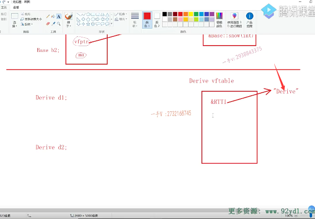

==实际上，这里边儿是一个rtti类型的一个对象==啊，==那我们简单理解，简单理解它存储的类型==呢，就是我们这张表。

这张表有哪个类型产生的rtti指针？指向的类型字符串就是哪个类型？然后再乘个零是的吧啊

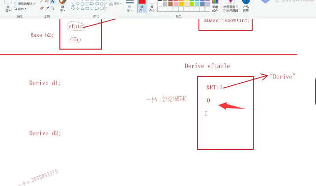

然后底下呢，存的是不是就是我们虚函数的地址了？哎，因为呢，它从积累继承来了这两个虚函数。所以呢，哎，它本身呢，它的虚函数表里边儿放的呢。就是这两个虚函数的地址了。到这儿，我相信大家应该能明白吧。

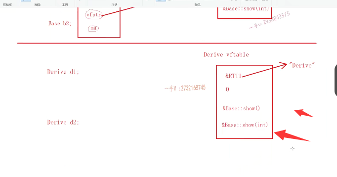

但是呢，我们编译器转眼一看，嗯，这个派生类里边儿，人家对于基类的这个数方法进行。覆盖了或者叫重写啊，这两个指的都是一个意思。重写了。啊，或者是覆盖啊。我们一般说重写了这个同名的覆盖方法。你看派生类把这个同名覆盖方法重写了，什么叫同名覆盖呢？就返回值函数名参数列表都相同，而且基类的这个函数是虚函数。

派生类的这个函数呢，就自动被处理成虚函数了，这本身就是个虚函数，对吧？唉，那我们编译器就知道了，那我就不要你基类的那个show方法啦，因为呢，==人家的这个派生类==啊。把==这个不带参数的数啊，给重写了。啊重写了==，所以我在==我这个派生类的虚函数表==里边儿啊，就==放谁的虚函数地址==了。就要放我们==派生类重写的这个show方法的地址==。

这叫做覆盖关系，所以覆盖，覆盖指的是哪里的覆盖啊是？虚函数表中。==虚函数地址的覆盖==，就是我==派生类呢，提供了一个和基类啊，这个同名的覆盖方法==，那就是基类的就跟基类的虚函数返回值相同函数名相同参数列表也相同，对吧？就覆盖了

但是我们派生类呢？==并没有对基类的这个带整形参数的，这个show的这个虚函数进行重写==，

所以呢，派生类的这个虚函数表里边儿。==这里边放的还是基类的这个虚函数==好了吧？

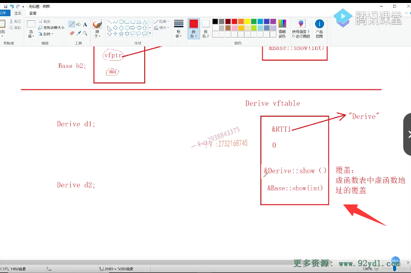

现在呢，注意一下我们这个派生类对象呢，原来它是不是只有？MA和MB啊啊，原来只有MA和MB，但是呢，现在的派生类类型呢，也有虚函数了。那也就意味着，派生类类型定义的对象呢，也要多增加一个。虚函数指针。

这个虚函数指针指向的呢，就是当前类型对应的这张虚函数表。对应的这张虚函数表。对应的这张虚函数表。啊，这个理解一下。理解清楚。

没有问题吧？这就是我们在基类里边添加了那把那两个受函数添加这个修改成虚函数以后呢？整个儿，它在编译阶段啊，运行阶段产生的这个不同啊，产生的这个不同。好，这两张表首先呢，

大家可以暂停一下视频，你比如说你可以暂停一下视频，好好去想一想啊，好好去想一想。

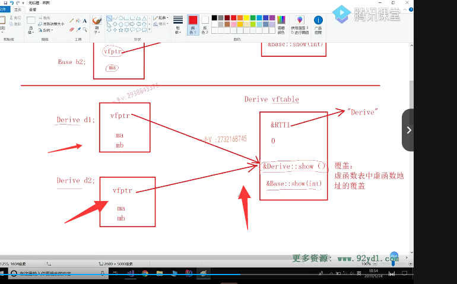

我们现在再来看我们刚才main函数同样代码有什么不同的地方？==前两个呢，都是一样的==。是不是前两个人都是一样的啊？没什么区别，

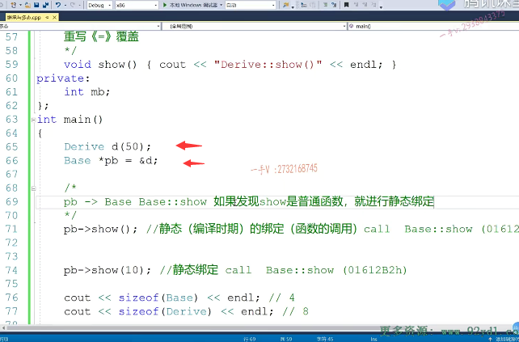

现在来看这个。现在来看我们这个。

PB指向的这个受方法。编译阶段一看PB，它首先是什么类型啊？唉，它是基类类型。然后呢，它就会跑到基类的作用域里边儿去看一下，这个不带参数的时候是个什么情况？a积累作用里边去看这个数。如果发现这个数是个普通函数。啊，==如果发现show是普通函数就。进行静态绑定，那也就是说。直接生成call base show()==

完事儿完了，也就是说呢，我经过编译，我就知道这里边儿啊，无论如何。==调用的啊，就是base作用力下的show方法。==

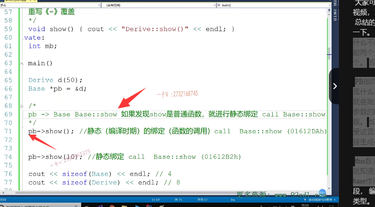

## 动态绑定

但是呢。如果说在编译阶段，编译器发现了诶，这个指针呢？是一个base类型。对吧，这个指针呢？

是一个base类型唉，你看看这个指针。哎，然后他跑去base作用底下去看show。你注意我说的这个就是我们分析问题的方法啊，函数发现这个数呢，==是一个虚函数==。啊，==如果发现show()是虚函数==。就进行。==动态绑定了==。啊，那动态绑定怎么绑定呢啊？动态绑定怎么绑定呢？

我们来看看啊，动态绑定怎么绑定？

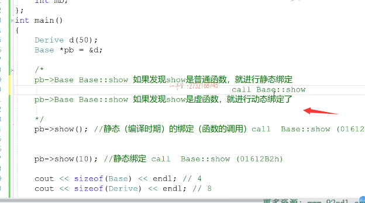

那也就是说，大家来看一下我写的这么几个简单的这个指令啊。好，这里边我们有一个mov eax。dword ptr p.这个是什么意思呢？

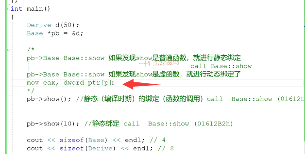

这个是把==**p指向的。对象的前四个字节p**==。==PB这个PB指向的这个派生类对象==，对吧？啊，那==**派生类对象的前四个字节**==。放的是什么东西呀？

### 先找到派生类对象内存的前4个字节，存的是虚函数表的地址

唉，==放的是我们虚函数表的地址==对吧？那在这里边儿，也就是说这一句指令呢？就是把==我们对象前四个字节==。==虚函数表的地址==放到这个==寄存器里==边儿来了。

## mov eax。dword ptr p.将派生类虚函数表地址拿出来放到寄存器中

能想来吧，然后在这里边再来一个。dword ptr eax你就把eax存的这个地址的四个字节的内存。EX现在表示的是虚函数表的地址，vfp tr你看存的是我们虚函数起始部分的是不是内存的地址啊？就是这块儿。现在在这里边儿取四个字节。==取四个字节dword ptr EX嘛啊，你看ex是不是表示就这块儿内存的地址啊？==

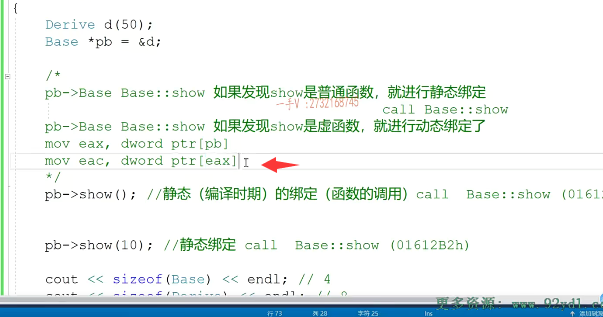

## dword ptr eax  取出的虚函数表中虚函数地址 放到寄存器ecx中

那在这块地址内存的四个字节，那取的是不是就是我们==派生类的这个show方法的地址==啊？没问题吧，最后再call e cx它就是这样调用的。

来我们看一下啊，看一下是不是？这个样子的调用过程。转到返回遍，大家看一下，唉，是不是这个样子的？哎，是这个样子的，

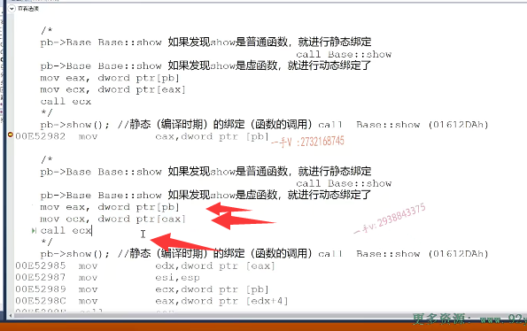

没错儿，对了吧？最终呢，靠的是谁e cx。扣一个寄存器。那首先我问大家，你汇编指令编成这个样子，这个我们能清清楚楚的看到，这到底调用的是哪个函数？你==靠个寄存器，你知道这最终调用的是哪个函数吗？肯定不知道啊==，==寄存器里边儿放的是我们最终从虚函数表里边儿取出来的，这个虚函数的地址==。啊，

==取的是一个虚函数的地址==，但是呢，这到底是哪个虚函数的地址？当然，==只有在运行的时候。你通过指令在虚函数表里边儿，你找到谁的地址，你调用的就是哪个函数嘛==？

当然，这个到底是调用哪个函数？我们是可以通过技术分析，是不是分析到它调用的是我们派生类的受啊

啊，由于呢，==在编译阶段生成的指令上，我们是无法确定这最终调用的是哪个函数的==，所以==我们把这样的绑定呢叫做。动态绑定==。

绑定刚说了，指的是函数的调用啊，动态指的就是。运行时期的。绑定啊，运行时期的这个绑定。只有运行时才知道，寄存器里边儿放的是什么样的地址啊？哎，才能叫做一个动态的绑定

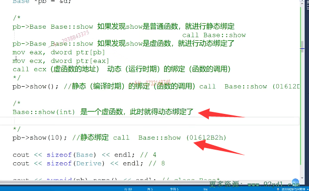

大家区分一下，好好也考虑一下啊，那同样在这里边儿。

看这是静态绑定还是动态绑定，

==我先看指针的类型==，==指针类型是base==啊，去base里边看看看这个==带整形参数的show==，==如果是个普通方法就静态绑定==啊，就==直接调用它==，

==但是这是个虚函数==，所以现在就得。怎么绑定了，现在就得。因为呢base里边儿的这个带整形参数的数是一个虚函数。此时就得==动态绑定==了，此时就得动态绑定啊，还是这个样子。

还是这个样子。没问题吧啊，但是呢啊，但是呢，==我们应该知道这你从上到下，从上到下==，我们derive从基里继承来的这两个方法，==这个方法虚函数啊，在虚函数表==中，==谁先放谁后放跟它==。==它们定义的先后顺序就是有关的不带参数的==，是不是先定义的，==它就放到前边儿带参数的，放这个后定义的就放到后边儿==。就放到第二位，

没问题吧？就像我们画的这个顺序OK吧？所以所以在这里边儿呢，我们来看一下。

我们来看一下。啊，断点打到这里，我们可以调试一下，大家也可以验证一下，这到底是静态绑定。还是动态绑定，大家来看看。这里边儿。是不是也是这个样子呀？哎，也是这个样子，

也是这个样子。这个叫什么？==是call寄存器嘛==？==并不是call哪个，是不是具体的，是不是函数==啊啊？这个就叫做。啊，往我们这儿都已经画了，这儿你就可以验证这个就叫做。动态绑定。OK吧，动态绑定。动态绑定。希望大家把这个搞清楚啊。

搞清楚动态绑定，所以你能区分静态绑定和动态绑定啊。啊，

==动态绑定是我们实现多态的这个基础==。

大家要搞清楚。实际上呢，

我们从这个汇编指令上，我们也可以看到什么内容呢？就是实实际上啊。它的这个==vfp tr==啊啊，==这个vfp tr要通过vfp tr==。他就可以怎么样呢？==他就可以找到。是不是我们相应的这个虚函数表里边儿==，这个虚函数了？OK的吧嗯

OK的吧嗯。再来看下边儿。类型这个类型的尺寸变了，因为多一个虚函数指针呢，是吧？就变成12了。这个变不变PB变不变PB是不会变的,==静态类型语言==嘛，定义的时候是base  **，你什么时候打印它，它都是base* *

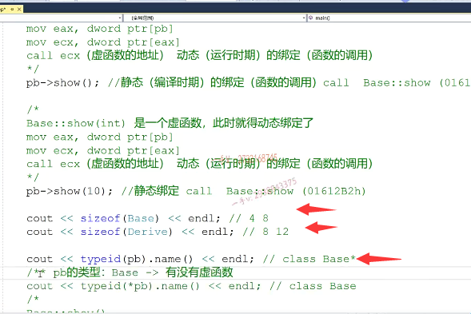

但是呢，再来考虑最后一项，最后一个。这是打印我们指针指向的。是不是对象的类型啊啊？

那如先看先看PB。PB的类型。是什么类型？是base类型？再有去base里边儿看base有没有虚函数啊？注意。看看我说的这个问题的，这个过程就是我们思考的过程。

啊。==如果base没有虚函数==，就是我们最开始的最开始，base是没有虚函数的。对吧啊。那么。新PB识别的就是编译时期的类型，

编译时期呢，你把PB定义成。Base*的，所以 * pd就是什么类型啊？啊，所以==星PB就是。base了一下。==

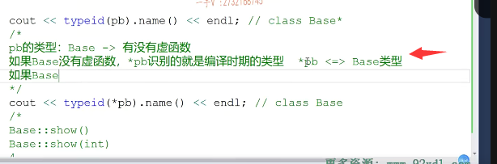

啊，如果base有虚函数。有。虚函数那现在有没有现在被子是不是有虚函数了啊？那星PB就是指针解引用，指针的指向。==识别的就是运行时期的类型，就是什么类型啊？==

==对rtti类型==。好吧。==那rtti类型在哪里存着呢？是不是还是在虚函数表中存着呢==？对，你通过这个PB，它实际指向的是一个派生类对象。是不是这个派生类对象d呀？所以呢，==它最终访问的就是derive类型的==，

因为==派生类对象的这个虚函数指针==指向的肯定是==派生类类型的虚函数表==嘛。所以最终你访问的通过访问对象的前四个字节啊，vfp tr你访问的肯定是我们派生类类型的。虚函数表，==配生类类型里边的虚函数表==你你你要访问==它的这个rtti啊类型信息==，你访问的。那这张表因为是派生类类型产生的嘛，所以你在这张表中取这个rtti类型，你肯定取的是。什么类型了==class？derive类型==

现在就不是刚才的class base，因为刚才的base里边是没有虚函数，所以星pd识别的就是编译时期的类型。

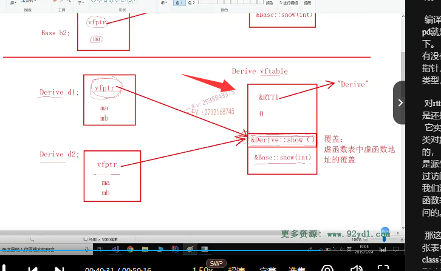

## 执行出来的第一行解释

我们来。执行一下我们的这个代码，看看呢，其运行结果呢？呃，到底是什么样子的？大家来看。唉，

刚才呢，第一个调用的是base里边儿的数，现在呢，已经调用到谁了？派生类的授了积累指针，指向派生类对象，唉，能直接利用派生类的授方法，因为在这里边儿啊，我这个怎么做到呢？就是在这里边通过动态绑定。实现的。它调用这个函数的时候，并没有直接在指令上去调用积累的数，因为积累的数呢，

是一个虚函数。所以在这里边动态绑定了，因为它最终指向的是派生类对象，所以它访问最终访问的也是派生类derive的虚函数表。取出来的这个数就是我们派生类重写的数。

## 执行出来的第二行解释

### 已经是动态绑定了，但由于派生类没有重写

这个也是个动态绑定，但是==由于呢，我们派生了没有重写==，==最后动态绑定调用的还是基类的==，这个带整形参数的数。没问题吧，==但是它也是从刚才的静态绑定已经变成现在的动态绑定了==，因为PB的类型base下边的show呢，已经是一个虚函数了，所以。

所以一定要动态绑定了啊。

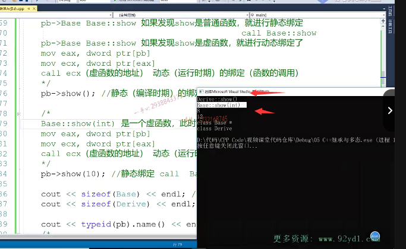

再来看下边儿八跟12，因为呢，这两个类型的尺寸呢，定义的对象最终都将多一个四字节的vfp tr。唉PB的类型是不变的，因为都是静态类型，语言变量定义类型永远都是后边儿是class derive了。啊，不是刚才的在这里边儿呢，给大家再列出来，这是我们第一次，这是我们第二次。测试。给给base。

的两个受方法。这个定义成。vertu虚函数了。啊，这个是什么呀？这个是base的两个show函数都是普通的。啊，函数注意它们的不同。再有识别边野时期的类型，识别运行时期的类型主要就是看PB所属类型。它里边儿有没有虚函数？对吧啊。好，这就是我们这节课呢，重点的这个内容，

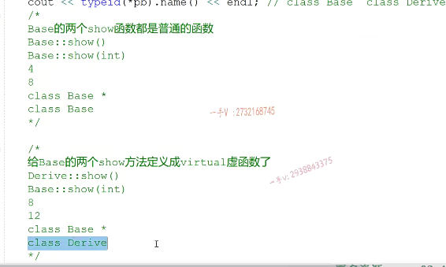

刚才呃给大家还要给大家说这个零呢，是不是这个零就表示的是我们VS ptr啊，在这个对象内存的偏移量。因为呢，vfp t2的排列优先级是非常非常高的，所以呢，在没有我们就是后边讲的需这个需继承的情况下，我们vfp t2是永远在对象的前四个字节放着。OK吧，==所以呢，它就在我们对象的内存的起始部分==，所以我说呢，在这里边儿主要就是零。好吧，大家呢，

还可以通过VS的工具呢，还可以通过这个VS的工具啊。呃。我们看一下啊，这个工具VS studio命令提示啊studio命令提示在这里边呢。嗯，可以打开这个文件啊，打开这个文件，打开这个路径，这是D盘，你可以通过命令，也可以查看的啊。一样的cl。类所在的原文件第1 report single class layout，注意首字母要大写呢layout。

这里边是个derive。大家看唉，这是就是它的这个rtti指针了，这就是偏移量零，这就是两个什么东西啊？啊，这就是两个什么两个是不是数方法啊？这两个数方法看一下我们的base。贝斯啊，这是我们贝斯了，贝斯的两个收方法啊，大家注意在这里边儿呢，排列的时候呢，你看这里边儿排列的时候，我们派生类重写的是不是在？

下边儿了。是不是放到下边儿了啊？放到下边儿了，它应该它应该就是这样的一个顺序啊。大家来看啊，我们这里边儿画的是不是有点儿反啊？它应该就是这么一个顺序，你看先从基类里边儿继承来了，贝斯的这个show。再从基类里边继承来了，因为它首先呢。前面排列的都是从鸡肋继承来的嘛，对吧？然后呢？它又有一个什么呀？

自己的重写的是不是受方法啊？相当于基类的，这个就覆盖掉了，就不用了，但是这么一个顺序，从上到下的这个排列的顺序。OK吧啊，大家在这儿呢，通过人家的命令，你就可以看的这个很清楚了。好不好啊？大家可以自己查看一下啊，这是它的这个对象的虚函数指针。是不是大家都能看到虚函数指针？啊学函数指针。

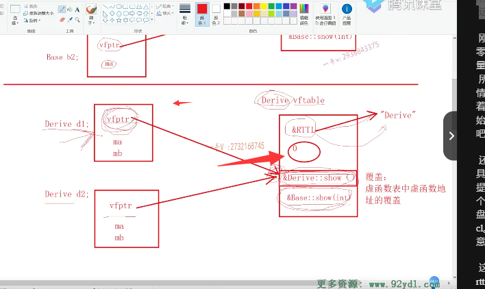

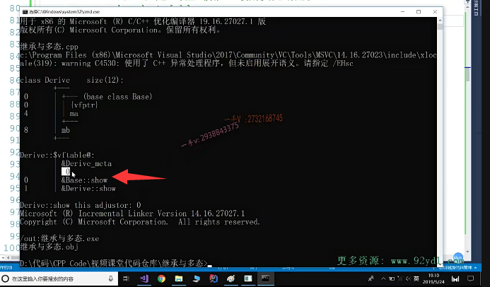

之前的画的顺序反了

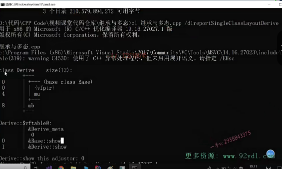

我们这里边儿画的是不是有点儿反啊？它应该就是这么一个顺序，前面排列的都是从鸡肋继承来的嘛，对吧？然后呢？它又有一个什么呀？

自己的重写的是不是受方法啊？相当于基类的，这个就覆盖掉了，就不用了，但是这么一个顺序，从上到下的这个排列的顺序

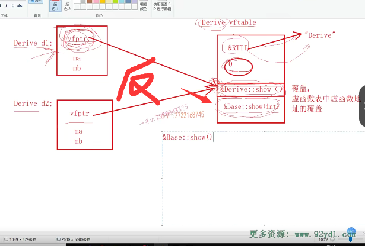

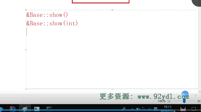

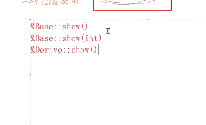

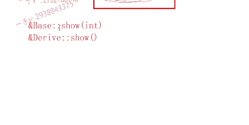

是把前面的直接去掉啊

实际上rtti呢是通过一个类型来表示的，但是我们在这里边儿呢呃。简单的给大家用这个类型字符串来进行一个描述啊，因为我们最终访问的rtti类型啊。啊，最终给我们的也是一个非常有用的这个。字符串类型信息对吧？我们直接在这里边儿就这样分析了。好，那么这节课的主要内容呢？就是这么多，有三个点啊，那么虚函数静态绑定和动态绑定，然后呢我们？

最后给出这几个词儿的定义啊

最后给出这几个词儿的定义啊，定义大家好好理解一下。一个类添加了虚函数对。对这个类有什么影响？这就是对虚函数的解释

在这里边。总结一总结二总结三总结四，这就是对虚函数的一个描述OK吧？

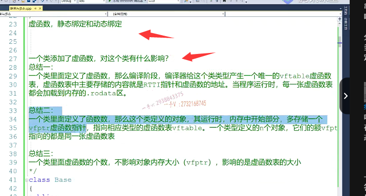

然后静态绑定跟动态绑定。在这里边儿，我们在这儿给大家总结了。就是绑定指的是函数调用动态跟静态，静态指的就是编译时期的绑定动态呢，指的是动态绑定啊，不是这个运行时期的绑定。

==静态绑定，绑定的是普通函数的调用，而动态绑定一定是对虚函数的调用。==

对的吧啊，那么大家在回答问题的时候可以直接从指令上说.==静态绑定呢，就是生成的指令call。具体的函数==。==地址就已经给出来了==，

==而动态绑定最终编译的是一个call寄存器==，那==寄存器存放的是什么地址？我当然只有运行的时候才知道==。所以叫做动态的绑定运行时期的绑定。OK吧，最后我们给一个覆盖的概念，我们把前边儿的这个。

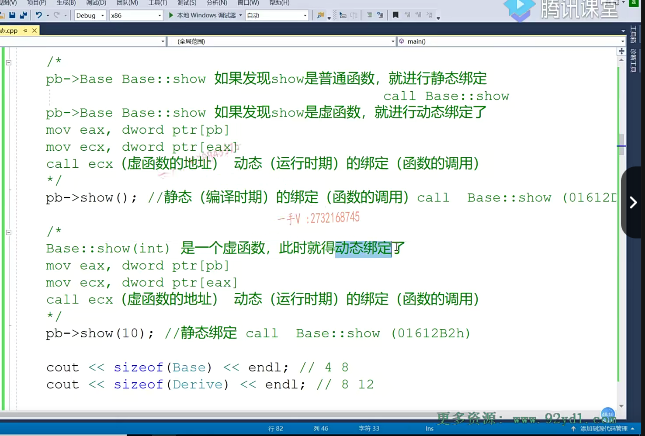

重载隐藏覆盖而覆盖也给完啊，==就是基类和派生类的方法。返回值。函数名。啊，这以及参数列表都相同，而且基类的方法是。虚函数。那么啊，派生类的方法就自动。处理成。虚函数。唉，它们之间称为覆盖关系啊==，你要正确理解这个覆盖关系。

啊，因为有虚函数了，派生类的虚函数表中本来放的呢，唉，是从积累继承来的，这个函数虚函数的地址对吧？但是呢，派生类又提供了这个同名的覆盖方法，重写的方法，那么在派生类的虚函数表中。啊派生类的虚函数表中，就把基类继承类的那个虚函数地址给覆盖掉，指的是在虚函数表中的这个覆盖。行，那我们这节课呢？

先把这三个核心内容给出来，下节课呢，我们再给出一些呢啊，跟这个三个内容相关的，其他的需要。大家熟知掌握啊，是重点的，这个内容好，那我们下次课再见。

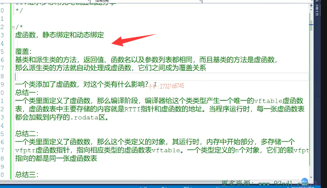

