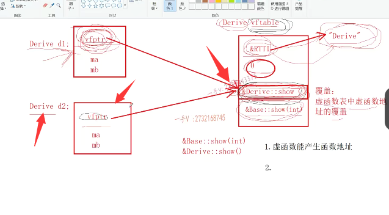

# 第五节课

大家好，欢迎继续收看石磊老师的视频课程啊，上节课呢，我们把这个重点呢放在给大家讲解了这个虚函数。啊静态绑定和这个动态绑定啊，大家应该都还没有忘吧啊。那么，希望把这一部分呢？一定要多看几遍，好好理解一下啊，好好的去理解一下。这里边儿包含了我们总结在校招面试过程中，如果被问到我们CA加继承多态，这里边儿的内容的话呢？啊基，

基本上啊，我们最近两三年春招秋招所能遇见的继承多态的，这个背面的问题呢，都在这里边儿了。啊，都在这里边儿。好，上节课我们讲了这个虚函数啊，那我们这节课呢，主要就看两个问题啊，

问题一。我们看。==哪些函数？不能实现成虚函数==啊，哪些函数是不能实现成虚函数

问题二，我们今天的一个重点就是。就这个事啊。是什么呢？就是虚析构函数。

啊，==那我们从问题二的名字，我们也能听出来析构函数是可以成为虚函数的==，对吧啊？那么大家来看啊，

对吧啊？那么大家来看啊，首先。你要成为虚函数。那么，你的这个函数地址就需要记录在虚函数表当中，

那么这是第一个就是说呢？虚函数能产生函数地址。没问题吧？啊，第二个第二个第二个那虚函数表的地址呢？那虚函数表，你找到虚函数表才能找到相应虚函数的，是不是地址啊？那虚函数表在哪里存储啊？在vfp tr里面。虚函数表的地址在vfp tr虚函数指针里边儿存储，那虚函数指针又是在哪里存储的呢？啊，是在我们对象的内存里边儿放着，所以也就是说呢，

第二。需要依赖对象啊，需要依赖对象。没问题吧，我们写到这里吧。

第一个就是。函数就是虚函数，能产生地址存储在。vf table当中。

第二个是什么呀？就是对象必须存在，因为对象存在了才有vfp tr。

进而才能找见vf table，才能在里边儿找到虚函数地址。好的吧

## 构造函数不能成为虚函数

所以这样来看构造函数。构造函数能不能成为虚函数呢？构造函数可不可以不行的，因为我们说对象啊，对象构造完这个构造函数，构造完成了，对象才产生。没问题吧，对象才产生啊，构造函数一它不能。不能在构造函数前面加啊加加，这构造函数no，

这是不行的好不好？

第二个。==构造函数中调用虚函数。也不会发生发生动态绑定==。那也就是说呢，构造函数中。全部都是构造函数中，唉，==在构造函数中。调用的函数。啊，任何函数都是静态绑定的==。啊，你要注意它的这么一个特征啊。注意它什么特征

好吧，构造函数相当于正式给我当前对象初始化，是不是你要是发生这个独特啊，调用的就是派生类的方法了？没问题吧，但是你还记不记得呀我们？派生类对象，它的构造过程呢啊，构造过程先是构造，先是构造谁啊？先构造先。调用的是基类的，

是不是构造啊？构造函数啊？那你在基类的构造函数调用的时候呢？==此时派生类还没有构造==呢。==没有初始化==呢，你在==基类的构造函数里边儿，你发生动态绑定啊，那你调用的是不是就是派生类的方法啊==？派生类还没初始化呢，你利用派生类的方法干啥呢吗？对准没有啊，它先调用的是基类的构造函数，其调用完了以后呢才。调用派生类的构造函数才初始化完，更别说其他方法。

### 所以，在构造函数中，我们是不会发生动态绑定啊，构造函数也不能成为这个虚函数。OK吧

## static静态成员方法不能成为虚函数

理解一下static静态成员方法。那肯定也是。no嘛。肯定也是no的，

为什么？

==因为静态方法调用根本就不依赖对象==啊啊，==我们要写成虚函数==对吧，你就得把==地址存到虚函数表==当中，访问的时候就得==先访问对象的内存==== 获取虚函数指针== ==再访问虚函数表区虚函数地址==，

#### 这静态方法根本连对象都不需要。

所以呢，你不能。vertu后边加个static或者static后边加个vertu。这是不可能的。好的吧呃，但是呢，但是注意一下啊。

## 析构函数能成为虚函数

析构函数。是可以成为啊，析构函数是可以成为虚函数。

首先呢啊，析构函数。调用的时候调用的时候。

它对象啊，是存在的。没问题吧，对象是存在啊，那完全可以把析构函数呢，实现成这么一个虚函数。啊，实现成这么一个虚函数。

## 虚析构函数

好了。那我们看一下啊。我们把这个上节课的这个代码我们拿过来用一用啊，用一用。哎，应该是之前的代码，我们用一用啊。

之前的我们构造虚构有打印的，唉对，就是这个。我们把这个代码复用一下啊，代码复用一下，我们来讲解我们今天的这个虚析构函数啊。

来稍微浏览一下代码啊，稍微浏览一下代码，这个是我们在前边儿讲的这个。派生类对象构造过程的时候写的代码基类有一个成员变量MA，派生类有一个成员变量MB。唉，基类的构造跟析构都有打印派生类的构造跟析构也都有打印。啊定一个派生类对象对吧？定一个派生类对象。

啊，我们在幂函数中定一个派生类对象d10，我们现在定义一个指针。PB指向派生类对象，然后呢，来调用它们的这么一个show方法。

对吧，这PB是Base类型，编译时期就看Base里边儿，看看看里边儿有没有show啊？啊，给你加一个show呗。唉，看看这个show，看show看啥呢？

别看热闹啊，对吧？==看这个show呢，这是个普通方法，这里边儿就什么绑定啊？静态绑定==。这就==直接call base作用于底底里边儿的show==就行了，

如果编译器看==PB指针的类型base里边儿的这个函数是个虚函数==。那么，在这里边儿就得==动态绑定==了，就是==访问指针所指向对象的前四个字节==，就是==虚函数表指针==再间接访问这个==derive类型的虚函数表==，对吧？啊，进行==动态绑定==。

### 我们把对象从首地址开始的4个字节或者是8个字节，这个位置我们称之为虚函数表指针（vptr），它里面包含一个地址指向的就是虚函数表（vftable）的地址。

### 虚函数表说白了就是里面是一组地址的数组（就是函数指针数组），他所在的位置就是虚函数表指针里面所存储的地址，它里面所包含的地址就是我们重写了父类的虚函数的地址（没有重写父类的虚函数那么默认的就是父类的函数地址）。

好，现在呢？

## 栈上派生类  构造析构正常

但是我们今天的核心呢，看的就不是。静态跟动态绑定了，我们今天要搞定一个问题啊，你看这个派生类对象在。初始化的时候d啊，先构造基类部分。再构造，调用自己的构造，构造自己特有的成员MB是不是？d是栈上的对象，出作用域呢，你看。先调用自己的析构函数析构自己部分，再调用基类的析构函数析构基类部分的。成员占用的外部资源，这个是没有任何问题吧？哎，构造跟析构嗯，完完整整的这个对应上啊，完完整整的对应上。

### 昨天百度了一下，为什么派生类对象构造函数，要有Base(data)就是说明派生类对象构造前，要调用基类构造函数，才能有派生类构造函数

现在我们再来看。改变改变。改变什么呢？改变一下我们这个代码。我们现在要变成这个样子。

==base指针哎，指向我们堆上new出来的派生类对象==。通过PB调用show,在这里边，我们说这PB是一个。PB是类型，是个base是吧？show是个普通方法，所以在这里边是个静态绑定啊.

*就一定是贝斯，我们得看一下==这个类型里边有没有什么呀虚函数==？

如果==没有虚函数识别的，就是编译时期的类型，那么星PB就是base==了，

如果==base里边儿有虚函数==，像现在。啊，那这个==*PB识别的就是什么呀？rtti类型==了，

### ***pB识别的是rtti类型，而pb指向的是派生类对象，所以查的是派生类的前4个字节就是虚函数表指针，**

### **找到了派生类的虚函数表**，*pB是rtti，就是derive

==它指向的是派生类对象，最后访问的也是派生类对象==。

==这个derive类型的虚函数表，所以。这个打印出来就是derived==，现在这也是==动态绑定==了。这个现在应该是很清楚的吧？

## 堆上的

堆上的这个内存呢？我们用完，我们一定要干嘛一下呀？一定要==释放掉==对吧？但是==delete的第二步是我们free的动作，释放内存的动作==，但是在==释放我们堆上内存之前，我们需要调用，是不是对象的析构函数==啊？因为我们对象使用完成的时候呢，可能需要清理一些外部的资源，==做一些清理外部资源的工作==啊，那么这些工作的代码呢，

都写在我们。析构函数里边儿，现在虽然我们没有写任何清理资源的这个代码，但是我们假设一下，我们析构函数你肯定是得调的嘛。是不是万一我这儿有代码，需要执行，那你不定，那就是你的错了，是不是好，我们看运行一下这块儿代码。我们看能不能看出来发生了什么问题啊？对吧，在这里边。new new，

我们说它==第一个有malloc开辟内存的功能，第二个就是。调用相应的构造函数==嘛，这里边儿你定了一个derive对象，所以派生类对象先调用基类的构造，从基类继承类的成员。嗯，调用自己触触发自己的成员调用show，这是一动态，绑定好不好delete PB的时候我们。

## 堆上    new 出来的对象     没有调用派生类的析构函数

我们看出错误来了。什么错误？派生类的析构函数没有调，是不是啊？

这里边儿是派生类的析构函数没有被调用到。

出现错误啦。那这里边涉及内存泄露了，是不是啊？

那如果在这里边，你比如说。我们派生类里边儿啊。我们有一个指针。我们这个指针在初始化的时候呢，指向了堆上的一块资源，初始化为data，指向了堆上的一个整形对象，对吧？那在析构函数里边，

需要把这个。资源释放不了。对着没有？

你看这是派生类的对象。派生类从基类呢继承来了一个MA，那么派生类人家自己有一个MB，还有一个ptr。这个ptr呢？指上指向了我们堆上的。是不是一块儿资源啊啊？我们给它画成红色。你现在相当于就只调用了基类的析构函数。

然后delete第二步free，把对象的内存给清掉了。但是对上的这块整形内存谁清呢？嗯，谁清楚本身就是靠我们。之前调用一个合理的派生类的析构函数，在析构函数里边儿是不是把这个指针指向的外部的这个对内存给清掉了？那你现在派生里的析构函数没有被调用啊？这就是问题了。是吧啊。

## 析构函数为什么没有调用

那么来看，为什么呀？在这里边儿，你在这里边儿啊，我们先看这么几个问题啊。

==PB的类型是什么类型啊？是base类型==，所以==delete的时候对应的析构函数==，它就是这样去做的。啊，它就是这样去做的，==首先看PB的类型，哎，一看PB的类型是base类型==。那他就去base里边去找。看这个析构函数是个。普通函数。普通函数，==析构函数是普通函数==。

所以在这里边。==对于析构函数的调用。就是什么绑定了静态绑定==了，也就是说在这里边儿==直接编译成call   base::~base() 。====作用于底下的基类的析构函数==。给派生对于派生类来说，==派生类的析构函数根本就没有机会调==。一点机会都没有，一点点机会都没有，对吧？

## 解决办法：

所以呢，在这里边儿啊，我们需要这样做，我们需要呢，

==把基类的析构函数。定义成了虚析构函数==。

### 不用担心派生类的虚构函数和基类的虚构函数名字不一样

那然后派生类的析构函数，==不要担心这俩名字长得不一样，他们也都想长一样，长不了==。机构函数必须得跟类名一样，对吧？大家注意这一点就行了，就是基类的机构函数是虚函数，那么派生类。

基类的析构函数是virtual虚函数，那么派生类的析构函数自动成为虚函数啊？

自动成为虚函数。好了，那么注意一下。

现在呢，我们来再来看。==delete PB的时候==，==一看PB的类型是什么类型啊？base类型==，然后呢？==去base作用底下看base的析构函数==，==发现这是一个什么函数啊？虚函数啊==，虚函数那么在这儿呢？对于析构函数的调用就得发生什么了？

就是===动态绑定==了啊，

动态绑定了这个基类里边儿的虚函数表，里边儿放的应该是这两个虚函数对吧？base.地址嘛，base下边儿的这个base还有一个就是谁呀？base边儿的是不是这个show啊.

派生类呢？本来呢，从这个派生类啊，我们写到这儿吧，派生类本来从基类是不是继承来了这两个呀？对吧，但是呢，人家派生类呢，

### 派生类中覆盖了基类的析构函数

有什么相当于==自己是不是重写了这个析构==啊？对那么在派生类的虚函数表中，就不需要基类的这个虚函数的地址了，而是用自己的重写的虚函数的地址呢？把==基类的这个同名。方法就是同名覆盖方法==啊，你不要认为不同名它，它就是同名的析构函数只有一个好吧，给==覆盖了在虚函数表当==中。

所以当在这里边delete PB的时候，发==调用析构函数发生动态绑定==，因为==指针指向的是派生类对象==。你这种访问的。==PB指向的是derive类型的对象==，所以你最终==访问的也是derive类型的==，

是不是虚函数表啊？在==derive类型的虚函数表==中，你==放的肯定是我们派生类的析构函数==嘛。

==派生类的析构函数，它就会负责。当我把我自己的这一部分析构完了啊==。

## 调用完派生类对象的析构函数后还会调用基类的析构函数

==那我再去调用基类的析构函数来帮我，把我基类部分呢？把我基类部分。给析构掉==，你看他还挺操心的，是不是把？把自己这一部分析构完了以后，他再想办法呢，

把基类的析构函数一掉，把基类自己，基类这一部分从基类积成来的，这一部分成员占用的外部资源给。释放掉。没问题啊

好。那在这里边，我们。运行一下，我们这个程序。大家来看一下。现在派生类的析构函数调用了没？调用了，现在呢？

这个释放资源的动作才是正确的。

好吧，所以在这里边儿呢，跟我来看这么一个问题啊。这么一个问题。首先呢，析构函数是可以成为虚函数的。其次，什么时候什么时候把析构函数就是把基类的析构函数。必须实现成虚函数。

啊，那一定是基类的，==基类的指针或者引用==啊，同引用。指向，==注意不要光指向派生类对象指向堆上==。==new出来的派生类对象==。对象的时候。==因为只有对上new出来的对象呢，最终我们才得去delete PB==，

==但是这个PB呢，你看它是一个。基类的指针==。

是不是啊？它首先。==他调用析构函数的时候。必须发生动态绑定==。否则。==会导致派生类的析构函数无法是不是调用啊==？对它，

否则会导致派生类的析构还是无法调用的。啊，无法调用。这个一定要搞清楚，否则会导致派生类的吸构还是无法调用的，因为这个指针只是个基类类型的指针。刚才我们这分析的。

## 栈上和全局的对象  不需要调用delete，就会做正确的析构

==希望大家把它搞清楚，不要光指针指向派生的对象，指的是堆上的派生类对象==，

==你指向栈上的对象，我刚开始你根本你不需要delete他呀。那栈上的对象出作用域，人家会做正确析构==的，包括==全局的对象==，

对吧？因为这里边主要是delete指针调用析构函数，由于呢，基类的类基类类型里边的析构函数，最开始呢，它是个普通函数，所以发生的这个静态绑定。只动只调用了基类的析构，没有调用派生类的析构。

好，这节课我们讲了一个核心，就是虚析构函数，希望把它的这个应用场景啊，以及它的为什么能解决？这个呃，

它这个应用场景发生什么问题，以及它为什么能解决这个问题？搞清楚好吧，它其实对于我们虚函数静态绑定动态绑定的一个。特定应用场景的一个。进一步的理解。好，那我们下节课再见。