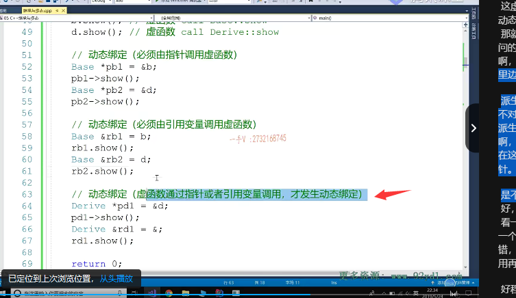
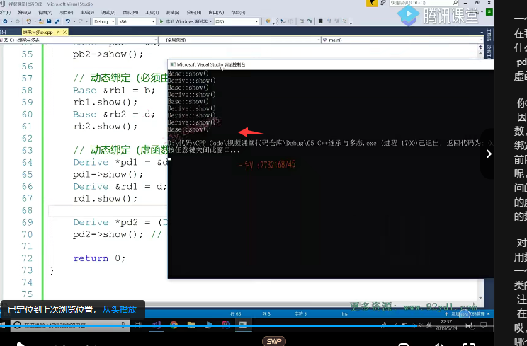

第六节课

大家好，欢迎继续收看石磊老师的视频课程啊，上节课呢，我们把这个。虚析构函数啊，虚析构函数以及我们类的成员方法里边儿啊，我们有哪些方法呢？是不能够实现成虚函数的。啊，把其和对应的这个原理呢，给大家说了一下啊，那我们这节课呢，我们再探究下一个问题啊，我们还来说这个。虚函数。

和动态绑定。

## 是不是虚函数的调用一定就是动态绑定

啊，我们解决一个问题啊，我们解决一个问题，

**是不是虚函数的调用一定就是动态绑定**？。

是吗？这个肯定不是的，对吧？这是肯定不是的，上节课我们就说过呢在。==类的构造函数当中。调用虚函数。也是静态绑定==，

也就是说呢，在这种说啊，就是==构造函数中调用其他函数，哪怕你调用了这个函数啊，它就是个虚函数。是不会发生。动态绑定==的

okay吧，那么这个原因我们上节课也都解释过了，如果你有点忘了啊，记不清楚了。可以把上节课的这个视频呢？打开再看一下啊，打开再看一下。好那

就光这一个这个问题，我们已经说明了啊，不是说所有的虚函数的调用就一定是这个动态绑定的。

接下来我们再来看一组代码，通过这个代码呢，我们再来看一下啊，==是不是虚函数的调用就一定是动态绑定或者说？我们什么时候的函数去函数的调用才是动态绑定==啊？好，那我们把这个之前的代码呢？我们再回忆一下啊base我们来写一下，大家跟我再熟悉一下，熟悉一下代码。

我们这个简单的这个。

我们这个简单的这个。嗯。prote protect成员变量是MA在基类呢，提供相应的这个提供一个合适的构造函数好吧。那么，给我MA进行一个初始化啊，那么好了，在这里边儿提供一个数方法啊，这个数方法呢是我们。基类里边儿的这个base。show okay的吧，而且呢，这个方法呢，是一个什么函数啊？哎，

是一个虚函数好的吧，然后呢，我们再提供一个。继承结构啊，就是从贝斯。继承以后，得到了一个新的，一个派生类啊，叫做derive。啊，我们现在应该都知道了这个贝斯啊，跟derive在编译过程中会产生虚函数表。包括这两个类定义的对象呢？都会多一个虚函数指针，是不是啊？

内存都会多一个虚函数指针。这个我们是之前讲过的，希望大家呢，多回忆回忆。好吧，那么我们在派生类里边呢，去写这么一个方法。它们俩的关系呢，现在就是覆盖的关系，派生类的这个函数呢它。也被处理成虚函数了啊，也被处理成虚函数了。也被处理成虚函数。因为它跟基类继承了那个虚函数呢。返回值函数名和参数列表都是相同的啊，

都是相同的。好，我们来看一看啊，在这儿呢，

## 对象本身来调用虚函数       静态绑定

我们定义了两个对象，第一个是呢。基类对象b啊b还有一个呢，是我们派生类对象好。在这里边儿看一下d调用事物方法。这个调用的都是虚函数，这数现在是不是都是虚函数啊？啊，包括呢？这个派生类的，这个时候它也是虚函数，

你加个virtual跟不加一样的好吧，你加上也行啊。都是虚函数，

==但是呢，如果用对象来调的话。如果我用对象本身对象。来定虚函数==。真实的情况到底是什么样子的呢？

大家看b点树call的是贝斯树。地点数也是call被次数，有没有它的指令？==有没有去访问这个对象的前四个字节虚函数指针，进而再访问。取函数表呢==。有没有，==根本没有==？

这是什么绑定啊？哎，这两个都是。call base下边的show啊，这个是call derive下边的show。所以这里是这里边这俩呢？下面这俩全部是静态绑定啊，静态绑定。那也就是说，那也就是说呢用。对象本身。

调用虚函数啊，是==静态绑定。是不会发生这个动态绑定==的OK吧？

其实没必要，为啥呢？==如果你发生动态绑定。你不是也是访问的是这个对象的虚函数表==吗？这个对象对应的虚函数表就是base这个类型。产生的虚函数表，你不是还是放的是自己的base，这里边儿这个虚函数地址那雕呢？还是这你你要是动态绑定这个你访问的不就还是这个对象？虚函数表嘛，==这个对象的虚函数表不是还是放的是你这个类里边的。虚函数嘛==，最终的结果是一样的，所以这里边儿就没有必要了。是不是就没有必要了，没有必要进行动态绑定了，因为结果调用的肯定是哎，==哪个对象调的这个函数调用的最终最终访问的肯定就是这个对象的函数==。啊好，所以呢，在这里边注意一下。

那我们现在呢，用PB 1来指向。基类指针。指向了基类对象。然后呢d有用。

这个受方法，贝斯下边一看虚函数好，这里边。动态绑定对吧啊？那我们到底是不是呢？我们一会儿通过。查看返回边，我已经看到啊，这是基类指针指向派称谓对象，这个我们应该是能看定的吧？好在这儿呢，我们继续打个断点来瞧一瞧，这里边函数的最终调用的这个方式啊，到底是？什么样的一个方式？

a ppb 2，往上走一点。你看这个PB 2调用的时候呢，最终call的是什么呀？哎，这三行这是不是从对象的这个？对象的这个投取虚函数指针，也就是取这个虚函数表的地址，再在虚函数表里边取一个虚函数的地址。其中，在考试时计算器啊，这典型的这个动态绑定啊，典型的动态绑定。好，我们再来看上边这个。

## 基类指针 指向 基类对象/派生类对象  调用虚函数    动态绑定

上面这个一样的，你看call寄存器，这里边也是call寄存器，很明显动态绑定啊，动态绑定。那下面都是动态绑定，不管你用基类指针指向基类对象，还是用基类指针指向派生的。全部都是动态绑定啊，动态绑定。所以呢，在这里边我们是不是看到了动态绑定其中之一，==就是必须由指针。调用虚函数。才才会发生动态绑定==，

对吧啊？==不仅仅是基类指针，指向基类对象==，基类指针，指向基啊，这不仅仅是==基类指针，指向派生类对象==，基类指针，指向基类对象也是一样。啊，==这才会发生动态绑定==，因为这只不是这只是个指针而已嘛。对吧，他想做到是==指向哪个对象，最终就调用哪个对象的同名覆盖方法==，

那就。它指向哪个对象就访问哪个对象的虚函数指针就进而访问它的是不是虚函数表啊呃。你通过指针本身并不知道它指向的是谁嘛，是不是必须得通过动态绑定才能取到我所指向的对象的？同名覆盖方法啊，重写的同名覆盖方法，所以这样发生动态绑定才是有意义的啊。

## 基类引用  派生类对象 /基类对象   调用虚函数 发生动态绑定    

那么，同样的，在这里边儿，我来定义这么一个东西，你比如说是r be。基类引用引用基类对象2比1定受方法，再来一个2比2，哎，

==基类引用引用派生类对象==2比2点55之前说了啊，这指针啊，跟引用啊它是。一样的啊，一样的一样的，在底层是一模一样的，所以呢，在这儿我们同学呢通过。推理都能推出来，这里边用引用激烈的引用，它也是一个什么绑定啊对。给翻译成这里边的函数调用哎。动态绑定。引用变量。也就是说呢，

你想发生动态绑定，你得先保证啊，这这函数啊，这虚函数前边儿得是指针或者引用调用。才能发生动态绑定，如果是虚函数，但是前边儿是对象啊，那就没有必要发生动态绑定了，因为你绑定的你访问的也是这个对象的方法。就没有必要了。是吧啊，这个一定要搞清楚啊，一定要搞清楚。

## 派生类指针指针  或者引用 派生类对象 调用虚函数   动态绑定

好在这里边呢，我们再写。

派生类指向。派生类对象IP第一，第二用事物。对不对啊？同样的派生类的引用啊，引用rde。引用派生的对象通过r第一定数。这全部都是动态绑定啊，这全部都是动态绑定。动态绑定啊，就意味着在这里边，我们就直接写到这了，==虚函数通过指针或者引用变量调用。才发生，是不是动态？绑定啊，对才发生。动态绑定==。

我们运行一下这个代码，我们来看一下啊，看一下这个结果是否正确？好在这儿呢，我们少写一个派生类对象，对吧？运行我们的这个程序还有错，我们继续来看在这儿啊，引用我们右边儿就不用再取地址啦。再走。

好程序起来了，起来了以后呢，我们来看一看啊，看一看。在这里边儿，

第一次前两个调用分别是调用了基类，因为你用基类对象调跟派生类对象调啊。分别调用了基类的show跟派生类的，是不是这个show方法呀对？然后呢？这这两个都是。啊，动态绑定，因为你这个指针指向的是基类对象，你最后访问的是基类虚函数表取出来的肯定是基类的时候，

这个指向的是派生类对象。最终取出来访问的是派生类的循环手表，所以调用的就是派生类的手啊。这两个是一个意思的好吧，那最后这个因为基类指针指向的都是派生类呃，不是不是基类指针是派生类指针指向的是派生类对象。派生类的引用引用了派生类对象，那动态绑定最后访问的也都是派生类的。虚函数表。对吧，仿问的肯定都是派生类重写的，这个show函数。

## 派生类指针 指向基类对象（强转）  动态绑定   但是最终调用的是基类的虚函数

好吧，那么最后我们再看一个啊，能不能用派声类的指针？

来指向基类对象呢，我们说右边是这边是一个基类类型，是继承结构属于上啊。那这个是派生类，那相当于你把这个类型从下从上是不是转到下呀？这默认肯定是不行的吧？啊，这肯定是不行的，这个我们之前都已经说过了。对不对的？这是不行的啊，那当然呢，你还可以通过这个

那当然呢，你还可以通过这个。比较啊。就是通俗的说比较流氓一点的做法啊。

在这给它进行一个类型强转，把基类的指针直接给它转成派生类的，这个指针那左右两边类型相同就可以了。

但是实际上啊，实际上我们在内存中只有一个基类对象，根本就没有派生类对象，对吧？现在我通过p。TD 2去调用数方法。那这首先是一个什么绑定啊？首先它是一个动态绑定，为什么呢？pd 2的类型是derive derive里边儿一看。数啊，是个虚函数，

==你就是没写，它也是虚函数==，对吧啊？它没写，==因为基类有这么一个跟它一模一样的==，是==个虚函数==，==它自动被处理成虚函数==。所以这里边是个==动态绑定==，

那么动态绑定它就要去取pd 2所指向对象b的前四个字节vfp t2。进而访问对应的vf table，===因为呢，这个内存上只有一个基类对象，所以它最终访问的vf table也是基类base的==。那你说他从这个基类的虚函数表里边儿能取出来谁的show啊？当然是基类的show。

对吧，所以我们看到虽然你用一个派生类的指针调用数，但是最终啊，调用的却是一个基类的，这么一个数。因为它是一个动态绑定，访问的是一个基类的。虚函数表哎，看最后这个放的是基类的数。

我们可以再打个断点，再确认一下，在这里边儿是不是确实是发生了这个？动态绑定哎，call寄存器我们一看到call寄存器而没有指明的是哪个作用，

底下的方法啊，那如果这后边儿call。啊，被子作用于底下的哪个函数或者是派生类derive作用于底下哪个函数？那这就是静态绑定。它直接把函数的地址都在编译器给你写到后边儿了，这个东西呢？那这样你现在我们看到的这个指令呢？这个东西啊。它是动态绑定，它得通过访问指针指向的对象的四个字。节前四个字节。是vfp tr嘛，然后呢？再访问vfp tr呢啊？

指向的vf table里边，取虚函数的地址，最后呢，再call。call，这个寄存器那当然只有运行的时候呢，才知道寄存器里边放的是什么函数的地址，对吧？但是我们可以通过这个。嗯，技术原理可以。推推出来，它最终调的是哪个函数？base 的 show 。好吧啊，

## 总结

这节课呢，我们核心的内容呢，就是让大家搞清楚啊，不是说虚函数的调用就一定会发生动态绑定。啊，那我们。一是首先在构造函数中，你调用虚函数是不可能。发生动态绑定，因为构造函数不发生动态绑定啊，构造函数不发生动态绑定。没问题吧啊，你要动态绑定呢，肯定得需要。访问对象的前四个字节。

虚函数指针，我们说呢？构造函数呢？完成了对象才有，所以在对象有之前是不能发生动态绑定的。好吧啊

那另外一个就是。如果不是通过指针或者引用变量。来调用虚函数。那就是静态绑定。就是你要调用虚函数发生动态绑定，我们得保证它首先一定是指针或者引用变量来定。才可以。好希望大家呢，把我在把我们在这一堂课里边，

这里边列的这个代码示例呢，好好的研究一下啊，搞清楚。我们给列出来的这些总结好不好？嗯，这节课呢，你只要搞清楚。嗯，这个问题就可以了。好，那我们这节课就到这下节课，再见。

