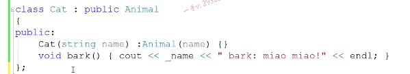

第七节课

大家好，欢迎继续收看石磊老师的视频课程啊，今天这节课呢，我们来讲啊。这个我们前边儿呢，做了很多的铺垫，对吧？我们讲了虚函数，讲了虚函数指针，虚函数表。还讲了这个静态绑定和动态绑定啊，我们铺垫了那么多的知识，其中也不乏出现了很多。啊，包括虚析构函数，

很多面试中啊，常问的一些问题。那我们今天呢来看一下面试中啊，只要是考oop，基本上都会问的一个问题。啊，让你解释多态。啊，那我们的问题就是如何解释多态？啊，如何解释多态我们今天呢？把这个多态。好好的来看一下啊。那首先大家要搞清楚

多态从字面意思上来理解的话就是多种多样的形态嘛。

对吧啊，应该是一个东西有多种多样的这个形态啊，多种多样的形态。好，那这个多态呢？它分了两种，一个是静态的多态。啊，一个是动态的多态。

## 静态的多态

### 函数重载

==静态的多态，静态指的是编译时期==啊。动态指的是运行时期。那也就是说，静态的多态，有什么东西是在编异时期，

它展现出来多种多样的形态呢？当然，有了==函数重载==。哎，函数重载我们有一组函数的重载。啊，会议一下，会议一下。那么。这个呢，就叫做函数的。重载对的吧啊，这个就叫做函数的重载在这里边，我函数的代码我就不写了啊。那么相当于呢？

它函数名字都是一个名字compare。啊，但是它展现出来很多不同的形态，这里边儿所谓的不不这个不同的形态，怎么去理解呢？就是他们。虽然函数名字叫compare，但是它们形参列表的这个类型或者个数不同啊，你像这俩就是类型不同，个数不同，你像这是两个整形参数，我们可以在这写三个整形参数。参数个数不同，对吧啊？但是呢，

最终调用的我们代码上调用的是那个函数。哎，我们在定边际的定点发现我用户传入的这个时差呢。两个舌参都是整形，那么边际就会选择在这里边去扣。这个函数compare int int这个函数，如果呢，用户传的是十点儿五二十点儿五，也就是传的都是double类型的浮点数。那么在这里边，它就会匹配这个函数的调用。啊，一个函数名展现出来的不同的形态啊，函数重载，那么最终定的是哪个函数这个东西呢？

是在编译阶段就确定好的啊，在它在。==编译阶段==。就确定好。调用的函数版本。这个也是一样。在编译阶段就已经确定好了啊，就已经确定好了。okay吧，所以呢啊，所以呢，我们把这个函数的重载呢，称作静态的动态。还有没？

### 模板

当然还有了，

这是==模板==了，当然这里边儿模板呢，包括==函数的模板和类模板==。是不是嗯？当然写模板，我们是干什么用的？写模板模板里边呢？可以定义模板参数对吧？尤其是定义模板类型参数啊。那么，我们可以用模板写一套代码，然后用之任何类型都可以。啊，我们想用于哪个类型？用哪个类型呢？

从模板去实例化一下就行了。对了吧啊，用哪用于哪个类型？用这个类型从模板实例画一下就可以了。那我们回忆一下啊，回忆一下，回忆一下，比如说我们还拿这个来举例子吧。type na met class.呃，不是class啊，是布尔值compare。ta.TB好不好代码一样，我不写了啊。

d有用的时候呢嗯，我们编辑发现呢，我们用户传的是两个整数。诶，那编译器呢？就会去原模板里边儿。啊，拿整数。去怎么样啊？实例化一个。compare int函数出来。如果我们这样调用。这里边儿一列的是函数的，函数的实参推演还记着吧，用double类型实例化一个。

嗯。专门处理double类型的，看我们培养函数出来。对吧啊，进行调用，那这个实例化模板的实例化啊，模板的实例化到底发生在什么阶段呢？别音阶段还是运行阶段？肯定是边缘阶段了，边缘阶段实例化产生处理某个类型的函数以后呢？这个函数呢才有。进行编译嘛，对吧？==所以这个模板呢，也是编译时期的多态==啊，

看起来就一个函数。但是它可以用之任何类型，只要你用相应的类型进行一个实例化就可以了啊，你没有实例化，人家对于函数模板来说呢？还可以进行实参的类型推演，对不对啊？

==所以这都叫做静态的多态。在ci加里边啊，就是函数模板和承载。函数重载和模板啊，模板里边儿有函数模板类模板啊，都属于模板。都体现了这么一个静态的多态==。好的吧，

## 动态的多态：

那动态的多态啊，动态的多态，那我们。其实呢，让解释多态啊，其根本的重点也就是在解释动态的多态啊，动态多态。那么，我们先给出这个定义，因为我们前边呢，我们也学习了啊，多态的这个底层的这个技术原理啊。那我们这里边儿直接给出定义。动态的多态是什么意思呢？

就是在继承结构中。基类指针或者是引用啊，或者引用指向。啊，指向派生类对象。哎，基类指针指向派生类对象啊，那通过该指针或者是引用。调用。啊，调用。同名。覆盖方法，也就是我们所说的虚函数嘛。

是不是啊？这个基类里边有一虚函数，

然后派生类呢？对这个函数进行了重写。明白吧啊，通过该指针调用同名覆盖方法啊，调用覆盖方法，这里边我们所说的派生类对象，我们之前呢只。在举例子中，只有一个基类base啊，只有一个派生类derive，是不是啊？我们可能还看不出来。我们这个多态的好处。我们先给出定义，一会儿我们来通过具体的实例呢，

再来研究一下。多态以及我们给出多态的好处是什么？对吧啊？

那么在继承结构中，基类指针指向派生类对象，然后通过该指针调用。同名覆盖方法啊，那么基类。基类指针指向哪个派生类对象？就会调用。哪个派生类对象的？覆盖方法。啊，称为。称为多态。

多态为什么呢？因为看起来代码都是一个什么基类指针。是不是调用同名覆盖方法呀？哎，看起来都是这么一个样子，那为什么它会展现出来不同的结果呢？

那就是因为我指针指向了不同的，是不是派生类对象啊啊？指向哪个派生类对象就会调用哪个派生类对象的？透明覆盖方法为什么？会这个样子呢。啊，之所以这样，因为呢？

## 底层  动态绑定

这个底层啊，

多态底层是通过动态绑定。来实现的。啊，一个指针看起来都是基类指针，对用这个虚函数也就是同名覆盖方法基类，有一个数虚函数，对吧？派生类呢，对这个方法进行了重写啊，那随着我基类指针指向不同的派生类对象，那么看起来是一样的代码，但是。随着基类指针指向不同的派生类对象，调用的就是相应派生类对象的方法，那怎么做到呢？

底层就是通过动态绑定实现。啊，因为底层呢，就这一段代码呢，是动态绑定它，首先基类指针指向谁，它就会访问。啊，谁的？是不是vfp tr啊？进而就继续访问。谁的是不是vf？table啊哎，基类指针访问哪个派生类对象的虚函数指针就进而访问了该派生类对象的虚函数表。呃，

那从虚函数表里边拿出来的。拿出来的当然是。相当然是对应的。派生类对象的。这个方法了。当然，调用的是对应的派生类对象的方法。没问题吧，==为什么它做到指向谁就能调用谁的方法==，==因为指向谁就是可以通过谁，那就是对应对象派生类对象的对象头的四个字节呢==？==虚函数指针来访问呢，派生类对象呢啊==，==它的虚函数表当然取出来的就是它的虚函数啦==。==进行调用了==。

没问题吧，这就是我们所说的动态的多态啊，在继承结构中，基类指针指向派生类对象。通过该指针调用同名覆盖方法，基类指针指向哪个派生类对象，就会调用哪个派生类对象的同名方法。成为多态

多态的地层呢？是由动态绑定来实现的，没有动态绑定。我们就谈不上动态多态的实现了，因为它不可能。做到基类指针指向哪个派生类对象就调用谁的方法啊？

## 举实例

好，那我们再来举个实例呢来。

理解，帮我们大家理解这么一段儿啊，内容啊，当我们在面试中被问到这个问题的时候呢，当我们再去回答。动态的多态的是这个，这个问题的时候啊，希望大家呢？呃，是真真正正的理解应用，而不是背出来的OK吧，好在这儿呢，我们来看一下同学们。在这里边儿，

### 基类   动物类

我想定一个animal类型啊animal类型，

表示动物的基类啊，在这里边儿，我想用字符串，所以呢？我需要包含string头文件啊。public.protect这里边呢，给了一个动物的这个名称。animal string name.name啊。好了，在这里边呢，我们所有动物呢，是不是都会？bark都会叫啊。

没问题吧，都会叫啊，都会叫。那光说动物，我不知道它怎么叫，所以我给它写了一大括号就空着了吧啊，这是我们动物的基类啊。这是动物的基类。好，我们从这个基类里边呢。

### 派生类 猫 

比如说先是我们cat猫。猫也有名称啊，对不对？所以我们从animal啊继承而来。

继承而来，以后呢？哎。我们也不用给猫提供呢，它特有的成员变量了啊，我们就直接给它提供相应的构造函数就可以了string。内通过调用基类的构造函数来初始化，从基类继承来的成员谁呀对？这个名称啊，对于我派生类来说，我需要把这个bark方法进行一个重写，因为现在我猫我知道我派生类是猫，所以在这里边儿呢。啊，我的。

name.bark喵喵啦。啊，我们猫都是这么叫的嘛，对不对啊？

### 派生类 狗

再来一个派生类dog。public.animal.public啊，那同样的dog给一个构造函数。哎，那么在这里边儿呢？通过调用基类的构造函数，初始化dog从animal继承来的这个name对不对？然后呢，

再把我们的这个bark方法呢去实现一下啊，bark方法实现一下。这个是。汪汪，是不是汪汪啊啊汪汪？好，我们可以再写一个，

### 派生类 猪

比如说是pick。啊。pick public.我们把这拷贝一下啊。啊，这个构造函数改成page的构造函数依然是通过构造调用基类的构造函数初始化，从基类继承来的内容的成员。因为基类的内母是保护的，

所以在配声类里边儿是可以直接访问的OK吧啊？这个是哼哼吧。没问题吧诶。因为呢，这以下是这个是动物的基类啊，以下是。这个动物实体类啊，动物实体类代表呢，每一个代表的都是一个具体的一个动物。我们现在的这个结构就是有一个基类。啊，有一个基类。有一个基类m。从这个基类呢？我们配生了几个？

配生了呀。三个对吧？分别是dog。还有这个cat。啊，还有。嗯，这个pig。是不是这样的呃？那么基类呢，有我们的什么呀？vrt vl.bark bark方法。然后我们所有的派生类呢，对于这个巴尔克呢，

我们都进行什么啦哎，都进行是不是重写啦？也就是提供了一个同名覆盖方法。

好，那我现在呢？定义这三个对象了啊，先是我们的cat啊，先是我们的cat cat。啊，我们给它一个名字啊，叫猫咪对吧？这是我们的猫咪，这是。dog dog，

比如说是二哈。是吧，撇ig take这比如说是我们的这个。佩奇啊。好，我给了三个动物。给了三个动物。

那我现在呢，想写这么一个方法啊，想写这么一个方法就是写一个全局的b方法。啊，全局的brock方法。这里边我有三种动物呢。是不是啊？提供API给别人使用。

啊来打印相应动物的这个bark的，这个结果那这里边儿有三个动物，我们理所当然。可能就实现成这么一个方法了。点bark。因为我这里边有三种动物呢。啊，这个是什么呀？dog。dog dog bark.这是我的这个pig。pig pig.啊，这个设计。这个设计那么这三个应该是属于一组重载的，

是不函数了啊？那么在这里边儿，我们就可以通过bark。CT.啊brk。dog点kp。撇h。没问题吧诶，把相应的我们的动物对象传进来。动物对象传起来。再来调用相应动物的这个bark方法。我们来看一下啊。好，这个都能够调用到吧？啊，

## 这样写也是动态绑定

猫咪喵喵二哈汪汪佩奇哼哼是不是啊？那么回想一下，==在这里边我们是通过。cat dog.来调用我们的这个==。bark方法同名覆盖方法是不是啊？

来看一下，在这里边儿还记不记得我们之前说的这是静态绑定还是动态绑定啊？

==动态绑定==call寄存器，为什么呀？==因为这里边我们用的是引用变量==，是不是==来调用的？虚函数==。

==要发生动态绑定，首先构造函数里边调用虚函数是不会发生动态绑定的==。

是不是啊？==其次呢？你用对象本身来调用这个虚函数是不会发生动态绑定的==，

==你只有用指针或者引用变量来调用我们虚函数才能发生动态绑定==。

但是呢，这样写呢，这个相当于就是我们给外部啊，给其他模块提供的这个API接口。但是呢，这个api接口不太好啊，为什么不太好？因为它不封闭呀啊，什么意思呢？就是我们在这儿呢。动物我们可以从animal继承以后添加更多的新的动物。

添加更多的新的动物，没有问题吧？啊，甚至呢？我们有可能由于需求的变更，我们现有的这些动物呢？我们可能要删除掉。不用那么，你看我们这一组API设计的时候呢，就不太好了，为什么不太好？随着你添加更多的派生类对象。那么，在这里边儿，我是不是因为你多了一个派生类，

==多了一个具体的一个动物，我就得在这里边儿再提供一个bark方法？是专门接收你那个新添加的动物的一个对象的引用啊==。对吧，==那如果你因为需求的更改啊，把现有的一个实体类动物类呢，你给删除了，那你把。比如说把dog删除了==，以后呢？那我相应的这个接口呢？专门接收dog对象的这个bug接口。是不是也应该删除掉啊？能明白吧，所以也就是说呢，

在这里边儿啊，这是我们根本就没有用到任何的一些设计啊。在这里边儿呢，我们下面的一组啊，巴尔克API呀。API接口无法做到啊，

### 会添加，和删除

API接口无法做到啊，我们软件设计的要求的。==**开闭原则**==。KB原则。也就是说，根本啊，这个达不到我们的高内聚以及低偶合，==也就是我们这一组API接口呢，是跟我们派生类啊，是仅仅偶合住的==。

你添加新的这个派生类，动物派生类，我就得添加新的API接口，你把现有的某一个动物派生类删除掉。我对应的一个API接口，我就得删除，这里边儿大家一定要这个软件设计呢，有六大原则啊，软件设计有这个设计。设计啊，有六大。这个原则啊，这个具体呢，其中之一就是开闭原则，这后边儿呢，

大家可以。留意下我后边呢课程的更新啊，会说到相关的这个一些内容==开辟原则说的是。对啊，修改关闭，====对扩展开放==啊。也就是说，当我们天就是对修改关闭，就是我需求更改的时候啊，原来的API接口不应该改变。不应该改变。我只扩展我新的代码就行了，比如说我现在增加一个动物类，我现在增加一个动物类，

我不应该对原来的API接口有所更改。这样是才是好的设计。

## 用基类的对象、引用 、指针   指向   派生类

我把现有的动物类删除了，我设计好了API接口，也不用改变，这才是好的设计。OK吧，但是我们说了，这是三个根本类型不同的派生类，我们就是想写一个bark。用什么类型来接收呢？对不对？其实我们绝对是可以把这八个这个接口进行合并，你看他们的。这个这个里边儿的实线是不是都一模一样啊？

它里边儿无非就是一种重载，因为接收的是不同的派生类对象嘛，所以我们现在把这东西全删了。用什么类型既能接收cat对象，又能接收dog对象，又能接收pig对象？有没有当然有了啊？当然有了，我们在前边学的啊，我们可以用统一的基类类型。基类类型。来接收派声类的对象对不对啊？

你用基类的指针也行，用基类的引用也可以在这里边儿大家看一下。

啊，我选择刚才用引用，我现在选择用一个基类的指针好吧，现在呢？啊，都一样，随便你用引用传的就是对象本身，你用指针呢，就要传对象的地址，因为引用会自动取。实参地址而指针呢，需要我们自己把地址是不是写上啊？大家来看啊，现在我们来看，只要你保证你的cat dog跟pig这三个类是从animal继承而来的，

那么我的基类指针就可以指向。你的派生类对象。在这儿你不管传任何派生类对象进来，我代码都是一样，用基类指针调用b方法。

编译阶段一看animal p的是animal animal，这个状语里边呢的这个bark是个什么方法呀？哎，是个虚函数，那就要进行动态绑定了，如果我一看animal里边的bark呢，是个普通函数，那就要静态绑定，那就永远调用的是animal bark bark。但是现在不是现在这里边，

==由于它bark是个虚函数，所以呢，就要动态绑定了。啊，叫动态绑定==。

==动态绑定是什么意思呢？就是它得先访问指针指向的对象的前四个字节。啊，那你分别让这个基类指针指向了三个不同的对象，那每一次呢？访问的是不是就这三个不同对象的，是不是虚函数表啊？分别取的就是它们各自的cat的虚函数。dog的虚函数以及pig的重写的这个bark虚函数就是这三个==。能不能理解？

啊，就是在这里边，我稍微画一下啊，第一次呢p指向了谁呀？p指向了cat。因为这里边bark的调用是动态绑定，所以它最终访问的就是cat的vf tab，那cat的vf tab里边。写的肯定是cat的，这个bark函数的是不地址吧啊，所以它在这个虚函数比较访问的肯定是cat的，这个bark函数的虚函数地址。第二次呢他。让这个激烈指针指向dog了，那指向dog对象，

那你最终呢？通过dog对象的前四个字节的虚函数指针，你肯定访问的是。dog的谁呀？vf table嘛，那dog的vf table肯定不会放别人的虚函数了，肯定放的是自己重写的虚函数的地址。所以我们调用了dog的这个。重写的bug方法对吧？第三次呢？我们指向了这个pig。那他肯定访问的是呢，我们pig这个类型的对应的虚函数表，它虚函数表里边放的肯定是pig的。bug方法。

大家再考虑一下，如果我现在增加新的派生类。太生类型的话我。API接口用不用增加新的API接口啊？不用。不用，我只需要呢，从animal继承而来，然后重写好Mark方法就行，这里边儿进行动态绑定，一定会访问到我的虚函数表。你访问到我的虚函数表，就会访问到我的虚函数啊，就会访问调用到我的虚函数。没问题吧，

这个就是我们所说的多肽，这个API接口呢，那真的确实对修改关闭就扩张开放了。

啊，你要扩展新的派生类，你随便扩展吧，随便添加派生类的代码。但是我的这个API接口呢，是永远都不会再更改的，不会增加，也不会减少。好吧，它就是非常通用的代码啊，通用的就代码，我们API接口跟我们的这个派生类的类的个数呢，

我们就。d偶合了，不会偶合了，不会说你增加一个派生位，我就要增加一个接口。对不对啊？这是肯定的，这是肯定的，通过这么一个实例就给大家解释了一下，我们刚才所说的动态的多态啊

## 多态的实现

==基类指针，我们这里边用animal指向了。三个cat dog pig是吧==？我们基类指针呢？调用的都是刚才那调用的都是b方法，

然后==指针指向哪个对象==？  ==指向哪个动物就会调用相应动物的这个bark方法==，

==底层通过是是通过动态绑定实现啊==，因为我是==基类指针，指向谁==，==就能访问谁的虚函数表==，

==进而访问谁的虚函数==。好了，这个应该是说的已已经说的很清楚了啊，

好了，这个应该是说的已已经说的很清楚了啊，同学们，如果还不理解的话呢呃，可以呢。再把之前几节课的这个录屏呢，再好好的看一下啊，视频再好好的看一下。

好好的理解一下这个动态绑定，以及这个多态。所以多肽的这个概念呢，我们就列到这里边儿了好吧啊，多肽我们就解释到这里，那这是我们对于多肽这个如何解释多肽这个问题的一个。完整的这么一个回答。

## 继承的好处

### 代码的复用

说到这儿了，我们最后再来给出来啊，给出来。我们在继承的第一次课的时候，我们说继承的。好处或者继承的这个本质是什么啊？是什么对不对？我们给它说了一个。

就是继承的好处，我们说继承的好处就是意义，对吧？==一个继承它可以做代码的是不是复用==啊？哎，我派生了。啊，我==派生类如果想添加成员，而这些成员呢，跟我们所谓的基类的成员是一样，那我们就不用给派生类新添加了，我们直接让派生类从基类继承而来==。就可以把基类的那些现有的成员直接复用起来了，

这是继承的好处之一啊。

### 多态

那么，继承的意义的第二个就是。在基类中。啊，提供统一的。虚函数接口啊，让派生类进行。重写对吧？然后就可以使用多肽了啊

什么意思呢？我们就可以用。基类指针指向不同的派生类对象。或者就像我们这里的例子，我就可以提供一个统一的。

接口啊，那么这个接口提供了以后呢？跟我们所有的派生类呢？就偶合开了，就偶合开了。啊，我们软件的设计呢？也相当于我这API接口呢？永远不用再改变你，想增加你需求，更改想增加派生类或者减少派生类。对于我现有的这个API，结果是没有任何的影响的，这就是我们用多肽的好处。对吧啊，

鸡肋哎，在鸡肋中给所有派生类。在激励中。给所有。派生类提供统一的是不是虚函数接口啊？哎，你是我你从我继承来了，那好，你把我这提供的虚函数重写一下。啊，你看你想怎么写这个虚函数，你写一下。我到时候指向你那个对象，我通过访问你的虚函数表就能调用到你自己重写的虚函数了。好吧，

这就是我们继承的这个好处，两两点好处。

## 设计模式的铺垫

至于呢，我们这个继承的应用多态的更这个更广泛的应用呢，它用在我们的这个设计模式当中啊，就是有关软件代码设计的东西啊，设计模式当中应用的也是非常非常的广泛的。这个后边儿在是在我的这个进阶课程中呢，会有专门模块儿讲解设计模式啊，到时候大家在讲解设计模式的时候会看到我们也在大量的去使用继承和多态。啊，好希望通过这一节课的讲解呢，大家对于多肽这个概念有一个非常深刻的认识。行，那我们这节课就到这里下节课，

我们再见。