什么类？这个设计成。**抽象类**。啊，抽象类。好，我们还是拿上节课呢，我们在讲多态的时候呢那个。事例就是动物的事例呢，我们拿出来给大家讲解一下啊，

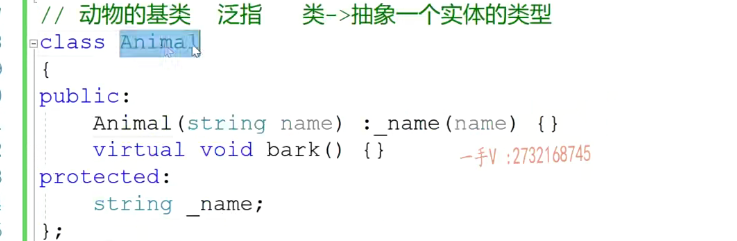

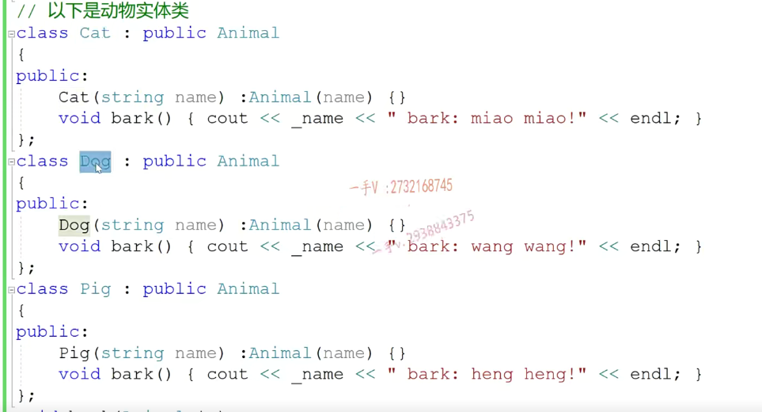

动物这个基类。在这里边儿，动物，在这里边儿动物animal本身是不是就是一个泛指啊？泛指。

我们最开始学面向对象的时候呢，我们。说过啊，写类是干嘛呢？==类是用来抽象一个实体的类型==。啊，它是抽象一个实体的类型。这当然是抽象，我们猫这个实体的类型。

dog当然抽象的是我们狗这个实体的类型，而配的就是我们猪这个实体的类型，对不对？但是我再怎么想我都想不通啊。==我们animal是用来抽象的一个实体的类型？==

最后，我们仔细的想一想啊，我==定义animal的初衷呢？定义animal的初衷。并不是为了让animal。并不是啊，并不是。并不是让animal。抽象某个实体的类型。==

并不是这样的，我定义animal的初衷，==绝对不是让animal去出现某个实体的类型OK吧，这不是我们的初衷。===

那作用是什么呢？首先呢，两个作用就是我们基类的好处，是不是首先定了一个string name？啊，让所有的。动物实体类。通过。通过继承animal直接复用，

是不是该？属性啊呃，

==那所有的动物尸体类通过继承animal直接复用该属性==。

==代码的复用==是不是？

第二点啊。给所有的配声类。保留统一的。覆盖接口。或者叫做==重写接口==。是不是哎，派生类可以重写，到时候我就可以用多多态了啊，多态了基类指针指向任意的派生类对象，调用透明覆盖方法指向谁就能够调用谁的方法。这样做的好处是可以让我们软件设计设计的更高，

==内聚低偶合==一点嘛。做到我们==软件设计的开辟原则==嘛，是不是啊？我们应用多态，目的就是这个

所以我们看啊，我们在这里边定义animal呢，就初衷本身就不是为了让animal去抽象某个实体类型。所以在这里边，我们括号也空着呢。我就光说一个动物，谁也不知道我们所说的是什么动物，那当然我们不知道它怎么叫的，对吧？

所以这个基类。里边儿的这个方法就是给所有派生类保留的这个统一的，这个重写接口啊，我们一般呢是不知道。它是怎么写的？所以我们干脆直接给它写个等于零。啊，没问题吧，因为基类都是这个样子的。那这个叫什么呀？这个就叫纯虚函数了

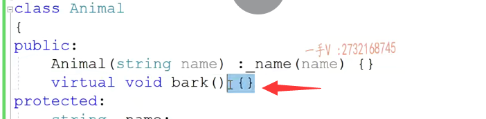

我们一般呢是不知道。它是怎么写的？所以我们干脆直接给它写个等于零。啊，没问题吧，因为基类都是这个样子的。那这个叫什么呀？这个就叫纯虚函数了。拥有纯虚函数的类啊，在这里边我们写到上边了啊。拥有纯虚函数的力。叫做抽象类啊，

抽象类    纯虚函数函数

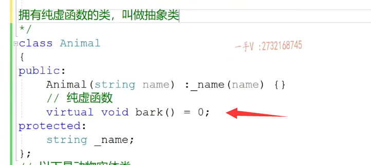

抽象抽象就是它并不代表某一个实体抽象出来的。那么在这里边呢animal。no，no，no，这是no的。啊，就是说什么意思呢？抽象类不能？不能在。实例化对象的，也就是说抽象类不能再定义对象了。

但是可以定义。指针和引用变量。啊，这一点啊，非常明确，这一点非常明确，抽象类不能再实例化对象了，但是可以定义指针和引用变量。okay了吧啊，这一点搞清楚，这一点搞清楚。啊，==因为还还要使用多肽的嘛，多肽就得用引用基类，引用指针。==呃，

#### 多态！

==这个指针或者引用变量来指向派生类对象，并用同名覆盖方法==嘛，是不是啊

所以呢？抽象类跟普通类的区别是什么？就是抽象类的。啊，一般呢，不是用来抽这个抽象某一个实体类型。做的事情就这两个。==从语法上来说呢，抽象类是不能实例化对象==的。啊，但是==可以定义指针的引用变量==，而==普通类呢，定义指针也行，引用变量也行，实例化对象==也可以。

我们一般把什么类设计成抽象类呀？当然是基类了啊，当然是基类了。基类呢，并不是为了实例这个抽象，某个实体类型而存在啊，它的含义就是这两个，所以呢。我们对于这个。基类里边的方法呢，都给它实现成纯虚函数得了，就是给所有派生类保留的，

这统一结构直接给它实现成纯虚函数。就可以了啊，就可以了。不用提供实践，我们也不知道该怎么实现。

好吧啊，这个大家注意一下啊，这就是我们抽象类抽象类。的这个好处。大家理解一下啊，理解一下。

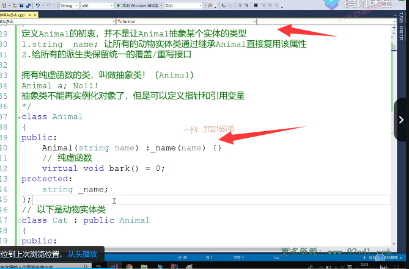

## 举个例子

好，那么这是一个例子啊，这是一个例子，我们再来举一个实际的例子呢？

啊，来看一下这个所谓的抽象类啊，抽象类。第二个例子。假如说呢，我们现在啊，要给这个，比如说我们现在给汽车啊，汽车的这个中央电脑啊。写一个应用程序的模块儿啊，这个模块儿干什么呢？就是给我们用户显示啊，给车主显示。在当前油量情况下，我们汽车呢？

还能跑多少距离？啊，跑多少距离哎，在当前油量比如说剩。几升油，几升油，几升油还能跑多少公里？一般我们汽车的行车电脑都有这么一个功能，是不是每一个汽车？啊，百公里的耗油量是不一样的，百公里的耗油量是不一样的，所以呢，在剩余呢，一些油量甚至同样油油量的情况下呢，

不同汽车。它还能够跑的这个公里数，它也是不同的。okay了吧。好，那在这里边，我们来看一下啊。

我们先设计一个汽车的基类。在这个基类里边呢。所以呢，我光说汽车，我们不知道这代表的是哪个实体，它也不是用来抽象某个实体类型。对了吧啊。啊，

在这里边呢，给我们汽车一个属性，也是我们汽车的这个。内okay吧，汽车内。好，那在这里边呢？呃，我们给出来这个构造函数。把那给那初始化一下。给内蒙做一个初始化啊，用户传传传参给汽车呢，一个名字啊，一个名字。那在这里边呢，

我们还得写这么样的一个东西就是get。get left miles.这是干嘛呢？这个是获取什么东西呀？获取这个汽车在。汽车胜于。油量。还能。跑的还能跑的。公里数啊，还能跑的就公里数。没问题吧啊，过去汽车剩余油量。才能跑的这个公里数啊。那么，

我们再添加啊，再添加一个这个函数get left miles来专门做这件事情。那么，不管你是哪个汽车啊？不管你是哪个汽车，你计算这个剩余油量还能跑到公里数。是不是应该就是。你就是一升油，能跑多少公里？哎，一升油能跑多少公里？一升能跑多少公里？再乘以什么？再乘以你剩余的是不是这个油量啊？是不是就是我们剩余油量还能跑的公里数啊？

 

比如说呢，在这你这个益生油。比如说一升油，哎，我们能跑十公里。啊，那么在这里边呢？我们乘以剩余的这个油量啊，剩余的油量还有。是不是就能得到我这个汽车还能跑的？是不是这个公里数啊？没有问题吧啊。在这里边儿，我们可以通过我们get left mails接收一个我们汽车当前剩余的这个油量。

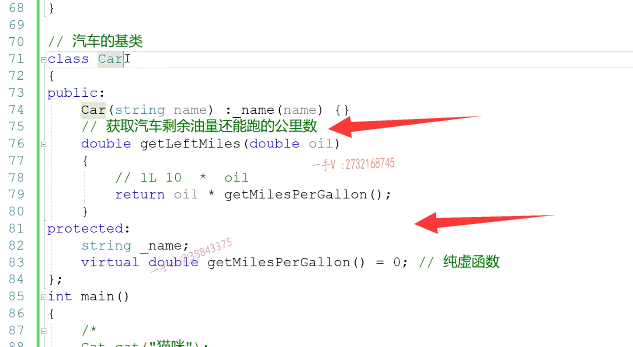

啊，但是每一个汽车不同的汽车啊，一升油跑的公里数，它是不同的呀。是不是我现在在写汽车机类的时候呢？我get left miles，我知道是用一升油跑的，这个公里数乘以我剩下的油量就是还能。升油量还能跑的这个公里数，但是一升油能跑多少公里？不同的汽车，它的性能不一样，所以这个值也不一样。是吧，所以在这里边儿，我只能啊。

写这么一个东西了get。miles.per啊，我们一生有是吧啊，在这里边生在这个不能写拼音，哈哈。大家那在这里边，我写个。加仑吧，好不好啊？因为这个单词还是比较简单的啊，我们把它当做一个生的概念吧，好吧，在这里边就是。一加轮游啊，

能跑的这个公里数，这个是对于我们不同汽车来说呢啊。它的这个是不一样的。不一样，而且这个是不用给我们这个外部的这个接口呃，给外部直接电用的，外部直接电用这个函数就行了。所以我们把它设计成一个保护，就是我派生类能够去访问，但是外部无法访问的，对吧？很明显。这个肯定是一个虚函数。因为呢，它需要在指定的这个派生类啊，

具体的派生呢，你到底是一辆什么样的汽车，你是什么样的性能？我才能知道你。一加仑能跑多少公里？所以我单单说一个车卡尔，我是不知道。这个参数是什么？所以在这里边，我只能把它写成一个纯虚函数。

这个类就是一个抽象类了啊，克尔现在就是一个抽象类。抽象类不能实例化对象，它也不用实例化对象，对吧啊？只要可以定义指针。和引用变量就行了。

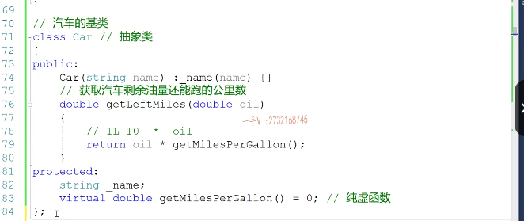

奔驰对吧啊？这奔驰呢，我们从卡尔继承而来。cr，我们提供了一个这奔驰呢。提供了一个构造函数。

继承了鸡肋的。name通过构造函数呢，给积累继承来的这个name初始化一下，当然需要重写这个方法。没问题吧？对于奔驰汽车，我们肯定是因为这已经指定实体了嘛，我肯定知道是什么样的车。知道什么样的车，我就知道它一加仑能跑多少公里了。没问题吧，假如说他一家人能跑20公里，我就给他return 20。

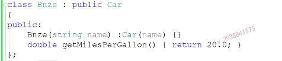

啊，在这还有，

比如说是奥迪。啊。bba的车嘛，是吧？哎，我们把这个拷贝一下。啊，那比如说呢？奥迪呢？性能稍微弱一点啊。对吧啊，那就是一家人跑18公里。okay啊

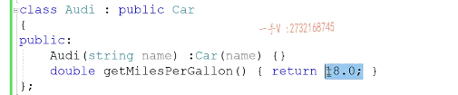

再来写一个。BMW.

宝马啊，它一家人能跑19公里啊，这就是我们派生的一种具体实体，你肯定去知道它的一个。

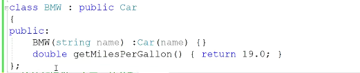

详细的信息了，好了吧？然后现在呢？啊，现在呢？我们就可以统一的给外部提供一个接口啊，提供一个接口。给外部提供一个统一的。获取汽车。啊，这个胜于。

路程数。路程数的。apl.show car.left miles在这里边儿，我可以通过坎儿来一个引用吧，刚才写animal的时候，我用的是指针对吧现在。啊，我们直接return car在这里边儿的什么方法就可以了呢？啊car不是cat啊car。get left miles这个方法。嗯，在这里边，我们给出来。

三个啊，三个对象。这个car c1这个是什么呀？奔驰是不是udi？a1这个是c吧啊，这个是a。对吧？啊，应该这个是b，是不是这个是奥迪？然后呢？这个是BMW，这个是这个也是是也是b了。啊，这个给b1这个给b2吧好吧，

这个是宝马。那在这里边呢，我们就传入了b1。同样的接口是吧？你直接外部用的时候你就直接用吧a。然后是b2。啊，好的吧。我们来看一下，在这里边儿，这是个引用变量啊，是类型是car，我在car里边儿看一下这个get left mails啊，这个是个普通函数，所以在这里边儿，

这是一个。==静态绑定调用的永远是我们car里边的基类==，里边的。

### 因为基类的不是虚函数

### 但是调用了虚函数

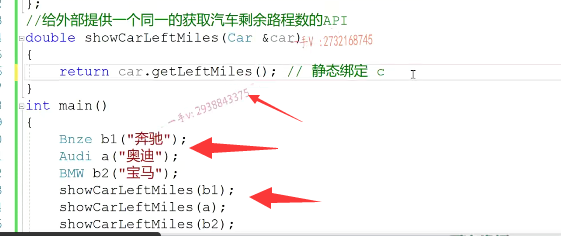

靠鸡肋这边的。get left miles函数。好了吧，但是呢，在积累的这个方法里边。这儿怎么调用的？这是用this指针调用的对的吧啊，那么这是一个什么函数啊啊，==这是一个虚函数，所以在这儿就动态绑定了==。这个基类指针指向不同的派生类对象，就会访问不同派生类对象的。

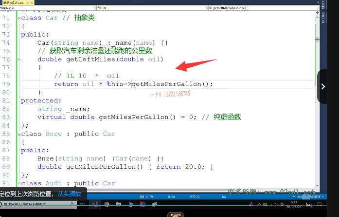

趋函数表。啊，就==访问了派生类重写的这个get mails per gallon这么一个函数==。

画的吧啊行，那在这里边呢，我们在这直接show一下吧啊。嗯，来看看，在这我们直接Show一下show这个是。car car的这个get name好吧，给外部提供一个接口吧啊叫string。get name.这是一个const方法。retain刚name。啊常方法，

因为只读接口哈。这是这个汽车啊。left miles.啊left miles，left miles是多少呢？啊get left miles。打印一下。好吧，比如说我们打印一下一个公理，打印一下一个公理啊，打印一下这么一个公理。当然，在这里边儿呢，我们不同的这个汽车可能剩余的这个油量是不是也不一样啊啊？剩余的这个油量也不一样。

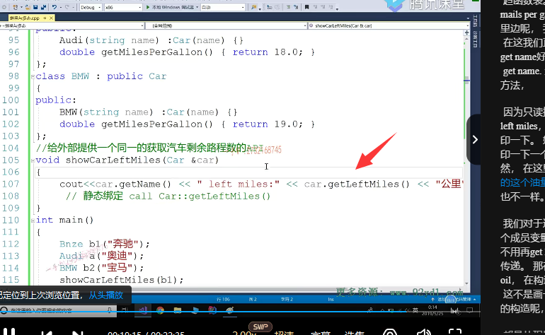

我们对于这个油量呢，我们也可以通过添加这么一个成员变量啊，我们。把这个油量添加到这里，就不用再get left left mills里边通过这个函数的参数进行传递。那在这儿呢，我们也就是给它再加一个参数oil，在构造函数初始化列表中。哎，把这个哎呦，这不是画一下okay吧，那现在所有的这个。派生类的构造呢，也得加这个啦。啊，

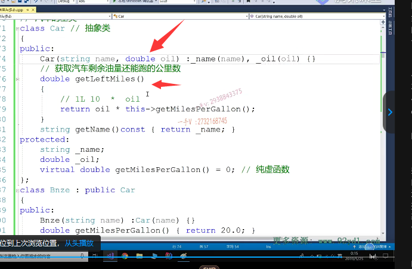

都是从积累继承来的，是不是啊？直接通过调用基类的构造函数来做一个初始化就可以了。哎呀。没问题吧，这里边有两个变量啊，所有的派生类都从这个基类看，这个复用了name跟oil。在这里边儿直接oil×get life miles per gallon就行了

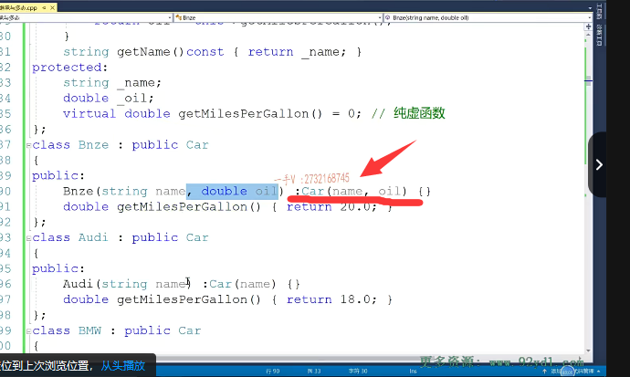

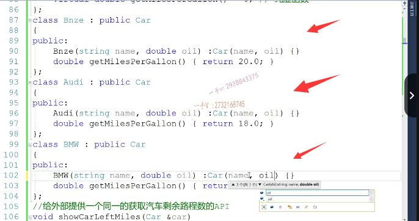

这是奔驰，奔驰剩了。20升油了啊。奥迪，宝马，我们都先写它们剩余的油量是相同的，

我们看看打印剩余的这个公里数是否是相同啊？

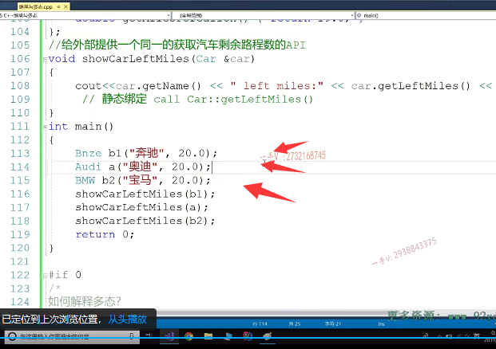

好哎呦，这边打印完了，我们应该加个回车，是不是要不然呢？都打印到一块儿了。不好不好看啊。运行哎，在这里边呢，大家来看一下。

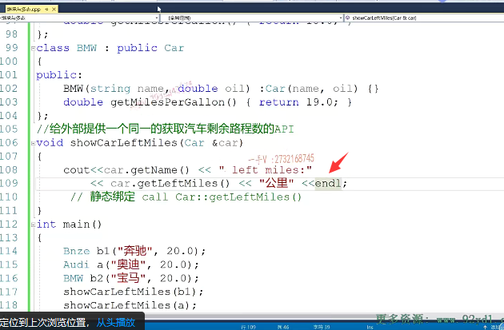

运行哎，在这里边呢，大家来看一下。虽然呢，他们剩余的油量是一样的，但是呢。最终打印出来行车电脑打印出来的公里数不一样，因为呢啊，

在这儿定的时候。这里发生动态绑定了。动态绑定了。对吧，几类指针指向哪个派生类对象诶？指向哪个派生类对象？就会调用，就会访问哪个派生类的虚函数表，进而调用它重写的虚函数。好的吧，奔驰剩400公里，奥迪剩360公里，宝马剩380公里。在这里边儿，我们又把这car设计成了一个抽象类，

一般把基类呢，我们都会设计成抽象类八。给所有派生类保留的这个接口呢，都设计成纯虚函数，不用提供实线啊，不用提供实线了

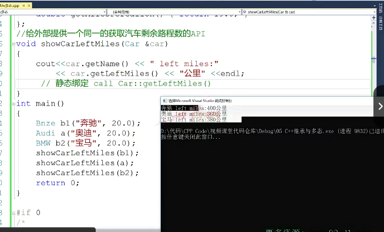

好通过本节课的这个讲解，希望大家对于抽象类的这个理解呢，更深刻一点啊呃，后面呢，我们再设计一些代码，用oop设计代码的时候呢。做项目的时候呢，我们鸡肋看考虑一下是否在保留给派生类保留统一接口的时候，把这些接口呢？

都实现成我们的这个纯虚函数啊，把我们基类设计成这个抽象类。没问题吧，抽象类好，那我们这节课就到这里下节课，我们再见。

