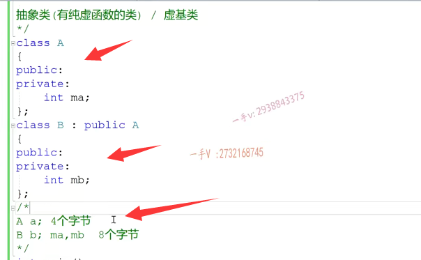

第一节课

## 多重继承

大家好，欢迎继续收看石磊老师的视频课程啊。呃。之前的几节课呢，我们把CA加继承跟多态有关，单继承方面的这个内容啊，我们。在校招中能遇见的这个问题啊，不管是笔试还是面试，能问到的这个问题以及核心重点给大家在课程中啊。都已经做了一个介绍了啊，做了一个介绍了。那么，从这几个开始呢？我们开始讲一下啊C加加里边的这个多重继承啊，

多重继承？那多重继承有什么好处呢啊？最浅显的好处呢？就是什么呀？啊，就是继承的本质本身就是代码的复用那么多重继承，相当于这个配生类。唉，一个派生类，一个派生类有多个基类了啊，就像这个样子。c既从a继承，又从b继承啊，这样一来呢，我们就说呢。

c是从a跟b多继承而来。c有两个积累a和b。那多重继承呢？那就是复用的代码呢？就更多了，对吧？c呢？一下子就可以把a跟b的成员呢？都给它继承过来复用起来。但是呢，多重聚成只有好处没有坏处吗？它当然呢，有不好的地方啊，有坑的地方，那这个坑是什么呢？

我们接下来的几节课呢？就把C加加里边多重继承相关的问题先说一下

那么，这一小节课呢？我们主要先讲一下这个虚机类。啊，我们给我们后边讲多重继承呢，先做一个知识上的这个铺垫啊，知识上的铺垫。

首先呢，我们今天说的这个学籍类跟我们之前说的这个抽象类啊，这个名字要区分开，不要混为一谈啊，不要混为一谈。什么叫抽象类？

抽象类是有啊，纯虚函数的类。啊，它拥有纯虚函数的类呢，就叫做这个抽象类啊，抽象类。那蓄积类是什么呢？我们来看一个事例

这里边呢，我来先定了定义了一个。我们跟前面的这个名字区分一下吧啊，那么这个我们不叫贝斯了，叫做类a叫做类a。在这儿呢，我们给它定义上一个。

成员变量吧啊，叫做MA。叫做MA。啊，在这儿呢，我们先不写什么成员方法啊，在这儿我们再定一个。类b从a继承过来啊。我们先把这个公有的留到这儿，那么类b呢，就是这个派生类也有自己的成员变量，比如说它叫做MB。对吧MB啊。那么，我们来分析一下这个继承关系啊类a有一个整型的成员变量。

对吧，那么它定义的这个对象呢？就是这样四个字节。类b定义的对象呢？它不仅从ag成为了MA，还有自己的MB，所以呢，类b产生的对象呢，是占八个字节。是整八个字节。好的吧。呃，那。

## virtual 可以修饰成员方法和 继承方式

我们来看一下啊，我们来看一下。我们现在这个继承方式里边啊，在这个派生类从a继承过来，这个继承方式里边在这个访问限定符的前边或者后边，比如说我写的前边吧。我加了一个virtual。呃，大家可以看到这个virtual呢，有两个修饰的地方啊，==第一个就是。修饰成员方法==。是==虚函数==对吧？==第二个呢就是。可以修饰啊，继承方式==。

是什么继承啊？是虚继承啊，是虚继承。==被虚继承的类就称作呢虚基类==。那么，==在这里边基类a被这个派生类b虚继承了==，==所以在这里边儿a呢，就被称作虚基类==。这是我们虚基类的定义啊，注意一下虚基类和抽象类，它们是不同的啊，它们是不同的，

所以我们在。表述问题的时候呢，以及考虑问题，这个分析问题的时候呢，不要把这两个词混为一谈。那么，我们为什么在这里边引出来这个虚基类对吧？那它跟我们多重继承又有什么关系啊？用来解决什么问题呢？我们。慢慢来看一下。

首先在这里边儿，我打开工具啊，命令提示符。大家来看一下我的代码，

在D盘。啊，然后呢？我切到我这个路径里边来。cdc l.继承于多肽的cpp杠第1 report single class layout，这是我们的b。呃，我们先来看一下这个a吧，好不好？a啊。这个打印的信息呢？比较多啊，打印的信息比较多，但是呢，

对于我们来说感兴趣的。就在这呢。大家来看啊。

呃，我们先来看一下这个a吧，好不好？a啊。这个打印的信息呢？比较多啊，打印的信息比较多，但是呢，

对于我们来说感兴趣的。就在这呢。大家来看啊。大家看这个积累a现在被虚继承了，它的这个内存布局呃，没这个没有什么变化。a本身是不是没有什么变化呀？对它还是四个字节，

