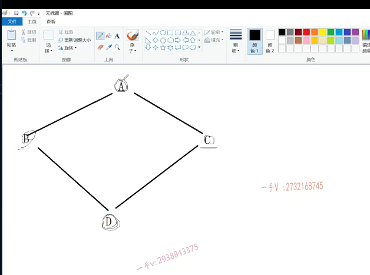
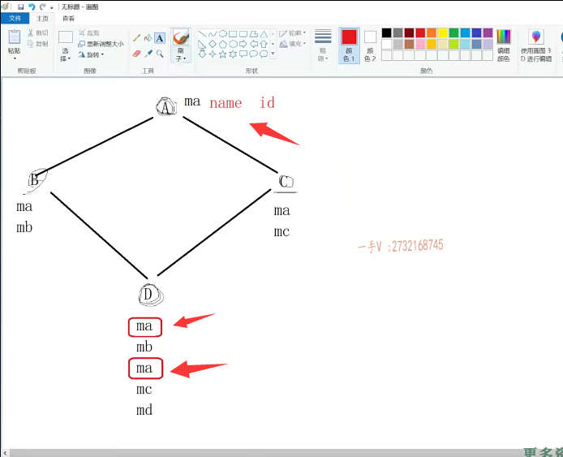
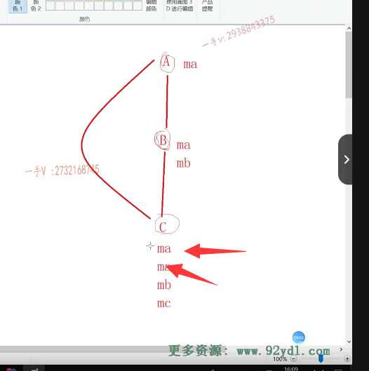

第二节课

大家好，欢迎继续收看石磊老师的视频课程啊。上一节呢，我们把这个。需继承啊，给大家讲了一下啊，那么这一节课呢，我们来讲一下，我们之前说的这个C加加的这个多重继承啊？多重聚成有好处。啊，可以复用多个基类的代码到我们派生类当中，对吧？但是呢，它有什么不好的地方呢？

我们来看一下这个多重继承里边儿一个非常经典的问题就是。

菱形啊，继承的问题。那么，什么是菱形继承的问题呢？在这儿，我们把这个画图板呢？在这，我们来给大家画一下啊。这个就是我们所谓的菱形继承啊，菱形继承。这个就是所谓的菱形集成。集成的这个样子，画出来像个菱形嘛，对吧？

a在这里边。啊b跟c的基类就是a。b从a单继承而来。b只有一个基类，就是AC从a也是单继承而来。c有一个基类，也叫做a。但是呢d是从b和c多继承而来的，因为d呢有两个基类，分别是b。和c。我们可以把a呢称作是d的间接的基类啊，间接的基类，也就是说呢。最终在d里边儿呢啊，

也有a的数据，那么它是通过继承b间接从a继承来的。对吧，==所以我们也说a是d的间接基类==

假设在a里边儿有MA这样的一个成员变量啊b，从a继承上来，那从a继承来了MA还有自己的MB。c也从MA继承继承了a的MA属性，跟自己的MC属性，现在呢？d从b跟c多继承而来，那么从b继承来了MA和MB。从c继承来了MA和mcm d，当然有自己的属性。很明显，

我们可以看到，问题在这里边儿，我们的这个派生类d有间接积累这个a。多份的这个数据。这在我们软件设计上肯定是有问题的，假如说呢，这个MA表示名字，那我们不可能在派生类地里边儿，它有两个名字，对吧？或者呢，这个MA代表身份ID。啊，这是我们设计上的一些问题。

是吧，这就是我们所谓的菱形继承，

当然呢，不仅仅菱形继承，还有我们这种继承a。BC.b从a是单一继承而来。c呢有一个基类b，但是呢，它同时还从谁继承而来呀？对他同时还从a继承人来，所以呢，a到b这里边是单继承b，只有一个积累，就是a。

那么c呢，是多继承，因为它有一个积累b，还有一个积累a。在这里边儿，假设MA啊，假设MA是我们类a的一个属性，那么b呢，从a继承而来b有自己的MA还有。自己的属性MB。对吧，那么c呢c从a因为他是从a直接继承人，他从a可以继承为MA。他也从b继承而来了，他也他从b继承了MA和MB，

当然他有自己的MC，很明显在这里边儿同样的问题啊，同样的问题。c里边儿呢，不可能有两个啊，有两个相同意义的属性，比如说名字，甚至比如说性别。那么不可能有两个性别对吧啊，所以这样的继承呢，我们在多继承里边儿，它都是有问题的，==多继承。它有好处，一下子可以复用这么多代码，==

==但是相对而来呢，它给我们带来了很多的问题==，所以在我们c++的这个开源代码上啊，在C++的这个。开源代码上，其实呢，我们是很少见到这个多重继承的这么一些设计的啊，包括在我们C++这个。标准库啊，==标准库里面我们也很少见到==呢，有这种多重继承啊，有多重继承这样的软件设计存在，有的话也是数量是非常非常少。甚至像我们在其他的oop语言，==像JAVA里边儿呢，它直接就去掉了多重继承这么一个东西啊==。

说明呢，多重继承呢？我们可以用更好的一些软件设计软件架构来这个重新。去设计我们的软件啊，去重新设计我们软件并不是说呢，解决某一类问题的时候多重继承是必须的啊。

只能采用这样的设计。对吧啊，所以呢，当我们在写一个软件项目的时候呢，如果可以，我们尽量啊，

要避开多重继承，因为多重继承不知道什么时候。你把它设计成了一个菱形继承，或者是这种半圆形的继承，那它就要出现问题了。是不是那如果说是项目项目已经启动，我们很多的一个基础类库呢？他已经写好了，我们在写派生类的时候呢，没有办法，我们做多重继承，当然在做多重继承的时候呢？你要注意，我们应该怎么写才能避免多重继承所出现的问题？好，

我们先给出呢，菱形继承的这个例子案例啊

