# C++四种类型转化方式

大家好，欢迎收看石磊老师的视频课程啊，那么今天这么一节课呢，我们主要来讲一下呢。这么一个问题C++提供C++语言啊，语言级别。提供的四种类型转换方式啊，可以将语言级别的。提供的四种类型转换方式啊，在C语言里边儿呢，我们进行类型强转的时候呢啊。经常呢，就是给。稍等一下，经常就是给我们的右边的这个类型呢。

给我们右边儿这个变量的，前边儿加一个小括号儿，再加一个类型，这表示类型强转，把右边儿的这个类型呢，强转成左边儿的这个类型。

对的吧，那么在C++里边儿呢？==对于这个类型强转呢啊，专门提供了语言级别的方式的类型转换，使用起来更加的清晰，而且杜绝了一些安全性的这些错误==啊。那么，我们在这分别来看一下是哪四种？

它提供了cast cast，

还有static cast，还有。winter而已，我们在这儿写一下啊，interpret。re in trr enter print cast就是这个啊，renter print cast还有一个。dynamic.啊，我们拼computer对不对呃？dynamic cast。就这四种类型转换啊，四种类型转换，我们先给它一个简单的一个定义啊，先给一个简单定义，

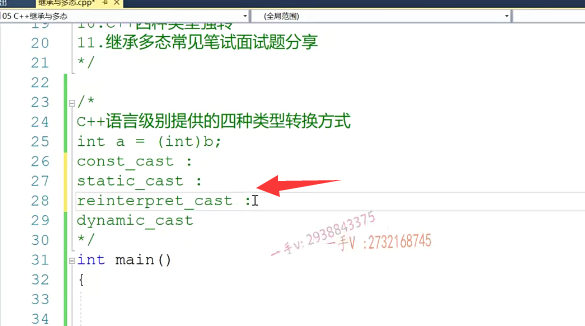

然后分别我们来看一下。const cast从这个。名字上我们就能看出来啊，就能看出来这是一个。把常量属性。去掉或者是去掉常量属属性的一个类型转换。

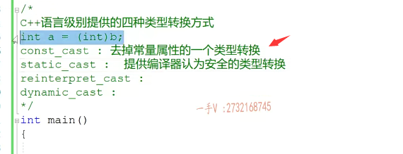

好的吧，这个是一个什么样子的类型转换呢？static静态的一个类型转换对吧？就比我们C语言级别的这个类型转换更安全一点。啊，能够就是。呃，能够就应该是提供啊，提供编译器。认为。安全的啊，类型转换。啊，提供编辑级别认为的安全的这个类型转类型转换，我们一会儿来举例子看一下啊，到底跟我们C语言里边儿类型强转有什么不同的地方啊？有什么不同的地方？

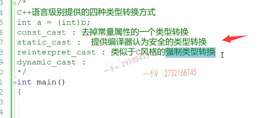

那么，renter pred cast呢？这事儿就是。哎，类似于啊，它提供的类型种就是类似于。c风格的强制类型转换啊，

强制类型转换。那也就是说呢。他呢，看不上什么安全啊，看不上什么安全在C++里边儿呢，你如果非得要做。编译进入为不安全的类型转换的话呢，那么你用static cast是编译不过的，那我们如果非得做这样的操作，我们可以用。但namely cast呢主主要主要用在啊，主要用在我们继承结构中。啊，可以支持rtti类型识别的。转换。

啊。的上下转换对吧？一会儿我们也来举例子呢，来进行一个说明啊，来进行一个说明。那C++语言级别提供的四种类型转换呢？就是。这四种cast cast static cast renter print cast跟dynamic cast，这是语言级别提供的。

那我们一个一个看一下，首先我们看第一个concast。在这儿我们定一个常量，我们想定一个指针呢，去指向呢，这个常量这是不可能的，

我们前面也说过对吧？那么，大家可以用我们c风格的这个方式呢？进行一个类型转换啊，这个是没有问题的。那么我们也可以用C++风格的const。cast.在这里边呢。我们想把它转成什么类型呢？就给它尖括号儿里边儿写什么类型啊？那然后在这里边儿括号儿？那么，大家可以把这个看成啊，大家可以把这个看成一个模板，对吧？

大家可以把这个看成一个模板，在这个模板里边呢我们。就是类模板啊，在这个模板里边，我们提供的这个类型呢，就是一个int星，对吧啊，我们这就是我们要的这个表达式啊，表达式。

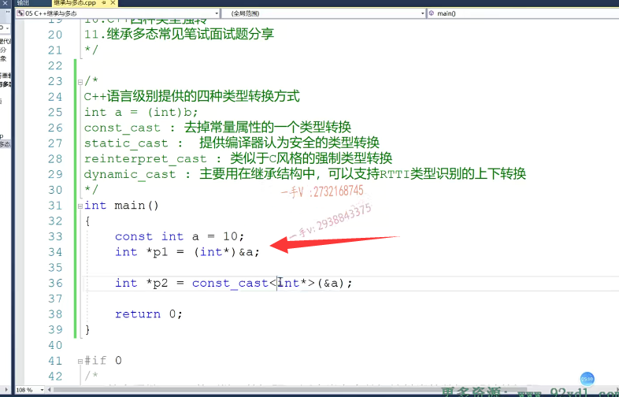

那本身取地址呢，是一个const性的行为。对吧，在这里边儿，我们要把它强转成int型啊，其实呢？

这个类型转换都是语言级别的，我们是无法查看它源码实现啊，是语言级别提供的那。在这里边儿，我们打个断点呢，进行一个调试啊，进行一个调试。

大家我看一下这个汇编上的这个打印啊，大家会发现啊，你第一个指针用c的类型强转了，跟我们用C++的这个类型，这这个去掉常量属性，这个类型强转。其实所生成的指令是一模一样的，并没有在指令上有什么不同的区别啊，

并没有做更多的事情，并没有做更多的事情。它底层呢，是一模一样的啊，那也就是说呢，在转换成我们汇编指令以后是一模一样的，

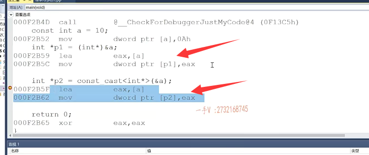

但是呢，在转换变成汇编指令之前，在我们编译阶段。啊，这个就有所不同了。你比如说你在这里边。你可以随意的用c的这个类型转换，把这个int型转成一个叉型。啊，

甚至呢，你把它转成一个类类型更大的一个double型，很明显这个指针已经引用。是不是访问的内存要大于四个字节呀？嗯，我们来看一下它。这个呢，操作是否能够通过大家来看这个编译是没有问题的，对吧？

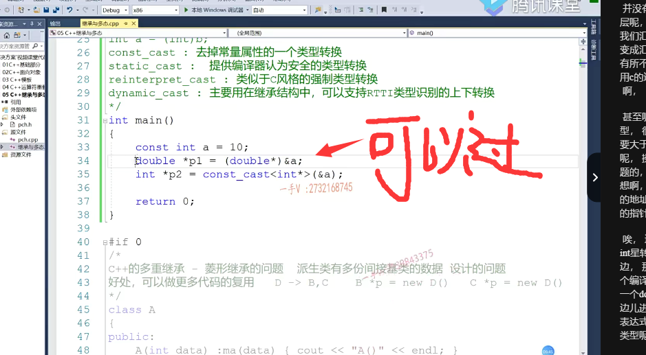

但是呢，在这里边儿。如果说。你想啊，通过const cast。==在这里边儿把一个整形常量的地址转成一个我们指针类型不匹配的另外一个类型的指针==。

唉，这里边儿就给你报错了,const_cast无法从const int星转换成这个char星。啊，转换成叉形。在这里边，那你可以用这个double。啊，我们再来进行一个编译。同样这个错误呢，

不能从const int型转换成一个double型，那也就是说呢，在const caste在这里边儿进行类型强转的时候啊。==它需要你这里边儿的表达式呢==，就是==地址的类型==啊，是跟你==左边儿这个类型,包括跟你在这里边儿转换的这个就是去掉常量属性，想得到的这个类型呢==，它==应该是保持一致==的。

啊，==这里边儿是一个整形常量的地址==，那当你把它的这个==常量属性==去掉，以后呢，==你就应该给一个整形指针==。啊，给一个整形指针，==这样呢const cast才能答应==。

这也==防止了在我们写代码的过程中，====通过c的这种低级别的类型强转啊，任意的转换我们指针的类型==。啊，

导致一些呢不可预计的错误，==你像这个内存上只有四个字节有效，但是指针一节应用访问的是八个字节的内容==。对吧，==这就有问题了==。好吧，那么大家注意，==这是语言级别的啊，语言级别并没有产生任何的这个额外的这个指令代码==。啊，最终呢，==从汇编上来看，这两句写完以后呢？这两句写完以后，其实呢，是没有任何区别的啊==。

就是从我们高级代码编译成汇编，指令是没有任何区别的，在语言级别啊，语言级别上。==他提供了这么一个类型，安全的这么一个去掉常量属性的这么一个操作==。对吧啊，那必须呢，要求这个类型和你的常量类型呢，就是不考虑常性啊，不考虑cons的常性，这个类型需要保持一致的。

它才能够进行一个合理的类型转换。好，这就是我们所说的这个const cast，希望大家呢，把这个搞清楚啊！==const cast只用于我们去掉常量的地方。啊，去掉常量属性的地方。去掉常量属性的地方啊===，

注意一下，而且呢，你看看。这里边我们再给大家举一个例子啊const。class.inta.

我们在这儿呢，进行一个编译啊，进行一个编译，大家来看啊，==无法从const int转换成这个int==。

那也就是说呢，==对于const cast你要去掉常量啊，常量属性==。

==就cast cast呢。它这个尖括号==。这==里面必须是啊，指针或者引用类型==啊，必须是指针或者引用类型。

它能够把指针的引或者引用类型的const给去掉，==你不可能把一个常量本身常量值本身放到这里边儿==。

啊，这个cons卡就是不支持，这里边必须放指针类型或者引用类型。啊，指针类型，比如说是int星或者是int引用类型，这才可以。好的吧，希望大家通过这么一段讲解呢，对于这个const const能有所了解。

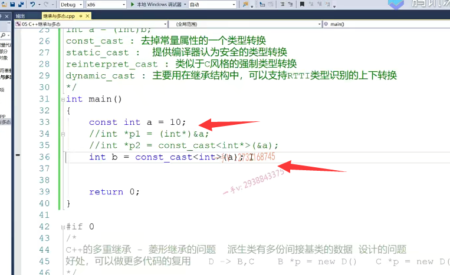

我们再来说一下这个static cast啊，static cast。static cast呢？那应该是我们见的最多的啊，

应该是我们见的最多的就是我们在写C++代码，如果。设计类型转换啊，我们能够用到呢，相关的类型转换，基本上我们都在使用。啊，基本上我们都在使用stat i cast。

那么你看到最后一个有一个dynamic看dynamic是动态的static，是一个静态的，对吧啊？啊，那也就是说呢，我们平时大部分都在使用static cast，==如果要支持rtti。动态类型识别的转换呢，我们就得用dynamic cast==这个呢，我们一会儿专门举例子来说最后一个。

好吧，我们先来看一下这个static cast啊，static cast几乎呢啊，几乎也都。能做任何类型的转换，对吧？当然我们这里边儿说了啊，它只能做编译器，认为安全的这个类型转换。

你比如说像。咳咳。这样的一个操作啊，这样的一个操作就是平时我们写的这样的这个代码啊static_cast在这里边。我们需要把一个整型转换成。一个char类型对吧啊？那么这些类型转换呢？就是跟我们普通的类型转换，原来类型转换没什么区别。啊，这都是可以转的，因为我们整形呢啊，跟我们char类型之间它们都是有关联有联系的。对了吧啊，有关联有联系有关联的类型，有联系的类型，它们的转换呢，通过static cast转换是没有任何的问题的。

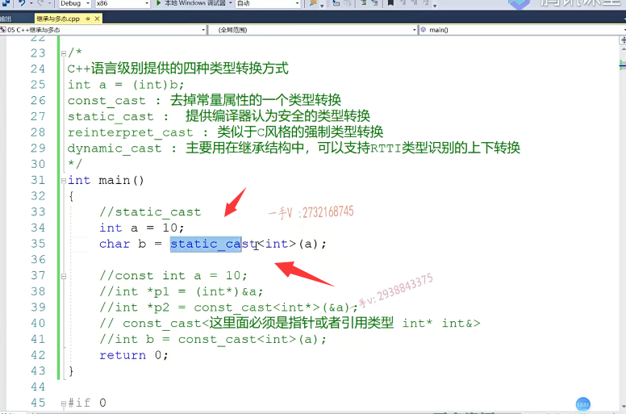

啊，但是呢，你在这里边。还是我们经常用的啊，你比如说呢，我们的这个指针类型。啊，指针类型。short性。这里边呢？我们放一个p变量在这里边儿呢，我们想把它强转成啊short型，就是把这个。p这个等型指针强转成这个short型，

我们来看一下啊。那在这里边儿大家看一下int星转换为short星。啊，就这两个指针之间呢，是没有任何联系的，是没有任何联系。就是这个pint型跟short型之间是没有任何联系的。那么，没有任何联系的这个类型之间的转换呢？就被否决了啊？没有任何联系的类型之间的。类型之间的转换。就被否定了。啊，就被否定了，

那也就是说呢，编辑认为这两个类型之间没有任何的关系，所以他就不允许。你做这样的强转啊，那这样强转呢，确实也没有多大的意义啊，没有多大的意义。

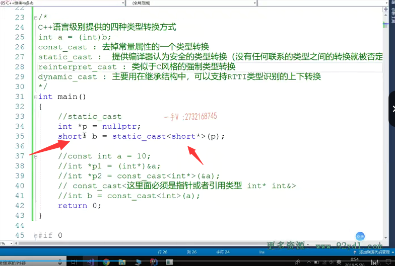

你如果提供这样类型强整的话呢，那就又遇到我们刚才所说的问题了，是不是在这里边儿呢你？想把一个等型的指针转成double类型的指针，那我们来编译看一下啊。那如果说真的让你转的话，让你转成功了，

那你是不是用一个double类型的指针b就指向了啊？一个整形的内存啊？那么你这个be减引用double方的就是八个自己的内存，那实际上内存上是不是只有四个自己的整数啊？整数内存，所以这里边。不安全，不安全，那么C++提供的这种四种类型转换就是在合适的地方选择合适的类型转换，==尤其是这个static cast。啊，我们提供了有联系的类型之间可以转换，没有联系这个的类型之间是被编译器直接否决==，==不能做这样的类型转换==。但是这样类型转换放在我们c的这种。

==放在我们c的这种方式的下方式下，这个比较偏底层的类型强转向==。啊，==他是没有任何问题的==，他不管你。这个类型之间有没有联系它就直接给你做转换？没问题吧啊，

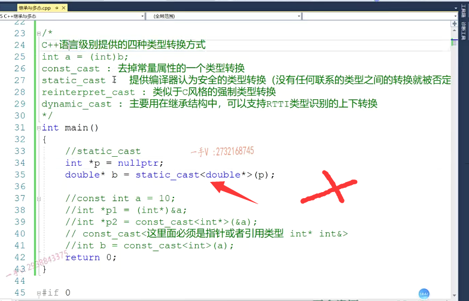

那当然了，我们。基类类型和派生类类型啊之间进行转换的时候呢？能不能用？static static cast呢？可不可以用呢？嗯，大家想一想，

当然可以了。当然可以了啊，因为基类类型啊，跟配生类类型属于继承结构上从上到下的类型啊。那我们进行类型强整的时候，它们的类型呢之间是有关联有关系的，所以呢，转换。style cast呢是可以通过它们之间的互相转换对吧？但转换以后呢？我们代码到底安不安全？对不对？这得由我们开发者来保证，而不是由static cast来保证。没有问题吧，

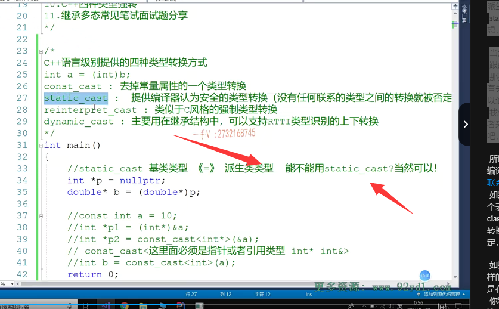

所以也就是说static_cast呢，总结来说就是它提供了编译器，认为安全的类型转换编译器只转换认为有联系就是类型之间有联系的这个类型之间的转换。如果他认为呢，你转换的表达式呢啊，你转换的这个表达式。在这里头，我把它写回来吧。static_cast你转换的表达式呢？跟尖括号里边儿填的，想转换的类型啊，没有任何的区别的话。它就给你否定，它不允许这样的类型转换。好吧啊。

如果呢，那我们把这个编译一下。如果你非得做这样的转换，那么。就得用reinterpret_cast了，这就是在C++语言级别上实现了一个和c一样啊c一样，你看一下刚才的这个。提示啊，大家看一下刚才的这个提示static无法从int型转换成double型与指向的类型无关，强制转换要求。啊，然后c样式强制转换成函数式强制转换。对吧，那么在这里边儿呢？也就是说啊，

也就是说如果呢，我们把这儿改成reinterpret_cast。那这个我们就随意转了，因为这里边儿呢，相当于就是跟C语言类似，类似于c风格的一样的强制类型转换比较偏底层的。这个类型转换啊，比较偏底层的类型转换，你没有任何的安全可言了。

啊，==你看这样的类型转换就是可以的，但是指针一解引用。访问八个字节，而实际上呢？我们持有的这个地址，最终指向的确实一个整形的一个变量，只有四个字节有效==，

对吧？所以呢，==这不安全。OK吧，不安全==。好在这里边儿我们通过呢一些例子呢，给大家把前三个C++提供的这个类型转换呢说了啊。

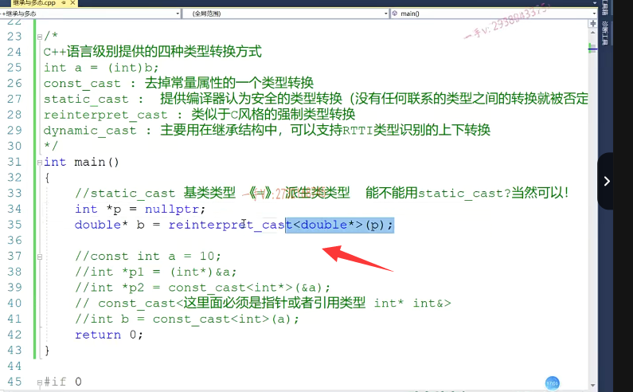

那么，百分之八九十和甚至是百分之九九十五啊，那我们都是在使用static cast做类型强转。啊，那么cost cast仅仅使用在想去掉我们某一个指针或者引用。啊，

在这里边刚给大家说了啊，你这是必须吃掉去掉指针或者引用常量属性的一个类型转换，你不能把它。用在一个转换一个什么呀？常量值的时候对吧？因为const car建括号里边是不能。只填一个类型的，必须是指针类型或者引用类型啊。

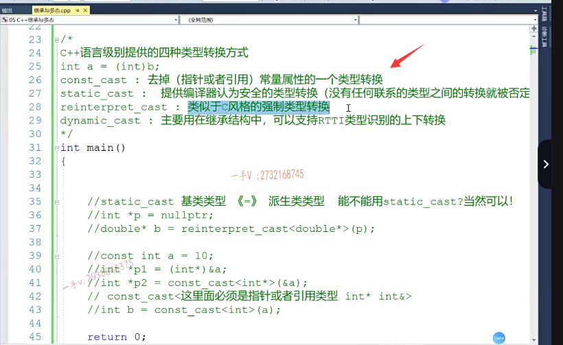

那么rent就没有什么安全性可言了，类似于c风格的这个强制类型转换。

## dynamic_cast 

好吧。那么，接下来我们就说在这里边儿比较有特色的啊，比较有特色的也是支持所谓的rtti类型识别的。这么一个动态类型转换啊啊，

它有什么作用？我们来举一个实际的例子来看一下。好，还是举我们。这个之前的这个。我们写一个例子啊，我们来在这里边写一个例子。

呃。定义成我们的base吧，还是定义成我们的base吧？OK，在这里边public啊。那么在这儿呢，它作为一个抽象类。保留了给所有的派生类呢，

保留了一个统一的一个接口好吧，叫做fuc。在这儿呢。我们有一个派生类，一从贝斯继承而来啊，从贝斯继承而来以后呢？对这个方法呢，进行了一个重写啊，对这个方法进行了一个重写。呃，就是cout。call derive ef用c。啊，那我们。又在这里边呢，

定了一个derive 2，这是靠derive 2 fuz。我们就写了这么一个继承结构啊，就写了这么一个继承结构，有一个基类贝斯有两个派生类derive e跟de river。

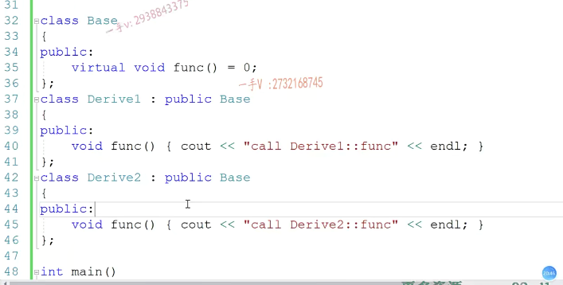

好吧，现在呢？我们在这里边儿啊，写了一个全局的一个接口啊show fuc。那么在这儿呢，我们用一个基类的指针来统一的接收所有的派生类对象啊。然后呢？在这儿呢？我们用这个基类指针来调用啊，他们的透明覆盖方法，

所以在这里边儿肯定是发生了这个动态绑定。对的吧嗯。

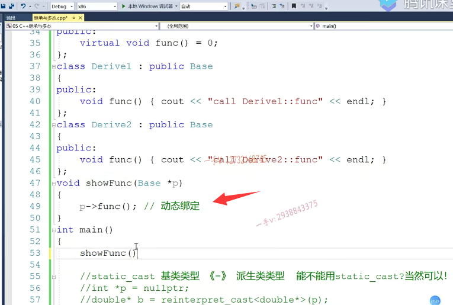

好，那在这里边儿呢，我们现在调用两次这个方法。我们先来定义上两个对象吧啊derive 1d1 derive 2，d2我们现在呢，先把d1的地址传进去。再把呢d2的地址呢传进去。好了，我们来运行一下这个程序，先看一看。OK，运行起来，在这里边儿呢，

这两处分别电用了。啊，==虽然是基类指针，但是由于动态绑定==，对吧？==访问了它所指向对象的虚函数表指针==，==进而访问相应类型的虚函数表==。

==所以第一次呢，访问的是derive 1的func，第二次呢，访问的是derive 2的func。这没有任何问题。==

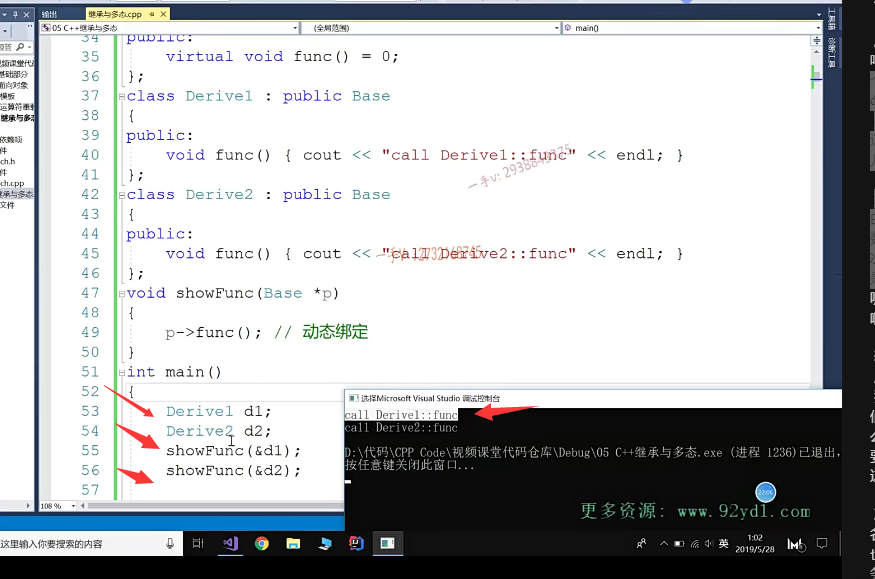

## 增加需求

但是有可能呢，现在随着我们项目进行啊，我们的这个需求啊，

软件。运行的这个需求就是我们软件开发的需求，应该是软件开发的需求改变了啊，或者说是。呃，我们项目已经开发完了，这些东西都不能动啊，我们要现在要增加一个新的这个需求，那么也就是什么意思呢？

比如说我们在derive 2里边啊。我们需要。啊，比如说呢，我们在这里边儿需要啊，写这么一个函数啊，

就写这么一个函数，应该是一个。嗯，随便起个名字啊derive 02 fuc。啊，在这里边呢。我们具体也不知道呢，这个到底要实现什么样的，是不是业务啊啊？不知道，反正在这里边儿呢。需求更改了。啊derive 2实现。啊心功能实现心功能的哎sorry实现心功能。的API接口函数啊API接口函数。

给rev 2这个类型啊，实现新功能的API结构函数

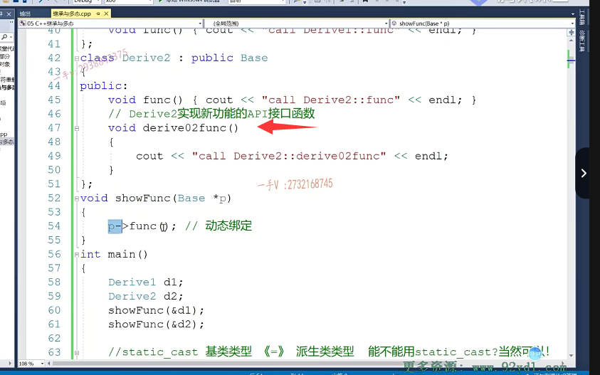

## 指针指向derive2时，需要调用derive2func()而不是func,其他对象还是调用func()

那什么意思呢？就是说啊。现在在这儿呢。我们要区分判断一下。如果你指向的是其他的派生类对象。你就调用他们f使用c方法就行了。但是在这如果你指向的是derive 2，这个对象。你不要调用它的func方法，你应该调用它的derive 02 func。啊，我们需求我们现在的这个软件设计就得去实现这么一个功能，那如果我们非要去实现这么一个功能，

我们有什么办法？啊，大家把题呃问题再听一听一下就是呢。我们这个指针。指向其他的派生类对象，虽然在这里边儿我们写了两个派生类对象，但是大家可以想象这里边儿有很多的派生类对象都是从贝斯是不是继承而来的。啊，==只要不是指向的，是derive 2，那么都是通过原来的动态绑定电用。各个派生类重写的f pnc方法，但是如果说我们这个指针指向的是derive 2这个对象，那么就需要调用derive 02 f pnc这个方法==。

那也就是说，在这里边，它是不是需要识别一下星p的？是不是类型啊？就看我这个指针啊，到底指向的是？到底指向的是？哪个对象？如果你指向的是derive f2这个对象的话。啊，那在这儿呢，我就要重新去调用函数了，而不是调用fuc函数了，对吧？在这里边儿，==如果大家有一些印象。你应该知道呢，通过我们前面的这个type ID星p啊点name。点内容==。我们可以通过这个字符串啊，==通过这个字符串。通过字符串来比较啊，来比较跟我们的这个derive来进行一个比较==。来判断这个类型，因为我们说了。==p.是个base类型的指针对吧？base里边儿呢？有虚函数，所以在这里边儿识别的肯定是它运行时的这个类型就是指针指向哪个对象？进而访问它的虚函数表，取的是rtti的类型==，还有印象吧，

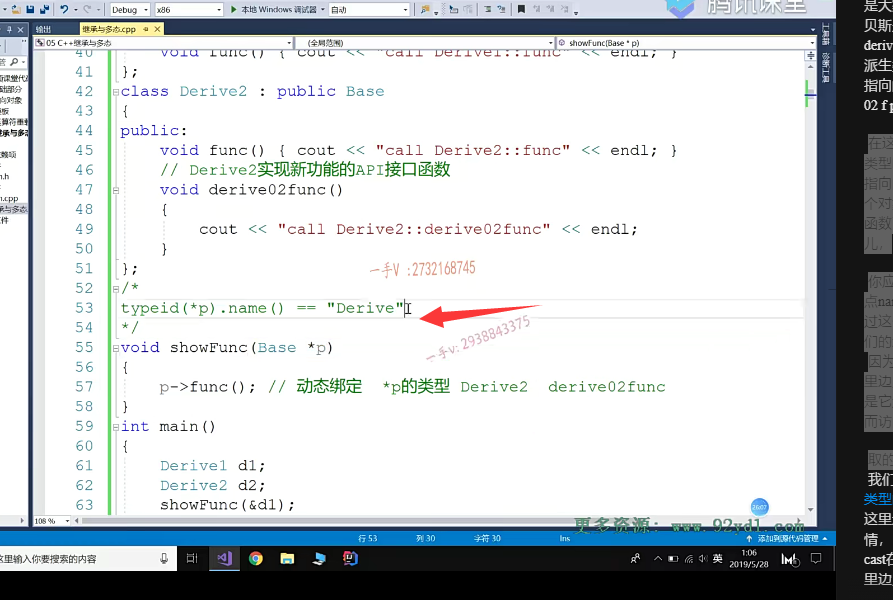

但是实际上呢，我们不会用这么。比较字符串的方式来进行一个rtti类型的一个转换，我们都会用dynamic。cast来，在这里边儿看一下啊，我在这边儿要做这样的一件事情，那就是说呢。

derive 2新pd 2=dynamicdynamic cast在这里边呢。drive 2指针。大家看看啊，在这里边儿把这个p的类型啊，转p类型的指针呢啊，

转换成derive 2类型的指针。dynamic会检查。p指针是否指向的是一个？derive 2，类型的对象，

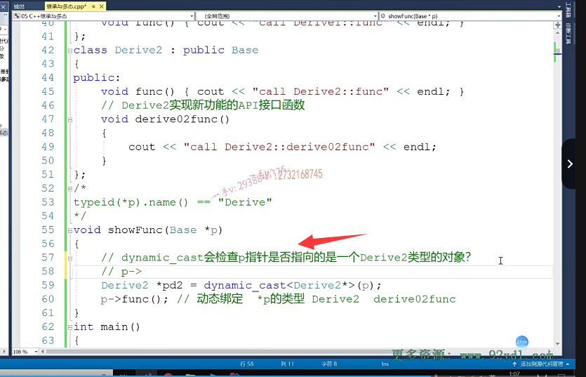

那这个怎么检查呢嘛？很简单嘛，还是通过？还是通过这个p访问对象的，是不是vfp PR进而访问对象？对应类型的是不是虚函数表啊？虚函数表里边不是放了rtti信息了吗？应该是放rtti指针rtti指针指向的是不是一堆rtti信息呀啊？它是可以呢，来访问动态类型的啊，

你注意。如果是。如果是dynamic cast。转换类型成功。啊。转换类型成功。返回。derive 2对象的地址。给谁啊？给这个pd 2那就是这个pd 2呢？是有值的对吧？否则，如果说在这里边儿啊p指针指向的并不是derive对象，否则返回nullptr。

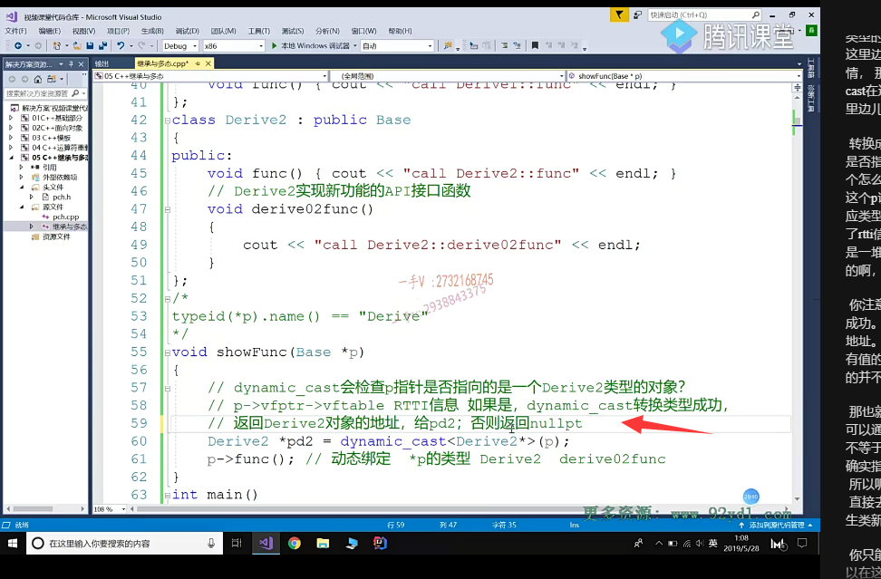

那也就是说，在这里边儿，我们写完这个，我们可以通过呢pd 2，如果等于难。啊，或者说是.

## 有返回值不为null,则已经转化为derive2对象，再调用新的函数

==如果不等于null。那就说明呢，我们现在呀。这个p指针确实指向的是一个derive 2类型的一个对象==，所以呢，我==们把这个类型转换成你们不能够用p，直接去定derive 02func==。啊，==因为这个方法是在派生类新添加的基基类里边儿也没有，你只能通过派生类对象，派生类指针来调用啊==。所以在这里边儿呢，我们进行了一个类型转换了嘛，在这儿我们直接用pd 2来d偶用这个t20c。啊，那如果else为空的话，怎么办呢？为空那就说明了，那现在这个p指针呢？指向的根本就不是一个derive 2对象。没问题吧，那其他对象那你就还是用原来的调用原来的。派生类跟基类重写的透明覆盖方法fuc就完了。好吧，

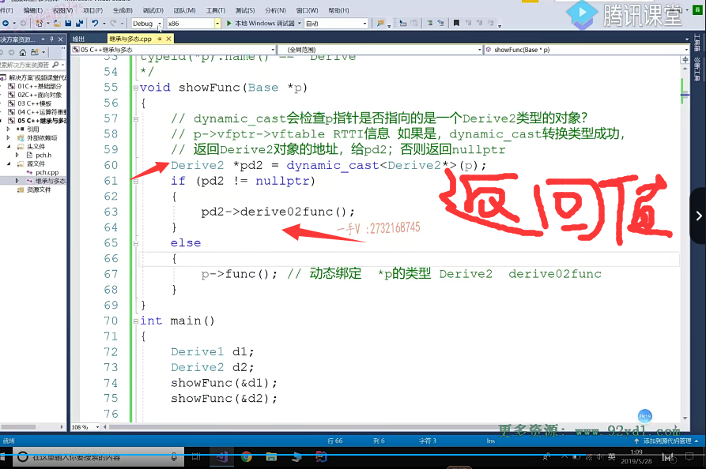

我们来看一下啊，我们来看一下。在这里边儿调用完成。第一次呢。我们给受fuc穿的是第一对象，那p指向的第一，所以在这里边儿进行啊，我们dynamic类型强转的时候呢？返回的肯定是空，因为它检查rtti信息，发现p指向的是类型，是derive 1并不是derive 2，所以它。动态类型转换失败了。OK吧，

第二次传的是derive 2对象，这一次呢，类型转换成功了，所以进入这个if语句调用了，我们给这个derive 2新添加的derive 02f用c方法。我们看到dou。好了吧啊，注意一下。注意一下，

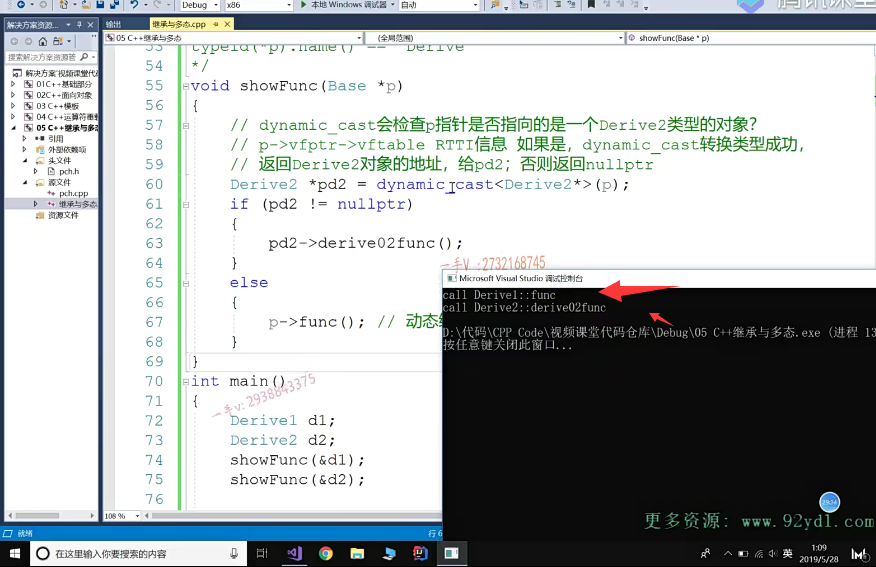

## 使用Static_cast就会永远调用derive02的新函数

实际上在这里边儿，如果你换成static cast。你注意s在这里边儿呢，也能够进行类型的转换成功，因为毕竟base跟derive 2这个类型啊。啊，

这个类型。它们是有关联的，对吧啊那么？他是不管屁指向谁。它都认为，贝斯星转成就是基类类型的，这个指针转成派生类类型的指针，你要强转也可以给你强转，因为这毕竟是有继承关系的类型。是有关联的，它能给你强转成功啊，但是它永远都能强转成功。

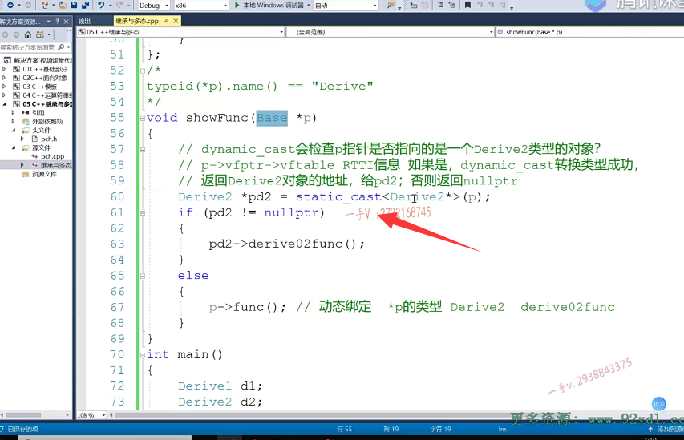

所以在这里边儿，我们根本就无法识别p指向的是其他对象，还是p指向的是derive 2的对象。

啊，那在这里边，你来看一下。你看它把两个呢，就是两个调用全部调用到我们derive or derive。derive这个derive 02f用c方法上的。对的吧啊，实际上呢，他第一次调用，第一次呢，调用这个方法。实际上，它这个指针指向的是一个第一对象。对吧啊，实际它指向的是一个第一对象。

## 甚至它是derive对象，然后转换为了derive02对象，但是访问不了derive的相关成员变量

但是呢，他通过这个指针。就是derive 2这个类型的指针调用这个方法。也就幸亏在这个方法里边儿没有访问我们相关的成员变量，如果你想访问我们direct相关成员变量的话。==那就访问不到了，为什么？因为实际上啊，它虽然类型挂了个derivative 2类型，但实际呢，它是一个。derive 1类型的。在内存上，只有derive 1类型的一个对象。好吧，==

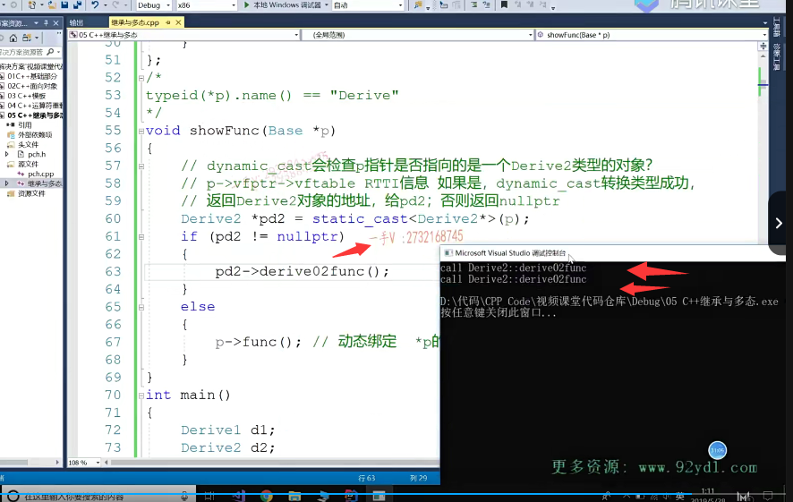

这是极不安全的对吧？极不安全的啊，所以你也可以把static这里边儿这个static所有的这个static啊。static看作是。编译时期的类型转换。编译是静态的类型转换，编译时期的嘛，是吧啊？而我们这个dynamic cast是什么？是。运行时期的类型转换是支持rtti。信息识别的啊，支持rt k信息识别的，所以在这儿我就我们的必须得用啊dynamic cast。才能够动态的去识别p，

指向的是其他对象还是dr对象啊，那么。这样的操作呢？才是成功的。

了吧，这样的操作才是成功，所以当我们在就是写项目的时候呢，用C++的技术在实现这么一个功能的时候就是。我需求随着需求的更改啊，我一些统一一些对外这个提供的这个API接口里边儿啊。啊，提供的这个API接口里边啊，当我这个指针或者基类的引用在指向某个派生类对象的时候。需要自定义其他的这个方法的调用在这里边，我们就可以用dynamic cast来对指针指向的对象进行一个运行时的类型识别转换。

如果指针指向的确实是我们想要的，这个类型的对象，那么转换就会成功，否则返回的是空指针。啊它。就能够我们通过一个指针跟空的判断就能知道。我们的这个基类指针到底是不是指向的，是我们所强转的这个类型的一个对象。OK，

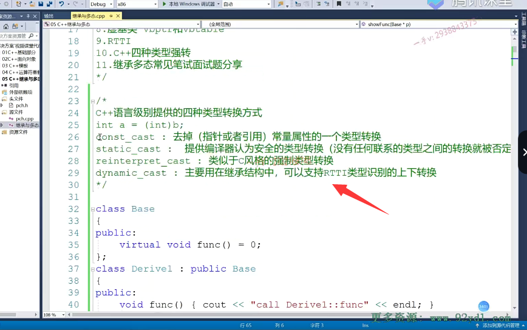

那通过本本节课的这个讲解呢，希望大家对于C++的四种类型转换啊，有一个认识啊，有一个认识。嗯，能够总结一下啊，

能够总结一下呃。在C++里边儿，通过这四种类型强转呢，对我们类各各种情况下类型强转呢啊，进行了一个细分。当我们在遇到相应应用场景的时候呢，==我们的选择可以多样化，而且呢，更安全啊，而且更安全==。==不像C语言里边儿类型强转==，那就跟==C++的这个reinterpret_cast一样，没有任何的类型转换，甚至没有关系的类型之间，它也可以任意转换，==

尤其是对于指针类型。对吧，他根本不检查指针，这样不同类型的指针转换安不安全啊？他随意就给你转了，而对于我们。他这个cast呢？它是可以检测出来的，它是编译器，会要要给你报错，它认为呢？没有联系的类型，它之间呢？转换啊，它就给你否定了。

好那。这部分的内容就讲到这里，我们下节课再见。