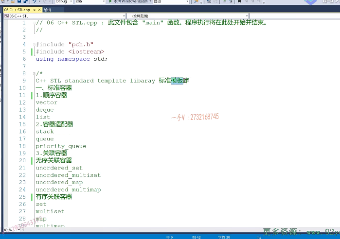
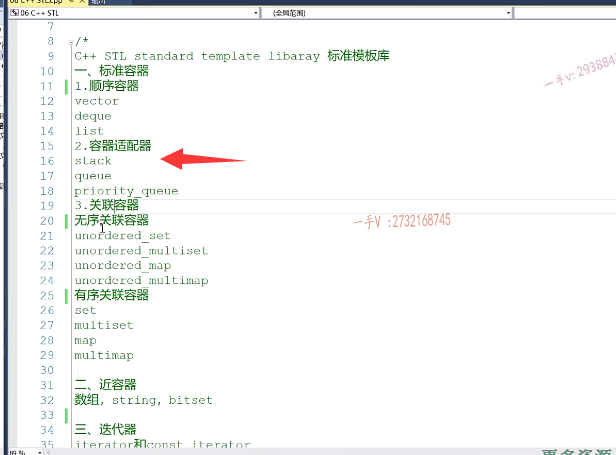
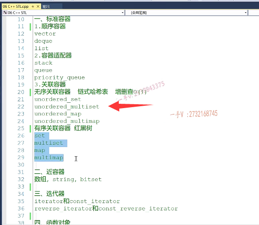
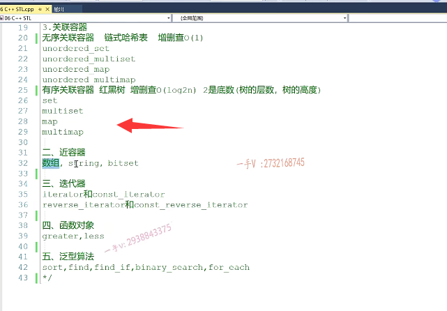
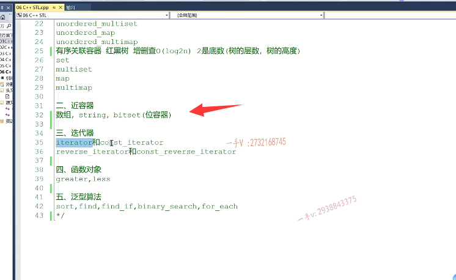
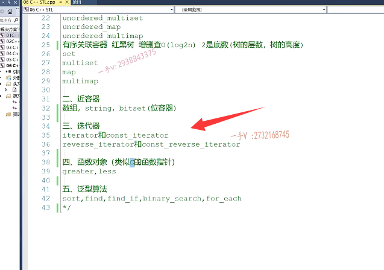
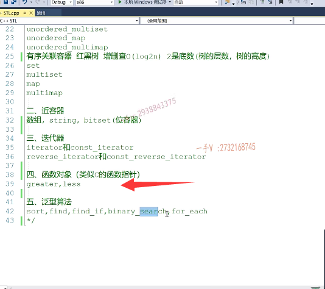
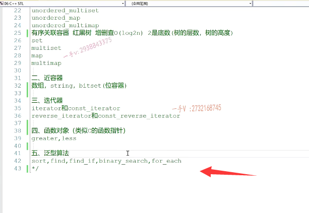

# 第一节课

## STL内容学习

大家好，欢迎继续收看税老师的视频课程啊，那么从这节课开始呢，我们要讲CA加呢。应该是属于CA加啊，也是top 3啊top 3重要的一个模块儿就是CA+stl。叫做standard template library啊，标准的模板库。啊，这里边儿所谓的标准呢，就是CA加的一个标准库啊，就是我们不管是在WINDOWS Mark或者是linux上啊，安装相关的CA加编译器。那么这些。类库呢，

都是会随着我们编译器呢，安装到我们本地的操作系统上的，我们可以直接包含相应的头文件来去使用它们啊。模板呢，说的就是说这些C加加库呢啊，提供的这些类呢类库都是用模板来实现的。啊，不仅仅是类库，还有函数库，也叫算法库，对吧啊，都是用模板来实现的，这样的好处是。啊，我们想用这个算法呢，

处理什么样的类型，我们就用什么类型呢，实例化这些模板就可以了啊，比较通用的代码对吧？这节课呢，我们先来简单的介绍一下，在CA+stl这一部分呢，我们大概要学习哪些内容啊？大概学习哪些内容？

首先呢，从大了说我们要学习呢，这部分内容啊，标准容器标准容器。里边儿有顺序容器，容器适配器，

还有关联容器。顺序容器里边有我们常用的vector de kun和list啊。那么。顺序容器从这名字上，我们就能看出来啊，这些容器底层的这个数据结构啊，底层的这个数据结构啊。啊，都是一个顺序表对吧？那就是数组链表占队列是不是相关的啊？顺序表。啊vector呢？叫做向量容器啊呢？叫做双端对列容器list叫做。链表容器对吧？

从它名字上呢，我们就就能听出来啊，它底层的数据结构是什么？到时候我们在相应课程模块儿里边儿讲解这些容器的时候，我们再详细来介绍它的一些底层的实现原理。啊，

那么。标准容器第二块儿，我们来看一下容器适配器，首先我们看一下什么是适配器啊，我们再来研究一下呢。战队列和优先级队列，这默认是基于大根堆实现的优先级队列啊。这也都是非常常用的，我们在笔试面试需要写代码，

或者是在面试中啊，面试中给我们一个。代码的应用场景让我们去设计一块儿，代码的时候呢？这些容器呢？我们都可以直接使用上啊，都可以直接使用，非常非常的常用，也是非常好用的。

最后呢，我们在顺序容这个标准容器里边儿最后一个啊，除了顺序容器容器适配器啊，第三块儿就是关联容器。关联容器相当重要啊，它是基于呢高级数据结构实现的这个容器啊。

无序关联容器啊，它底层实现的依赖的都是链式哈希表啊，链式哈希表。那么，它的这个增山茶可以达到趋近于o1的时间复杂度啊，它的增山茶操作可以趋近于o1的复杂度。因为哈希表嘛，都有你采用再好的哈希函数都会产生哈希冲突的，===对吧？哈希冲突呢是？是拖慢我们哈希表呢，增删查的这个嗯，效率的这个问题点之一，当然呢，我们这个解决哈希冲突的方式有很多啊。==

这个呢，到时候留到我们这个视频课程就是专门讲啊，用CA加来讲这个高级数据结构的时候呢，大家可以详细的看一下我们有关哈希表的一些内容啊。

那么，这里边有on ordered set。on order，the multi set on order，the map on order，the multi map，这是set是集合啊，这是无序的单重集合，无序的多重集合，这个是无序的单重映射表，这个是无序的。

多重映射表无序，哈希表里边儿元素呢啊，只追求增删差的速度一定要快。而对元素本身呢，并没有任何的排序性质。

有序关联容器底层的数据结构都是基于红黑树的啊，都是基于红黑树的，那么有就是单重集合多重集合。map multi map啊，单重映射表跟多重映射表。啊，到时候我们区它们之间的这个区别应用啊，我们到时候讲到这一部分的时候再详细阐述啊。红黑树呢？它的这个增山茶时间复杂度都能够达到log以二为底的啊，

以二为底的n不是log。二倍的啊，一二为底，二是二是底数，也就是树的层数，树的高度对吧？嗯，树的层数。啊树的高度，如果你对呢二叉树，包括bstavl红黑树啊，不太了解，而这些。相关的二叉树又是我们笔试面试中啊，热评的一些考点对吧？

面试官比较喜欢问的，因为比我们顺序表复杂，所以能够很好的区分。不同啊，我们不同学生不同朋友，他们的这个能力水平啊，如果不太了解的话，可以关注一下我们后续的信用CA加。来讲这个高级数据结构啊，相关的这个课程啊。

那这是我们所说的这个标准容器，我们就讲讲这几部分啊，讲这几部分。好，那么除了标准容器呢？

我们还有一些进容器也是比较常用的啊，==近容器你可以理解为近似容器==，但没有纳入到我们标准容器里边儿来。啊，这里边儿有数组string，还有bit set，这个叫做==位容器啊==，位容器位容器专门处理位运算的啊。在我们进行这个位图法处理大数据查重，或者是进行哈夫曼编码，进行位编码的时候未编码，解码的时候呢，我们beta set呢，都是可以使用上啊，都是可以使用上的。

跟位操作相关。

C加加幺幺里边儿呢？C加加幺幺里边儿还提供了这个==array和forward list==啊。这个容器这是个数组容器啊，这是个单项链表容器，对吧？那么这个到时候呢，我们再讲完我们这些标准库里边儿的这些常用的容器，以后呢？我们再来给大家扩充一下啊，看CA加幺幺提供的这些东西呢，这些容器它们有自己的什么样的特点，跟我们以前的标准库里边儿的。这些通用的容器啊，到底有什么不可替代的地方啊？

好那么容器讲完了以后呢，我们会给大家再讲一下这个迭代器啊，主要关注一下我们的。正向迭代器跟反向迭代器啊，包括我们普通的迭代器跟常量迭代器，对吧？它们的一个。使用注意事项啊，使用注意事项。

再者呢，我们会讲一下我们CA加里边儿非常重要的啊，函数对象不管在我们类模板类库还是在我们算法里边儿呢，这函数对象都在大量的使用。啊，大量的使用。

那么，这个函数对象呢？就类似于类似c的这个函数指针啊，函数指针，但是跟c的函数指针有什么区别呢？到时候我们再讲函数对象的时候，希望大家呢留意收听啊，

最后我们来讲一下这个泛型算法啊，泛型算法呢，总共有c加库里边儿呢。有。近近100种啊，就有近100种，有近100个对吧？应该是。

七八十个应该是七八十个，每一个CA加库版本的这个更新，这个算法apn呢也都在。这个扩充啊，也都在扩充一些好的，一些经典的算法呢，都被扩充成这个。呃，我们标准的泛型算法，比如说是排序对吧？查找二分搜索啊，便利，还有求最大值最小值。啊，那这些哪里呢？

都有这些泛型算法的，这个汇总呢？我们到时候会给一些资料啊，大家可以在我们给的资料上边儿呢，可以看到我们CA加常用的啊，所有的泛型算法的一个罗列。以及简单说明啊，泛型算法的应用呢，如果应用熟练了，我们记得多当我们在处理相关问题的时候，我们直接可以调用相应的泛型算法来解决问题。啊，给我们节省了很多的时间，以及节省了很多的代码量啊啊，尤其是在我们笔试面试的时候。

在时间有限的情况下，去实现更多的逻辑代码是非常有帮助的啊，是非常有帮助的。

# 总结

在时间有限的情况下，去实现更多的逻辑代码是非常有帮助的啊，是非常有帮助的。那么。这就是我们CA+stl啊stl要讲的这个所有内容，我们呢？这些内容讲解的过程中呢？我们还有可能呢？呃，几部分内容啊？会相互穿插啊？会相互穿插，我们要注重一个结合的一个应用啊，多举例子，给大家来讲解呢，

==这些容器的底层原理以及它们常用的一些增删改查的操作==。好吧啊，那么从下节课开始呢，我们就从我们第一部分顺序容器开始好，那这节课呢，我们就先讲到这里。下节课我们再见。

