# 第2节课

### 头文件

大家好，欢迎继续收看石磊老师的视频课程啊，那么在这一课当中呢，我们主要来说一下vector这么一个容器啊，它叫做向量容器，当我们使用它的时候呢，我们需要包含一下这个头文件啊，那么在我们实际的这个代码开发过程中呢，尤其是C++vector，这个容器的使用频率呢？是非常非常的高的啊。

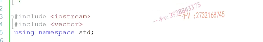

### 底层是动态开辟的数组，二倍扩容

那么大家应该搞清楚==它底层的这个数据结构==啊，是个什么样子呢？==是一个动态动态开辟的数组==啊，每次或==每次以原来空间大小的2倍啊，二倍进行这个扩容的==啊，每次与原来空间大小的2倍进行扩容的。啊，那么对于容器呢？我们必须呢清楚啊，

它底层是基于什么样的数据结构？啊，来创建的那么这样呢？对于数据结构有什么优缺点呢？那我们这个向量哦，我们相应的这个容器呢？就有什么优缺点？OK吧啊，那底层数据结构是这还有以及它的这个内存扩容方式啊，与原来空间大小的2倍进行扩容的。

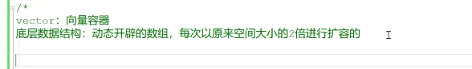

## vector容器常用操作

那么，==对于vector来说，它常用的一些就是增加啊，删除以及查询==。啊，

常用的这个操作都有哪些呢？还有一些常用方法啊，常用方法介绍我们都在这里边儿呢。给大家来说一下，先总结，然后呢，一会我们通过代码呢？来去。再梳理一下啊。好在这里边儿增加vector提供的增加呢？有啊，你假如说呢？在这儿呢，我们先定一个vector，既然是模板库，

那就得我们写的时候呢。给这个类模板啊，传入实例化的这个类型对对吧？模板实例化类型啊，

增加呢？它里边有push back啊，比如说是20对吧？这是在我们容器末尾啊。添加一个元素，在容器末尾啊，添加一个元素啊，末尾添加元素，末尾添加元素，它的这个时间复杂度啊，它我们直接写吧，

它的时间复杂度是一个o1。没问题吧啊，

## 增加元素导致二倍扩容

但我们要注意一点啊，这个添加元素呢，有可能导致。导致这个容器扩容的啊，导致容器扩容的那么容器扩容是什么意思呢？就是。根据原来的空间大小啊，开辟二倍以二倍进行开辟更大的内存，把原来空间上的对象呢，在我新空间上啊，拷贝构造。啊，拷贝勾在在我新空间上啊，

生成新的这个对象，

## 简单画一下

那我们简单画一下，，这是vector原来的空间。对吧，它里边呢有一些对象啊，那么在这里边儿进行二倍扩容以后呢，以原来的空间的大小的2倍进行一个扩容啊。那么，这是它原来的这个空间上的对象，对吧？那么，==它所谓的扩容，就是不仅要开辟空间，还要把原来的对象在我们新内存上啊，要拷贝构造新的对象==，对吧？然后呢？再把原来空间上的对象呢？一一析构掉，析构掉以后呢？再把原来的空间呢？进行一个free释放。是不是啊？那么这些。大家还有没有记得啊？我们之前讲过啊，在容器中啊，在容器中进行对象的。

构造析构啊，构造析构。啊，==内存的开辟释放都是通过谁来实现的呢？还有没有记得？啊，通过谁来实现呢？谁来实现的？哎对了，容器的空间配置器allocator==，

## 容器的空间配置器

==它有四个函数，还记着没？啊。allocate跟deo cate。啊，这个是专门负责呢，内存开辟的，这是专门负责内存释放的，对吧？还有construct，这是专门负责对象构造的destroy，这是专门负责对象虚构的==。啊，如果你忘记了，那么空间配置器是很重要的啊，希望大家能够翻到我们之前啊，应该是在之前我们。我们模板的时候呢，讲vector容器已经给大家讲了，

容器的这个空间配置器的意义了啊。希望记不太清的同学呢，可以翻到之前的这个视频上啊，再去呃了解一下我们容器空间配置器的作用啊。

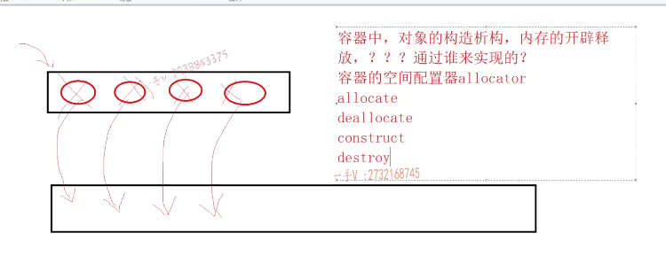

那么，扩容对于容器来说呢，是一个消耗，是一个消耗，对吧？那么，我们如何呢来提高vector容器的内存的使用效率呢？这个一会儿我们在常用方法介绍的时候给大家再做一个说明啊，

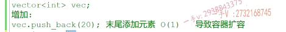

## insert时间复杂度是O(n)

那在这里边儿呢，我们不仅仅可以在末尾添加元素，我们还可以调用它的insert啊，

在指定的位置呢，添加一个元素。啊，这是什么意思呢？这是在。迭代器啊，这个迭代器it迭代器指向的位置增加一个元素啊，在迭代器指向的位置增加一个元素it。迭代气。指向的位置位置添加一个元素20啊，那么大家注意一下啊，因为这个。vector容器底层的这个数据结构啊，是一个数组啊，是一个数组，

所以当我们在。中间的某一个位置啊，进行一个元素插入的时候呢，那在这里边插入元素的话呢？哎，所有的这个元素呢，都要向后挪一个啊，都要向后挪一个。啊，我们元素越多，我们需要挪动的元素也也是越多，那也就是说我们挪动所花费的时间呢？跟我们元素的这个个数呢，是成线性比例的，线性比例就是数组的插入嘛，

是不是所有元素插入点以后的所有元素都要挪动，所以呢，它的这个操作时间杂动呢？就是一个on啊，就是一个on 

insert，当然呢，它也会导致我们容器扩容的，是不是啊？就是当我们容器满了以后呢？你给容器呢？再添加一个元素，那么就会导致容器扩容。啊，这是它的增加，增加相关的接口push back末尾，

增加insert在我们指定的位置进行一个增加。啊。好在这里边儿呢，

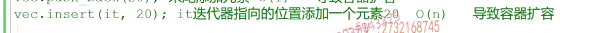

## pop_back()

我们继续来讲这个删除啊，讲到的删除操作，那删除操作呢，有pop back。不带参数，因为删除嘛啊，这就是从末尾删除元素啊，末尾删除元素，末尾删除元素的话呢，它的时间复杂度，你就是个o1。因为这是删除元素，

所以不会导致我们容器的扩容呢，是吧？因为它又不是增加啊，删除还有一个呢，就是用erase。erase erase通过传入一个迭代器啊，我们删除呢。迭代器指向的元素啊，用来删除迭代器指向的这个元素。删除it迭代器指向的元素啊，

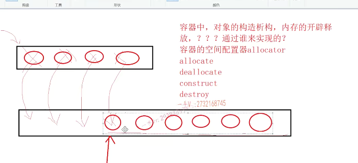

那么大家注意一下，因为vector底层呢，我们说了是一个数组对吧？那么你要去你你要是把当前的你，比如说当前这个元素删掉的话呢，

它是不允许中间空的是吧，那它就它就得。从删除点到后边儿，所有的元素呢都得向前挪动位置啊。是吧，都得挪动位置啊，它移动的元素所花费的时间跟我们元素的个数呢，是成线性比例的，所以在这里边呢，当你。调用erase删除it迭代器指向的元素的时候呢，它的一个时间复杂度也是一个on的花费。

啊vector呢？删除power back

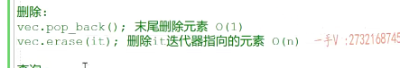

## 查询

### 中括号运算符

### 查询效率为O(1)

查询的话呢？那这个方法就比较多了，

首先呢，我们的vector给你提供了中括号运算符重载函数。因为大家知道这个vector底层是个数组，数组最大的一个特点就是随机访问啊，就是通过下标。下标。下标啊，数组下标的随机访问。唉，就像就像这个样子。访问vector底层数组的这个第五个元素啊，这就是数组的随机访问，数组的随机访问呢，花费是o1。对吧，

只要是我们数组合理范围内的元素啊，只要我们给一个下标，我们就能立能够立刻呢访问相应下标的这个元素的值。跟我们数组里边存放的元素的个数是不相关的啊，随机访问它是一个常量的，这个花费啊，所以它效率很高。效率很高，对于vector来说，我们可以通过它的中括号运算符重载函数呢。哎，来获取呢，指定位置的元素的值。

### 迭代器 泛型算法查询

查询当然，我们也可以通过啊，

通过迭代器进行便利了啊，通过迭代器进行便利也都可以的。也都是可以的。没问题吧啊，也都是可以的啊，然后我们如果还要查询的话，我们可以用泛型算法泛的。

查询当然，我们也可以通过啊，

通过迭代器进行便利了啊，通过迭代器进行便利也都可以的。也都是可以的。没问题吧啊，也都是可以的啊，然后我们如果还要查询的话，我们可以用泛型算法泛的。

那实际上我们语法就是我们C++11提供的语法堂，就是for each啊。啊，也可以用来便利容器，它其实底层就是通过迭代器。它其实就是通过啊迭代器来实现的。这个我们之前呢也在讲的时候讲这个迭代器的时候应该给大家说过啊，说过这么一个问题fore其实底层也是。通过迭代器一起来实现啊，

这就是它常用的一些查询的方法啊，查询的方法。

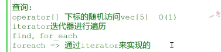

## 容器迭代器失效问题

### 如何解决  更新迭代器

那注意在这里边不要忘了一点啊，不要忘了，不要忘了一点注意啊对。容器进行连续。插入或者删除操作。啊，那也就是说连续的去使用啊？就是使用这个。insert还有erase啊，因为这些呢呃，接口是需要依赖一个迭代器的，对吧？依赖一个迭代器的跟位置是强相关的。

啊，当然就不用考虑push back跟pop back了，因为这两个呢是在指定的末尾位置进行删除啊，或者添加删除是吧？这个一定要更新迭代器，否则。一否则第一第一次insert或者或者eris完成啊，迭代期就怎么样了？对迭代器就失效了，这个也是我们之前讲的容器，迭代器失效的问题啊，我们有专门一节课。讲了容器的这个迭代器失效的问题啊，我们还给大家模拟了啊，我们库里边儿的这个容器呢，

还有迭代器，它是怎么去实实现这个迭代器失效？啊的问题的。啊，如果有忘记的同学，希望可以返回头去呢，再去看一下相关的视频，回忆回忆好吧嗯。

## 常用方法

### size(),empty(),reserve(20 ),resize(20),swap()

常用方法介绍，在这里边，我们像我们常用的size呀啊size对吧？返回啊，返回我们这个。容器底层有效元素的个数empty判断我们容器是否为空啊？判断我们容器是否为空。

啊，是否为空？那么。还有reserve，reserve接收一个整数，对吧？这是干什么的呢？这是给vector。预留空间的啊，预留空间的，预留空间的，还有ress，这跟reservoir非常相似啊。这是resize，通过这个名字，

我们就能看出来resize呃重置大小的是不是嗯重置大小，或者你可以理解是扩容用的。扩容用的啊，扩容用的可以给容器扩容啊，容器扩容用的。当然还有他的sweep啊，进行一个。啊，两个容器进行元素交换啊，进行元素交换。这都是我们常用的啊，这都是我们常用的一些。常用的一些我们vector啊的方法vector的方法。希望大家呢？把它一定要总结啊，

总结，然后进行一个熟练的一个应用。OK吧啊，总结您进行，然后进行一个熟练的应用。好在这里边我们进行了vector相关方法的总结，

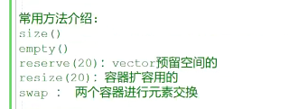

### 通过push_back()增加容器元素，然后通过中括号运算重载函数遍历

在这儿呢，我们可以定一个vector啊，用整形呢，实例化一个vector对吧啊？当然了，你想的话可以用任意类型实现。

啊，实例化，比如说用string实例化，一个vector啊，那么这个vector呢？每个元素呢？全部都是我们字符串类型啊，字符串类型在

这儿inti=0还小于一个20加加I。唉，在这儿呢，我想给vector push back嗯，这是用的是push back进行一个元素的添加啊rnd rand给它%模上一个100，那也就是说，取了1到100之间的随机数，

对吧？然后我们要对它进行一个打印啊，进行一个打印。输出是不是输出啊？输出呢？那这个方式很多了啊，我们最简单的呢，对于vector来说，我们可以这样去做inter size先等于。vector的size刚说了啊，vector有一个size方法，是不是size方法啊？size方法。那在这儿获取元素的个数，然后for循环inti=0 I小于s加加I。

在这呢，我们就可以对于它的这个vector的每一个元素进行一个输出了。这里边儿第要==用的就是vector的中括号运算符重载函数==啊，这个运算符的重载相关的这个概念，我们讲之前讲运算符重载的时候呢？给大家就已经说过了，是不是说过了啊？这是通过呢？我们的这个vector容器的啊。好printer中括号啊，运算符，重载函数。函数啊。进行vector容器的一个元素的便利，并且进行一个打印啊，

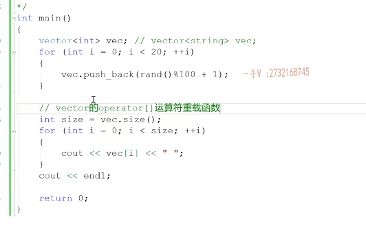

### 迭代器去遍历vector

当然了，你还可以通过。迭代器。还记着没有我们容器呢，都会提供一个比电方法返回它首元素的迭代器，对吧？然后呢，我们可以通过at 1不等于v1c点end，这个是什么呢？啊，这个意思就是说呢，反摁的返回的是容器，最后一个元素就末元素的后继的位置，如果不等于它啊，加加it 1。

在这儿呢，我们也可以通过迭代器禁用来访问迭代器所指向的。元素的值这两种方式呢，我们都可以对vector容器呢进行一个便利。okay的吧，进行一个便利。好都可以进行便利啊，都可以进行一个便利。没有问题吧啊。这是。便利对吧？

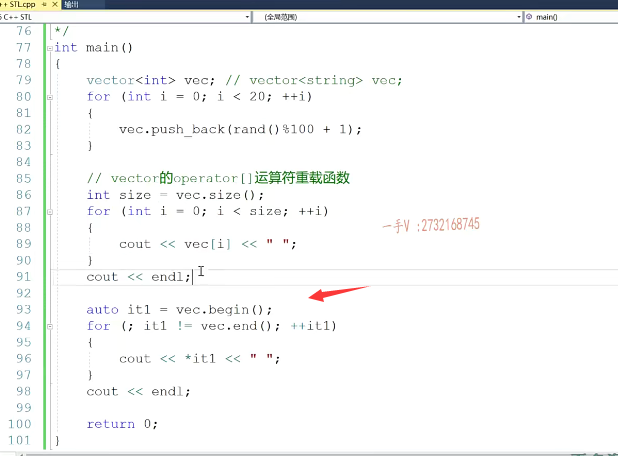

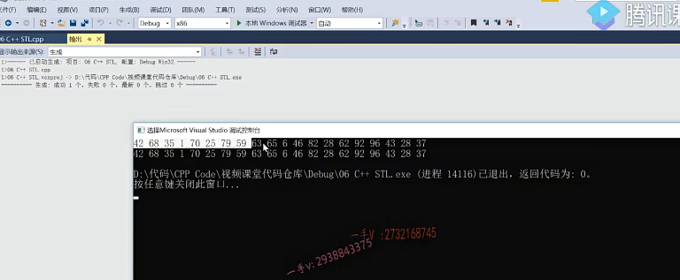

### vector vec容器中所有的偶数全部删除

那么，在这里边儿呢？我们啊，我们。

再来去写一段儿代码啊，比如说在中间这块儿呢，我们实现这么一个东西啊，就是把vector vec容器中所有的偶数全部删除啊，删除所有的这个偶数啊。

### 注意迭代器失效，需要更新迭代器

auto噢，我们auto it 2，等于vec的begin呃，然后呢？是for it 2不等于vec的end？啊，用迭代器来变利容器嘛，对吧？加加it 2。

if星at 2模上一个2=0，就表示是碰见偶数了，是不是碰见偶数了的话呢？在这儿呢我们。就要进行一个删除了啊，删除了VC点erase啊erase。这里边儿必须传入一个迭代器，那就是当前的at 2嘛，注意在这里边儿，如果删除一个，我们就break就走了。啊，就走了，我们在这里边儿，不用关注at 2已经失效的问题了，

但是在这儿我们问题是啊，把vec容器中所有的偶数。全部的删除。所以呢，在这里边我们不能用这个break。你不能用这个break，

auto噢，我们auto it 2，等于vec的begin呃，然后呢？是for it 2不等于vec的end？啊，用迭代器来变利容器嘛，对吧？加加it 2。

if星at 2模上一个2=0，就表示是碰见偶数了，是不是碰见偶数了的话呢？在这儿呢我们。就要进行一个删除了啊，删除了VC点erase啊erase。这里边儿必须传入一个迭代器，那就是当前的at 2嘛，注意在这里边儿，如果删除一个，我们就break就走了。啊，就走了，我们在这里边儿，不用关注at 2已经失效的问题了，

但是在这儿我们问题是啊，把vec容器中所有的偶数。全部的删除。所以呢，在这里边我们不能用这个break。你不能用这个break，

## 但是需要处理逻辑，当删除后，迭代器不需要加加

## 不删除才需要加加，因为删除后，后面元素会移到前面

你在这里边第一次erase这个it 2就已经失效了。啊，这个执行完不能够再让这个失效的HR继续加价，它有问题了，那你注意，这就是我们之前讲过的迭代器的失效的问题啊。在这里边，必须通过erase的返回值呢，把it 2给我更新一下。

这样才可以，但是注意唉，这样虽然迭代器更新了，但是它逻辑有问题，什么意思呢？因为你删除你在数组中啊，删除一个元素以后啊。它后边儿所有的元素是不都要你看，你把刚才把这个位置的元素删了，它后边儿的元素是不都要往前挪一个呀，所以我得从当前这个位置继续开始判断是不是偶数。因为它把后边那元素方挪到我当前这个位置来了，所以在这儿呢。我就不应该说是删除以后还要加加删除以后，因为后边儿元素挪到当前这个位置来了，

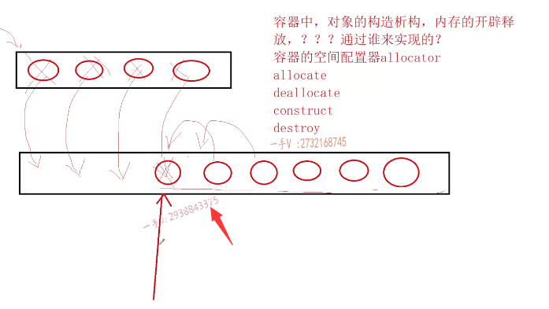

我需要从当前位置继续判断，如果呢，当前位置不是。偶数的话，我这个迭代器才需要前后加加，既然这个for已经成这个样子了啊，表达式一跟表达式三都没有了，所以我把它呢？变成一个while循环啊，那出来呢就是这样的一个结果，删除所有的偶数，

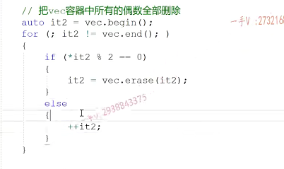

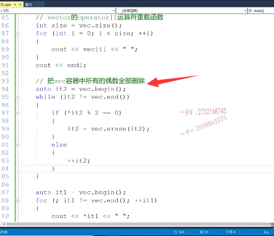

## 测试结果

嗯，这个就把所有的偶数，你看四十二六十八是吧？

所有的偶数呢？我们就全部删除掉了。啊，全部删除掉了。好的吧啊。好，这是我们所谓的。删除是不是？那在这儿呢。这个是加个注释啊，这个是通过啊，迭代器便利vector容器啊。那大家再看一下啊，再看一下，那在这呢，

我们是相当于是。做了这样的一个偶数的全部删除的一个操作，

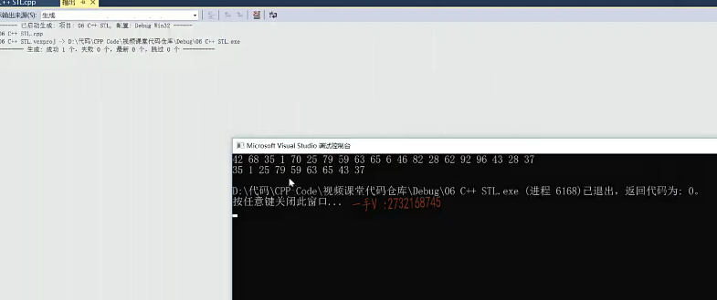

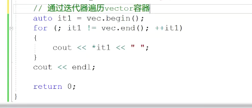

## 给vector容器中。所有的这个奇数前面都添加一个小于奇数一的偶数

那大家再看一下啊，再看一下，那在这呢，

我们是相当于是。做了这样的一个偶数的全部删除的一个操作，对吧啊？在这儿我们再使用一下它的这个增加啊增加。我们现在呢，在这里边儿啊，删除完了以后，我们现在vector容器里边儿相当于全部放的都是一个奇数了。是不是全部放的都是一个奇数了啊？或者说我们不知道里边儿是奇数还是偶数，但是我们现在题目是这个样子的，就是给vector容器中。所有的这个奇数奇数啊，奇数。奇数前面都添加一个小于。

奇数。一的偶数啊，那也就是说呢，现在当前位置是45，你给前面就加个44啊，当前位置是四五十七，你给前面就加个。56.OK吧，就是这么一个意思啊，

## 连续插入操作

### 注意迭代器失效

那这里边涉及了一个连续的插入操作，那你知道连续的插入。一定要对迭代机进行一个更新，因为第一次插入使用迭代器进行插入以后呢？这个循环变量迭代器呢，

就已经失效了啊，就已经失效OK，

那这里边涉及了一个连续的插入操作，==那你知道连续的插入。一定要对迭代机进行一个更新，因为第一次插入使用迭代器进行插入以后呢？这个循环变量迭代器呢，就已经失效了啊，就已经失效OK，==

### 代码编写

在这我们写一下啊。啊，当然，我们还得需要定义，或者是我们用上面儿那个it 1吧啊，用这个it 1就可以了，it 1=vec的begin。啊，或者我们直接把它写到for循环当中啊，写到我们for循环当中。否然后是it 1呢，不等于VC的end加加it 1，啊加加it 1那么在这里边注意一下，

我就判断了if星it 1，模上二它不等于零，是不是就代表呢？我们现在呢？通过迭代器遍历了一个奇数啊。啊，并列了一个奇数。那么，在这里边儿，我们对于奇数啊，当前这个位置呢，就要插一个插入一个小于奇数一的一个偶数了，所以在这儿我们调用insert方法。在当前位置it 1第一个参数传入的是迭代器啊，第二个参数传入的是数据，

那比这个奇数小于一的数。就插入了，

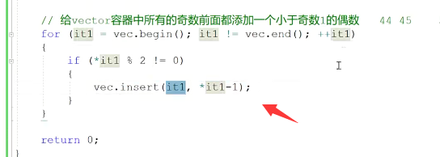

### 连续插入的处理

### 更新迭代器

但是你要注意这么一个插入完成以后呢，如果你break掉了，那就没有关系，但是如果你想继续。使用这个迭代器，那你注意一定啊。要把这个迭代器通过insert的返回值呢？进行一个更新。这迭代器呢，倒是不会失效的

### insert()返回的是当前插入的位置的迭代器

### 增加逻辑的处理

所以我们加加还是处理的上一个奇数，所以还要再加加

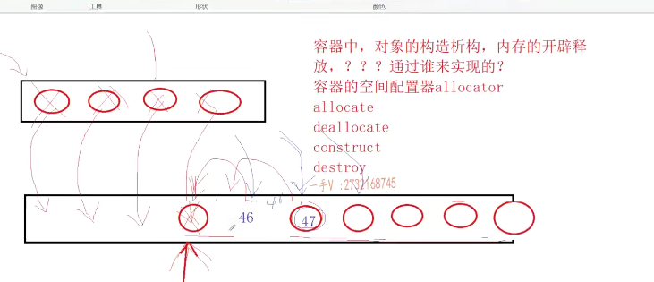

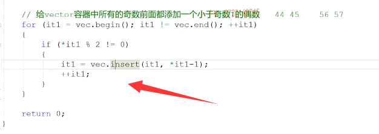

但是注意还是我们之前说的逻辑的问题啊，因为你插入你看你在这里边儿呢呃。我们就看下边这个吧，

你在这个地方啊，插入一个。偶数就是你刚开始遍历到这个是一个。47对吧？然后呢？你在这个位置想插入一个偶数，那你把这些数字是不是都得？向后挪一个呀。在这儿是不是插入这个46啊啊？那你然后要加加再加加你不能说加一次加一次又加到47给47前面儿不断的加46呢？是不是？所以呢，在这里边insert的话呢，我们要进行两次加价。你测的完了以后，

这儿加加一次循环的时候再加加一次，你注意加加一次。啊，再再加一次，从这儿开始，继续往后遍历，对吧？如果没有找到这个基数的话呢，那就直接往后加一次就行了。是不是啊？在这儿我们把这个再拷贝一下啊，这是对于我们的这个容器呢，再进行一次。便利输出啊，我们看有没有给奇数前边儿呢，

都添加一个偶数。啊35前边儿添加了一个34，一前边儿添加了一个零二十五，前边儿是2465，前边儿是6443，前边儿4237，前边儿是一个36。这个没有问题吧啊。这是对于我们容器vector容器呢，经常用的这个增删啊，增加删除以及。循环遍历容器啊。常用方法的一个应用啊，应用。好的吧啊，

在这里边呢，注意使用一下。

再次遍历

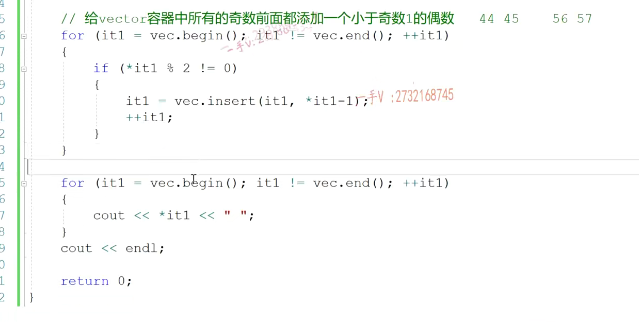

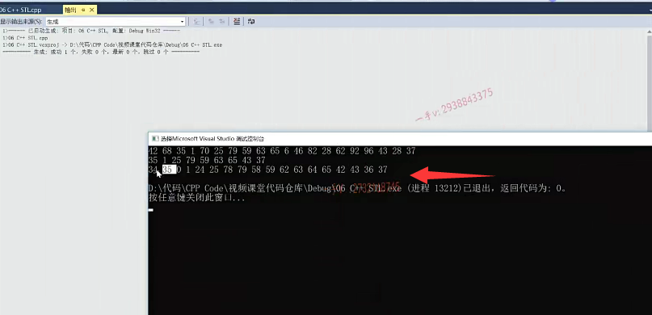

那接下来给大家再介绍一下啊，介绍一下我们的这个。呃，常用方法啊，这里边size跟empty，我们就不用做特别介绍了啊，在这儿呢，我们把这个。代码括起来end if啊。那么，在这我们看一下。

这个reserve是什么意思啊？

## reserve的作用

同学们来看一下，这是我们默认啊，默认定义的一个vector。

==默认定义的vector，它底层啊，开辟的空间就是零个，也就是它根本没有开辟空间啊，==

当你第一次push back的时候呢，第一次插入的时候呢。它从零才扩充到一

再插入，又满了才扩充到二再满了扩充到四。8 16 32 64就是这样去进行的一个扩容啊，就是这样进行的一个扩容。

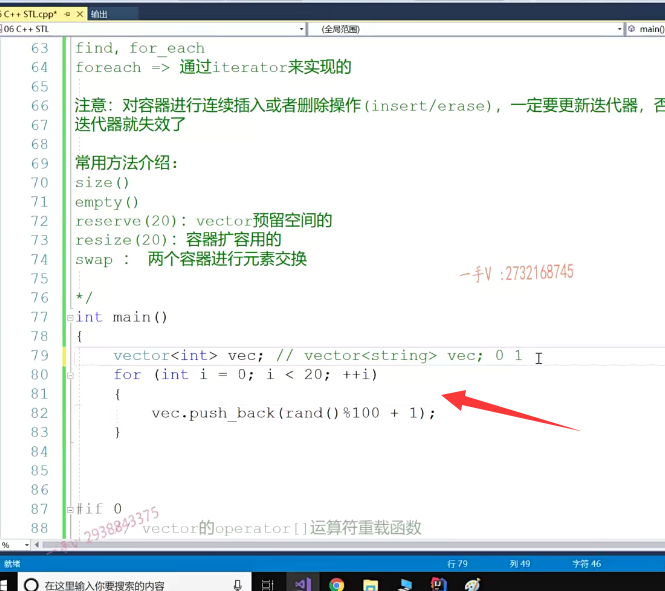

## 扩容的代价很大

那么，大家应该知道呢，扩容的代价是很高的，

对吧？我们之前讲过，需要开辟更大的内存，把原来内存什么对象呢？

一个一个拷贝构造。唉，在我新的内存上生成新的对象。

然然后呢？再把原来内存上的对象全部吸够掉，再把原来的内存释放掉，对不对啊？

初始的内存啊，使用效率太低。扩容太频繁了。是吧，

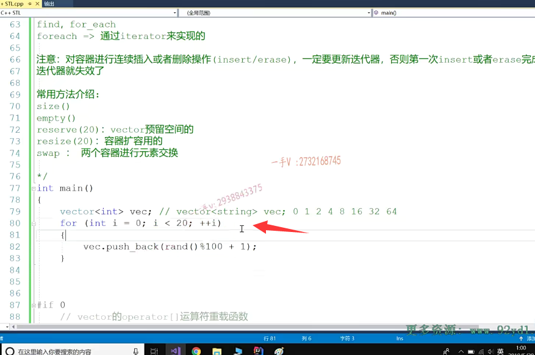

那假如说在这里边儿，我们知道啊，我们在操作，我们我们在处理，我们这个问题的时候，我们的这个问题涉及的数据量大概就是个20，

那同学们我们可以啊调用这个。reserve reserve函数呢，给它里边传入一个20，==叫做给vector容器预留空间啊，预留空间，==

预留空间。我们可以看一下，

在这里边儿，我们可以输出一下啊VC变empty。是否是空的啊？是否是空的啊？

然后在这里边我们再输出一下size。

大家来看看啊，大家来看看，然后我们再进行一个push back。

## 运行结果

## reserve只给容器底层开辟指定大小的内存空间，并不会添加新的元素啊

啊，大家看一下在这呢。唉，第一回是0 empty，确实是空的啊，size是零，也就是说reserve 20呢，

并没有给我们容器添加过元素。

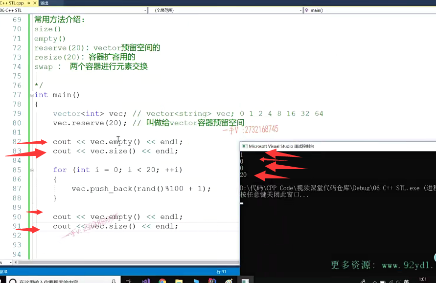

啊，只是给我们容器底层开辟空间啊，

这个reserve只给容器底层开辟指定大小的内存空间。并不会添加新的元素啊，

所以在这里边儿，虽然我给了一个二十二十，指的是它内底层啊，要预留的内存空间的大小。

啊，在这儿呢，容器里边儿依然是空的，容器里边儿元素的个数呢啊，依然是个零。

对吧，依然是个零，等我给它添加20个元素的时候啊，此时我们定用reserve的好处就出来了，

==因为在这个添加的过程中呢，我们不会做任何的扩容操作。==

啊，因为元素就是20克，我们已经给它预留了20个空间了，对吧？20个元素的位置，所以在这儿插入的时候不会进行扩容这个工作

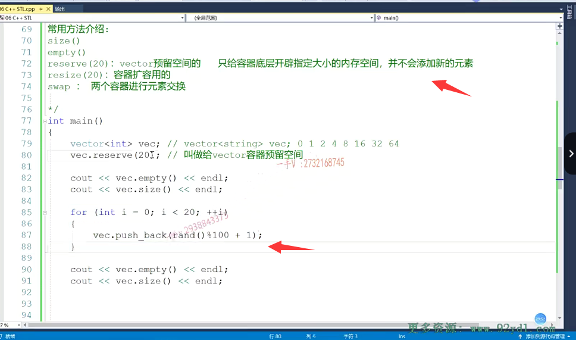

假如说我们的数据量大概在一两万，那我们用vector的时候，我们可以预留一个控件来防止它频繁的进行一个扩容操作。

啊，给我们这个应用的这个运行啊，带来这个效率上的一个降低，对吧嗯？好在这里边儿呢empty已经为FALSE了啊，empty已经为FALSE就是不空了啊，

不空了元素个数有多少个呢？有20个。啊，有20个。没问题吧，

这是reserve。

## 注意resize()

## resize开辟空间，并且放入了20个0

但注意一下，这个resize resize跟reserve呢，有不同的地方啊，就是说它是啊。

==不仅给容器底层开辟指定大小的内存空间，还会添加新的元素，==

还会添加新的元素，大家看一下，我把这里边reserve呢？给他换成什么呀？给他换成呢，我们的这个resize啊，resize resize。大家来看看我，

换成这个resets啊。那换成这个resize以后呢啊，换成这个resize以后呢？

那在这里边儿，不仅给容器底层开辟20个元素的空间，还给它添加了20个元素。还给它添加了20个元素。

好，我们大家来看一看啊。你看运行的这个结果。刚才定用reserve的时候呢，只是预留空间，并没有添加过元素，

所以empty还是true的，现在empty是FALSE了。

也就证明容器现在元素不空了，那都有多少个元素呢？有20个。有20个啊，那这二次元20个元素的值是什么呢？就是我们这个值。零值对吧？

相当于在这里边儿reserve resize呢？不仅仅啊，给我们vector容器底层开辟了有20个元素的内存空间。还给这个容器放了20个零这么一个整形的元素啊，那当你再添加20个元素的时候呢？那添加第添加20个元素的时候呢，

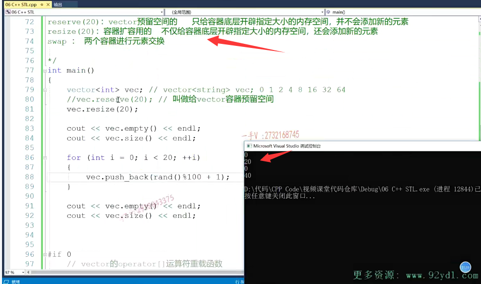

当你添加第21个元素的时候呢，它已经开始进行扩容了。

对吧，从20扩容到40是不是就有有一次扩容操作啊？

最后empty为零，不空嘛，元素多少个20个？

我们在这里边儿添加了20个元素，在这儿也添加了20个元，总共是四个。40个元素。

## 注意一下reserve和resize这两个的区别

在这里边儿呢啊，大家注意一下reserve和resize这两个的区别啊，这两个区别一定要注意，尤其是这个reserve呢。

当我们在知道我们所处理的应用的这个数据量的前提下啊，如果我们能知道数据量，

==我们可以用我们的reserve函数呢，给我们victor预留足够的空间。来避免啊在使用这个vector容器过程中呢啊频繁。频繁的啊，让这个容器进行一个扩容操作。==

# 总结

好吧，这个vector容器呢？应该是我们在使用顺序容器的时候呢，使用频率最高的一个容器了啊。在这儿呢，我给大家把这个vector容器相关的这个操作啊，常用方法及方法的时间复杂度呢？

在这里边儿给大家列出来了，希望通过这些代码的示例呢？

大家首先呢，能够对它常用方法有一个。啊，有一个认识啊，并且熟悉它的一个调用，

那么我们后边儿呢，还有专门的这个一部分呢？是给大家去实战这个代码练习的啊，到时候我们在代码上也会大量的使用到我们的容器啊，希望大家呢，到时候留意收看。看我们在实际的解决问题的过程中是怎么使用容器的啊，都调用了它的哪些方法？来帮我们提高我们代码的编写效率。

好，那这节课就到这里下节课，再见。

