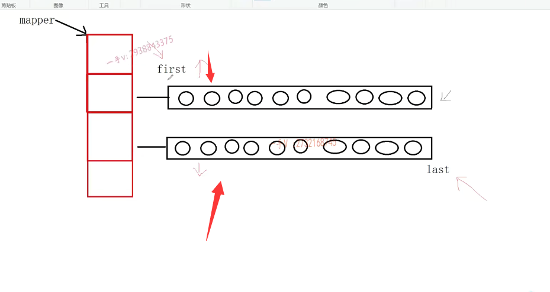
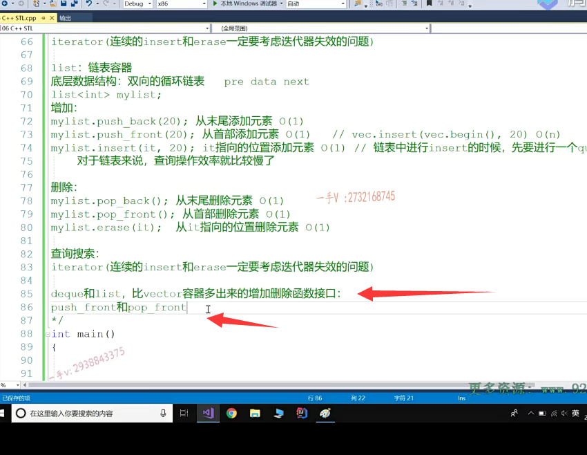

# deque和list容器

大家好，欢迎继续收看社磊老师的视频课程啊，

==这节课呢，我们先来讲这个deque啊，这个叫做双端队列容器。==

上节课我们讲了vector啊，讲了vector啊，大家在后边的这个顺序容器的学习过程中呢，我们可以拿它们啊。和我们前面讲的这个容器呢，进行一个对比啊，进行一个对比好，

这是我们的这个双端队列容器，我们来看一下。

deque来说呢，它的底层啊是一个什么样的数据结构呢啊？是一个什么样的数据结构呢？

大家来先给我看一下它底层的数据结构。就用vector，它叫做一个向量容器啊，

它底层的这个数据结构是一个内存可以二倍扩容的一个动态开辟的数组，对吧？

来跟我们看一下呢，deque的底层啊。在我们VS版本啊，更迭的时候呢，我们每一个版本啊，deque呢，

它的这个层定义的这个大小呢，都有所不一样。

==但是呢，它的数据结构一直都是一个动态开辟的二维数组==，

我们拿中间的一个VS版本。来在这做一个介绍，那么在我们这个stl库里边呢？

有这两个啊，有这两个宏一个叫做map size，它的值是二。然后呢？这个是一个queen size queen size呢啊，queen size在这里边是一个，这是一个4096除以size of t啊，除以size of t。

我们简单的给大家在这列一下啊，这个t呢，就是我们所表示的这个类型啊类型。

## deque数据结构

那什么意思呢？就是说呢，我们deque底层是这样的一个数据结构啊，是这样的一个数据结构。

啊，它有一个map，一个指针指向我们这个一维啊一维的默认的大小，就是我们这里边所定义的这个map size 2。啊map size 2，

那么，第二位动态开辟的第二位啊，这个空间呢？是有多少个元素呢？对吧？这个不确定是跟元素本身的类型有关的啊，是跟元素本身的类型有关的，

比如说这里边儿我们deque呢，我们写这样的一个deque。用整型来实例化de q对吧？那在这里边儿所开辟的二维就是4096除以s of int。那就是一个1024。个整数了啊，就是1024个整数了，

当然在这里边儿呢，我们没有办法给大家把1024个元素呢，全部画出来是不是？

啊，那注意一下啊，注意一下双端队列，从这名字我们就能看出来啊，双端两个端都可以做，两端都可以做，队头可以做对尾。

好，我们知道队列呢，是一个从队尾入队，从队头出队的，是不是这么一个数据结构啊？

对，那么注意呢，它可以从队尾入，也可以从队尾出，可以从队头入，也可以从队头出。它相当于把两个方向呢啊，都有两个角色啊，都有两个角色。

## 放在中间开始，就是我们是双端队列

那么，在这我们简单给大家表示一下啊。我们就画出它一个方向就行了啊，一个方向就行了，

假如说这是放的整数，第二位是1024个元素。

啊，那么first跟last就处在中间的这个位置512的这个位置。

==那为什么不处在这一头儿，或者另外一头儿呢？唉，它好处呢？就是为了干什么呀？就是为了。让两头儿呢都预留足够的一些空间，因为我是双端队列嘛，每一头儿都可以插入的啊，每一头儿都可以插入的。对吧啊。==

注意一下，那随着呢，

我们元素的这个增加，随着我们元素的这个增加。

唉，这刚是往这边儿入，这现在是往这边儿入，那么相应的，我们的这个。

指示的这个位置呢？是不是就得向后跑啊啊元素呢？

我们入到双端队列里边儿来了嘛？是不是啊？但是呢，等我们元素入满的时候。啊，元素入满的时候。

元素入满的时候。

比如说呢，你在这里边儿还想从哪里入啊？你看我把这个画好。如果此时呢？你还想啊，从我们这边儿这个方向入就是从这个方向入，

## 一个二维满了，需要另一个二维

那很明显啊，这个二维。这个第二维呢，已经没有空间了，对吧？已经没有空间了啊，已经没有空间了，那么在这里边儿。

需要进行一个另外一个二维的，一个开辟啊，另外一个二维的开辟。那么，这个last呢？再随着尾部的添加，我们这个last就要跑到。这里边来了，第二行里边来了啊。

## 一开始初始为MAP size为2，现在需要扩容

我们注意一下。那随着我们。这里边儿的元素继续添加，当我们添加满了以后呢，

再想跟我们得空里边儿进行元素添加的时候呢啊，进行元素添加的时候呢，那我们怎么办？

==此时我们deque，就需要扩容了啊，它扩容扩容的是第几位呀？对它扩容的是第一维==。

第一维一样，也是按照二倍进行扩容的。

最初的处置的大小呢，是一个二，所以它在进行扩容的时候呢。就成一个几啦。唉，再扩容的时候呢，就从==二扩容到四了啊，扩容到四了。==

## 扩容后放到中间

那这个map呢？现在就指向这个位置了。啊，指向新的空间大小了，那么把这个第二维呢也要挪过来了。但是把这个第二问挪过来，是放到开始的地方好呢？还是放在中间的地方好呢，还是放在末尾的地方好呢？

==大家应该知道，放到中间的位置好，为什么放在中间的位置好啊？因为还是那句话，双端对立啊。==

给你任何一端都有可能进行元素插入的，给它们前边儿跟后边儿啊，前边儿跟后边儿我们上下分别预留空间的话。

这样是不是适合他们进行一个？是不是前边儿的元素的添加，后边儿元素的添加，你要进行前边儿元素添加的话呢？

啊，在这我们把first跟last先挪个地方啊。那相当于呢？

所以我们这个位置是不是再开辟一个新的二维啊，进行元素添加，我们中间的这个就不用挪了嘛，如果你在末尾再进行元素添加。嗯，

在最我们一维的最后一个元素，再给它开辟一个二维。这样是不是就很方便啊？

啊，这样就很方便。注意一下，这是我们deque的一个内存的一个扩容方式OK，

==在这里边儿一维扩容的时候，一维是按照二倍进行扩容的好吧，一维是按照二倍进行扩容的。==

那么扩容以后呢？==这个第二维啊，第二维我们放到我们这个意位的中间啊。==

方便我们前后呢，进行一个这个元素的添加。

## 放在哪个地方的计算方式为 oldsize/2

那么，放到第几个地方呢？它计算的很简单，就是old size。除以一个二。你在这里边，你看啊，我们扩容以后old size是几呀？old size是二。我们再除以个二，是不是就等于一呀？唉，所以呢？我们一维扩容，以后呢，

我们原来的二维拿过来的时候呢，就是从第一个开始放的。放了两个就放到中间了

# 再举扩容到8个的例子

好吧，当我们这个。再进行扩容的时候呢，一维扩容，扩容到四个到八个，是不是四个到八个啊八个？一。二。三。四五。六。七。8

12345678啊，那么。这个二维呢？我们也要搬过来，搬到哪里呢？那就是用我们这里边儿old size是个4÷1个2=2，

那也就是从哪个地方开始存放啊？012从这儿开始放啊，你看从这儿开始放，我们有四行要放呢。来看一下。我们这个二维画的有点大了，是吧？好，我把这个呢往上贴一下啊，

往上贴一下。大家来看。啊，这个是一。234啊。这个也往上贴一点。

==是不是刚好是占据了中间的？是不是四个位置啊啊？刚好占据了中间的这四个位置嗯。==

没有图上啊，刚好是占据了中间的这四个位置，上下留的空间呢，是不是都留了两行啊？

唉，这是为了让我们双端队列呢？头尾都可以进行元素的这个插入啊。

插入完了以后呢，可以很方便的在我们上边儿或者下边儿继续进行一个二维的开辟啊。

# 总结1

这就是我们deque底层，就是一个动态开辟的一个二维数组，好了吧？

我们给它画了一下它的这个内存的这个扩容方式及元素的存储方式。

==啊，底层数据结构底层数据结构是一个动态开辟的二维数组啊，一维数组从二开始。==

==啊，这个以二倍的方式进行扩容，对吧？以二倍的进行方式进行扩容，每次扩容以后呢？==

==每次扩容后原来第二维的数组从。啊，新的一维数组的下标old size÷2开始存放上下。都预留啊，相相同的空行啊。==

==方便支持deque的首尾元素添加。对吧啊，首尾啊，不是首位。是首尾啊，首尾元素添加，这就是deque的一个。底层的一个实现啊，底层的一个实现，==

## deque 的增加

## 前后都可以增加，时间复杂度为0（1）

那么它的这个增加呢啊，它的这个增加呢，看一下增加。

啊，比如说我们定义了一个deque。这是一个。整形实例化的一个deque啊，

大家来看一下。de q点push back。这一个是不是跟vector是一样的呀？

这是从末尾添加元素，时间复杂度是o1。OK吧啊，时间复杂都是o1，

当然它也有可能引起扩容的，是不是啊好？

be q点push front唉，我们看见的人家有push front，

从它底层数据结构，我们就可以看出来。对于deque来说啊就是前后，

我们都可以进行元素的添加。而且呢，都不涉及其他元素的挪动。对吧，不涉及其他元素的挪动，

所以呢，前后呢？都可以支持元素添加啊，从首部添加元素啊，时间复杂度也是o1。

## vector只能通过insert,时间复杂度o(n)

那么，在这里边vector可不可以实现手部元素插入啊？当然可以实现了，

但是它没有，它可没有push front方法的，那你要实现手部元素添加，只能通过它的insert了给它传入一个我们容器的begin。就指向首元所迭代器，然后再进行元素添加，但是这样的时间复杂度是一个on。

对的吧，如果呢？如果啊，如果在我们使用这个容器的时候，当我们选择vector和deque的时候，当然我们的其中的指标之一就是如果呢，我们应用场景呢，

需要从经常从尾部进行元素添加，也经常需要从这个手部进行元素添加啊，

我们当然呢就会选择这个deque，是不是因为victor的这个手部元素添加呢？

它的时间复杂度还是挺高的，我线性的时间。

## deque的insert时间复杂度也是O(n)

好吧，当然在这里边d queen DQ insert它也支持呢，载向迭代器。指向的位置呢？

添加一个元素。啊it指向的位置添加元素，它的这个时间复杂度还是个on啊，

因为呢？你在中间添加一个元素，跟我们vector是一样的，比如在这儿添加一个元素啊。

那你后边的这些。元素呢，都要依次向后挪一个。好的吧，都要依次向后进行一个挪动啊，

所以呢，在中间插入一个元素呢，我们这个操作所花费的时间呢，是跟我们后边儿元素的个数是息息相关的。啊，元素越多，花费的时间越久，所以这是一个成线性时间比例的，

所以呢，在at指向的位置添加元素呢，它的时间。复杂度花费是一个on啊，

## deque的删除  前后删除时间复杂度也是O(1)

另外一个我们来看删除操作啊，删除操作。

==deque.pop back就是从末尾删除。啊，从末尾删除元素。删除元素是个o1，当然人家既然支持o1的push front，所以呢，它也有pop front啊，pop front从哪里删除元素啊啊？从这个首部删除元素。也是O(1)，==

## deque.erase也是O(n)

因为这里边应该从首尾删除元素，其他元素不用进行挪动啊。当然，它还支持跟我们vector一样的按迭代器指向的位置进行元素的删除，那你在中间进行一个元素的删除，后边元素也都要往前挪呢嘛。是不是都要往前挪啊？对的啊，注意呢，那你后边元素越多，挪的次数也越多，所以这个。

从中间删除一个元素，它所花费的时间呢？跟我们后边儿元素的个数呢？也是息息相关，成一个线性的时间比例的。

所以呢erase啊，从it指向的位置删除元素，它的时间复杂度呢，是一个on的。

好的吧，是一个on的，接下来这个查询啊搜索。

那就跟我们这个vector容器一样了，我们推荐啊，大家都用这个迭代器对他们进行一个遍历啊，

当然呢，只要使用迭代器。

那么，==在容器操作过程中，通过连续的insert或者连续的erase操作的时候呢，可能啊，就会不是可能啊，你要连续操作是不是啊？连续的insert和erase就一定要考虑迭代器。==

啊，迭代器失效的问题好吧，就一定要考虑这个迭代器失效的问题啊，考虑迭代器失效的问题。

剩余的其他操作呢？那这个deque跟我们前边儿讲的这个victor呢，就是一模一样的了，就一模一样的啊，希望大家可以自己动手呢。

对于他的这些常用方法啊，进行一个测试啊，熟悉并掌握它们好吧。

# list容器

那在这里边呢，我们顺便啊，把我们顺序容器的这个list也给大家一并说了啊。这个呢，叫做一个链表容器啊，

==链表容器它的这个底层数据结构啊，是个什么呢？==

是一个双向的循环链表。是一个双向的，这个循环链表双向循环链表啊，双向循环链表，

那相当于就是每一个节点呢，不仅有数据域。还有啊，指向下一个节点的next域，跟指向前一个节点的是不是pre域啊啊？跟指向前一个节点的pre域。

==大家注意一下。双向链表他的这个增加删除查询和deque呢是一模一样啊，一模一样，==

这里边我们可以定一个。类似的容器大家可以看一看啊，当然你要使用deque呢，我们需要包含什么头文件啊？deque你想使用类似的容器呢？你得包含这个类似。对着吧。那么list呢？

它是一个双向链表啊，双向链表，那么它支不支持我们的这个？末尾元素添加呀。当然，

支持了O(1)的。没问题吧？欧意的啊，为什么呢？

因为。这个是头结点。啊，这个呢，是我们普通的这个节点。

啊，每一个节点都记录了，下一个节点的地址域。而每一个节点呢，还都记录它前面那个节点的地址域。pre是不是啊？然后呢？这个尾结点呢？哎，尾结点呢？我们这个尾结点的这个next啊，记录的就是我们头结点。

就是我们双向链表这个头节点的地址。那同样的，我们头结点。

头节点的pre域就是前项地址域，是不是？记录的是哪个结点啊？唉，记录的就是我们的末尾结点。

是不是我们的末尾结点啊？

对，所以在这里边儿进行一个末尾元素添加，只需要呢，通过我们访问head的pre就可以了。就能找到我们末尾节点了，添加到末尾节点，这里边儿就可以了啊，非常的方便，非常方便啊。

那么，进行一个头插，那这是我们单链表的头插，对于数据结构不太熟悉的同学呢，到时候留意一下我们C++专门用C++语言讲的这个数据结构的课程啊。

所以呢，对于list列表容器来说啊，它的这个。push back跟push front。也都是O1的。

对于链表，链表的一个好处是呢insert插入删除。

插入删除并不需要像数组一样涉及其他元素的挪动啊，对于链表的添加删除呢，只需要我们。

唉，释放当前节点，或者给当前位置添加一个节点，更改一下这个地址域就可以了。

不涉及任何元素的移动跟我们链表里边儿元素的个数的多与少没有什么关系，是不是？所以在这里边儿

==insert本身呢？它也是一个。O(1)的操作。啊，也是一个o1的操作，==

## 但是链表查询效率不高

对吧啊？但是往往呢往往啊，我们在链表中进行啊insert的时候呢？

先这个进行一个query查询操作啊，==那么对于链表来说啊，对对于这个。对于链表来说，查询操作效率啊，操作效率就比较慢了，==

因为对于链表来说呢，你不管做什么样的查询，它总是得从头节点。从头节点一个一个节点的往后遍历的啊，所以呢，它的查询效率并不是很高，

但是它单单说插入本身啊，插入一个节点。它所花费的时间跟我们链表中有多少个节点是没有关系的，也不涉及是不是元素移动啊，它本身就是个o1的操作。

OK的吧，本身就是一个O(1)的操作啊，那既然呢，我们list提供了这个这个尾差头插是不是？

所以我们也相应的提供了尾删以及头删啊，那以及给入一个迭代器，删除迭代器指向的这个元素。从删除本身的角度来讲。

在双向链表中删除一个节点也是一样，跟这链表中有多少个节点没有关系。删除某一个节点也不会涉及对其他节点的一个移动。所以单从erase本身来讲啊，

它的时间复杂度呢，也是一个o1操作的啊，也是一个o1操作的。

对吧？那么，在这里边儿呢？我们所谓的查询，依然是用迭代器。

对我们容器呢进行一个查询操作啊，进行一个查询操作。那么，纵观一下呢？这个deque和list的相比于我们vector来说，

提供的这个增加删除查询的这个方法啊。

==唯独多了一组。push front和pop front就是从头插，从头删==这么一对儿方法。

这是比于vector多的啊，dequed que和list。这两比vector容器。多出来的这个增加。删除是不是函数接口啊啊？就是多了一个push front跟pop front，因为对于vector底层是一个数组来说呢。

它的头插跟头扇效率是个on啊，效率太低了，所以它也就不需要给它提供push front呃，push front跟pop front这两个接口了。

# 总结

啊，希望大家呢注意一下。好在这节课里边儿呢，我们主要啊是给大家把这个deque和list啊底层数据结构。以及它常用的增删查的方法呢，给大家介绍一遍啊。

除此之外，其他的操作呢，就是在代码上的实现呢，跟我们最开始说的这个vector呢，是一模一样的啊，是一模一样的。

啊，只不过我们容器的这个类型不一样啊，所以其底层的数据结构也不一样啊。

那么，我们在下节课的时候呢，会给大家讲一下啊，在实际的应用场景中，我们应该如何去区分？鉴别哪里使用vector合适，哪里使用deque和list的合适。好，那我们这节课就到这里，希望大家呢下去把这个和list相关的接口方法呢，能够自己去测试一下啊。呃，熟练他们的一个。这个使用。好，

那我们这节课就到这里下节课，我们再见。