# 第4节课 

### 顺序容器vector容器

啊，大家好，欢迎继续收看石磊老师的视频课程啊，那么前几节课呢，我们讲了这个顺序容器啊，顺序容器vector和deque类似的，那么今天这节课呢，我们做一个小的总结，

就是在我们面试当中啊，对于我们容器。顺序容器啊vector跟deque还有list，他们出现过的面经上的一些问题啊。我们这里边儿归纳主要是两类问题，就是问你vector和deque之间的区别啊，或者是优缺点啊，或者是应用场景的这个选择，我们就说区别吧，

另外一个问题呢，就是问vector和list之间的区别。啊之间的区别。

好吧，那么大家在这个学习，这个顺序容器的时候，我们说我们不要只看表象啊，我就。这vector这个写错了，我们不要只看表象啊，那也就是说我会用这个容器就行了。

那么会用容器，只是我们在写代码，比如说我们面试中，我们用vector去解决问题啊，在面试中，人家如果考察我们相关oop的，这CA加这个oop的，我们的容器的时候呢？那么，在这里边儿问容器，不可能只问它的增删改查，对吧？那会问它底层的数据结构啊，底层内存的扩容方式啊。啊，

一些细节性的东西就来看你呀，就来考察你对容器的底层到底有没有做过了解？

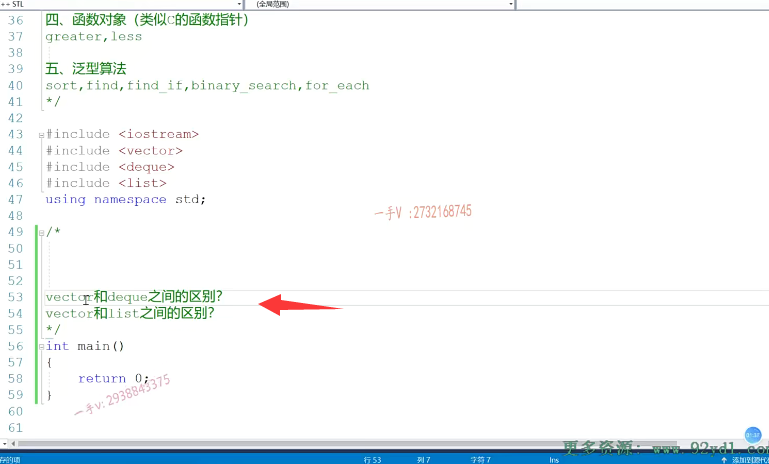

## vector特点

那么vector我们再来回顾一下啊，vector的这个特点vector特点就是它底层是一个。数组啊，动态开辟的动态开辟的数组内存是连续的啊，内存是连续的，内存是连续的。内存是连续的，必须呢，在扩容的过程中啊，随着我们元素越多，那么我们。以二倍的方式呢进行扩容啊，二倍的方式进行这个扩容的啊。

那么，大家要注意二倍的方式进行扩容，我们容器里边儿vector容器里边儿元素越来越多，那也就意味着它需要很长很长连续的这个。一片的内存空间，因为它是个数组嘛，数组的数组的每一个元素的内存，它都是在内存上都是连续的，对吧啊，二倍的方式呢，进行这么一个扩容。啊，动态数据内存是连续的2倍的方式呢？进行一个扩容。好的吧，

这是我们vector底层的一些呃特点，

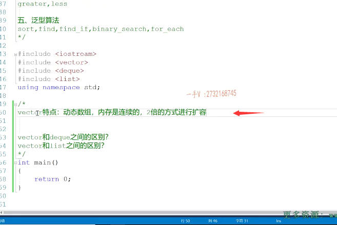

## vector容器扩容

那么当我们去默认定一个vector的时候啊，默认定一个vector的时候呢？啊，那么。这个容器底层根本就没有开辟过任何空间，当我现在呢，通过push back或者insert方法呢，给这个vector容器添加元素的时候啊。它才从0到1到2到4到八唉，这样的2倍的方式进行扩容啊，扩容所带来的这个效率呢？不是很高的啊，不是很高的，我们之前说过，因为它要在新的内存上，是不是拷贝构造新的对象啊，用原来老内存上的对象。在新内存上，拷贝构造新的对象，然后再把原来老内存的对象一一进行析构，再把原来老内存进行一个free。

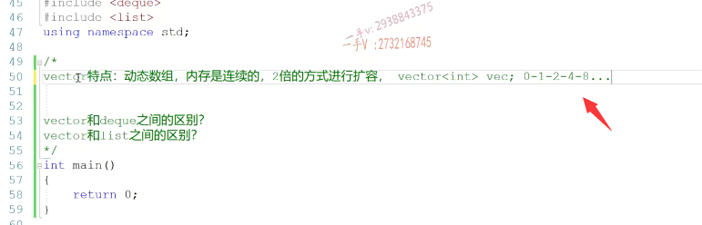

## reverse()预留空间

是不是那我们有一个reserve这么一个函数啊？reserve这么一个函数预留空间。我们可以定一个容器，然后给它容器呢底形，这个底下的这个数组呢，预留20个元素的空间。这是空间并没有给容器添加元素，对吧？

我们当时还给大家做过了reserve，跟resize的区别。好的吧。这是vector的一个特点啊，

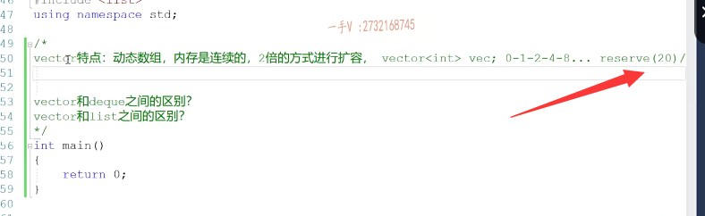

## deque 特点    

## deque扩容

那么deque的特点是什么呀？deque的特点那么首先我们要搞清楚deque呢，它底层是一个什么样的数据结构对吧？它是一个动态开辟。的二维数组空间啊，动态开辟的二维数组空间。它的第二维。啊，它的第二维。第二位是固定的，是固定长度的数组空间，

也就是扩容的时候啊。在我们这个动态开辟的二维数组，就是deque底层进行扩容的时候啊，扩容的时候。啊，扩容的时候。我们扩容怎么扩容呢啊？扩容是怎么扩容来着？大家还有没有印象？是把一为。是吧，第一为。e为。的数组进行了二倍，是不是扩容啊啊？

低维数组低维的数组呢？进行一个二倍扩容。啊，进行二倍扩容。然后呢，再把我们原来的第二维的数组呢，放到我们新扩容的第一维数组的中间排放，因为它要支持前后的是不是？插入跟删除啊啊deque难，双端对立，双端就是它支持呢，这个前边儿跟后边儿啊的插入跟删除操作都是o1的操作。啊oe的操作，我们在讲北困的时候给大家把图也画了啊，希望大家呢跟着我们。

之前讲过的，得空的这个内容呢，把这里边儿呢回忆回忆啊回忆回忆。好，我们回顾完这两个

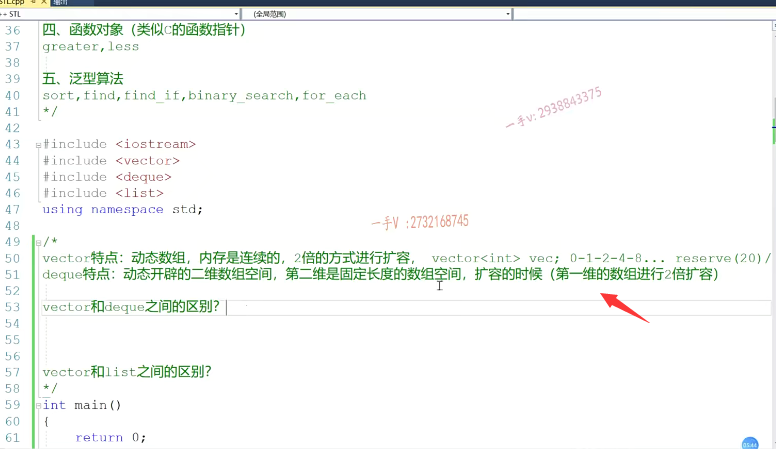

## deque底层内存是连续的吗

曾经面经上还出现过这么一个问题，他问你啊，被困底层内存是否是连续的？这是我们面筋上出现的原原本本的问题啊。面积问题。大家来考虑一下这个问题，北控底层内存是否是连续的呀？

啊，这个答案肯定是并不是啦，因为底困底层呢，并不像我们vector啊，容器底层是一个数组，它内存全部是。连续的啊，那底困底层是一个什么数据结构啊，它是一个动态开辟的二维数组，它的第二维都是独立扭出来的。它的第二维都是独立扭出来的啊，也就是说每一个二维是连续的啊，每一个。每一个第二维，第二维。

是连续的，因为它每一个第二维也是一个数组嘛，对吧？但是呢，所有的第二维都是连续的吗？它是动态开辟的二维数组啊。啊，不是所有的第二维的这个数组都是连续的，对吧？你也可以称作它是分段连续的啊，分段连续的。

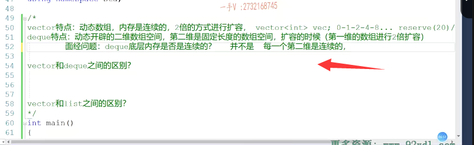

## deque底层 画图

在这里边儿，在这里边儿呢呃，简单画一下啊，这是我们deque对吧？

我们deque呢哎。这每一个第二维呀。它本身呢是连续的，但是所有的二维是连续的吗啊，上面儿这个跟下边儿这个第二维是连续的吗no？no，那是我们自己重新扭出来的，对吧？所以呢，他问你deque底层内存是否是完全连续的，或者是否是连续的，那并不是你可以呢？在这里边儿，你可以呢，用纸笔啊，

把底困的这个底层的这个结构呢，给人家画一下对吧，给人家画一下。啊，画一下我们就能很直观的看出来，它并不是完全连续的。

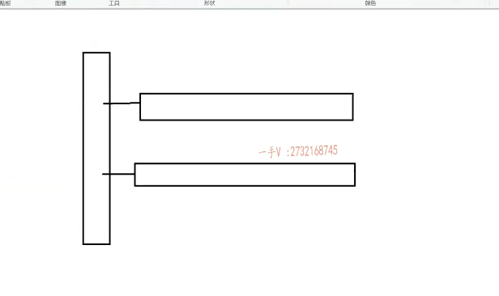

## vector 与 deque 的区别

那在这里边儿，我们来看一看vector和deque之间的区别啊，deque之间的区别。

### 底层数据结构

那么，首先呢，在这里边啊。它区别肯定是==我们首先从这个底层数据结构来回答==。底层数据结构，那底层数据结构肯定是不一样的。

是不是不一样的了啊？这个是不一样的==vector底层呢？它是一个动态数组，==

==而deque底层呢？是一个动态开辟的二维数组==。

### 中间和末尾的插入和删除复杂度相同，但是前面的插入和删除复杂度不同

那么前后前中间后边插入，删除元素的时间复杂度。是否一样？它们在中间和末尾的插入删除是一样的，

是o1，

但是呢在==最前面啊，最前面进行元素添加的时候呢，人家deque难也是一个o1，因为人家是个双端队列嘛==。对吧，要在前边儿插入元素，直接插入就行了，其他的元素根本不涉及移动，因为人家双端队列呢，可以往上扩展，往下扩展是不是都行啊？但是呢，

vector行不行啊？==vector就只是一个一维数组动态开闭的一维数组，它要给最前边儿添加元素的话，后边儿的元素都得向后挪。所以它的时间复杂度是一个on==。

那如果要问个区别的话呢，那在这里边儿就说啊，如果我解决的这个问题的应用场景里边儿涉及我们元素的这个。前边儿啊，后边儿前边儿也要这个嗯，增加删除，后边儿也要增加删除，==比如说我们需要一个队列。这么一个特征结构的话，我们应该选择deque，==应该更好一点，

因为vector呢，在我们容器的首部进行增加删除的时候呢。它们的时间复杂度是很低的on。好吧，

### 内存使用效率

第三个。对于内存的使用效率来说。这个vector当然是低了啊，vector当然是低了，vector当然是低了啊，那么为什么说vector当然是低了呢？因为victor在随着扩容，我们需要更大的内存，连续的啊，连续的一片的内存空间。

啊，它需要的内存空间必须是连续的。啊，因为它是一个一维数组嘛，而deque需不需要啊？deque的第二维数组都是独立,是不是new出来的啊？这个第二维数组并不需要完完全全待到一块儿，连续的内存空间当中。只要有空闲的内存块儿，唉，足够我们这个第二维存放，我们就可以把这个第二维放到任意啊，足够的内存块儿里边。没问题吧？

### deque使用内存效率更高

那也就是说呢，在这里边儿我们deque，对于内存的使用效率是不是会更高点啊啊？==只要你有适合我第二维大小的内存块儿，我就可以分配成功==，
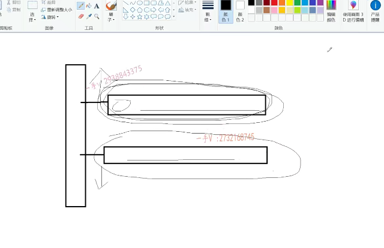

我不需要那么大连续的内存空间。是不是啊？那么可以可以分块儿进行。数据存储啊，可以分块儿去进行数据存储，不需要内存空间必须是。一片。啊，连续的啊，不需要内存空间必须是一片连续的，

这也是我们这两个容器底层数据结构不同啊，给它们带来的这个区别

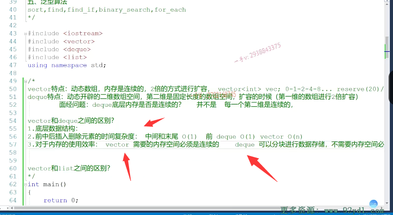

### 中间进行insert或者eras erase。vector和deque。他们的效率啊vector和deque。他们的效率谁能好一点

好的吧，希望大家在这里面儿呢，能够把它搞清楚啊，把它搞清楚。那如果在这里边非要问，非要问啊，非要问在。中间进行insert或者eras erase。vector和deque。他们的效率啊vector和de kun。他们的效率。谁能。

好一点。啊，谁能好一点？谁能差一点啊？那么同学们啊。

你要仔细的去分析一下，从时间复杂度上来说啊，你在vector跟de kun啊中间进行insert和erase，因为都要涉及数据的移动。数据的数据量越大。那么，移动的次数呢？移动移动所花费的这个次数也越多，移动所花费的时间是不是也成一个线性的一个比例增长啊？对，

所以我们说它们的时间复杂度都是on。

啊。但是呢，虽然设计挪动，但是谁更好挪动一点呢？谁更好挪动一点啊？大家想想谁更好挪动一点？当然是vector了，因为vector的内存，它是完全怎么样啊？vector内存呢，它是完全连续的，完全连续的啊，完全连续的。不管是我们给这里边儿进行一个元素的增加，

还是元素的删除。那么，其他元素呢？在进行挪动的时候是很简单的，为什么这也得益于它的一个好处，它的内存是完全连续的啊，一个一个往前放，或者一个一个往后放。这样是很方便的。对的吧。

但是呢，如果把这个操作应用于我们的这个deque呢啊，它就没有vector这么方便了。它有没有？它就没有vector这么方便了，

大家来看一下，我给大家简单的去画一下啊。那大家来，比如看这个啊，比如看这个，这是一个我们把这个。后边儿这块儿当做尾部，把前边儿这块儿当做头部啊，这么一个deque。那么，你来想象一下啊，你来想象一下这里边儿，==如果说是进行一个删除的话。要把这个删除掉。那后边儿的元素是不都要往前挪呀？==

==但是呢，这块儿元素跟这块儿元素所在的内存是连续的吗？不是连续的，不是原不是连续的啊，不是连续的，所以呢，在这里边儿啊，在这里边儿，我们这个元素在往前挪的时候，这个元素要挪到哪里去啊？这个元素是不是要回过头来挪到？是不是这个位置啊？因为原来这个位置的元素是不是要挪到已经删除的这个元素的位置，然后下一行呢？那元素依次呢？都要往上跑。这个稍微就慢一些了，指令肯定就多一些了，==

==为什么因为这两块儿内存呢？它不是连续的==。对吧，它从这儿。要上到我这儿的这个地方。那是不是必须得先访问我一维？唉，从这个元素呢，先访问我一维上边儿的这个元素位，上面这个元素位是不是存了我们这个？二维数第二维这个数组的起始地址啊，然后再。

加上一个合适大小的偏移量。才能找见呢，我下一行元素应该挪到上一行元素的哪个位置？这肯定呢，要比我们内存连续的vector上进行元素挪动要复杂一点了。对吧啊，所以呢，在这里边就是由于deque啊的第二维。空间啊，第二位内存空间不是连续的，所以。==在deque中间进行元素的insert插入或者erase啊。这个造成这个元素移动的时候。比vector要慢，因为vector呢，这个容器底层的内存是绝对的连续的啊==，绝对的连续的我们一个for循环。大家都往前挪，或者大家都往后挪就可以了啊。实现简单，那就意味着我们挪动所花费的代码指令要少嘛，所以呢，执行的肯定更快嘛。CPU要执行的指令会少嘛，执行的肯定会更快嘛。啊，

你挪动的复杂，多挪挪动的这个操作比较复杂，比较多，那么意味着生成的指令就多，指令就多。那么CPU执行起来肯定要费时间，肯定要慢OK吧啊。

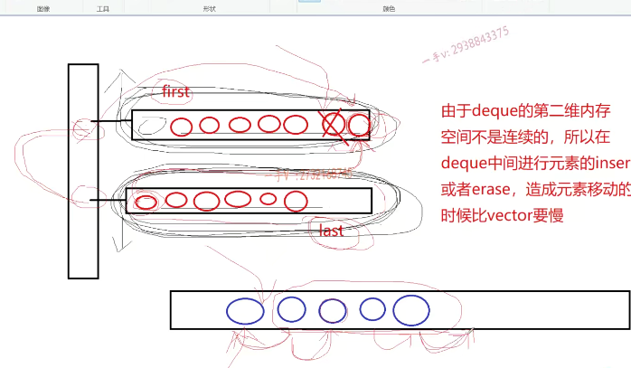

那么，虽然说我们说deque呢和。vector呢，在中间插入删除的时候呢，这个时间复杂度都是on，也就是说呢，相对于两个容器本身来说啊，你进行中间的元素插入删除。

是不是这个操作所花费的时间呢？是跟你的元素的数据量是有关系的，你元素的数据量越多。你进行移动的这个所花费的时间也越多，你数据量越小，移动所花费的时间也越少，这个比例就是一个线性比例。啊，就是个线性比例on对吧？虽然都是on，但是我们也要考虑实际，考虑它们挪动的方便性，是不是在vector中，因为内存是连续的，它们挪动比较简单，

因为底困呢，底层第二维空间不是连续的，所以它们挪动元素所花费的时间。要比vector肯定要长啊，好那么在这儿用图画了以后呢，大家应该就知道在这里边儿啊。在中间进行erase，我们单单拿vector和de kun来说，是不是他们谁的效率更好一点啊？那肯定是。内存连续的vector了，谁能更差一点呢？那肯定是deque了，因为它所涉及的元素移动啊，没有vector方便。

好的吧啊，那么我们从这个四点呢来聊了一下victor和deque之间的区别啊，面试官特别喜欢。

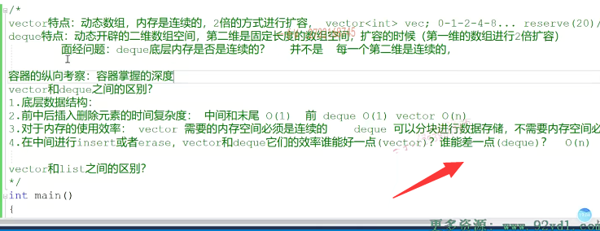

## 纵向和横向对比

对容器进行一个横向的对比啊，它先从纵向来考察啊，

==先从纵向来考察呢，你对vector容器的纵向考察啊，纵向考察的是你容器掌握的深度，==

你是光会用呢，光知道它常用的接口呢，还是说你理解它底层的这个数据结构内存扩展方式还有？一些跟我们效率相关的一些东内容啊，

==那容器的横向考察，那就是考察呢？容器啊，各个相似容器之间的这个对比啊，各个方面的对比，==

比如说底层数据结构。前中后元素插入删除的时间复杂度，还有内存的使用效率啊，我们各个方面都要去考虑一下。而同学们在学习这个容器的时候呢，希望呢，也要通过我们在这里边儿的总结啊，要多思考思考，

那你可以呢。边听边拿出纸笔，画一画，画一画，它们的这个底层的这个数据结构啊，从数据结构上我们来看。

他们的增删查内存使用效率，数据结构本身都有哪些不同的地方？

好吧，那么这个我们就把vector和deque，我们就说完了。大家可以。再想一想，我们刚才所说的这些问题。OK，

好。考虑完这一块儿呢

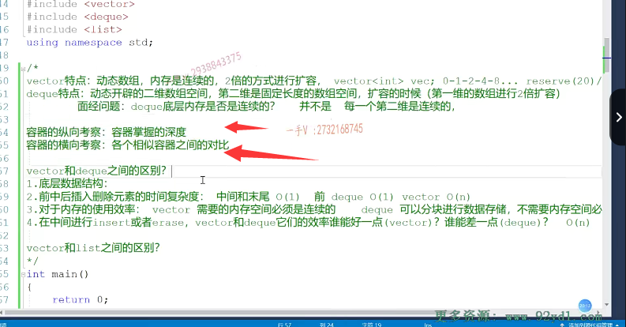

## vector和list的区别

我们再来看vector跟list的区别啊，

那么其实呢，对于这两个问题应该是vector跟deque之间的区别呢，

对于我们大部分同学们来说呢，是比较就是分不清的啊，

因为他们。这个毕竟啊，有点儿相似啊，都是跟数组相关的，

但是呢vector跟我们list之间呢，那区别就挺大的了啊，区别就挺大的。

## 其实就是比较数组和链表的使用 哪个好

那么，==vector底层是一个动态开辟的数组，==

==而list底层是一个双向循环链表。==双向循环链表对吧？

所以呢，==问vector和list之间的区别，那可不就是问我们什么时候用数组好，什么时候用链表好吗？==

对着没有啊，就是这个意思啊，就是这个意思，

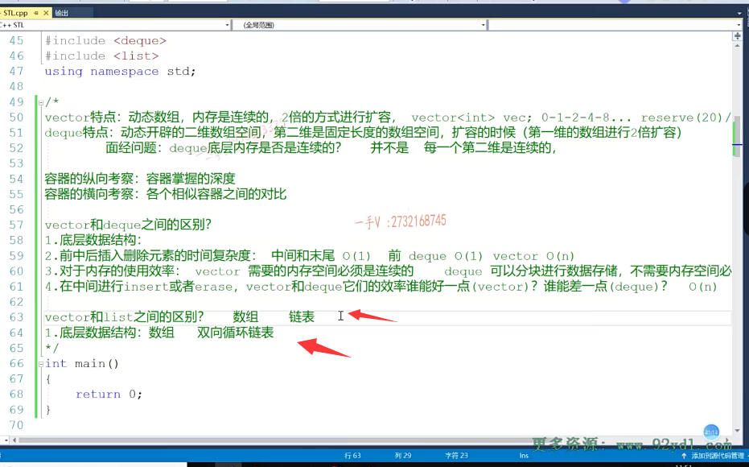

那大家都知道啊，数组的一个特点呢，就是它的这个增加删除是个on。

==对吧，因为它涉及元素的这个移动啊，但是它的这个特点呢啊，那它的查询也是要从这个零号位元素一个一个搜索，它也是一个on，==

==但是它有一个特点啊，就是随机访问，它是个o1。==

## 数组的随机访问O(1)

对不对啊？我们经常写这样的代码嘛呃应的I=0 I小于，比如说一万对吧？++I那在这儿呢我们。

比如说呢，我们随机访问呢，这个arr以I号为元素没问题吧啊，

在这里边儿呢。这就是我们所谓的数组的随机访问，给一个下标访问下标呢指定元素位的一个值。

这个操作不管你是访问这个数组的第零号位元素，还是访问数组的第100，1000，一万号位元素，它的所花费的时间呢？是一样的。

所花费的时间是一样的啊，没有任何的区别，不会说是访问零号位元素，就快访问一百一千一万号元素就慢。

对吧，因为这是直接通过呢，这个下发相应的一个地址，通过CPU下发相应的一个地址，我们就可以直接访问到了啊，就可以直接访问到了，

所以数组的随机访问呢。这实际这个非常快的操作啊。

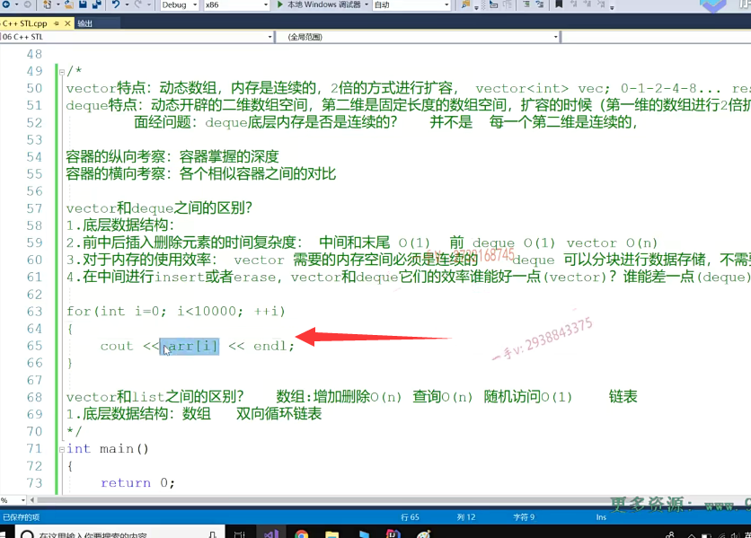

## 链表的插入和删除都是O(1)  节点内存上不是连续的

链表的好处在于增加删除一个结点啊，那么对于这个数据结构不太清楚的同学，可以留意我后边儿的这个数据结构的这个课程啊。

那么，我们先来说增加删除呢？它是一个o1操作。

啊，就增加一个节点，删除一个节点，因为在链表中每一个节点的内存不是连续的，

它是通过前一个节点所谓的这个。地址域哎来记录了后一个结点的地址。

==它是通过这样的方式，就是每一个节点在内存上啊，每一个节点在内存上啊，它都不是连续的，==

所以呢，当我们在链表中增加一个节点或者是。删除一个节点的时候呢，不涉及其他节点的移动，根本不需要移动，因为它们内存不是连续的。所以它增加删除是o1。

## 但是增加和删除的时候  也要考虑搜索的时间

是吧，但这也要分情况啊，如果呢，你在我们的链表的头尾增加删除呢，真的是o1啊，

或者说你在我们中间。你要找到你要你想这个删除的结点了，或者找到一个位置，你想增加了对吧？

==那增加删除结点本身是o1，但这里边儿你我我我们要考虑。这个它搜索的事件啊，要考虑搜索的时间==，

因为。我们不一定就知道我们要想在哪里插入，在哪里删除，对吧啊？

链表为什么呢？因为链表的一个比较坏的，这个比较差的一个操作就是查询啊，

因为呢，它不像我们这个数组，我们有下标，我们是不是就直接可以访问某个元素啊？

啊，你对于链表来说，你几就是你知道你想访问第四个元素，第四个节点，你没有办法，

==你也得从这个头节点一个一个通过next。啊，指向这个结点的next一个一个偏移到第四个节点==，对吧？也就是说呢，

链表的搜索呢，它是一个on。啊链表没有随机访问，

## 总结2

## 增加和删除多，优先链表

所以怎么说呢？对于vector跟list的区别就是如果你增加删除多，那我们可以优先选择链表。

啊，优先选择链表，

## 随机访问多，优先vector

如果你有随机访问，操作多就比如说呢，你可能要在我们代码中使用，经常使用这样的操作啊，使用容器。啊，这随机访问当然呢，对于你要使用随机访问也只有vector提供了中括号运算符的重载函数，

## 没有必要给链表重载 中括号，因为效率是O(n)

对于list的是个链表啊啊。根本就没有这个运算符的重载，因为提供这个运算符的重载根本没有必要。根本没有必要，因为它效率是一个on对吧啊，

==你访问第一个节点就是快你访问后边儿节点就是慢。哪个节点在前访问的就快？==

哪个节点在后访问的就慢？

这是跟我们数组不一样的地方，好的吧啊，数组双向循环链表啊，双向循环链表。

那么，在这里边儿呢？我也希望大家呢，能够去。能够去关注一下。咳咳。能够去关注一下我的这个。博客啊，能够去关注一下我的博客，在这个博客里边儿呢，我有专门的这个。

JAVA和C++的这个知识内容分享包括在这里边儿，我对C++stl这个容器的这个总结啊。

总结也会有一些非常详细的内容呢，我们都给大家总结到一块儿了啊，帮助大家呢在我们。这个春招实习生招聘之前，

或者是我们校招秋招之前啊，能够对该部分呢做一个详细的这么一个。啊，复习啊，以及总结好，那么希望呢？

通过我们这样的一个这个讲解的话呢？大家能够对于我们vector deque list之间这么一个横向的对比啊，有一个了解，

一般我们都是拿vector跟他们对比，一般不会说是问deque和list之间有什么区别。

对吧，如果真要问，那么我们也从它的底层数据结构给他们说一说他们的不同点。好的吧啊，

思路就是这样，希望大家通过这一节课的讲解呢，能对于我们的这个顺序容器的vector  deuqe   list有一个。更深入的了解啊，了解他们的这个纵向和横向之间的知识好，那这节课就到这里下节课，我们再

# 补充

## vector deque list 为什么是顺序容器？

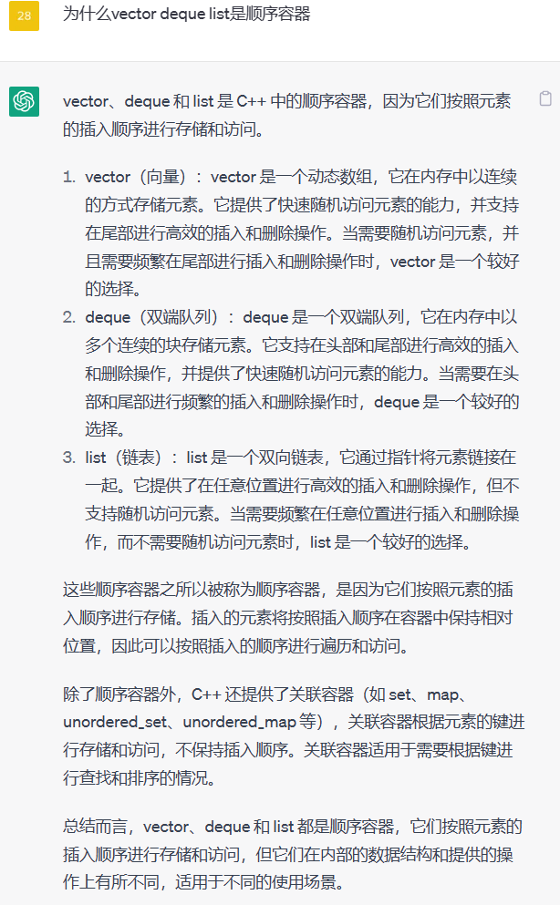

