# 无序关联容器

大家好，欢迎继续收看石磊老师的视频课程啊。

啊，这节呢，我们的这个主题就是来讲这个关联容器啊，但是很可惜的是啊，刚才已经录了，快有30分钟的这个课程啊。啊，突然发现呢，我的麦没有开啊，没有声音。啊，但是呢？我们。我们之前也出现过这种情况啊，这个硬件的问题没有注意。那我的代码呢？在这里边儿讲课的内容做的笔记呢？已经写了一些了啊，在这儿我就直接我们来给大家说吧，好吧，来给大家说吧啊。那么，我们剩下的我们再把它写完啊，

## 关联容器里边儿包含了无序的关联容器和有序的关联容器

那我们这节课主要来讲这个关联容器啊，关联容器是我们标准容器的这个第三部分啊，

关联容器里边儿包含了这个无序的关联容器和有序的关联容器啊，

它里边儿主要分为两类，一个是set集合，一个是map映射表。

集合呢，存的都是关键字啊，

映射表，人家不仅存关键字，唉，人家存的是关键字，对应一个值关键字，对应一个值所。这个俗称的键值对儿啊，人家存的是键值对儿。

==无序关联容器底层是哈希表里边儿的元素，是没有顺序的==

==有序关联容器呢底层是红黑树里边儿的元素呢，都是经过排序的啊。==

## 时间复杂度

大家也会发现，他们的类命名也非常有意思啊，基本都一样无序的关联容器啊，在有序的关联容器前边儿呢，都加了一个unordered的下横杠开头的这么一个前缀啊，它们的操作是一模一样的，一模一样的，

无非就是底层数据结构不同啊。

一般上来说呢，我们90%的情况都是在使用啊，这个无序的关联容器，因为大部分的应用场景只在乎我们增删查的是个时间复杂度，==一定要快啊，我们哈希表的增删查时间复杂度能够趋近于o1对吧啊，==

==而红黑数呢是log以二为底的n。==

但是有些情况下啊，对于我们元素啊的增删查时间复杂度是有要求的，需要它快，

但是呢，同样还对我们这个元素的顺序呢也有所要求，

==假如说我们后边儿在讲这个负载均衡的一致性哈希算法的时候呢，我们对于元素呢的顺序也就有要求限制了，此时我们就只能选择有序关联容器啊，基于红黑树的有序关联容器了。==

## keyey重复和不重复

没有问题吧啊，大家呢，对于他们简单的这个呃，简单的这个对比简单的这个基本的内容呢，先可以了解一下啊，先可以了解一下。

那么，这里边儿所说的单重集合多重集合，下边儿的名字叫法也相同啊，单重集合就是。不允许keyey重复，多重结合，就是允许keyey重复好的吧啊，接下来我们看一下啊。

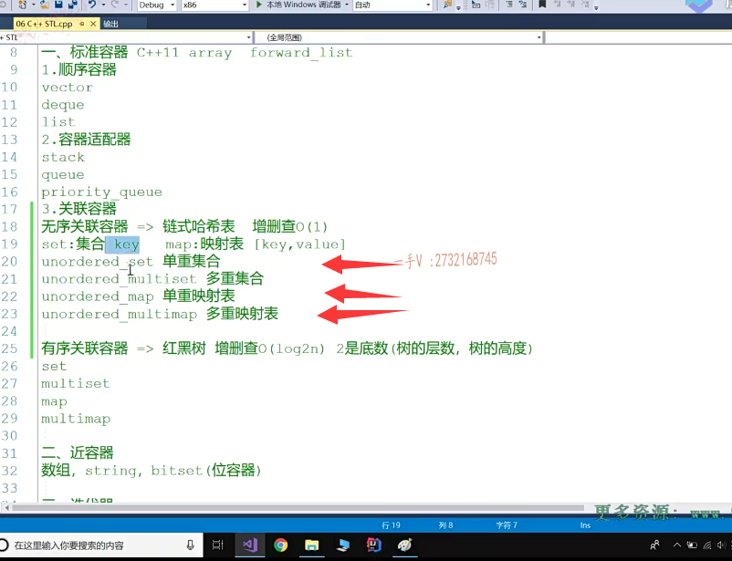

当我们在使用这个关联容器的时候呢，

我们包含这两个头文件，这两个头文件包含了我们的有序关联容器。啊的四个就这里这个呢，包含了set跟multiset这个头文件呢，包含了这个。包含了这个map啊和multi map啊，

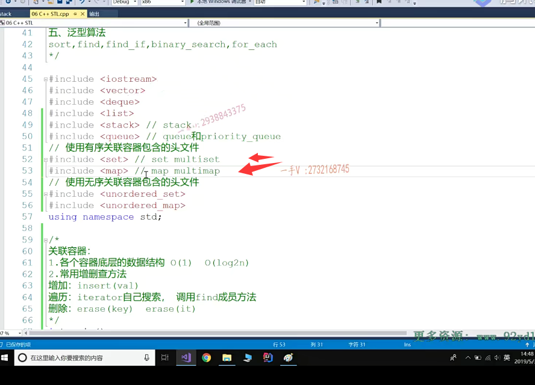

这两个也是同样，如果我们使用无序的关联容器需要包含这两个头文件。

好的吧嗯，行。那在这里边儿，我们给大家举例子呢，来看一下这个关联容器啊，这个使用方式，

我们首先呢，来看一下这个集合啊，我把代码打开，我这个代码呢，代码给大家讲解一下。

在这里边儿，相当于我用整形的实例化了一个集来看一下啊，看一下这个代码实例，那在这里边儿，我们首先呢？定义了啊，用整型实例化了一个单重的无序的，

这么一个集合啊，定了一个对象set 1，那么，它存储的元素是不会重复的啊。

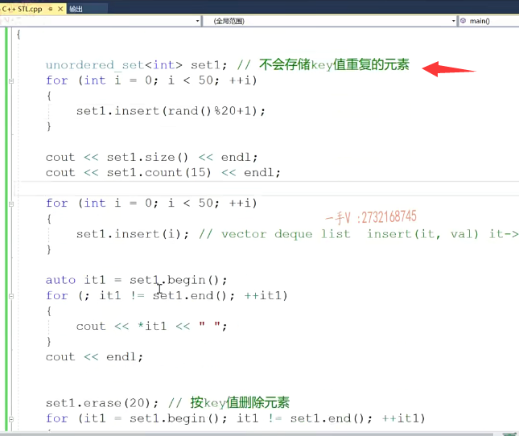

## 关联容器的插入与线性表插入不一样

好，我们先把下边儿的这个代码呢，给它屏蔽上。先来看这块儿。大家来看啊，在这里边儿。

它的这个insert方法啊，就是插入元素，这个不像我们前边儿说过的啊vector deque和list，他们的insert呢，是不是都需要两个参数啊？啊，给一个第一个参数是迭代器，第二个参数是我们要插入的值啊，

向迭代器指向的位置插入一个元素啊，值为value的元素。因为它们是线性表，当我们要插入在某个位置，插入一个元素的时候啊，必须指定这个位置啊，用迭代器去指向一个位置。

但是关联容器就不一样了，大家如果了解这个哈希表或者红黑树的话呢，

## 哈希表插入一个元素，由哈希函数决定

==你应该知道在哈希表插入一个元素往哪儿插，这是由哈希表的这个哈希函数来决定的。==

而不是说是我们想往哪里插入一个元素就往哪里插入一个元素，

包括红黑树也是一样啊，为了这个维护红黑树的性质，每一个元素啊，根据它元素的顺序都有它一个插入的地方，所以呢，对于关联容器的呃添加元素insert，我们只需要啊给给入元素的值就行了。并不需要呢，给出我们迭代器啊，你不用给人家指定，我要往哪里插入一个元素，我们直接插入元素就可以。好的吧，

这是它们一区别啊，

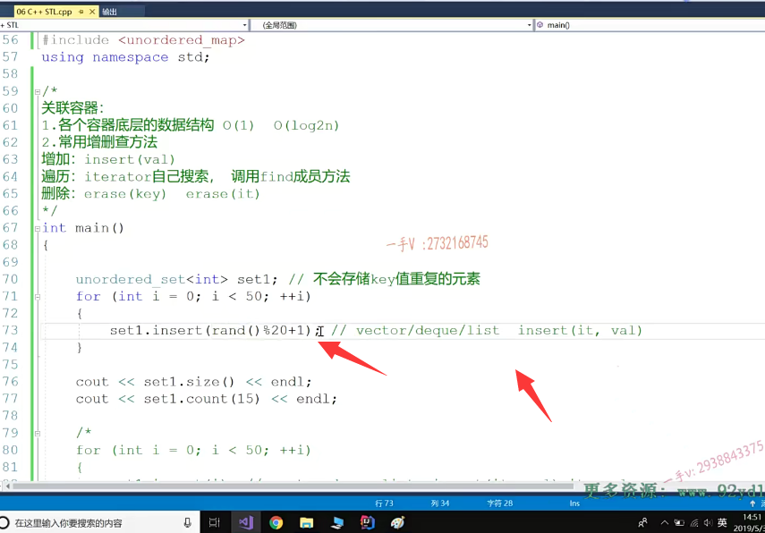

## 单重集合是不存储key值重复的元素的

这里边儿size呢，就是返回这个容器里边儿元素的个数。

这个count呢，就是返回我们key为15的这个元素的个数。

这个定义的是单重集合，你这个数这个实物如果存在的话，它的个数一定是个一的啊，

我们运行一下。那大家看这就表示呢？第一个size 15呃是18。

里边儿添加了50个元素，却只有18个元素，证明这里边儿有很多元素是重复的，而我们的这个单重集合是不存储key值重复的元素的。

所以在这里边儿，我们发现呢，集合的size却只有18，对吧？

另外一个就是count 15，15这个元素出现了几次呢？出现了一次。

==在单重集合里边儿无论。你给count传入哪个元素？只要这个元素存在，它肯定是一次啊，==

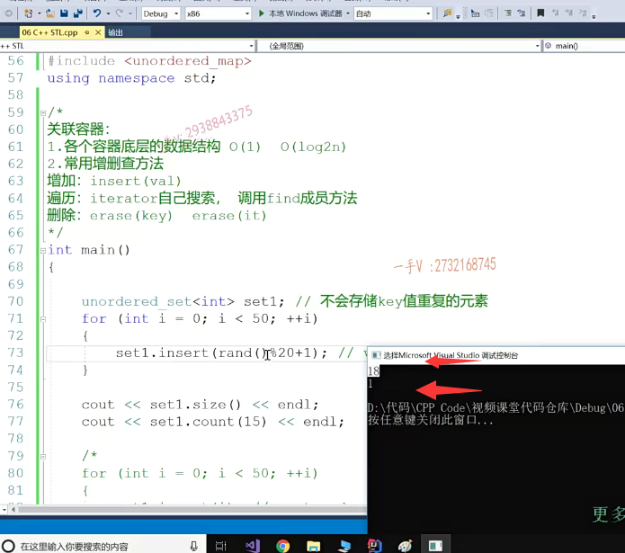

## 换成多重集合

但是呢，如果我们把这个换成那个多重集合就是允许key值重复的啊，允许key值重复的哎，大家来看在这里边儿呢。

size元素的个数就是50个啊，你插入多少个它里边儿就存多少个？那15有多少个呢？15有两个，也就是说呢，现在我给这个集合里边儿插入重复的元素啊，你插几个它也会存几个的。

注意，这是我们多重集合跟单重集合的区别。除此之外啊，就是说呢，一单重集合呢，是不允许key重复的啊。多重集合是允许这个keykey值重复的啊，除此之外呢，他们其他的操作呢，那就都一样啊，就都一样了。

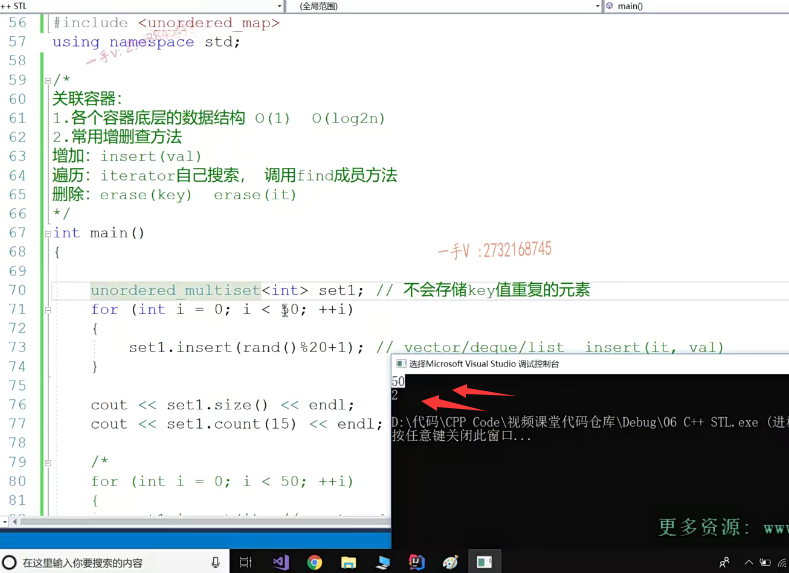

好，接下来我们再看它，其他的这个操作啊。

那么，大家来看一下这里边呢？呃，上边儿这有插入了，那这个我们就不需要插入了好吧啊，这个就我们就不需要插入了。

那么，在这里边儿，这是用来用迭代器呢？

来遍历我们的这个集合容器的啊。用迭代器呢，可以遍历任何的容器是不是啊？

遍历容器的方式都是一样的，在这里边儿我们定了一个迭代器。指向了我们这个集合受元素的迭代器啊，

如果呢，当前迭代器在遍历的时候不等于集合的末尾元素后继位置的迭代器，那我们就继续循环。

后通过迭代器仅引用来访问呢，这个迭代器所迭代的元素的值。

好的吧啊，大家在这呢看一下。Okey

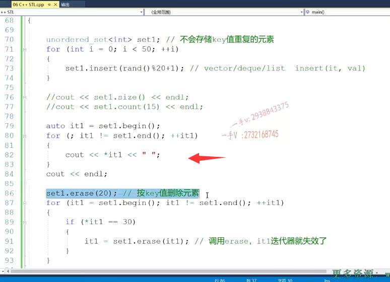

## 删除元素

那么这是我们删除元素。啊，这个演示了一下，是删除元素，删除元素呢，

你可以把key给到这儿，给入这个erase的参数啊。给进去当做13给进去它就呢，在这个集合里边儿删除key为20的元素就直接删掉了。删除你可以直接给个关键字儿给到进去，它就直接删除了啊，

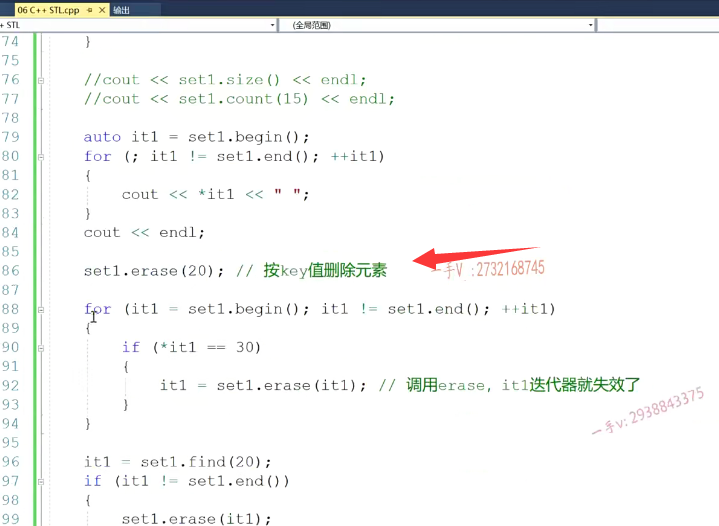

## 使用迭代器删除无序容器元素

另外一个呢，我们还可以用迭代器来遍历自己去找。当是30的时候呢，我们把迭代器呢传给这erase啊erase提供了重载版本，

既可以接受一个key值。也可以接受一个迭代器。

来在我们集合容器里边儿呢，去删除一个指定的元素啊，

那么注意你要进行一个连续的这么一个删除的话呢？==在这儿一定要对这个迭代器呢，要进行一个更新，否则同样就碰到我们迭代器失效的问题了==，是不是？

防止迭代器失效，逻辑要改一下

那在这里边儿要进行连续的删除的话，这个逻辑呢，应该改一改啊，逻辑应该改一改，

如果删除的话。如果删除的话，我从我当前元素是不是继续应该进行一个比较啊啊？

啊，否则的话呢，再进行一个什么呀，再进行一个迭代器的，是不是加加操作啊啊，再迭代进行迭代器的加加操作。

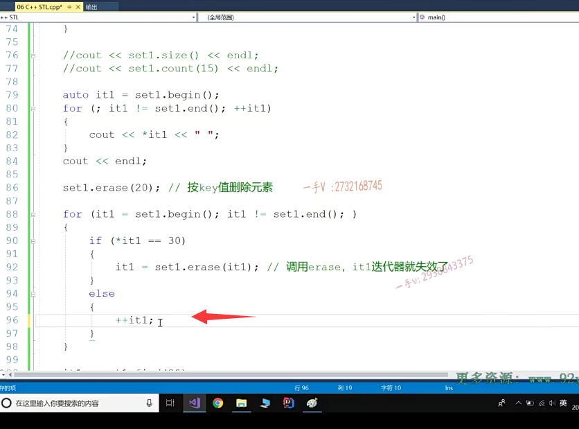

## find函数

好，这一定要对迭代器进行更新啊，

那么集合里边儿还提供了一个成员方法，叫做find成员方法，贩子大家都可以自己测试一下啊，成员方法，贩子在这里边儿。那这个是什么意思呢？

这个就是说呢，在集合容器里边儿给我找啊，这个key20的这个key到底存不存在？

啊，存在的话呢，返回迭代器啊，

不存在的话呢，就返回呢。容器的末尾迭代器，所以我们通过返回式的这个迭代器啊，跟末尾迭代器比较，如果不等于容器，末尾迭代器，那就说明啊。20这个key存在着呢，

那我们直接把迭代器给集合的这个erase方法进行删除就可以了。

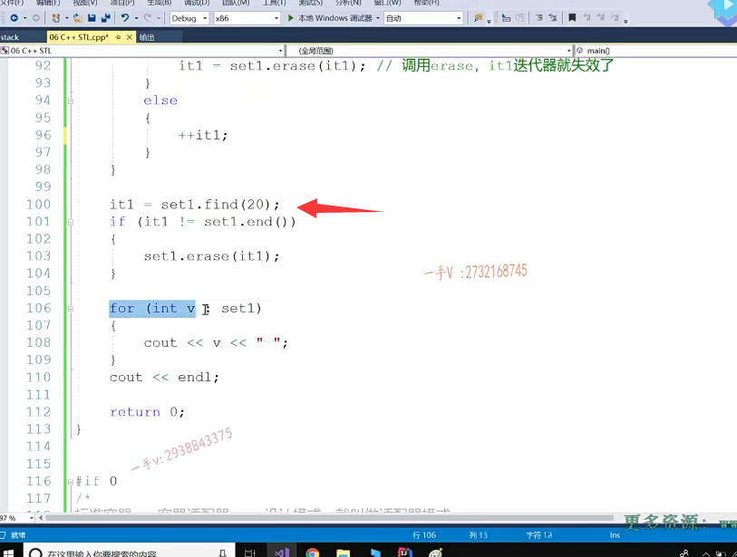

## for each

最后呢，在这里边儿呢，

我们也是用这个for each   C++11标准提供的，这个for each呢来对我们集合里边儿元素进行一个输出。

啊，这底层用的就是迭代器Okey吧啊，这底层呢，用的就是一个迭代器。

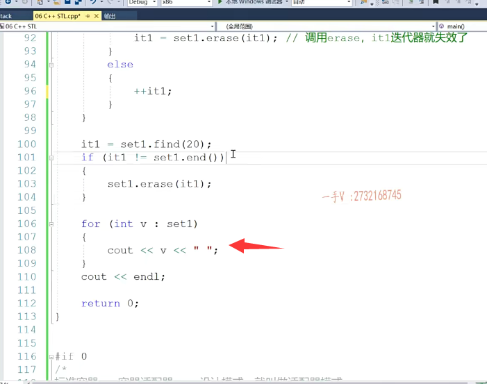

好在这儿呢，大家看一下啊，在上边儿呢，我给大家列了一下呢，这个关联容器就是集合呢。它的一个增加遍历以及删除啊，常用方法的这么一个汇总啊。就是增删改查，

大家先把这个集合的增删改查呢的方法搞清楚啊，我们在后边儿有专项的这个呃实践问题，练习实践代码练习的，到时候大家可以详细的看一下，

在实际的这个应用中，我们是如何呢？在代码上去使用我们这些。CA+stl各种容器的啊，现在先把它们的这个用法底层数据结构一些关键点的内容原理啊，搞清楚。

好吧，增加就是insert。删除就是erase给key或者给迭代器都行。

遍历呢，你可以用迭代器呢，自己去遍历这个集合或者调用我们集合容器的泛的成员方法。传入一个key，它会返回一个迭代器，找见这个元素会指向返回，指向这个元素的迭代器找不见。会返回该容器的n的迭代器啊。好，那这就是我们对。Set的一个说明啊，这就是我们对Set的一个说明，

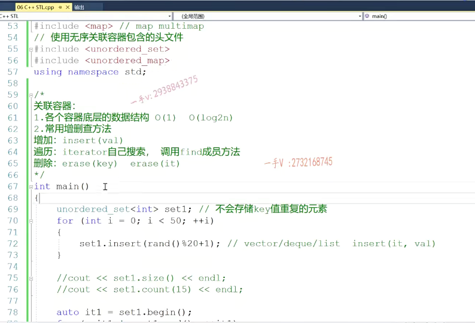

# Map

希望大家呢，在这里边儿通过这里边儿的一些代码示例啊。

能够把set呢理解一下啊set理解一下好。

那接下来我们再说一下这个map啊map映射表，

其实呢，这个map呀，跟这个set呢特别的相似啊，特别的相似。只不过呢，

这个set只存key，而我们map呢，要存key value键值队儿，这个呢，非常非常的常用啊，非常非常常用。

## 存的是键值对

好，大家来看一下。我们map呢，首先啊，大家要搞清楚这么一个问题map呢，==存的不是一个值啊，而是一个键值对儿。==

好吧，所以呢，在这里边儿呢，我们在插入元素的时候啊，我们需要把这个key跟value啊，打包成一个类型，打包成一个统一的类型，整体的类型呢？

才能把它插入到我们的map表当中啊，==实际呢，它是这样的一个类型，它是一个pair类型==

那么在这儿呢？它的成员变量有一个first啊，有一个second在这里边儿呢，这个first就是表示的我们的这个key。second表示的就是我们的这个value值啊，value值second表示的就是这个value值。

## 举例

啊，所以呢，我们来看一下代码示例啊on ordered map。假如说呢，我们键是整形值是什么类型啊？

值是string类型啊，我们包含一下我们string的头文件。好，大家来看一下，在这里边儿，我们定一个map，比如说mapp 1吧。

它增加元素跟我们集合一样的啊insert，只不过现在在我们在增加元素的时候呢，我们可不要写成这个样子啊，我们可不要去写成这个样子。

对吧，因为人家insert呢，不需要你传入两个参数，而需要你把这两个键值呢，打包成一个pair类型的对象。

## makeye_pair方法

然后再进行一个插入人家，需要的是pair类型，打包以后的人家是用struct的定义的啊，里边儿默认的全部都是公有的啊。打包成我们pair类型。再传到我们的这个insert中，那么大家在这里边儿记住我们有一个买买makeye pair的这么一个方法啊，makeye pair的这么一个方法。

可以把我们这么一个键值对儿打包成一个pair对象。

然后呢？我们就可以把它插入到map表当中了啊，

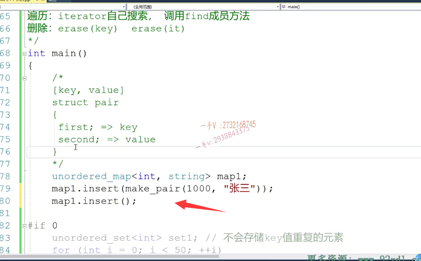

## 另一种方式插入

当然对于c++11来说呢。你看，对于C++11来说，

对于一个结构体的这个对象啊，结构体struct的定义的呃，其实在我们C++里边儿也叫做类哈。

那么，这个类生成的是不是也叫做对象啊？嗯，对于s定义的公有的这么默认访问，限定是公有的这么一对象，其初始化呢，也可以用一对儿大括号来表示啊。啊1010，这是。啊李四啊，也就是说我们插入的话呢，我们也可以这样插入也是非常简单方便的啊插入。

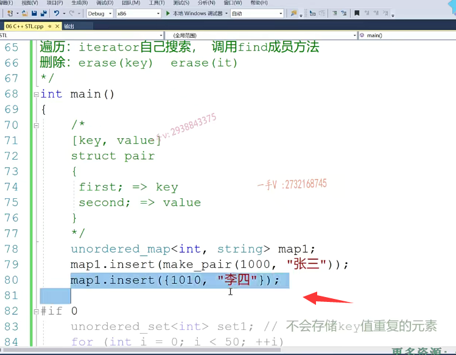

## 运行结果

对吧？其两种方式大家都可以用啊，如果简单的话呢，我们就用这种方式。没问题吧，那么再插入一对儿啊1020啊1020这是王五啊，张三李四王五我们插了三组数据。是不是插入了三组数据啊？

那么在这儿我们打印一下map一点size，这里边儿就表表示呢，我们包含的这个。现值对儿的这个个数啊。啊，这是三对儿，是不是哎键值队儿的个数是三对儿？

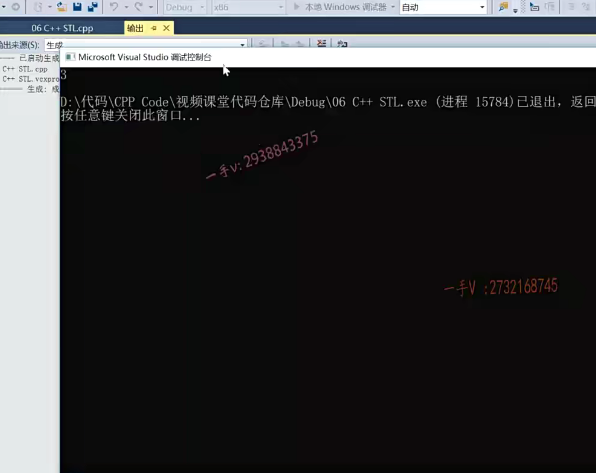

## unordered_map是单重集合

在这儿呢，大家再来看一看。1000啊，这是我们的王凯。王凯同学啊，那在这里边儿发现见重复了啊，单重映射表单重映射表，它是不允许啊，单重映射表，它是不允许见重复

跟集合一样多重映射表是允许。去减重复的。所以在这儿我又插入了一个一一千王凯，你看这里边儿。的这个。

还是三对儿map里边儿的元素的对数呢？

还是三对儿？对了吧啊，还是三对儿从这儿呢，我们就能看到呢，它是一个单重的集合啊，

## unordered_multimap多重集合

那在这儿如果我们改成multi map，你注意啊，其他的操作都一样。猫的条件map呢？只不过是允许key重复的啊，我们运行一下，我们来看一下，唉，这里边儿我们发现呢它。它建制对儿是不是有四对儿值了？

对啊，就是这个意思好的吧。

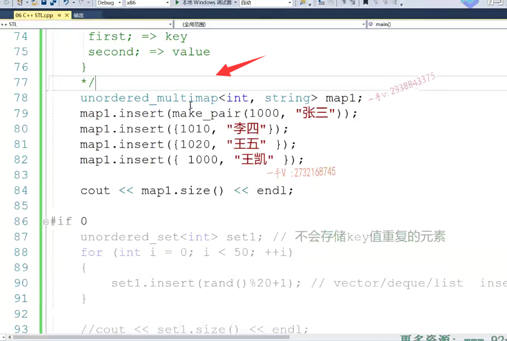

那在这儿呢，我们还可以呢。以这样的方式呢，进行一个查询。

哎，那也就是说呢map呢，还提供了这个中括号儿运算符的重载函数啊。你给传回一个key它，

最后呢，就给你返回呢，这个key对应的这个value值啊

在这里边。好，我们看一下啊。好在这儿呢，大家来看一下。

在这儿，我们以前是不是还是张三呐啊？因为这是单重集合

==最后的1000，王凯呢，并没有进行一个插入==

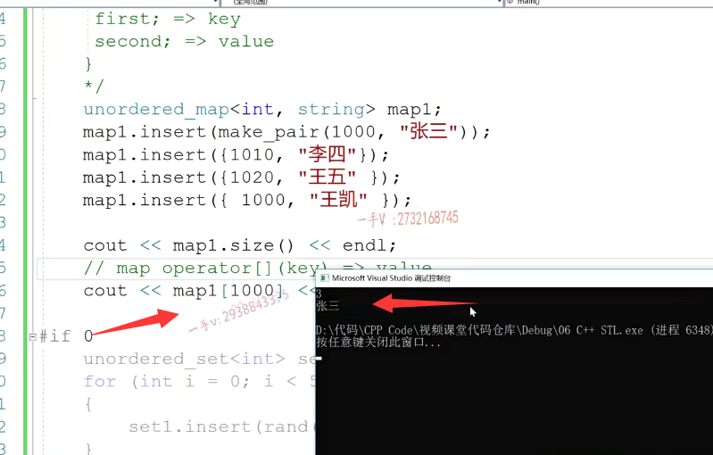

Okey吧，那我们把这个改成。1030吧好吧啊，就这样的一个操作啊，

这是insert。啊，insert插入啊，插入。

## 删除

那么删除的话呢？是怎么删除呢？删除的话就用erase就行了啊erase呢？给一个key就行了1020

这个相当于就把谁给删掉了呀啊把。就删除了啊，

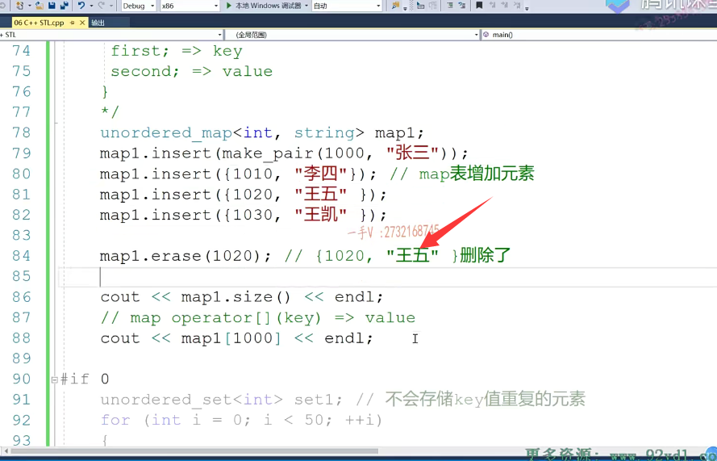

这个是增加元素给map表就map表呢？增加元素啊，增加元素

。好的吧。增加元素查询的话呢，你在这里边儿呢，

==就是查询你可以用中括号运算符重载函数进行一个查询操作。==

那么注意你在用这个中括号儿运算符进行查询操作的时候啊，

## 中括号儿运算符重载函数的副作用

同学们，你要注意它有一个副作用啊，什么意思呢？什么叫做中括号儿运算符重载函数的副作用呢？你看啊，我们前面这儿呢，插入了四个元素。在这删除了一个1020，那么在这里边儿打印，它里边儿间值对儿的对儿数的话，

应该是三对儿是吧？那么看一下啊。唉，三对儿没问题吧啊，三对儿，然后在这儿查询1000这个key对应的值是谁呢？对应的是张三。

然后在这里边儿大家来看一下啊，我进行了一个中括号元素的访问，我访问了。key值是2000的这么一个key对应的一个value。2000在不在？2000根本不存在，大家呢？再运行一下这个程序呢？

我们发现了它的电池对儿已经变成几对儿了。变成四对儿了。

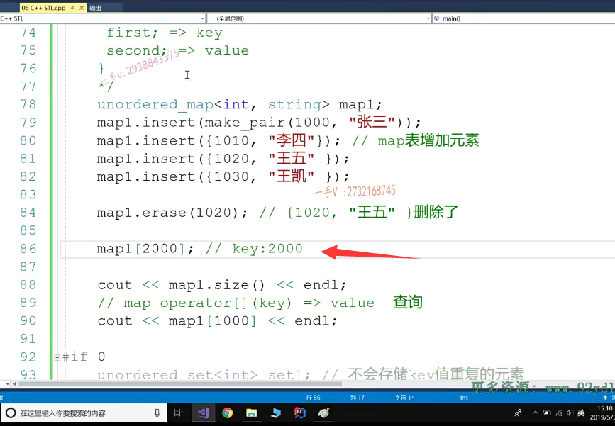

啊，所以在这里边儿，我给大家强调一下啊，给大家强调一下这个map的中括号运算和重载函数，

它不仅仅有查询的功能。啊，第二个呢？第二个啊，如果key不存在。它会。啊，他会插入一对。数据。

key以及我们value的这个默认值。

我现在value是个类型，所以它插入的就是一个key，然后默认构造的一个对象，就这么一个建制对儿插到我们的这个map表当中。

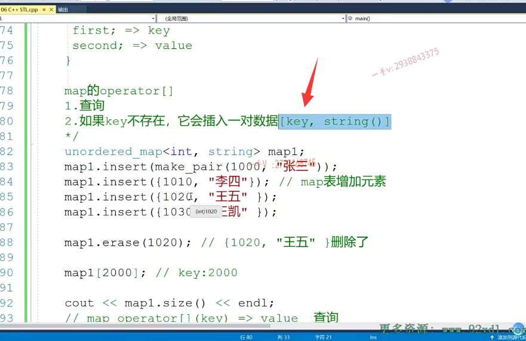

## 中括号也有插入的功能

也就是说呢，这里边儿你如果用中括号运算符进行查询，如果这个key不存在的话，它还给你，它还会给你插入元素的。

他会给你插入素的。Okey的吧啊，它会呢，

给你把也就是说它的中括号运算符重载函数是这样子的啊。

啊printer中括号const key。就是如果它发现呢，这个key根本不存在啊，它还会给你插入呢，这样的一个key啊。key那么key就是你传进来的这个key对吧啊？这个key对应的值呢？就是我们v类型的默认构造的一个对象，然后呢，它会给你把叉五的这个值。给你怎么样啊？哎，它会把插入的这个值呢，

给你返回去，返回它的引用。就是这意思啊，就是这意思。也就它不仅仅会有查询功能，它还有添加修改的功能啊，它有添加修改的功能。

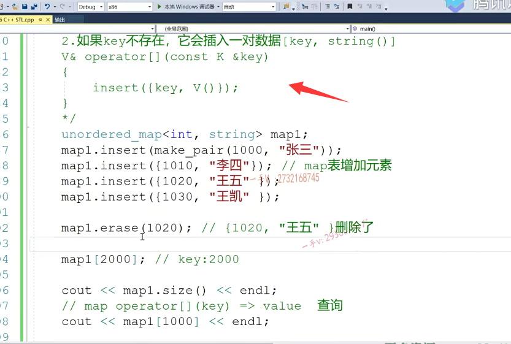

你注意一下，那怎么说呢？你看一下啊，在这里边儿，我给大家应用一下。这个就代表它的查询功能，这个代表它的什么功能啊？在这里边儿哎，

我看一下啊，我这里边儿给大家演示一下。呃，流数啊。这个2000原来在不在呀？不在不在的话呢？它相当于会插入一个2000。value值是一个默认构造的一个词，准对象这么一个减值对儿，然后把value的这个引用给我们返回回来了。然后我们对于呢，它返回的value进行一个复制，这相当于这句话，相当于就是一个insert操作。插入了一个key是2000。

值是流硕的这么一个。减值对儿。啊，注意一下，就这么一个插入操作，就是这个好吧，

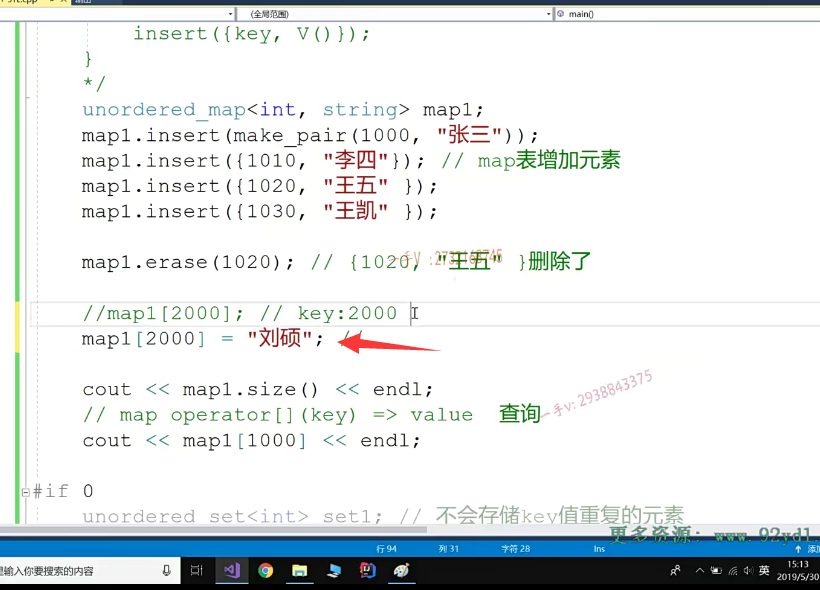

## 中括号 修改操作

那这是什么操作呢1000？啊买p0等于。张三二。这个相当于一个修改操作了，

因为key为1000对应的值存不存在呀？存在的张三。然后它把这个值的引用返回回来了，我们对于它值的引用重新赋值，相当于把这个key对应的value的值就改了啊。

那么在这儿呢，你看我们再差1000的时候呢，是张三呢，还是我们新改的这个张三二呢啊，变成张三二了。对吧啊。好

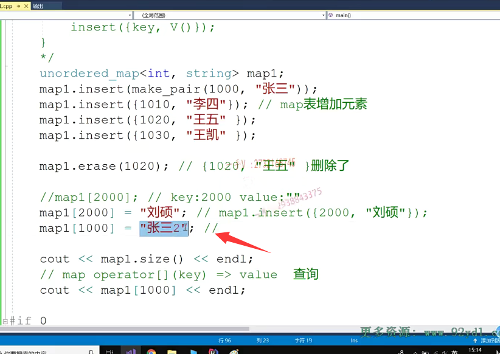

希望大家呢，在这里边儿对它常用的这个增删改查操作呢啊。了解一下啊，了解一下。尤其它这个中括号运算符的重载函数

好吧，我们一会儿举实例啊，大家来看一下啊。好在这呢来同学们，我们再来做一个。

这么一个操作auto it 1=map 1 find你用它提供的find成员方法呢？也可以进行一个查询。比如给一个key1020，这个应该是查不到了，对吧啊？查不到的话还是查不到它返回这个容器的末尾迭代器，如果查到了的话，它就会返回这个键值对儿的迭代器。如果返回值at 1不等于map 1的end表示找着了，找着了的话，同学们你注意啊at 1呢？这里边儿at 1指向的是它里边儿每一个pair对象啊，pair对象。pair对象呢，是把键值都是给它打包起来了，

把键写在pair的成员变量first里边，把value写在这个pair的成员变量second里边啊，所以我们访问的时候就可以这样访问了啊。就是key。at 1指向的first再打印value at 1指向的second。我们这样就可以打印出来了啊，打印出来了。啊幺030，这个key对应的这个y6值是王凯。对了吧啊，这就是我们map。的这个使用查询是个oe的操作，哈希表的查询嘛，是不是啊？大家注意一下啊，

它常用的方法就是这几个成员插入。删除。查询你可以用中括号儿查，你可以用find查都行的啊，都可以的，你注意呢map里边儿存的都是。一对儿一对儿的pair对象，一个一个的pair对象啊，pair对象pair对象里边儿把这个键值打包起来了，但是它没有起key跟value这个名字，而是用first跟second来表示的。所以当我们啊，得到一个指向，我们map容器里边儿一个pair对象的迭代器的时候呢，想访问。

健之队儿，你应该访问这个pair对象的first跟second域。好的吧啊，希望大家把这个呢了解一下。实际使用当中呢呃，就是在我们这个实际使用当中呢，我们什么时候呢会用到这个？什么时候会用到我们这个哈希表呢？是吧？那哈希表呢？它的增山茶的时间复杂度都非常的。d是个o1，是不是啊？那就是说呢，它花费的时间是很少的，

所以呢，在我们。这个。处理什么样问题的时候啊，当我们在处理啊，处理海量数据，据查重复。然后是去重复啊的时候呢，我们经常会用到这个哈希表。经常会用到这个哈希表，那我给大家举个例子啊，那比如说在这里边儿呢，你看一下在这里边儿。我们有。这个我们先定一个常量吧啊a论论是个十万啊的，

这么一个数组AR。好，润润。那么我们先呢？对于这个。大小进行一个循环。循环以后呢，把这个给他们一些数字啊，给他们一些数字。随机数random给一万之间的，这个随机数吧啊1到1万之间的随机数，然后在这里边儿，人家题目要求你干嘛呢？要求你在上面的这个上面的。十万啊，

十万个整数中啊，整整数中统计哪些？数字重复了，并且啊，并且统计。这个数字重复的次数。啊，这个如果我们单单去遍历这个数组的话，我们去做这件事情，可能真的是不太好做。不太好做，不太好做的啊，那在这里边儿主要出现我们海量数据的这个。跟重复查，重复去，

重复相关的时候呢？相关操作的时候，大家一定要想起来哈希表这么一个非常重要的这个数据结构啊，那当然我们不需要自己写一个哈希表了。我们直接可以用我们的on ordered map嗯，我的键可以存你这个数字嘛，我对应的value可以存你这个数字重复的次数嘛。是不是的啊？你看一下我for循环，或者我不用for循环了，在这里边儿，我for each也可以in TV。arr.那么，这是做什么事情啊？

对呀，我在这里边儿呢，首先先把当前这个值在你的哈希表中，我查一下。查一下，我查出来。查一下发现呢，你这个at等于了map 1的end了，表示你这个。你这个你这个数字根本是没出现过啊啊，为了好好看大家把这个写成key吧，好不好啊？因为我们这里边儿key本身是不是存的就是数字啊？没存在，不存在那么这个数字从来没出现过，

没出现过，我把你第一次呢插入到谁里边儿啊？啊，是不是插入到我们的这个哈希表当中啊？哎，只是这个啊。那么你keykey是这个，那你值呢？值重复的次数，你是第一次出现，那你给一个一嘛。那如果这个呀，是不等于map 1的n的就说明呢？这个数字之前出现过。你这个是数字，

如果之前出现过的话。那我们怎么办？我们说给你it对应的，谁second怎么样啊？加加就行。这个就表示你这数字从来没出现过好，我现在把你插到哈希表中给你的次数定成一个能到else，那就说明啊，你这个数字呢，原来在哈希表中出现过，那么你就是重复的数字。我还要统计你重复的次数呢，你这个数字对应的这个键啊键表示数字，这个值就表示数字重复的次数。给你这个对应的second，

second就是值嘛，对吧啊？进行一个加加。没有问题吧，然后出来以后呢，我们就可以遍历遍历谁了，出来以后我们就可以说遍历，我们这个容器了啊，遍历我们这个容器那么同学这个遍历容器呢，我们可以这样写就行了。啊p，然后用fore嘛啊map 1我们说了map里边儿全部是不是都是我们的啥呀？都是我们pair对象啊，那当然了，你要是。

我把这两种方式都写一下吧啊，两这两种方式都写一下，我现在先用这个fore。一会儿再用迭代器，因为fore底层也是迭代器，那么注意在这里边儿相当于把我们容器里边儿每一个pair对象啊，都赋给我当前的这个局部变量。那么最好你定一个引用，不要让对象发生拷贝构造是不是啊？直接引用呢？我们map里边儿对象就可以pair对象就可以了，在这儿呢，我们判断ifp点second如果大于。大于一才是不是说明这个数字是重复的，我们来看一下这表示这个数字是谁啊？

那就是p点儿first它重复的次数count。出现的次数呢？是多少次呢？就是p点second。唉，这个就完了，那如果你second=1，那就是你只出现过一次，那我们就不对你进行一个答疑了。这里边儿这个元素打印出来肯定很多啊。这个肯定很多的是吧？多的话我们来少少一点儿吧，我们比如说100个，然后这里边儿这是20个元素好吧啊。啊啊，

不是20个元素，就是随机一到二十二十之间的，这个随机整数啊。好，我们。调用一下，这里边我们有点问题啊。啊，看一下在这里边儿，我们的这个问题是什么呢啊？我们来看一下这里边儿的错误，无法从pair转换成。STD啊，pair。呃，

我们看看这个错误呢是什么呢？如果在这里边儿不用引用啊，我看行不行？不用引用是可以的，是不是那我们先来看一下结果吧啊，先看一下结果在这里边儿先看一下结果。啊，结果你看啊，打全这个数字呢，是不是都是重复的呀啊？没有重复的，它根本就没有打印。对了吧啊，那么在这里边儿引用啊，我们人家这种用引用的话可能呢？

来我们看一下啊，是不是都得让我们用一下这个常引用的？我把所有的项目呢都给人家编译了啊，哎是的，在这里边儿呢。呃，如果你定义普通变量，相当于就是把容器里边儿值给你拷贝一份儿就行了，如果你有，你要用引用的话呢，那你必须得定义常引用啊，常引用因为。呃，你通过fore呢？可以只通过这个引用变量来遍历容器，

而不能通过它来修改容器的好吧啊？啊，所以人家需要你用一个长引用Okey，因为在这里边儿，我们只是一个设计一个遍历嘛，访问读读操作对吧，我们常引用Okey，你这打印的就是这个。好了吧啊，那当然了，你如果不用这样的遍历方式的话，那你还可以用什么样的这个遍历的方式呢？可以用我们的delay器it=map一点begin for循环it。不等于map 1的end加加it啊，在这儿呢，

进行打印。大家看啊，这是it指向的first好吧。这个是it指向的second。啊，打印当然不能这样打印了，我们打印的是it指向的second，如果大于e的话才进行一个打印，如果呢，你数字没有重复出现过。那在这里边儿呢？我是不需要打印的。啊，好运行。也能够打印出来。

怎么样？大家对于它的这个应用呢？能够熟悉吧。啊，先看懂，然后再自己写一下，把它掌握了啊，把它掌握了。实际上呢，在这里边儿啊，这个父循环里边儿啊，我们完全呢。可以用一句话来表示了，如果你对它的这个操作呢？熟悉的话啊。

什么操作呢？就是我们这个map 1中括号key加加就完了。你这么一段代码完全就可以用这么一句话来代替。大家还记着没？这个是不是表示查询操作呀？查询操作啊。那么，如果呢？这个key不存在，它会有副作用就给你插入一个key，然后你的值类型是个int，那就是这样的一个值。值大家都知道，映特括号儿这么一个，这这时候代表我们整形的是不是零值啊？

所以它其实就插入一个key这个数字，以及它出现的次数是零。然后加加因为这返回的是我们值的，是不是引用啊？你加加以后呢？相当于就是。这个数字没出现过，我们给它插入了这个数字，出现了一次。啊，出现了一次。对吧，如果这个key存在就这个数字，原来存在，那么它就会返回呀返回。

这个key对应的value，然后对value再进行加价，是不是跟这个逻辑意义是一模一样的？嗯，大家注意它的这个中括号运算和重载函数的这个应用。啊，我们刚讲了，在这里边我们也能用到运行一下。结果还是能够出现，结果是一样的，重复的数字就都都被我们统计出来了啊。对的吧。好希望通过这么一个海量数据查重的这么一个问题呢，希望大家对于这个map的使用呢。能够更了解一些啊，

更了解一些。好，那么在这里边儿是我们海量数据去重是吧？我们再说一个吧，再说一个我们的这个啊，这是查重，我们再说一个，我们去重啊，去重的这么一个问题啊。那什么是去重呢？就是在上面的十万个整数中啊，上面的这个上面的这个整数中，假如说这里边儿很大，但我们为了打印能方便看一点，我们把这个数据量调小啊。

从整数中啊。把这个把数字呢啊。进行进行去重打印，那也就是说呢，在这个数组中啊，给我找。都出现过哪些数字重复的数字的话啊，如果是重复的数字的话，我就不用去。把它再输出了啊，如果是重复的数字的话，就输出一遍，不用再重复输出了。你如果做去重的话，同学们脑子里边儿应该直接就这个出现，

我们哈希表那哈希表在这里边儿，我们到底是应该选择set还是选择map呢？选择它俩谁呢？那么注意set只存一个key嘛，只存关键字儿，而map是不是要存键值对儿啊？刚才在这个问题当中，我们不仅要统计数字，还要统计数字。重复的次数很明显，这是对这个重数字重复的次数，也是对这个数字。的一个属性的说明，所以他们俩有这个联系，这两组数据之间有联系，

所以我们只能选择这个映射表了。现在呢，我们只需要获取数字啊，重复的数字呢，我们只获取一次。对吧啊，只需要数字这么一种指标，所以我们用集合就可以了，单重集合重复的它就不会存了，是不是？on ordered set.int啊set那在这里边呢，相当于我们遍历这个谁呀？for循环，我们遍历这个AR，

这个数组，直接把它往进放就行了。放完以后，你对set进行一个打印。这里边儿打印的肯定就是不重复的数字了，是不是不重复的数字了啊？in TV还是in TV？我们用set在这儿，我们打印一下。打印输出一下。你看这里边儿打印出来的数字呢，就是我们在这个原始的数组里边儿出现过的数字就这么多。重复的，我们没有进行啊，多次打印重复的，

我们没有进行多次打印。好了吧，这谁帮我们做的呢？哈希表帮我们做，我们只需要遍历一次数据on就行了，在这里边儿，哈希表每次插入呢，它都是一个常量时间o1的操作，跟我们整个儿的这个数据量大小没有关系。去重查重复对吧？哈希表的这个应用确实是非常非常重要啊，非常非常重要。希望大家呢，经过这一堂课的这个学习啊，能够做到。

这个什么呢？就是首先了解这个无序关联容器。他们底层实现是哈希表啊哈希表。他们的增加删除遍历，包括他们的成员犯的成员方法对吧啊？set跟map啊，set跟map集合，跟映射表，他们常用的这个操作。是怎么样子的？在这里边儿，我举了两个例子，对他们的应用呢啊，希望大家能够加深一下印象好吧。像这部分内容比较重要啊，

尤其是哈希表啊，无序的关联容器在我们写项目或工作的时候我们。设计C++的编码，这部分用的是非常非常多的，希望大家把它好好的练习一下啊，把它能够。熟练应用好，那我们这节课就到这里。