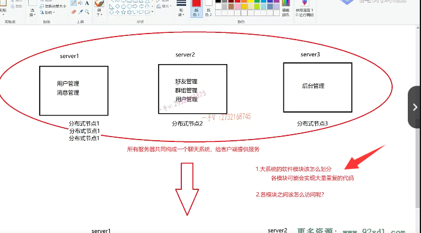
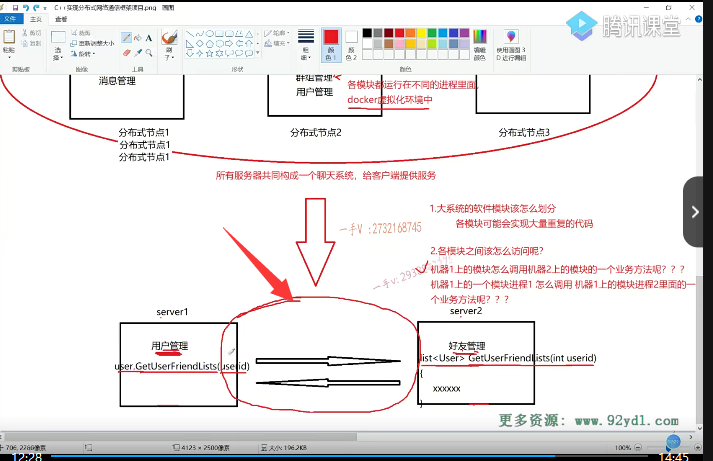
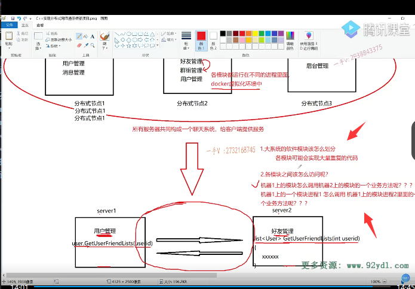

# 1.问题

这节课呢，我们继续来给大家说，我们把这个聊天儿服务器呢设计成我们理想的一个分布式系统的话呢。我们之前一直在说它的一些优势能解决我们上边儿所提到的这些问题，对吧？啊，它全部都是优势吗？对于我们来说啊。那做到这一点，到底方不方便？到底简不简单呢啊？大家都喜欢简单的事情，对吧啊？那么在这儿，我们来看一看。

它所面临的一些问题好大家先在这里边可以自己思考一下。而我们上嘴唇儿碰下嘴唇儿，我们就说，哎，这个系统里边儿有什么模块儿？什么模块儿？什么模块儿？这个大系统的这个的。软件。模块儿该怎么划分？这个不是一个简单的事情啊。对不对？因为很多时候这种大系统的软件模块儿，这种模块儿跟模块儿之间的这个界限并不是非常清晰呀。而且有些业务呢，

有些一些代码，这个模块儿呢？啊，代码段儿呢，又又属于这个模块儿，又属于那个模块儿了，模块儿跟模块儿之间的界限不清晰啊，如何进行一个？这个那也就是它的借鉴不清晰，那我们在分模块儿的时候，模块儿的借鉴还是比。需要划清楚，因为最终各个模块儿是要独立部署的。是不是啊？那你不划分清楚，

也就是说是各模块儿。可能会。这个实线。大量重复的代码。因为你的模块儿也需要这些代码，它的那个模块儿也需要这些代码，你们划分不清楚，大家都在各自的模块儿去实现相同的功能，是不是把大量的这个重复代码？给写了那写了这个本身就是一种。不好的设计，而且呢。以后你这个模块儿，你改你的，我这个模块儿，

我改我的。最后，重复的一些公共的代码呢？都改成不一样的，这个软件呢，跑到最后那甚至就是不可控的了。

对吧啊，当然我再说这一点的话，大家可能。可能有些同学他脑子里边构思不出来，你指的到底是哪一些方面啊？那这个当然需要，你有一些大型系统的一些开发经验啊。大家在这里边儿就简单的去理解一下啊，我们整个儿的大系统的这个。

想划分成具体的啊，界限清晰的啊，低偶合的这个模块儿。实际上，它是要做很多工作的，它也是比较复杂的。不像我们前边儿所说的集群，眼睛一闭，只需要扩展硬件机器就可以了。对吧啊，它是比较这个简单粗暴的方式，是不是？但是我们说了它的这种方式呢，并不是说你扩展三台。服务器你就能得到三三倍的性能的提升，

它并不是这样。

# 2.问题

好，那么这第二个。各个模块之间。该怎么访问呢？因为你现在各个模块儿，它都不再什么啦。都不在同一台机器上了。是不是啊？甚至呢？它在同一台机器上，但是它们属于不同的什么呢？不同的进程了。啊，在这里边都属于。

都属于不同的。这个各模块儿都。运行在不同的进程里面。没问题吧啊，现在也比较流行了它。都可以放在这个docker的这个虚拟化。环境中单独运行一个模块儿化的服务进程，是不是啊？好，那这个我们就不给大家继续往下说了，有兴趣的话在这里边儿，我可以扩展一下。啊，这个项目做完，大家都可以理解一下啊。

啊，都可以再去扩展理解一下。各模块之间该怎么访问下边？我给大家画了一个图。用户管理模块，用户想聊天呢。是不是啊？或者说是用户登录成功以后，想给用户展示一下他的这个好友列表，但是呢，用户管理模块儿只负责用户的登录登出注册。修改密码。他并不知道用户的这个好友都有谁。负责管理这个人员的这个好友是属于哪一个模块儿的好友模块儿的？好友模块提供了一个方法。

啊，返回值呢？是一个list列表里边儿放的都是用户user啊get user friend list。获取这个用户的好友列表啊传的是一个user ID。通过传入一个用户唯一标识用户的一个主键，得到该用户所有的一个好友列表。

各位啊，原来在这个单机服务器跟这个。集群服务器当中。我们说了这些各个模块儿是运行在一个服务器进程当中的聊天儿，服务器进程当中的是不是？相当于呢，自己哎，自己。这个用户管理模块跟好友模块。

它都是在一个进程，一个进程就是一个程序里边儿。就相当于我main函数调用fuc函数一样。我这个函数的调用随便访问吧。是不是啊？随便访问。随便访问的。我这个user发起发起一个调用调用你另外一块儿的，这个对象的一个方法，这个没有问题吧？这个是没有任何问题的嘛，是不是它们在一个进程里边儿，但是现在的问题来了？诶，你的这个用户管理模块。

跟好友管理模块似的。属于不同的进程，在分布式环境。部署在不同的进程当中。那么，用户管理模块儿这个进程？如何调用另外一台机器上某一个模块儿，里边儿的一些方法呢？这个机器一上的模块儿怎么调用？啊，机器二。上的。模块儿的一个业务方法呢？啊，

甚至机器一上的一个。

模块儿进程。因为我们现在都是模块儿独立部署了，在分布式环境中，每一个模块儿呢。它就是独立的运行，在一个进程当中。把它想象成一个小的服务啊。机器一上的一个模块进程一。对不对？怎么调用？啊，机器一上的。模块进程。二里面的一个。

业务方法呢？这个大家应该能想来吧。哎，能想来这个挺简单的，是不是啊？我说的这个意思已经很直白了。那么当然，我们主要考虑就是第一种情况啊，两个模块部署在两台。不同的主机上他们。哎，我这里边儿的函数的访问啊。它就得涉及网络。这个传输了。啊，

你要调用这个函数，这个函数。它的这个代码代码代码呀，它并不在你这一台机器上啊。它是在另外一台机器上的，对不对？所以我得携带的这个想调用的函数的这个区分函数的一些标识。是不是啊？包括这个函数的复杂参数的一些。这个数据以及参数名儿哎，全部通过网络发送过来，发送到这儿哎，这一台。这个服务器上我还得。知道哦，

那是有人发起了一个远程的一个方法调用啊，那他在另外一台机器上想调用我这一台机器的这个方法。啊，它调用我这个方法，它都都给我传了哪些参数呢啊？这些东西都是通过网络发。啊，我在这里边给它执行，执行好以后我给它返回。我说返回不能返回给自己的机器上啊。因为它调用这个方法的模块并不在我这一台机器上，返回值还得通过网络再返回。这个再发送回去。这一函数调用设计了一整套网络的，这个请求

以及。响应的这个过程比你在同一个进程里边儿，你一个main函数调用一个fuc函数，这要复杂多了吧？因为这里边儿还有可能出现网络有问题了。我这个请求的远程的这个方法啊，它抛异常了，没有正常的去把业务执行完成，那这些情况都是怎么去告诉？调用方明白了吧，各位？那么我们。这一个项目所要做的呢，就是把这些东西呀。全部封装在什么地方啊？封装在一个叫做分布式网络通信框架当中。

我们把这一部分的事情要做完。然后呢，我们把这套框架给到用户，是不是哎？用户如果想进行一个啊。这个方法的一个分布式的一个部署模块儿的分布式的部署。啊，那在不同的分布式节点上啊，我这个分布式节点一的这个模块儿用户管理模块儿，想调用分布式节点二。上的这个好友管理模块儿的一个方法。对于用户来说。它调用远程的方法就和调用自己本机的方法一样，简单方便它不用去关注这些具体的细节。也就是说，

如果让它把系统拆分成一个分布式系统的话呢？他不会感觉到特别大的困难。因为呢，它把不同模块。啊，部署在不同机器上涉及的这个远程的一个方法调用，对它来说就跟调用进程内的一个方法。

这就是归功于我们所开发的这个分布式的网络通信框架啊。远程方法的这个调用的所有的细节。啊，我们都包装起来了。这里边儿有网络设计model库的编程，有方法调用啊，所涉及的一些方法的标识识别参数的序列化跟反序列化。对吧，

我们用的是pro to buffer。你怎么知道？server 1的用户管理，你怎么知道你想享受的这个好友服务在server 2，在这台机器上呢？我们得通过组keeper这个服务注册中心。来知道server 2上有我想要的这个好友管理服务。对不对哎？这就是我们所要做的事情了。

相信我，给大家讲到这里的话呢，大家应该明白两件事情，第一件呢就是对于单机服务器。集群服务器以及把服务器进行模块儿化的拆分，进行一个分布式的，

一个部署的话呢？它能够解决这么一些我们。所面临的问题。要仔细好好想一想呢。并且你要要要不能说是光理解，你要自己会去表达一下，因为大家要把这个。项目呢，写到简历上的话呢。将来面试官要问的话呢，你也得能说出一些东西呀，是不是啊？不能光说啊，我明白，我明白，

让自己说说不出来。第二点就是。我们通过这么一个讲解。告诉了大家。啊，从这个很直观的这个实践性的项目当中，告诉了大家，我们这一套。这个视频所给大家。

# 项目目的和好处

啊CA加分布式网络通信框架到底是解决？哪些问题对吧？再把大系统拆分成模块儿化的系统进行分布式部署的这个环境过程中，我们给用户。解决了哪些痛点？我们让它们。

得到了哪些好处？是不是啊？相信大家在这里边儿就可以。明白啊，我们。所写的这个分布式网络通信。它的一个重要性。是不是啊？好了，那么通过这几节课的学习，大家能够。想到这儿，能够明白我们要做的东西到底是解决什么事情的，对吧？在什么场景下能用到并？

并且呢，能够。明白单机服务器遇到的问题是什么？集群啊，有什么优点，又有什么缺点啊，最终呢，到我们分布式分布式好不好？那是真好。

啊，但是真真正正的好东西实现起来，那是要花费一些精力的，对吧啊？那我们在具体进行分布式这个部署的时候呢？那又会面临哪些问题？

我们需要解决的问题是不是第二个问题？我们是通过这个框架来解决的第一个啊。就得通过我们软件设计师。它的一些经验对吧啊，来给大家解决的。希望大家呢？去公司了，不要光当做小兵是吧？人家都说了啊，不想当将军的兵不是好，这个不是好兵啊。那么，大家都要以一个软件设计室的这个。啊，目标来严格要求自己，

对吧啊？不仅仅要会写代码，而且呢，要会思考啊。软件如何设计？代码如何设计才会更好啊？这个是从设计层面说。这个我们的分布式网络通信框架是来解决这个第二个问题。啊，让这个具体的。函数调用透明化。让用户。在这里边儿。这个感觉很轻松，就能实现相应的一些功能。

好，那这节课的内容我们就给大家说到这里。

