这节课呢，我们主要给大家把这个pot buffer的使用呢，给大家介绍一下啊。我们给大家介绍的pro buffer应该是pro buffer呢，经常会用到的。以及呃，绝对呢，讲的知识是绝对可以呃，足够我们开发这个项目。当然，我们这个课程是项目的开发分布式网络通信框架，项目的开发。并不是说是专门给大家介绍put buffer，所以在这里边儿啊，我们并没有说是把put buffer边边角角的一些知识呢全。

全部告诉给大家，可能很多东西并没有说是经常会用到啊。那学完这个项目以后呢，大家如果想了解更多的port buffer，相关的一些技术啊，大家可以去互联网上自己去搜索一下相关的资料。好的吧啊，那么呃。也可以说是后边儿在做其他项目的时候，如果用到port buffer的话，用到一些。呃，不太明白的技术的话再去查，根据问题再去学习东西的话，我觉得这样的效果是会更好的。

实践找出问题，最终解决问题得到的这个。啊，总结的这个内容啊。你是记忆的最牢固的。好，那在这里边啊。

呃，既然讲的是pro to buffer啊，是测试代码，我们就把这些代码全部。呢test这个目录下我们整个儿这个项目应该有两块儿需要给大家演示代码测试一个就是photo buffer。啊，另外一个就是什么呀？另外一个就是这个nokia好吧啊。

啊，当然还有一个配置文件的读取，到时候我们测试代码呢。test里边啊，好在这个test里边呢，我先创建一个什么？文件夹吧啊，我们写一个photo。buffer啊，在这个port buffer里边呢。

## 安装插件

我要再创建一个feel。这个费用叫什么呀？叫做test点protel。test pro to.呃，

这个还有一个呢。还有就是。me点CC。啊，去测试这个。pro to buffer.这个代码的啊。大家来跟我看一下。呃，这个proto文件就是我们pro to buffer的一些配置文件了啊。

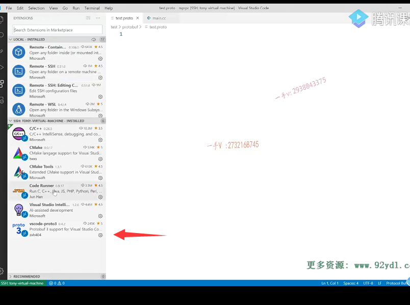

建议大家在使用VS code的时候呢，安装在远程。去安装一个VS code杠proto 3。啊，这么一个插件，

这样一来呢？VS code就能够识别protel文件了。你在写的时候就会有一些帮助，会比较好一点啊。呃，syntax。这个呢？写的是什么呢？这个说的是。声明了一下。这个是声明了啊。protel buffer的这个版本。好吧啊，版本。

我们put buffer原来有put buffer 2，

现在我们用put buffer 3，OK吧？还有package。啊，我定一个fix bug。这声明了。代码所在的包。那对于这个包，其实不是CA加的概念啊，对于CA加来说呢。对于C加加。来说来说。是namespace。就是名字空间作用域，这都是什么意思呀啊？

因为这个proto这个配置文件啊，最重要是要生成源码的，通过谁生成通过之前给大家说的这个。稠度c来生成相应的CA加代码，对吧？哎，这也是CA加代码里边儿相当于就是一个namespace fix bug。

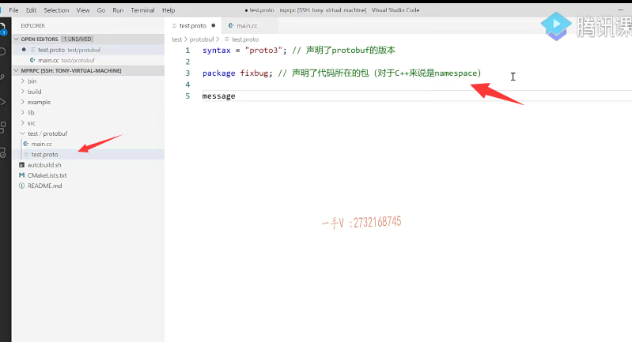

好了吧啊okay，那么在这儿可以定义message定义休息类型。我们说pro to buffer做什么事情呢？数据的序列化跟反序列化，它要把我们所。封装好的啊。一些面向对象的数据。是不是给它转化成字节流或者字符流啊？

反序列化，再从网络接收的字节流或者字符流。在反序列化上还原成。哎，我们的哎，像姓名啊，这个性别呀。呃，年龄啊，这些具体的我们能看得懂的，这个原始的啊，还原数据对不对啊？这message定义一下数据类型，这应该大家应该都能够搞明白吧？你比如说像这个login request。

request login request.这是登录啊。嗯，消息类型。登录消息类型。啊，登录呢啊，我都有什么样的这个字段呢？是不是啊？登录我可能需要。姓名嘛，还有啥？还有密码是吧啊？那么在这儿呢？这些姓名密码，

它都是什么类型啊？那应注意啊。protel buffer有自己定义的一套数据类型啊，这些数据类型跟我们语言级别的数据类型还是比较相似的啊。比如说字符串就是string。啊，很多人说诶，你这等于一是什么意思？是给name初始化吗？并不是的，这表示呢，它是我们。login request这里边的一个字段，第一个字段好吧啊。这个是第几个字段呢？

这是第二个字段，这就是定义了一个消息类型了，好不好？定义这个登录啊，响应。消息类型。这个是定义，定义登录。登录请求。的这个消息类型。好吧啊，这相当于发送了一个登录的请求，里边儿包含了哎，你要登录嘛，你要携带这个姓名跟密码是不是啊？

你要这是这是响应啊。也是message定义消息类型，在pro to buffer配置文件中都是message。log in response.好的吧，

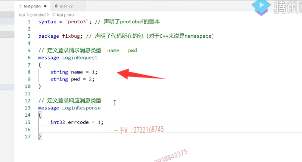

这里边儿首先需要一个错误码，是不是错误码？啊uint三二或者说是你int三二吧。啊，四个字节的整数啊。air code.第一个字段。啊，还有什么呀？error.

message对不对啊？第二个字段。还有真真正正的你登录的返回，结果布尔值嘛就是布尔。呃，success。第三个字段。那么，在这里边儿，我定义了两个坡度buffer的这个类型，这两个类型呢，描述了啊一个请求。呃，一个登录的，一个请求消息跟一个登录的响应消息。

我我发送一个登录的请求。里边儿写的是name跟password，分别是字符串类型，这个类型可不是说是什么c？语言的CA加语言的这个字符串类型，这是protel buffer自己的类型。当然，人家写这个肯定不会是晦涩难懂的，肯定是一眼就能看明白的，对吧啊？这才是好的，这个东西嘛啊，使用的越简单。啊，大家越多人能接受，

这才是好东西啊。这个一眼能看出来，这相当于就是我们CA加里边字符串嘛，对吧？这对应的就是CA加里边字符串，这对应的就是CA加里边四字节的整数。这对应的就是CA加里边的布尔值。没问题吧啊，那你说吧，这个定义完了以后呢？

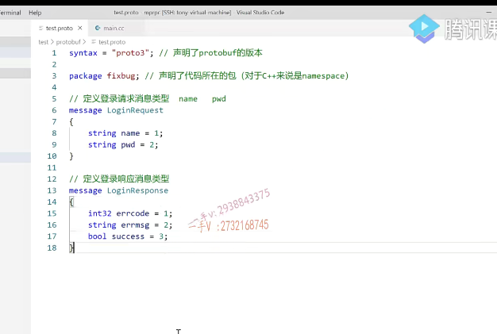

怎么编程呢啊？这个本身是我们编程是编不了的。好吧，那么大家注意一下啊。使用protel buffer，

而我先在protel。叫什么什么点proto文件里边儿定义好这个消息类型，以后啊，那么各位跟我来看看啊。我进入。我进入这个目录里边儿啊，进入这个目录里边儿就是我们的pro to buffer，这个目录里边儿。这是不是就有我的魅点CC跟test点proto，我们刚才创建的这两个文件了。me点儿CC里边儿呢，我们还没有写代码，我们现在先是把proto的配置文件写完了，配置文件写完了以后呢，

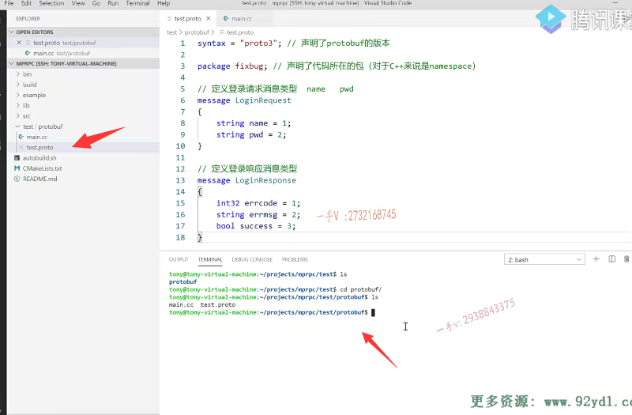

大家用pro toc。test连protel。啊，或者说是我们先敲一下。你看后边儿是不是有一些命令提示啊？pro toc test点proto，然后呢，我们要根据这个。proto的配置文件生成什么样的代码呢？生成CA加代码呢？就是杠杠cpp下横杠alt。把这个生成的CA加代码放到哪个指定的目录呢啊？在这儿呢，杠杠cpp下横杠alt等于。点儿杠，点儿杠是当前目录对吧？

那么大家来看啊。我执行完这个命令，以后在我当前的工程目录下，是不是出现了一个test点PB点CC test点PB点h啊？有了吧啊哎，你看一下，实际上啊，这就是自动生成了代码。

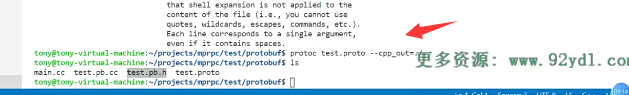

哎，像我们刚才proto文件里边儿定的这个login request是什么东西啊？哦，它原来就是一个class类呀，对不对？哎，那你现在猜你应该能够猜出来，

它这里边儿我们写的这两个变量是不是相当于就是？哎，相当于就是login request这个类的两个成员变量啊，那它应该也提供了这两个成员变量读取设置，相应的是不是一些成员方法啊？没有问题，你说的没错儿啊，它就是这样子的，你看它们都还有鸡肋，是pro to buffer namespace ID。这个namespace是什么呢啊？是谷歌。呃，作用域不到八分儿，这都是名字空间啊。

一个message对吧？这个message呢？我们后边儿还是需要去带着大家去了解的，不过现在呢？时机还没到。我们现在的目标呢，不放在这儿啊。那同样的，不用猜log in response肯定也是生成了一个类，这三个呢就是它的。成员变量，它肯定也这个类肯定也提供了，对于这三个成员变量相关的一些方法的。一些封装啊。比如说，

对于相关的。这个成员变量获取它的数据以及设置它的数据肯定都有。对不对？okay，那我们现在呢？就到编码阶段去测试一下啊。

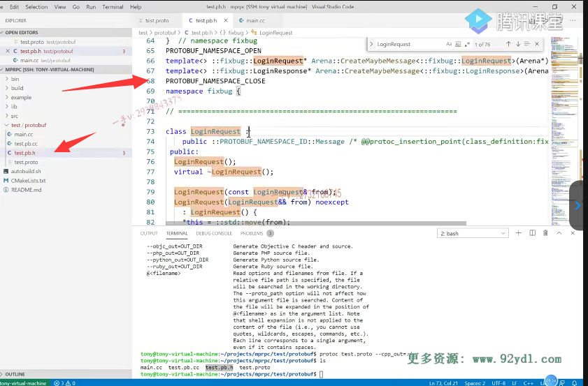

include这个test PB点h包含一下头文件。我们包含一下CA加的输入输出文件啊。那么，大家来看一下啊。呃，我们之前给大家说了，在test点protel里边儿啊，定了一个package fix bug。这个相当于在这里边儿。

相当于就是什么呀？相当于就是一个namespace了。相当于就是一个namespace了，我们搜一搜，看有没有啊？你看这是不是有namespace fix bug呀？

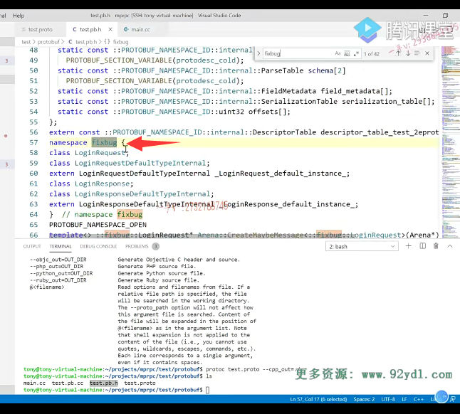

你可以继续搜啊，相当于我们所生成的这个C加加代码都是在fix bug这个名字空间作用里边儿的啊。那你嫌它使用麻烦，你可以using namespace fix。好的吧啊，在真真正正的这个项目里边儿呢，是不允许你过多的去使用using namespace的，因为这样可能会造成全。句的名字冲突啊。

好，这是login request诶，我定一个req。这是一个类嘛req那req里边是不是就包含了？两个成员name跟password呀。哎，那相当于在这里边儿，你看哎set set设置嘛？set你看是不是有set name跟set password呀？哎，在这里边儿，我设置一个张三。req点set什么？set pwd，这是个密码，

一二三。三四五六。这是相当于我们创建了一个对象，那我们现在不可能把这对象是不是直接发到这个？网网络上去啊，我得先把这个进行序列化。得先进行序列化。你要区分序列化还是反序列化？序列化是把对象转换成字符流或字节流啊。把网络上接收的字节类或字符流在。这个还原成对象，这个叫反序列化，对不对？我现在在这里边儿，人家都给你提供了相当方法。

photo buffer本身就是做序列化跟反序列化的，至于怎么把这个对象的数据转成字符流子节流，你根本不用操心，你调用相应的方法就行了。好吧，利用什么样的方法呢？注意序列化嘛，seriously。to a rain.字节数组。啊，two string。还可以把它序列化到文件当中。series too few descriptor，我们当然是把它转成字符串。

啊，或者是转成这个字节。啊转成字节流放到字节数组里边，

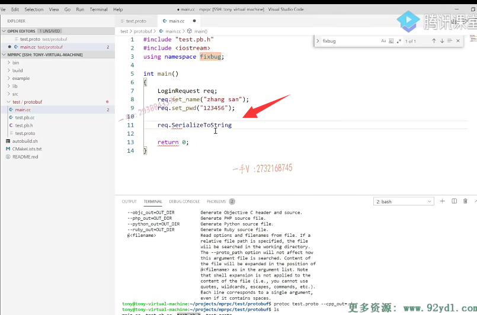

通过网络是不是要发送出去呀？ce realize to string我们看一看哦，它的返回值是一个布尔值，它需要接受一个string的一个对象的地址。那也就是说它是这样去处理的。

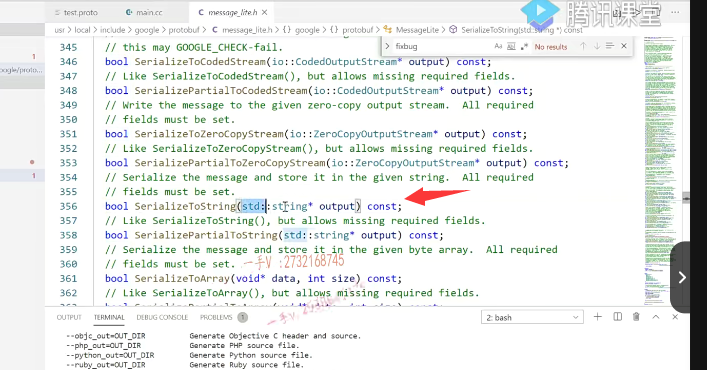

那也就是说它是这样去处理的。好，我们还需要包含这个string，因为我们想。把它转成这个字节啊，字符流对吧？转成字符串，通过网络发送出去。

这样可以吧，这样当然没有问题了，转成字符串。s in的STR那在这里边，我们就传一个s in的STR，它的返回值布尔值应该是true的话就叫做序列化乘。功了是不是啊？那么在这儿，如果序列化成功，它把序列化以后的数据就放到这个字符串上。send STR里边的，我们现在就可以进行一个输出啊send ST。简不简单？简单吧，

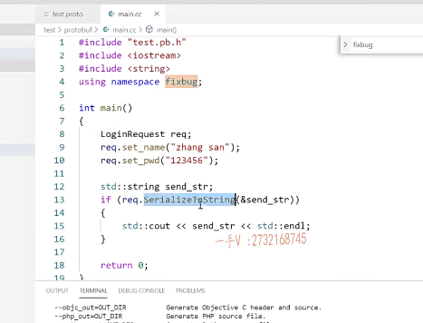

这就是说我们打包了一个对象，

给对象的成员变量填了数据啊，填完数据以后我们就可以通过它的series to string，当然这当然是。说的buffer给我们生成的这个class login request里边儿这个类里边儿人家写好的方法。那我们就可以把它放在一个CA加的string字符串里边。啊，可以可以把它转成这个C语言的叉星。是不是啊？好大家来看啊，我们怎么去编译呢？那么。在这儿啊，我们用命令自己编一下。呃，不指定了吧，

直接生成a点alt就行。啊，所有的CC文件就是me点儿CC跟test点PB点CC，我写出来吧啊。或者说是你写个星点儿CC也行。点CC。这两个是要参与编译的源文件啊。那么在这儿大家注意啊，我们说的pro to buffer你原本安装的嘛，它生成的是一个动态库，你需要链接库的杠l。port buffer，哎。proto bui.啊，把这个动态库链接上啊。好生成成功了，这里边儿有一个a点儿out。

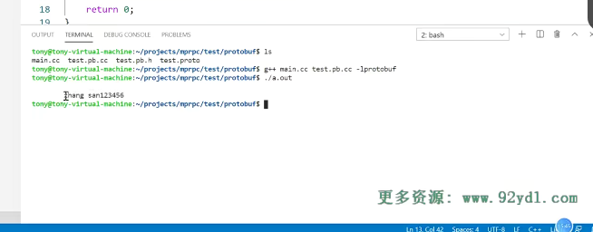

## 序列化

它数据的存储就是紧凑排列的。紧凑排列啊，没有像json什么间值都是间值间值间值。好的吧啊，所以它占的这个。占用的这个空间，同样的数据存储，占用的空间还是相对来说比较少的。你要获取的话也很好获取。这个相当于是。封装了什么呀？啊，

封装了这个。login请求对象的数据。这个是对象。对象数据序列化。对象数据序列化。序列化称为什么？序列化成这个叉儿星了。是不是相当于就是可以通过网络发送出去了，在这里边我们先不写网络啊。我们只给大家介绍这个login。

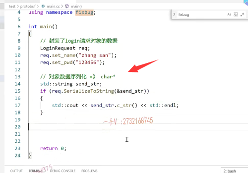

## 反序列化

好吧，那我们再来看一看这个反序列化吧。好吧啊，再来看一看这个反序列化，那么从这个send杠STR。

反序列化。一个login。请求对象。我怎么去反序列化呢？对不对？那么，在这里边大家来看看。反序列化生成一个新的一个login request请求对象req。那么，它提供了一个静态方法，叫pass。刚才是序列化是series，现在是反序列化，就是从字符流里边儿去解析登录对象出来是不是？pass from什么呀？

pass from string。我们可以看一看。这里边儿呢，是什么东西呢？a pass from string在这里边儿哦。它返回的并不是一个对象，它不是一个静态方法，是个普通方法的。是不是一个普通方法没有static吗？啊，它在这儿呢，接收一个。字符流是不是进行一个解析呀啊？

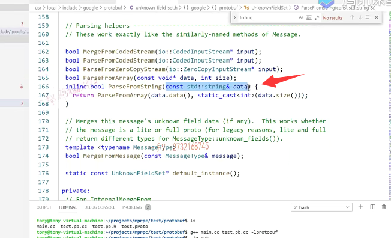

好，那它应该这样去使用。

先定一个对象，这个对象里边儿肯定没有任何有效的数据，对不对？然后调用它。通过对象啊，调用这个方法。pass from string.传谁呢？传这个send STR。好的吧啊，如果为true是不是相当于就是反序列化成功了？翻序列化成功以后，我们打印一下呗。req.b点。

name这就是在读取了。req.b啊点什么呀点password。好吧，这就是反序列化啊，从这个登录对象反序列化了一个。从这个字符串啊，从这个字符串反序列化了一个登录的请求对象

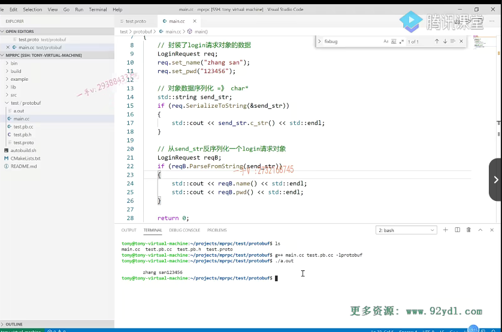

。那么我们。重新呢去。编译一下代码啊。运行一下。你看这个反序列化出来以后呢，能不能从之前的这个字符串里边儿？啊，反序列化出来一个登录对象。得到这个对象，

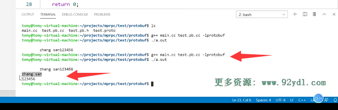

正确的一个姓名。跟密码呢，它没有问题的。是不是啊？相当于用在我们代码上的时候呢？这块儿组装数据对象序列化以后得到字符串，通过网络发送啊。这个对端接收到这个字符串以后呢啊，数据以后通过这个反序列化是不是就可以得到具体的一些？对象的数据啦。好，这是呢，给大家做了一个演示。

大家可以自己呢动手啊。去写一写啊，这都是pro to buffer常见的一些应用。好的吧啊，好这节课的这个。photo buffer的演示呢？先给大家说到这里。下节课我们继续啊。

