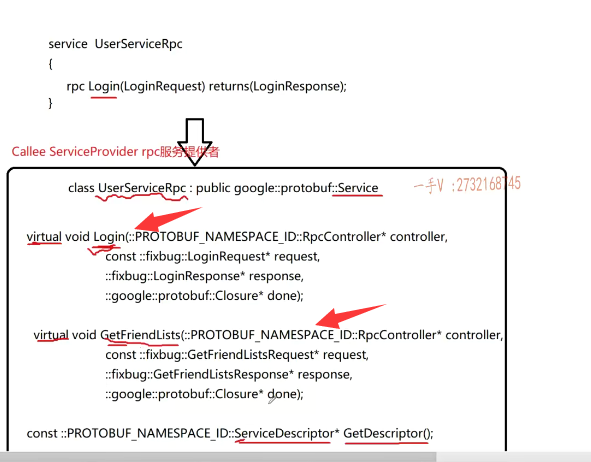

这节课呢，我们继续来讲pro to buffer一个实践应用啊。呃，上节课呢，我们给大家说。说了这个几点啊？说了几点就是对于这个字符串，我们建议大家把。string改成代词对吧？减少了这个字节跟字符之间的编码转换啊。提高了一些效率，另外呢，就是我们这个message啊，这生成以后呢，相当于就是类嘛，

对吧？里边儿不仅仅可以定义啊。普通的，简单的类型还可以，定义相当于组合对象嘛，是不是还可以定义？相对来说，比较复杂的列表类型repeated重复啊，里边儿就放的不是一个user，是一堆user。呃，之前还给大家说了，我们常用的就是数据列表映射表。

# 映射表

那么相当于呢在？这个里边儿呢，

你还可以去。定义这个映射表对吧啊？test像这样。那这个map可不是我们CA加里边儿的这个。那个map啊，那此map非彼map，这应该是谷歌里边儿定义的，就是谷歌。那个pro buffer作用以下专门定义的一个类型。当然了，那我们说呢，这个proto这个配置文件最终经过pro toc，它可以生成CA加呀。JAVA呀焚呢，是不是这样语言的代码啊？

如果你用protelc从这个配置文件生成CA加代码的话呢？这个实际上是使用起来就跟我们学的麦酷表是一样的。好吧啊，哈希表是一样的OK吧啊，在呃，我们这个项目过程中呢，我们主要写的是框架。好吧啊，所以呢？呃，这些消息呢？里边儿到底是有组合对象还是有列表还是有映射表呢？这看你针对什么样复杂的业务了。对吧呃，在这里边儿我们用不上这么稍显复杂的这么一个类型，

大家要是有兴趣的话。我说了啊嗯，你可以在互联网上去找一找啊，pro to buffer啊map类型的。使用你可以自己去看一看好吧

啊，在类型这里边还给大家介绍了一个枚举，是不是啊枚举？那么，使用起来呢？跟其他的这个。呃pro to buffer定义的这个简单类型啊啊，区别不大。是吧呃，

## 学protobuf的原因

那我们这一节课的主要内容讲什么呢？

那我们。为什么要学protocol？是为了在我们分布式网络通信当中，也就是rpc远程调用过程中。给我们做数据的这个序列化和反序列化。来把这个眼光看到这里边啊。那我们之前说了，我们分布式通信框架最主要解决的问题就是这个远程过程，调用就是rpc通信。你得把rpc通信所有的细节可能出现的问题，是不是都考虑到都封装在你这个框架当中？

## server1需要将发送需要的参数和函数名发给server2

说直白一点，那也就是说==server 1这个主机上有一个模块儿进程里边儿想调用一个方法，而这个方法不在进程之内，而在另外一台主机上的一个模块儿进程里边==

==那你现在想请求一个远程的rpc方法调用。那你不仅仅得把参数给我发过来啊，你调用这个函数，你得传参传参吧==，是不是？

那如果server 2只拿到参数，它也不知道调用哪个函数啊？是不是所以也就是说==server 1在发起rbc远程调用的时候啊，你得把你想调用的哪个rpc方法方法名字你？的这这个标识你得给我发过来呀方法名字===。还有调用这个方法是不是所依赖的这个参数啊？

## server2需要返回响应

然后呢？==server 2就知道你想调用哪个方法，以及你调用这个方法传给实参都有哪些啊？现在就都知道了==。而

==它处理完了以后还会给你返回一个rpc方法来处理完的一个响应==。啊，有可能是布尔值像我们的login，有可能是获取好友列表的一个列表类的这么一个user。对不对？

那也就是说，在这个protobuf里边儿，你看啊？我定义了login这个方法，在远端调用的时候，它的一个。实参哎，实参我就可以通过这个消息类型给它进行序列化和反序列化。

响应消息，我可以通过这个类型对它进行序列化跟反序列化。

这是获取好友列表诶，这个是get f类似request，这是好友列表，这个函数调用的时候呢，它的时参的序列化跟反。这是它响应的序列化跟反序列化。

## 上面就是业务的请求和响应

也就是说，我们现在定义的这四个类型分别是同一个业务的请求响应，在另外一个业务的请求响应啊。

你相当于你只有相应的这个函数调用的时参以及返回值，那到底我们怎么去区分rpc函数呢？这也是put buffer，需要帮我们去解决的一件事情，

首先你搞清楚。pro to buffer本身不提供任何的rpc通信功能的。protel buffer不没有什么rpc通信功能。那么，我们为什么又要说在pro buffer里边去定义什么描述rpc方法的这个？一些东西呢，对吧啊，它主要是用来做rpc方法调用的序列化跟反序列化。可能我们这节课在说这个问题的时候呢，你觉得还有一些抽象没关系啊。你先去把这些有问题的东西呢，有问题的这个我我我的描述你听的不太明白的这个东西啊。

记录下来，你到时候呢，我们讲完了这一套理论，我所讲的每一个点都会在我们项目上去。实现啊项目真真正正以实践啊。之前你对我所表述的问题有疑问的。基本上99%的。都可以解决掉剩了1%那就是缘分没到对吧啊，你解决不了这个问题。你实在没有思路啊，欢迎大家及时的在我的QQ上进行一个留言啊，我如果看到的话，会及时的给大家进行一个语音回复的啊。好，所以要语音给大家回复，因为问的人太多了，敲字儿太慢啊，

所以要问我问题，先加个好友啊，我语音给你回复。

# 在protobuf里面定义描述rpc方法

好吧啊，那么在这里边儿，这就是我们这节课啊。所要给大家描述的重点就是。在pro buffer。里面怎么定义描述？描述rpc。方法的。这个类型呢？也就是它的这个service类型。

message这是定义消息类型的对吧啊？我现在定一个service。

服务这叫啊，这叫服务。你比如说我就起个这名字吧，叫做user。service就是rpc。好吧哎，我写个rpc。关键字儿啊。logan returns.来大家来看啊，别着急。这也相当于我就定了一个。login的rpc方法。注意，我强调的protel buffer不支持什么rpc功能。

## 对rpc方法的描述

### 登录请求和响应

它只是对于rpc方法的一个描述，通过这个描述，它就可以去做rpc请求。所携带的参数的序列化和反序列化了，这是logan logan的这个小括号，里边儿就填它实参。实参的pro to buffer的类型表示。哪个呢login request？哎，这个returns return返回嘛，也就是说这个rpc方法执行完以后返回的这个prod buffer buffer的这个double类型是什么？当然就是这个login。response没问题吧，

再定一个rpc方法，那我们rpc方法叫做。

get friend lists.好吧，来。同样的，这相当于就是描述了这个rpc方法的名字了啊那。在这一端，我知道调用这个方法参数是什么呢？参数就是protocol打。包的这个类型叫做get friend lists request。那这个函数呢？执行完以后需要返回的是什么呀？返回有响应码。这个错误码错误消息是不是还有一个？好友列表的这么一个数组。okay了吧啊。

那么在这儿呢，这个这就是我在定义的这个service。服务方法啊，服务类以及。服务类里边儿包含的一些方法。

那么，实际上，通过protelc把它生成CA加代码以后呢？这个不管是message还是service啊？它后边儿描述的这个名字呢，实际上都是一个class类。都是一个class类啊。大家先来看我操作，一会儿在画图板上给大家把这个它们分别生成的类以及它的一些特征。给大家画清楚，

描述清楚啊，这也是你要重点去了解的，因为这个项目如果你写到你简历上的话，你得对它呢。深入了解一下，对吧？人家在让你说的时候，你pro的buffer在这里边儿起的作用是什么呢？你才能够说清楚。好在这里边。先别着急啊，我一个一个给大家解释，刚才定的这个东西做了一些简单的解释，我们现在。用这个什么呀？

我们现在用protelc啊。来生成一下对应的C加加代码，我们来瞧一瞧啊。进入test这个目录里边。这个是。pro to buffer好吧啊，我们怎么生成？那pro toc，然后是test点proto杠杠cpp下横杠out等于后边儿是要生成的c加。原文件呢？是不是路径啊？就是当前目录下。啊，当前目录下好吧。

而我们看有没有生成呢？no results啊，没有生成是不是？所以这就是我们大家容易犯的一个错误。

### 没有生成

当你去在proto里边定义r描述rpc方法的这个服务类的时候呢，你注意它默认是不会生成像。服务了一个rpc方法描述的。你必须加上一个选项，

## 选项

这就是protel buffer里边儿比较重要的一个option选项了啊option选项的功能非常强大。强大到这个我们几节课根本讲不完啊，它的用法是比较多的呃。同样的啊，在这里边儿，我给大家介绍呢，它常用的这个用法，

至于其他的啊。大家呢，可以课外进行自行的扩展。这必须得定义CC杠。generic.services.定义这个啊，定义下面的选项啊。这个表示。生成这个service服务类和rpc方法描述。否则默认它是不生成的啊。默认不生成。好吧啊，把这个加上。加上以后呢，我们来重新生成一下。

### 重新生成

这里边儿可以定义很多的选项的啊。重新生成好了以后呢？有没有了？有了吧诶user service rpc。眼见的同学还会看到，它不仅仅生成了一个user service rpc啊，还生成了一个user service rpc杠stub。

### user service rpc_stub

还生成了一个user service rpc杠stub。有没有这个类啊？我们看一下这个类，这类是就是这个类型的一个前置声明啊。有吧有是不是诶stub stub这？四个字母组成的这个单词，似似曾相识啊。

在我们之前画的这个图上，哎，这儿是不是也有一个stub呀？==stub我们说这个stub装装的意思。也可以当做一个代理类==。对吧啊，当我们这个本地调用一个rpc方法的时候，底层要做很多事情啊，相当于这些事情都是由这个代理类来帮我们做。OK吧啊，那到底是什么意思呢？怎么用呢？又有什么样的实际的意义呢？别着急，听我给大家一一道来啊。

## 本节课目标

而且这节课呢，我给大家说这些类的时候呢，不可能讲的非常的这个清楚，因为这涉及到我们项目具体的实现。这节课呢，我只是给大家借助着protel文件里边儿定义的service服务类，以及它的rpc方法描述，生成了这个CA加代码。我把该强调的项目上能用到的一些该注意到的一些理论知识，给大家强调到。大家努力的去记忆一下。在写项目的过程中，也逐渐的去把它。搞明白理清楚好吧啊。

那么往这儿看一看。在这儿我们写了两个rpc，这个方法，那我就不全画了，就画。其中的。我就画其中的这。这个login相关的就行了吧？

# 步骤讲解

## 首先

首先呢？我们定义message login request。这个东西呀。生成的c加代码。生成CA加代码以后是个什么意思啊，各位？生成的C加加代码是个什么意思？

是个啥东西嘛，在CA加代码里边儿表示的是个啥东西？

## 2.

是不是是个class呀？是个class。而且它从谁继承而来了？你还有没有印象啊？它从这个pro to buffer里边儿的这个叫做一个message。这定义而来了，那之前我们给大家写代码的时候，你凭什么你的这个request或response对象就有什么？ce realize.to string pass from string这些方法对吧？这些方法呢？呃，

你这些类里边儿根本没有，为什么它都是从基类message继承而来的？

#### LoginRequest类根本没有，继承message来的

从抽象的角度来说呢，login request就是一个message。

### 提供方法

#### 读方法

对吧啊，它提供了什么方法呢？它提供了。来各位，它对于成员变量就是你message给你的成员变量，它提供了这样的就是name。还有pwd这样的读方法。

### 写方法

而通过这个你定义的这个成员变量的名字加括号，就直接是方法名就可以读相应成员变量的值了，另外一个就是它提供了这样的方法。

可以干什么呀？去设置你成员变量的值。对上了吧啊，主要提供的就是这样的东西。

来我们确认一下啊，不要让大家稀里糊涂的。class class啊。是不是这个message类型啊？这个port buffer namespace ID就是google port buffer，对不对啊？

## 3.

好了，那同样啊，可谓同样的。在这里边。它定义的啊。就是各位我们一块儿定义的这个login。response啊，它对应的这个。它对应的这个东西是什么？它通过pro toc命令生成以后，生成的就是login。response你不相信，你可以自己在这个test点BB点h里边去查一下啊，它也是从这个什么？google全局这种有写不写都一样啊。put buffer这个message是不是继承而来的？那它也提供了什么方法呢？它也提供了相应的。成员变量读的操作跟写的操作。

好吧啊，提供了。成员变量的读。写操作方法。好了，这就是我们之前所看到的用message定义的这个类型。

## 总结

啊，被pro toc生成CA加代码，然后给我们展示的一些东西啊。我们可以定义相应的这个类型的对象，消息类型的对象啊。通过它提供的方法进行成员变量的读写，然后通过它提供的ce realized to string或者to a ring，还有pass from a ring或者pass from string。来进行呢数据对象的序列化跟反序列化，

也就是把数据对象转成字节流或字符流。或者是从字符，字节流，字符流里边儿再还原出对象的数据来。就这个意思，对吧啊？

# 服务步骤

现在我们。在这里边定义了一个什么方法呢？一个服务类。诶，定义了一个服务类。在这儿我给大家写出来了啊，大家仔细看一看。service叫做user service rpc，我们不写另外一个了，

我们举一个例子说明情况就可以了啊。那么在这儿呢，就是rpc。sorry，我重写一下啊，这怎么？突然打不上了。rpc啊。lpc log in.就是这个login。request returns.log in response.你写的这么一个东西啊，通过proto 8份儿。通过protocol c生成以后生成了。

两个东西。大家来仔细的跟我瞧一瞧。

## 1

仔细的瞧一瞧，第一个。是生成了一个。class user service 2，PC从谁继承而来呢？

来，大家仔细看一看啊，这都是理解它底层。你需要看的东西。你可不要说它生成了就自己生成了，你用就行了，看它干啥呢？你写的项目放在简历上，

人家是一定会问的，不会说是啊。光问你结果出来没对吧？要问你底层的这个原理的啊，

剩下的这个类你看。

诶，从这个service这个鸡肋呀，继承而来的是吧啊？写一下啊google。pro to buffer.service这个类题创来的。那形成的这个user service rpc里边儿都有什么方法？大家跟我看一下诶。有这些东西。有三个东西。

有这三个东西。我给大家把这个拷贝一下。

哎，它主要包含了这三个东西。生成的这个类里边啊。播放的这三个东西，你把目光就放在这三个东西上。

什么方法抽象这个虚函数？是不是虚函数在CA加里边儿，我们把它称作。虚函数啊，虚函数一般都是让派生类重写的嘛，对吧诶？这里边儿生成了两个方法啊，参数感觉挺多的，

是不是啊？但是这个名字。好像没有，随便起啊。这跟我们定义的rpc方法的这个名字login。还有这个get friend lists。一模一样的。是不是也就是说这方法的名字是不是就是我们定的rpc方法的这个？名字来决定的啊。

诶，然后呢？呃，它这里边儿的这个时参呢？却给的是rpc controller诶logan request。log in response还有一个closure，这是基于一个回调的，这么一个操作啊。

put buffer呢是非常重要的。之前我给大家说了它的好处，比叉mail跟json都好，但是它有。那么一丢丢啊，学习成本啊，需要大家花时间跟精力去接触一下啊，在这里边儿呢。我就先给大家说到这里，大家。大家注意，这里边儿的参数啊。后边儿在写项目的时候会给大家一一的逐渐去解释清楚这些参数到底是做什么用处的呢？

啊，这节课我先给大家简单的去描述一下啊

## 返回方法的名字

好，先来看这两个方法，还有一个方法get descriptor。返回一个什么service descriptor。service是服务descriptor，de script是描述的意思，也就是说它返回了一个对象的指针。这个对象应该就是描述服务的。描述服务。描述服务服务有什么东西让你描述啊，服务的名字。这不就是服务的名字了吗？还有啥服务？

里边儿有很多方法。有login方法，有get friends lists，是不是方法啊？那我们想都能想来这里边儿呢？返回服务的方法。==要返回服务的描述描述啥呢？就服务的名字是不是以及服务里边儿的方法名字呀啊==？那你说我为什么要提供这么一个东西呢？肯定有用的嘛。是不是肯定有用的，我们说呢，想请求一个rpc。啊，想请求一个哈尔皮斯的方法，

你得知道那方法名字叫啥呀？对不对哎？除了参数，你得知道方法名字叫啥？而且我们现在请求的啊，都不是一个普通的c方法，而是呢。对象的方法啊，纯oop对象的一个rpc方法，所以我还得知道你请求的这个方法是属于。哪一个类类型的对象的方法呀？是不是诶？这个都在我们service descriptor里边有所描述。好，你先在这儿做这么一个理解啊。

那然后呢？在具体的编码过程中啊，通过实践的编程，我觉得你可能会了解的更清晰一点。好的吧啊，那要注意当我们去写这么一个service服务类的时候，

用pro toc生成CA加代码，它首先会生成一个user service而不是。PC这么一个类好吧啊，这么一个类用在哪一端呢？用在这个calle这一端的。就是远程方法执行的这一端。call d我们把这个也叫做这个service。e service.provider.

==就是服务就是rpc服务提供者这一端==的好吧啊。这个用在这一端的。到时候这个方法我们是需要重写的，对不对啊？先不说那么多呃，这个方法呢，

### 远程方法执行的一端

# 总结

这个方法呢，从一个service继承基类上来也非常重要啊，这里边儿我们认识到两个基类，一个是message表示消息的，一个是service。服务方法对象的。对不对哎？这是站在基类，站在抽象的角度来描述嘛，对不对啊

对不对啊？那么，它的方法有两个，你一定义了几个rpc方法，它就有几个方法，产生方法的参数都有四个。方法都一样，对不对？那个具体的调用这个方法的时候参数那肯定都在这个login request。get friend lists request.响应都在相应的第三个参数里。对不对？那这些参数什么时候掉，什么时候传值对吧啊？它用在哪里的这个呢？先不要着急啊。

最后，除了这些rpc方法以外，外加一个get descriptor。对吧，用来描述当前这个服务以及服务。所拥有的方法这么一个。成员函数啊，你了解到这儿就够了，你知道它生成了什么东西以及生成的这个东西里边儿有哪？些方法给你提供了。理解到这儿就可以了，我们后边儿写的时候会不断的回过头来去看这儿好吧。行，

那这节课我们先给大家说到这里啊，下节课我们来画右边儿这一部分的内容。

