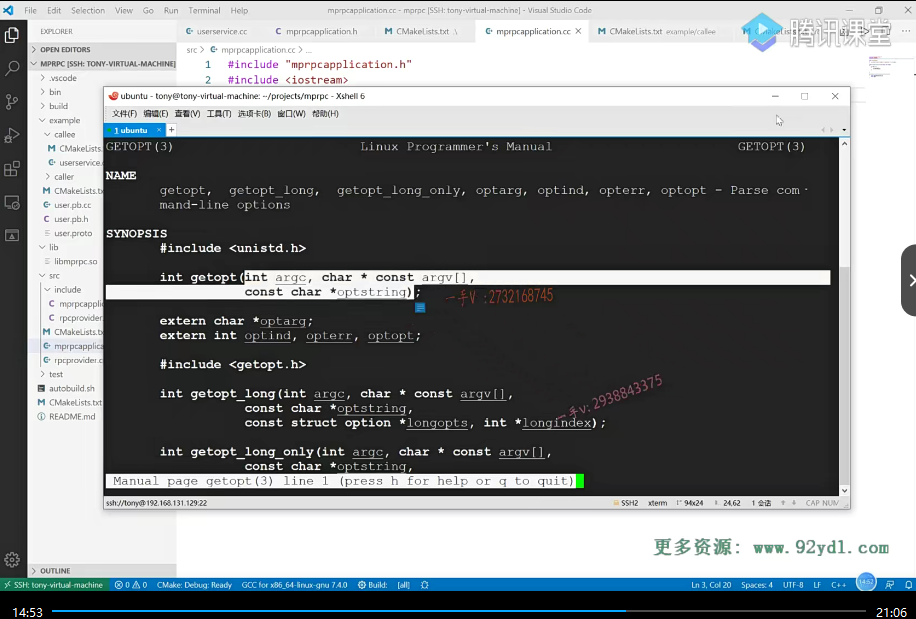

这节课我们来继续输出，我们分布式网络通信框架的代码。上节课呢，我们从实践的应用角度告诉大家了啊，我们框架应该。从哪开始写？写什么东西啊？从用户使用的角度，我们来逐渐的去输出。我们分布式网络通信框架的所有的代码内容对吧啊？来先跟我回忆一下啊，我们说呢，我们用户要把本地服务啊，变成一个可分布式部署的，一个远程的rpc服务。

## 首先

首先呢，它需要先写出啊描述它这个rpc方法。

方法名字。参数类型。跟这个方法的返回值的一个响应类型，这个pro to buffer的这个类型定义你得先写出来，生成相应的是不是c跟CA加文件啊？

哎，这样一来呢，相当于rpc的调用方跟rpc的这个服务的提供方，它就有一个协议了，是不是？哎，就是你通过这样的这个描述来发起一个rpc调用，我这边就能给你识别到你想调用哪个rpc方法？

对不对？那么注意同学们这个user service点CC，我们是写在example靠力下边的对吧啊example呢是我们。这个什么呀，是我们框架的使用示例啊，框架的使用示例代码。我们从这个user service rpc记上来重写一下这个logan的方法，这个logan里边儿写的。这四步操作啊是。有一些啊，都是我们框架给我们封装完的，对不对呃？

但是有的同学呢，可能到这里。嗯，

来说的话呢？可能还是有一些不太清楚，那是因为呢？他没有写完框架，没有看完框架的代码，他有一些框架做的事情呢。可能对于他来说呢，理解起来还是有一些抽象啊啊，没关系，你先把我们。说过的这四点呢，每一个重写的rpc方法，这四点你先记下来，到时候我们慢慢把。框架的代码写完了以后。啊，你应该就豁然开朗了啊。

这个框架的使用也很简单，在这里边儿先调用一下框架的这个in it方法进行一些初始化操作，对不对啊？然后呢？再定一个rpc provider对象，这相当于是一个网络对象，对不对啊？他负责什么东西呢？负责这个。数据的序列化，反序列化以及网络的数据收发啊。再调用一个run方法，这相当于就是进入进程，

进入阻塞状态，等待远程的rpc。进行一个调用的一个请求，我们在src这个框架代码里边也输出了相应的这个mp rpc application，这个类跟RP。c provider这个类。

那我们这节课呢，做两件事情啊，第一件事情是给大家呢嗯，带着大家把这个项目的这个编译环境就是cm ake呢，我们完善一下。另外一个就是这节课呢，我们把in it就是说框架的这个初始化，

首先呢，我们框架的初始化为什么要传入这个？

==main函数的这两个参数argc跟arg v呢？那是因为我们这个启动的时候需要读配置文件。因为我们rpc这个分布式节点启动，我们需要知道呢，它的IP地址端口号还得需要知道zookeeper是不是IP地址跟端口号啊？对哎，这些东西呢，都是通过配置文件来读的。

呃，上节课我们好像都是自己在命令行上自己去编译的，对吧？这节课呢，我们把cmake写完整了啊。嗯，

src框架的代码呢？我们肯定要向外部提供成一个so库好吧？所以项目的根目录这个c make lists里边儿呢，我给大家稍微完善了一下啊，稍微完善了一下，在这里边儿给大家。

嗯，做了一，尤其是这两句做了一个注释啊，这个src包含了mpr PC框架的所有。相关代码在这个目录里边，再去搜索c make lists是不是好了？

## 完善CMAKE

在src底下呢，我们加一个。cm ake.lists点TXT这个文件啊。

## include文件夹下

那。这个src目录下就有一个include目录里边放的都是我们框架设计的头文件啊，因为到时候这个include这个。文件夹需要拷贝到输出文件里边儿啊，因为我们最终把这个框架的头文件跟so库提供给用户使用就可以了。

是不是然后src根目录下放的都是框架的源码，所以在这里边儿我就定一个aux。点儿src list，这应该都还记着呢吧？当前目录的所有源文件名字啊，放入这个src list。

## 动态库

那这也要编译成一个。不是executable啦。是一个library，

对不对啊？我们把它叫做mpr PC。有我们的谁呀？src list.这些源文件生成而来，生成一个share的动态库。好了吧，生成一个share的动态库。

## 顶级目录cmakelisth中定义了库文件的输出目录

那因为我们在顶级的这个simic list里边儿输出了啊，已经set过了。库文件都输出在这个根目录的lib lab目录下啊lab目录下。

好，然后再看我们calle的这个cmakelist里边儿，现在呢？我们这个callee呢？

这里边儿啊provider的这个编译啊。它是需要用到我们框架的代码的。那它就应该是动态链接，我们框架的so库对不对？所以在这里边儿有一个target link libraries。谁要link呢？生成的这个provider。程序呢，需要链接我们的动态库链接我们的mprpc这是链接我们框架的这个so库。

它还使用了pro to buffer，所以还得链接谁呀？proto bof pro buffer的这个so库。好了吧啊，写到这儿就OK了。

## 出现错误

嗯，那然后我们去编译一下吧啊，我们直接在这个VS code给我们提供的这个上来编译啊。那么，在这里边大家来看一看啊。呃，有一些。问题是不是啊？cannot determine link language for.这好像是。我们看一下，这是什么错误啊？啊，这有一个。indicate a problem with.

就是指出来了一个错误，在我们的c make list里边儿啊。呃，you have called add library for library mpr PC，我们框架的那个c make list里边。哦，这也没写对啊。那这意思就是说呢，我们的at library啊？==for library mpr PC生成的这个动态库without any source files。就是没有关联任何的源文件啊，你没有源文件怎么生成动态库呢？对不对啊？因为这写错了啊。==

## 又出现错误

大家注意一下。

好重来。哦，有编译错误啊，你看到这儿，那这个cm ake呢？已经生成了makefile，但是告诉了我们。

rpc provider.点CC。rpc provider点h这个头文件找不着。来，大家一起看看这个错误是什么啊？

这个头文件在src include嘛？这个头文件在顶级目录的simic list里边已经设置了头文件的搜索路径，是不是啊？s项目的根目录，底下的src，底下的include。

## 原来是少了一个T,project拼错了

对哦，埋了个坑，各位在这里边儿，我这project少拼个t啊，你看。哎，所以这个英文啊，一定要好做编程，英文一定要好啊，这看见呢不残缺不全的这个单词儿要一眼能识别出来啊。那这个不识别出来的话呢，我们这种错误可能就会很浪费时间，

上面这project嘛。我少个t。

对不对啊？我们这儿指定了这个头文件的搜索路径，我们在写原文件的时候直接包含相应的头文件就行了。就不用再去梳理出头文件，具体的路径了啊，因为人家呢，会根据我们指定的这个头文件的搜索路径去。去自动的去搜索啊。好，大家来继续跟我看。

好，大家来继续跟我看。很完美呀OK编译成功啊，前边儿是cm ake来根据我们指定的这个编译规则生成复杂的makefile文件啊。写一个makefile，

大家呢都会头疼，但是写一个cm ake来构建复杂项目的编译环境就是这么简单。啊，就是这么简单。对不对啊呃？在这里边。

这都编译了先生成了你看lab mp rpc点s，我看一下lib这个库里边有没有有？这是我们框架生成的so库，是不是已经有了？然后这个生成了以后呢？继续啊，生成provider。provider在这个b目录里边。哎，

也生成好了。是不是也生成好了OK？这现在相当于我就给大家啊，把我们这个项目的这个。编译，环境基本上呢，就写全了，后边我们只需要填代码编译就可以了。好不好啊？

好不好啊？那这节课呢？我们有两个目的，这第一个呢？就是我们也写了一点框架使用的代码。就是发布一个rpc方法，对吧？

以及这个框架啊，本身我们输出了两个简单的类。还有方法，但是方法具体的实践也都没写，是不是啊？但是呢，我们先把这个架子搭起来，然后把编译项目的编译环境呢？给它做好啊，大家呢，跟着我做的时候呢，也到这一步，你应该也是在VS code上的。用这个呢，能够把项目编译成功，

或者说是你自己在命令行上进入build目录里边儿，用cm ake点儿点儿。也能够编译成功啊，这就可以了啊。那这节课我们还有一个目的啊，我们这节课把第二个目的弄完就是呢，我们。框架的这个in it。

# 第二个目标

## 编写init

啊框架的这个in it函数in it函数在这里边，我们说了需要你用户传入一个就是命令行参数就是我。我们是希望他将来呢，这样去写就有一个config。就这样去写这config杠I。后边指定一个config file，从这个config file里边去读取相关的网络服务器的以及配置中心的相关的IP地址，

文端口号。好吧呃，那么在这儿呢，我们就开始写了啊。

init来看看。在这个里边呢，我们就要。这个init的函数已经接收到了main函数的这些参数，是不是啊？==如果说argc小于二，那说明什么呀？那说明啊。你这个程序rpc服务站点啊，启动的时候根本就没有传入任何参数，==

允许过这是不被允许的，对不对？我们得输出一些错误信息啊，==现在我们的错误信息先用s tdc out来打印一下，后边我们会改成日志==的好不好啊？

那么，在这里边儿，我们打印一下啊。嗯。或者是直接这个样子吧。show show arg.s help.就打印一个这个参数的，这个帮助说明啊，

怎么打印呢？我一会儿来给大家说这个参配置文件都没有，那就。啥也别玩了啊。exit failure啊，啥也别玩了。好了吧啊，

好了吧啊，那这个show alg。as help啊，在这里边儿。我们就把它写成一个全局的方法吧，外边儿也看不到啊，也不用看见。这个是原文件嘛，最终都被封装在so库里边了，

对吧啊？这个就是提示啊。提示嗯。command.杠I，这必须有一个。config.fail对不对啊？format format就是格式，必须是你的命令啊，你的可执行文件是不是啊？然后是杠i config file。这个别出错了啊。

## getopt()读取参数

好，那在这继续。

这儿的话呢，因为我们要读这个参数，我们那很经典的，就用get这个opt了是吧？来各位，我们慢一下get opt。不在这个里边儿啊。啊有get opt是在unh TD点h里边啊，那我们包含一下这个头文件。这个呢，是返回一个返回一个整型值啊，然后这是arg car gv，还有你要的一个。参数选项对不对？

## 读参数

好在这里边我定义了一个c。

然后呢，在这while。c=get opt第一个是argc第二个是arg v第三个是。参数对不对？我们是需要一个杠I参数的，而且这个是必须有加冒号。好吧啊，如果呢，不等于负一。OK，那么在这我们继续来看啊。继续来看。

呃，实际上呢？这里边儿的返回值什么的你都可以，

人家这里边儿都有一些说明是吧啊，我们就不一一细看了。它的这个命令行参数后边儿所带的值就在它的全局变量这个。呃OP targ字符串类的。好的吧啊，字符串里边。

那么在这里 switch c

如果这里边是I的话。呃，如果这里边是I的话啊。那我们就高兴了。这相当于就是。有谁了？

有这个配置文件了，对不对？哎，有配置文件了。有配置文件的话。我们是这个样子吧，来写一个。string来把配置文件呢？这是config。fail STD，别忘了啊。config fil等于。OP targ.好不好啊？如果这是一个什么东西啊啊？

如果这是一个问号儿，这相当于就是它出现了我们。怎么样啊？不希望出现的这个参数，我这里边儿的这个参数的列表只是I必须出现I。

是吧啊，你像AB的话，就是你可以出现AB，也可以不出现。

OK吧，==那问号相当于就是出现了，我们根本不想要的，是不是这个参数==啊？那么在这儿，你可以打印一下啊cout。

invalid.args.invalid arg s.那然后呢？把这个show arg help给它。再弄一下啊。然后break。这冒号就是出现了杠I，但是没有带正确的参数吧？因为我们这是必须得要参数的，对不对？你除了杠I，但是却没有带参数也不行。这是不行的啊，这都别break了，

这都是。配置都没有正确，是不是？就都exit了。看看说arg help。好不好啊？这里边我们就给出了。一些帮助啊，正确的应该是这个样子。额外的打印，实际上我们。啊，你可以打印。可以不打印好不好？那你在这儿呢，

这也都由项目来啊，具体你看你。这个都是很自由的啊，==这个相当于就是有了杠I，但是却没有参数==，

==就是有了杠I，却没有后边的config file==。是不是啊啊？need config.need config file?哎，需要这个东西。对不对？好，这个well出来了，

以后呢？那相当于就是呢，我们。正确，你输入一个command杠I配置文件，那这个配置文件的名字呢？就是。在这儿呢，对不对？

## 开始配置文件

然后在这里边相当于就开始。开始加载配置文件了吧？在项目里边。我们都说了一个良好的这个软件项目啊，其模块儿是非常清晰的啊。不该他做的事，

他是不会做的。对不对啊？那我们的mp rpc application是负责初始化的。包括一些日志啊，配置文件啊，对不对？配置文件的读取呢，你就不要在这个里边儿写了，你应该专门写一个config。一个模块专门来进行配置文件的加载。好的吧啊，

所以在这里边呢，我们应该新创建一个什么？

新创建。一对config file。

就是点h跟点CC来，专门在这里边做配置文件的加载。配置文件长什么样子呢？就是四行话嘛，就是四行话啊。这个rpc。sever IP等于什么？啊rpc server port等于什么？如keeper IP。等于什么如？pot等于什么？就把这四个项一加载就行了，

大家也可以先想一想，而我们该怎么去？加载这样的一个。

配置文件。好不好啊？代码该怎么写呢？啊，这个我们放在下节课来给大家介绍一下。