## 服务器启动很多都会带参数

上节课呢，给大家主要说了一下我们框架的这个mp rpc application的，这个init类啊。我们一般框架初始化都要接收呢，像main函数的arg car gv，因为一般呢，我们都是要。服务启动啊，一个服务器启动都会要传入一些参数的，对吧啊？包括呢，加载一些配置文件都要读取配置文件。大家呢，随着大家学习，我的课程会见到很多的服务器的中间线的一些使用啊，

包括mysql啊。redis nginx.对吧，你会发现呢？那后边儿还有很多啊，你启动的时候呢，一般人家都会带一些参数的，对吧？

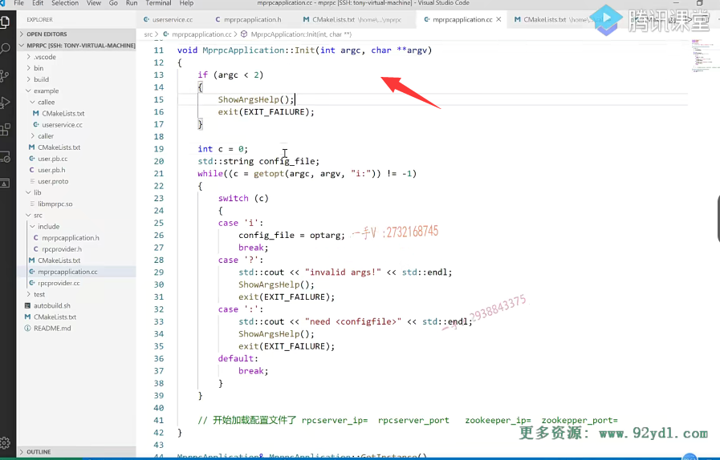

像我们这个就是。

上节课呢，我们给大家呢，在in it函数里边儿。写了一下啊呃，写了这个小于二。我们要收一个showArgshelp()，

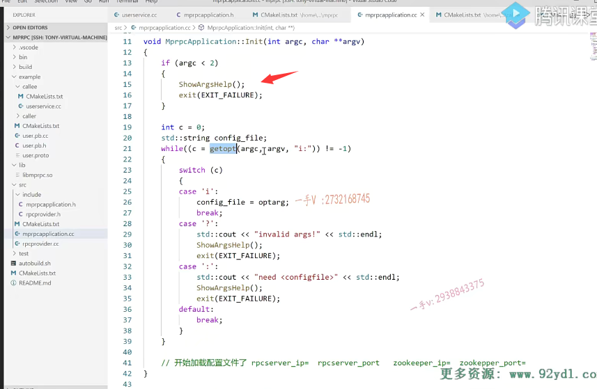

是不是用getopt ？我们要读一个不可或缺的I参数啊。

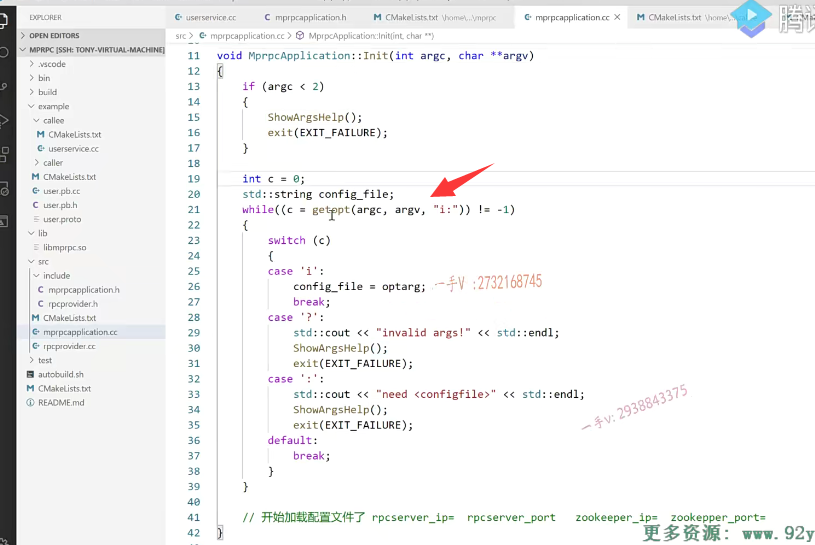

呃，那这节课呢？我们就把它运行一下好吧啊，运行一下，我们看一看，然后呢，再把配置文件呢去加载一下，这节课我们把配置文件呢这个。读写类啊我们给它输出了啊。

## 本节课 配置文件的读写类输出

首先，我们把这个项目编译一下。啊，编译一下，

这个好像上节课已经编译过了是吧？编译完了以后，我们生成的可执行文件呢？都在这个bin这个目录。那么大家来跟我一起看一看。我们项目的进入b目录里边儿，

这是我们的可执行文件provider不加参数。哎，这里边儿，你看format command_i config file就是你启动的这个命令啊，然后呢，需要加杠I参数的加这个。他说你不带参数呢，不行是不是？呃，

这些。写杠a。

你看人家这个getopt本身都可以给你提醒的invalid option杠a，因为我们这个写的这个格式字符串啊，命令字符串。里边儿根本不需要a参数的是不是啊？不需要a参数的。

所以呢，人家都已经给你提醒了，提醒的话，我们又show arg help format command杠I，

这就给用户已经说明了，你需要这样去输入。参数那么这个我们就不需要打印了吧？

然后呢？杠I杠I是必须要这个参数的，你光写杠I也不行啊。哎option requires an argument杠，I就是对于这个I参数呢，它是requires是需要一个参数的，对吧？invalid的arg I。啊，如果是杠I，我随便带个参数诶，你看是不是就没有任何异常提醒了就正常？往下走了，

所以呢，这块儿我们稍微改一下，

==我们这个打印呢。怎么样？去掉吧==，好不好？okay，那么到这里呢，我们就开始啊。加载这个配置文件了啊

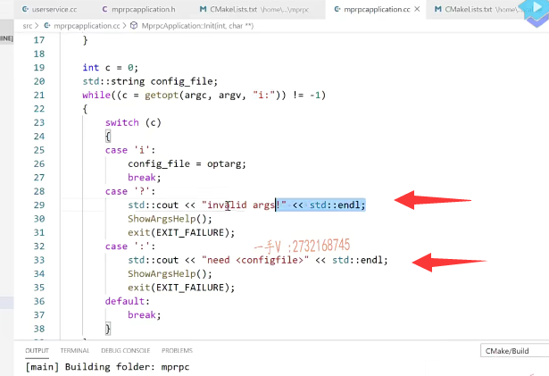

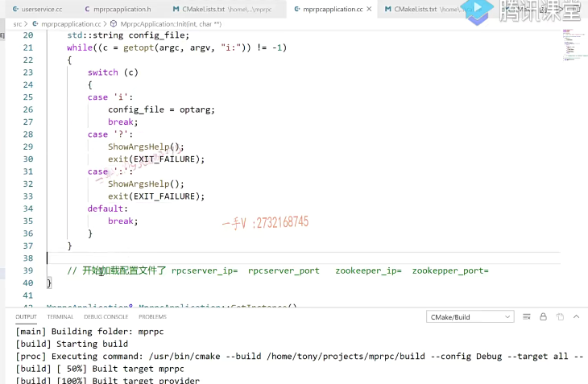

各位。写标准的点儿h跟点儿CC啊。嗯，我们叫个什么样的config呀？

那就叫mp rpc configure吧好吧，点h啊。什么框架的这个配置类啊？

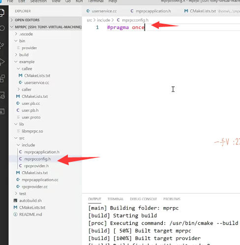

呃，pragma也是防止头文件被重复包含的，就跟我们以前写的，if no define一个红名define end if。但是他们还是有一些区别的啊，至于这两个的区别的话呢，大家有兴趣可以在网上去查一查。

呃，这个是框架读取配置文件类。

我们写一个mprpc config。这个无非就是键值嘛，对不对啊？所以呢，我们读取配置文件以后，把它放在一个键值队儿，一个map表里边儿。供我们这个框架的这个其他模块儿很方便的呢，就读取这个配置项好不好啊？

我们不需要呢，每一个这框架的每一个地方。用到配置的时候都去加载配置文件，配多文件毕竟是一个磁盘IO，它效率是比较低的，我们整个儿读配置文件。读一次就行了啊，整个读一次就行了，如果你的逻辑发现你这个配置文件不断的在读取配置文件，配一次又不会变。你把它读来读去的，那除除了浪费效率，就没有第二个好处了。好吧，

那么这个配置项嘛，键值对儿嘛，又不需要对建进行排序，是不是所以用一个 unordered_map就可以了？我们unorder _map。那么，在这里边儿应该就是一个。unorder _map画不画啊，但是这个里边儿好像。就是在STD里边儿，是不是？先这样写吧。

std unorder _map没有帮助了啊。先写一会儿再来看，这还有string呢，是不是？呃键是什么类型啊？string类型值也是什么类型啊？值也是string类型？好吧啊，值也是string类型。这里边儿主要就是什么嘛？我们说了放rpc server杠IP，还有rpc。server或者说是。我们就规定好。

rpc server port.还有zookeeper。IP就keeper port主要就这四项啊。

然后呢？这写一个m杠config。看这个map吧。好的吧啊config。map，

然后在这儿我们给它提供一个方法，叫做load config file.然后是char*，这是config file。这个主要是干嘛呢？

负责加载配置。文件负责解析加载配置文件。好吧啊，我们再给它提供一个方法。呃，叫做什么呢？叫做load 就是传入一个k。给你返回一个啥东西？==传入一个k给你返回就是这个键所对应的，是不是值啊字符串==？好了吧啊，这个是。查询配置项。

信息对不对啊？查询这个配置项信息。啊，在这里边儿，我们可以用一个引用来接收啊。

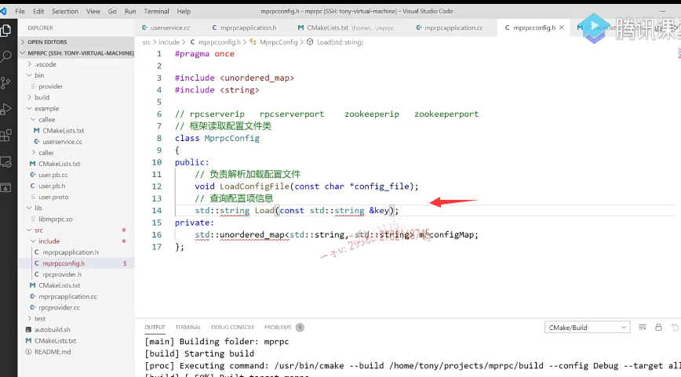

好，那我们再生成相应的这个源文件。叫做mPRPC config.CC

好的吧。include.mpr PC config点h。然后在这里边儿，我们把它的这个。成员方法拷贝过来。这都是我们框架的代码啊，各位。

好了，那在这儿呢，我们还要再写一下这个类的作用域。我们一会儿要进行测试好吧

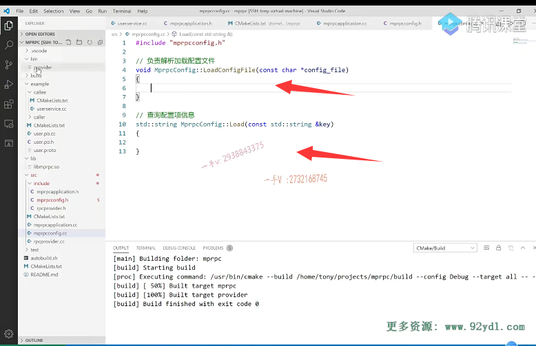

## test.conf

我们在这个什么地方啊，在这个bin这个目录里边儿啊。我们先给它建一个。配置文件吧，好不好？这是。test点conf啊。

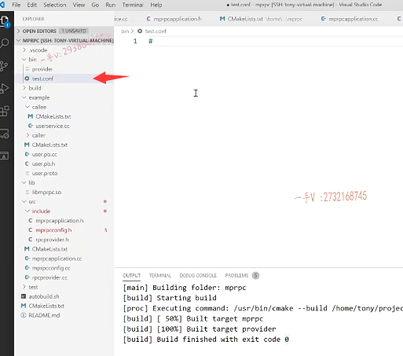

## test.conf的编写 ip地址和端口号

这是test点co先先这样写吧啊，这是一配置文件，配置文件里边儿一般有井号儿是可以。作为注释的对吧啊？

就是lpc节点的。IP地址。啊rpc server IP。而等于等于什么幺二？七点零点零点一好吧rpc server port。比如说8000啊，这个我们就加注释，这表示rpc节点的。端口号啊。然后呢？这个是zk的。IP地址。就是做keeper。IP比如说也是在本机上啊。然后呢，

再来一个zk的。pot端口号啊，写清楚是不是？如keeper。这个pot啊。等于这个。比如说是咱先假设吧，假设个5000，然后我们读一下配置项，看我们写的代码呢？能不能正确的从这个配置文件中把这配置项都读出来啊？

## 完善类内容

那你来看一看啊，那你来看一看。啊，我在这儿这样弄了。

呃，我们刚才的这个。test.config。我看着这个来写了。那首先就是。你有这个文件了。那咱先别写这个吧，咱把调用的那一块儿的这个逻辑先写清楚好不好？这不是in it了嘛。你传了一个什么文件，名儿是不是有啦？有了的话呢，在这儿那我要先给它的这个头文件。要加一个include。谁呢呃？

mprpc config.h，然后给它的成员变量要写个成员变量。就是叫做mprpc config啊这么一个m_config。OK吧，

然后呢？在它的这个原文件里边儿，从命令行上，我得到了这个配置文件，

然后。然后在这儿呢。加载了点。叫点什么啊load？config.是不是file啊啊low？

点load config file。把什么拿进来？把这个config file拿掉。点c杠STR。==因为这个load config file需要的是个char *，你不能直接 传string==好吧啊？没问题吧？

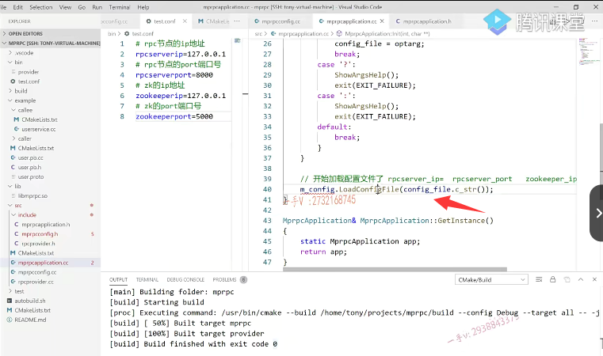

### 静态函数 不能读取非静态的成员变量

这是load，是不是啊？load。嗯，我们编译一下吧，我们先编译一下，

这里边儿总是有错误提示，我们看错误在哪里啊？嗯，这有编译错误了。in static member function.在这个静态的方法里边。invalid use of member.哦，那我们把这个。这个呢，定义成什么了？定义成普通的这个成员变量。普通的成员变量却在静态的方法里边儿，是不是去访问人家啊？啊，

那在这里边儿呢？我们把它提供成什么东西啊？提供成静态的。OK吧啊，提供这种静态的。再来编。好了，那这个现在没问题，这是找不着对这个的引用，因为这个是什么呀？这个是。静态成员变量必须得在内外区域。定义一下是不是啊？

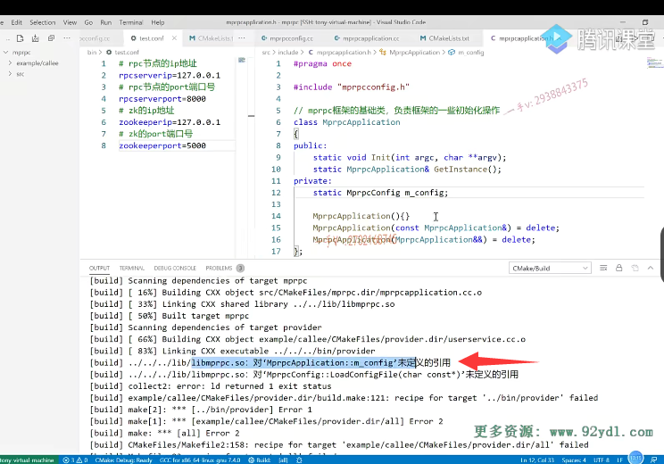

## 静态成员变量需要在类外初始化

CA加幺幺以后支持这个什么东西呢？支持这个初始化列表在成员变量处直接去初始化。

哦，那它是需要一个。这样初始化的话，它需要这个成员变量必须是个const，对吧？算了，那我就。规矩的在这个源文件当中，哎，给人家静态成员变量呢，去初始化一下。静这个静类的静态成员变量在内外初始化，跟静态方法一样，在内外写的话，前面的static就都不用加了。

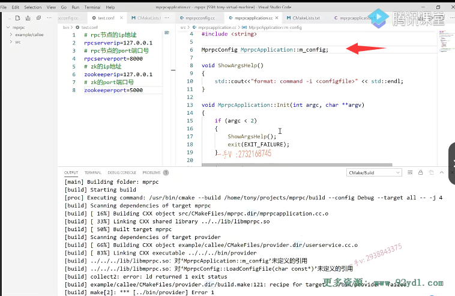

## 出现了未定义的引用

来再编译。okay，还有这个low low load config file v。定义的是不是引用啊？啊未定义的引用。那么，在这里边儿链接的时候，出现了对于这个函数未定义的引用啊。啊，我们把这个。先写了吧啊，先写了。这个为什么会出现未定义的引用呢？

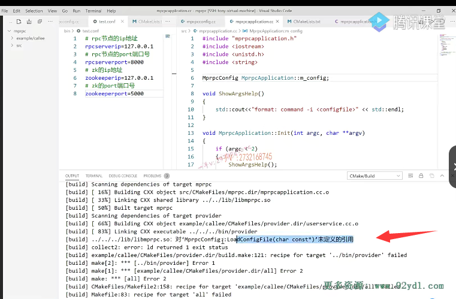

这里边的这个c make lists。啊，

这个源文件下的所有的源文件都参与，是不是这个编译啊？好，先不管这个，

## 先懂流程

我们先把这个load config啊写完。呃，逻辑现在应该能清楚吧，就是在框架的in it的时候呢，在这里边儿用m杠config load file通过命令行参数拿。达到这个用户杠I。指定的配置文件啊。某个路径的配置文件。然后放到这儿，放到这儿，我们现在就去解析它了。

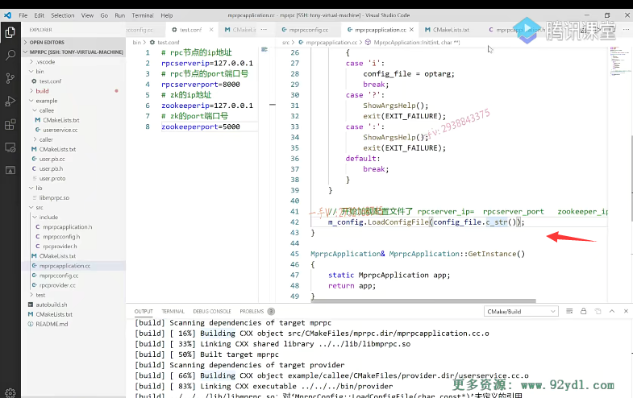

## 流程

## 打开文件

在这儿啊呃，先打开文件呗，是不是pf啊？f open.这个是config fail啊。然后还有一个。什么东西呢？这个是读是吧啊？if.pf为空这个表示什么意思呢？这个表示config。fill这个文件啊。is.in invalid,invalid.

或者说是is not exist。is not EX啊。ist不存在好不好？里边儿用到了这个输入输出啊，我们包含一下相应的这个头文件。然后呢，这就直接退出了啊，配置文件都不对。exit failure.呃，

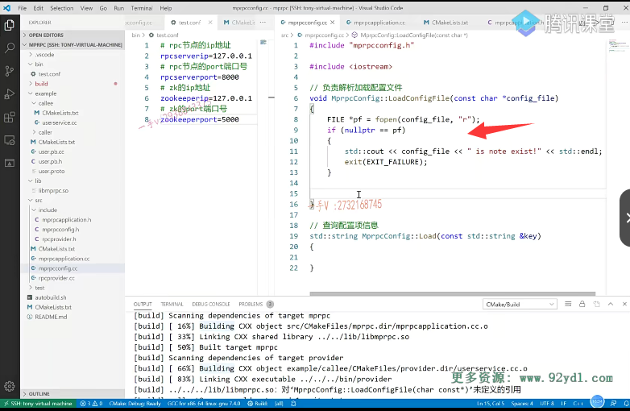

## 处理三个情况

这个是。能够把这个文件打开成功的话，我们现在就开始读取了，这都是一行一行的嘛。是不是一行一行的啊？一行一行的进行一个读取啊，那么在这里边儿大家来看看啊。

呃，首先我读取，我该怎么读取呢？while那就是循环读取嘛。当这个文件。没操作完的时候，我就一直循环，是不是进行读取啊？大家来想一想，都有哪些情况啊？我觉得无非就是三种情况。一种是井号儿，

这就开头的就表示注释，那这个我们肯定不不去处理啊。然后就是有配置项的，就是有等号的啊。接着就是前边儿可能会出现这样子的东西。出现空格儿啊，前面儿出现了空格儿，我们需要。把它去掉对不对啊？我们就处理这三种情况就可以了。

注释对不对二。正确的。正确的配置项啊。什么叫正确的配置项呢？就是它有等号儿，

有一键值对儿好不好啊？第三个是什么呀？第个就是去掉。开头的。多余的空格。是不是就这三个啊？

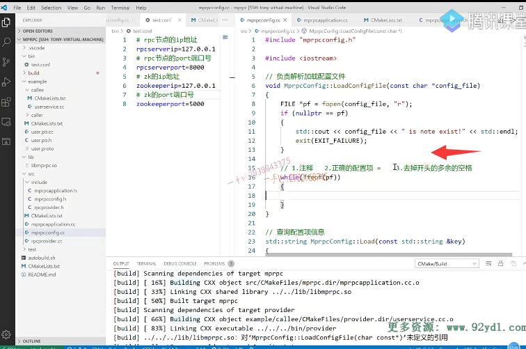

那么，在这里边儿，我们先定义一下一个buffer。这个幺二八足够了吧？五幺二吧啊？这一行我们配置上应该没有那么多的啊。

然后读取一行啊，读取一行，我们怎么读取呢？

应该就是f gets吧？是不是第一个是往哪儿读？往buffer读对不对？第二个是。五幺二第三个是文件的这个指针。诶，读过来了，

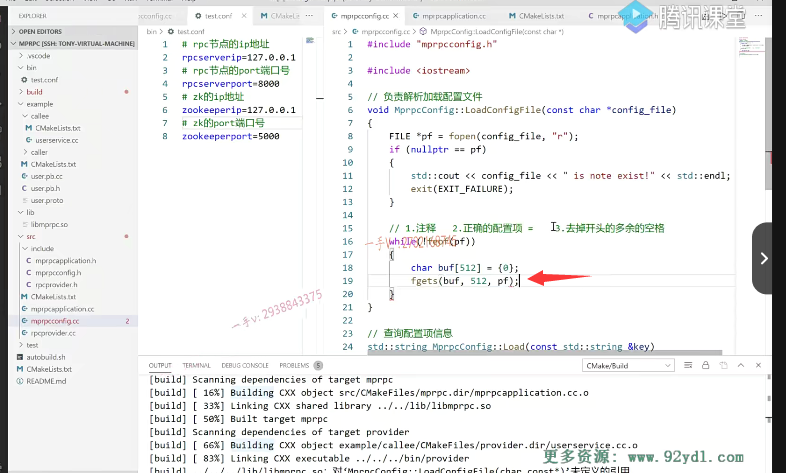

## 去掉空格

读过来了，读过来以后呢？我们先做什么呢？你要去。这个去去判断首字母是井号儿的话。还是是正确的配置项的话，你先检查一下它前面儿有没有空格儿，如果有空格儿的话呢？把空格儿先去掉好吧啊。

那个去掉。啊前。去掉这个。字符串前面多余的空格啊。去掉这个空格的话。因为呢，怎么说啊？嗯，我们的这个。嗯，其他语言里边儿对于字符串处理的话，有一个t trm这么个函数可以去掉字符串前后多余的空格。在我们CA加里边儿。没有提供相应的方法，所以在这儿我们只能自己去做了啊，

自己去做了。

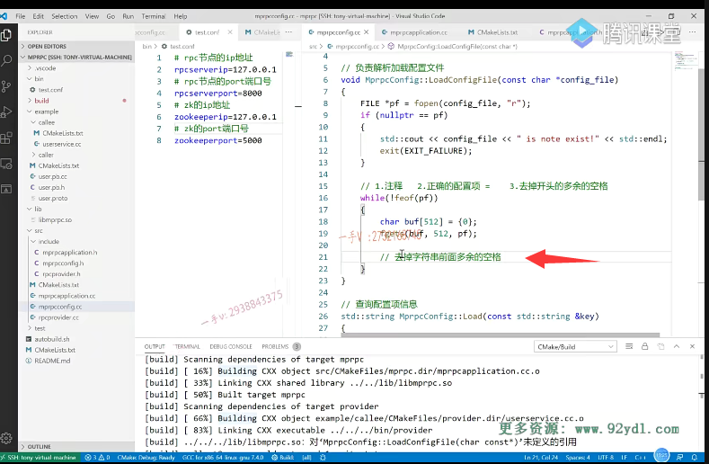

## char *转成string 

那这个我们肯定先得把它转成这个C++的string嘛，是不是啊string有方法好操作？呃，对于叉儿数组来说呢，我们都得DIY了，自己做了是吧？我们这样写string，大家来看一下啊。src.buffer这是它原始的这个buffer啊。用这个buffer呢，初始化一下。

## find_first_not_of 找到第一个不是空格

对不对啊？那它里边儿人家好的是提供了一些方法，

你比如说提供了这个方法。非常好用，它提供了很多好用的find啊。你看find find这是找下面的字符。first,not of.我们要找第一个。是空格的，还是不是空格的？肯定找第一个不是空格的，是不是哎？找第一个不是空格的。这里边儿，你看它需要一个。叉儿，

然后呢？是从哪一个位置开始？我们就是从头开始的，默认就是从头开始的啊default就是零找这个。对不对诶？找这个。找这个以后呢，我们进去看一看啊。呃，这个应该是应该是返回一个size tap。就是同样的。嗯，就是找着了，返回呢，第一个不为空格的这个字符的idx，

如果找不到就。返回负一好不好啊？那也就是说呢，

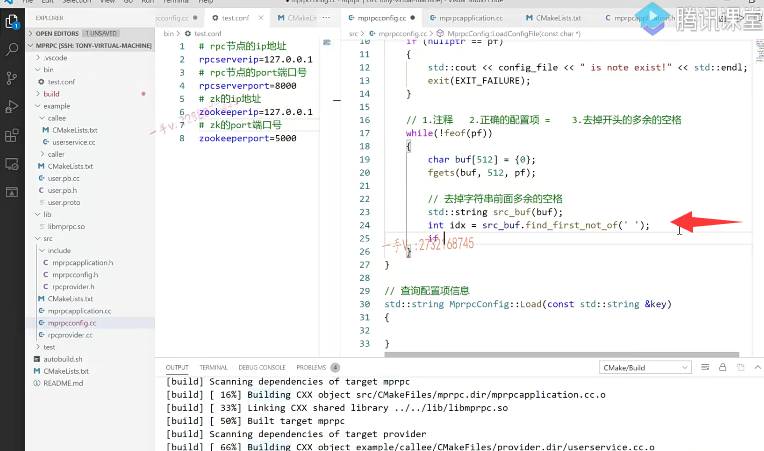

==这idx如果不等于负一的话，这说明什么？说明字符串前面有什么有空格儿啊==，有空格儿那么idx刚好返回的就是第一个非空格的那个位置的一个下标。那么在这里边呢，我们就把src。处理一下。src杠buffer点substrain。然后从谁开始啊？从idx开始。对不对哎？从idx开始。

然后呢，进行一个。字符串的一个截取。啊，第二个不是末尾的下标，第二个是一个。它是一个长度啊。大家经常。可能会搞混，没问题吧？哎，这就是OK了。

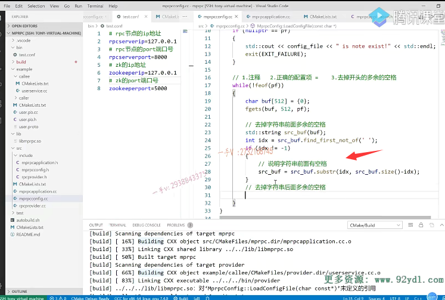

## 去掉后面的空格

这就是把前面的空格都剔除掉了啊。嗯，实际上你这事儿做还可以去掉啊。

去掉去掉这个字符串，后面多余的。啊，后面多一个空格，那就同样的处理啊idx=src，而我希望大家把CA加。因为字符串相关的这个问题确实特别多，你包括笔试，面试，刷题的时候啊。你对于字符串的这个泛的方法一定还是要多多应用一下啊。你看这个find find last node就是first of跟first not of都是从前往后找，包括这个find也是从前往后找。find last.not of就是从后往前找的啊，

从后往前找的。这是同样的，还是找谁呢？找空格儿。啊，前后所有空格都去掉啊。这样写代码就比较严谨一些，不是说呢，你这儿后边儿没空格，你去这儿干啥呢？有可能有你没输，别人有可能输，你写的框架要毕竟要健壮一点才能适合各种各样的配置文件。不会出错，不会说哎呀，

稍微多加个空格儿就把你搞掉了，是不是啊？这个就没什么意思了。你这框架就不太健壮啊。啊，当然了，我们写这个也不是说把所有的情况就防止掉了，我们把能想到的目前能想到的啊，一些大的这个问题呢，我们都给它过滤掉啊。啊，如果说这个idx不等于负一。

对不对呃？不等于负一那么。就表示怎么样啊？

找着了。find last not of.就找着了，对吧？找着的话呢，我们。再去去掉一下啊。去掉字符串。后面。说明字符串后面有空格，对吧？那我这个那就是从目前的从零开始。到哪里啊？这长度。idx是不是就可以了？

idx这指的是下标，而这儿。第二个参数表示的是长度，这可能要加个一呢。对不对啊？这可能应该要加个一。这要加个一，我们一会儿做个测试啊。我们会做一些测试。好，那在这里边儿呢我们。就把前后的字符串过滤掉了啊。呃，前后的这空格儿，这个空格儿呢？

如果没有的话，那就是最开始的src 8分儿没有做过任何的。改变了啊

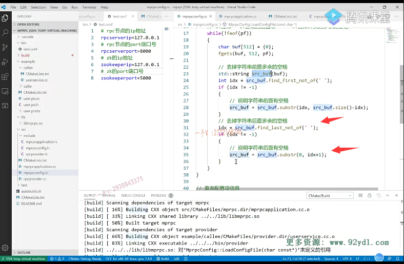

## 判断注释

判断。井号的注释啊。那如果说src。c杠八分儿零号位元素是个谁呀？这个井号那就代表注释。那就continue了，读下一行吧。是不是啊？或者说是src 8分儿前后的空格全部。处理完了以后呢，发现它是个empty的，也就是说有人在这里边儿多加了空格儿。

啊这这这读出来是个空的，是不是啊src buffer呢？是个empty的。那在这里边儿啊，它就这样在这一行加了很多的空格。是不是啊？加了很多的。那就没有必要了啊okay，那么在这里边。我们就。判断注释了

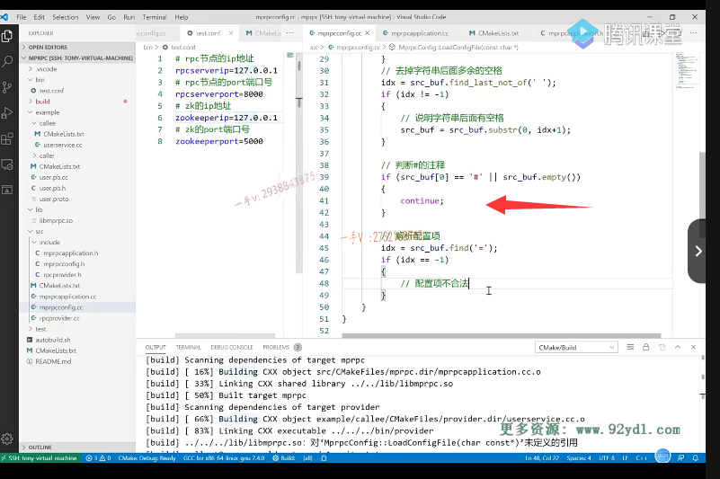

## 判断配置项

接着呢，我们就继续判断啊，判断。判断这个配置项。

就是解析配置项啊，解析配置项就是拿等号儿来进行一个怎么样等号儿进行解析的啊？呃，那就是idx=src杠buffer，这个点find find谁呀？find这个等号啊。如果idx=- 1，那这表示什么呀？配置项。不合法。啊，没有等号儿，你可能只是写了一个剑剑的名字，是不是啥也没有啊？啊，

那么在这儿。content一下，实际上这块儿可以加一些日志啊，我们项目的日志，我们最后再填啊，不合法OK，在这儿找着了话，那就合法了。合法的话呢，那在这儿呢我们。读一下吧，读一下这个。这是剑。这是它的这个。value好不好？

那么k就是谁啊？k就是这个src杠。buffer呃点。substrain从零开始到谁呢？到idx。是不是更好啊？到我这个idx啊。到idx。然后呢？value就等于谁啊？slc点buffer。src下横杠buffer点substrain从idx+1开始，然后是。src杠八分儿。size-idx应该是刚好的。

那么，大家注意一下，在这里边啊substrain截取字符串起始的下标，然后第二个是长度，第二个注意它不是末尾的下标。标啊，第二个是你要从这个起始下标开始要截多长？啊，然后有这个k跟value了，我们是不是就可以把它写到相应的这个？map表当中啦。啊，我们的这个。配置文件。的成员变量就是这个config map啊。

那就可以写到这了。

## 写进去

写进去点insert。k value.没问题吧啊，这个就把。这个建制段儿呢，我们就都插进去了，好不好啊？插进去了以后，

## 不要用中括号，不存在他会增加键值对

那这个load呢？这个非常简单了，那就是。呃，不要用中国号儿啊，不要用中国号儿，

不要用中国号儿，各位还能知道为什么吧？因为呢，中国号儿是不是有副作用啊？这儿再给大家讲CA加呢，这个容器map的时候给大家说了，如果这个k不存在的话，按理说你应该返回一个空字符串。啊，但是呢，如果这个k不存在的话，它会增加给map表里边儿增加东西的，这个是我们不想要的。对不对呃？不合理嘛？

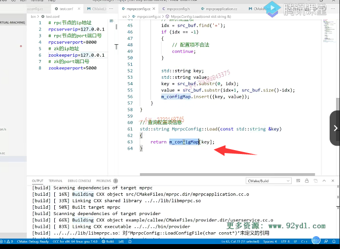

那么就是m杠config map。如果典范的这个k它不存在的话。啊，不存在的话。那就是out of it。等于这个我们定一个变量，接收一下吧啊。if it=m杠，config map。的end的话，那在这里边儿就是return什么呀？return m杠config map。哎不不不，是不是不是sorry啊？就是返回个空字符串好不好啊？

返回是个键对应的，值嘛？是不是啊？okay的话，这个就返回呢？给它执行了second，没错了吧？啊，那就是说我们当我们漏掉以后呢？传一个键，我发现是个空字符串，那就是说的啊，它没有相应的这个。好不好啊？那这个就okay了。

那这个OK了，

以后呢？我们想在这里边儿去测试一下啊。这个打印一下。等一下啊，rpc server IP。m杠config点load。st den dl.好了，这个我们不需要了啊。二三四。然后呢？这个是pot对吧？改一下啊，然后这个是。就keeper的IP。就k牌儿的IP。然后这个是组keeper的。port啊，zookeeper的port。好，那我们重新编一下我们。写好的东西。

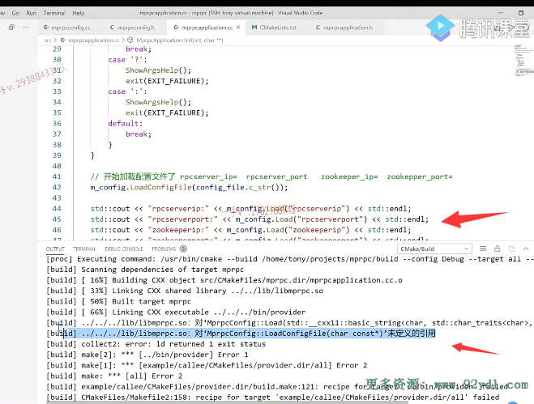

## 出现了错误

在这里边lab mp rpc。诶，对于load跟load config file链接的时候都是一个未定义的引用是吧？那就是说找不着这两个函数的定义。那这是什么问题呢？我们来看看。呃，

要不是这样吧，我们这节课的这个时间呢，已经超过30分钟了，有点儿长了啊。啊，大家先想一想对不对啊？我们项目准备的时候总得遇见一些问题呀啊。要不然我们说什么呢？==那大家先看一看这个问题是什么？是我们构建的这个环境，编译有问题吗？是我们cm ake写的有问题吗？为什么找不着？找不着这个load跟load config fail的这个定义呢，

大家一定要区分什么是编译错误，什么是链接错误啊，这是对符号的未定义。啊，==这个应该是属于我们在linking的时候链接的==，这个错误对不对？这儿都写的这个很清楚。在building mpr PC就是编译框架的时候呢，出现了链接上的错误，大家可以。啊，我放在下节课来给大家解决这个问题。

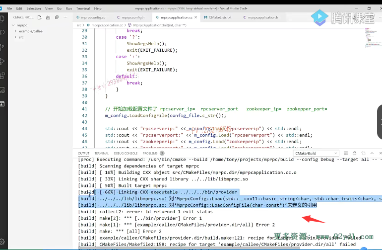
