前面呢，我们把我们框架的啊m。PR PC application的方法。写了，然后呢？又把配置文件的这个读写呢？也写了啊，配置文件在这里边有一个load。config feel跟这个。

啊load啊，加载了相应的IP地址端口儿以后呢，我们得启动网络服务了呀，是不是我们要启动网络？服务器，然后在它上面发布是不是rpc方法供远程进行rpc方法调用啊？

那么rpc provider就是我们的这个rpc网络模块儿，因为别人用我们这个框架的时候啊。是定义了一个rpc provider对象，把它当做一个rpc的一个节点，向它上面是不是注册发布这个r？PC服务啊好了，那我们说作为一个rpc的服务器啊，那么在这里边儿我们肯定得涉及高并发了。因为我们既然提供rpc。那别人可能就会高并发的去连接我们去请求rpc调用是不是，所以呢，我们在这里边儿啊。直接采用了这个C++的model库，对于model库来说呢，大家应该已经不陌生了啊。

呃，集群的聊天服务器也用了model库啊，我们现在这个分布式的rpc节点啊t。提供呃服务发布的这个。rpc提供者这一端用也是用了这个model库啊，后边儿我还会给大家更新一个课程，就是专门去。剖析呢model库的源码啊，希望大家呢可以呃。及时留意啊，我的。课程的更新好。

好，那么在这里边大家看rpc provider啊。我们在让别人用的时候呢，

你不要让人家去输入什么event loop啊。inet addressip地址端口啊，是不是这些呢？你不需要给用户IP地址跟端口是从配置文件读出来的。你不需要用户在这里边儿给你写，你框架应该向用户展示的越简单越好。

所以在这里边儿呢，各位。我们在这儿想定义。什么东西呢？首先你要作为一个服务器，你首先得集成这个TCP server吧。是不是TCP server啊？啊TCP server在这里边，我们定义成一个指针啊。

既然定义成一个指针的话，我们不如直接用谁得了，

我们直接用这个。智能指针得了啊。用一个unique。ptr类型是什么类型呢？

啊，在这儿大家来看看啊，我们要包含这个model。net下的TCP。server点h。好不好？还需要包含啊model。net这个event loop点h。这都是它比较重要的啊，

比较重要的。那么我看一看还。是不是还需要包含这个inet address呢？啊有呢，是不是我们包含一下啊？那么注意一下啊model库的这个代码全部都是在这个model名字空间作用于底下。

net下边儿的啊，所以呢，大家如果嫌长的话呢，可以用using namespace来减少名字作用域的这个长度啊。但是呢，我建议大家不要养成那样的不好的习惯，因为在大型项目当中呢啊，为了尽量的防止全局的名字空间污染。这个名字空间中一般是不让大家省的好吧啊，

所以在这儿呢，我们就用model net。然后是一个TCP什么？TCP server好不好啊？m杠这个u。ptr啊up tr或者是叫做呢？TCP.server杠ptr。那我们就写这样子吧，好不好啊？写这样子。写个这样子的话呢。就okay了，是不是呃就okay了？那这样的一个。

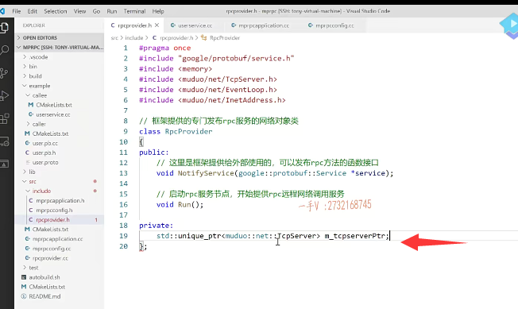

这相当于现在只是一个什么智能指针啊。==现在相当于只是一个未初始化的智能指针==对不对啊？这也相当于。组合了这个TCP server啊。还需要一个什么啊？还需要一个event loop，是不是组合event loop？这相当于就是一个epo啊。那么mode net event loop.我们给它一个。event event loop.是不是的啊？

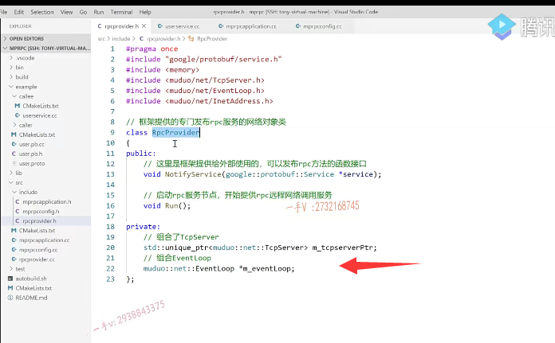

## TCPserver变成局部变量

这个rpc provider。或者说是在它run的时候啊。在它run的时候我们再。启动这个服务吧，好不好啊？在它run的时候，我们再启动这个服务诶，那我们把它的这个执行呢？实现要写在谁里边儿啊？要写在这个。相应的点儿CC文件里边儿啊。就写到这儿，

这个TCP server在这里边就没有必要写成成员。

因为它除了这个run方法去访问的话。在其他方法也不需要访问，就直接写成run方法的这个局。步的变量就可以了啊。event loop不行啊，event loop我们。也有可能给rpc provider提供一个stop方法，我们还要调用这个m杠event look的quit方法。是不是所以因为这个变量可能会在多个成员方法中调用，所以它不能写成函数。得定义成成员变量可以在多个成员方法中都可以，是不是去访问了？

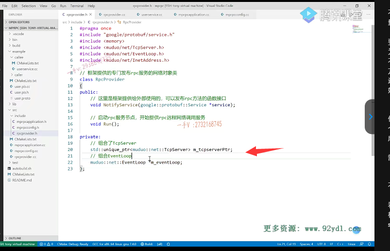

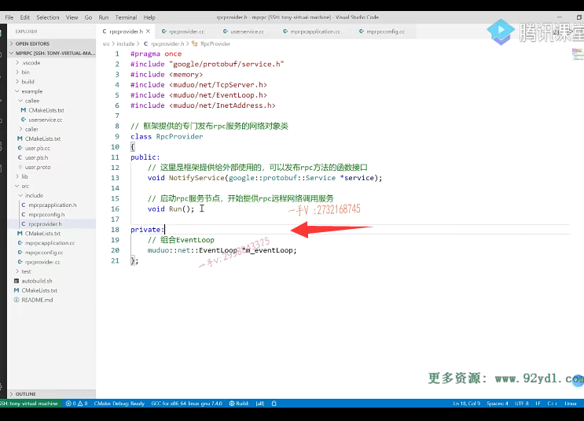

好，那么在这里边儿呢？我们就尽量不要扩展变量的这个访问范围好吧啊。

在这里边呢。我就写到这儿啊，写到这儿了，各位。在这儿，我们得先有一个什么东西啊？先有一个event loop，是不是那在这里边儿，我就不用定义成指针了啊？就直接定义成这个变量就可以了啊。然后呢？在这里啊。我就得填写一个inet，应该还需要model。还是需要net。

inet address address.这需要一个IP地址跟端口啊。

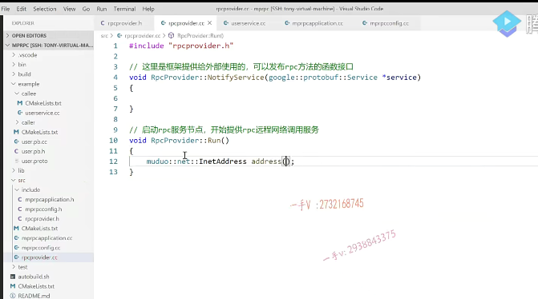

是不是啊？它需要一个IP地址跟端口。写的时候呢，不要光照着我写。打到人家的这个。接口API上去看一看啊

这个IP是一个string pod是一个。uint 16杠t啊，无符号的双字节。

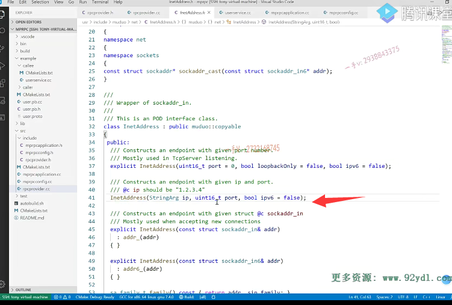

那么在这儿大家来看看啊st d string。st d string.这个叫做。IP是不是啊？

那这个要访问谁呢？要访问我们的mp rpc application点h呢啊。因为从它里边。就是mp rpc application点h从它里边的get instance。才能够访问它的什么方法呀？才能够访问它的。配置这全局的，唯一的是不是这个配置啊？好，我们返回一个配置吧。static那我们直接返回一个引用啊。叫get这个mpr PC。config或者直接叫做get config吧。OK吧诶，然后呢？

我们把它怎么样呢？在它对应的可执行文件中实现一下。把这个配置项给人家返回回去。

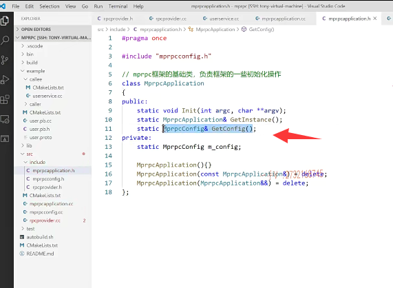

OK吧诶，然后呢？

我们把它怎么样呢？在它对应的可执行文件中实现一下。把这个配置项给人家返回回去。那我在外部是不是就可以访问这个配置项了？对，然后在这儿大家来看。get instance，然后呢？然后是get config对不对？获取了我们全局的这个唯一实例的一个。配置啊，然后呢？调用它的这个load，我要去加载谁呢rpc？server IP.

OK吧啊

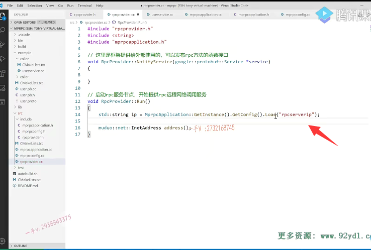

然后呢？还有谁呀？还得有一个port，是不是啊？um t16杠t。这个是pot。等于同样的啊。但是它返回来的是个什么东西啊？它返回来是个字符串，所以我们要把它。字符串转成一个整数啊。转成整数的话呢，这里边儿返回来的都是。你看漏的返回的都是string类型，

是不是但是a toi呢？需要一个叉儿星，所以我们得调用呢。它的什么方法啊？c杠STR。好不好啊？这就是仿我们框架全局性的内容。

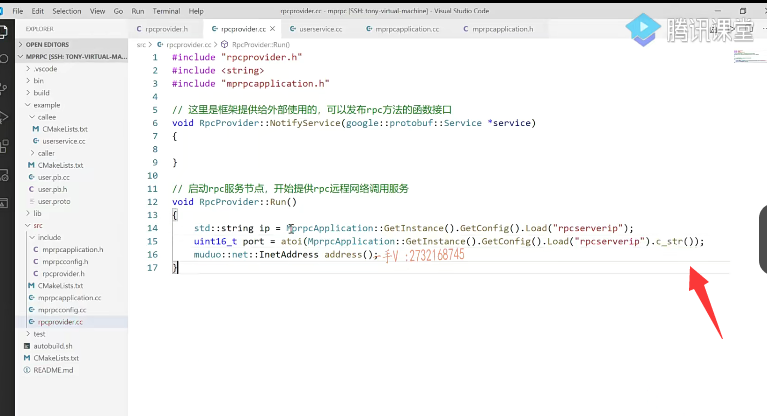

## 启动TCP server

行吧，好嘞，那么在这儿呢，我们把它的这个IP跟这个端口儿呢串进去。现在呢，我们就有了启动TCP server。所有相关的一些参数了啊。那我们现在就可以启动了。

启动这个。TCP.server了是不是啊？那我们来启动一下啊。

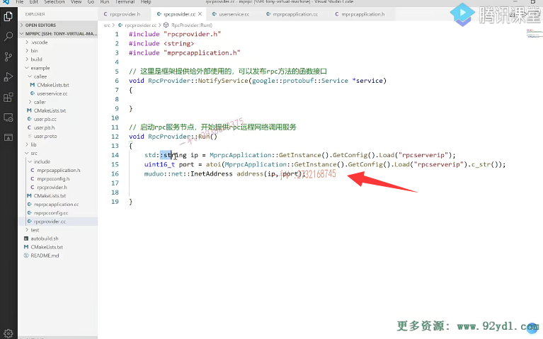

在这里边儿，首先呢，我们定义model。net TCP.server啊，这个是。server，大家来看看TCP server，TCP server这个类可没有默认构造函数，它就有带参数的构造。我们需要传入三个参数loop。

跟addr还有一个。我们这个TCP server服务器的一个名字好不好？第四个选呃是TCP的一些选项啊，我们可以不用传入。第一个是需要传event loop的一个指针。那我们就传我们杠。event loop指针第二个是传add。inet add address啊。第三个，那这个就是我们的一个r。rpc rpc provider吧，我们就给个正名字就可以了。好了吧啊，这是创建。这是model库的编程过程啊。

创建跟之前可能有一些不一样的地方，是我们不想把创建使用model库的这些。复杂的参数呢？暴露给用户，因为我们想让用户使用框架的时候更简单一点，所以把这个model库的启动就都封装在我们。框架的rpc provider的run方法里边的。

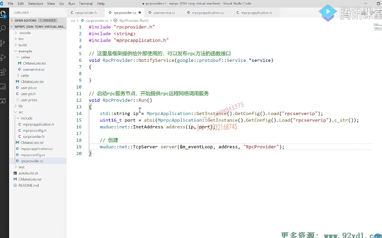

这个run方法让用户会调用的嘛。是不是啊？好了，那在这里边儿我就继续写了啊。这是创建TCP server。对象，

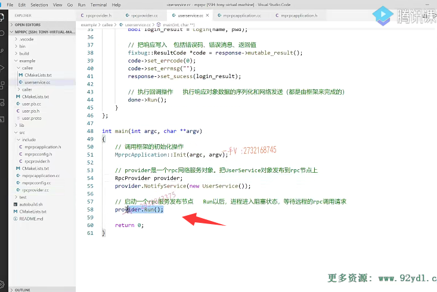

然后该做什么事情了？然后在这里边就是绑定。

绑定。这个回调绑定什么连接？回调和。消息读写。回调。方法okay吧啊。最后呢，我们是不是还要设置这个model？库的线程数量model库会给我们自动的去分发l线程跟工作线程的啊。你如果线程数量是一，那么l线程跟工作线程就在。一个线程中，如果你设置成多个线程，那么一个线程就专门做l线程，接受新用户的连接。

生成呢，相应的这个连接的这个client fd分发给工作线程，剩余的线程数量就工作。

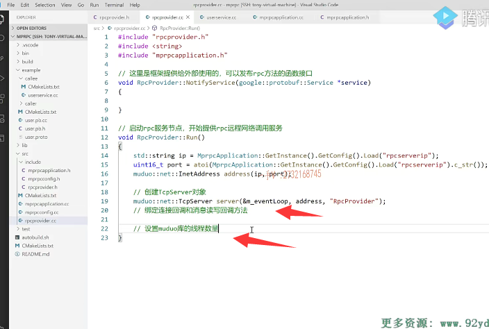

啊，你假如说在这server点这set。thread number.四因为我是个四核的嘛。是不是而写成四的话呢？一个线程是l线程，剩下的三个是工作线程。对不对？这就是一个典型的一个基于reactor模型的一个服务器网络模型啊epo加。多线程是不是？好了，重要的是。

## 使用model库的好处

这个啊，因为呢？用model库的好处是什么呢？我们再啰嗦一下啊，就是很好的分离了。网络代码和业务代码。就是呢，网络高性能的网络部分由model库直接帮我们去做了，我只需要关注的有没有新的用户连接以及已连接用户的读写事件嘛？这不我们写服务器本身就要做的两件事情，是不是啊？

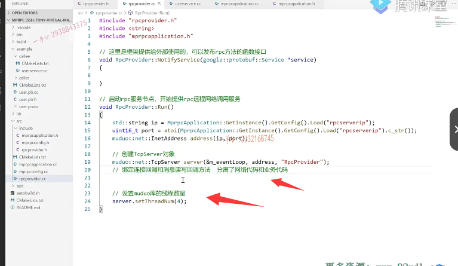

好，那么大家在在这里边来看你看。server server server点。connection call back，

这就设置连接回调是不是？不要去记一些接口啊。你记它干嘛呢？你在这里边儿，你调用这个方法，以后我点进去，我一看哦，你需要这样的一个参数connection copy，我再点进去。而我发现哦，你需要的是一个没有返回值，而且是有一个。参数的这样的一个。回调函数。对不对哎？

我一拷贝过来，那我就可以给rpc provider这里边儿呢？这是。内部使用的，所以不用提供成公有的接口啊。我们提供成on connection。参数你都可以不用要了。好吧呃呃。这个TCP connection ptr我们。找不到，是不是那这个可能是需要包含我们相应的一些头文件了？TCP connection点h。好了吧，你看在TCP connection点h里边有。啊，

智能指针，这是一个share的ptr啊。表示一条连接。好了，那么。我们呢，就把这个。这是心。socket连接。回调啊，我们把这个provider呢在。这里边定义一下这个on connection。我们先不做任何的实现好吧。CON no kay啦。那么在这儿我就可以设置回调了。

是不是啊？设置回调了。

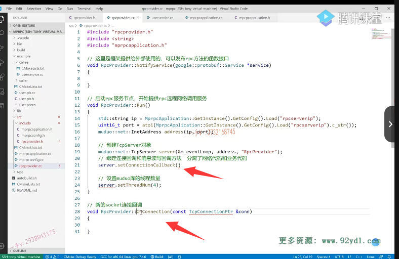

## 设置回调，使用绑定器

那我们在这儿设置回调，我们怎么设置呢？on connection，可是一个普通方法啊。对不对啊？就是普通方法，就是说它实例方法，它需要绑定一个当前对象，用当前的rpc pro对象才能调用这个unconnected。connection方法on connection将来是model库给我们调用的嘛，对不对？所以在这儿呢，我们得需要呢。

用这个绑定器啊，哎。st db and.把谁绑定一下呀？我们rpc provider这个类里边的on connection方法绑定一下，给它绑定就是绑定当前对象就可以。它实际上就有俩参数嘛。一个是this指针，一个是一个TCP connection PT。对吧啊，这个没有问题吧诶，注意呢，因为它需要一个参数，我们给它给它得预留一个。参数的这个位置是不是这就是函数对象跟绑定器的内容，

我在C++高级课程里边儿已经讲过了啊。

