# notify service注册服务的这个方法实现

大家来看啊，这节课我们把这个rpc provider notify service注册服务的这个方法实现一下啊。

那我不想先从这个成员变量直接给大家写起，直接写起的话呢，大家可能理解起来呢，跨度有点大啊。

### user service继承于userservicerpc,userservicerpc继承自service

那么user service，它是从我们pro to buffer提供的类user service rpc而来的。user service rpc又是从谁继承而来的？又是从service继承而来的？

### 框架是给所有人使用的，不依赖业务，所以我们对基类service进行处理

我们之前最开始给大家说了开发框架，你不可能依赖于具体的业务的，是不是某个类啊

因为业务的某个类。谁知道人家用户会定义什么样的类呢？

你框架不能依赖它，你框架依赖它就只能给这个类提供服务了，是不是啊？

框架是给所有人使用的，

所有想把本地方法发布成远程方法的人使用。

啊，所以在这里边儿啊，我们框架处。在这儿就是用这个基类的指针service指针来实现啊，

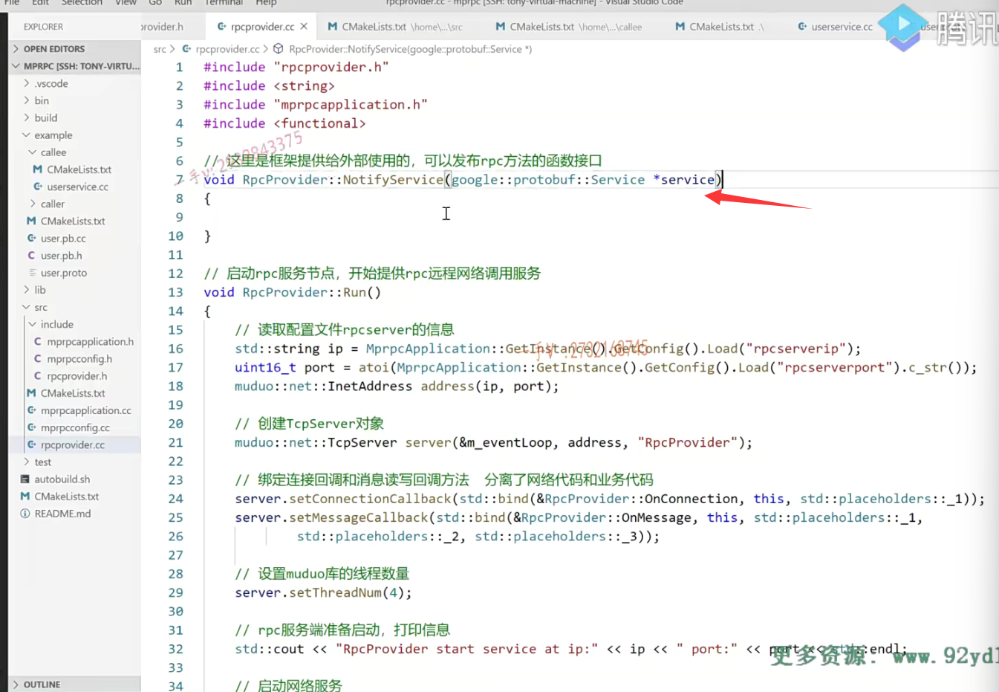

大家先跟我通过这个service了解一下啊，我们protobuffer呢，就是google的这个pro to buffer的这个service。

给我们提供了哪些来描述服务对象，来描述服务方法的这么一些类型，这么一些方法。

好的吧啊，那么首先呢，大家来跟我看一看啊。

介绍这么几个方法。

service嘛，我之前应该给大家说过了啊，它有方法，有一个getdescriptor啊？啊，它生成的这个方法主要就是这几个，还有一个get descriptor。获取一个服务的描述，描述服务嘛，

服务有啥描述的，那肯定就是说你这服务名字叫什么？啊，还有什么呀啊，

还有你这个服务里边儿服务对象这个service，就是我们定义的这个类好不好啊，

我们定义这个类这个服务对象里边儿都有哪些方法？

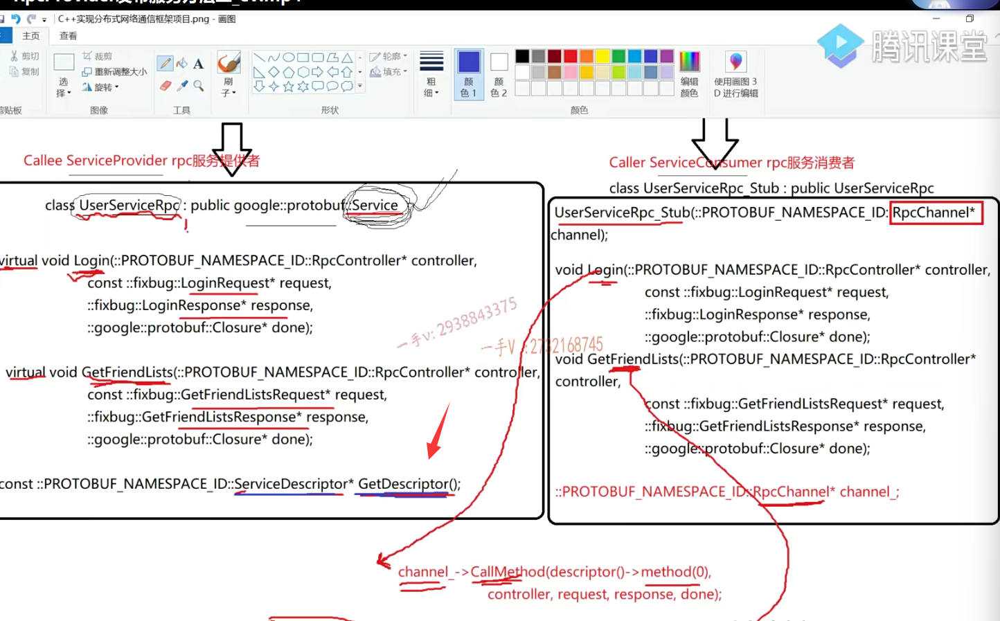

### 获取服务对象的描述信息，是一个指针

对着没啊，那么大家来跟我看一下啊，它的这个返回值是一个service descriptor，是不是我们给大家？写写清楚了，我就不写auto了啊，写auto也没有问题啊，

大家不了解的类型是什么？google port buffer.service descriptor.

==我们来看一下啊，这个返回值是个什么类型？是个指针是不是？==

那我们就写一个指针吧啊。PSD.service desc.好不好啊？service dsc那么等于这个service。啊，指向的。什么呀？get descriptor。

这就是获取服务对象的描述信息。

现在我们给它注册的是我们的这个user service这个对象嘛，对不对？描述的就是这个对象。包括它的方法好吧。

来继续啊，继续那么这里边儿是不是有一些？cannot be used to.呃，我们看一看啊，它这里边有什么？什么错误呢？嗯。

打进去看一看。哦，你看这里边是个什么指针啊？

==这个const常量的是不是这么一个指针，你不能用一个普通的返回值来接受？所以我们这里边也得。==

OK吧好。

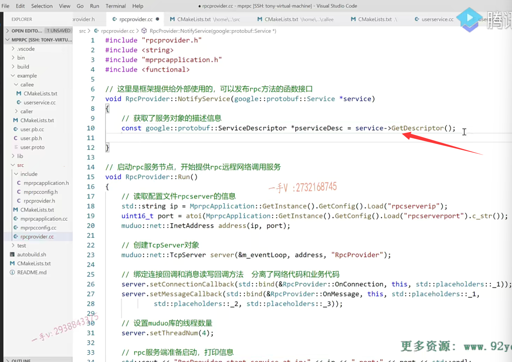

### 根据获取到的服务对象的描述信息，来获取具体服务名字，服务方法数量等

那么，从这个服务对象里边儿，我们是不是就可以得到服务描述里边儿就可以得到这个服务的一些信息了啊。

获取服务的名字。service name就等于pservice点script.

然后呢？这应该是获取什么东西呀？点进去，你看点进去哎，

这是不是the name of the service？phony index.

而很多的啊，还有master count可以知道这服务对象里边到底有多少个服务方法啊？

然后呢，可以获取具体的这个方法的一个方法描述。对不对哎？

就这几个相关的方法，我们去了解了解它。就可以使用了啊。

然后呢，在这就是name。哎，name那么在这，我们看看。

这个name返回的是个什么东西啊？哦，它返回的是个常引用我赋给一个值，这是没有什么问题的啊。

嗯。把这个错了啊，先摆这儿，一会儿编译的时候报什么错，我们再看啊。获取服务对象。

就是这个service类对象的方法的数量啊。那就是它的这个什么呀？method count对不对啊？method.cnt=p service dn。c

获取它的这个method.count对吧啊，method count这个我们。现在呢？这个count呢，应该就一个，

因为我们只有里边儿只有一个login方法嘛。对不对啊？

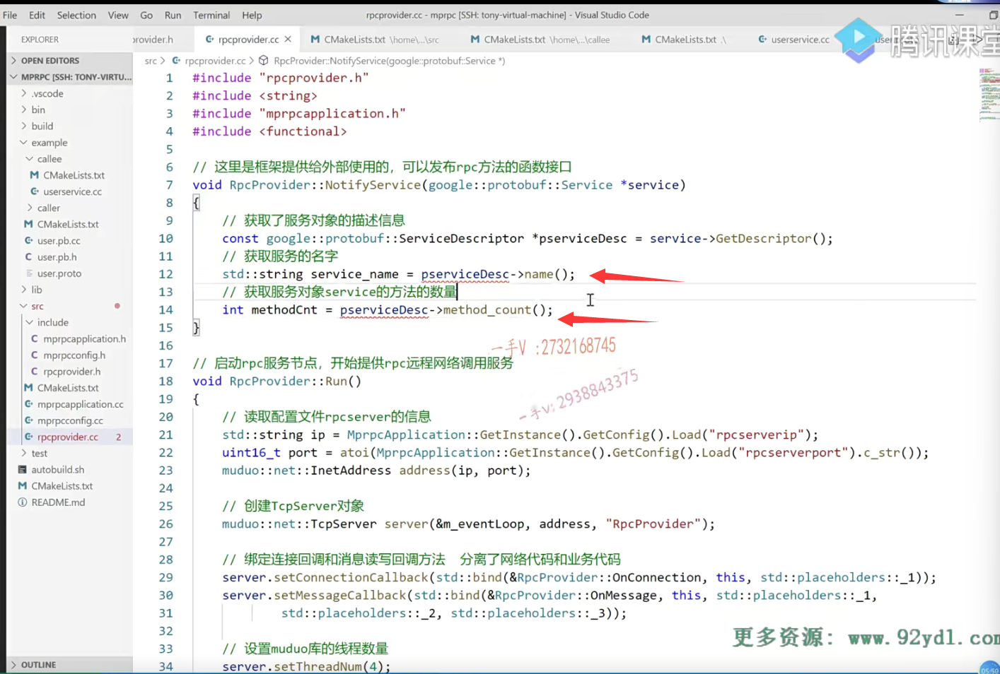

## 解决一下编译错误

### 一般的就是指向了in complete class肯定是找不着相关的这个类的定义，需要加相关头文件

好编译一下吧，先把这个错误去掉，看见这个红色的错误，总感觉很不舒服啊。

这个果然有错啊，果然有错这个。是rpc provider CC多少行啊？

行，是不是invalid use of incomplete type？因为不合法的，不正确的这个使用incomplete type.

不完全的这个类型啊const service descriptor。

还有，这是。这时候我们这个类型用的是不是不对啊？嗯，我们这个类型有什么不对呢？

看看啊，这里边这个错误。可能应应应该是因为我们没有包含头文件啊，最近complete class tap就说是。==你可能不完全的class type，也就是说他只看到了class的声明，并没有就是前置声明，==

并没有看到一个class的定义啊。这里边儿我们要用到descriptor，

我们需要包含一下这个google prot buffer.descriptor点h。

然后我们重新的去编译一下啊，这儿应该已经是没有啥问题了。

啊好了，编译成功了，那缺少头文件，我们大家加上啊，大家加上一般的就是指向了in complete class肯定是。找不着相关的这个类的定义了啊。

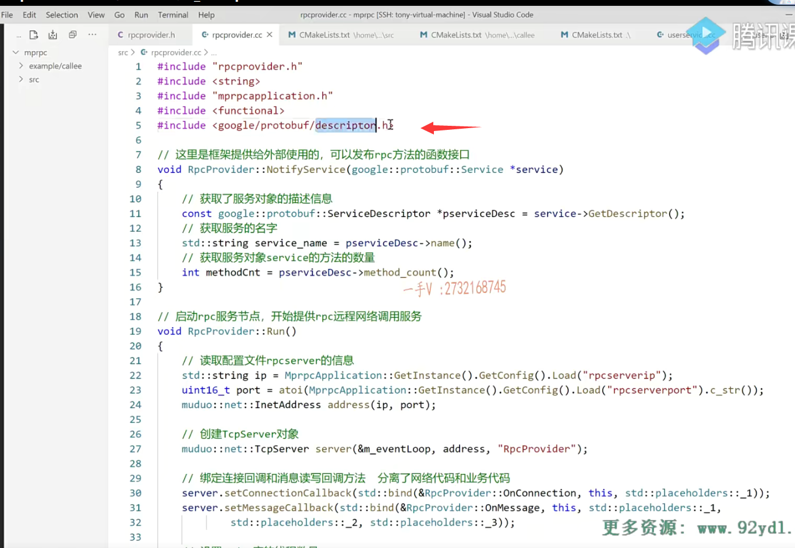

### 获取服务对象指定下标的服务方法的抽象描述

大家注意，在这里边这几个描述。这几个描述哎，然后呢？

是不是也就是说我在这儿inti=0哎？小于多少啊？小于method count，然后是加加I。诶，我在这里边儿，我就可以用什么？它的什么方法呢？method方法。

第几个method，我们一个一个来嘛，

它返回的是什么东西呢？method返回的是啥呀？哦，不是这个啊。啊method返回的是一个method是不是descriptor啊？

我们进来这个里边。service descriptor.你看method啊。、

==method给个序号儿，它就会返回我们这个服务对象里边儿的第几号方法？好吧啊，==

是一个const指针。你比如说只能让我们看啊。这个只能看，不能把玩啊。

不能去乱动它啊，就const指针了嘛，是不是啊p？method.叫p measure的desc。等于这个啊，等于这个。

好，那么在这里边儿，我们继续来看，这是不是应该是哦？

==这里边儿肯定是需要我们包含了名词空间作用域的。==对不对好？这就是相当于获取了服务对象指定下标的服务方法的描述。

这里边儿所谓的描述呢，都是抽象的描述。用method descriptor来描述方法，用service来描述对象，我们说这是框架嘛？框架能不能去写具体的一些服务类服务方法的名字呀，肯定不能嘛，我不可能在框架处写user service，

还有这个login吧？是不是啊？

我是框架，我必须得站在抽象的层面呢？去来表示服务对象，服务方法在proto buffer上呢？

就是用这个service跟method。好不好啊？那既然写到这儿呢？

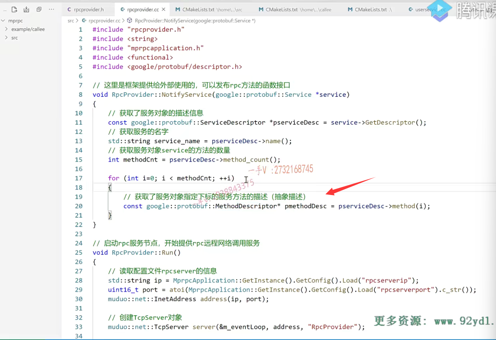

### 组织服务对象跟其方法的这么一个映射关系

我们大概应该就出来了啊，我们应该是这样去存储布局，我们的service跟method的。就是我们应该是。呃，

首先呢，我们应该有一个service name。

service name呢对应了一个service的这个描述。service描述对不对啊？

然后这个service就一个service描述呢？应该又对应了，应该说不只不仅仅对应一个啊。

==应该首先，它对应了一个service的指针。相当于就保存了对象，因为这服务方法都是对象的方法，最后都得由这个服务对象是来调用的这一记录呢。==

这个服务对象。

然后再者就是服务一个服务对象，有一个方法嘛，一个服务对象，它可能有好多的这个方法呢。是不是啊？

==所以它里边儿应该有这个method name对应的一个method这个方法对象。是不是啊？==

那也就是说我们应该这样去组织。啊，组织组织什么呢？

组织服务对象跟其方法的这么一个映射关系啊？

### 定义成员变量，首先是一个struct serviceinfo

好，那首先呢，我们在这个头文件里边儿来输出一下成员变量啊，输出一下成员变量。

先定义一个类型吧struct。

struct就是service in fo啊，service in fo都有什么呢？

首先有service指针啊。service这是保存服务对象的，因为服务的方法得由对象来调用嘛，是不是啊？

然后就是方法了，这方法得是什么呀？一个名字对应一个方法对象，

要不然我不知道调哪个是不是？

### 把rpcprovider.cc中的头文件，移到rpcprovider.h中

啊，所以呢，在这里边儿，我们还得包含这个string。

假如包含string，我们把cdp这里边儿的。我们把cpp这里边儿的这个头文件啊。我们就直接拿到相应的啊CC里边儿的原文件的，这个头文件的包含拿到这个点儿h相应的头文件中来吧。

好不好？在这种方便使用啊。

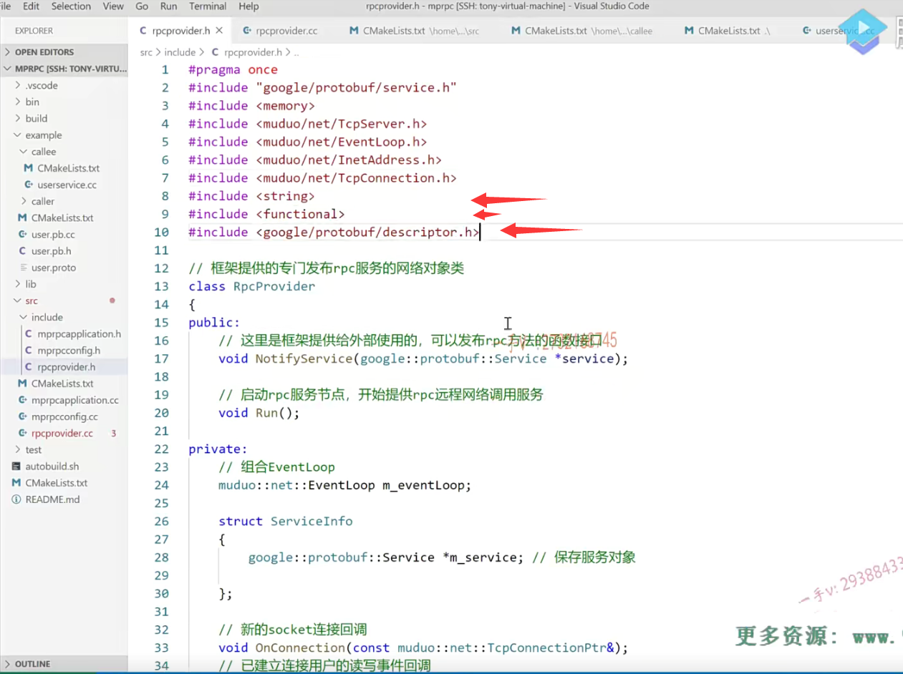

### 还得需要映射表 unordered_map

那就是。啊，还得有一个什么映射表。是不是还得有一个映射表啊？

ude啊，我们把memory就去掉了，这是之前的智能指针，我们没用上啊，用不着。unordered on ordered map.啊unordered on order map，对。

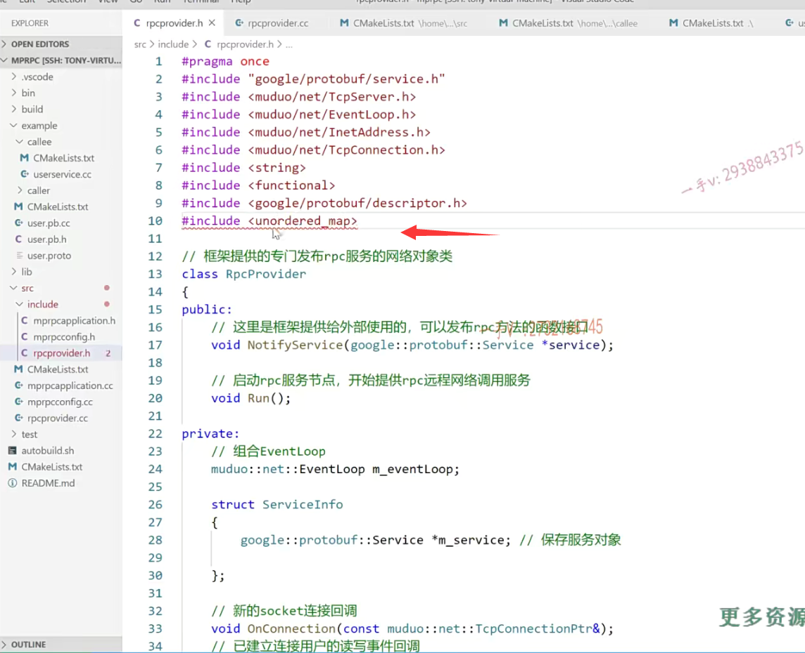

### 键是string,值是描述方法的类型

那么，这是一个ordered on order the map值是是键是什么类型呢？string就是method name对不对？

值是什么类型呢值就是这里边的这个类型。方法的是不是描述的类型啊？

哎，方法描述的类型。好吧，不要省略名字空间啊，不要怕长我们代码都是这样去写的啊，代码都是标准的，代码都是这样去写的。为了防止名字空间污染，我们名字空间作用域是C++它所引用的一个非常重要的东西啊，你不能把它省了。

那么，这里边应该是一个m杠method map。

好吧，哎，保存服务方法啊。这个了解吧，这个类型呢，就是我给大家说的这个。保存了一个服务对象，就是纯粹对于服务的描述，

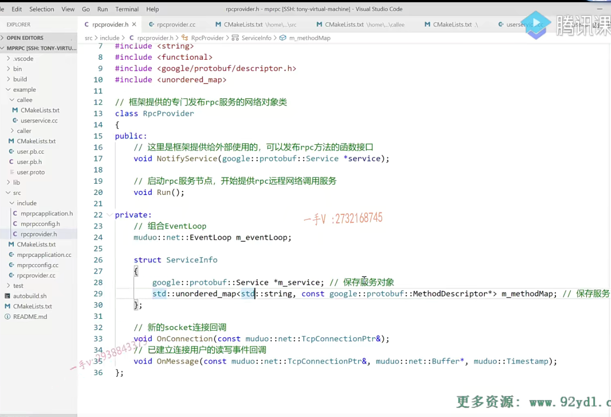

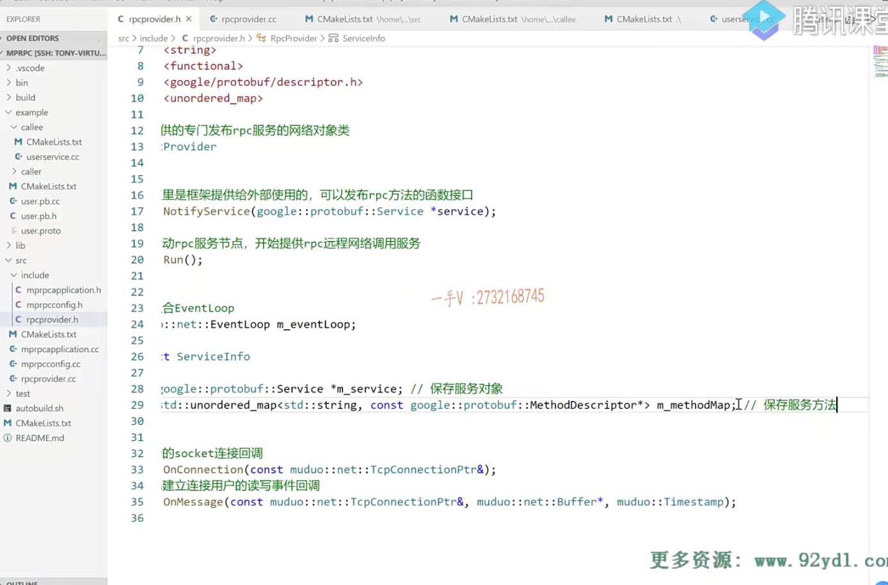

### 还得鉴别服务

是不是我们还现在还得鉴别服务啊？

一个服务有一个服务名字来对应嘛？服务类型信息。

serv se service服务类型信息。在这里边儿呢。就是有一个un order on ordered map，首先是std string，这是描述服务名字的。对不对？

接着是什么？接着就是我们的一个service infer啊。好吧啊，

接着就是service in fo，那么这个是ser VSce service infer map.

好吧，那或者service map也可以。okay吧，那么大家注意这样的一个类型。啊，这是存储什么呢？

存储这个服务。存储注册成功的。服务对象和其方法的所有信息。

这是服务名字对应服务的信息，这服务的信息里边儿有啥呢？

有一个具体的服务对象，还有这个服务里边儿的所有的方法啊。都是用service跟method来描述。是属于抽象层的描述，

因为我们是框架的开发。能不能依赖具体的业务代码呢？我强调了很多遍，不能依赖啊。

那现在我们就是。刚才写的代码往这里边进行填表嘛，是不是填表啊来？

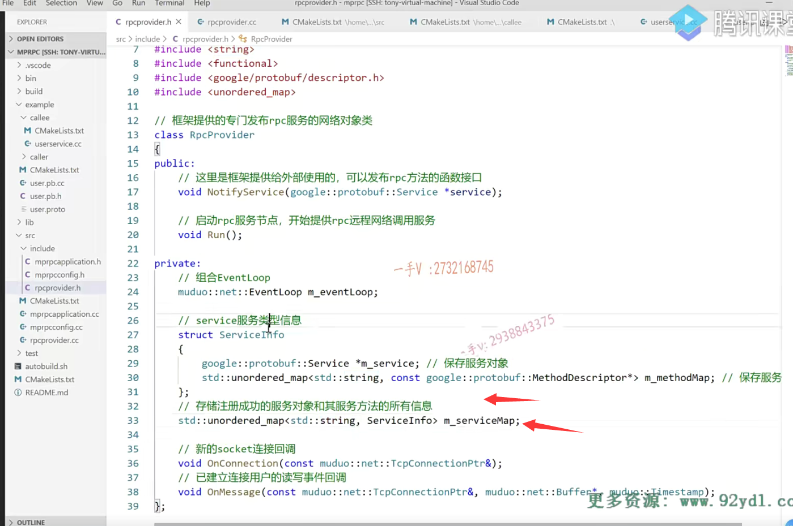

写一下啊，这个对于map的应用，你不能不会啊。

这个是service info吧？这里边填什么呀？这里边儿来看一下啊，来看一下这里边儿有方法了嘛，是不是哎？

有方法了以后呢？这不是有方法名字了吗？

method name就等于什么呀？等于method this。dic肯定有它的name的嘛。是不是哎？

这样一来呢，我就可以给service infer里边儿添加东西了，service infer的什么呀？method map点insert就有东西了。

是这个服务的名字，外加描述服务方法对象的这么一个p method desc.对着没有。

服务方法，名字服务方法的一个对象的一个描述。

啊，就是描述这个方法的。

好吧啊，描述这个方法的。

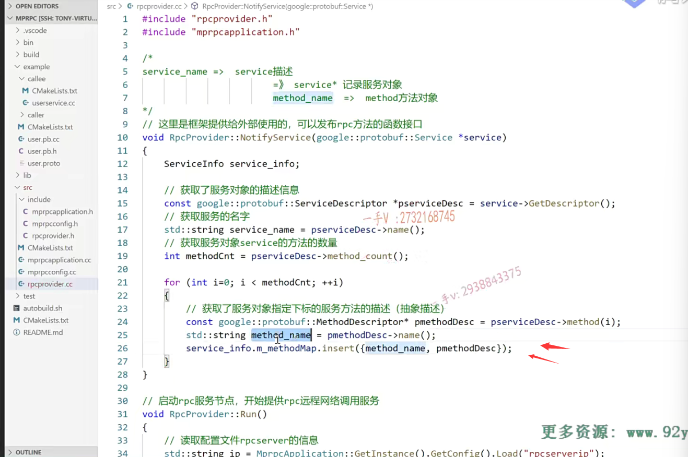

就是最后呢，我们在框架层呢，可以通过调用它。诶，来去调用我们应用层的这个相应的这个login方法好吧啊？

大家先注意。看一下啊呃。在这儿呢，我一点儿一点儿来给大家说吧，好吧，大家也不要着急啊，

毕竟呢，我们在写的是一个分布式框架。对不对啊？

这已经它的起点已经很高了。对吧啊，在这里边儿，你先慢慢去接触，

这(1)也就代表那个方法，这个(2)就代表那个对象啊。

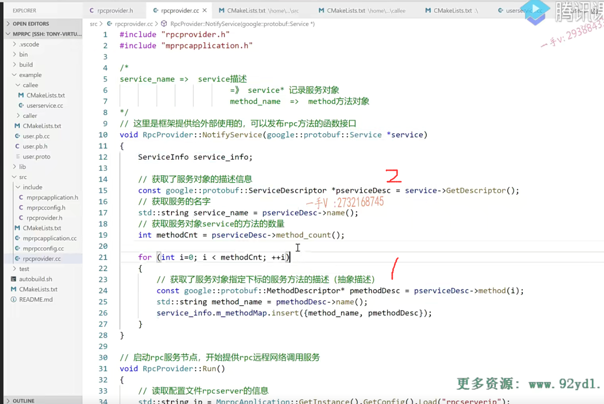

所以我们写完了以后，我会给大家去举一些实际的例子，再去来解释呢，它是怎么运作的啊？

这个把这个服务对象里边儿服务方法全记完了以后呢？

然后service info还有一个成员分量是m service，对吧？

记录一下这个service就是我们参数创建的这个service。

是不是记录于服务对象了，

到时候我们就可以用服务对象来在这个调用这个里边儿的相应的这个服务方法了。

好，这个记完了以后呢，再最终存储一下啊service map点insert。

insert需要什么呀？需要一个服务名字，服务名字就是service name嘛。

啊，服务的具体的描述是不是就是这个service info啊？OK就好啦。对不对？

那我们这个notifier service这个方法就可以了啊。

再去编译一下。看看这个情况okay，编译成功。

那么，注意notify service。你看懂了吗？啊，你看懂了吗？

### 再次梳理

好吧啊，这里边儿实际上啊。说的通俗一点，

就是当你去注册的时候啊，当你去注册的时候。

这个method descriptor描述方法的这个信息里边儿具有方法的名字的嘛。

到时候你远端的rpc请求过来啊，首先一看诶，你要调用user service这个服务对象的这个login方法哎，

人家呢，就会匹配你这不用method name吗？对不对？你就会就会匹配。

诶，你要调用的是login这个名字的方法啊，

那么我就给你去调用这里边service表示名字为login的这么一个服务方法了啊，就是这么简单，

相当于就是一个switch case这么一语句啊，你记录了所有服务对象的方法。

根据rpc请求的这么携带的参数，我就匹配相应的方法，由框架来给你调用就可以了。

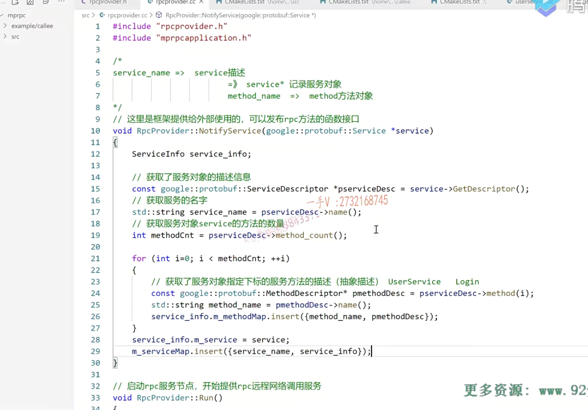

### 打印一下

好吧啊okay，那么在这里边儿呢，我们可以给大家打印一下吧啊。

可以打印一下这个。信息好吧。打印一下，谁呢？

在这里边儿。首先打印一下service name.service name.

这是在打印一下谁呀？它里边儿所拥有的这个method name啊。

好a编译，重新编译一下啊。

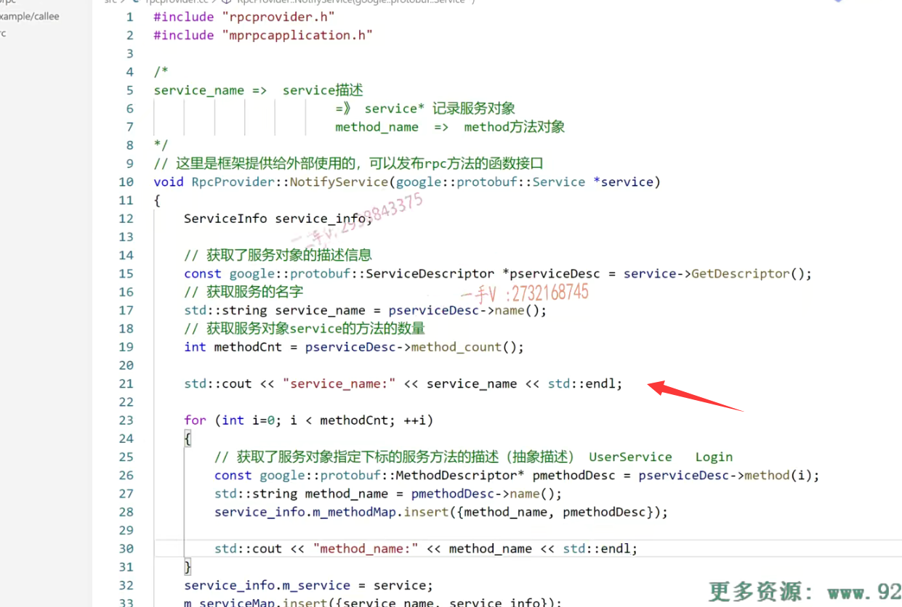

### 执行一下

okay，编译完成以后呢？我们。

来进入bin目录，执行一下它。

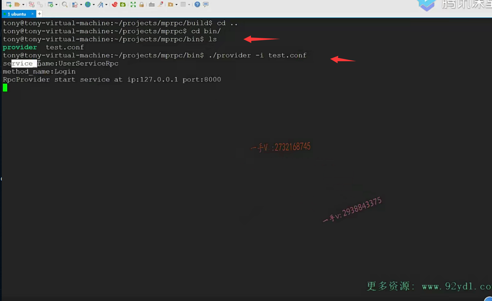

provider.test点conf。age service name是不是就是user service rpc啊？

然后呢？它的这个方法就是login方法嘛？

好吧啊，这是login方法，就是我们在proto文件里边啊。定义的这个service。服务对象的名字以及rpc服务方法 。

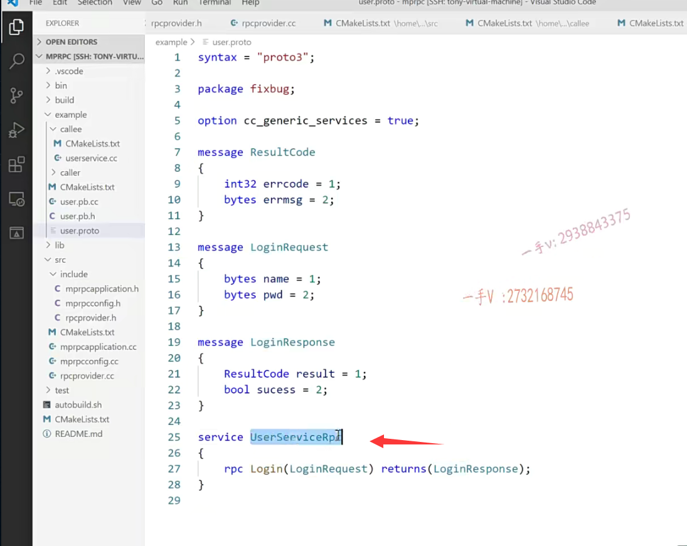

你这也相当于一个rpc服务方法，这是给远程看的啊。呃，

调过来的话呢？那实际上啊啊，最终呢，执行的是本地的，这个对应的一个某个本地的业务。

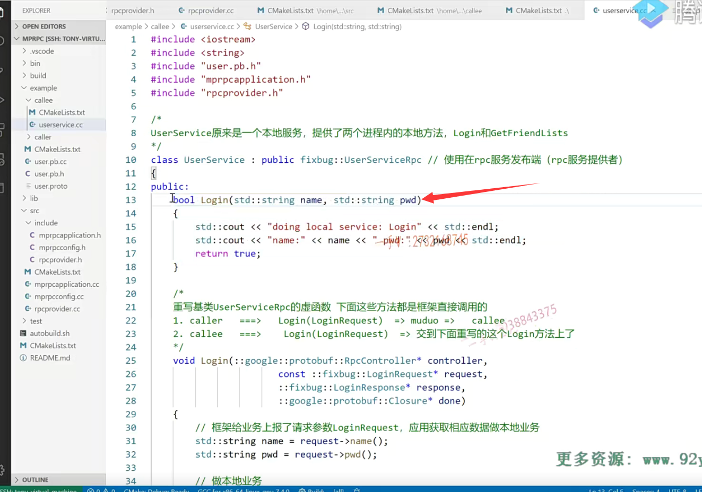

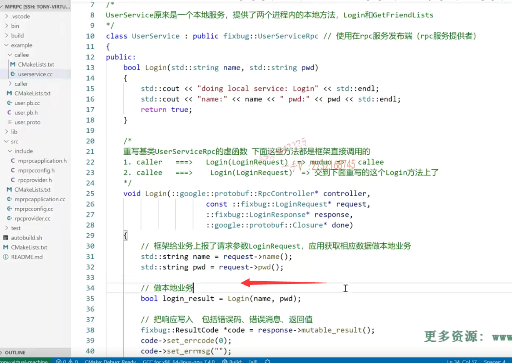

好吧okay，那么。这节课我们的主要的这个任务呢，

就是把rpc provider notify service.代码给它完成了，这里边儿呢，

涉及到pro pro to buffer的一个理解好吧，

那么说到这儿，我就给大家强调一下啊。

首先呢，我们在进行网络这个通信的时候呢，一定会选择一个数据的这么一个协议。是不是啊呃，

你不可能说是没有数据协议就通过这个字节流或者字符流？去进行交互，

那么没有办法交互的啊，我们消息有字段的是不是啊？

## 数据协议 protobuf xml json 

你都得区分一下，那么我们有xml。啊，不考虑xml太老了，json跟这个pro to buffer。好吧，

json存储的就是键值对啊，如果你学习了这个聊天服务器的话json你就明白了啊。

那么protobuffer呢？相对于json来说呢，使用起来大家看是不是稍微有那么一点点的成本儿啊？

但是它比json好用多了啊。

### protobuf优点

==一个是pro to buffer是基于二进制存储的，而json是基于文本存储的。==

所以呢，protobuffer效率会更高。

==protel buffer呢存储数据的时候是紧密存储的，不携带除数据以外，数据以外任何其他的信息，==

==而json呢？你的数据就是你value总得是不是给它对应一个键啊，==

==它有一个键的名字，然后再携带对应的数据。==

### 存储效率高 带宽资源少

==所以整体来说，protobuffer的存储的效率会更高啊，占用的带宽资源会更少，同样的带宽资源呢传输。这个数据量会更大。==

好吧啊，这是它就是使用我们使用它啊，不使用json的意义所在，

### protobuf提供了对象的描述和服务方法

另外一个就是。它不仅仅像json可以定义类型，提供类型的序列化跟反序列化，

==更重要的是p to buffer。人家还提供了啊service rpc方法的一个是不是描述啊哎，==

==人家还提供了我们现在看到的像这个service类。啊method类。==

是不是可以从抽象的层面呢来去描述服务对象跟服务方法，

到时候我们由框架。哎，有底层就直接可以利用上层的服务对象的方法了。

是不是大家想一想，我们永远都是这个上层调用？是不是下层啊啊？

下层怎么能调用上层呢？是不是这本身就是一个回调的概念啊？

回调的概念在这里边service跟method就可以做到这一点，具体怎么做呢？后边我们会给大家看具体的它的一个调用的啊，

你只需要知道在这里边儿notify service。就是我们发布rpc服务的站点通过这个可以发布rpc服务啊，

那我们把它的这个相关的这个信息呢，就记录了什么信息呢，服务对象以及它的支持的服务方法。

到时候框架就可以帮你调用了。好吧啊，

我不断的这个来来回回的车轮儿化，给大家去解释这些东西，无非就是想让大家呢。把这些内容呢，扎根到脑子里边，好好去理解一下。好吧啊，

那么这个项目来整体来说呢这个。大家也有反馈啊。说是嗯，有难度。

当然是有难度了啊，没难度的我也不会讲了。

是不是我们给大家，我给大家所出的这个系列课程，它都是有一个曲线的啊。

最开始的像这种连接池啊。啊，然后就是集群的聊天服务器啊。

然后再到分布式啊，都是一个比较陡的这个曲线一直往上升的，

大家学半天学的都是同一水平的东西，那没有什么长进嘛，是不是啊？

我们总得不断的去给自己设置一些障碍，

然后呢，我们突破这些障碍，大家就会逐渐会有很大的。

这个建构后边，我们还有源码的这个分析啊，源码的这个解读muduo库的。

嗯，很多同学呢，提到自己再去看源码的时候呢，感觉阻碍很大，不知道从哪儿看起，也不知道怎么去理清楚源码之间的这个调用关系啊。能不能出相关的这个课程给我们讲一下，没有问题的，大家可以及时的去留意我课程的这个更新啊，有任何的问题都可以向老师。是反馈一下，合理的话，老师会给你出相关的这个课程啊。帮助大家这个。呃，

尤其是我们高校的同学啊，斩获一个满意的。啊，这个offer好这节课的内容呢，我们就先给大家说到这里。