### 回顾上一节课完成的notify service方法

上节课呢，我们给大家把这个rpc provider这个notify service方法的实现

给大家写完了。

在这里边儿呢，大家结合着这个代码逻辑呢，也理解一下proto buffer对于这个。就是我们在proto文件里边定义的这些service的rpc方法的一个抽象描述啊。

那在这里边儿就是对应的proto buffer里边儿service跟method descriptor好吧啊，service descriptor。服务的描述跟服务里边方法的描述。

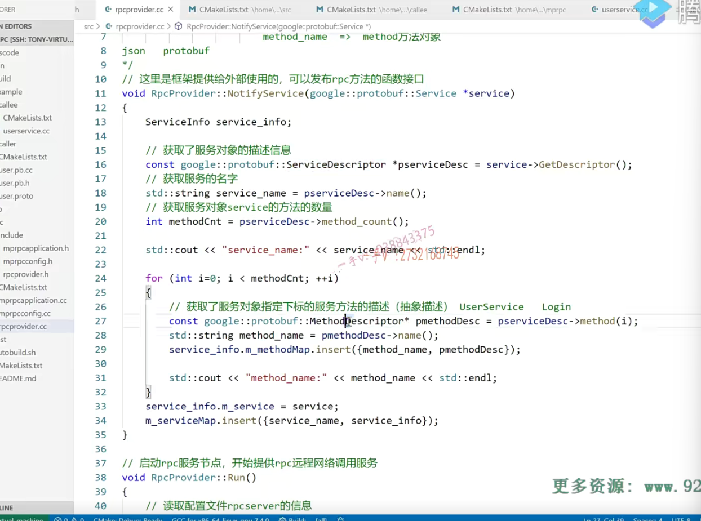

这是站在抽象的角度来去考虑问题的，因为我们写的是框架的代码，不能够依赖业务具体的某个服务类跟服务方法名字对吧啊？

好了，那么结合着这张图呢啊，我们之前给大家分析的，也就是说我们现在已经把rpc provider的网络功能提供了，那也就是说上面这个绿色的这一块啊，已经处理完了。

是吧，哎，已经处理完了。

那么我们呢，也给它实现了notify service，也就是说生成了一张map表。

生成了这张map表，这张map表里边存储了啊，

存储了用户通过这个notify service向我们这个就是利用我们框架啊相当于发布了一个rpc服务器，是不是啊？

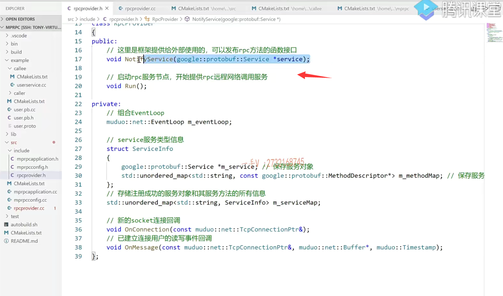

发在这个rpc服务器上发布了一系列的这个服务，对吧？

我说的这个服务呢，就是包含了用户的这个服务对象，以及里边儿的方法啊。okay吧呃，那么。

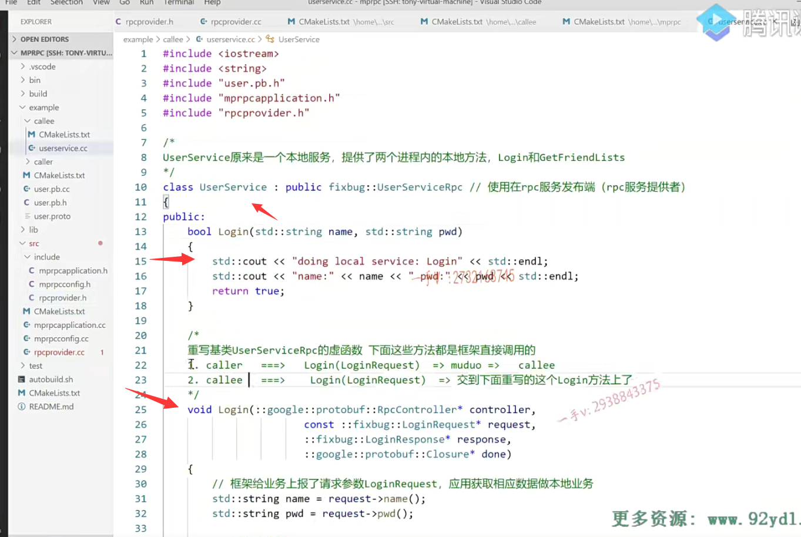

## 接下来考虑黄色的这个序列化和反序列化的处理

接下来呢，我们就要考虑黄色这一块儿。

从网络上接收到消息以后，我们是怎么去解析？

就是反序列化这些消息请求。对不对？

包括后边儿呢？我们还要序列化这个响应啊。

怎么反序列化这个rpc请求？

然后呢？框架根据这个数据所请求的rpc方法，

然后呢？再调用这个具体的业务方法呢？

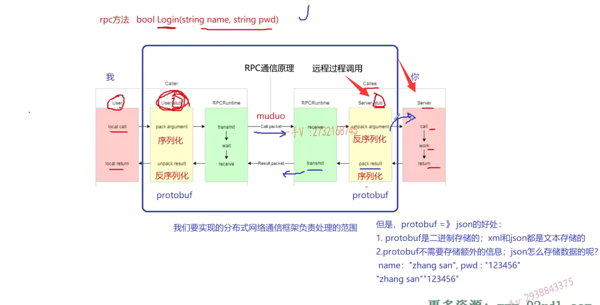

那也就是说是我们这节课主要就是完成这一块。呃，这一块儿一完成，

那我们的这个mpr PC分布式网络通信框架。

啊，在rpc发布端的这一块儿代码的逻辑，我们就实现完了。

### 这一块的逻辑主要在onmessage上处理

也就是说，这一块的逻辑对应的应该在哪里实现啊？

各位。那肯定就是我们的就是这个on message。

因为on message就是建立连接以后的这个读写事件的这么一个回调啊，网络上如果有数据产生的话呢，它就是通过on message。给我们反馈出来了，

那相当于如果远端   远程有一个rpc这个服务的请求啊，这个调用请求。那么on message方法，

那么这个on message方法就会响应。

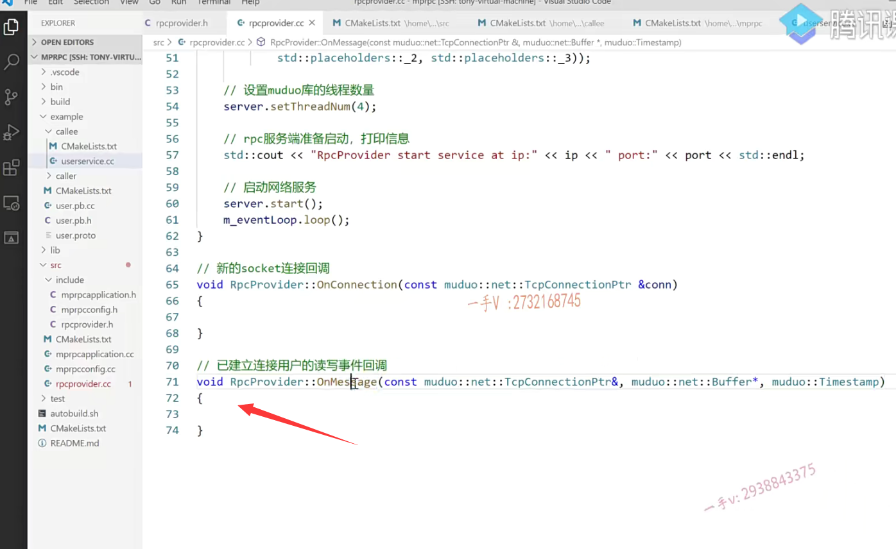

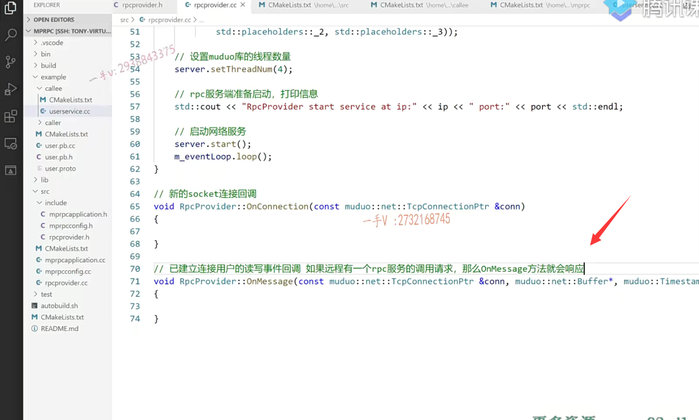

好吧，那我们在这里边儿所做的这些黄色这一部分的这个事情啊，

请求的反序列化以及服务方法执行完以后啊，响应的序列化，

我们就都在on message这里边儿去做了okay的吧。

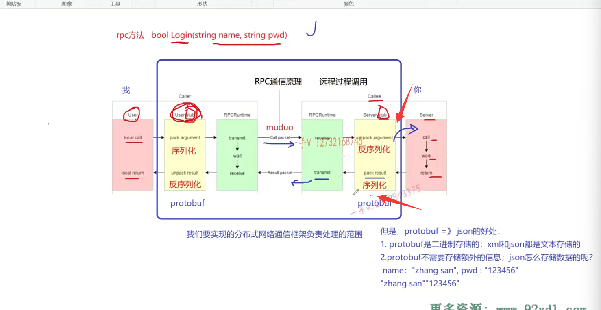

好，那rpc provider主要就是这么几个方法，一个是notify service，一个。

这是run主要涉及网络模块儿的对吧？

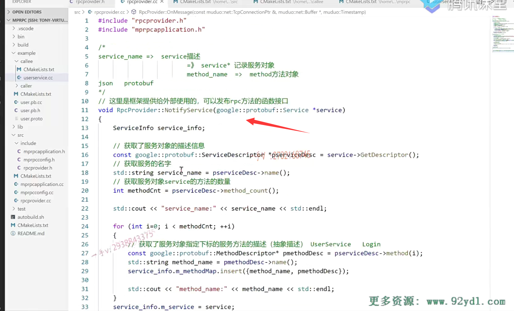

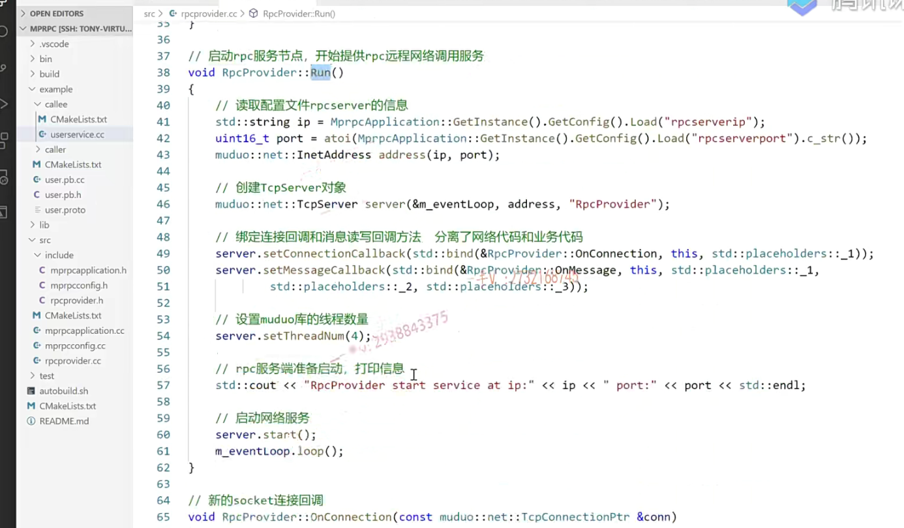

另外就是两个回调，一个是on connection的回调。一个是on message的回调，这两个函数呢，都不是我们自己调的这是由muduo库帮我们调的啊。

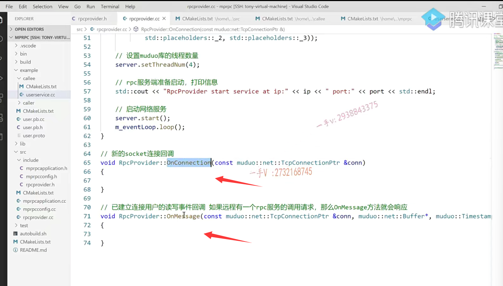

### 先完成onconnection()方法

那么，我们把这个on connection先补完吧，这其实也没什么难的啊诶，

因为呢rpc请求呢？相当于跟也是一个短链接的请求，跟我们http一样。啊，

请求一次，完了以后呢，

我们服务端这一块儿返回这个rpc的这个方法的这个响应以后，

就会主动关闭连接啊。

所以呢，在on connection这里边，如果我判断啊。它的这个状态connected。是FALSE，那就是断开连接了，是不是诶？

断开连接了这表示rpc client这个和什么rpc client的这个连接断开了。啊，断开了，

那我在这儿就要关闭所谓的文件描述符嘛，就是socket嘛，在linux上一个socket就是一个文件描述符。是不是啊？

那在这儿调用shut down诶，不是这个方法啊。shut down方法。

这个对应的socket就是调用了close啊，socket文件描述符给关闭掉了。好的吧啊，这个呢？

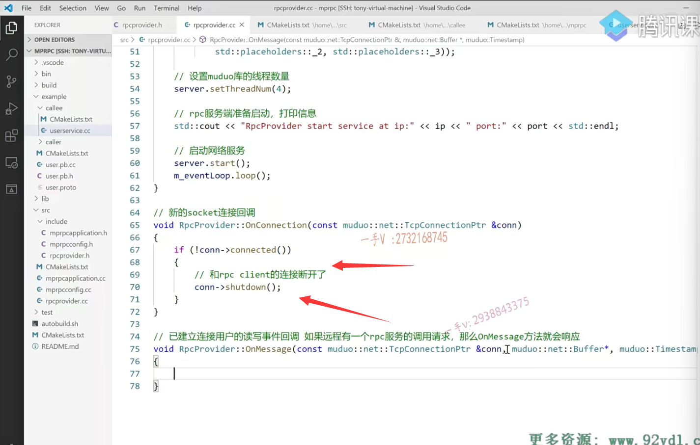

很简单，那接着我们这节课把主要精力呢，就要放在这个on message上。

### 利用muduo库的buffer类方法处理字节流

好了吧啊，那在这里边儿，我们首先就要怎么样一下呀，就要去分析一下各位我们。我们需要去分析一下。就要分析一下这个方法。

从大的方向上都应该做哪些事情？

首先我们知道它接收的是一个字节流或者说我们称作字符流吧，

因为我们直接是用string来接收的啊。

这是一个receive。啊，receive buffer那么这个buffer呢？

==是muduo库已经封装成muduo库里边儿实现的一个缓冲类了啊。==

==通过它的这个方法，叫retrieve alls string就是把网络上接收到的这个数据呢。字节流全部给我转码，放在这个字符串里边了。好不好啊？==

这就是网络上接收的远程rpc调用请求的字符流或者字符数据嘛，是不是啊？

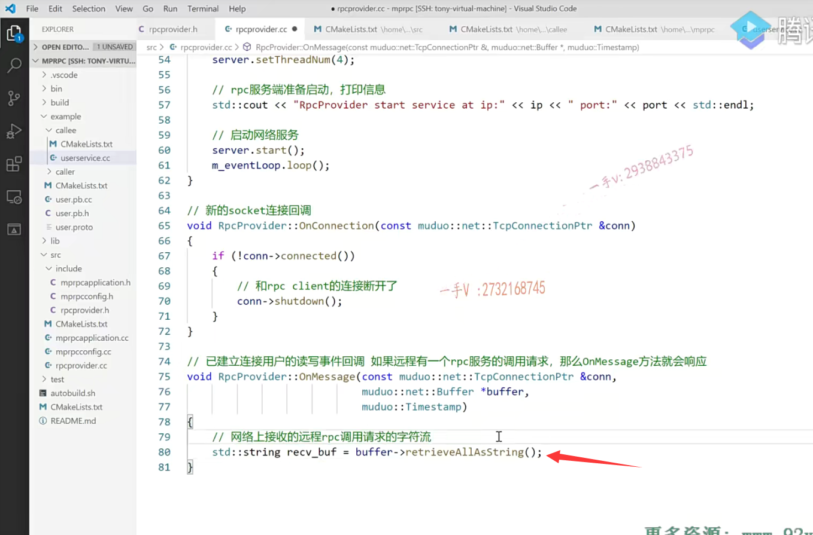

### 远程调用的字符串数据 包含方法名字  方法需要的参数

那么大家想一想啊，这个字符数据里边儿应该包含了哪些?

包含了rpc方法的名字，肯定得包含名字吧？

那还得包含什么？你要调用这个方法。那你还得包含参数嘛？你不包含参数，这login方法在本地执行的时候呢？

那这个login方法人家是不是需要这个用户名和密码的？啊，人家这个函数是需要参数的嘛？那是你调用的，你肯定得给人家把参数传过来嘛，你调用的，我哪知道给你放什么参数呢，是不是？

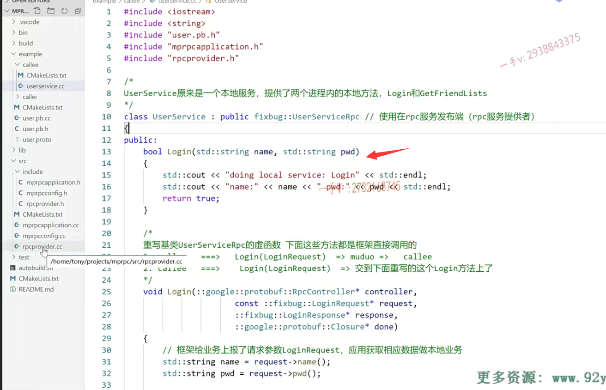

所以呢，你在这个框架上呢，

我们在接收远端的rpc，请求调用的时候，你的方法名。应该都写在上面。

是不是

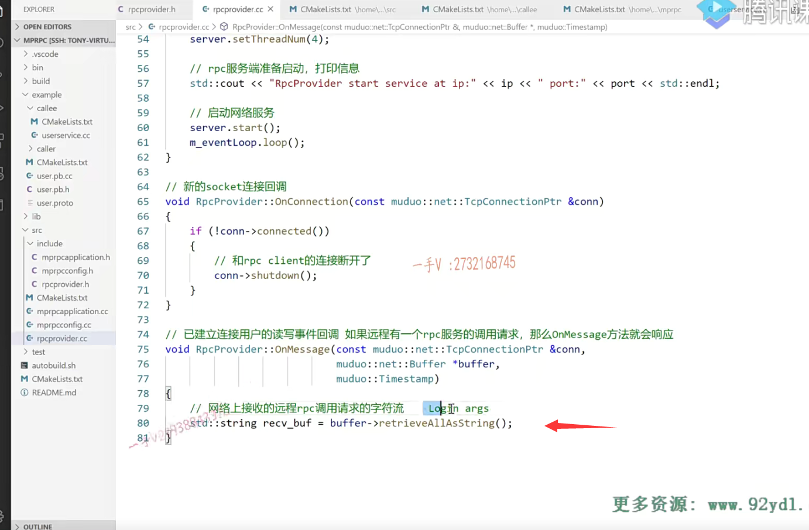

## 如何组织接收的字符串格式

### provider和consumer要协商好

那怎么组织这个格式呢啊？怎么组织这个格式呢？

那么大家注意一下，我在这儿给大家写一下啊。

那这个就是我们要在框架内部啊，

就是在框架内部。rpc  provider和rpc consumer，这是一个消费者 rpc consumer。要协商好之间通信。

啊，通信用的protobuf数据类型，就是你们俩要商量好呢啊。

那怎么商量呢？那首先呢，我肯定带一个service name。还有这个method的定义就是你是哪个服务对象哪个方法，

因为我们的rpc方法发布都发布成了一个类的一个方法。

就对象的一个方法，这些方法执行的时候必须通过对象，这服务对象来调用，对吧？

所以你发送过来的时候应该带一个service name再带个method的name，我可以通过service name。

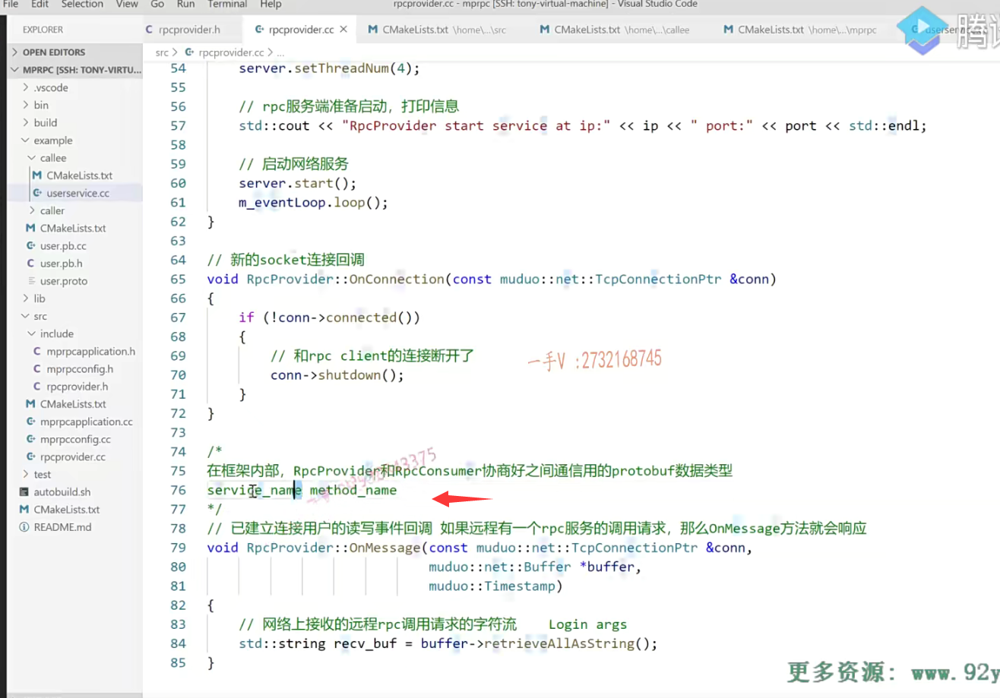

诶，通过这个service name，我是不是就找见对应的service的一个信息了？哎，有service对象，还有它的这个里边儿的方法对象，

你看。通过service name，我可以找见server对象，

然后再通过method name，我是不是就可以找见这个method？

在我们框架中，抽象这一层表示的method方法的一个对象啊。

好吧，那还得有什么，还得有a lgs。是不是啊？还得有这个args，所以你携带过来的数据的格式呢？应该是包含这三部分。对吧啊，

但是同学们，你不能给我整个这样子呀啊service name，然后是login啊，

然后是这个张三。哎，然后再一二三四五六，你说你把这个发过来。

这个我的应用程序我也没办法去区分哪一对儿是service name，哪一对儿是method name，哪一对儿是args啊？是不是啊啊？

没有办法去处理这个，所以呢，没关系啊，

### 定义proto的这个message类型进行数据的序列化和反序列化

在这里边儿，我们把这个我们在框架中啊，也定义相应的这个定义proto。啊类型proto的这个message类型。进行数据的序列化和反序列化。

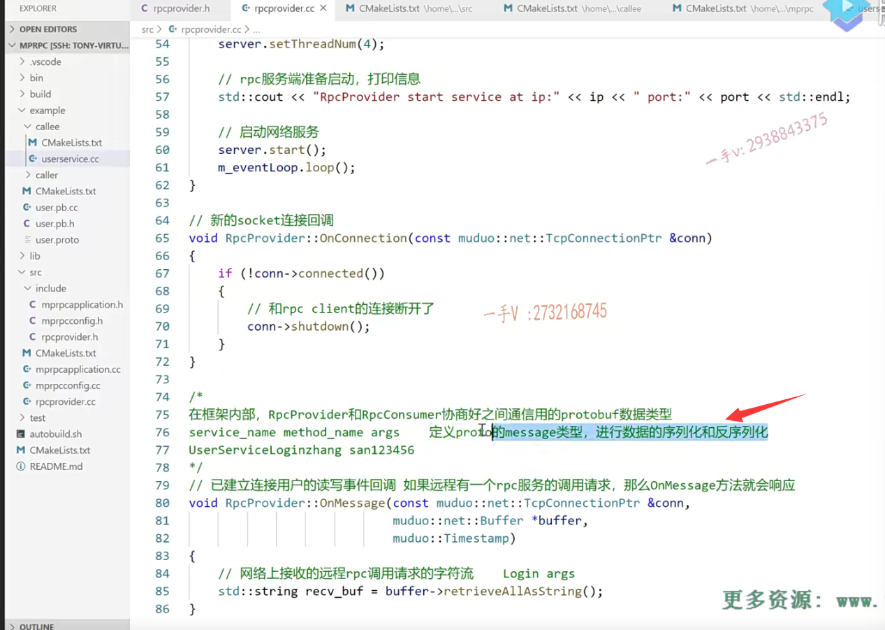

### 数据头的序列化和反序列化

没问题吧啊，进行数据的这个序列化跟反序列化，那也就是说呢，我们可以在pro to buffer的这个配置文件proto文件中呢，

我们来定义一个message类型。啊，里边儿有我们的这个消息头。

哎，service name跟method name，

我们把这个消息头给它表示出来。好不好啊？消息头表示出来。

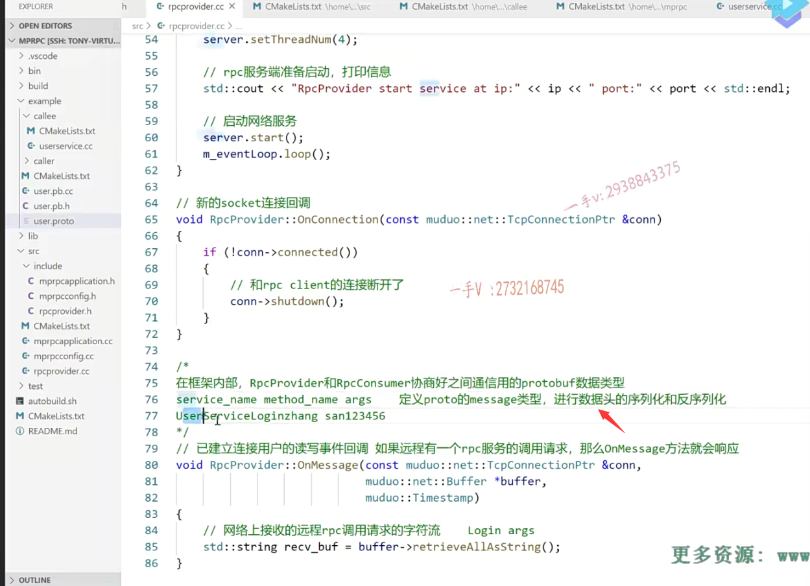

然后剩下的这个呢？剩下的这个就是我们的参数了。啊参数这个参数呢？

它都已经定义过了嘛，因为谁提供的rpc方法，谁肯定就会去定义这些方法相应的这个。是不是啊？

我们在这里边儿，主要就是定义message类型进行数据数据头。啊，进行数据头的序列化和反序列化，主要就是user service等。

这个呃user呃service name跟method name这个。

但是你来一串儿长的字符串，我也不知道前面多长。是不是是包含service name跟method name的？我也不知道多长啊。对准没有啊，

### 还需要知道数据头长度

所以呢，我在这里边应该是这么做。首先呢，应该定义一个header size，再加上header的这个string，

再加上a rgs string。

就是我不仅仅得放service name，method name AR gs。

因为在这里边儿，我们想把前边儿一部分的字符串截取出来，这一部分放了我们的这个数据头。就是包含了这个方法名。啊，包含了这个服务名跟方法名好吧？

但是呢，我们要进行数据的这个反序列化啊，把字符流转换成相应的数据头。

我们得知道这哪一节儿包含了，是不是服务名跟方法名啊？

所以我们得加个header。对不对？就像这个一二三四五六七八九十。十，11，12，13，14，15，16，

那相当于这儿还前边儿还存一个16。哎，我一看读这个16我就知道哦。

==从这儿开始，数16个字符是不是就是我们服务名跟方法名啊。好吧，==

==然后呢？这个服务名方法名完了以后，剩下的是不是就是我们的参数数据==了？

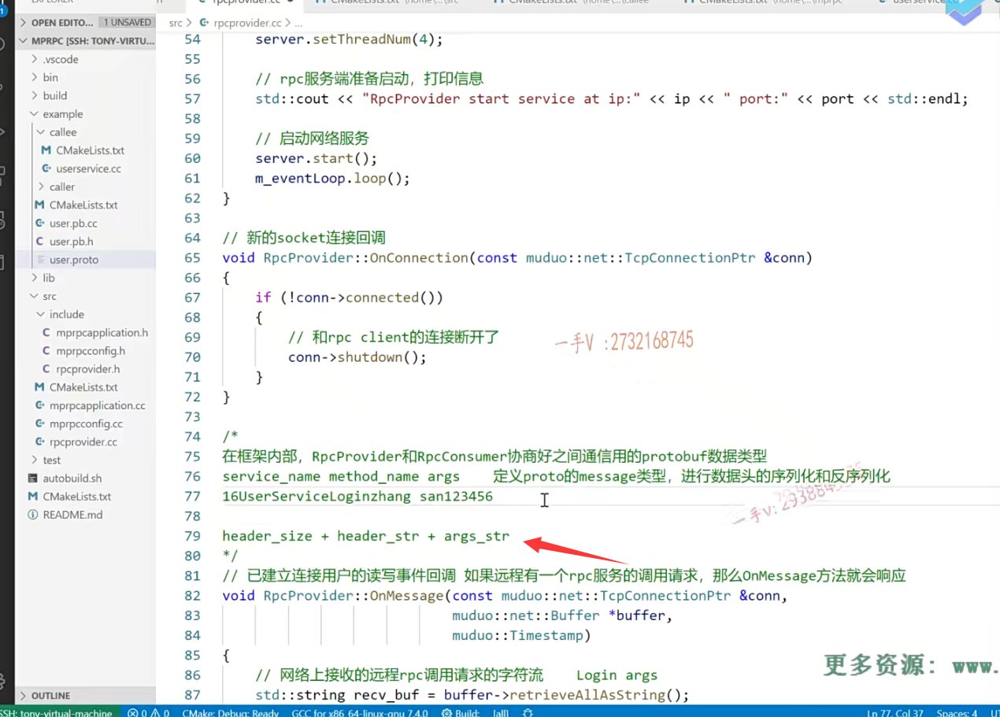

### 解决粘包问题 需要定义后面字符串的长度

但是在TCP通信的时候呢，我们一定要考虑TCP的这个粘包的问题。

是吧，粘包的问题，那剩下的这个字符串呢？有可能是当前的这个请求跟下一个连续的请求的数据混到一块儿了啊。

所以，为了解决TCP粘包的问题的话，

我们得给后边的这个参数所代表的字符的长度也要记录一下这个参数的这个字符的长度。好不好啊？

所以呢，我们在这个headerstl里边呢？就是这个message里边。啊，message里边。我们不仅仅要记录什么呀。不仅仅要记录service name。还要记录method的内容。我还要记录一个args什么东西啊？size就是呢，在这个数据头里边记录一下后边参数的这个长度哎，我截取长度作为我参数的这个原始的字符流进行数据的反序列化。

好吧啊，要不然出现粘包问题的话。

我们不记录后边的这个参数的长度。啊，就有问题了，好不好啊？就有问题了。

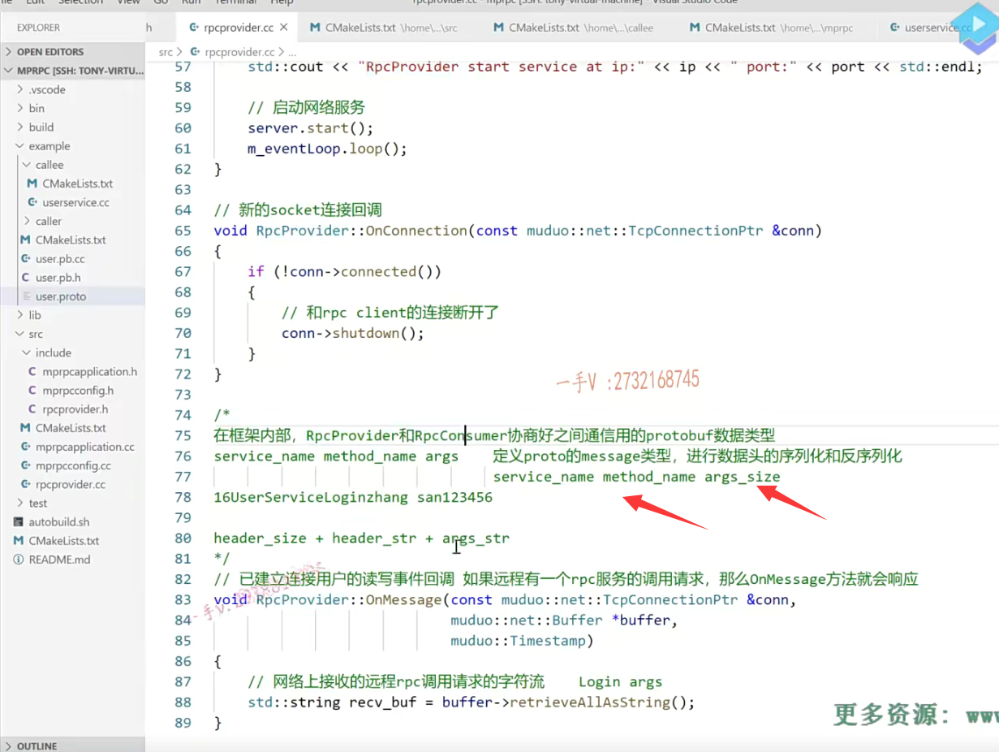

## 格式

大家能够理解这个意思吧啊，大家想一想，我刚才所说的啊。所说的也就是说我们在框架内部啊，就是rpc的客户端跟rpc服务器之间通信呢，所遵守的这个数据的格式

就是一开始先读四个字节。

这是四个字节。表示什么意思呢？

==这四个字节就表示一个长度什么长度呢？就是我们数据头，==

数据头是什么意思呢？就是除了我们方法参数。之前的所有的数据包含了你所调用的方法的这个所属的服务的名字，方法的名字对不对？

我们通过服务的名字跟方法的名字才能去找到什么呀？才能够去找到它所对应的服务对象的方法，对象是不是啊？进行在框架中来帮我们调用啊。

应用层是不是相应的一个rpc方法啊？

==为了防止粘包问题啊，我们后边儿呢，不能说除了service name method name，剩下的就全部都是这个方法的参数了，我们在数据头里边儿就是还记录了一个args size，就是包含方法参数的这个字符串这样的一个长度。==

好吧啊，那么对于这一块儿的这个数据的这个解析。

我们也用proto buffer来进行数据的序列化分发。去的话，否则我们没法去区分这些东西，

你不要在这些东西说我中间加个加个竖杠啊，加个竖杠来区分。

这太垃圾了。啊，太垃圾了，这上不了台面儿的处理方法好吧啊。

这些数据。原始的数据，具体的内容跟网络上接收的字节流，字符流之间的序列化跟反序列化应该都得交给json或者proto buffer来做，

那就看你项目中具体的。这个数据序列化反序列化协议好吧，

### 描述数据头的这个消息类型

我们当然用的是pro buffer。

好，那么在这里边，大家来跟我看一看。我在这儿呢，在我框架src这里边就得创建。

我给大家起个名字叫做rpc叫做rpc header proto或者直接叫做这个啊。啊，

就叫header吧，好不好？rpc header

连proto啊？sy cx=proto。proto 3啊。

呃，然后呢？package package我们叫做mprpc吧，这就是namespace的名称好不好？

然后就定义message，这个message是rpc。head he a header.

OK吧，然后它首先有一个什么东西呢？

有一个service name。

还有一个method name。

还有一个长度是不是啊？有一个长度就是args size 

okay，这就是我们描述数据头的这个消息类型。

okay的吧。好，然后呢？我们去这个地方呢，用命令行去生成一下相应的这个。

去生成一下相应的。C++代码文件啊pro toc，

然后是底下的这个rpc header点。proto杠杠cpp下横杠alt等于点杠就生成在当前的文件目录下。

好的吧啊，然后生成好了，生成好了以后呢？

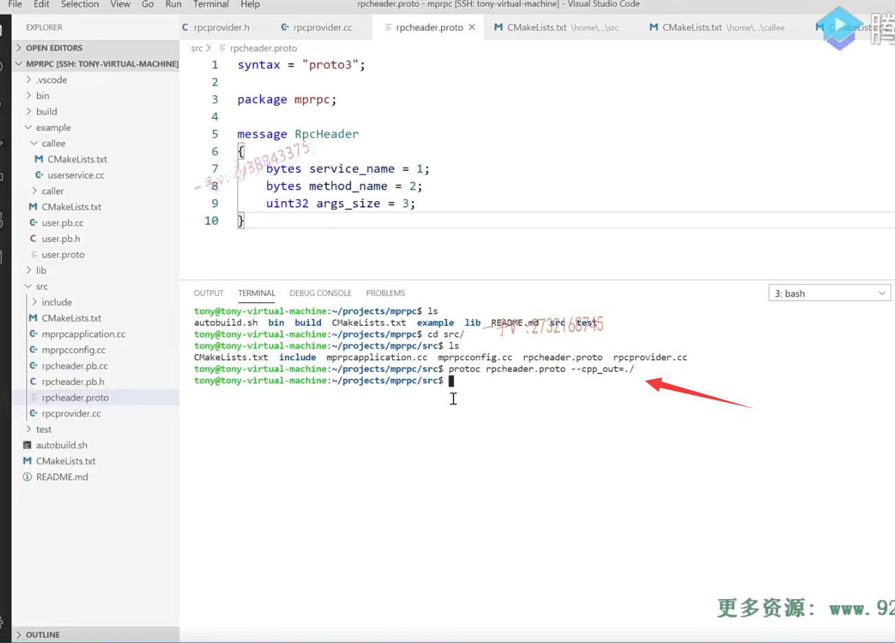

大家来看啊。我生成好了以后。

在这儿这代码就在这儿了啊。

那我在这个文件中啊，包含一下。我们是刚才生成的这个叫做rpc header，点PB，点h。好不好？

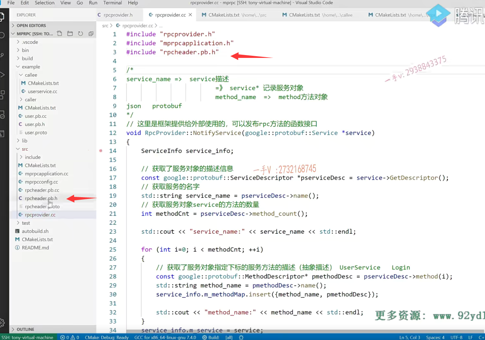

这里边儿呢，就会生成一个类，这个类呢，就是我们刚才在这里边定义的消息类型啊。

好，那我们准备工作呢，现在已经做完了啊，做完了那么大家来跟我看。

## 怎么解析我们想要的这个数据

啊，我们怎么要从这个receive buffer里边儿去按照我们规定好协商好的这个数据格式来解析我们想要的这个数据呢？

首先啊，我们要在这里边儿读取的是一个header size，这是一个四字节的一个整数。

### 可不能将长度数字直接转化为字符串，通过网络发送，无法识别

那么，同学们，这是个字符串啊。你从字符串怎么读取这个整数呢？

开头读取这个整数呢？这东西都是整数。10和100都是整数，

但是你要把它放到字符串里边，这俩长度一样还是不一样啊？这肯定不一样了。对不对？

如果你纯粹的把整数转成字符串放在这个放在这个，通过网络发送过来的话呢，

那我看看在这里边儿根本就没有办法去取前边儿的这个header size呀。

这个能不能理解我的意思，你不能直接把长度的值就变成转成字符串啊，

转成字符串格式。然后在这里边儿呢，进行一个发送，

那你发过来，我根本就不知道你这字符串前多少个字节是header size，你说的四个字节。我的长度要是一个一万的话。你这把它转成字符，这是几个字节，一二三四五，这是五个字节呀。对不对？

## 我们的规定  真真正正的进行整数的二进制的存储

我们的规定是什么？长度嘛，不就是四个字节一个整数嘛，是吧？

所以也就是说呢，我们到时候存的时候可不是说把这个整数表示的这个长度直接转成字符串进行存储。

而是真真正正的进行整数的二进制的存储，

存储的范围就是字符串的前四个字节。好吧，

这里边儿主要就用到了string C++string这个类型的 就是insert 和copy这个方法。

它在处理我们这个按内存大小在处理这个数据的时候呢，就非常的有用了。

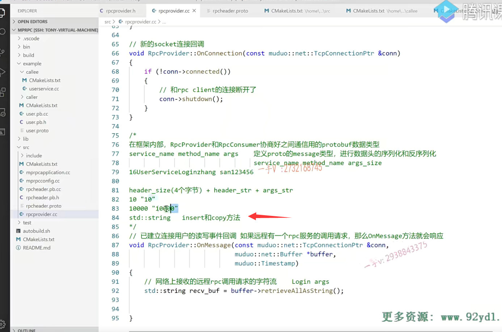

大家在这里边一定要搞明白。好吧，

我们遇到的问题是我们不知道读前边儿多少个字节，

你读四个字节，你要是这样存的话，你读四个字节，你是不是也读不出来正确的size呀，

所以也就是说我们需要把这个header size代表这个整数按二进制的这个方式，也就是直接按内存的方式。啊，直接存到呢字符串的四个字节，这是固定的。

好吧啊，你传成字符串这一个整数呢，那可长可短了，不一定四个字间能存下来，但是你按二进制存的话。整数是不会超过四个字节的，这是它的取值范围，对不对啊？

### 这个数据从字符流中读取前四个字节

好了，那在这从这个数据从字符流中读取前四个字节的内容。

好，大家来看啊，我是一个uint 三二    

okay吧，是一个header size。

那么大家来跟我看一下啊，这receive buffer对不对点copy？

我用到这个copy这个方法啦。

哎copy什么呢？第一个就是叉儿星，第二个就是一个长度，第三个呢就是一个位置好不好？

第一个header size。你刚刚看的第一个参数是什么？是叉儿星对不对？

哎，是叉儿星。那我们就给它转成叉形参数

第二个是长度，我从原始字符串里边儿拷贝多少个字节出来啊？

拷贝四个字节的内容直接放到我们从这个起始地址开始放放四个字节，刚好就把这个had said这个四个字节的整数长度放在这个整型变量里边。

OK吧，然后还有一个第三个参数，第三个参数就是pose从零开始读呗。

你看这个就是我们读的这个header size。

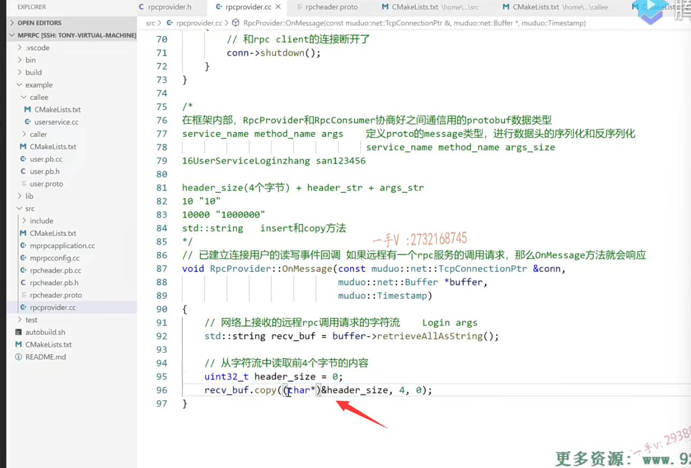

这要搞明白。啊，这是把string里边的内容，从第零个字符开始拷贝四个字节的内容放到这个制定的这个内存起始地址的四个字节里边

就刚好放到这个总数里边了。这个就是固定长度的，对不对啊？

固定长度我们直接存的是这个整数的二进制，并不是说把整数的每一个数字变成字符进行存储。

这样的话，我们就无法去区分字符串的前面有多长的？

数据是代表exercise 好了，我就说到这儿，这个问题你应该能够搞明白了啊。

### 根据这个header size读取数据头的原始字符流

接着啊，读取就是根据这个header，size读取数据头的原始字符流。原始的这个字符流。

那么在这儿就是。string rpc.rpc header.这个STR。

好吧啊，那就等于原始的这个receive buffer点substrain从哪儿开始啊？

从四开始多长呢？header size substring大家不陌生了，

我们在读取这个配置文件的时候也都用过了，我给大家说这里边用的string都是常用的方法啊。

从第四个字，从从第四个下边儿开始。那就是把前四个字节的这个header size略过，然后读这么长的一个长度的字串。

这是不是就包含了我们的这个service name，method name还有一个arg size呀。

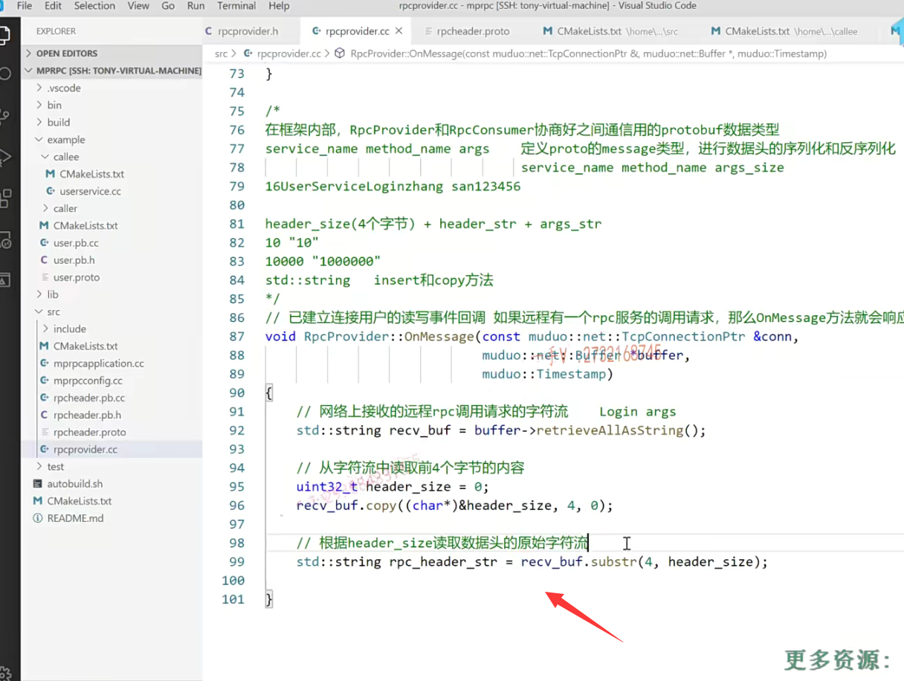

### 然后反序列化数据rpc请求的详细信息

okay，然后呢？在这里边进行什么？然后反序列化数据。得到得到。得到。lpc请求的详细信息。怎么说呢？

这是原始的字符串嘛？我们现在要进行数据的反序列化，对不对？

哎，反序列化。mpr PC.的rpc header好不好？

rpc。adr lpc header就等于谁呢？你看rpc。header点。pass from谁？是不pass from string啊？

直接把一个string。呃，放到这里边儿。好不好？

大家直接放到这里边。啊，我们这个是。应该怎么写呢？

呃，这参数是接收的是一个引用是吧啊？

那我们就直接把这个放过来就。好不好pass from string？

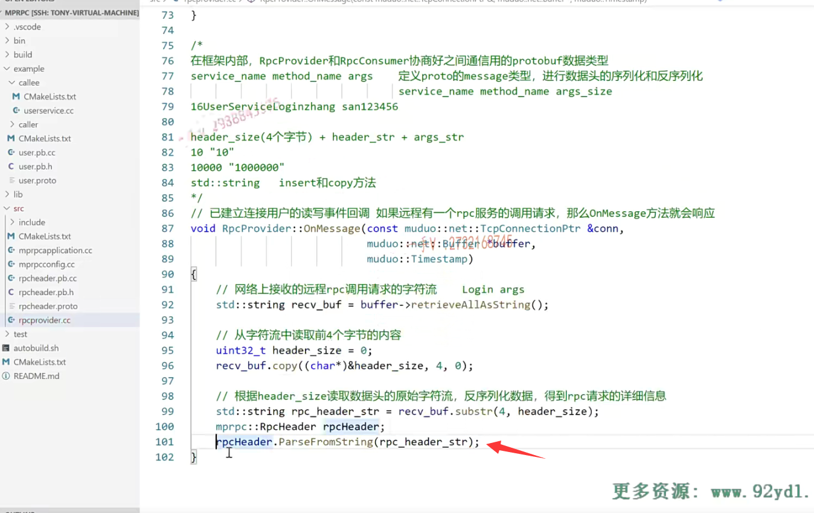

### 返回的是一个布尔值 判断  失败打印日志

嗯，返回的是一个布尔值，对不对？

那就是if true。那这个相当于就是怎么样了？

在这儿数据头。啊，反序列化成功。

那else就是数据头，数据头反序列化失败。

这个是需要记录日志的好吧啊，需要记录日志的STD，我们先用sell的打印一下吧啊。打印一下，

就是这个。rpc.这个PA。se error.这既然已经error了，就不用再往后走了，是不是啊？

相当于就接收了一个无效的一个数据，对不对啊？

我们对于数据的有效性都进行判断啊。

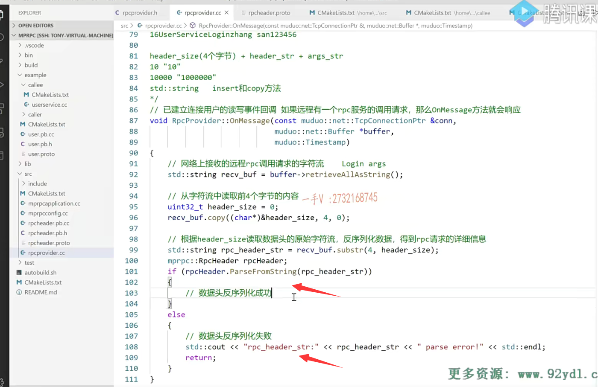

### 反序列化成功

反序列化成功，那相当于就是把这个字符流里边数据全部装到rpc header里边了。

那从这儿呢，我是不是就可以取出来，我们想要相应想要的这个数据了，都有哪些数据呢？

各位叫做service name还有什么？叫做method name还有什么？

uint.三二啊，还有就是它的arg s size。

okay的吧。好了，那么在这儿。嗯，这是啊说我not type name啊，这是个什么方法呀？这是个普通方法，

用对象来调，这是没错的，对吧啊？OK，好着呢啊，刚才红色的波浪线应该是。我们的工具呢？没有刷新出来。

那么，在这里边service name。就等于与这里边儿rpc header点什么呀？service name.

method name就等于rpc header点method name。这是它生成的方法，读方法嘛，是不是啊？

还有一个就是alg s size=rpc。点儿点这个arg 3。

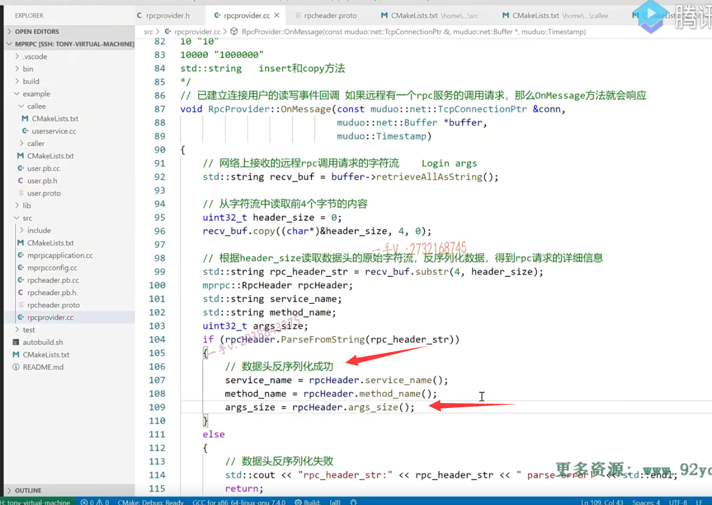

你在proto里边定义的这个成员变量啊。它会给你生成读写方法，

读方法呢，就是变量的名字，作为函数的名字了。

写方法就是在前边加一个set下横杠就变成。成员变量设置的方法对吧？

这块儿应该都能搞明白吧啊？

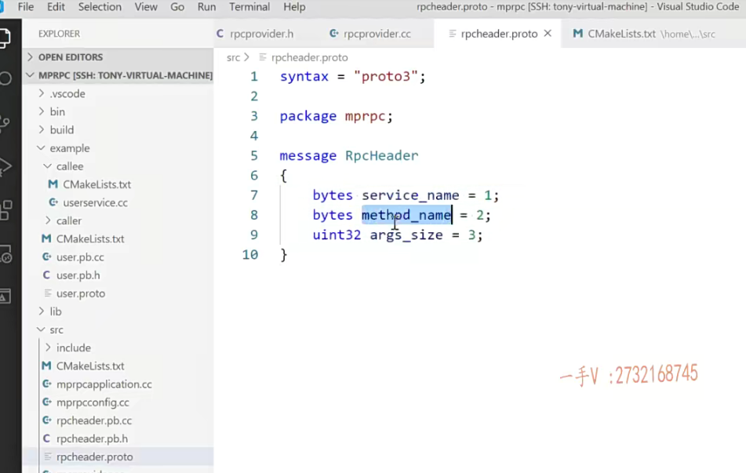

### 打印信息，看对不对

这相当于就是把service name，method name。

好了吧诶，在这儿呢。调试这个打印调试信息。

啊，各位，我们打印一下。打印一下，防止这个出错啊。

因为这儿信息相对来说还是比较多的啊。

我们先打印一下这个header size，看正不正确？

还有没header size跟。rpc.header string也打印一下。

然后还有这个service name看解析的对不对？还有method name。

是不是我们应该还有一个啊？应该还有一个解析出这个是获取rpc方法参数的字符流数据。

那么就是。string arg s.参数的STR对不对？就等于这个原始receive 8份儿。点substrain从哪儿开始啊？应该把前边儿这块儿的话都怎么样？

把前边儿这块儿都越过是吧？前边儿这个是多长啊？最开始的这个header size是四个字节。这一块的长度是不是就是这里边的还有？

剩下的就是截取的这么一个长度，截取的长度是不是就在headers就是在header？就是头数据里边的arg size，那是不是应该就是这个样子？

各位来看我写一下啊，起始的这个下标四。加上header says对着没有。

各位对着没有？就是把前面的这个header size跟图数据。都略过，从这开始多长呢？那就是arg 4s啊。啊，就是我们读取这里边读取的argc。这就是rpc方法的参数。你看现在有像调用的方法的。呃，所属的服务对象的名字，方法的名字以及这个方法调用所需要的参数是不是都有了？啊，我们在这儿再把这个参数的字符串，我们也。

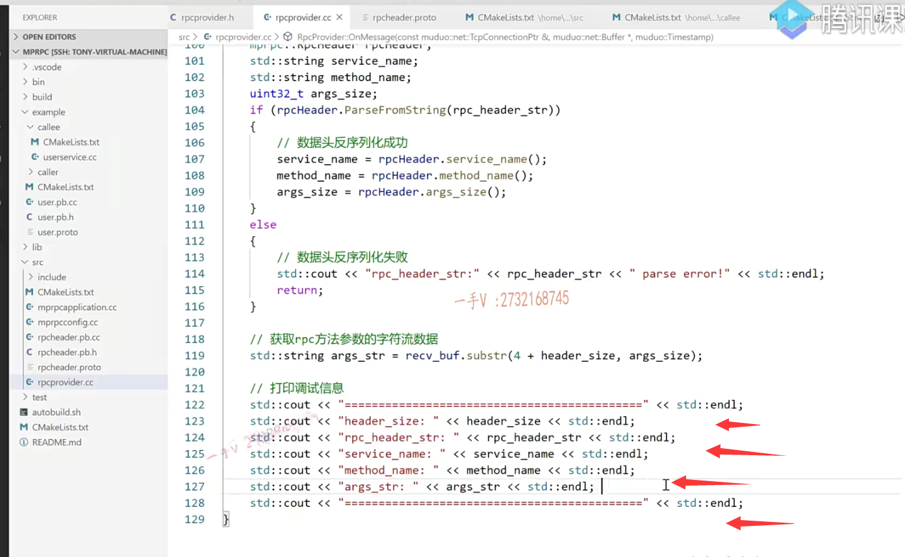

好了，那么写到这。你是否能够明白？

今天这节课我们主要做了两件事情。

## 总结

就这一块儿呢，是对应的是啊，我们rpc发布rpc服务的节点呢，从远端接收到了一个rpc调用的请求，

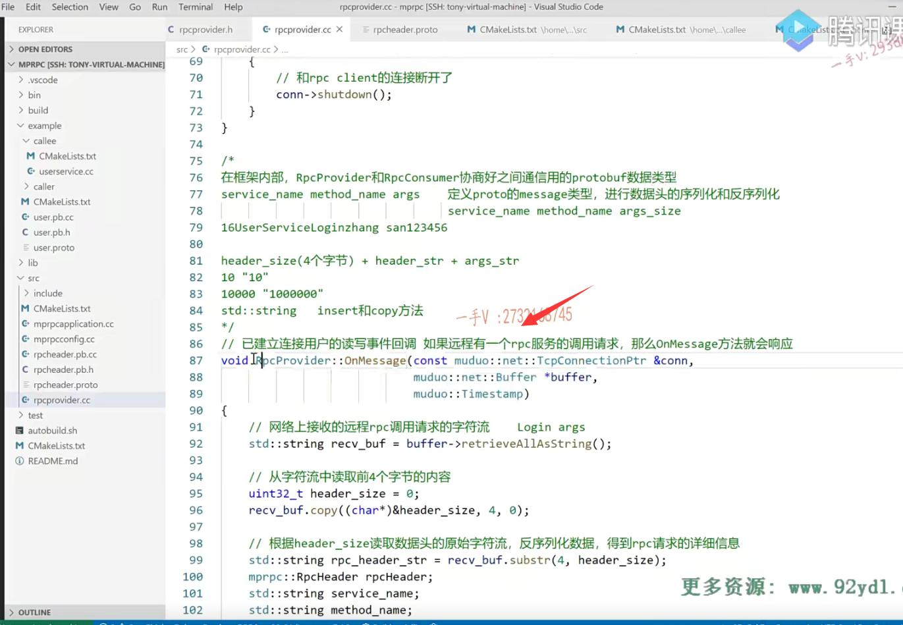

而我们首先呢，要拿rpc server跟rpc client呢。

就是rpc provider，这就是server的。

rpc consumer就是client客户端的角色，他俩得先商量好。

它们之间通讯发起rpc调用。它的这个数据格式是什么？

呃header size+1数据头，数据头里边有service name，method name以及为了防止我们TCP粘包问题。

记录的后边剩下的参数的这个字符串的这么一个长度好吧啊。

那么，我们设置了这个相应的一个框架上的一个proto来进行这个rpc调用。的这个数据流的一个序列化跟反序列化好不好啊？

大家在这体会一下它的好处。

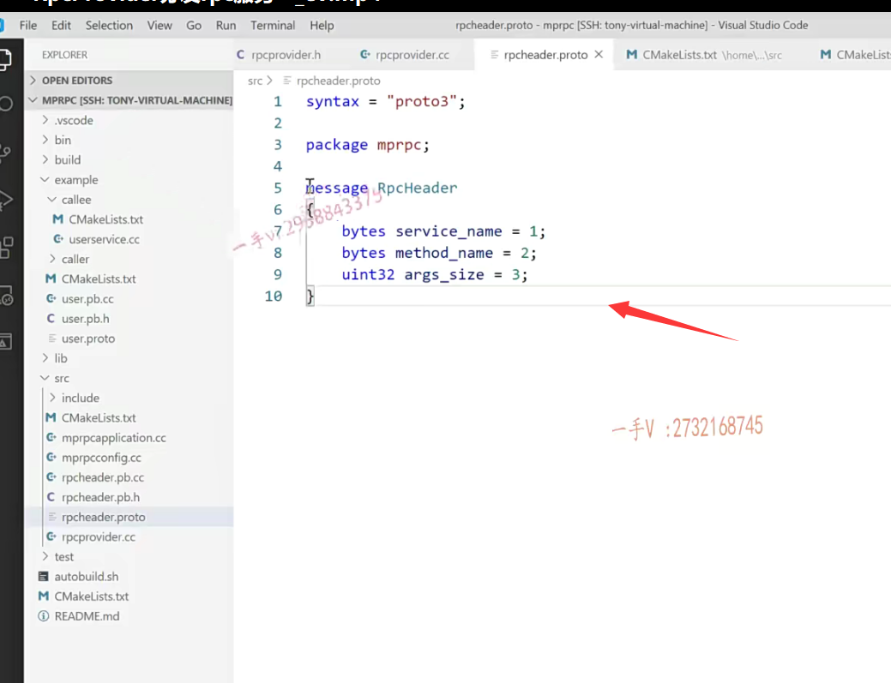

然后在这儿呢，我们根据呢，它们之间建立好的数据格式啊，读取出来了。这几个字段，

这几个字段都特别重要，

最重要的就是service name。measure name跟args 前边儿两个都是给他们服务的，对吧？

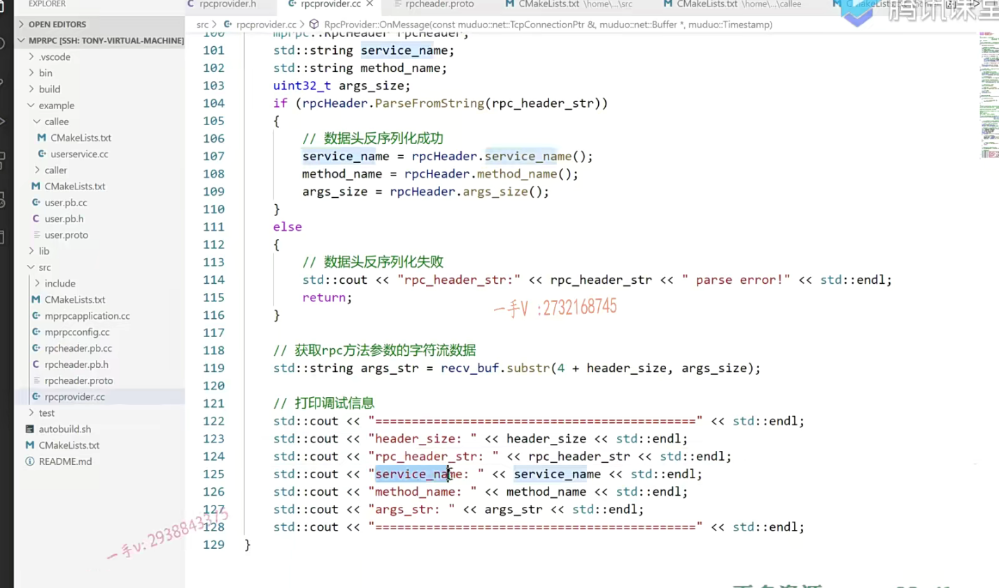

调用方法主要就是他们三个，我得知道调用哪个服务对象的哪个服务方法，以及这个服务方法的参数是什么？

对吧，后边儿我就负责开始，具体的由框架来帮你调用服务对象相应的服务方法了。能够了解吧。

啊，那么希望同学们啊，这一节课啊，

跟着我的这个讲解也能够把这块儿on message的代码能够先输出一下，

最重要的是理解一下rpc站点之间rpc server跟rpc client之间，它们定义好的。数据格式或者为什么要这样去定义好不好啊？

那么，代码就先写到这儿，因为我们没有测试，没有rpc这个客户端，

我们现在也没法测试它的这个解析的数据是否正确啊？

我们是按逻辑来的，那么在这里边儿呢，我们也进行了一个打印，到后边儿进行，

我们两端都开发完了以后呢？我们进行一个远程的rpc调用请求。

啊，我们可以通过这些打印的调试信息来确定呢，它是否正确啊？

呃，编译一下，别让我们的项目出现错误啊，一边儿写一边儿编译。这

## 又出现之前链接错误

里边儿。呃，是由我们的什么呀诶，有一个链接错误对吧？生成provider的时候。

对于这个rpc.header哦，那这应该还是我们之前遇到的问题。

之前遇到的问题。啊，之前遇到的问题。

### 没有识别这个新增加的这个CC文件。

就是因为我们在识别目录源码的时候用的是什么呀？用的是aux source direct。

呃，因为这个文件没改动，所以它没有重新生成makefile，没有重新生成makefile就没有识别我们这个目录下新增加的这个CC文件，

是不是啊？没有识别这个新增加的这个CC文件。

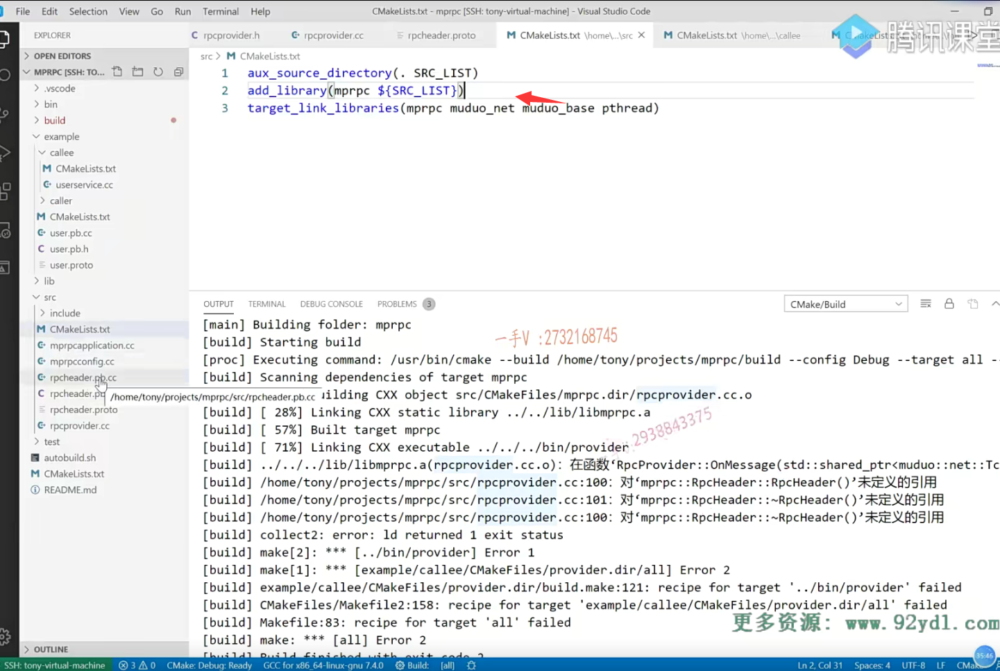

那么，既然我们出了好几处问题了。

我想在这里边儿把这换一换吧，要不然老出问题，是不是换成set啊？

这个参与编译的源文件有谁呀？

mpr PC.AP AA什么APP？lice tion.点CC，

然后还有什么呀？还有mp。l pc config点CC。

啊，还有rpc header点PB点CC。

还有呢，还有这里边儿的这个。lpc provider点CC啊。

包含了我们当前目录下的这四个源文件是吧一？三四

没错儿啊。那这样的话呢，我们就让它识别我们新增加的这个文件了。OK，

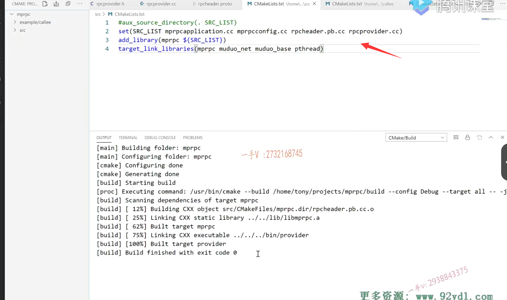

这也编译成功了好不好？行，那我们这节课的这个内容就先给大家讲解到这里。

