## 回顾上节课

啊，同学们，我们来继续把这个on message这个方法呢，给它写完。

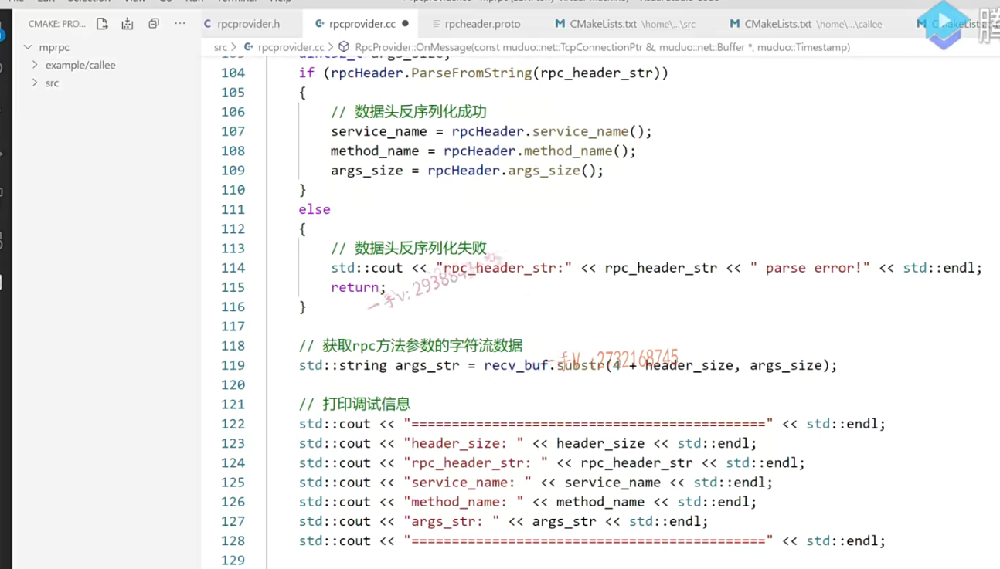

on message呢，我们在上节课里边呢。已经做了哪些东西呢？

就是从网络上接收了这个rpc请求所携带的数据的这个字符流对吧？

从字符流里边儿去解析出来的这些数据，

==那么解析出来的这些数据我们最终的目的呀是要在框架这里边儿啊来直接调用rpc相应的这个服务方法呀。对吧啊，==

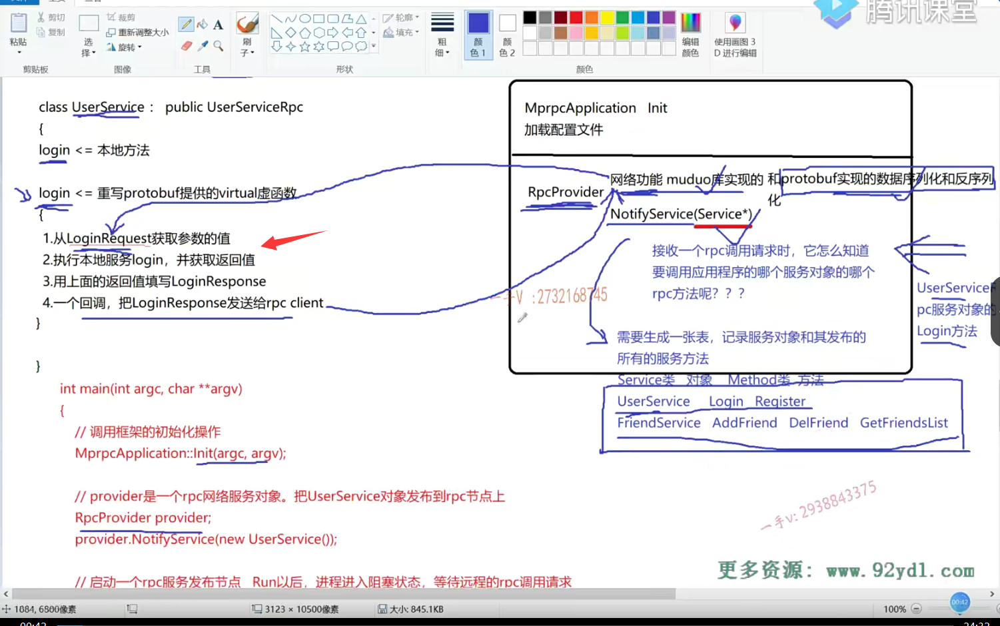

这个服务方法当然是由框架来调用的，

之所以框架呢，能够调用应用层，这里边的rpc服务方法，

那是因为我们事先呢，向这个框架上去注册了，

像这个rpc provider就是rpc这个节点上啊。

去注册了相应的这个service对象跟method是不是方法？

我们在一个map表里边记录着呢。对不对啊？

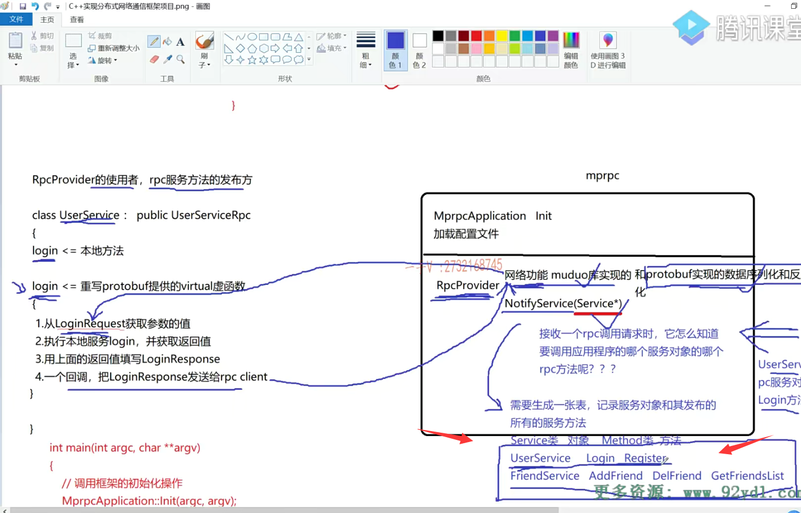

# 本节课

## 获取这个service对象和method对象

那么接下来我们就继续啊。这个获取这个service对象和method对象啊。

那我们一步一步来写啊。那首先看看这里边儿的，这里边儿的就是获取service info嘛。就是service map，对不对啊？

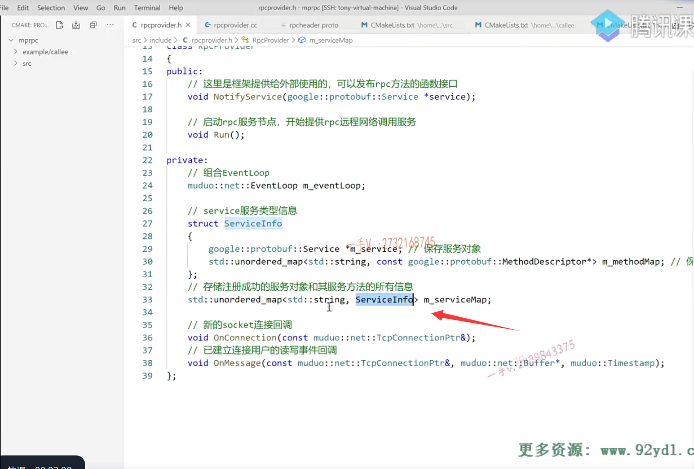

service info这个s info吧。等于m杠service map什么呀？呃，咱们。是这个样子啊，

### 中括号会有副作用，就是添加没有的

先不要直接中括号，万一发的一个请求service name不存在的话。中括号的话会有副作用，对不对啊？

### 判断map表中是否有服务

呃，就是auto=m杠service。点find find谁呀？find service name。rpc请求带的service name，

我们找它对应的service info好吧？

如果说这个it=m杠service map的end，那是不是表示？你想在我这儿，谁知道你怎么回事儿？

在我这个rpc节点上请求了一个我这个rpc节点上根本没有的是不是服务啊？啊，根本没有的一个服务对象。

那么在这儿我就打印一下吧。这个叫什么东西呀？就是service name。is not EX.ST exist.end l好吧，

那这就return了啊。就不再往下做了，好不好？

啊，刚才这块儿的错误是数据头反序列化失败了，现在是根本没有我这儿这个节点上根本是不是就没有你这个所谓的服务啊好了，

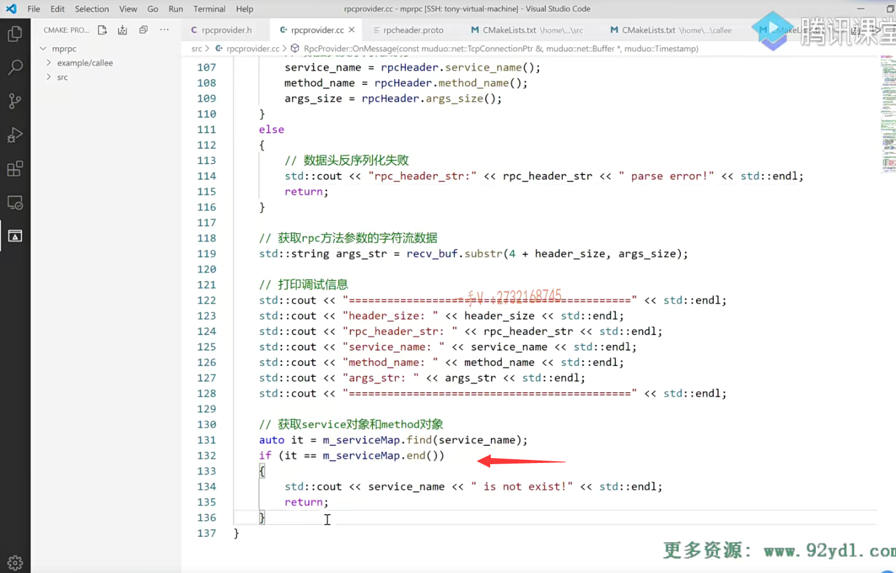

### 有服务的话

那然后就有了的话呢，那是什么意思呢？

就是我们定义auto不定义auto吧，定义auto。简单是简单，

但是对于教学来说呢，大家也就不知道它的类型是什么了。

我it指向的second是不是就是这个service info啊？

那我就知道了这个所谓的service。谁啦？首先service对象就是it指向的second点谁呢？点service是不是这个啊？哎，就是这。

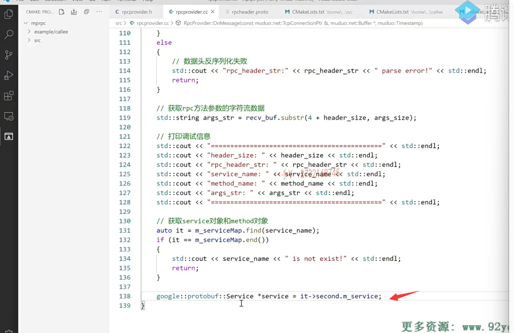

### 判断有没有方法

好吧啊，那在。这个已经有server对象了。是不是获取server对象了，

然后获取方法啊？

在这个里边儿呢，有其这个服务对象里边儿的这个相应的方法，

那在这儿我们当然也是个map，可以判断一下这个方法，万一不存在的话。

是不是就没法调用啊啊？

那我们也判断一下啊。那么在这儿就是。

呃，写一个。写一个什么呢？嗯，各位也得判断。

没有凹透啊m method it啊。

就是这里边了，it指向的second点。点谁呀？点method map点find find谁？的这个method name啊。

那同样的，如果MA等于。a的指向的。这个map点谁呀？点end。

那是不表示这个服务。这个服务的哪个方法呀？这个服务的这个方法。是不是is not exist呀？

刚才是服务不存在，现在是有可能你请求的一个服务对象的这个方法不存在，是不是啊？

好，这个方法不存在的话呢，我们也给它return。不再继续请求了啊。不再向后继续请求了。

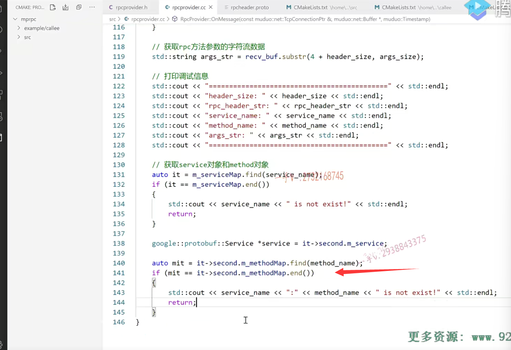

### 如果服务对象和方法是都存在

好，那么如果说在这里边儿啊？

我们把这两个都放到后边儿吧，这两个是有关联的，这个是取对象，是不是啊？然后呢，接下来的这个就是取方法。

然后就是method=it指向的second点。method map.是不是哎？就不用这么麻烦了。那就是这个m8。MIT指向的。是不是second呀？

嗯，就是这个。好不好啊？

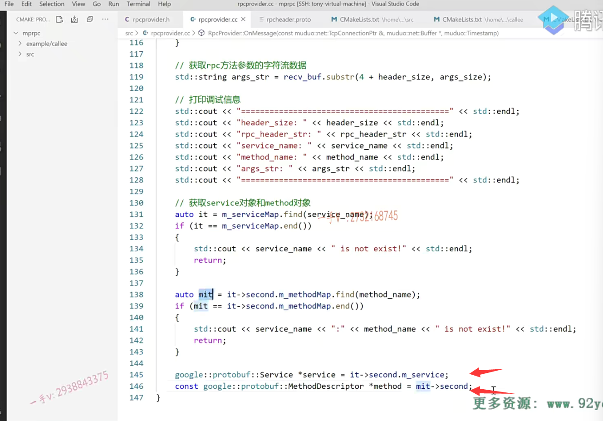

还没之前呢，就是method map里边儿的一个键值对的pair对象啊。

这就是获取了service对象。获取service对象。

这是获取谁呀？就是获取method的对象。这都是用抽象的来表示。

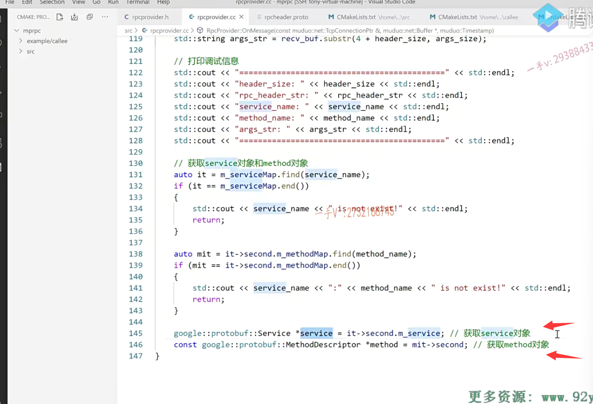

这实际上，这个对象对应的就是我们的user。service serv se就对应的就是new出来的那个对象。

那不一定，仅仅只有user service。啊，人家想发布的这个rpc的这个对象服务方法呢，都会通过最开始这个notify service把相应的对象跟方法是不是写到我们的map表当中啊？

这块我们写的是框架嘛，不可能访问具体的一个业务的，上面的一个类。

我们肯定都是通过抽象来表示具体的一个派生类对象的，对不对？

这个method相当于就是我们user service里边的是不是一个？login方法嗯。

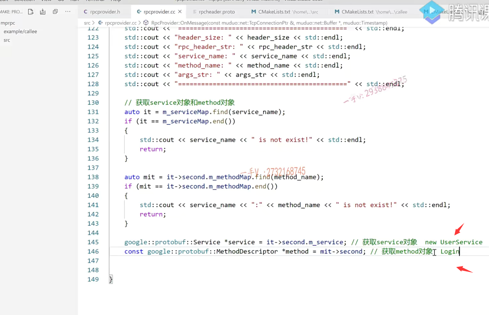

好，那么大家注意一下啊，注意一下接下来呢？

我们有服务对象也有服务方法了，是不是该调用方法了？

这个方法在框架上调用，最终就调用到谁上边去了。

最终就调用到我们用户这里边儿的这个login方法上面。

那人家的这个login方法，人家框架给出了一个login request。

就是相当于已经把这个方法的参数从字符流反序列呃，这个反序列化生成一个login请求的是不是对象了。

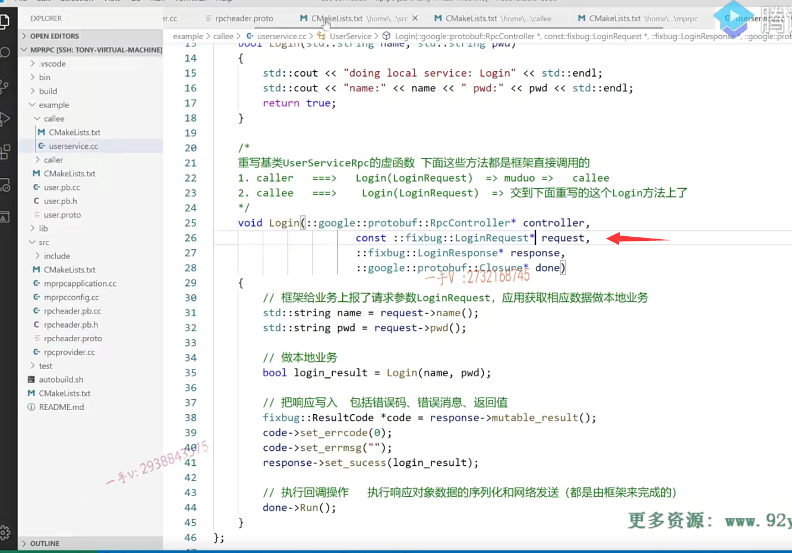

但是我们在框架中呢，现在目前为止啊。

打开的文件有点多，先close off就把这两个打开得了。

但是呢，我们目前来说呢，这个args杠STR只是个字符流，

所以在这儿我们还得进行一个反序列化。

啊，这个在框架上要生成一个相应的一个rpc方法的请求跟响应的。好不好？

那么大家来看啊。

生成rpc方法调用的请求request响应response参数。

## 生成rpc方法调用的请求request响应response参数

这个请求跟响应呢，可不是随便拿拿这个拿的，

你请求的哪个方法啊？那就要看这个方法的参数是什么样的请求参数？

返回是什么样的响应参数这些东西呢？

都是你在定义proto的时候service的rpc方法里边是不是？定义好了呀啊，

那你说我在框架处，我又不知道它调用的是哪个具体的这个服务对象服务方法，那我怎么办呢？

### protobuf帮我们做好了

没关系啊，没关系，人家protobuffer在这里边儿帮你把这个做完了啊，

帮你把这个做完了。

大家看一下啊，这个呢？在proto里边儿，这些定义的message最终生生成的是一个类啊，生成的是一个类，那这些类呢？都是从谁继承而来的呀？

这个我之前应该也给大家说了，都是从这个message这个类是不是？继承而来的，

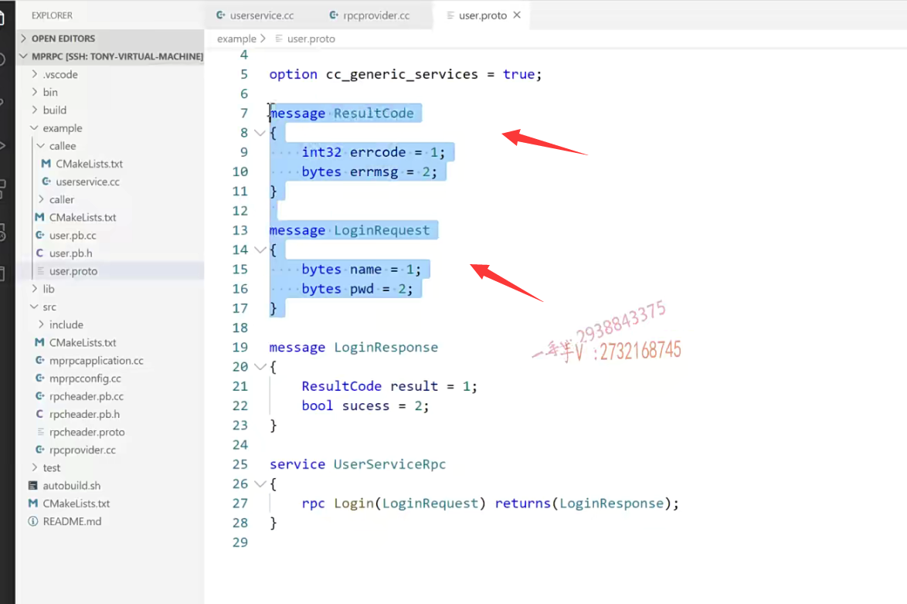

所以呢，大家来看一下啊，在这里边呢，

我们做的事情就是生成request跟message的这个参数啊。

那我们肯定不会直接是login request或者login response，

我们都是通过它的这个message来表示的啊，在框架以抽象的方式来表示你想访问的，

你想请求的这个方法的一个请求参数，我们要从它的这个字符序列里边反序列化产生相应的request对应。对象对吧啊？那这个的话非常简单，就是method，

大家注意一下啊。它的什么方法呢？来看看就是在这里边儿，看能不能联想出来？

是不是这个呢？我们看一下啊m1。eth method.这个应该不是method啊。是服务啊，是服务对象。里边儿有get什么I request，

==你看这就是获取了指定的服务对象里边儿某个方法的请求的类型跟响应的类型。你看这参数是不是接收一个method descriptor啊？==

那我们方法是哪个方法呢？

这就是产生一个啊，产生一个具体的服务对象里边的某个服务方法的请求类型。

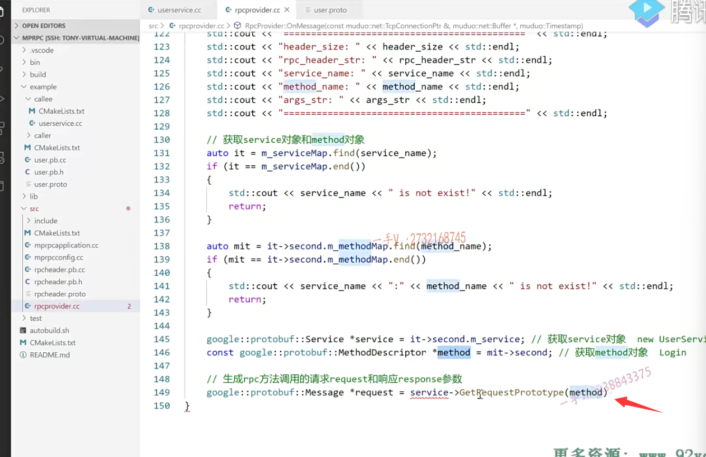

实际上呢，就就是在抽象的层面呢，

给我们即将要调用的这个user service的这个login方法产生的那个login request对象好吧，

到时候框架会把这个login request对象的地址呢？传过来的啊，

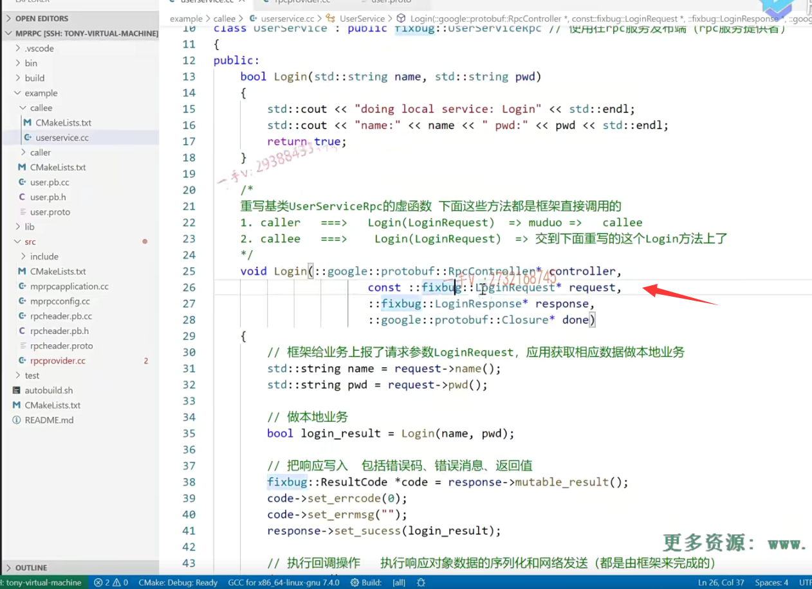

### 还需要生成一个对象 new()

那在这儿呢？new生成一个新对象。好吧啊，生成一个新对象。

那同样的，在这里边google。pro to buffer.message.response=service.get response.prototype.

哪个方法的响应类型呢？就是我请求的这个方法呢？

再生成一个它的一个对象。

啊，这是响应好吧？response响应我们现在没办法填。

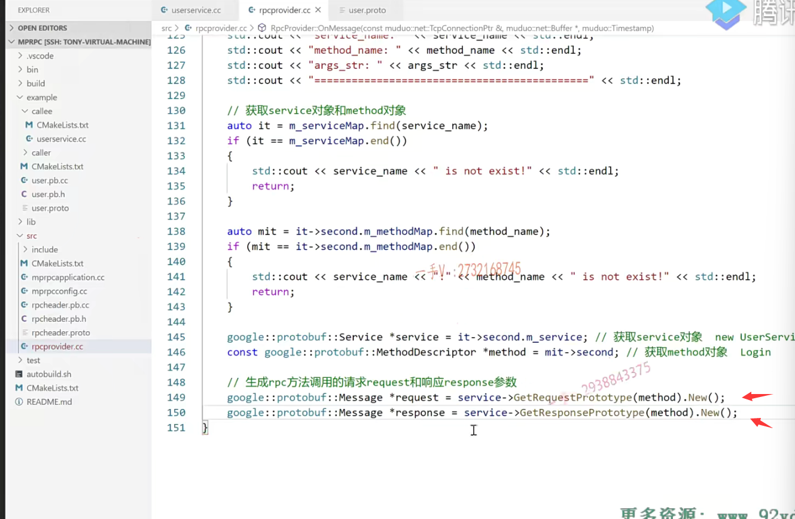

响应那你得等这个本地业务做完了以后呢，才能给你填，是不是这个response呀？

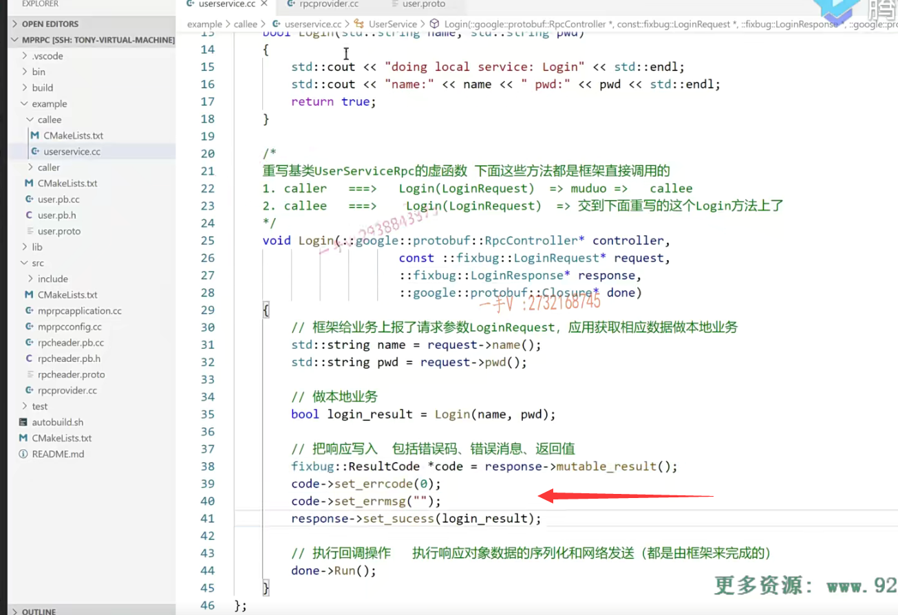

### 根据传过来的请求参数  判断一下

但是这个请求是有的。

请求是从远端是不是传过来的？

那么就是request。pass from string.就是这个args。好不好诶？

这个不就是它远程发发过来的，这个rpc这个请求这个方法所需要的参数嘛，是不是啊？所需要的参数。

这块儿我们再判断一下吧啊。

如果是true的话，这就表示什么？表示解析成功了啊，true的话表示解解析成功了。

如果是FALSE的话呢，这就表示怎么样啊？

s tdc out.然后是。就是request。parse pass.l pass l啊。

那么这个。那我们在这里边。这个args呢？这儿打印过了是吧？

我们在这儿也打印一下吧。pass我们打1 content啊，内容是吧？内容是什么呢？内容是这个。TD,endl.

返回就不要再往下走了。

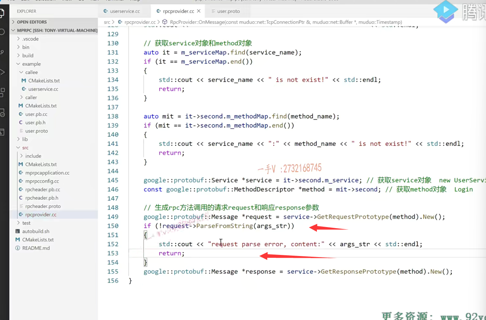

==OK吧啊，这个相当于从我们框架上从抽象的层面呢，获取了你所想请求的服务对象的方法的一个请求类型跟响应类型是不是哎，==

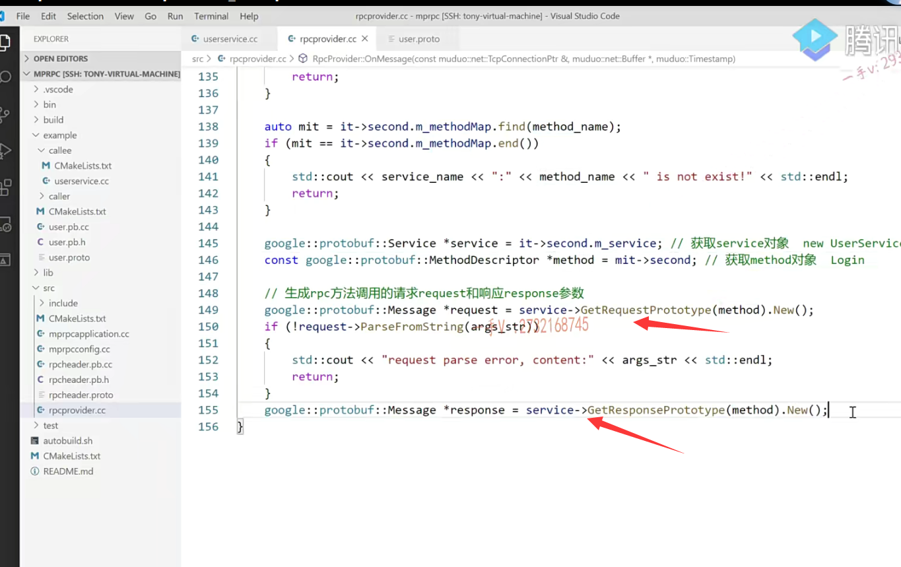

那在这里边。

我们最终在框架上根据啊远端rpc请求。

调用当前rpc节点上发布的方法是不是啊？

对象调用方法嘛，在这个应用层我们知道肯定是user service对象来调用这个login的方法，

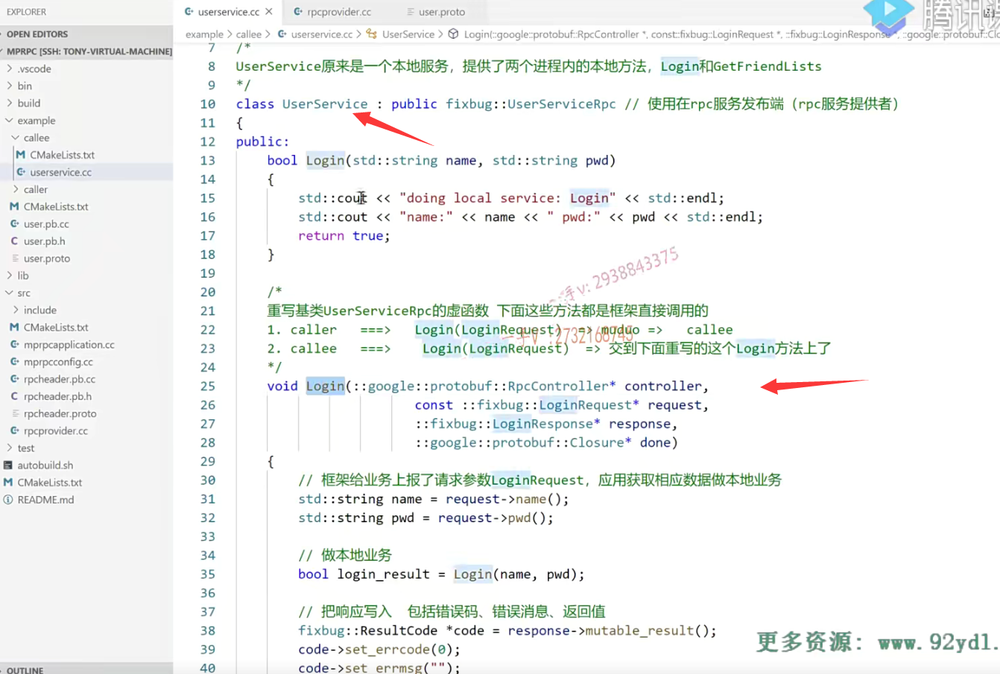

现在我们肯定不是用户自己调的，由框架来调的嘛。对吧啊，由框架来调的嘛，

然后在这儿呢，你看这黄色的地方反序列化以后呢，

人家这个框架就知道去调你什么方法？

你直接应用层的方法被框架一调，你执行，然后你给框架再返回，是不是这个方法执行的响应啊？

由框架再进行响应消息的序列化，以及网络的发送嘛，对吧啊？

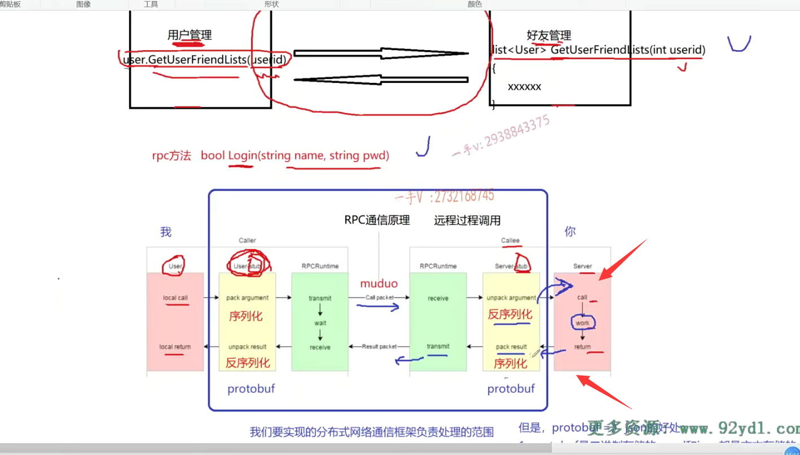

那在这里边呢，大家来看看。

我就用这个service。注意它里边的这个call method。好不好？

### 举例看

这个相当于就是谁呢，

==user service对象在调用谁啊？在调用这个login方法。===

那我给你把这个四个参数呢，是不是都给你传进来啊？

一个是controller，一个是request啊。一个是controller。一个是request。一个是response，还有一个回调，对不对？

那当然，我们还是给大家说的那句话，我们不可能在框架上直接去调用几个对象的这个方法是不是。

这是框架呀？谁想发布服务都可以。

不是任何人发布的服务对象都叫做user service，

也不是所有的rpc方法都叫做login吧，

==我们在框架上肯定是用它们的基类指针在操作，==

==从抽象的方式来进行一个方法的调用，对吧啊？==

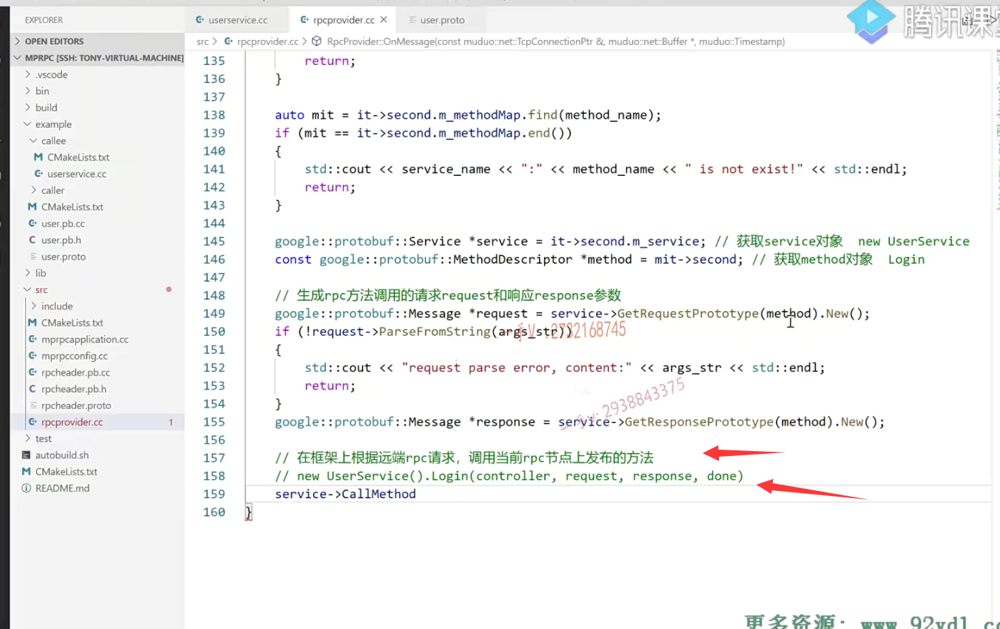

实际上呢，这个方法呢，也是很简单的，就是根据我们传入的这个方法的这个名字。来调用具体的这个方法的。

好在这儿call method呢，我们看一看嘛，它都需要哪些参数嘛？

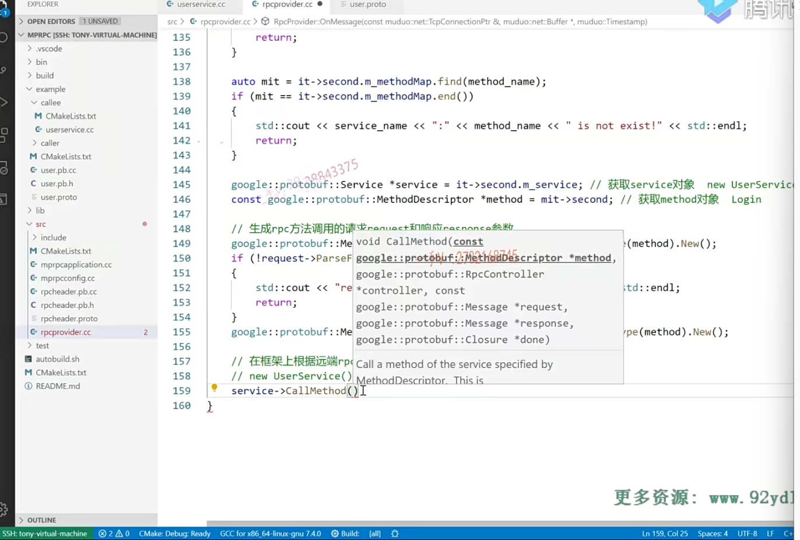

第一个参数需要method，你要调用的是哪个method？对不对？

就是这个method嘛？哦，我根据人家传过来的，这个method的这个name找出来的method对象调用的就是这个method是吧？

第二个是一个rpc controller的这么一个指针rpc控制器，

这个我们现在呢，先不关注啊，就直接传个空就行了，

==第三个。是不是就是要给这个应用层上报的这个request呀？==

==但是这request我已经给你序列化好了。是不是序列化好了呀？==

==在框架上已经从远端发过来的，这个参数的字符串解析就反序列化出来的这个请求，对象login request。==

==我给你传进来哎，你在这儿的话呢，是不是就是直接用这个login request就行了，==

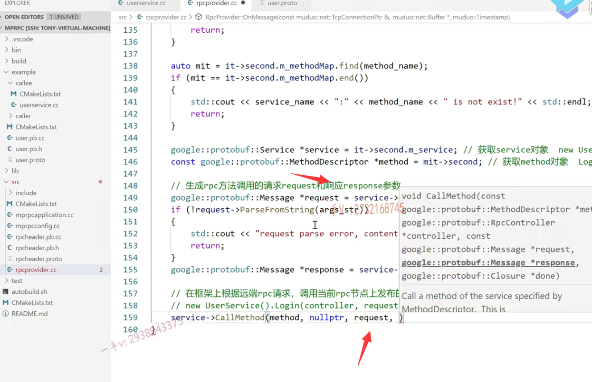

==你看你从这儿呢，直接从这个request里面就取出来了，==

==登录所携带的这个参数name跟password。对了没有呃，==

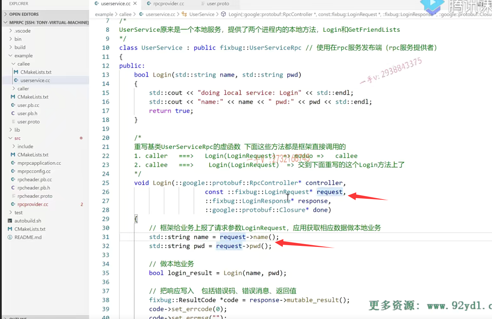

那我还传了一个什么东西呀？

==再下一个参数，就是一个response。==

==这框架上相当于生成了一个response对象，然后把这个response对象的地址呢给你，==

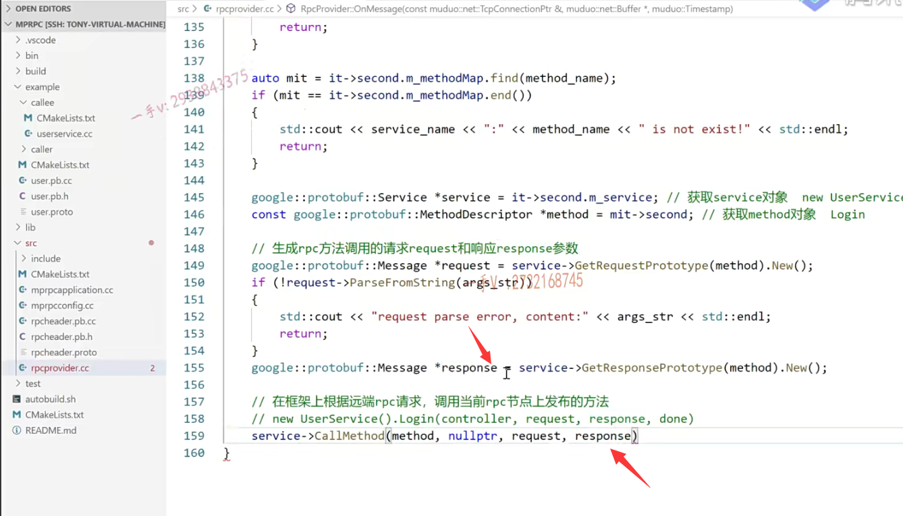

你到时候呢，你这儿做完本地业务，根据本地业务的执行结果呢？

要填写是不是这个response呀啊？

到时候框架就会拿到你填写好的response，

然后进行一个网络发送进行一个响应返回给rpc的调用方，是不是

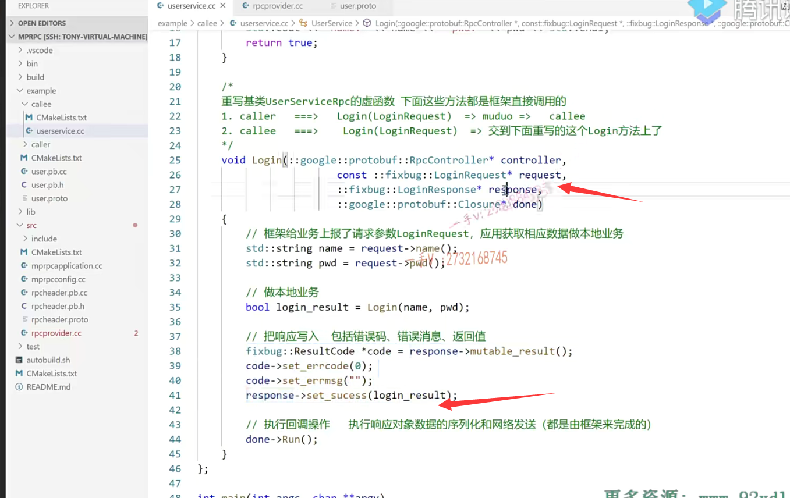

### closure   down 

还有参数没？还有一个参数，最后一个参数就是一个closure down，

就是这里边儿的down，我们调用了down的run。

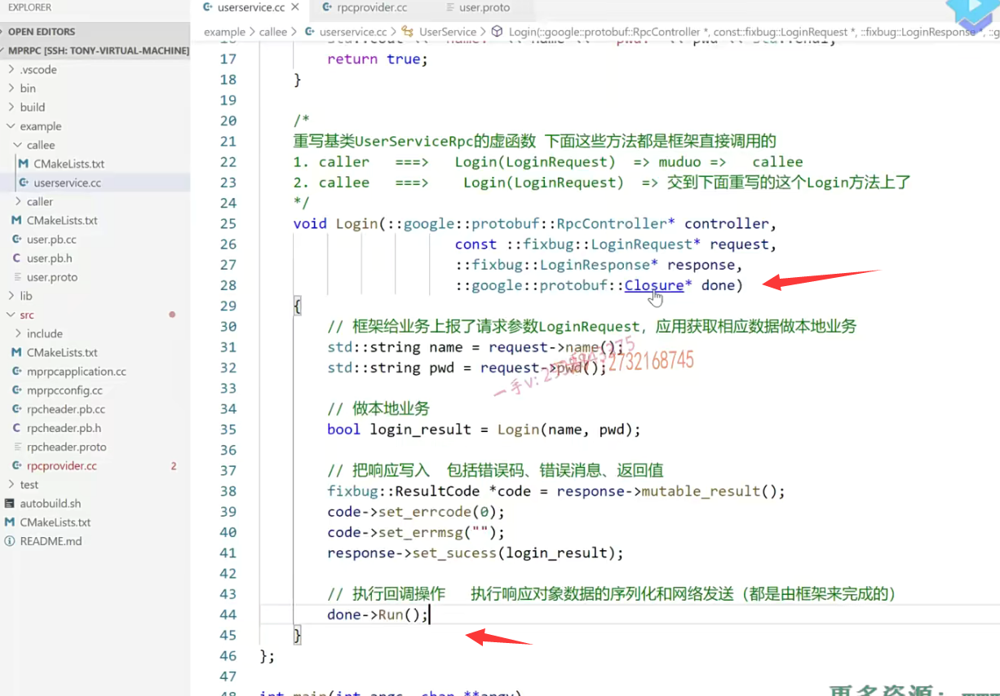

就当时给大家说了，这个closure就是一个抽象类啊，

它里边有一个纯虚函数run，是不是啊？

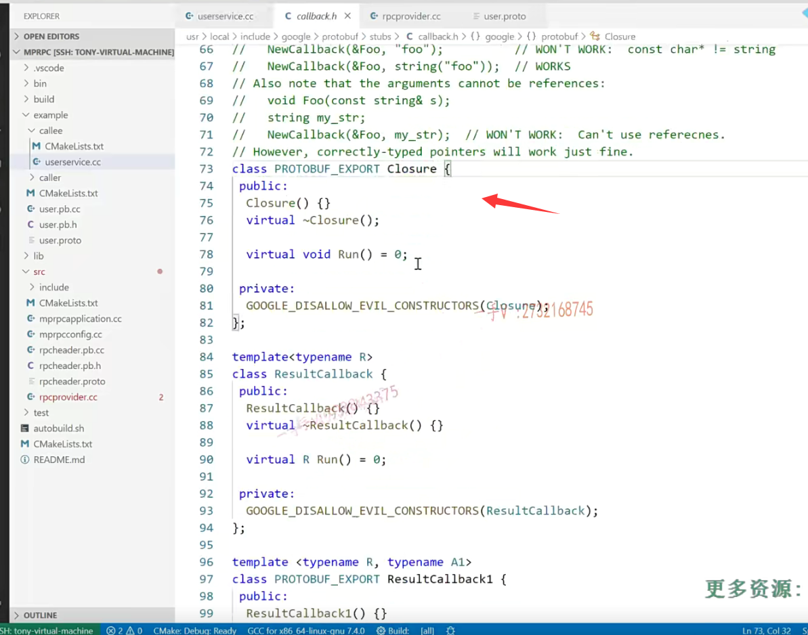

这个呢？就是框架啊，让我们可以自定义这个操作啊。

你自定义操作呢，我们当然是自定义的，这个回调当然是就是把rpc的方法的执行的返回值响应，是不是通过网络再发送回去呀？

啊，这些呢？在pro to buffer上，人家给我们提供了这么一个回调啊，比较灵活，

你也可以不通过把它的响应。写在日志里边啊。不通过网络发送回去都行是吧啊？

### 我们当然可以写一个派生类继承抽象类，重写run方法

具体怎么用大家来看啊？啊，在这里边儿呢，人家需要一个什么东西啊，人家需要一个closure是不是。

==那我们就可以定义一个什么东西啊？==

==我们可以定义这样的一个派生类啊，从这个抽象类继承而来，然后重写一下它的是不是这个run方法。==

### 我们利用protobuf提供的接口去绑定一个closure的回调函数

当然了，我们也不用这么复杂，因为人家pro to buffer呢，

既然让你传入一个回调的，这么这么一个down啊。

人家就给你提供了相应的接口去创建，去绑定一个回调啊，

在这里边儿给下面的method方法的调用啊。绑定一个叫做closure的回调函数。

### 但是提供了很多重载版本

好的吧啊，那这个protel buffer给我们怎么提供的呢啊？

先写名字，空间作用域，这些都是它。能用到的。

new callback.call back嘛，生成一个new callback，生成一个新的一个回调，是不是大家来看一下啊？

它这个回调的话，这个方法提供了很多重载的版本是不是哎？重载的版本。

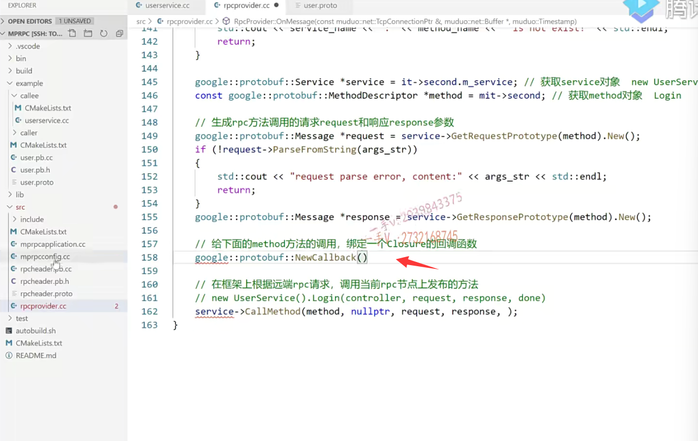

### 先定一个成员方法，就是绑定它

好，我希望在这里边儿给的回调就是它的一个成员方法吧啊。

所以呢，在这里边儿，我想用这样的一个版本就是绑定我。

呃，就是怎么写呢啊？

我先给大家把这个方法。定义出来吧。不定义方法，我们知道绑定谁呢？是不是啊？

我们写这一方法。就是回调操作啊。谁的回调操作呢？

就是这个closure的回调操作啊。

这个用于发送用于这个序列化rpc的响应和网络发送。

好的吧，那我们起个名字叫做。呃，sendrpcresponse吧，好不好啊？

它就是主要用来返回呢，就是rpc的这个方法的一个响应啊。

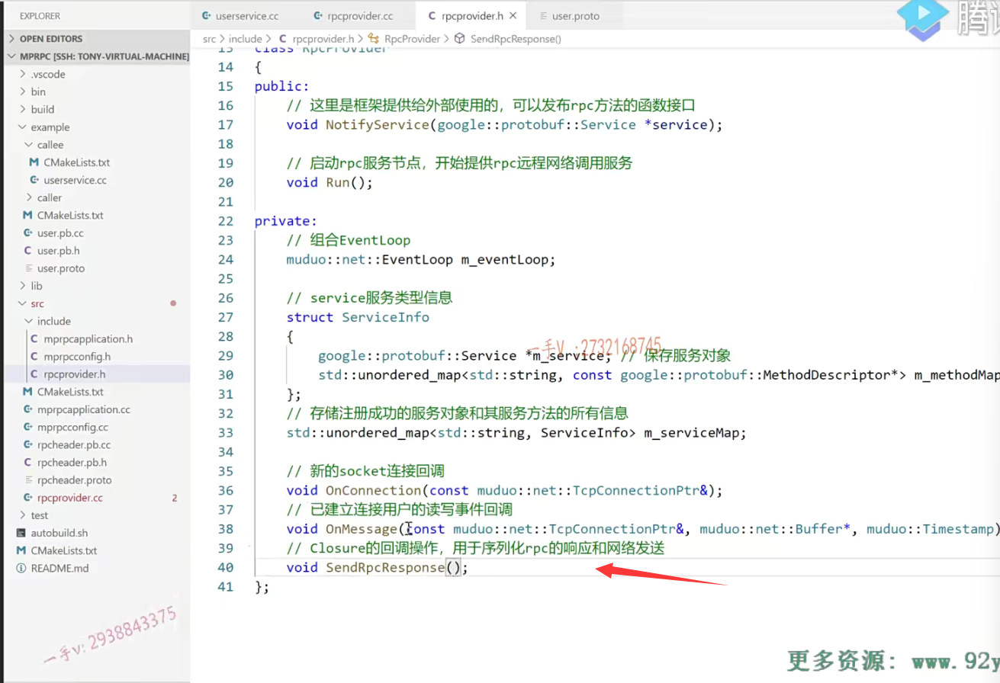

### 注意他的参数

呃，那它要返回得需要一个connection吧？这是必须的啦。是不是啊？

而且呢，它应该还得需要一个什么东西呢？它应该还得需要一个message嘛？message嘛啊就是。

用户传回来的这个response嘛，是不是啊？用户传回来的这个response嘛？

那这个message我们怎么写来的？

就是google。c buffer.message好不好啊？就这个方法啊，

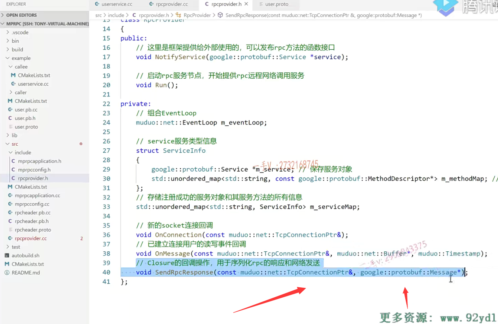

我把这个方法呢列到这儿吧。

要发送响应嘛，一个是网络，有网络就能发送，发送谁呢？

发送这个数据就是响应response嘛，这是原始的response的数据还得需要序列化成这个字符流，然后通过muduo库发送出去，对吧？

然后呢？在这儿我给它。定义一下啊。好的吧啊，定义到这。

那这个主要就是用于序列化rpc的响应，跟网络发送啊。

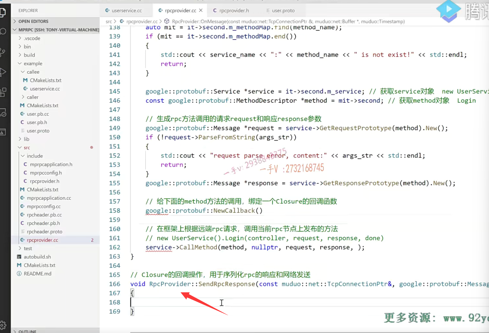

那在这儿该怎么写呢啊？我们我们这节课的这个时间刚好，

我们把剩下的就放在下一节课来写。

大家可以先自己想一想如何完成这一块儿的事情。

这块的事情就是创建一个回调把这扔给谁啊？

扔给我们call method的最后一个参数。

这样一调，就会把我们的这个服务端的这个rpc方法login给调用了是吧？

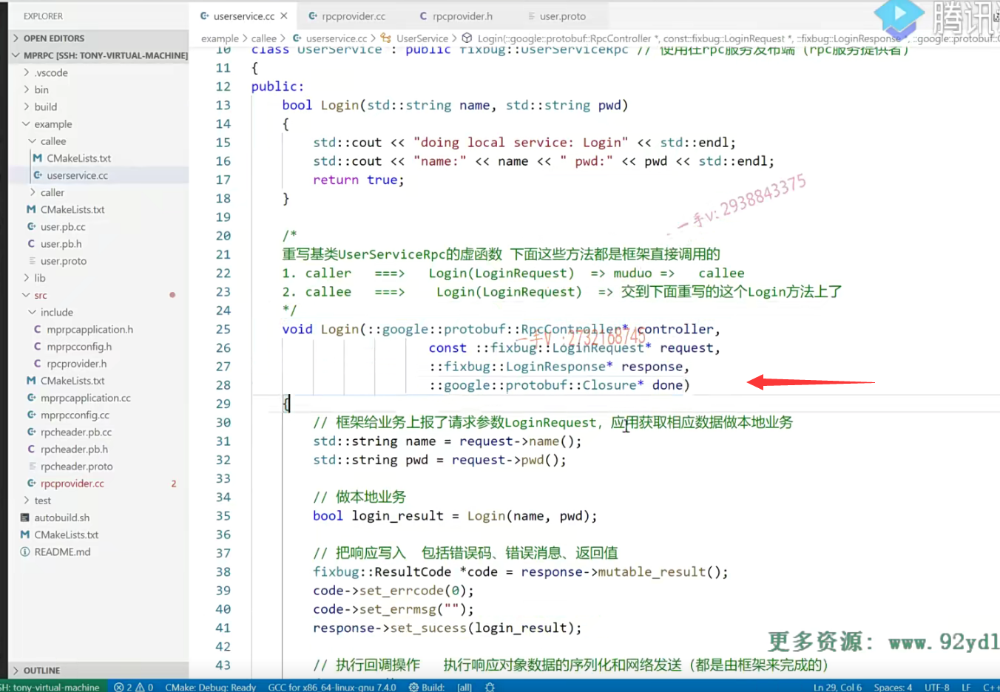

把login调用了以后呢？

最后呢？它会执行一个down。run

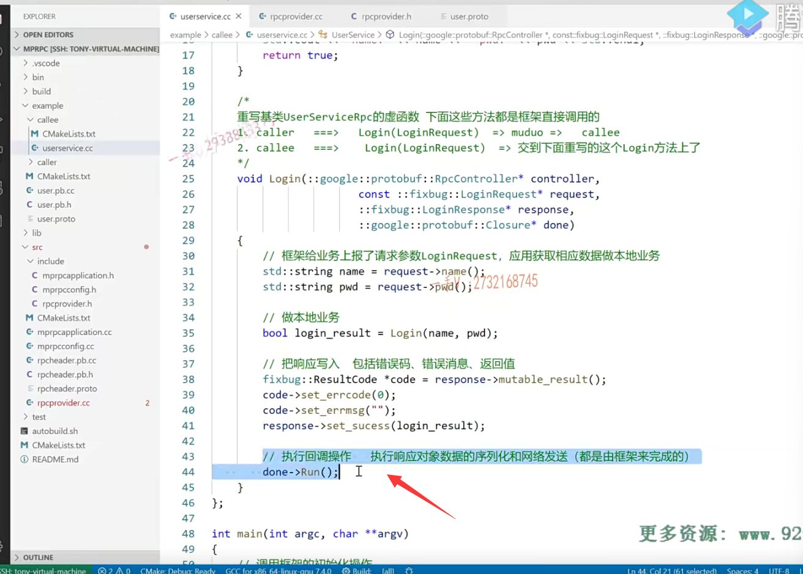

然后呢？就会调用我们相应的这个回调。好不好啊？

调用相应回调，我们来做。剩下的事情就可以了。