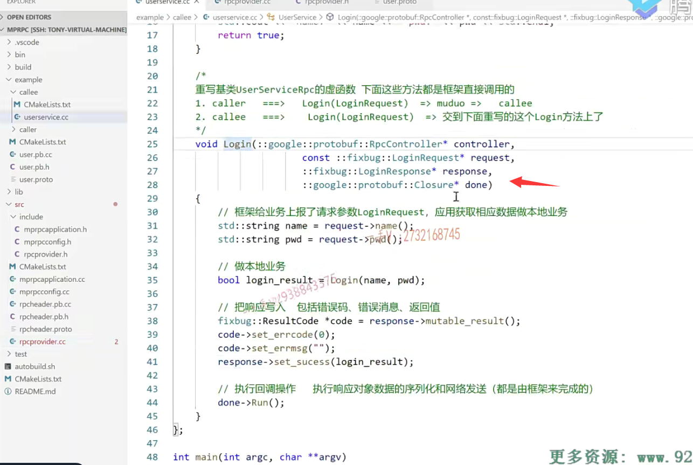
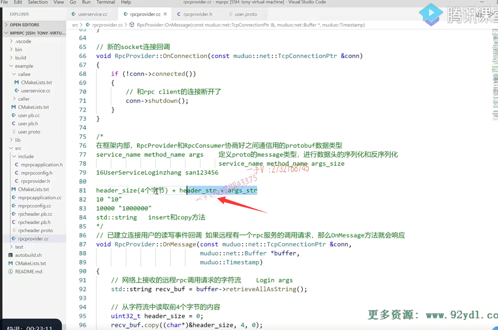
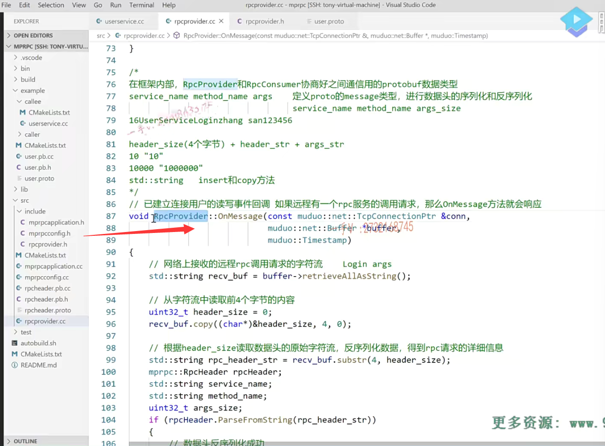

## 找到我们需要的NewCallback的重载版本

好同学们，接下来我们继续来把这个代码写完啊，

我们访问的这个回调呢，它不是一个c接口，它是一个C++的。

因为它属于rpc provider，这里边儿的一个普通方法，

普通方法的调用是不是都得需要绑定谁呀？绑定一个对象嘛，是不是绑定对象啊诶？

那我们就调用的是这个new callback的哪一个重载的版本呢？

应该就是类似于这个啊。有对象是不是有方法啊？但是这方法是不带参数的，而我们的这个方法是要带两个参数的是吧？

嗯，那就是调用它的，我看看啊。这是带一个参数的。OK，就是这个呃，不不不，是这个，这个是个c方法啊，普通方法。我要找谁呀？

我要找对象的，这个方法带俩参数的啊，

那就是这个我们调用的就是这个版本。

你看返回的就是一个closure星，是不是？这个保留一下，一会儿用啊。

new call back第一个传的是谁？this对象。

因为这个刚才的这个方法sendrpc response就是当前rpc provider对象的是不是成员方法啊？

所以我第一个参数传的就是this。

第二个参数传的是谁？就是这方法的地址啊。方法的地址就是rpc provider谁呀？send rpc response是不是okay，

然后第三第四个就是这个回调方法的两个参数啊。

第一个参数呢是一个TCP connection是不是啊？那在这里边儿。大家看这不就connection嘛。

当前rpc server跟rpc client是不是通信用的connection啊？

第四个就是message嘛。这里边有个message响应嘛。叫做response。是不是response呀？

response这。response在哪里呢？各位，就这个。

你看收的都是指针。到最后你调用这个方法的时候呢，就调用你用户的这个方法的时候，

你会通过这个指针，把这个指针指向的这个response对象的数据是不是给修改了？

哎，到时候呢，你就可以拿到修改以后的填好数据以后的response进行后续的处理了。好不好啊那？

这个方法返回的是个closure嘛？

就是这个rpc方法的最后一个参数closure嘛，是不是？

done写成一个down啊。写一个down，

那最后需要传我的这个参数呢？就是这个。okay吧呃。

### 出现了错误，没有相应的重载版本

这里边儿怎么了？呃，这个参数看起来有一点。问题是不是啊？给报错了

，这个是this嘛，当前对象。然后是方法。然后再是两个。什么东西，然后再是两个参数啊。

好，我先编译一下。提醒了是什么问题？啊，确实是有问题的啊，

我们看。rpc provider点CC 150。18就这一行啊error no matching function for call to。

这个函数啊。没有相应的什么东西啊？没有相应的，这个重载的版本让它调用是吧？

呃，同学们来看一看啊，来看一看这里边儿。这里边儿根据这个错误的这个提示啊，根据的这个错误的提示。

### 传入的参数类型不正确

我们能发现一些问题啊。你看之前看了new callback，第一个就是对象的这个。对象是不是对象啊？第二个就是这个方呃方法的这个。函数指针类型。在这里边儿send rpc response，

我们看到了它是一个什么东西啊？人家读出来的类型是一个就这两个参数类型，第一个是const TCP connection ptr。对吧，第二个是什么？这是google pro buffer message星。这没问题吧？

哎，读出来这个类型。但是呢，我们传的时候啊，传的这两个。你看connection。const TCP connection ptr引用。这跟。方法的这个第一个参数的类型是一样的吧？

==但第二个却读出来了一个什么东西啊？第二个就读出来了一个google pro buffer message星号的。这个引用类型很明显，==

这个参数的类型。跟这个函数指针的这个第二个参数类型是不是不一致啊？这两个参数就是传给send rpc response的。然后我们所得到的这个new callback，

大家看就是这个啊，你看你后续的两个类型的，这个参数的定义，两个类型arg 1跟arg 2是不是就是？来自于这个函数指针的两个类型啊。

所以它现在报错的主要目的就是说呢。嗯，我们在这里边传入的这个response。对吧啊，传统的这个response啊。类型是个这，但是我们函数指针的这个类型是个什么呀？

这个函数指针第二个参数类型却是一个message指针。

而这是一个什么？这是一个引用。对不对？

嗯，那么在这里边儿，它为什么会出现这样的问题呢？

我们再来看一看吧啊，我们再来看一看。分析一下这个问题。

啊，这个代码我拷贝过来吧。贴到这里边儿，我先瞧一瞧啊。

这里边我们直接调用这个模板方法，我们并没有填写模板类型参数，

那是因为模板，函数模板可以进行通过实参来推演参数的可以推演参数的，对吧？alg 1它推演出来是这个类型，这是没有问题的。

alg 2 alg 2它推导出来的也是这个类型，是不是？

但是呢，这个匹配的时候啊。匹配的时候呢？第四个参数推导出来的这个类型。有点儿不太正确，

### 为什么推导出一个指针引用类型

是一个指针的引用，对吧？

它的这个引用类型是从哪里来的呢？

它的这个主要问题还是。我看看我们怎么解决这个问题啊，把刚才的这个编译错误打开啊。

这个错误的原因，大家能够理解吧。之所以不行，是因为人家定义的时候呢，就是函数指针的第二个参数类型arg 2，跟你这个函数最后一个参数的这个类型都是arg 2定义的，

但是现在的它这个模板类型函数模板的类型推演推演出来这个类型，这儿类型不匹配，这儿有个引用类型的。是不是所以它导致呢？

找不到合适的这个。相当于这块儿类型跟这块儿类型，它不一致了啊，

不一致的话就不能用同一个模板类型参数呢，在这里边儿表示了。

哎，既然是这样的话呢，你推导的话，你推导的有问题，我也不知道你整的是什么规则，对吧？

### 既然你模板推导错误，那么我就指定类型

那在这里边儿，我干脆直接在这里边儿把什么写出来。

把模板类型参数给你指明指定了好吧啊。

你第一个需要的是什么类型？呃。对象的类类型，然后两个参数类型是吧okay？那么在这儿呢，我就终极的方法我搞定你啊。

第一个是rpc provider这个类型嘛。对不对啊？

这个第二个是什么类型啊？第二个就是这个类型。

第三个是什么类型啊？第三个就是这个类型。好的吧，

哎，我们给它就写到这儿了啊，给它强制的去指定。这个模板类型的这个实参。好不好啊？

来再。编一下，看看还有什么问题？还有还有问题啊。159行。这是具体的，是一个什么样的错误呢？我们来再来读一读啊。再来读一读。

看看它报的这个类型是什么类型啊？这个有点儿太长了，把这个。不太方便看啊，把这个我写下来。const就是一个参数。这个是一个参数。一个参数，最后的两个参数。啊，我看看写到这儿吧，都写到后边儿吧。这看起来稍微舒服点儿了吧？哎呀，我们这个还得再瞧一瞧啊，

这个为什么是出错的呢？按理说，我们觉得这个应该是没什么大的问题了是吧啊？这个意思是我第二个类型。给的怎么样啊？第二个类型给的有问题是吧？第二个类型是什么类型啊？参数一的类型嘛。第二个是参数二的类型嘛。这个能有什么错呢？大家再仔细想一想。看看这个问题。这儿大半天的卡到这儿。就是还是犯了老毛病，哈哈，

### 编译再报错，我没有指定名字空间域

各位。在这里边，这个TCP connection你看。这应该是iden ti fer TCP connection ptr is undefined，它这个类型不认识，怎么能不认识呢？那是因为我们没加什么呀。哎，没加名字，空间中域对不对？好看看现在能不能认识啊？诶，编译没有问题吧？

### 可以自己写一个回调，最好还是用框架给你提供好的

现在就OK啦？同学们，

各位同学们。这个new back能明白吧，这相当于我们就产生了一个对象它。

它是通过new back呢，给我们生成的啊。一个回调好吧，实际上呢，

就是对于band跟function的一个应用，你不用他的new callback也行。

你在这里边儿可以自己写一个这个派生类对象，或者你生成一个匿名对象，甚至你用兰布达表达式生成一个匿名对象也可以把这个run方法呢？去重写一下好吧啊

但是呢，你在这里边儿要用这个绑定器跟函数对象要传入参数的，

因为你要把这个response的结果给人家rpc的调用方返回去，

你需要connection，还需要message，是不是既然人家框架都给你考虑到这儿了？

==呃，最好的方式还是当然调用人家的这个new callback去给它设置一个绑定。对不对啊？设置一个绑定，==

那相当于在这里边啊，我们的这个通过on message muduo库，

再给我接收远程传过来的这个字符流，

以后我通过参数的这个解析，

然后呢？拿到相应的，他想要请求的service跟method，

然后呢，给他再绑定一个回调是不是？

哎，在动态的去创建这个方法对应的一个request跟response。response哎，

然后呢？调用这个由框架调用这个方法，把相应的参数都传到业务层

去业务层做的事情就是从框架给它这个反序列化好的请求里边儿拿数据做本地业务，

然后填响应值。

再调用回调最后down执行run调用到谁了

就调用到我们绑定的回调了，就是这儿。

## 回调所做的事情

### 序列化

好吧，那这样我们做的事情是不是首先就是？

黄色区域，这里边做的把响应进行序列化。进行序列化，怎么进行序列化呢？

这是responses d。tr等于什么呢？这个应该不是等于啊。这个应该是序列化啊。是指向的serious to string.哎，这个参数呢？需要传一个string对象的。地址是不是啊？

这返回值也是一个布尔值。啊，返回值是布尔值。

true的话就表示怎么样啊？这是response。进行序列化啊。

序列化成功以后，序列化的字符串是不是就放在responses tl里边儿了？

序列化成功后啊。通过网络把rpc方法执行的这个结果发送给rpc的调用方。对不对啊？

这里边儿做的这个两件事情，相当于就是这里边儿黄色的rpc这个节点调用完服务以后，经过黄色的，绿色的通过网络吧响应返回。

### 序列化后发送

然后呢，在这儿就是通过这个connection指向的什么？send来发送我们把这个response ST。发送了就可以了。好不好。

发送以后我们相当于模拟一个http的请求啊

你一个rpc请求呢，一次请求相当于就是在rpc的这个服务提供方执行一个方法给你发完响应以后呢，

==你这一次rpt PC通信请求就完事儿了，以后呢，由rpc server主动的怎么样啊？去断开啊。这个模拟http的短链接服务==

啊由rpc provider就是rpc服务的提供方主动断开连接好吧啊。来提供更多的给更多的rpc调用方来提供服务嘛，是不是啊？

### 失败打印一下

那这个else else就表示呢，这又是一个打印啊。

这表示response.serious.就是序列化response。STR error对吧？content

这里边儿就没有什么content了。好不好啊？这里边儿就没有什么content啦。

那我们在这就加一个这么一个打印吧。好不好啊？

打印。啊，你不管怎么样，都得把这个connection。断开是不是啊？

connection断开。这里边儿是相当于响应有问题啊。反应有问题就更加发送。发送一下啊，是不是啊？那这个不用发送啊，

这个是在本地打印一下错误日志。响应应该是不会出现什么错误的，

是不是啊？12大啊，这就完了。

==你看这个相当于发送了这个逻辑，它主要就是负责response响应对象的一个序列化，然后序列化成字符流以后呢，再通过网络呢把这个字符流发送到rpc的调用方。由rpc provider主动断开连接。好吧啊，==

## rpc provider重要的三个功能点

那整个儿的这个rpc provider这里边儿主要的三个功能点

哪三个功能点呢？

就是集成到muduo库的网络功能来提供rpc请求的收发对吧？跟响应的这个收发。

另外一个就是它的on message接收到远端的这个rpc请求以后呢？那如何去解析数据调用我们业务方法。是不是啊？

最后一个就是它还给业务方提供了notify service，用来向rpc provider上注册。它想发布的rpc服务。好不好

## 写完调用方和提供方再测试

来重新编译一下我们的工程项目的代码？编译是成功的。

但是呢，具体的功能能不能使用这个，我们得经过测试啊。

这个我们得经过测试，对吧？

但是要测试的话。这个我们得需要怎么样啊？

我们在这里边儿不模拟发布了吧啊，这个模拟发布没啥意思，因为这块儿的这个客户端这里边儿。也不复杂，

==就是我们把这个mpr PC框架啊。给这个rpc调用方这一块的这个写完就是rpc consumer，写完以后我们就拿一个rpc的这个调用方跟rpc服务的提供方来进行一个完整的通信，我们在测试它这样的一个功能。==

==好的吧啊，在测试它这样的一个功能啊。==

那这个代码在这里边儿，我们算是。先告一段落了啊，先告一段落。

啊，经过这几节课的这个代码的实践书写。

大家把框架里边给我们rpc服务提供方提供者啊。服务的这个rpc provider的这三个功能相关的这个代码。

理解的怎么样呢啊？理解的怎么样？

## 再次梳理rpc provider逻辑

再简单的给大家梳理一下啊。

### 服务的提供方会首先通过rpc provider向rpc provider上注册

那么首先呢，我们服务的这个提供方。

啊，服务的提供方会首先通过rpc provider向rpc provider上注册，这个服务对象跟服务。

### 把这个服务对象以及它所调用的服务方法记录在了一个map表

那么，我们通过抽象proto buffer提供的抽象层的service跟method。method对吧啊，

来把这个服务对象以及它所调用的服务方法记录在了一个map表当中。

### 启动muduo网络库

当它启动以后呢，这里边相当于就启动了一个epoll的这个服务器epoll加多线程的这么一个服务器。

好吧啊呃，然后呢？就启动了，启动了以后它就可以接收远程的连接了啊。

### muduo库会帮我们回调on connection方法

远程如果有新连接过来的话，muduo库会帮我们回调on connection方法。

实际上，这个on connection我们不需要做特殊的操作，

就是呢，如果有客户端断开的话呢，

我们服务端这rpc provider服务端这块儿收到了，

把相应的这个链接给它shutdown就行了啊，释放socket资源对吧？

### muduo库调用onmessage方法

最重要的就是一个on message了。on message在这里边相当于就是工作在这一端的这一端的。

### 解析请求数据

它就等到这儿，它就蹲到这儿啊，等待远程的rpc的一个调用请求是不是啊？

数据过来了，以后呢？

它就按我们协商好的这个数据格式解析，最终解析出来这个service name。跟method name。

诶，然后呢？还有这个参数啊，还有方法调用参数的这个数据，

然后再通过呢。

从抽象层动态生成啊，这个method的这个请求跟响应。

把这个参数数据呢填到，相当于就是反序列化嘛，对吧？填到这个请求里边

response是由业务来填的啊。

然后再生成一个回调，然后再这个框架上去定我们业务的方法。

### 业务会调用，比如这里的login方法被调用

然后呢？我们业务这一块儿的业务。

这个类里边这个login方法就会被调用了

从请求里边儿拿数据做本地业务。

### 回调方法执行序列化，然后发送响应，并且会主动断开连接

再给呢response填响应消息，最后再执行一个回调。

这个回调在这里边儿呢，就调用了我们绑定的方法，

我们绑定方法在这里边儿做的事情是什么事情呢？

就是把响应进行一个序列化，然后通过网络发送回去。对不对啊？

发送回去了，以后呢我们由rpc服务的提供者主动来关闭这条连接。

省资源给其他的rpc这个客户端再继续提供服务。

好吧啊，这个流程呢，大概就给大家说了啊。就给大家说了。

你看啊，这里边儿protobuf在这儿起的作用啊，不可谓不大，真的是非常大啊，非常非常大。

所以呢，我们借助这个muduo库，跟这个proto buffer可以在很少的代码。

你看就总共是180行左右代码，我们就可以把我们框架的一部分就是。

你可以借助我这个类来发布一个本地服务，把本地服务发布成一个支持rpc调用的远程服务。就180行代码。对不对？

## 总结

如果没有这个muduo库，没有pro to buffer。让你完成相同的动作。是吧啊，

你三倍的代码你都不一定能完成。

这就是借助工具的力量啊。

当然，像这个muduo库啊muduo buffer啊，也都是我们必须要熟知的啊，

这是我们在公司里边儿做项目，经常会用到的。

不能说经常了，你基本上99%你都会遇到啊，都会用到好吧，

行，那这节课的内容我就给大家先说到这里，

希望大家呢根据我的描述呢，先把rpc provider这里边主要做的这三件事啊。对不对啊？

那么我们相当于是一个rpc server的这么一个角色啊，

然后呢？结合这个代码把。这个逻辑思路呢，再梳理一下，

到最后啊，就是我们整个框架写完了以后，包括给rpc这个调用方写完代码，

写完以后我再给大家，到时候画一个详细的图。

这个通信就框架啊，内部通信的这个调用的这个图。

好吧，给大家再做一个详细的解释多解释几遍啊。

那个理解有问题的同学，他慢慢慢就都能够理解了。好不好啊？

当然了，在这里边儿，如果说是我们有些同学呢啊，理解能力还是非常不错的，通过前面儿的这个课程的这个系统的学习啊。这个总结的这个知识也不少，我相信理解这个呢，应该是问题不是很大，我希望你也了解一下pro to buffer啊。

他能做的这个事情确实是非常强大。呃，行，那大家如果有什么问题的话啊？一是看后边的视频能不能解决大家的问题，如果依然是不能解决的话，欢迎大家在QQ上向老师来提问问题，我会及时的给大家做一个解