好，我们这节课继续把这个mpr PC channel的call method方法写完啊。

然后呢？这里边儿就得定一个struct。然后是个啥东西呢？叫做sock addr。in对着没有？

server addr.然后这个s ever a ddr，然后是先写它的什么来着？我看看啊，这个为什么联想不出来了呢？

这个先写它的这个。诶，都联想不出来是吧？

那我们先写吧，写完了以后呢？我们直接编译，看它报什么错啊？

先是一个地址家族嘛，是不是？

然后再是一个什么来着？各位跟我回想一下应该是port，对不对啊？

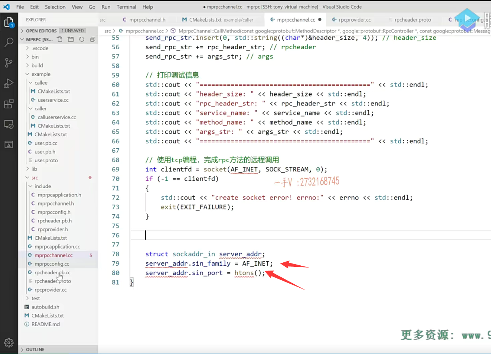

要把它本地字节序转成这个网络字节序在这儿呢，我们应该是把服务器的IP地址跟端口号呢？在这儿读一下。

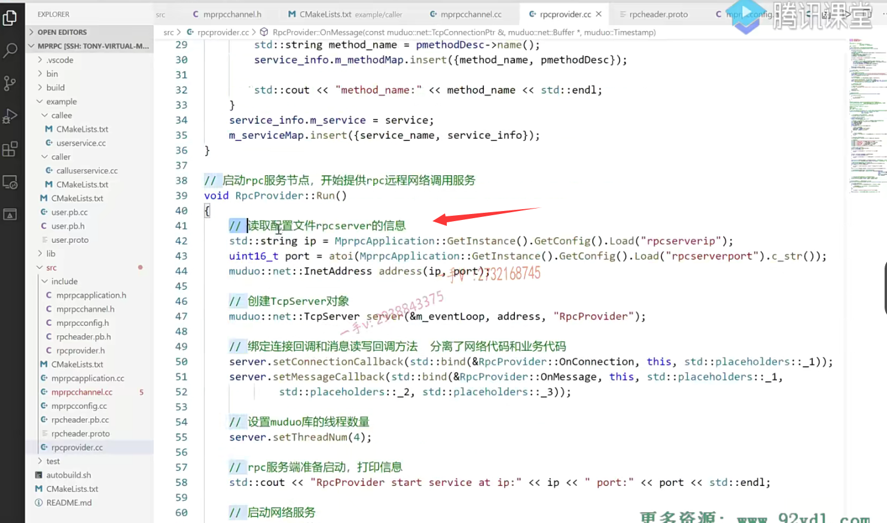

这个我们之前代码都写过了啊。在哪里呢？

哎，在这儿，你看现在我们客户端要连服务器，

我们当然是需要知道服务器的IP地址跟端口的。是不是啊？

okay。那么，要包含我们application的这个头文件啊？mpa.mp rpc application点h。

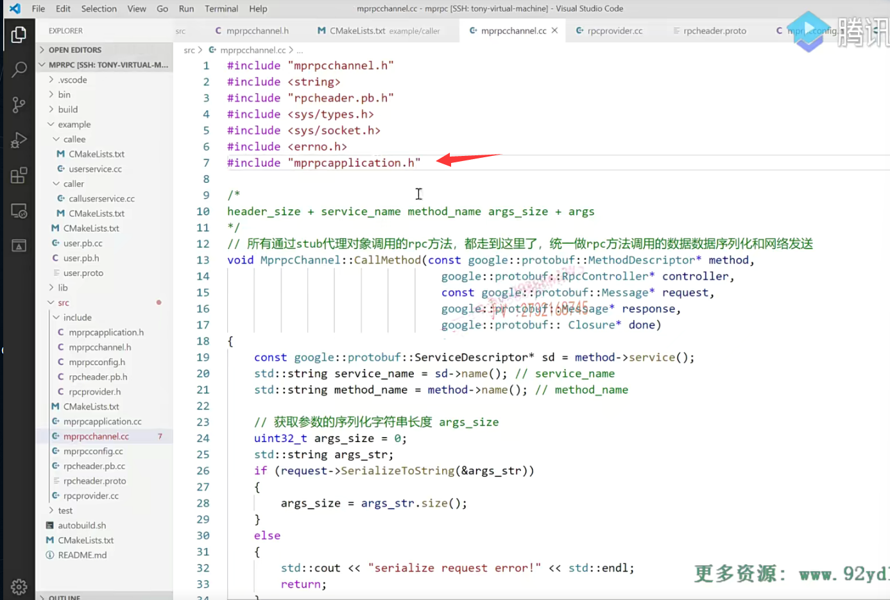

好，那这个就是它的这个port。

### 忘记加一个头文件arpa/inet.h

编译一下has incomplete tap。and can can't be defined是吧？

在这里边儿，它是写的是啥东西啊？virtual怎么？怎么变成它这个里边儿的一个作用域底下呢？

嗯，我们看应该是相应的这个头文件是不是没加？那回过头去添加一下头文件啊。添加linux的头文件是个AR pi net，是不是点h啊？

来看看啊okay啦。这个是个sock点h。这能识别到，也能编译通过啊。

但是它这个。红色波浪线。诶，现在又好了啊。

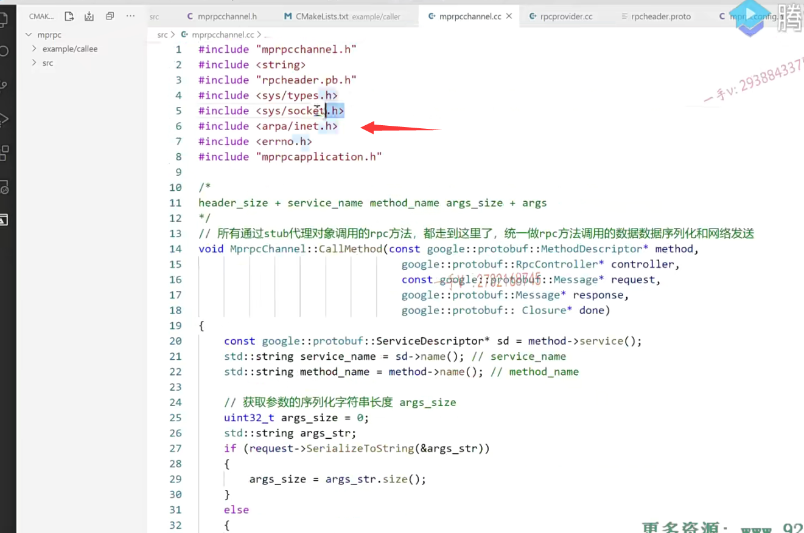

行，那我们还要再给它绑定谁呢？

绑定这个addr点s杠addr对吧一个。inet inet谁呀？inet这个IP啊。

这个OK吧？慢一下，这个inet。

哎呀，这个需要什么头文件，我们再用慢直接查找就行了。

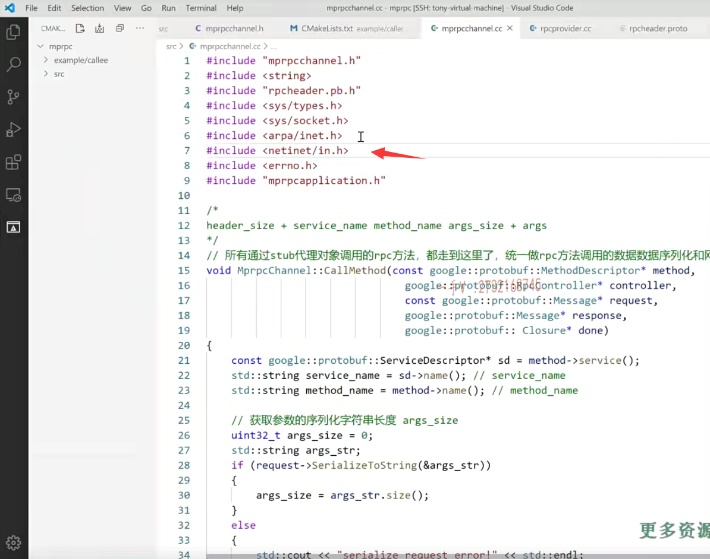

那我们用这个省略的函数还不行啊？那只能是在这里边儿选。是不是相等函数啊？就是这个inet addr。对不对？是这个吧？是这个，你经常用第三方库编写这个呢

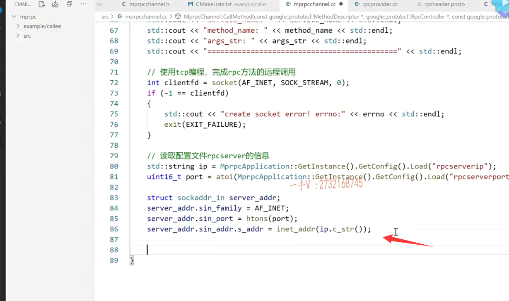

## 最原始的TCP编程

大家看好，这是最原始的TCP编程。

okay啦，完了以后呢，是不是就是发起连接呀啊？发起连接。

呃，发起连接在这里边if负一等于connect第一个是谁fd啊？的fd

第二个是。struct.sock addr.server addr.

第三个是size of。

是连接了啊，连接如果有问题的话，继续connect error.exit

这是连接rpc服务节点，现在我们是已知呢rpc服务 的服务器的IP地址跟端口，

我们直连就行了，点对点的通信对吧？

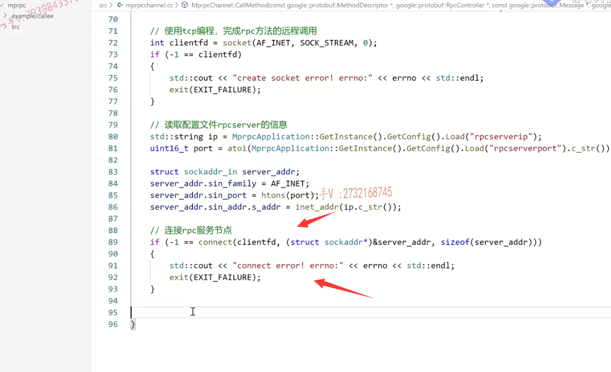

### 后期去服务配置中心组zookeeper zk上啊去发现一下这个服务，现在是直连（就是知道ip 和端口号）

到时候我们得需要去服务配置中心组zookeeper zk上啊去发现一下这个服务。

看看服务到底在哪个rpc节点上？

我们先不实现那么复杂，

我们现在直连。

### 发送rpc请求

那完了以后呢，我们就发起通过这个send跟receive啊，

先通过send来发起。

send的话就是client fd。第二个就是你的buffer，第三个是buffer的长度,对不对？

你要发送的数据是不是就是这个呀？send rpc STR点c杠STR。长度string line。点c杠STR。

或者说是它的什么呀？size也可以啊，是不是啊？

那么在这儿我打印一下啊。

在这儿的话呢，就不要退出了好不好？不要因为发送一个发送失败，导致整个的这个。客户端程序呢，这块儿的这个整个儿的这个服务程序全部就exit掉了啊。这块儿我可以怎么样啊？就是send。send error,error number.对不对啊？

然后具体的一个。就打印这么一个错误吧好吧，到时候我们如果要记录日志的话，到时候可以把日志呢？

在日志上记录一下到底发送什么？出错了啊，这个我可以不要exit，直接退出进程了，我可以就是返回结束这一次的，是不是rpc调用啊对。

好了，这是发送rpc请求了啊，发送rpc请求。

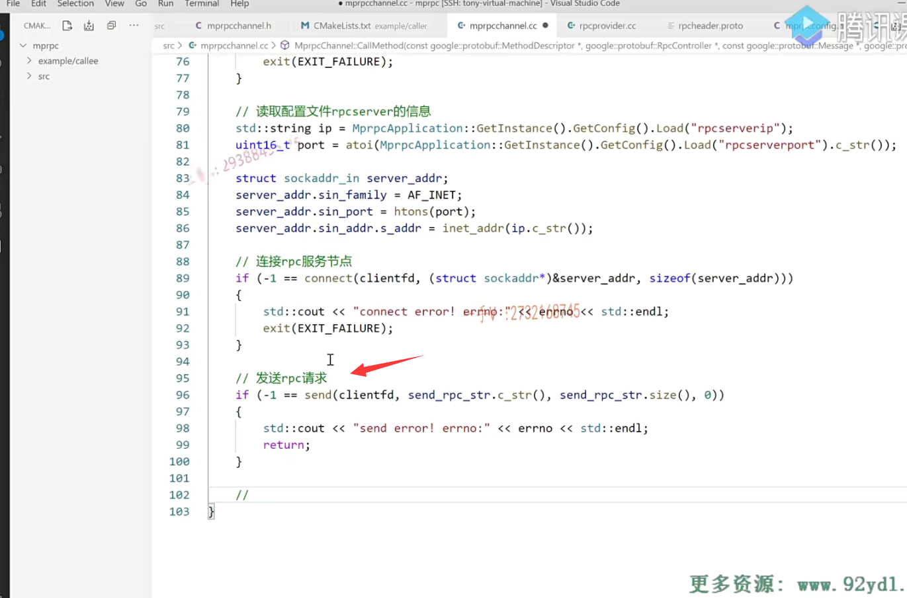

### 接收rpc请求的响应值

然后是接收rpc请求的响应值是不是啊？

-1=receive那这里边儿我得响应得接收一个什么，

得有一个buffer对不对啊？定义1k的缓冲区吧。这足够了，是不是啊我们？

这个方法的这个rpc方法足够了1k的，这个缓冲区呢，就放这个数据是不是啊？

OK，那么在这里边receive第一个是fd client fd，

第二个参数是缓冲区的起始地址就是buffer。

第三个就是长度是1024，

第四个呢？我们给个零值啊，

这个叫recv receive buffer吧？把名字都起清楚，写起来也清楚啊。

这个叫做receive error啊。

好，那么在这里边。我们收到的这个内容。就在这个receive buffer里边儿放着的。是不是啊？

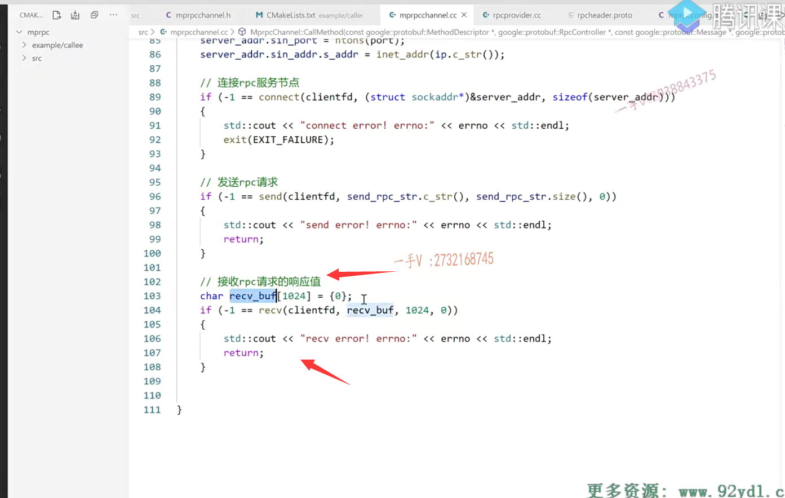

### 接收返回的大小  需要recv_size接收一下

但是呢，这个receive size不是所有的这个。

不是所有的这个1024个都是响应对吧？

我们需要一个receive。size啊，receivesize=receive。

好了吧诶，这个就是呢什么呀？接收到的这个数据了，是不是啊？

接收到的数据了？

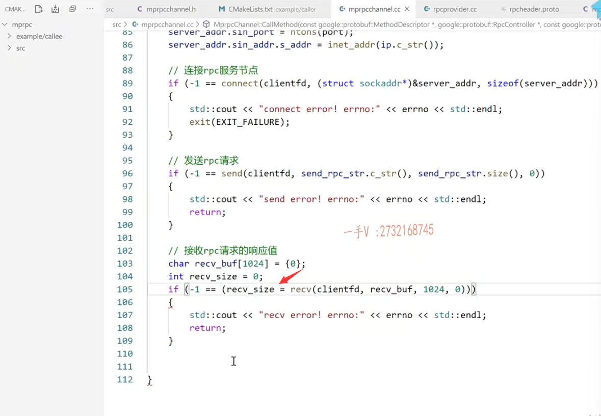

然后呢？我们就可以把网络上接收的这个字符流呢。

往这个response里边去写了，

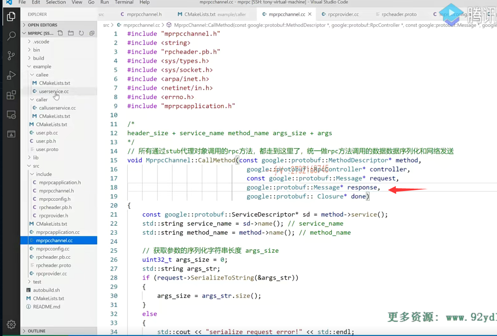

写了以后呢？

应用程序是不是就感知到这个rpc方法有结果了，是不是啊？

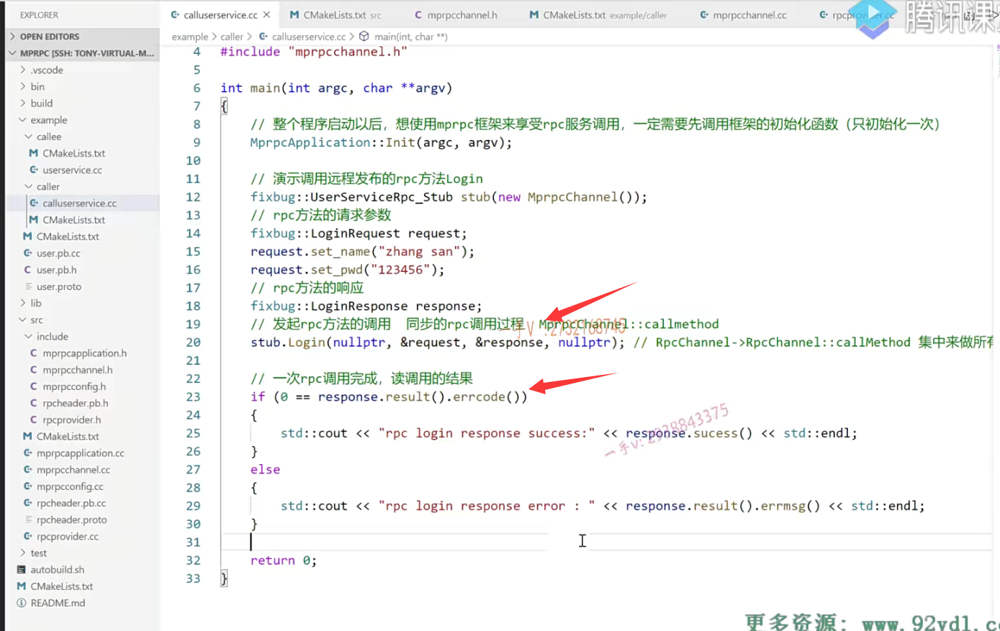

## 反序列化rpc调用的响应数据

好，那在这里边儿，我们就差最后这一点来把它完成。

那首先呢，我们定一个string吧啊recv。应该是response STR

然后呢？

给它初始化的时候，看它有没有构造函数，就是用recv buffer来初始化。好吧啊，

用recv buffer来初始化的这个长度呢就是receive size的这个长度啊。

那么，这里边儿用它的这个构造函数能不能完成？大家来看看。

recv 8分儿。然后零到receive size。

==就是把这个数组的这个区间的数据呢，为初始化的数据填到这个response STR。对不对？==

然后进行数据的反序列化，

就是完成这一块儿的。

现在receive就得到了这个rpc方法调用的响应了，是不是啊？

然后进行反序列化。

人家应用呢，都已经给你暴露了一个response，你把数据呢往response里边儿填，

人家到时候访问这个response就知道rpc调用的这个结果了。对了吧？

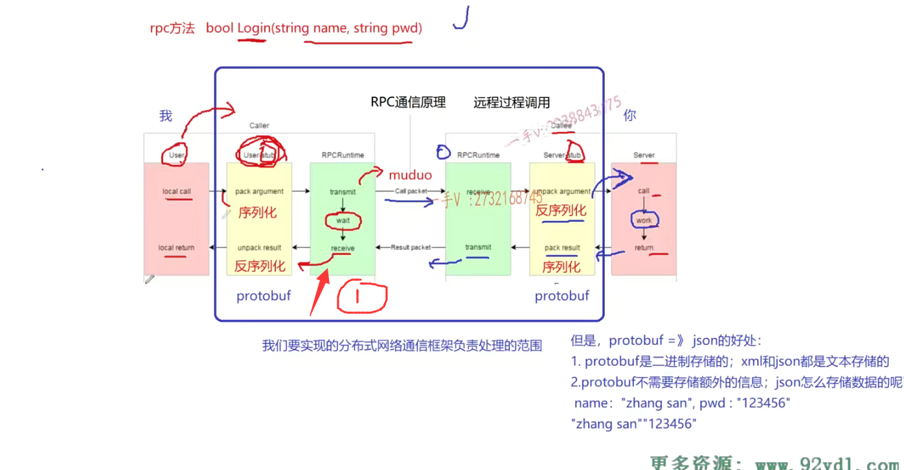

好嘞，那在这里边儿，我们马上就要完成了啊。

点呃，这个是pass是不是pass from谁pass呃，

你看pass from a rain也行啊。from string我们转成这个字符串了。

那么就是receive呃，是response STR。

啊，这个当然返回值也是个啥呀？也是个bool值啊。

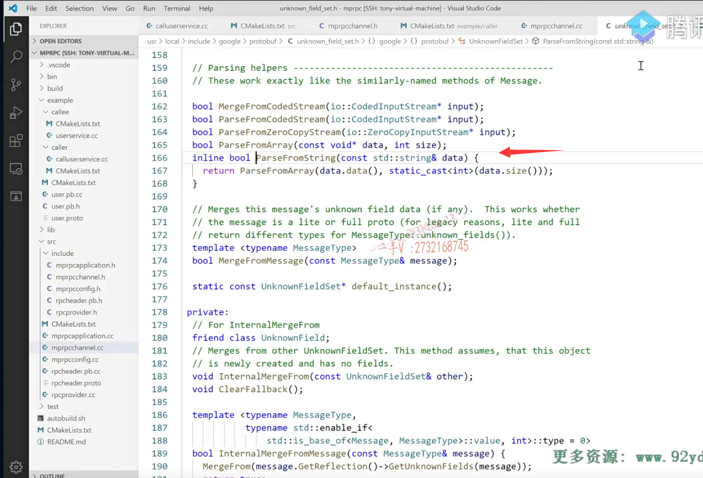

### 反序列化的数据存到response_str

那我们写逻辑就是这要判断，所以我可能呢，这个出错的结果，

这又是一个什么呀？这又是一个cout啊。这个是parse 这个error。然后response这个。

那么，我们可以打印一下，对吧？

这个就return了啊。

如果是序列化成功。反序列化rpc调用的响应数据啊，

那这就可以了嘛。

==它从这个反序列化就把这个字符串里边数据填到这个response里边了。==

==然后我们调用方就可以访问response来获知rpc方法调用的这个请求的这个结果了。对了吧啊，===

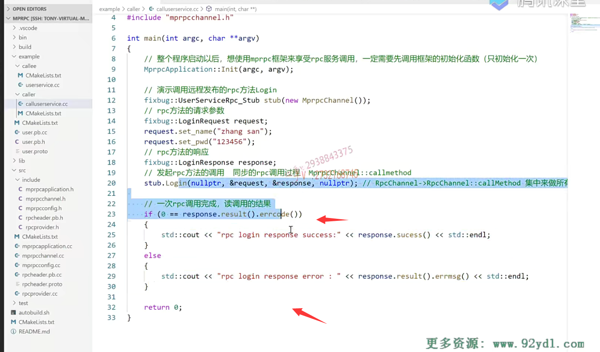

那这块儿呢？那就完了，大家来看看.

一次rpc调用的这个过程就是这个过程的啊。

这个完成以后呢？要应该是把这个什么呀？

client fd要怎么样？这个要关闭掉啊。这connect error。关闭一下，这个就return了，是不是？关闭一下，关闭一下。这个关闭一下啊。

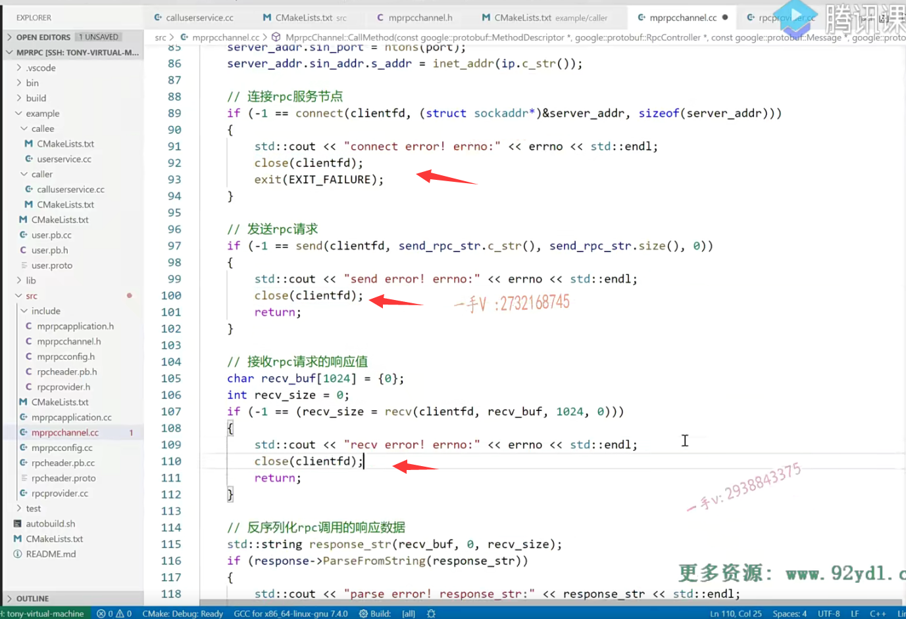

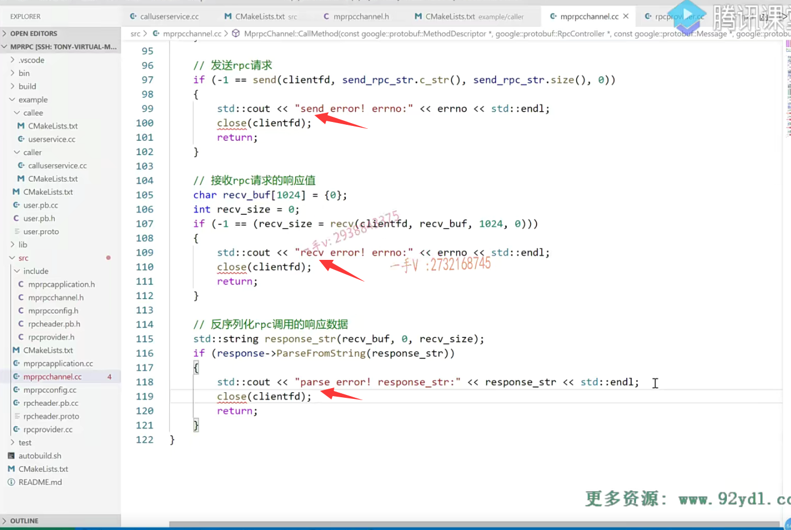

### close方法，缺少头文件  补unistd.h

到最后正常了。也是一样的好吧。close.呃，这个头文件又没有被包含。头文件啊，头文件。unh TD点h啊。

### 创建一个智能指针来动态创建一个。来动态维护一个client fd。

我觉得C++应该也像其他的这个。发展比较快速的oop一样，应该引入自动的导入这个相应的头文件啊。这会比较舒服一点，是不是？

==实际上，大家如果嫌麻烦close fd 嫌麻烦的话，在这儿可以创建一个智能指针来动态创建一个。来动态维护一个client fd。==

==然后自定义一下它的这个删除器对吧啊？也可以鼓励大家去用一下啊。==

好，那这整个就完了，整个就完了。

就是调用的时候呢，

就是初始化框架。定一个代理对象stub对象和传一个rpc channel。

rpc channel的核心就是继承了rpc channel并重写了call method的方法。

填写你想发送的rpc方法，请求的参数以及定义一个响应。

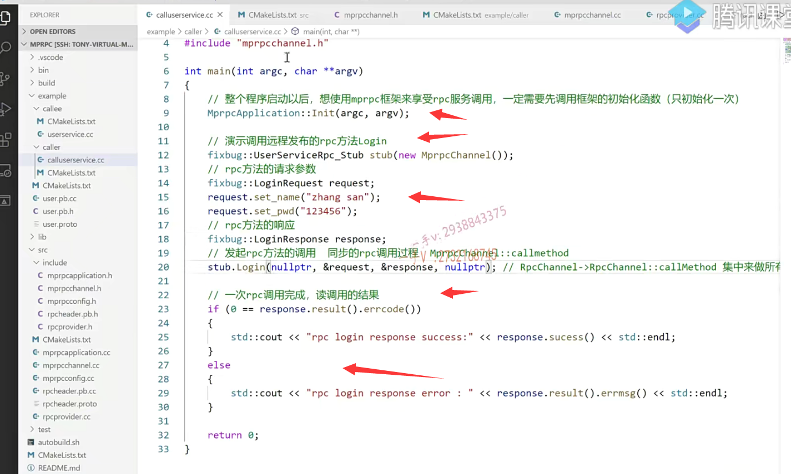

开始通过这个代理对象调用这个rpc方法。

这个rpc方法的调用最终都转到我们的channel的call method的方法里边儿了。

对不对啊？

# 逻辑大梳理

在这里边，我简单给大家画一下吧啊。防止我们有些同学呢，还是？有点儿看不太明白。

实际上，这里边儿已经之前给大家已经画过了啊。

在这儿诶，这里实现的是什么呀？

实现的是一个。class mpr PC.channel继承了谁？rpc.channel啊？

重写了哪个方法呢？重写了call method的方法。

这儿有一些参数，是不是？

然后注意啊。在这里边儿，你通过这个代理对象调用的这个方法。

就代理对象这儿的方法啊，这儿的这个login方法。

好吧啊，其底层实现的时候都是调用了它底层rPC channel的什么？call method的方法把参数传进来了。

那也就是说呢，在这里边我们看见的是代理对象调用login，

实际上呢，所有rpc的方法的调用呢，都转到它事先传入的RPC channel的call method 的方法，

这是基类指针指向派生类对象。

然后用基类指针调用了派生类对象和基类的一个同名覆盖方法，

所以当用代理对象调用login的时候。

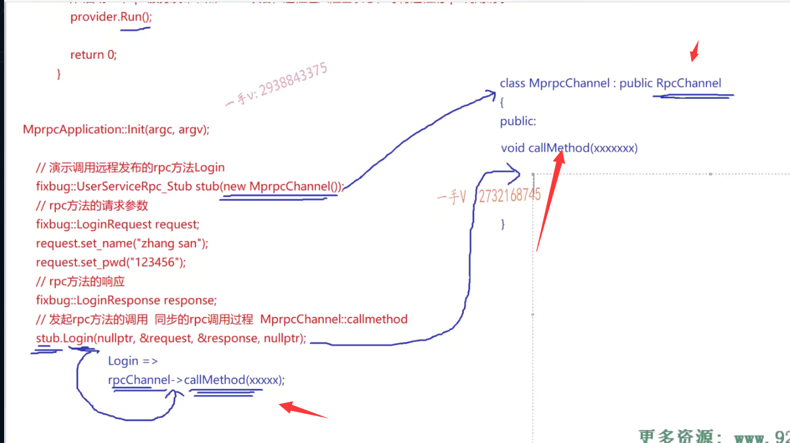

这儿代码逻辑就跑到这儿来了。

啊，在这块儿我们就做了详细的这个rpc请求的数据组装，

也就是数据的序列化好吧，还有网络。

然后是发送rpc请求，然后就是wait等待啊，接收rpc响应。

然后是响应的反序列化。

这就完了，这就是我们mPRpc channel call method，这里边主要完成的事情。

对吧啊，

它是用这个原始的TCP编程来的，

因为它是属于rpc的client的客户端这一方面。不需要什么高并发。

嗯，大家来看看啊，就是这儿通过这个参数获取service name，method name，arg size对吧？

这个代码大家逐渐细细看一下，根据我们这个rpc请求的这个数据格式啊。

创建socket。读取rpc server的IP地址端口号。

组织socket addr信息连接连接成功以后呢，发起rpc请求。

接收响应啊。

接收以后呢？再反序列化这个rpc的这个响应数据。

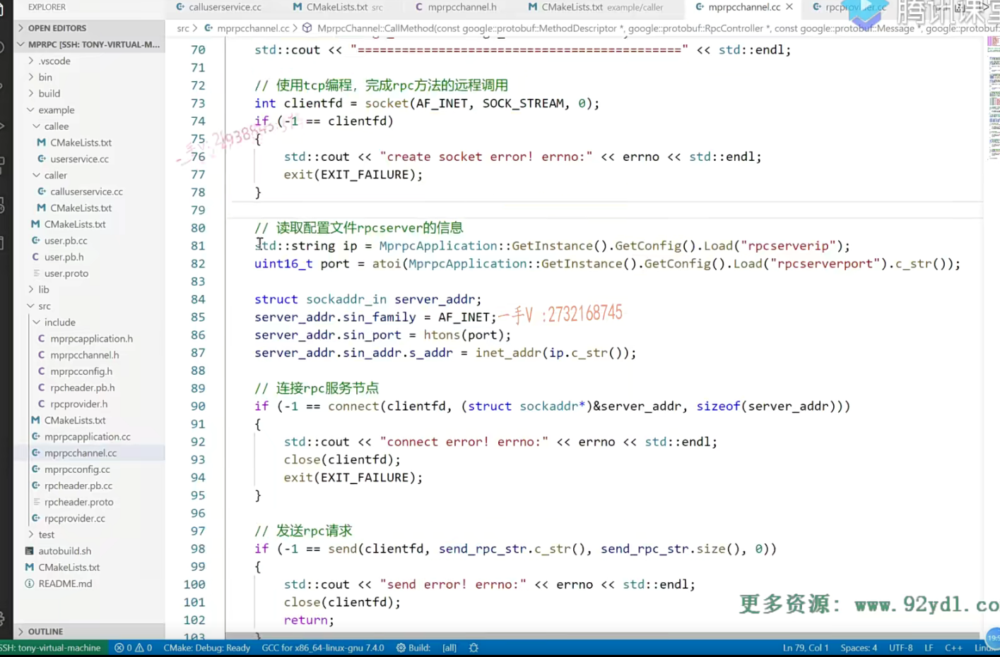

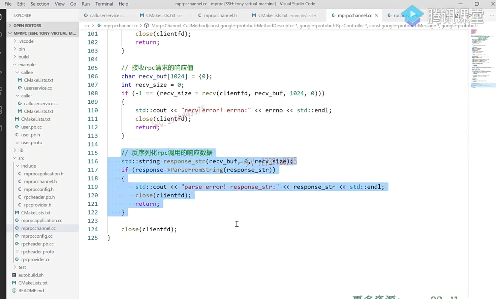

调用方在这里边可以读取response的这个结果，

根据错误号来打印错误信息，或者说是看执行成功的rpc方法的这个返回结果

对了吧啊，

好整体呢？编译一下，没有问题啊。

好了，那我们这个rpc.channel相应的这个代码就写完了。

## 总结

写完了以后呢，我们这节课先说到这儿，

下一节课我们来启动一个验证。

大家在我验证之前能不能先发起一次验证，看验证能不能通信成功啊？

通信不成功，有什么问题可以试着自己先去定位一下。