为了让大家加深对我们所写的mpr PC分布式网络通信框架的这个理解啊，

我们这节课的任务呢，主要就是给大家再从我们使用者的角度来给大家举两个例子，

让大家加深一下对我们分布式对rpc调用，对我们写的mprpc框架的这么一个深刻的理解啊。

好，那么我们把src这个目录呢？已经关闭掉了，

因为我们现在假设我们使用方，我们是看不到人家源码的。

因为人家的这个mpr PC这个库呢，是给我们以静态库的方式提供的好吧？

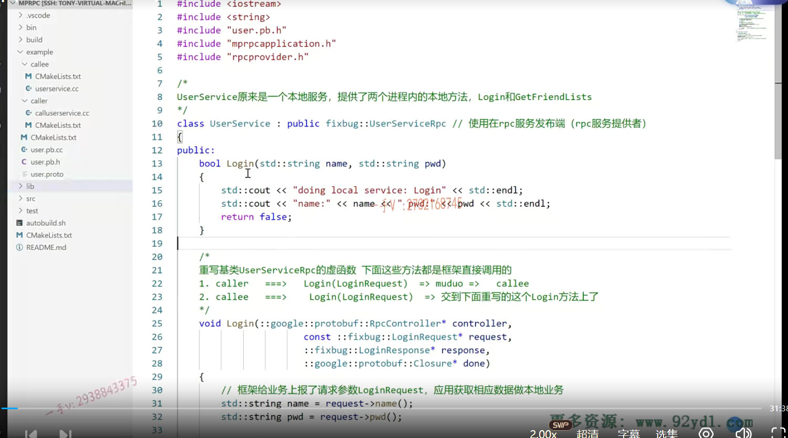

### 再提供一个注册的方法

如说而我们现在呢，这个用户模块儿user点proto 里边儿呢，

我们不仅仅有登录。

啊，我可以再给大家去演示一个事例，就是注册好吧哎，注册。

那么，在这里边儿就是我要写什么东西呢？

message.那你看啊，你要注册，

==你要还发布一个注册方法，那你就得让别人让rpc的调用方看到你是怎么描述这个注册的这个方法的？==

==包括service rpc方法的这个方法名儿以及参数的这个类型，以及响应的类型，==

### 方法的这个请求参数类型跟响应值类型

人家就知道怎么调了，怎么解析你给人家的响应值了，对吧啊？

那么在这个你要发布方法，你得先在proto文件里边儿定义相应的东西啊。register.request.

那么，假如说在这里边儿呢？是一个uint三二吧是一个ID啊，

在name password。这是相当于在同一个模块儿，我又增加了一个rpc方法啊。

然后呢，这个应该是拷贝这个啊。拷贝这个，这是login response.

这是register response。对的吧呃，注册是否成功？

==好吧，那也就是说你要发布一个rpc方法，那你先定义两个这个东西。好的吧啊，先定义两个这个东西。==

==方法的这个请求参数类型跟响应值类型，==

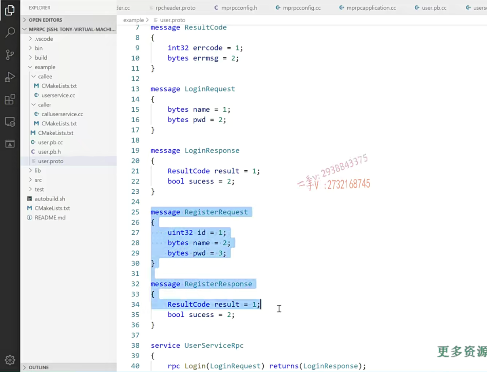

### 在这儿再加一个rpc方法就行

然后在这儿再加一个rpc方法就行了嘛。

我在这儿给大家再举这么一个事例，

你想加更多的方法，你随意加好不好？

然后呢，在这儿就是一个register什么？response这个一填就好了。

啊，填好了以后注意。

接下来怎么办？

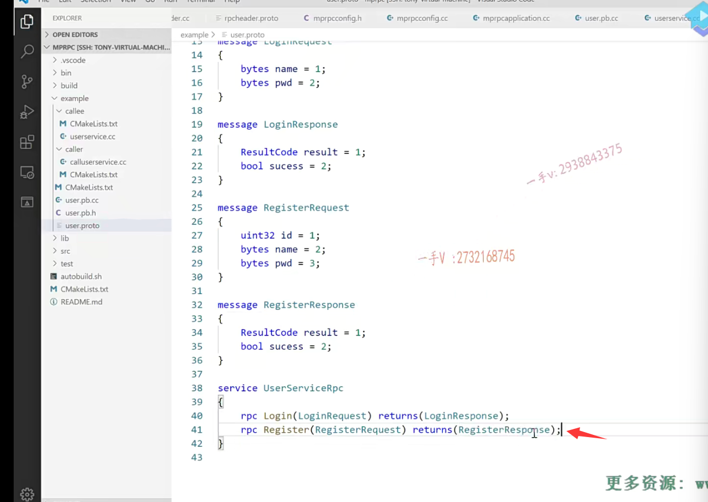

### user proto重新生成C++的这个代码

各位接下来做的事情就是你proto文件变了。

你在这儿需要把这个user proto重新是不是生成C++的这个代码呀。

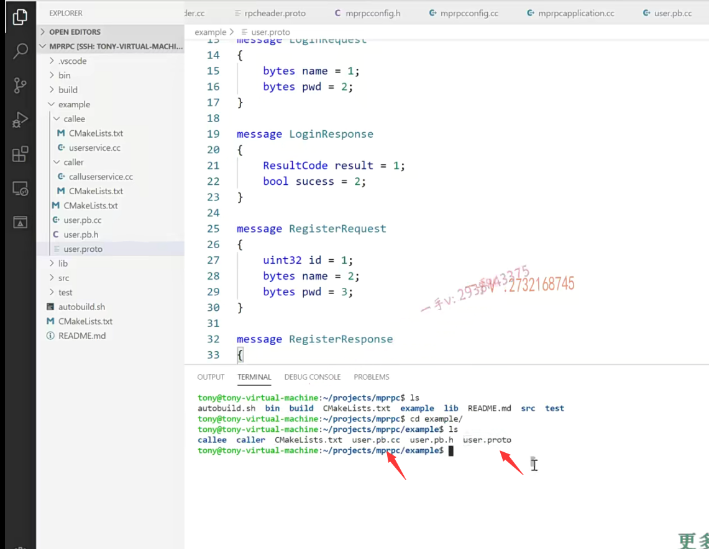

pro toc这个user点proto，然后是杠杠cpp向横杠alt等于。

这没问题吧，实际上到时候我们可以在这个一键编译脚本里边啊，

通过这个命令啊，通过shell命令可以让它每次编译的时候呢，

重新生成一下proto文件对应的这个C++源码啊，这样就不用我们每次手动改。proto还要生成源码的，是不是？

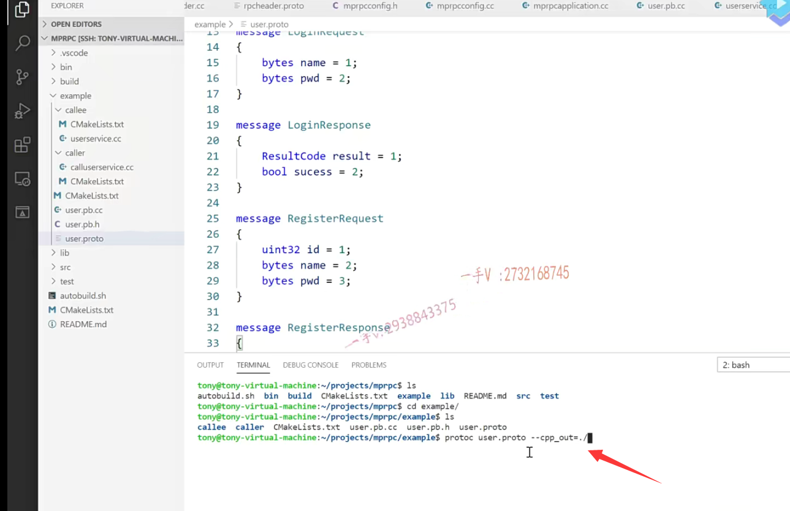

好，这个生成好以后。嗯，大家来看，那我怎么发布这个方法？还是user service模块儿，

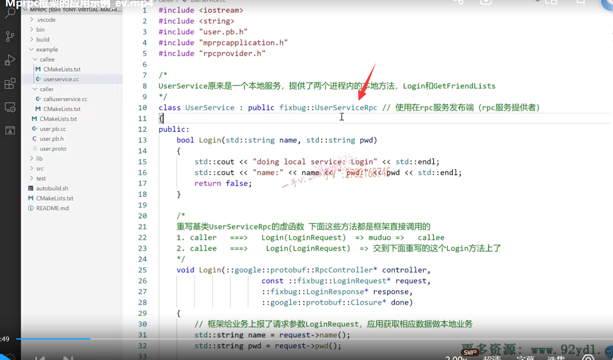

那么你看看点进去。你就会发现这个模块儿里边啊。

我们应该进这个模块儿里边class。

现在这个除了login，是不是还有register呢？

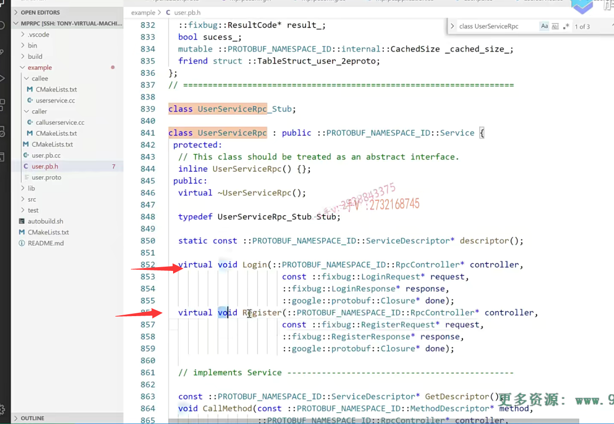

那现在我们就怎么样啊？

你看，假如说这是原来的什么服务啊？gist啊，这是原来的ID啊，

这个是ID，然后还有什么呀？还有string name，还有string pwd.

这是服务端的。是不是服务端的啊？

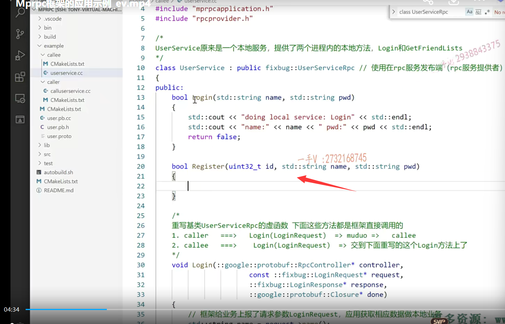

这块儿相当于就是。接收到了远程的一个rpc请求。

请求一个注册服务，

那我在这里边儿接收到ID name password

是不是就跟数据库里边儿的这个u点儿表里边儿去找一找？这个用户名有没有占用？

啊，这没占用的话呢？呃，就注册成功，占用的话就是注册失败啊，昵称已被占用，

这相当于是一个号码，对不对啊？

号码它应该注册的时候应该不用号码注册成功的话，是不是会给你分配一个号码啊？

无所谓业务，你怎么做都可以。

啊，我们写的是框架业务，怎么做都行，好不好啊？

我们在这儿呢。就是只是给大家做一个演示而已啊，做一个演示而已。

业务你怎么做都行。

呃，local service register。name后来我再打印一个ID。

这主要就是看你这个参数，只要能正确的传过来，就说明我们的rpc通信是没有问题的，对吧？

然后呢？这个是return true吧？好不好？

## 梳理一下

你看这是我本来呢，我们的本地的业务，我现在想把它部署成远程的这个rpc服务，

我们在proto文件里边定义了这个rpc方法的描述，对吧？

然后呢，继承这个类的话呢，我们要重写一下这个register，这个register就是框架帮我们必要用的啊，

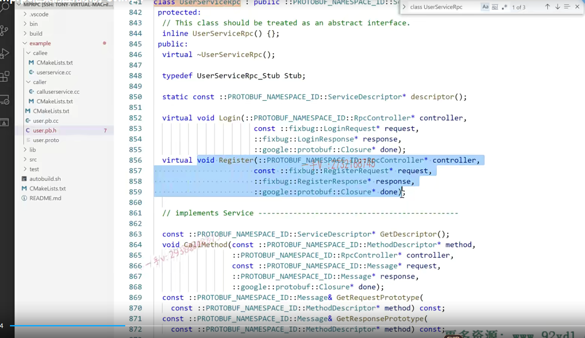

### 做一下register业务

重写一下这个方法。这是注册用的一个远程服务。

到时候框架就会帮我们调用这个register方法啦。

框架帮我调用这个方法，以后那我就知道框架已经从网络上接收到请求的数据，并把它反序列化成一个register request对象，

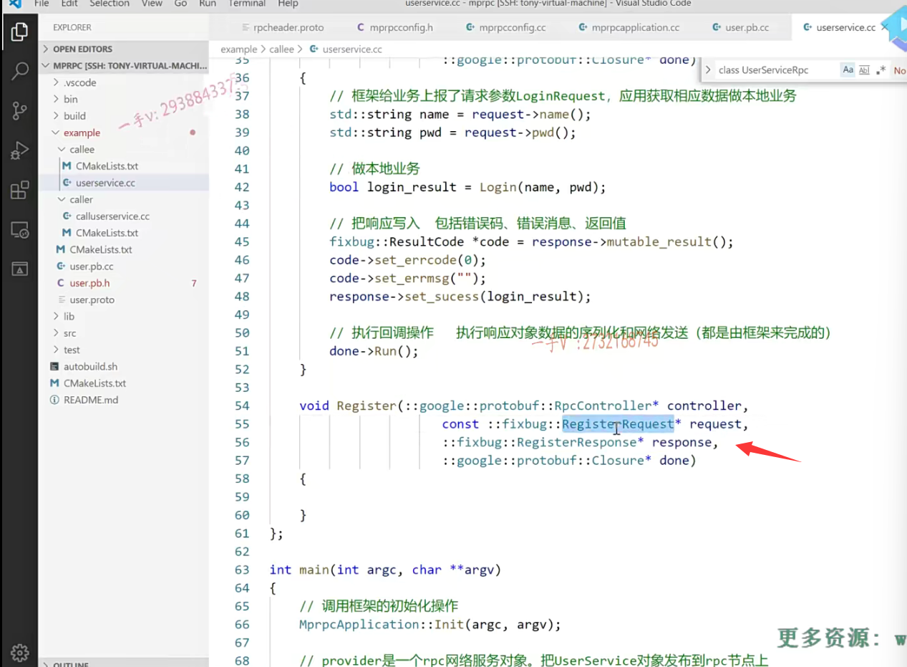

那我在这里边第一步做什么哎？直接取数据是不是就行了？

直接取数据uint 三二那么这里边ID就是request.指向的ID吧，

就这个方法啊，然后就是name request指向的name。

然后就是什么东西啊？password request。指向了什么？password 

OK ay第二件事情呢，就是直接做什么啊？

直接做是不是本地业务啊？减STR。ID name跟pwd做完本地业务

第三件事情，是不是就是？干什么呢？

就是在这里边，然后是mutable  result在这儿，

你填写啥东西呢？set error code你比如说是零是不是？

给这个response填写这个响应值了嘛？

这是执行成功message，也啥也没有，是空啊。

然后呢？给这个最后有一个success，对不对？来填一个RET，

然后最后呢就是执行一下这个down的什么回调啊，执行这个down的回调。

这个回调就是这个回调，

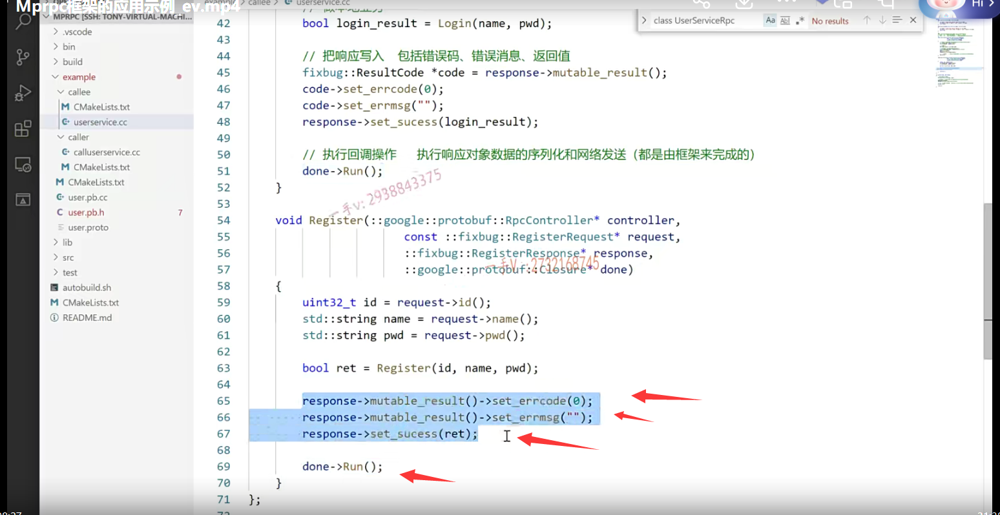

### 再次梳理一下

我们框架上做的事情就是把你填好的，这个response进行数据的序列化，并通过网络发回给rPC client。

你看第一件事情是你有一个本地服务，你想把它发布成远程服务，

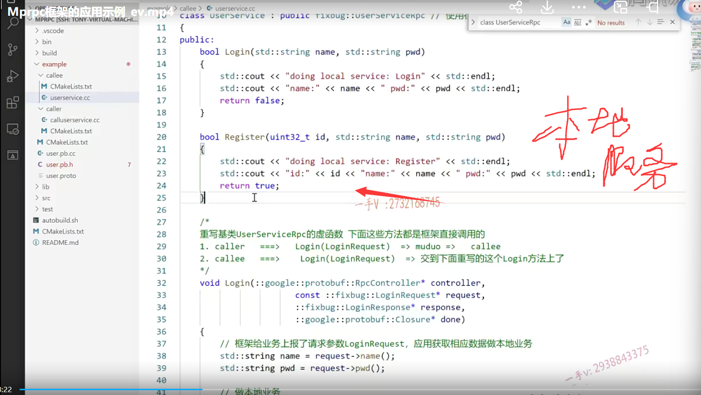

首先在pro pro to buffer里边去定义还有rpc方法的描述，

==顺带着去定义参数以及响应的是不是message消息类型啊？==

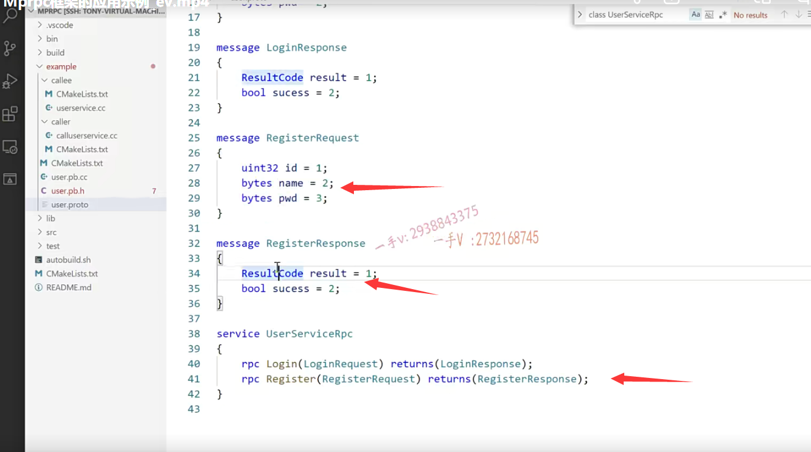

然后呢？

通过继承这个类重写一下它给你生成的register方法。

在这里边儿就是。这套拳就打打四个动作就行了啊，这都是固定的。

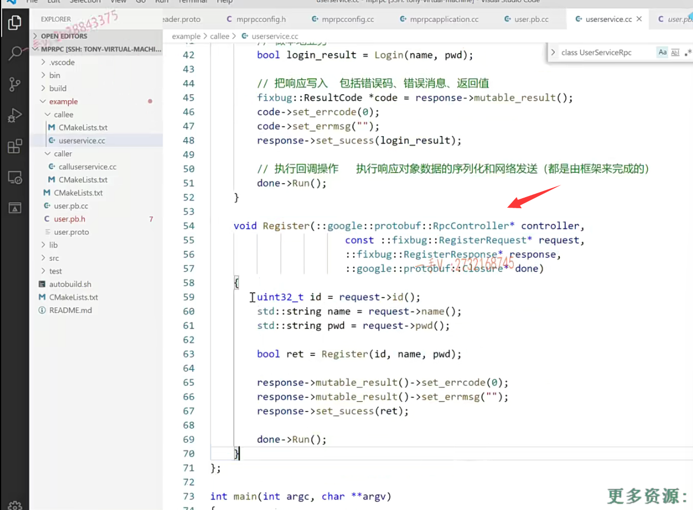

好吧啊，这是相当于我把这个本地的register注册服务发布成rpc服务了，

那别人调用的时候怎么调呢啊？

别人调用的时候呢？就这样调就可以了。

呃，你看啊，这是演示了一个什么东西，这是演示了一个登录是吧？

我再给它演示一个注册啊，

演示调用远程发布的rpc方法register.

## 演示调用远程发布的rpc方法register

那跟这儿都是一样的啊，跟这儿都是一样的，我们可以stub这个代理对象，

我们直接可以复用起来啊。

fix bug.这里边儿用的就是reregister request好吧。啊req。req点set ID。ID是2000。二零零零啊，req点set什么name？是个呃。

mpr PC吧。

好吧，然后req点set谁password？六六六啊。

然后呢，还要定一个什么东西呀？fix bug

还要定一个register response。rsp吧，好不好？

然后在这里边发起一个调用吧stub点regi register，

第一个是。controller可以先填个空，第二个是什么？req.第三个是什么？

这接受的都是指针啊，需要取个地址。呃响应第四个是一个g down

在rpc调用方，这没什么用啊，没什么用。

那么，在这里边儿。这就是以同步的方式。

以同步的跟上面一样啊的方式发起rpc这个调用请求啊，等待返回结果啊，等待返回结果，

那么跟这儿一样了，我们把这块儿代码拷贝下来吧，好吧啊。

这个就是rs。SP诶rsp吧。这个registr这就是注册的相应结果啊，

注册的相应的这个结果。

这使用。啊，就是这样使用，简单吧啊，简单框架只需要注册一次就可以了，初始化一次就行了啊。好，

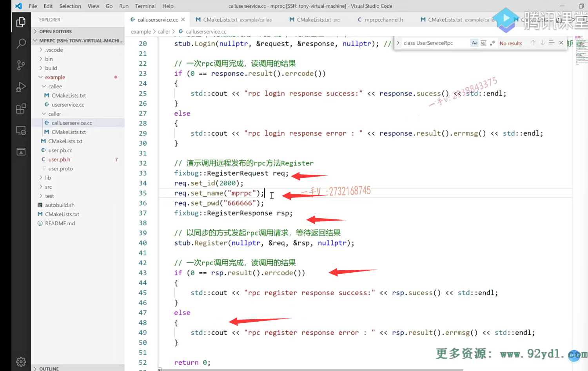

我这个编译一下。100%编译成功啊。

然后在这里边儿。重新启动一下啊。

## 注册了服务对象的，是不是两个rpc方法

你看现在就是注册了服务对象的，是不是两个rpc方法啊？

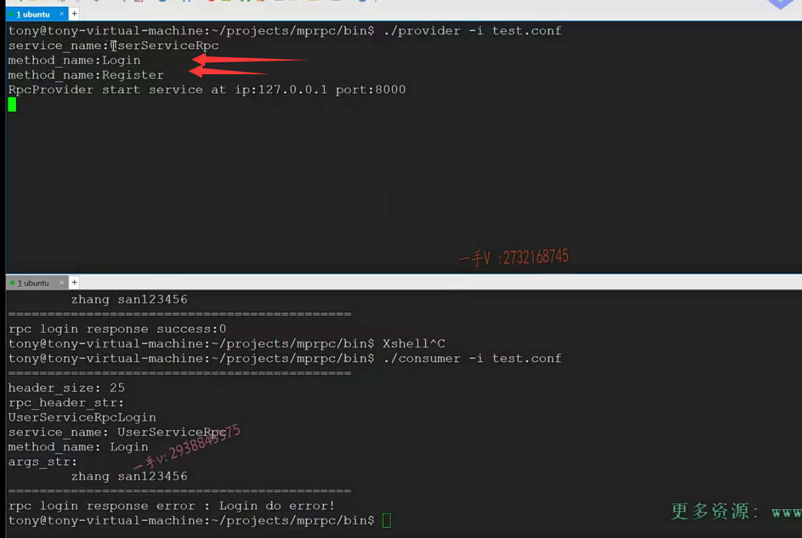

OK，然后发起一个调用。它有两个呢，一个是一个login，另外一个就是一个register。

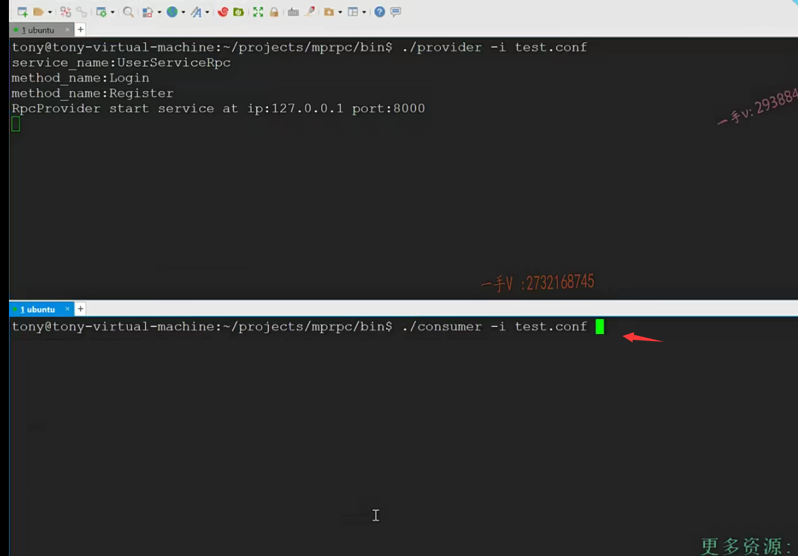

### 演示成功

服务端收到的这个register 2000 mpr PC六六六，这数据都没有问题是吧？啊，注册成功。

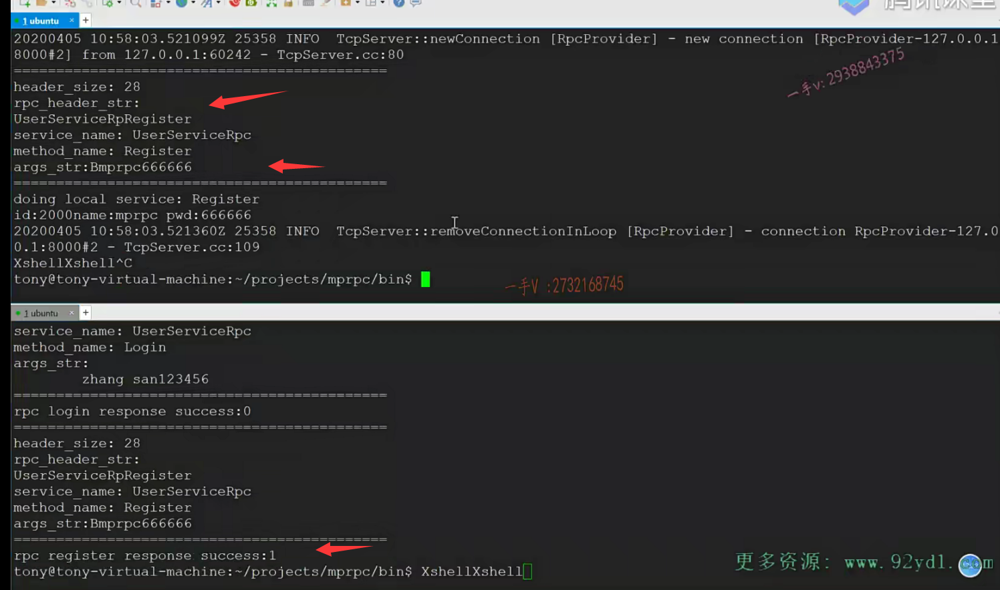

看到了吧？哎，这就是一个演示，它怎么用？啊，怎么用好不好？

接着呢，我再来给大家演示一个，那假如说啊。

呃，大家现在应该自己都应该能搞啊，那我带着大家再写一下吧啊，以防止我们有的同学呢还是有点儿理不清楚啊。

呃，假如说我现在呢？

我重新输出一个模块儿吧呃，用户模块儿用户管理模块儿里边儿就是登录啊，注册啊，修改密码之类的，你也可以再加个修改密码啊。

## 新建一个好友模块

假如说我们好友模块儿啊，好友模块儿。

好友模块儿有一个获取好友列表。好不好好？

### 创建新proto文件

我们写简单点儿，那就是说好友模另外一一个模块儿，那就单独的去定一个。proto文件。

friend点proto。好不好？

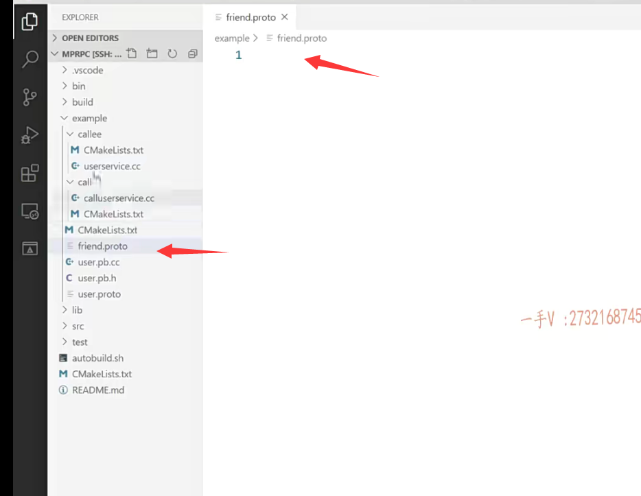

我定了一个friend。这个把这个呢？user pro to el拷贝过来，为了图快啊。result到code。就不需要这么多了，

这是我好友模块儿啊，好友模块的话，

我现在是需要一个friend service.

我是需要一个get friends。list呃get friends list。

那么，这就写一个get friends。list request.

然后get friends list。response好吧。就这样写就行了OK吧，

我现在想把。一个get friends list这么一个方法啊，从本地服务发布成一个rpc远程服务。好不好啊？

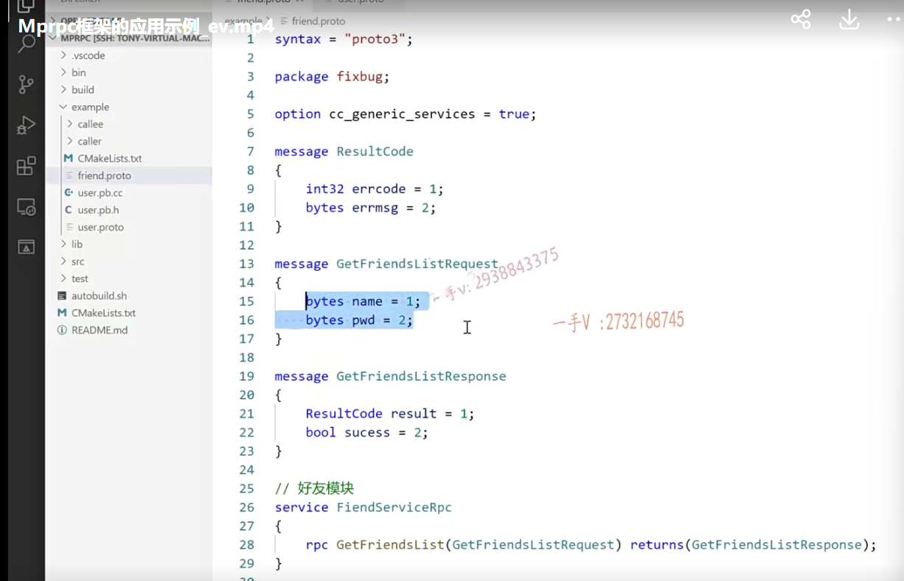

### 重新定义一下请求和响应

那么请求的话，==这里边儿肯定是你要请求哪个人的好友呢？==

所以在这儿应该是一个uint三二u点儿ID好不好？

然后这个响应值呢，除了这个result code。

啊，在这里边儿呢，应该就是一个什么东西啊？

应该就是一堆人了。是不是一堆人了，

我们直接带回来人名儿吧，好不好就不带回来，复杂的什么user对象了啊？bytes，然后就是u。friends,friends.

然后它是一个列表，那前面就添加一个什么？

repeated.就这是重复的啊，就是一个列表，这有很多的什么？很多的这个friend啊，有很多的这个friend。就写个friends吧。想不想啊，

friends bytes我们用名字来代表这个好友就可以了。是不是啊？

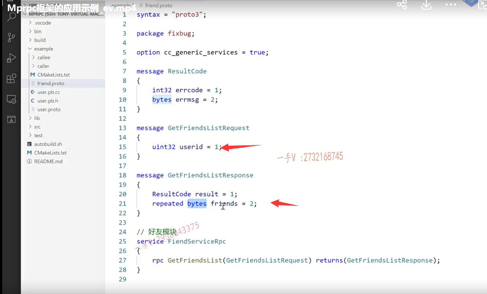

就这个定义好了吧，实际上我们可以先定义啊，人家呢，本身的这个本地服务。

啊，我们新增加一个叫做friend。service点CC。

你看我们把这个头文件该拉的，我们拉进来啊。

这里边本身有一个friend。service service.在这个friend service里边呢，它本身有一个本地的服务。

叫什么呢？大家来看一下啊。

本地的服务给它返回一个vector吧。

就是st d vector里边儿有st d string啊，有这个get friends list。返回好友列表嘛。好不好啊？

然后uint三二杠TU点ID。这是一个本地的啊。分d的c。stds TD see out.

然后是。do这个。是不是service呀？咱们定一个vector吧，

各位。装一点儿东西啊，装一点儿东西。

然后就是STD。string VC.然后VC点。push back啊，push back。

呃，实际上呢？在这里边儿，我们添加一些人名儿。比如说是羔羊啊。然后是。刘红。王朔好不好啊？

啊，就OK了，就随便起个名字啊。不代表任何个人，

然后呢，把这个VC给它返回去。

好吧，这相当于就是做本地业务呢嘛。

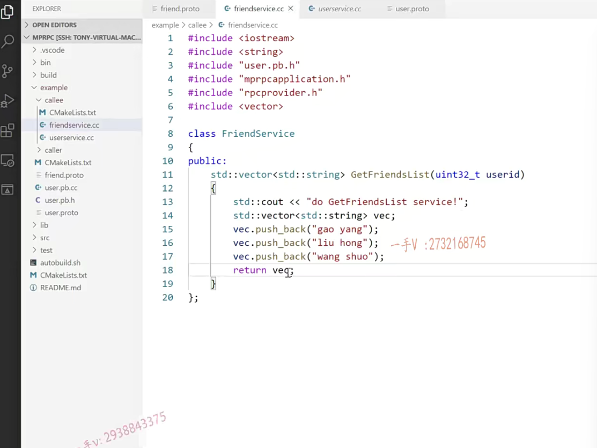

啊user ID可能去本地的数据库表里边儿去查你做什么业务，

我不关心我这个项目是框架类的项目，

只要我这个框架能够正常使用，对不对？

我可以服务于任何的业务啊，把任何的本地业务变成一个rpc的远程服务。

### 需要的这个proto定义rpc方法的描述，生成一下

然后现在我要做的事情，这应该是先写这个本地有这么一个本地的服务，

然后我也想把它发布成rpc远程服务。

我需要的这个proto定义rpc方法的描述对吧？

然后呢？我应该是进这个目录。

干什么呢？来生成这个friend点proto相应的这个C++的这个源码文件对不对啊？friend生成。OK了，生成好了，

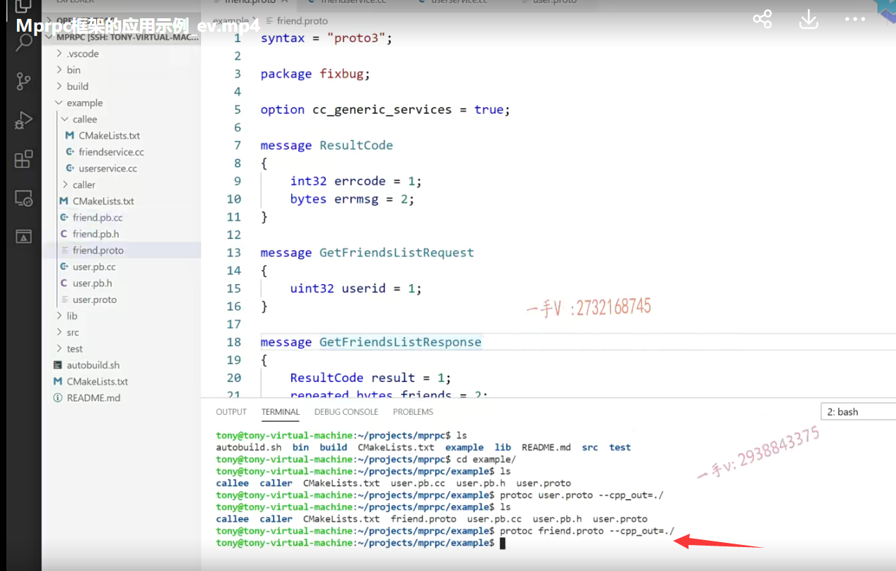

以后呢，我在这个friend service点CC里边儿就不包含user点PB点h了。

我应该包含的是friend点PB点h对不对？

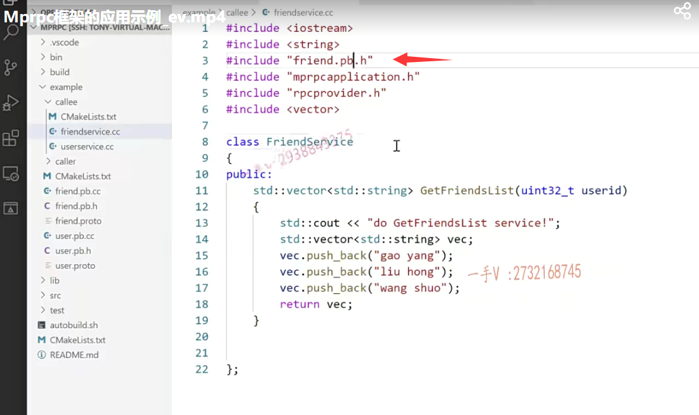

接着来看你，看我做的什么事情呢？

是fix bug。friend.叫做friend service是不是rpc呀？啊，就这个，

然后呢？重写一下它的什么方法？

重写一下它的get friend list这个方法。

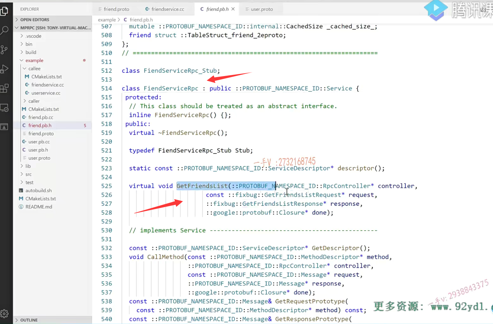

### 重新一下 框架基类的方法

这个方法是由谁帮我们调用的呀？

哎，这个方法就是由这个框架帮我们调用啊。

这个是google pro to buf.啊，你不想改成这个，你就把那个宏的这个头文件包含上啊，我觉得这个看起来更清楚一点，是不是？

这个重写方法啊。重写基类基类方法。

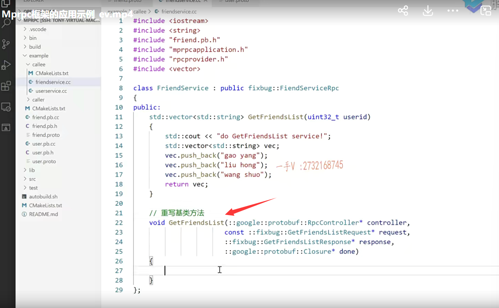

### 当有人真的发起一个get friend list这样一个rpc方法请求的话，框架帮我们去处理，但是我们得写好自己的逻辑

当有人真的发起一个get friend list这样一个rpc方法请求的话呢，

框架会给我们把人家发过来的数据上报上来。

那第一个动作是干嘛呢？

取出是不是数据啊？

这里边儿有什么数据吗？

这里边儿就是有一个user ID啊uint 3二杠t user ID=request。指向的是不是user ID呀？就获取到了。

然后做什么事情啊？然后我们做的事情就是执行本地的业务。

这个fri friends list等于这个把人家携带过来的user ID呢？是不是传进来呀？好，这个就是做了，

做完了以后呢？第三个动作是干嘛呢？是把数据往这个response里边儿，是不是去写啊？

那假如说呢，在这里边儿这个mutable result。

然后set error code 0不是假设，我们也是执行成功的好不好？

这个set error什么？message.然后这个是空。对不对啊？

然后接着得该添加什么东西了，添加friend了好吧？

首先response呢，指向的就是add friends。

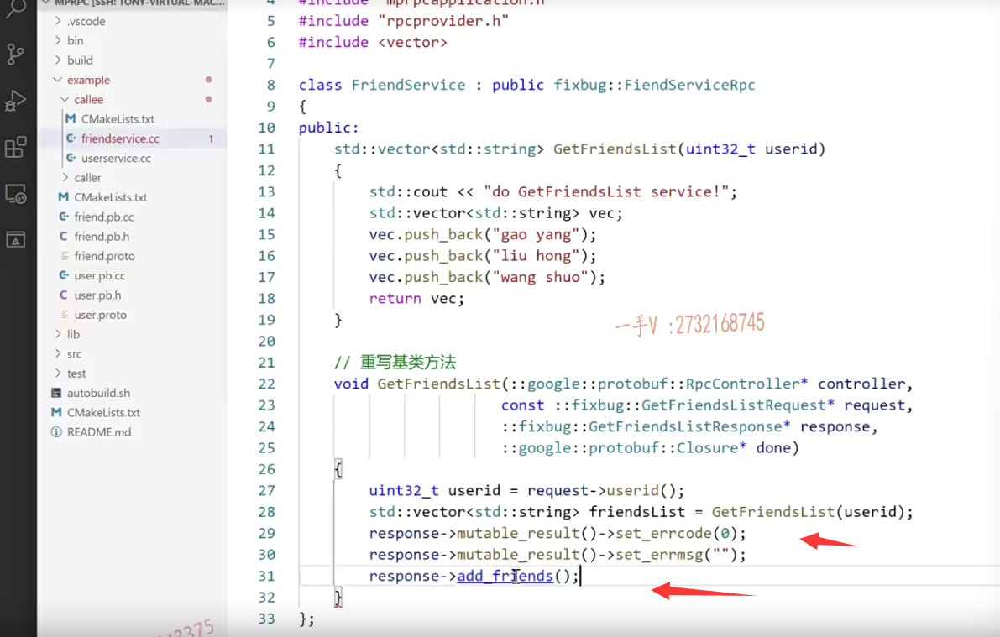

### addfriends看一下

这个add friends啊。大家来看一下。

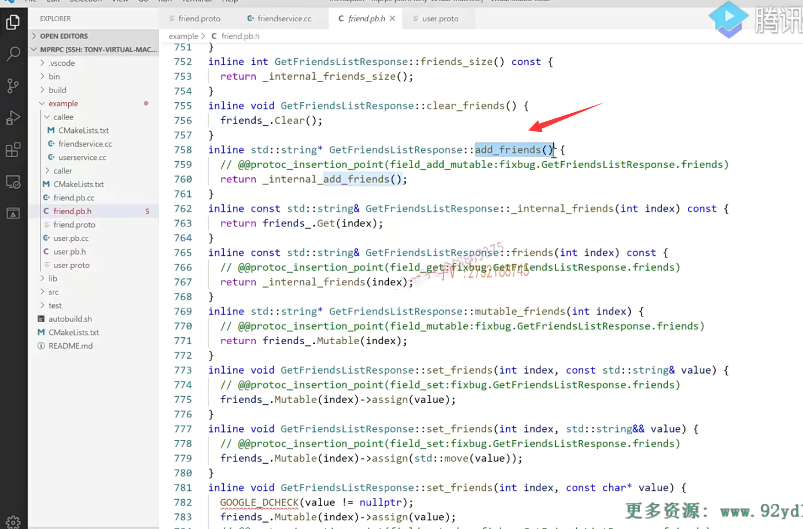

add friends.就是这里边儿啊，它会去创建一个新的搜寻对象，

然后给你返回这个数据的一个指针的，

是不是你可以通过这个指针来修改它啊？

==那么大家来看。那我们应该不是这么写，==

### 把response里边儿的一个friend就是一个字符串的信息就改成我们从vector里边拿出来的一个姓名

是不是？应该是for循环谁呀？for循环strings。name，

然后是。friend list.然后是response。嗯，st d string。嗯，星p=response的add。对不对？

然后是星p等于谁呀？等于零哎，

==就是这样的话呢，我们就把response里边儿的一个friend就是一个字符串的信息就改成我们从vector里边拿出来的一个姓名了。==

好不好啊？

这就是对pro to buffer的操作是不是？

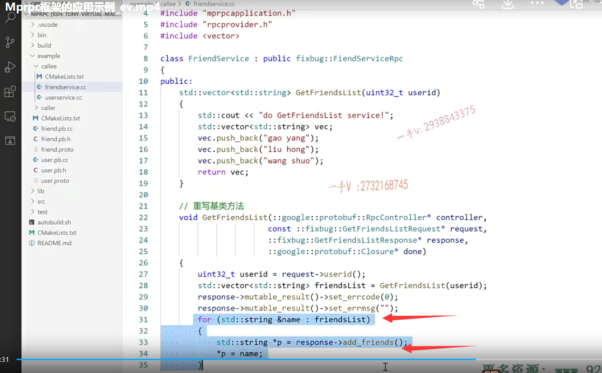

啊，这个放完了以后呢？我们最后再执行一个down指向了run。

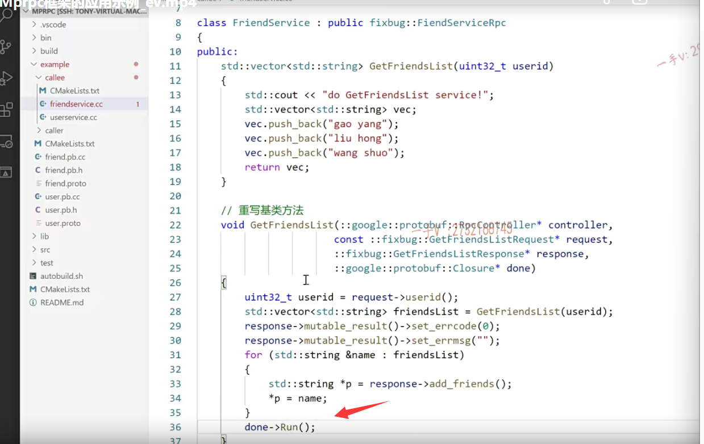

## main函数发布friend service.

这个我们服务服务就可以发布了是吧啊？

那然后你再补一个什么函数啊？补一个main函数就可以了嘛。

啊，这个main函数的其他的这个操作都是一样的，

无非现在就是我们发布一个什么东西呢？

friend service.是不是一个friend service呀？have friend service，

这就OK了。好不好啊？

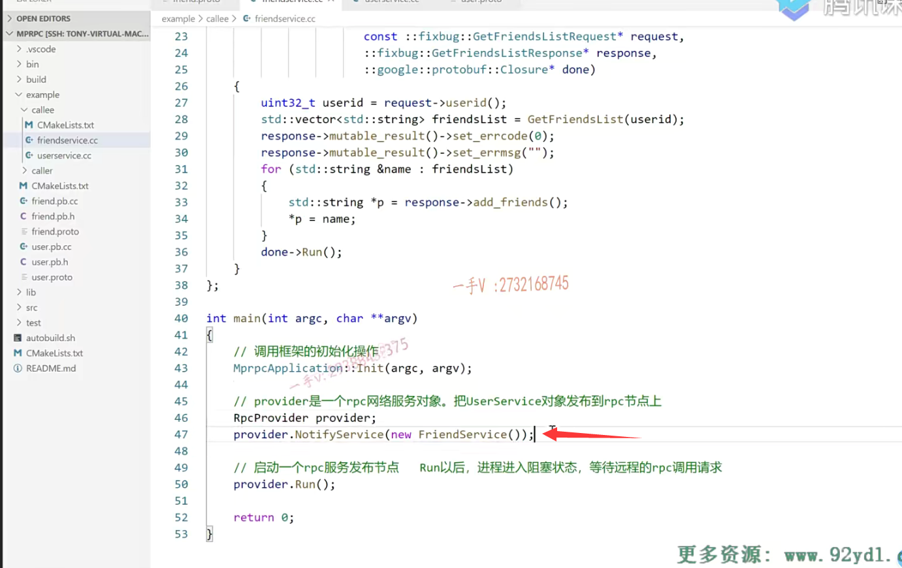

### 补一下之前打印的信息

注释我们就不改了，大家可以自己改一下。

嗯，然后在这里边儿，大家来跟我看一看啊。啊，这个怎么都没有写完呢？mdl.这个我们打印一下这个user ID吧啊user ID。user ID.

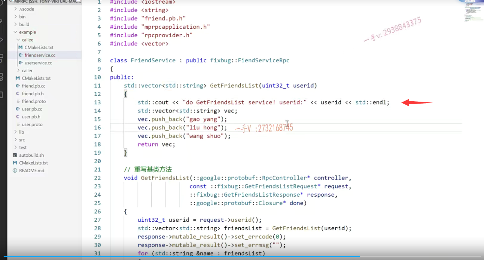

### 修改一下服务端的callee的cmakelists.txt

好在这个cmake list里边，我们把这个。换一换啊，换一换

不是这个了。

我们现在不想编译user service了。

我们现在想用这个friend。就是friend friend service点CC，这个没问题吧？然后再是上一级目录的f2。iend friend点PB点CC。

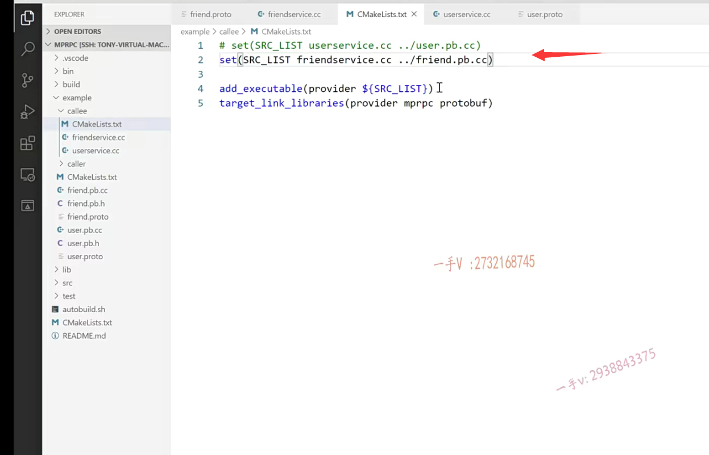

### 创建调用friend服务的源文件，拷贝一下之前的

这个是provider啊。

调用的时候怎么写呢？

啊，调用的时候我也是单独写一个。原文件吧，都留下来，不删了啊。

call friend service点CC啊。

这是调用的。就是friend。然后再来一个main函数啊，再来一个main函数。拷贝一下啊。我们处理的可以快一点。

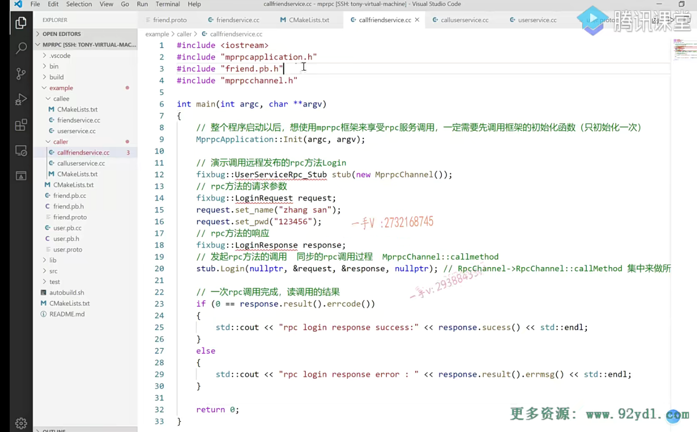

好，那么作为rpc的调用调用方啊，你只要包含框架的这个基础类还有这个？

mpr PC channel及及friend点pp点h就可以了。

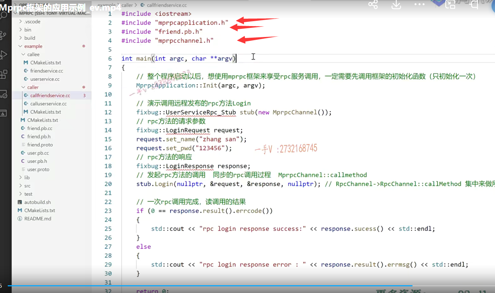

## 修改调用方的调用程序

然后这个是什么？fix bug.friend.friend service.等一会儿啊，这个类联想不出来。

我们看看这个吧。就这东西啊。

OK，那不是这个了。是get friend list。这里边儿set一个什么东西啊？

set user ID就是说幺零零零啊。

get friend list response.对不对？然后就发起调用了。get friend list.是不是啊？get friend list。

==这边我只改代码。不改任何的这个注释啊，大家注释需要修改，可以自己修改一下。==

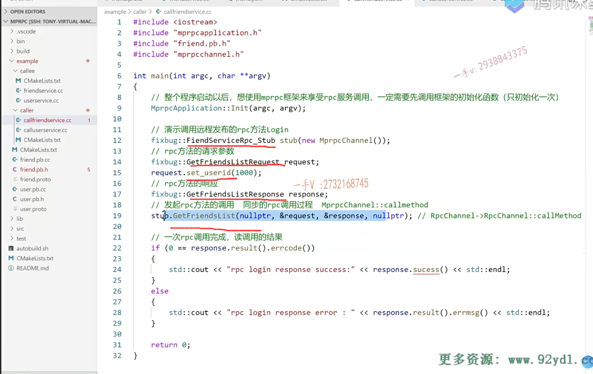

你看这些服务我都可以单独的去写一个main函数，把它单独的去发布成一个rpc进程。

啊，部署在一台机器上，或者是部署在多台机器上，那就看这个进程，

对于并发量，对于硬件资源的一个需求了。好吧呃

### 处理返回的响应

OK，这是获取了这个响应啊，获取响应

这是错误那这个rpc。get friend list，get friend list，

这是响应成功了啊。

### 看一下给我返回回来的这个好友是不是都有哪些呀

==响应成功了以后。那怎么去看一下给我返回回来的这个好友是不是都有哪些呀啊？给我返回来这个好友都有哪些？==

那么在这儿我怎么看呢？

在这儿，大家来看看啊。

呃，大家可以想一想，看这怎么去打印，

那就是看我们response怎么去访问它的这个什么东西啦？

### 怎么获取它的这个所有的好友信息

同学们一起想一想。怎么获取它的这个所有的好友信息呢？

==你看这是它的这个friends size。它生成的方法你可以知道，它有多少个好友是吧？==

==啊，然后呢？你就friends加个下标就知道了。==

==拿出来了每一个好友的这个信息了啊。==

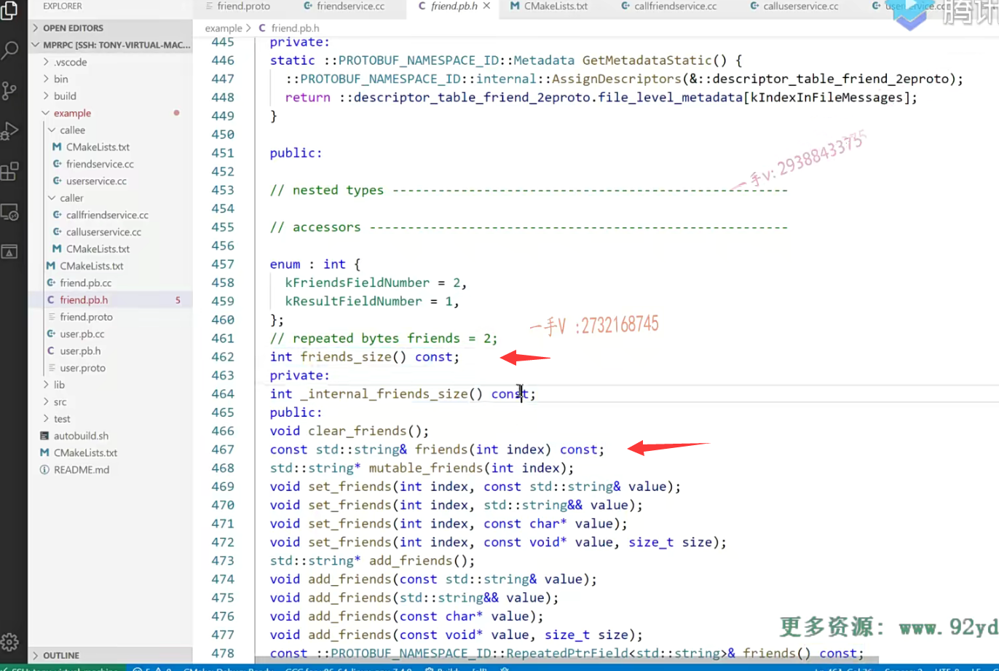

这就是对于protobuffer的应用啊，

这个size=response。这个指向的friend指向的啊，这不是指向，不是指针。friends szie，okay吧，

然后是for循环。inti=0 I小于sis。加加a那在这儿就是打印一下。index I+1。name是谁呀？是response点friend。中括号I。

这就把他的这个好友呢，全部给他姓名打印了一遍。是不是哎？

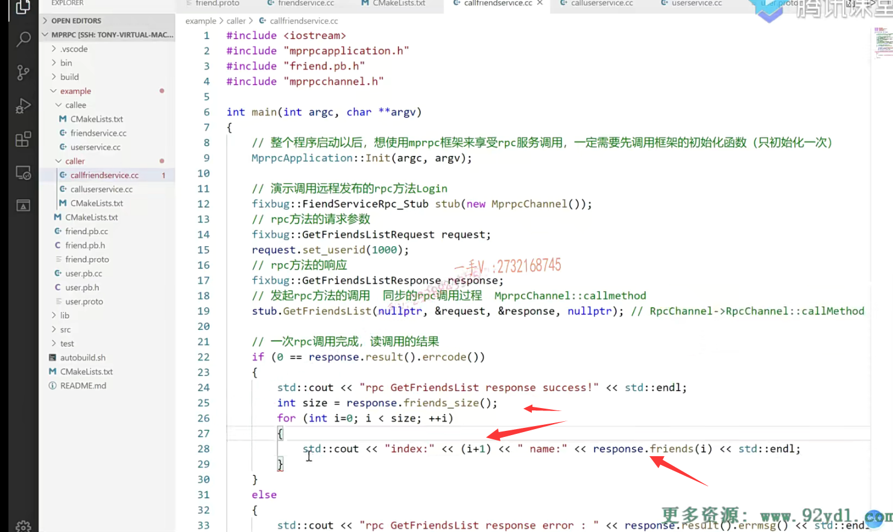

这就是很方便的，你看就是这么这么几个代码，你就可以调用一个远程的rpc服务了。对不对？

创建代理对象，帮你做数据序列化，反序列化网络的触发。

定义因为你是是你发起的rpc的请求，

这个rpc调用你负责组装是不是参数啊？搞一个响应过来，

人家会给你填响应的，以同步的方式等待rpc调用的结果，

你最后你只需要访问response就可以了。

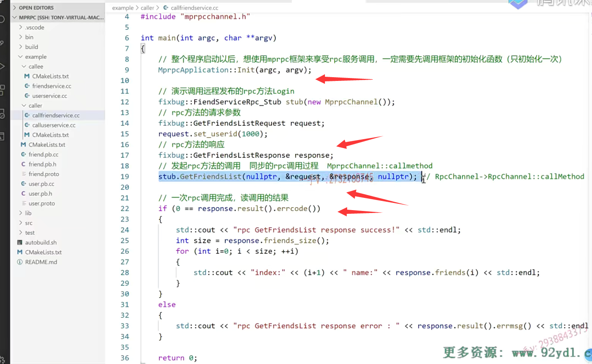

呃，在这儿cmakelist我们可能也需要去重新编一下了啊。

这不是call user，这是call 然后这是friend点PB点CC了啊。编一下。

100%分之百成功。来看看okay？

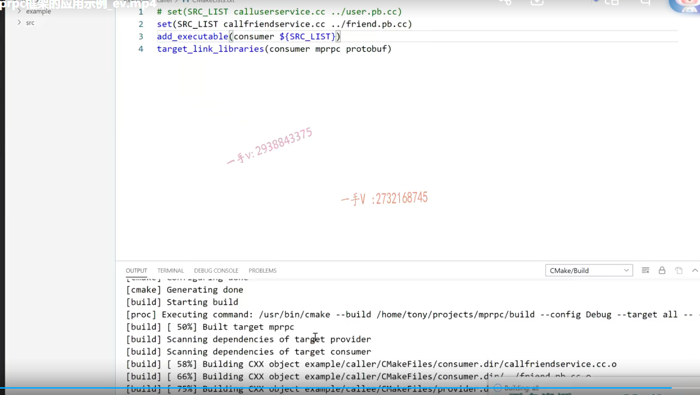

## 演示

啊，发布了一个这么一个。是不是

你甚至可以在一个节点上发布多个这个对象，

你可以把user service rpc跟friend server的rpc发布在一个rpc节点上，没有问题的。

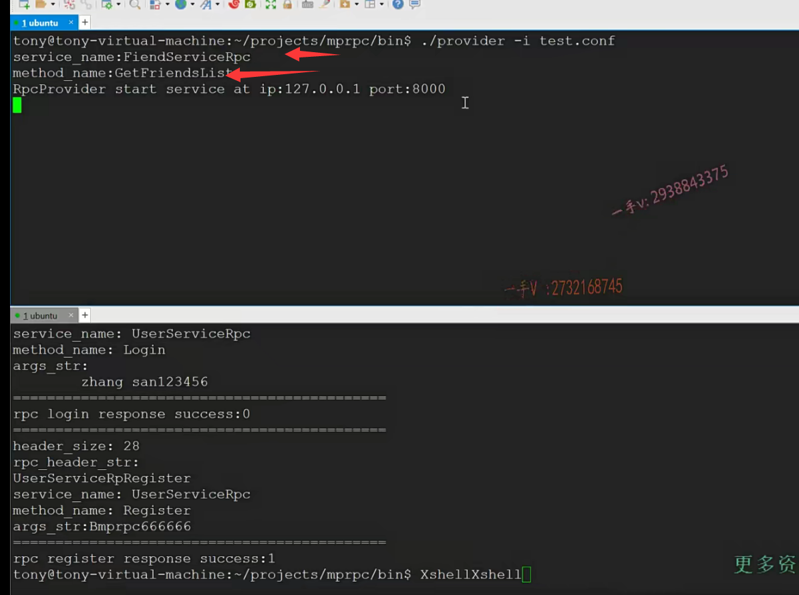

### 启动

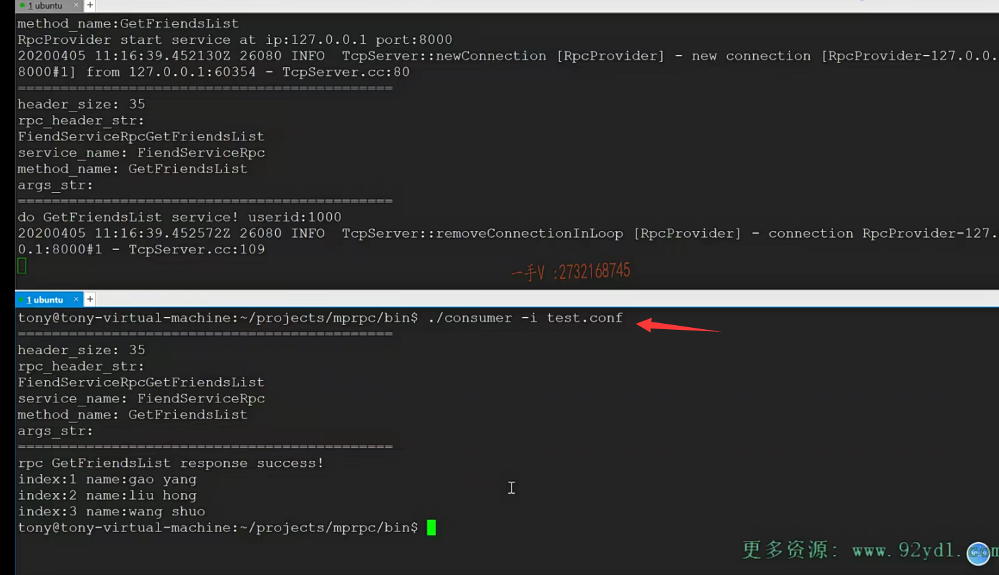

你看这个请求，最后拿到rpc的调用结果，高阳，刘红，王硕，都没有问题吧啊，都没有问题。

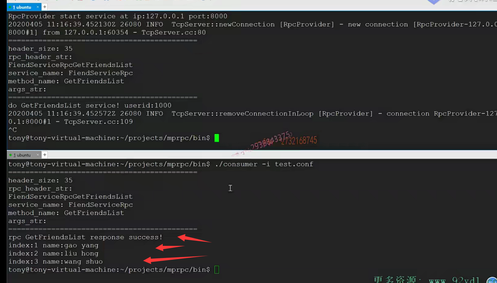

## 总结

好，这就是我给大家演示了一下我们这个框架的使用。

把所有的这里边儿一个rpc分布式通信所用的序列化，跟网络的收发，

我们还做到了rpc这个服务提供方的这个高并发对吧啊？

我们实现了这一块儿。

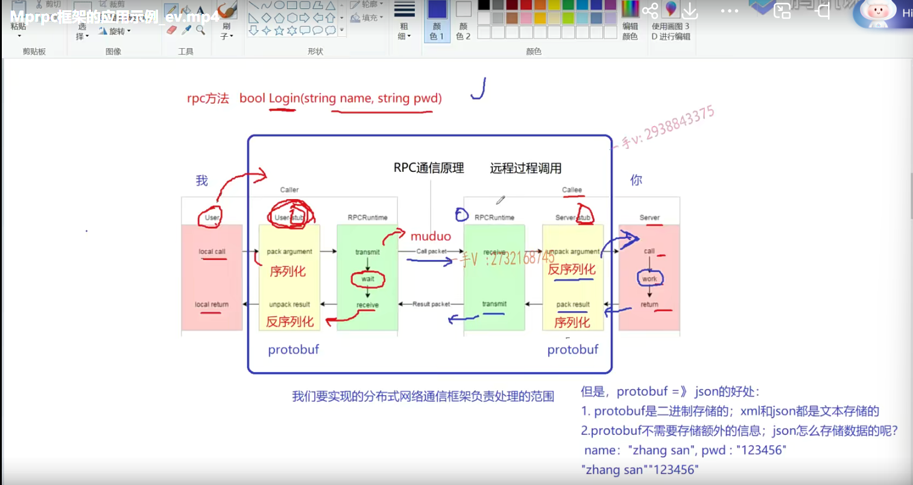

所以至此呢，我们框架基本上90%的内容呢，就都已经完了。

那经过这节课的这个学习呢，

你也去像我一样去站在啊框架的使用方去定义一些本地服务，

把它发布成远程服务，看是否能够调用成功？

好吧啊，这节课的内容就先给大家说到这里