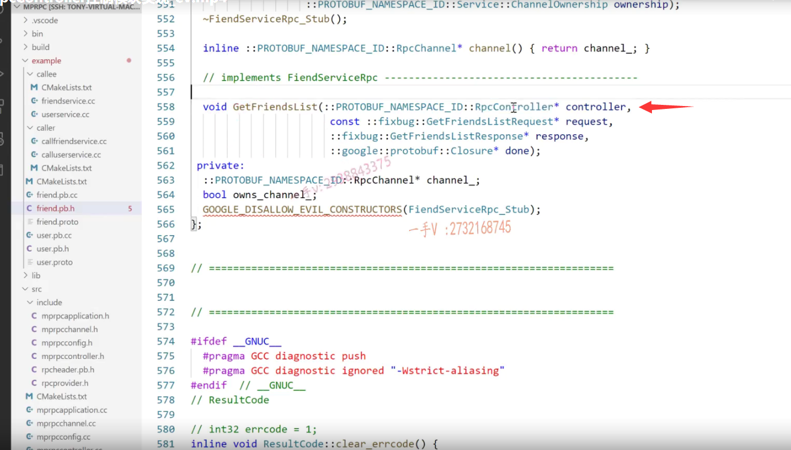
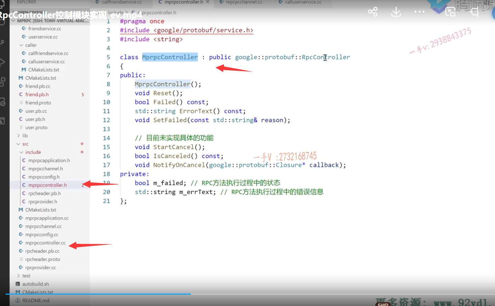

啊，各位同学，那我们这节课给大家再来说一下，

我们mpr PC这个框架上的另外一个相关的参数就是RPc controller啊，

之前我们已经几次遇到了，给大家说我们放在后边，再给大家讲这个。

这个呢，参数不写倒不至于影响我们现有的一些测试，对吧。

我们在之前的课中呢，给大家也测试了我们这个框架的功能。

现在提供了一个高性能的rpc的这个服务节点的一个服务发布，

还有一个这个方便的调用rpc服务对吧啊？

我们这个mpr PC框架都可以实现。

但是实际上呢，我在这里边儿给大家提出来一个问题所在啊，

这个问题还是很明显的。

大家来看我们rpc服务的调用方。

### rpc服务调用怎么调用

rpc服务调用怎么调用呢？先定义一个代理对象，要传一个channel，这是我用我们框架提供的一个功能，对吧？

然后呢？你是rpc方法的调用方，你负责这个填是不是这个方法的参数啊？

然后通过这个代理对象调用这个方法。

那各位同学啊。

你在这个方法之前，我们给大家都实现了两个服务模块儿了，

都是调用完了以后同步等待rpc的响应结果，

然后你就直接访问。

是不是这样的？

那也就是说，各位你们觉得啊，这个rpc请求一定是成功的。

就是我把这个rpc的方法请求呢，发到远端了，远端也给我回复了。远端也给我回复了，

在这里边儿，我现在怎么样啊？

哎，我现在在这里边儿啊，访问了response。

## 这个rpc请求实际上不一定是成功

但是实际上啊，它情况不是这个样子的。啊，情况不是这个样子的，为什么这么说呢啊？

因为呢，你看当我们用代理对象调用这个rpc方法的时候，

我们都给大家说了，它最终所有的这个代理对象调用这个rpc方法都转到channel的call method里边儿。是不是转到这个channel的call method里边了呀？

那么，在这里边大家来跟我看看啊。

这个call method在这里边就是做我们rpc请求的序列化网络发送接收响应反序列化对不对？

最后呢，从开始一直到最后到这里边儿，才是表示一个完整的rpc的这个调用以及响应完成了，

然后我们才在这个服务的调用这里边儿啊。来调用response。来看它的这个响应码之类。

### 这里有一些地方直接return

但是我们却发现。在你这个函数的实现过程中，你看这儿return了。

从上往下，这儿return了，还往下执行不？

不执行相当于你用代理对象调用这个rpc方法。刚一上来就歇菜了。对吧啊，那你在这里边返回了。

连网络都没有发起。是不是直接在你数据序列化的时候就出错了，

你说你这个完了以后你访问response，你有没有必要啊？访问这东西能对吗？肯定不能对啊。

是不是不仅仅是这一个啊？你再往下走，

你这儿。rpc header的数据序列化又出错了，又return了。

啊，网络还没有发送呢rpc请求，

还没有从网络发送出去呢，这已经return了，

那你下来你又访问response有response吗？没有呢。这不正确。对着没有？

==这还有多少呢？哦，这儿，实际上我们也可以写return这socket都没有创建成功，你读什么response？啊，==

这儿服务器rpc这个提供rpc服务的节点都没有连接成功，你访问什么response对吧？

这里边儿一样的发送rpc请求都出错了，你还读什么response？

啊，接收数据都出错了，你读什么response？

它都是这个问题嘛。

接收到的这个rpc请求在这里边儿，我们进行反序列化失败了，那就是说返回来的数据不合法，也有可能。我们这个数据呢是？是被黑掉了，

对吧？然后过来呢，数据反序列化，不合法return了，那数据都不合法了，你还在这读什么response？

所以呢，你在这儿调用的时候呢，

调用完这个rpc方法，直接读response，这是你的理想化，就是这rpc的请求。是绝对没有问题的，

而且返回了一个正确的响应。

## 我们需要在这里边得到一些控制信息

我们需要在这里边得到一些控制信息，

大家看get friends list人家的第一个参数是不是就是rpc controller啊？controller controller控制信息嘛。

### 知道现在当前的这个rpc调用的这个状态

在这里边儿啊rpc controller还是有它一定的用处的啊，有它一定的用处的啊，

==从它的名字上我们就能看出来啊。==

==它可以存储一些控制信息，让我们清楚的知道啊现在当前的这个rpc调用的这个状态。哎，到底是什么状态？==

## rpc controller抽象类

好吧啊嗯，大家来跟我看一下啊，进去看这个rpc controller了啊。

这个rpc controller大家发现了哦，

它的方法都是纯虚函数。

所以呢，这个类本身就是个抽象类，你不能去实例化它的。

OK吧，reset重置failed是不是失败了？

air test失败了以后呢？存储的错误信息是什么？

啊start cancel这个我们用不上啊，我们可以不实现

set failed啊参数有一个string，这就是控制的过程中发现rpc的调用过程中出错了，我可以设置错误啊，设置错误对吧啊，

像这些方法，这两剩下的这两个方法我们都可以不实现，

### rpc controller主要有两个方法 我们需要派生类继承重写

也就是说呢，这个rpc controller可以帮助我们携带一些rPC方法调用过程中的一些状态信息。

主要有两个failed 失败与否是一个不而知，失败还是成功了啊？这是个不而知，

另外一个就是失败了以后嗯，你的错误信息是什么？好吧，

所以我们得在框架上去实现一个类，然后把这个抽象类继承一下，重写一下这里边儿所有的方法啊，

不重写的话连我们派生类。自己是不是都成一个抽象类了，就用不上了？好不好啊？

实际上呢？这个这这节课我已经录了一遍了啊，但是录了一遍发现呢。

嗯，漏漏了一点啊，发现这个麦克风的声音没开啊。

所以呢，在这里边儿大家看一下，我就不重写了啊。

呃，在这儿mp我在头文件里边儿框架的头文件include里边儿创建了mpr PC controller点h。

以及在源文件中创建了mpr PC controller  CC啊，

大家直接看吧啊。你看我定义了这么一个类，从谁继承而来呀？从rpc controller继承而来，

把它的方法全部都要重写一下。好不好啊？

我定给它定义了两个成员变量，

因为它这些方法主要就是体现在啊，

下边儿三个方法，我们未提供功能。我们不需要这复杂的功能啊呃，

我们主要实现这几个这几个的话，

主要体现在rpc调用的过程成功与否，那就是一个布尔值。记录它的这个状态啊，

失败的话，你的错误信息是什么？我在这儿定一个字符串来记录一下错误信息。

### 源文件实现这三个方法

OK吧，在其相应的这个CC文件当中呢，

在这儿你看啊，构造函数初始化，给两个成员变量，

布尔值初始化成FALSE，一开始我们不认为它出什么错。是正确的对吧？

错误信息就是个空字符串

reset重置啊，重置那就是制成初始的状态嘛。

呃，判断呢？当前的调用成功与否？那就是failed啊。

返回true    true就是发生问题了啊。

这是错误信息error test，

这是set failed啊，设置错误，设置错误的话，那就是把m杠failed设置成true表示真发生错误了。

另外一个就是通过参数记录一下发生错误时的错误的具体信息是什么？好吧，

下边儿三个方法，我们实现成空函数就行了啊，这个函数有返回值，我们直接return force。

好，那这个方法是非常简单的啊，但是我们具体怎么用呢？

用我们就用在这里看一下。在这个mpr PC channel这里边呢。我包含一下这个头文件。

我包含一下这个头文件，include mpr PC controller啊，

### 不用定义一个controller对象

在这里边呢。我要定义一个定义一个controller对象。哎，这实际上不不用定义，不用定义啊，不用定义。错了啊。

人家这是通过这个参数传进来的，

因为到时候用户是不是要访问这个controller对象啊？

用户需要知道我们rpc调用过程中发生的一些信息。

它接收的形参接收的是个指针嘛，是不是啊？

形参接收的是一个指针，

那么在这里边儿，我们就在调用方来看一看我们目前的这个示例用的是friend啊，那我们就用这个来做示例吧。

诶，是调用方，那你看之前的get friend list第一个rpc controller，我们传的是不是就是一个空指针啊？

而现在不了。现在在这里边儿，我们调用的是mprPC。

那把刚才的什么东西啊？把刚才的这个在这里边儿的多余的头文件的引用。啊，这个应该不多于一会儿还要用呢啊。

==在我们的调用方。就是rpc方法的调用方，我们得包含一下。==

### 有关框架只只需要包含我们这一个头文件，放到mprpcchannel.h中了

因为我们是需要怎么样的啊？而或者说是你看，或者说是对于我们框架相应的头文件啊。啊，我们就都不用单独包含了，我们把这两个头文件写到我们application点儿h里边儿，

然后用户用的时候呢？越简单越好，对吧？

有关框架只只需要包含我们这一个头文件就行了。

其他的头文件呢，都在这里边。写包含着呢。好不好？

嗯，好了，那这个从此使用我们框架，只需要包含mp rpc application点h就行了，其他的都在这个头文件里边儿好了。是吧，不用用户再操心了啊。

### 调用方  stub.getfriendlist()

在这儿就是mpr PC controller。controller定一个控制对象。

然后呢？把这个controller呢传进去。

### return 之前就可以使用controller记录错误信息

明白了吧，之所以定义controller呢，

是我需要知道你在调用过程中出现的一些状态信息好了吧？

然后呢，在这个channel里边儿，我就可以用这个controller了，

你看这里边儿return了，哎return出去，我就填一些信息，

这个是set failed这个就是表示什么呢？cereal lines request error，

那这个错误信息我就不需要了。

这状态信息我是不是就存下来了？return好不好哎？

### 调用的时候，就需要根据具体返回错误的信息做处理，不一定响应成功了

然后呢？在调用的时候呢啊，用户不要直接访问response，它不一定响应成功了。

okay吧，在这里边应该是这样去调用。

controller点就是failed。

如果在这里边。这是true了，那就表示什么？

这就表示rpc调用过程中出现错误了啊，

出现错误的话，那我们打印一下这个错误信息吧。

controller trom.controller点。这个error text。

反正你状态不对，是不是没有进行一次完整的rpc调用？

如果failed为FALSE就是rpc调用的过程是顺利的，那接着再执行我们原来的这个代码逻辑。

这才是最合理的吧，各位。

你发起一次rpc方法的调用，你就保证你的数据能够通过网络发送发送出去吗？数据的序列化，网络的socket的创建啊，连接rpc服务节点啊。然后是收发数据呀，不会出任何的错误吗？

它有可能出错。在这里边controller。就是干这事儿。

### 补全其他出错内容和处理内容

能理解吧好，那我们把这个接下来的这个内容给它补全啊，

补全这里边儿只要有发生错误的地方，我们都可以补全在这儿，

这是ce realize。哎，这就是携带错误信息了嘛。啊，返回以后呢？

诶，人家呢，这个set failed就把m failed变成true了啊。

就知道在这儿rpc调用呢，出问题了，它就不会再去访问response了，对吧？

好，接着再往下。还有没有啊？

### 因为这个字符串的话，是需要携带一个error number,需要组装一下

这里边。这里边是不是写一个？return啊，来写一个return。写个return啊，那么在这儿呢我们出现的这个错误。

就是这个错误。是不是这个错误信息呀？

这个错误信息我们直接可以放到这个set failed里边啊，

==但是我们需要先组装一个字符串，==

==因为这个字符串的话，是需要携带一个error number的啊。==

所以在这儿呢，我们叉儿error TXT.然后是个。嗯，五幺二吧，够了。

用一个sprintf air number百分之d啊。

好的吧啊，那是需要一个缓冲区最开始。好了，

那这个。处理好了以后把这个。error text写到这里边儿就行了。

是不是的哎，这个就有携带控制信息了嘛？

这个也是的。啊，这个也是的，不用exit了。

我们友好一点。是不是return啊？

这个是create connect error.connect air air number

好了，那这一句我不需要了。

对不对啊？这一句我不需要了。

再接着呢，就是在这儿啊。这就是send。我填成return了。

好了吧，那这个打印。我就不需要了。是不是

然后接着close下边的，这是receive error。

我就不要这个了啊，

这儿还有一个error呢。对不对？还有一个error啊。

这个是pass error.这个是百分之s了。

这是receive buffer啦。对不对哎？receive 8份儿。

### 任何的一个return我们都用控制信息啊，携带了一下它出错的信息

好了，这不完了吗？任何的一个return数我们都用控制信息啊，携带了一下它出错的信息，

那么不管是你从哪个return回去的？就是没有正常的发起一次完美的rpc请求以及响应啊。

你出错了，在这个调用的时候呢，我都不会去访问response。

啊，我知道这response肯定不正确，对不对？

打印一些错误信息。

这个过程大家能够了解吧啊。啊，这不复杂好吧啊，不复杂就是记录一些状态信息的嘛，从它的这个名字上我们都可以看出来是吧，

### 在这个框架的cmakelist里边儿再添上我们新添加的mprPC controller点CC这个源文件

编译一下啊，编译一下，编译一下，我们看一下这个结果，

你注意一下，在这个框架的cmakelist里边儿再添上我们新添加的mprPC controller点CC这个源文件。

他就参与我们编译了啊。

编译一下是否能够编译成功，

看看框架成功了。

consumer跟provider都成功了，

验证一下我们现在是不会出什么错误是吧？

这是诶CD project mpr PC。CD bin这个目录啊。provider杠I。

OK，然后在这是project mpr PC。b目录。consumer也是杠I。

okay，这个调用是正常的啊，如果有什么错误。

错误的话呢？那我们这块儿肯定就会打印出来了。

这块儿肯定就会打印出来，错误的控制信息的。

## 总结

好吧啊，行，那通过这节课的讲解，主要是给大家说了，我们在rpc方法调动过程中。

为什么人家会公布一个参数叫做rpc controller，

接收一个实现了这个抽象类的一个对象啊？

记录控制信息，

记录控制信息有什么用？对不对？

在这里边我们都给大家介绍到了。

好的吧啊行，那这节课的内容就给大家说到这里。