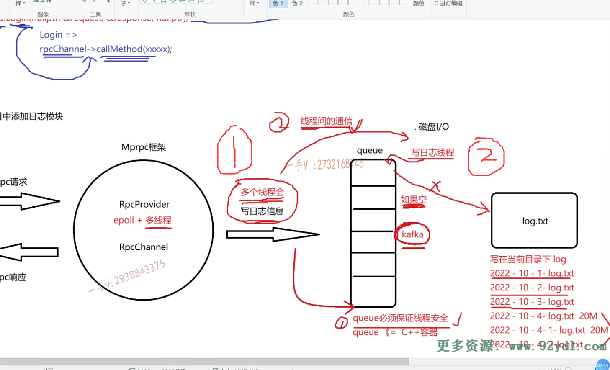
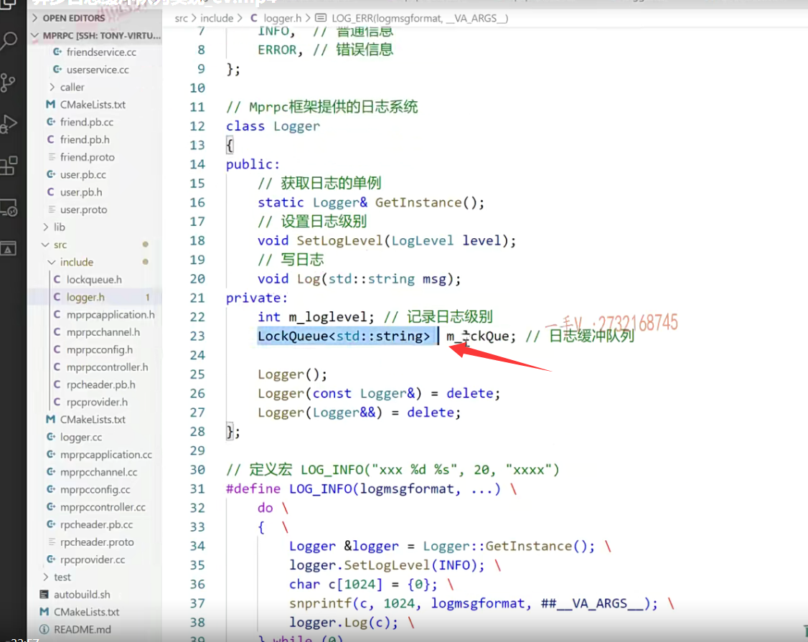

### 模板代码只能写在这个头文件当中了，不用创源文件

咱们这节课把这个日志队列的这个内容，我们写一下吧啊。这个log n点h。还没有生成它对应的CC文件是吧？

那我们生成一下啊。叫lock queue。点CC。好，包含一下include lock lock.queue点h。

这两个方法。呃，然后呢？

这个log queue里边的这个啊好，我在这。嗯no，这是我们用模板写的呀。

那模板写的就没办法分源文件了，是不是啊？

这是模板本身的问题C++基础课程，我们都讲过这些了。

这是我们所有文件呢，都是点儿h点儿CC，我们写顺了啊。

这是模板代码，模板代码只能写在这个头文件当中了，那我们就写吧啊，写到这儿。

==大家来看一下啊。在这儿pop。这个是push。==

## push()

入队从队尾入是吧啊？从队尾入呢？这个应该是问题不是很大了。

STD.先是lock_guard。啊STD mutex用一个类似于智能指针的这么一个lock guard的，它可以自动的加锁释放锁好吧嗯。

这个构造函数是传入 啊，传入锁就行了，它是按引用来接收的啊，你看构造lock析构自动unlock对吧？

然后在这里边就获取了这把互斥锁，然后往里边儿加东西啊，往里边儿加东西，

这个加东西queue本身是不是就是它的这个push方法呀？

data加完东西怎么样啊？加完东西。出函数右括号。是不是所自动就释放了？

### pop()

## 队列是空，你就等待

pop在这里边儿啊。大家看啊，那我们在这儿，

如果是empty的话。如果是queue是个empty的话。

那你说我们返回东西吧。别让返回了，别让它的逻辑继续向后了，

我们都说了嘛，写日志线程在这里边儿。就是pop就是出队，出队的时候呢，你没有的话，你就等着吧，等待。

队列是空，你就等待着就行了，对不对？

这里边儿用到了线程间的这么一个通信啊。就是呢，在这里边儿应该用while啊，防止线程的虚假唤醒。

这个队列，日志队列为空。为空怎么样啊？线程线程进入wait状态。wait状态啊，

实际上这个在这个数据库连接池的这个项目当中呢，也给大家。已经使用过了，这个互斥锁跟条件变量做的线程间的通信，

一个做的一个生产者，消费者模型嘛，是不是啊？

这个就是一个更简单版的啊，更简单版的。

那么，在这里边儿，大家注意一下啊。

呃，condition variable。在这儿在这儿回忆一下condition variable，这个条件变量啊。

条件变量默认构造，它里边儿有notify one通知，一个线程通知，所有等待在这个条件变量上的线程。条件成立了继续向下

wait，它需要一个unique_lock。

就主要就是这两个方法就行了。

那好了。在这儿我们看一下啊。这也需要一个unique_lock。

这是条件变量，需要的啊。这是unique_lock m_mutex。

如果队列是空。哎，如果队列在这里边儿是空的。

我们应该怎么做呢？我们应该在这里边就是进入wait状态。

并把你持有的锁释放了。

==因为这个入队跟出队用的是同一把锁吗？当然用同一把锁了，我们要实现这个队列的线程安全的，对吧？==

但是当我抢到锁的话，队列为空，我要进入等待状态，

那你此时你不释放锁。你进入等待创建了，别人也拿不到锁，也没法是不是入队啊？

### 条件变量本身的啊，进入这个wait状态，并把锁释放掉

==这就是条件变量本身的啊，进入这个wait状态，并把锁释放掉。==

这样一来呢，人家入队的这个线程就可以往队列里边儿是不是写信息了？写完信息以后。

哎，人家怎么样啊？人家在这个条件变量上去notify一下啊，notify一下。

在这里边儿，我觉得notify one就行了啊。为什么？

因为只有一个线程，在从队列里边儿取东西，然后写日志文件嘛，是不是啊？

==如果这里边儿有多个线程都在写日志文件，那你这一块儿的啊，业务这一块儿的这个工作线程往队列里边儿写日志信息的话，==

==你要notify all哦，把这儿所有写日志线程都唤醒去竞争一把锁。==

谁进入到锁的话，谁就去写日志文件好了吧啊，

你看这也就是非常简单的，非常简单的。

然后呢？这儿写了一条数据，这notify one啊，notify one，

然后呢？这就被唤醒了？唤醒了以后进入阻塞状态，（wait）

这儿出右括号儿，把锁释放掉这儿。(push右括号)

抢到锁，那就继续转诶，一看while不为空了，不为空的话，那就怎么样啊？

### 取出数据返回，释放锁

data=m杠queue点top。唉，不是top啊，是front对吧啊？front对头元素。

然后呢m杠queue 出队并把这个data。返回回去对着没有啊，并把这个data返回回。

然后出了右括号呢。锁自动释放。

好的吧啊，那你看这个实现异步写日志的这个日志队列应该是非常简单的，对不对啊？

呃，虽然简单实现了一个线程间的这个互斥，还有通信的操作。

push谁调的呢？在这里边儿就是我们框架的这个工作线程调的是不是啊？

而这个pop就是我们专门的写日志线程表好不好？区分清楚啊，区分清楚。

这个push多个工作，多个worker线程都会写日志queue。

目前是只有一个线程。在读日志queue。然后写日志文件。对不对的

## 编译一下，解决错误

OK？那么在这里边我们完了啊完了。

写完了，编译一下。哦，这里边有什么东西呀？有错误啊，有错误log点h41行log点h的41行，我们看41行

哦，这里边儿。这里边儿我们是end of.

嗯，我们这里边儿有什么问题吗？大家看不到，有什么问题所在，跟上边儿这个应该没啥关系啊。

### 不能将一个局部变量的引用返回去

呃，就是这一个问题是吧？哎呦，这儿还有啊。还有就是lockqueue.h

我们瞧一瞧。在pop这里。返回了一个m_queue呢，m_queue本身就是用t类型。我们看看它的这个front。front返回的是一个数据的这个引用是吧？

这意思是把一个哦，这意思是把一个局部变量的引用返回去。

那确实是，所以这个pop呢？

不应该返回一个引用，应该返回一个值，

因为这值呢，都是局部变量，记录着的是吧？

我们一个错误，一个错误去给它处理掉。

### 没看出什么错误，用到再改

呃，那就剩这么一个了，这是一个警告。这是一个警告log点h。42行啊。

啊，这个好像没看出来。错误是吧？没看出来有什么错误。

好，我们先用吧，用的时候到时候看出什么错误的话，我们再改好吧啊。

行，那我们先测试一下啊，测试一下。

拿一个可执行文件example里边。

我在这个。什么里边在这个callee里边啊？呃，callee边儿，我先测试一下。

写一个日志文件啊，

写一个日志。写日志只需要包含我们的这个什么就可以了。logger点h就可以了是吧？

## 测试一下 日志功能

哎，人家提供了相应的宏。会给我们写东西的。来测试一下啊。

这个是log什么log info？对不对哎？我们好像写日志的时候还没有去区分这些level呢，对不对？first log.message log error.

这个是百分之s。百分之。s百分之d。记录一下这个日志信息。

这个哪个源文件的哪一个函数？还有行号对不对？

那么，这非常方便的进行一个记录啊。

### 多加了一个大括号

expected a primary expression before

.哦，这是我们的这个log点h。看看啊。哦，这为什么给这儿又加了一个大括号，这个应该是最开始生成代码的时候它出的。

好了吧，重新编译。这都是一个警告，是不是？先不管了，我先执行一下。

在这个bin目录执行一下，这个provider啊。pro杠I test conf。

这是正常启动关闭，我看这个日志有没有？

还有呢，你看二零二零杠四杠六对吧？cat二零二零杠四杠六。

### 这个时分秒好像不太正确

哎呦，这个时分秒好像不太正确啊。

first log message.

这又是分秒这个文件。

### 是不是啊？都打印到一行上去

在main函数44行，是不是啊？诶，看来我们这个。这个消息日志消息都打印到一行上去了，是不是啊？都打印到一行上去了。

所以我们在记录日志的时候呢，可以在这儿呢。啊，

把这个什么呀？把这个杠n 回车我们加上啊，

我觉得这样比较啰嗦啊。

#### 再添加一个杠n

所以实际上我们自己可以把这个写进去啊。我们自己可以写进去，

这个读的是个什么呀？这读的是一个message。

然后给message的这个末尾再添加一个append嘛。它可以要一个字符串，是不是再添加一个杠n？

#### echo 空

这个就可以了吧？好了echo 空啊，给这个二零二零四。也没有了，

我重新运行一下啊。重新运行一下。OK,cat.啊，这日志信息呢？现在是怎么样？现在是可以记录了，对吧啊？可以记录，

啊，这个时分秒没有问题啊，没有问题，大家可以自己去运行一下啊，大家可以自己去。

看错了啊，我今天录视频。比较晚啊，这个时间是正确的啊，时间是正确的。

好那么这个日志这一块儿呢，那就没什么没有什么问题了吧啊，没有什么问题了啊。

你可以根据我们的这个已有的代码啊，你想怎么样去打印日志？随便啊，

随便怎么去修改代码了啊？

呃，那既然到这儿的话呢，我们就可以怎么样了？

我们就可以把这个日志集成到我们的系统当中了。啊，怎么集成呢？集成的方式呢，

就是这个样子的。

你看我给大家举一个例子啊。

就比如说我们框架里边的rpc provider。我们这里边就是包含log点h。对不对啊？包含这个log点h。

==（算了不包含到这里，这步取消）==

然后在这里边儿。

包含到这个什么文件啊？源文件当中好吧。

你比如说这里边儿，你到处任意的地方，你都可以打印这个日志啊，

比如说你注册的这个什么？呃，服务名字跟方法名字，

你不想把它打印到实际上，你不要打印到控制台上，打印到控制台上的信息，没有任何用处。

你打印多了又不好找，对不对？这这个不属于错误信息，你就打印这个loginfo就行了。

好吧啊，在这里边儿，你可以打印service。百分之s啊，然后是一个service。name就诸如这样。

然后这儿也可以换一下啊。measure的name。method name把它打印到日志上。

啊，这一看，这是个日志消息。好的吧啊，这是一个日志消息。

这个搞清楚啊，搞清楚。

### 跟这个日志的级别关联上

然后呢啊，在这里边儿，我们最后添加一个就是在写日志的时候啊。

我们是这样吧啊，这是再添加一个相应的百分之s。添加一个相应的一个东西啊。指向负百分之s。

就你这是一个普通的info信息，还是error信息。

要错误信息的话，一般定位错误就打开日志文件，我直接搜error这个关键字儿就可以了。是不是啊？搜error这个关键字儿就可以了。

还缺少一个参数啊。缺少谁呢？就是缺少m杠log level吧。

就不能去提示代码，很头疼啊。等于这个。英文儿啊，

这目前的这个log level，你是。我就打印这个。否则的话，我就打印什么？对着呢吧诶，这不是逗号啊。这是个冒号。

好吧嗯，这就是日志呢，有一个跟这个日志的级别关联上了啊，关联上了。

## 重新再编译一下,解决错误

好，重新再编译一下啊。哇，这里边儿怎么现在出现这么多的这个？

警告全部是警告啊format百分。来argument of char星。

嗯，log点h37行啊。

看看我们的37行。这个是肯定在哪里展开的时候出现问题了啊？

嗯，我们把这个问题解决解决吧，这么多警告看起来难受死了啊，难受死了。

### string转char *

这是在使用的时候啊。sorry是name哦。这都是string是吧？

这需要调用c杠STR。转成char* 。

好了，没问题了啊，就剩logn点h。这个42行的这个。

这块的这个问题啊。这一块儿总是在报这么一个错误。这个警告啊，这个警告。

看着我们代码是没有什么问题的啊。刚才验证功能的时候也没有啥问题。

行，那我们日志的这个处理测试就到这儿吧啊。

所以写日志也能写进去是吧啊？

## 总结

好，那这节课的内容我们就给大家说到这里啊，日志模块儿的内容就到这儿了，日志这一块儿大家把我们给项目画的这个日志的框架啊里边涉及的内容，

里边我们涉及的这个两个类，一个是log这么一个日志类，

还有log底层。依赖的这么一个日志的缓冲队列，这两个类的功能啊。

给它搞明白就可以了，我们封装了两个宏，为了简单的让大家去使用。

OK吧，你像后边儿这块儿呢？

这儿也都可以写到日志里边。

这儿像错误信息都可以写到日志里边，

不是都可以理应应该写到日志上的好不好？不应该打到工制台上。

呃，写到日志上，有时间。有标识，有level对吧啊？info或者是error。

这要比打到控制台上呢，更有实际意义一些，而且也方便以后出问题查看

那这块儿距离我就不再改了好吧啊呃，日志模块儿已经输出完了，

大家可以更改一下。

实际上，我们写的这个日志模块啊。嗯，不仅仅给我们这个系统用的。啊，任何系统都可以使用我们现在开发的。

好的吧行，那这节课的内容我们就给大家说到这。