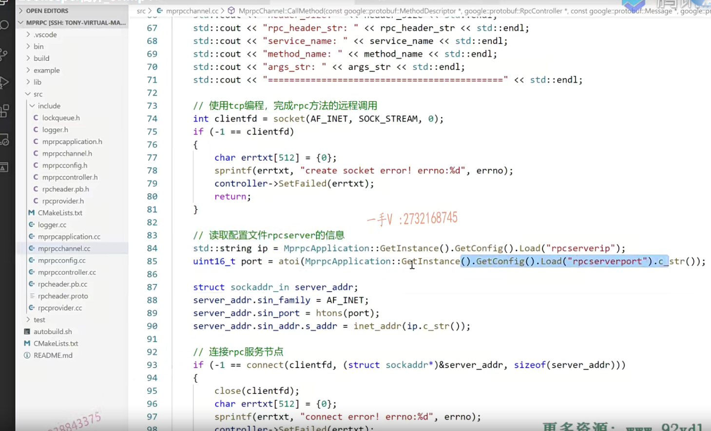

从这节课开始呢，我们给大家呢讲解一下这个zookeeper啊。也简称是zk。

那么zookeeper是个什么东西呢啊？

它的名字叫做分布式协调服务。

从名词来看呢，也就是说它主要用于这个分布式这个环境当中啊。

我们分布式环境当中呢？我们现在写的mpr PC，这个分布式网络通信情况下，

我们为什么需要做zookeeper zk呢？

那么，同学们，我们之前在测试的时候呢？

啊，我发起一个rpc的这个请求，我需要知道。

我发起一个rpc请求。在我们框架里边儿呢。我们这个channel是直接知道它所请求的rpc服务是不是在哪一台机器上啊？

但实际上并不是的。啊，为什么呢？

我们说呢，这个服务都是独单独部署的，对吧啊？

这个rpc节点都是对等的。地位都是相同的。

当他想去使用一个rpc服务的时候，它实际上并不知道这个rpc服务在哪一台机器上运行的。

所以我们在分布式环境中需要一个所谓的服务配置中心啊，

什么叫服务配置中心呢？也就是说呢，整个分布式这个网络系统中，所有提供rpc服务的这个节点呢，都会向配置中心注册一下。

啊，注册一下一个服务就是我这个IP地址，这个端口号吧，

我提供什么什么名字的服务？

那么，当我们想一个rpc节点，想去调用一个rpc服务的时候，我们去配置中心去查找一下就可以了。

好吧啊，去查找一下我想调用的这个服务在哪一台主机的IP在哪一个IP地址端口号的这个主机上？是不是哎，

我就可以发起呢rpc的远程调用了啊，就是这么简单。

但是呢，我这么一解释，也就是说呢，我们在分布式环境中需要支持这个rpc的这个网络通信，我们需要一个分布式环境中的一个服务配置中心，对吧啊？

那并不是说zookeeper就只做服务配置中心好吧，

它实际上呢？有很多功能的，这不是说了吗？

==分布式协调。==

那分布式环境中有那么多分布式节点？

啊，每个人做自己的事情，那有一些事情是需要共同去做的，是需要协调的，并不是说你们单独自己做自己的就可以的是吧啊，

这些协调的意思，我们要协调一下。

### zookeeper另外一个非常重要的功能就是它提供一个分布式的锁

举个很简单的例子啊，就zookeeper另外一个非常重要的功能就是它提供一个分布式的锁。

锁，大家都不陌生了。锁干什么用呢？

啊，在同一个进程里边儿线程间是不是进行互斥用呢？

同一个进程里边儿有很多线程。去执行一段临界区代码，对一个临界区代码当中，能不能让多个线程同时执行啊？不行那怎么办呢？

啊，你不控制线程，那线程就很有可能多个线程，同时是不是进去这个临界区代码段了？

所以我们对于临界区代码端需要用锁来控制啊，线程的这个进入每次临界区代码端只能有一个线程来接入。

那么，假如现在呢？我们是一个分布式系统。

呃，两个这个服务分别运行在两台机器上。

这两台机器要竞争一个资源，这个资源是不能够同时让两个rpc节点去访问的。

能明白吧，此时我们所谓的这个普通锁什么互斥锁呀，读写锁啊，自选锁这些东西还能用吗？

这些东西用不了。这些东西是在同一个进程里边儿控制线程的。

那现在rpc节点都运行在不同的机器上，在一个分布式环境中，我们要协调对吧，

不同的rpc节点不能共同去访问一个共享资源，一次只能有一个人访问，我们需要一把分布式锁。对不对诶？

zookeeper也提供了这个功能。

包括它的这个主备这个集群的这个服务切换啊啊

zookeeper它是一个分布式协调服务它。

它并不是说只能做一件事情。

基本上来说，我们搭建的分布式环境，一个一个的rpc节点，整体组成一套服务系统的话呢。

每一个节点可以部署一份儿，或者是部署多份儿，

那我们之前说了，就看这个服务对于CPU的硬件资源啊。内存资源或者网络IO资源啊。那么，以及对它的这个并发的这个要求，你可以部署一份儿或者部署多份，对不对啊？

那么大家部署在不同的分布式节点。我们都要去。嗯，又不是多都要去啊，

就是有可能去做一些呢。我们的什么操作呢？

就是之间需要协调的这些操作啊啊，分布式环境中可能出现的一些问题呢啊。

我们zookeeper呢，都可以提供相应的一些协调功能。明白吧啊，协调功能，

所以叫分布式协调服务。

它这个名字也很有意思啊，大家可以把分布式里边儿的一些节点呢，想象成动物园儿的各种各样的动物。哎，这个rpc节点呢，就是猫那个rpc节点就是狗，再来一个rpc节点就是老虎，再来一个rpc节点就是。哎，这些动物呢，共同组成了这个动物园的各种各样的，是不是景观啊？是吧啊，

那动物之间要不要协调啊？肯定要协调嘛。是不是啊？

你不能让狮子跑到羊群里边儿去啊？

啊，那羊就遭殃了。对不对啊？

这同样的道理，动物园儿有那么多的这个动物就跟我们分布式环境有那么多的分布式节点一样。

节点是需要协调，需要控制。呃，所以呢，叫zookeeper动物管理员儿。哎，

动物管理员儿，

那么这个动物管理员儿就是管理各种各样的动物的，动物之间的一些协调工作呢，管理员儿都可以搞。对不对？

不管是喂食，投食还是协调，它们之间不能被吃掉，还是说是各种各样的这个动物之间的协调。

诶zookeeper动物管理员都可以做同样的。

啊zk在分布式环境中，并不是说只能做我们在这里边儿所说的服务配置。

它还可以全局的名字，这个配置中心啊，这个分布式锁。它的功能都有。好吧啊，

大家呢，在对于zk的更多的一些了解呢，大家可以在互联网上去查一下。

这个是很多的好不好啊？

我们在这里边儿这个项目上使用zk呢，主要就是用它的这个分布式环境中什么协调服务啊，

对，就是一个基于服务配置中心的这么一个协调功能。

### 第一个问题

这么一点，这是我们说的第一个问题，简单的给大家去介绍了一下，zookeeper啊，为什么我们分布式环境中需要它对吧啊，以及它啊，

我们说起它就能想到的一些它的功能啊。一会儿我给大家要推荐一个这么一个原理及介绍这么一个网页啊，我觉得写的非常简单呃，

但是呢，也很明显的说明了zk的这个必要性对吧？

它是属于一个初级认识zK的这么一个帖子啊。

大家我一会儿给大家来介绍，这是说的第一个问题啊，就是告诉大家zk是一个什么东西，以及在我们这个项目中啊，我们为什么要用它。好吧OK，

### 第二个问题

第二个问题，我要说的就是。那大家在我的这个课堂上啊。去学了啊。啊，学了一些项目，也写了一些东西啊，也掌握了一些软件设计呀，以及服务器中间件的一些使用。

那么或者是同学们自己去挖，自己在其他地方。或者说是git HUB上自己去挖的一些这个开源的一些东西，

呃，自己做输出项目，它总会有这么一个问题。

哎，老师，我的这个项目中用数据库了。不管是mysql或者mongo db，

或者说是一些缓存式数据库，比如说red is。是不是我这个项目用了这些东西啊？我就必须得把它搞清楚，把把它挖完。啊，把它挖到这个挖到底，把它掌握的精通，我才敢往这个简历上写啊。

同学们，并不是的啊，实际上退一万步来说，当大家去公司以后，你会发现啊，

99%的这个时间你都是在用它。

实际上，你用它的时候，你只要把它用熟就行。

啊，它底层的这个原理，你真的有时间去搞定它吗？或者说是我不懂它的原理是不是大部分的工作都做不了呢？实际上并不是这样的。并不是这样的啊。

那么，如果一个服务器中间件对吧？我们要用它来解决问题，还需要把它的内部原理吃的非常透的话。

那我相信这个服务器中间件是很少有人会用。因为用它的成本太大。对不对啊？

我要用一个mysql哎，我必须把mysql的源码读一下。

啊，我必须知道它这个表是怎么设计的？它的表是怎么存储的？它的b加树结构是怎么样子的？它的索引这个缓存是怎么存储的？对吧，它的事务处理是怎么做的啊？它怎么去这个维护的这个事物的这个隔离级别的？

我的天呐，如果一个mysql要用一个mysql的话，

我需要去了解mysql这么多东西，我相信mysql绝对不会像现在这么流行的。是的吧，因为用它的成本也太大了。

这个我项目中。我对我项目进行压测，然后发现呢啊，整个儿项目的这个瓶颈已经不在我业务的这个瓶颈上了，而是瓶颈在于这个数据库啊。

我甚至对于数据库呢，我的mysql数据库进行了这个集群的部署，进行读写分离了啊，读写分离了以后我发现我的这个某些应用呢，访问数据库访问，访问的比较多，对吧啊？

还是会产生很多的这个磁盘IO。是服务器的瓶颈呢。啊，这个卡在数据库的访问上啊，所以它引入了一个redis。啊好，我现在又用redis。

我明知道它就是存k value。啊，但是我不敢用，为什么呢？

因为我们同学的思维就是我得先把redis的源码读一下。

我得把它的原理搞清楚。

我得知道redis的底层的这个数据结构啊，用到了这个跳跃表，为什么不用红黑树？是不是为什么它跟我们其他的像memory cash比起来，它又可以存这个普通的数据又可以存列表，又可以存集合，又可以存映射表，它为什么那么强大？

啊，还有redis底层呢，为什么它支持这个发布订阅的这个消息队列啊，

可以做这个服务器中间件进行这个消息的分发啊，

为什么我还得把它的通过源码去了解一下啊，然后呢，我还得知道redis是怎么样支持事物的。那么，同样的啊red is的使用，如果我们要涉及这么多东西的话，我相信redis也不会像现在这么流行。

就像我们在写这个框架的时候，当我们去用这个框架的时候，我不断的强调一个问题，就是你这个框架使用的越简单越好。好吧okay，那到我总结的这个时候了，也就是我刚费了半天的这个时间啊。

给大家说了那么多的意思是什么？我相信大家应该也听出来了。

我们学校一是为了提高自己的一个知识的综合应用能力，见识一下我们在公司里边儿可能会再开发一个服务器类项目的话。可能会用到什么东西，对吧啊？

这是增长了大家的见识，同样的，当我们去输出项目的时候呢，也真真正正的锻炼大家的实践能力了。

但是呢，我们最终面临的一个问题就是我们不把这个项目的这个内容呢，要写到简历上。

而我写简历上的话，这个面试官就会问。但是我要把这个项目写的太简单了的话。人家面试官没得问。是不是啊？没得问。哎，都不知道该问我们些什么东西，或者说我们把简历递上去了，以后呢，人家收到全国各地的各种人的这个简历当我们在简历筛选的时候，由于我害怕面试官提问我问题，所以我把这个只有我精通的，

我可能那那么一点儿的项目，相关的东西我写到简历上，最终导致我的简历啊，筛选都筛选，不过因为项目呈现出来的内容过于简单了。

啊，我写复杂的东西，比如我这个项目中又用到了什么网络库啊，又设用到了什么高级的软件架构啊，又用到了什么数据库啊redis呀，甚至zk呀。

啊，那么protobuffer json啊，这些等等这些东西哎，

## 面试经验

同学们就有一个问题，老师是不是我往简历上写的，尤其是项目这一块儿，我写的东西必须都得把它搞精通啊。同学们，这个问题呢？

你想的太极端了，大可不必。

首先在这里边儿，我要澄清几点啊。

第一点就是不管我们在简历上的这个个人技能描述这一栏，还是项目这一栏？

不是说所有的内容我们都得去精通，

你写个人技能描述的时候你都有这么几个词儿嘛？精通熟练掌握它代表不同的知识的不同的掌握程度嘛。对不对？

一个人的精力是有限的，我不可能用的，不可能用东西的时候都会把它的这个原理搞清楚。呃，很极端的，你用WINDOWS的时候，或者是你用linux的时候，刚开始用的时候，你有没有把人的源码先读一遍，然后再去用它呀？不可能的事，这有违背常理嘛。

好了吧啊，所以呢，那如果说我把项目涉及的那么多的东西，我写到简历上的话，那首先呢，这是一个非常有加分儿项的东西，因为你用了很多。对吧呃，就证明呢？就整个儿服务器的这个生态框架所能用到的这个技术呢，

你脑子里边儿这个生态是比较全的。不会说你只会一门儿编程语言，你只会简单的TCP udp网络编程啊，

然后你就啥也不会了。是不是那你进公司以后可没人整天给你讲来讲去给你上课啊？是直接让你去做东西，它当然是希望你的知识广度也好，深度也好，那就是最完美的。

所以呢，当我们把这个涉及的面比较多的这个内容呢，写到简历上，这是非常有必要的。

对吧，但是写上以后面试官在问我的时候，同学们这就看你自己的一个描述了。

那你比如说这个项目，那这个项目我相信对于大家来说呢？

嗯，其实不仅仅是这个项目，还有其他的项目啊，

对于一个项目，你对它的这个核心掌握肯定是其中的一部分。

另外一部分是我为了完成某某功能。而引入的比如说我现在给大家说的zk。

zk之所以引到我们这个分布式网络通信框架中，是因为我们网络通信框架支持的rpc通信必须得在一个地方去找到我现在想调用的这个rpc服务到底在哪一台机器上？

我需要在分布式环境中呢，需要一个服务配置中心来记录呢，这个分布式节点上所有发布rpc服务的主机IP地址跟端口号。

但是呢，不能说zk在我这个项目中啊，用到了这个呃，在我这个项目中用到了它的这个服务配置中心的这个功能，

你就理解成zk就是服务配置中心，服务配置中心就指就是zk这个理解就太肤浅了。

啊，通过我的讲解，你应该知道呢zk它有很多功能，

而在我这个项目上，我用它的什么功能，我为什么要用它这个功能？

实际上呢，你把zk在你这个项目中啊，为什么引入以及它在你项目中解决的什么问题啊，我遇见什么问题了，然后我需要zk它帮我解决了什么问题。

实际上，这个给人家讲清楚就行了。

当然，对于你的知识面来说，你知道zk它可以处理还可以处理其他问题，对吧啊？

比如说主被备调换，比如说这个分布式环境中的这个分布式锁。

啊，你知道这些东西，但是呢，你可以完全告诉人家啊，我项目中没有用到它相应的功能，所以我也没有去深入的去研究它。

啊，这就完全的OK的，人家问你问题也肯定也是有侧重点的，

当你去掌握的时候，你可以深入的去挖它。

对吧，当你不是很熟悉的时候，你可以把你涉及的这个知识的这个广泛的那一些东西啊，就是是知识的广度呢，可以你知道什么给面试官去阐述什么？

好吧，不要觉得人家问什么我都得必须得会啊，必须得这个深入的掌握，

对不对？那你就把面试呢看成太极端的这么一种，看的太极端了啊，这是完全是个人的沟通上的一些问题。好不好？

你不要把面试想的太完美，所有的问题你都能100%回答出来，这是不可能的事情。我用到数据库，我为什么要用到数据库？是不是啊？

这个因为我这个项目怎么怎么样，用到了数据库的什么什么功能？

啊，我没有数据库是不行。对吧，

那当然，我知道数据库它还有其他什么什么功能，但是在这个项目中我并没有使用到啊。我对它的了解，这个限于什么？啊，

但是呢，由于我项目中没有用到，所以对它的这些功能呢，我没有进行深入的研究。

呃，或者说是，但是我觉得它们应该是怎么样，用在哪里的？发表你的意见。

啊去说你能说的东西好吧。

我们没有说是任何东西呢，我们用的时候都得把它的原理先搞清楚。好不好啊？这是我们为什么要在这节课给大家说这个东西呢啊？就是我们很多同学。写了这个项目以后呢，在面试的时候呢？

啊，实际上呢，面试的时候他心里边儿总有这么一个坎儿，过不去，

就是我写到简历上的东西，是不是我一定得掌握它这个底层原理。

同学们，你想是不是啊？对我印象深刻的就是有一个我们一个女学员，一个女同学啊。那么真的是一个非常良好的沟通。

它的项目中用到了一个它的项目中用到了这个数据库啊，随后呢，就了解到这个数据库的这个索引了。啊，人家就问索引底层的数据结构，这个b加树你能不能给我讲一下？啊，

我们很多同学就说，哎呀，人家让我讲索引的b加树结构，我不知道啊。

那我就直接给面试官说，我不知道吧啊，不好意思，我不知道。

这就是我们大部分普通的同学。你觉得这个沟通人家问你，你说不知道，人家问问你，你说不知道，

那当然了，你自己都觉得不好意思，脸会红。是吧，

那你为什么不想一想沟通的策略，沟通的方式呢？

大家在面试的面试的时候啊，之前一定除了学知识，一定要多看一看一些面经面试经验啊。沟通是非常重要，非常重要。

整个面试100%分之40是你的技术能力，连一半儿都占不到，另外40%就是你的沟通，沟通跟技术同等重要。

你不要觉得你的技术呢，很OK啊。我说不说，我就现场展示现场的笔试面试时间非常有限，对吧啊？

这个在那种环境中呢？不仅仅是你自己掌握的这个能力啊。别人是无法在短时间内直接看透你，那很多的时候都是通过你的表述，通过你对这个技术逻辑的一个阐释。

人家才对这个孩子对于这个技术掌握的怎么怎么样？

对吧，还有我们那位女同学。呃，您好，我不知道啊b加数。

但是呢，要为什么呢？因为我在做项目的时候啊，我没有接触过b加树。

或者说是因为我项目中呃，我的表涉及的比较少啊，对于某一个字段，我查询的比较多项目是你自己写的，你当然熟悉了。

所以呢，对于这个字段建索引我的理解是，它可以非常快的呢。啊，提高这个字段作为判断条件的sql的一个查询的效率，是不是这是索引本身做的事情了？

这句话说了啊。那其其实呢，说了跟没说一样，但是我表述了对不对，

我都是在铺垫呢，这个b加树我不知道的这件事实，

但是我要说更多的东西啊。那但是我项目中啊，什么什么地方，我用到了红黑树啊，对于红黑树呢，我是了解的非常清楚的，因为我在这个项目中用到了。

啊，然后红黑树怎么怎么样怎么怎么样，或者说是你提前给人家说一下，就是说呢，虽然我不知道b加树是什么样子，但是我这个项目中的红黑树。啊，也是非常重要的，在我的这个项目设计中，您看能不能让我把红黑树给您说一下？沟通沟通。

你要不断的去面试啊，给自己积累一些面试经验，面试的一些套路其实也并不是说说这个套路就是个不好的地方。

就是说别人也不是你肚子里边儿的蛔虫，他不知道你的技术点到底硬在哪里，

你得通过啊，你得通过良好的沟通去不断的去体现出啊，你精通哪里？

深刻的掌握到哪里？对于哪些东西是非常熟练的？

对于哪些内容呢？是有所欠缺的，这个你得表述出来。

啊，不能说呢，人家面人家这场面试面试到问到我这个掌握的掌握的好的东西的时候，就是我运气好。

啊，问到我掌握的不好的东西的时候，就我运气不好。啊，一切都归结于运气，

实际上不是。

所有你认为运气不好的地方，实际上都可以通过良好的沟通，哎，良好的沟通去展示你好的地方。好吧啊，

那么这节课呢？我们没有讲一些实际性的东西，但是呢，我给大家说了一个大家。甚至是没没有面试过的啊，就是有很少有这个面试经验的这些同学。

==当我们再去写简历，写一些深刻的东西的时候，写一些这个呃，我用的感觉用的函数在我项目当中，但是你要让我去讲它的原理的话，我可能讲的比较少。==

==那首先呢，首先围绕着这个项目，你一定要搞清楚你在这个项目里边儿为什么要用它。==

==用它的好处是什么？它还有什么其他功能？对吧呃，能够认识到这一点，==

那就完全OK了，

怎么说我刚才已经告诉你答案了？对吧啊，当然了，你在面试了以后呢？

呃，面试之前你觉得啊你想嗯。呃，你其他内容都掌握的嗯。OK了，

很不错了啊，那你有时间的话，你可以把你。

比如说这个zk，其他的这个部分的功能呢，你可以深入的去再去研究研究啊，这都是可以的，或者说是我也不知道研究哪一方面，但是呢？

经过我最近的一两次一两一两次面试，人家好像都在问我zk的分布式锁，那么也就告诉你了zk的分布式锁呢？是大家都很关心的，那你就去研究研究嘛。看一看嘛，

这就是一场面试呢，对你带来的一些经验。对吧啊，经过上两三场面试，

那么你简历上所涉及的所有内容，你就知道它的重点在哪里。

好吧，你也就知道当人家问这个问题的时候呢，我的侧重点该怎么说了？

好吧啊，那么这节课呢，虽然没有讲具体的一些知识，但是呢，我觉得告诉了大家非常重要的一件事情就是。

不要死学习啊，不要死学习，学成书呆子。

我说了一定了。啊，沟通和你的技术能力在面试中是。

沟通我说了，绝对不是说人家问，你知道我就说不知道，我就说不知道啊，沟通永远没有这么简单。是不是沟通要是都这么简单的话，那么我们大家拿到offer，绝对是拿到offer的好坏，跟你的技术能力成正比。

但实际上，并不是这个样子，绝对不是说学的最好的同学，他的offer就是最好的。学的最差的同学拿到offer就是最差的。

根本就不是这样，很多时候是反过来的。大家想一想，完全就长在这个临床的沟通上。非常重要好吧啊。

## 总结

行，这节课呢？能听我唠叨完的，我觉得呢，你一定会get到一些面试经验，面试这个心得的好吧，

这个是除知识以外呢。也是非常重要的东西，

我希望呢，我这节课的所说的内容能够给大家一些启发啊。

尤其呢，是在面试的时候呢，对于自己个人简历上一些比较难的啊，晦涩的，甚至自己没有准备充分的这些内容。

我们该以怎么样的态度，怎么样的姿态啊？怎么样的沟通方式去回答这些问题而？不会知不会说，知不知道不知道三个字儿，对吧？

这样的沟通的这个反馈啊，对于面试官的反馈是非常差的。啊，非常差的一问三不知。

对不对啊？你虽然不知道你把相关的。你所能知道的。你给人家面试官引出来嘛，对不对？两个人的沟通不是说面试官就牵着你的鼻子走，对吧啊？人家要牵着你的鼻子走，人家问的都是人家熟悉的领域。你能熟悉吗？怎么可能呢？

对不对啊？好希望给大家呢，能够有很多的一些启发啊。

这个那么这节课我们就给大家说到这里下节课呢，我们给大家讲zK，在我们这个项目中所需要大家了解的一些内容。