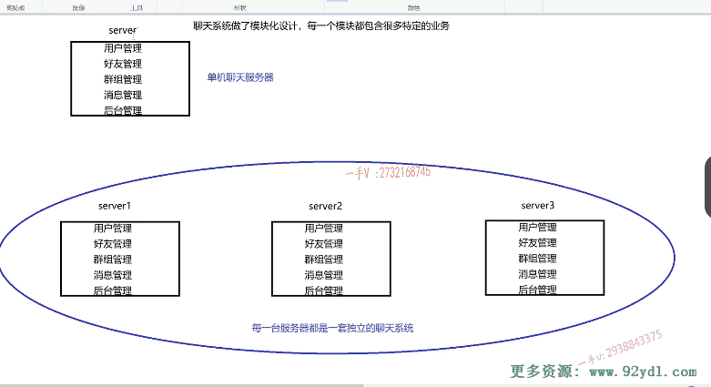
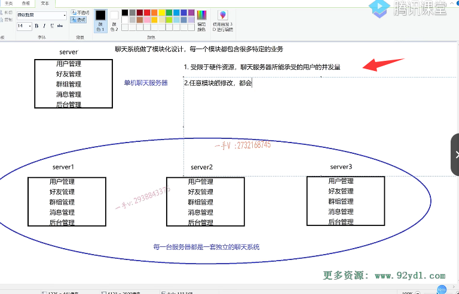
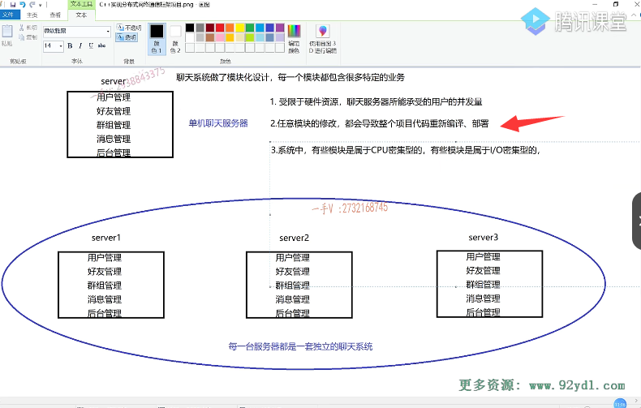
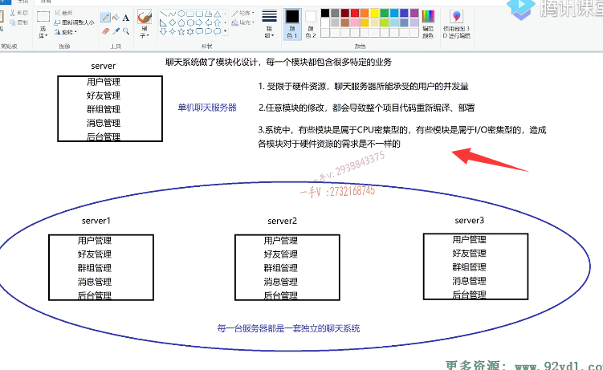
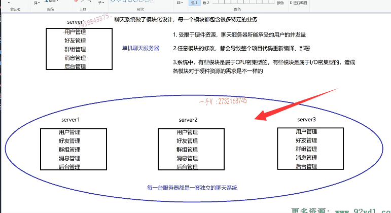

# 理论讲解01

这节课呢，我们就正式进入这个用CA加实现的这个分布式网络通信。通信框架项目的这个学习了啊。我们这一节课的这个任务是给大家呢去讲一讲啊，这个集群和分布式的一些原理性的东西。实际上啊，集群跟分布式这样的概念啊。已经不算新概念了，这些概念词汇呢，出现的时间已经比较长了。相信大家呢，在网上啊，到处都可以查到集群。和分布式相关的一些。资料讲解啊。

但是呢，我不喜欢太理论化的讲解。好，我觉得大家呢也。不是非常喜欢。理论性非常强强的这种讲解啊。因为这种讲解看起来是很舒服，看起来很理性化，看起来很高大上啊。看看起来很有段位，但是对于我们个人来说，看完了以后，我只能给你点个赞，对于我们个人来说。可能并不会理解多少东西啊，

过个一两天，人家那些看起来非常高大上的文字儿，在我们脑子里边根本就。所以我觉得呢，我们还是得从一个实践的一个东西呢，去给大家去讲解一下集群跟分布式。它具体都有哪些优缺点？好吧啊，我们来做一个详细的一个对比。我们为什么从单机服务器到集群的还不能解决我们的问题呢？我们现在还要去分布式。甚至去做微服务。对吧，为什么？不要去讲大段理论性的东西，

对吧？我觉得你没有一个很好的一个实践的话，让你去讲深刻的理论东西呢。你肯定也讲不了多少的啊。好那么。希望通过这一节课的这个讲解啊。呃，大家在去探论集群跟分布式的时候呢，脑子里边就有一些可以参考的东西了啊。

好，首先呢，把你的目光啊切到这张图上。这张图呢，我大。我给大家画了一些。

简单的东西啊，力求简单来讲解复杂的。它的内容大家把目光切换到我们之前的所写的这个集群了解。服务器项目上啊，在集群聊天服务器。这个集群之前呢？我们是也是先写这个单机的，这个聊天服务器。来，我给大家简单的去介绍一下这些图以及文字儿所代表的意思。这第一行呢，就代表这是一个框，代表一个单机的聊天服务器啊，这个服务器的名字叫server好吧？它里边儿呢，

我们聊天系统啊，做了模块儿化设计啊。就是它有用户管理模块有。好友啊，就是负责用户之间的好友关系的，还有群组啊。这个用户所处的哪个群，哪个人在哪个群里边儿？是不是还有消息啊？大家在聊天儿，一对一聊天儿，还有。群聊还有一些后台管理，比如说。说呢，

我们后台的管理员可以登录这个聊天儿服务器对大家进行一些推送，发一些公告，对吧啊？那么暂且呢，我们用这个用户管理好友，管理群组，管理消息管理以及后台管理，这五个管理模块儿。来构成我们整个的这个聊天服务器每一个模块都包含了很多特定的业务。我们先做一个假设啊，先做一个业务的假设那。相当于就是一个项目的实践，大家在理解一些。呃，

概念的时候呢，就有参照物了啊，就比较。这个好理解了。

那么，什么叫特定的业务呢？你比如说用户管理，用户管理，有用户登录啊。啊，这个登陆呢，大家在脑子里头想象啊。啊，这个登录就代表了一个方法，一个方法专门来做登录logan用户的注册啊register用户的这个注销登出logan out。

是不是哎，好友管理好友管理这里边儿对应的特定的业务就是哎，我加了一个好友，我删除了一个好友啊。群组管理我加群了，我创建群了，是不是我从群里边儿踢人了啊？像这样的一些特定的业务呢，都对应了一个。一个或者是几个相关的一些函数啊。那么，消息管理有离线消息，有一对一的聊天消息，有群聊的消息，对吧？

哎，这就是一个模块儿。包含了很多特定的业务，但。大家暂且把这个业务想象成一个，或者对应几个完成这个业务的相关的函数啊，后台管理。对吧，有一些比如说我们发布一些呃。呃，广播消息呀啊，发一些后台的一个公告消息呀，是不是组织一些活动的一些消息啊？好

# 单机聊天服务器

看，这个单机的聊天服务器。

哦，我先问大家一个问题。请大家说一说。如果呢，我写了一个单机版的聊天服务器，我。针对这个单机版的这个聊天服务器，==如果让你提出它的一些性能或者设计上的一些。瓶颈所在，你打算说哪些==？大家能学习这个项目，相信已经不是说是一个小白了啊。你最起码啊。已经在我的课堂上做了两三个项目，尤其是这种集群的聊天儿项目，

如果你。仔细的跟着我的课程，做完以后呢，我相信你现在对于服务器类的这个项目的这个理解。已经是比普通人要高很多了。那么，当我在问这个问题的时候呢，你的脑子里边儿能反映出来哪些东西？哎，有些同学很快就说了啊，因为它是基于这个聊天儿项目的启发。

## 硬件资源

是不是啊？什么呢？就是。受限于这个硬件资源。

因为你只有一台服务器嘛，单机的嘛，是不是啊？这个啊，聊天服务器这个所能所能承受的啊。从这个用户的并发量。这是受限的。对不对啊？这是属性。那么，如果我用32位linux呢来作为一个聊天儿服务器的话。是不是啊？你给一个进程啊啊。把资源开满，也就是说你一个32位linux的这个聊天儿服务器，

你最多也就是支持同时两万多人的这个。在线的就聊天儿啊，你这个用户量再往上上上不上去了？对不对哎？硬件上的资源都不够了。怎么省对的吧啊，socket都没资源了。你怎么去跟服务器建立连接呢？我不可能再接收更多的这个客户端的连接了。不可能给更多的客户端提供服务了。这个你能想到吧？能想到是不是诶？这个你能想到。还有吗？大家动动脑子啊，

不要跟看那个电视一样。就是看电影一样啊，人家怎么说你脑子怎么来？对不对啊？你都学到现在，往我的前边儿走，还有哪些？大家去想一想。

## 模块修改

整个系统呢，包含了很多模块儿，每一个模块儿又有很多特定的业务啊。你看啊，各位。这个聊天儿服务器如果有五个管理模块儿，在每一个模块儿都有几十上百个函数。

对不对？这一套项目的代码编译得花两个小时，部署得花三个小时。好不好啊？我们假设它运维起来比较困难啊。

而现在我突然发现呢，用户管理模块儿里边儿有一个注销的这么一个特定的业务。它有bug注销的业务，它有bug或者说注销里边儿注销的这个函数它。它里边有个bug。而且改起来也特别简单。可能就动了几行的代码，甚至就只动了一行的代码。然后你怎么办？你这是一套系统啊，

各位。你哪怕是用户管理这个注销里边儿就一行代码的改动，你也得把整个儿系统的项目代码你重新编译吧。需不需要重新编译，当然需要重新编译了。你只是做了模块儿化的软件设计，又没有做模块儿化的。这个部署对不对？所以你为了修改一个bug。而且这个bug呢是？用户注销的只是属于用户管理，但是由于呢，这些模块儿全部是属于在一个。一个项目里边儿的一个软件的这个运行单元里边儿的。啊，

也就是这一行代码或者几行代码的更改，都得把整个儿项目的所有代码重新编译，你又得花两个小时。啊，编译完以后，你生成出新的，这个可执行文件聊天儿服务器的文件，你运维部署又得花你三个小时。你说我刚部署完哪个模块，又出了一个小问题。又得改代码，又得重新编译，各位你说累不累这个？这是我们大家在开发项目的时候，必须面临的问题。

你不要老想着公司开发的项目，跟你个人开发的几百行几千行的项目一样，公司开发的这个项目动则是。几十万行甚至上百万行上千万行。对不对啊？你说它容不容许某一个模块儿出了很小的问题，是不是改了几行代码？啊，然后我就要整个项目的代码重新编译，重新部署。这个事儿成本儿是比较大的，特别。厚实啊，厚人力对吧啊？

也就是说。任意模块的。修改都会导致呢啊。这个整个项目代码。项目代码重新编译。部署好吗？这当然不好了。是不是我的理想？是啊，用户管理模块儿出问题了，我只是把用户管理模块儿这一模块儿的代码我编译一下。其他模块儿人家没出问题，我编译它干啥呢？我为啥要重新编译，重新部署？

是不是但是呢？单机的聊天服务器则做不到这一点。

还有还有。这系统中啊。有些。这个有些啊。模块儿是属于这个CPU密集型的。有些模块儿。是属于l米级型的。这CPU密集型跟l密集型，这就我就不用做过多的解释了好吧，这个大家再去学这个线程的时候。时候呢，应该都有接触过这些专业术语啊。CPU密集型的就意味着这些模块儿的计算量会比较大。

IO密闭集型呢，就是说这些模块儿可能会接收一些输入输出啊呃，接收这个有网络IO啊。对不对啊？那不同。这个造成啊。各模块对于硬。建资源的需求。是不一样的，那有些模块儿是CPU密集型的，那这些模块儿应该部署在什么地方啊？部署在CPU资源非常好的这个机器上。有些模块儿是属于l密集型的，那它所部署的机器就不需要过于好的CPU，是不是它可能需要内存大一点？

它可能需要这个带宽好一点。对吧呃，所以呢它？不同模块的不同的这个。呃，这个属于不同的，这个CPU密集型或者l密集型，它造成了各模块儿对于硬件资源的需求不一样

但是你把这些需求不一样的，这些模块儿打包都运行在一套系统当中。那么，当你把它部署在一台机器上的话，对于这台机器CPU选什么样的型号啊？我内存该做多大呀？对吧，

硬盘该做多大呀？带宽该选择多大呀？那你只能综合所有的模块。是不是哎，你只能综合提出一个平衡的这个解决方案。是不是啊？大家各占一部分。没有办法，针对各个模块儿呢的不同的需求嗯。针对性的进行一个部署啊。部署在特定的一些硬件资源上。是不是那么？这个没有办法，这就是第三个，这个问题就跟我们。

大家现在所写的这个软件一样啊。大家现在所写的软件一样，就是所有的东西呢啊。都是运行在一个进程里边儿的，一个服务进程里边儿的。对吧啊，你就会碰见这样的问题。是不是啊？当然我在说这个的时候呢，你看看我左边儿画的这个图啊。有分模块的。比较脑子里边儿想哎呀，我曾经写过一两百行的代码，那一两百行的代码哪些属于CPU密集型？哪些属于h me机型？

那个基本都涉及不到好吧啊，因为你代码业务太简单了啊。

好了，那在这里边儿呢？那你像典型的l密集型的，我们服务器啊，我们这个服务器的这个。IO线程啊，大家。写网络服务器的lio。业务线程就是专门接收用户这个请求的。啊，这就典型的数据。没有用户的连接，它是一直在哎。

网络IO上进行一个阻塞的。对了吧啊，这就是它，它就需要带宽好一点。带宽好一点，是不是啊？不需要太强的，这个CPU啊应该。它不属于CPU密集型的。是不是啊？好，你比如说在一些3d变换的这个场景里边儿啊？3d变换的这个3d建模的一些场景里边儿。对于这个图3d图像的这个啊。呃，

展示啊，旋转啊，是不是啊？翻转啊，那这些都属于呢？计算量特别大的这个模块儿，这些模块儿必须部署在啊。啊CPU比较强劲的，这个硬件资源上。

## 总结

行，那我简单的就给大家来说这个。这三点啊，叫我们这个单机聊天服务器。在性能瓶颈上会遇到的一些问题。好了吧啊，

那当然呢，还有其他的这个问题啊，我们。我们就不再赘述了，我们主要从。这三点啊，来给大家去讲一讲。好，那我们学完聊天服务器的话。是不是啊？

# 解决

## 集群

针对第一点，大家应该是一口气就能报出来。那我集群呗，你受限于硬件资源聊天儿服务器所能承受的用户的并发量是受限的，那我把这个硬件资源给你扩充。

怎么扩充哎？就到我们的这个集群了，大家来看。下下边这个图啊。我所画的大家是否能看明白，解决了我们在这里边儿列出来的三个的哪个问题呢？好，对于这个。集群这一块的这个讲。讲解我们放到下节课来继续呢，给大家说，我希望大家呢，先想一想啊。

从单机服务器切换到集群的这个聊天服务器，以后我们得到了哪些好处？

这个单机服务器的这个性能瓶颈是否都能够解决？还是说是只能解决一部分啊？那么只得到了好处嘛，难道引入这个集群，我们没有得到什么坏处吗？或者说是这个集群。对于我们来说啊。这个只有益处，没有坏处吗啊？那如果有的话，它的坏处是什么呢？这些都是我们需要去考虑的。好吧啊，那这节课我们就先给大家说到这里。

