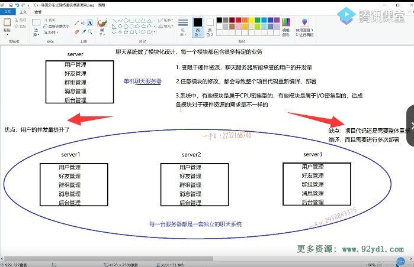
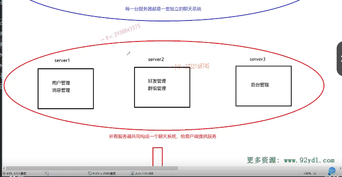
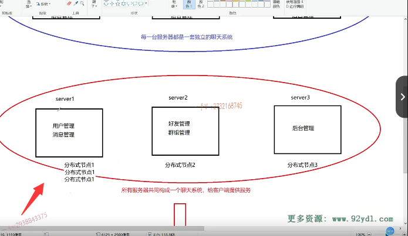
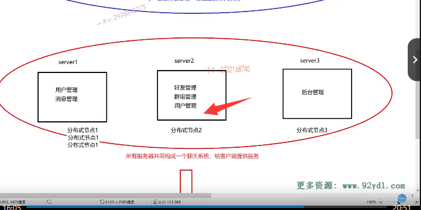

那么，大家来继续看一下，我们把单机的聊天服务器现在扩充成了。这个集群的聊天服务器啊，集群聊天服务器，它是前端需要一个负载均衡器的，这块儿我们就不说了啊。那我们主要看他。的这个性能瓶颈是否能够？解决一受限于硬件资源的垫付。用户的并发量是否增大？当然增大了，你现在受限于硬件资源，我给你扩充了硬件资源嘛，我在水平方向上直接呢给你扩充了。

三台甚至四台，五台。你看每一台机器都是独立的，运行了一个聊天儿服务器程序。是不是都是独立的运行了一台聊天服务器程序啊？看好了啊，看好了都是独立的运行的。三台每一台服务器都是一套独立的聊天系统。

那第二个问题呢？任意模块儿的修改都会导致整个儿项目代码。哎呀，我觉得这个第二个问题，这引入集群，让我们头更疼了，为什么头更疼了？

因为你每一台服务器，现在呢？都是运行了一个独立的，是不是聊天儿服务器啊？==原来单机我只需要这个改一台服务器就行了，部署一台服务器，现在有三台服务器。我得把这代码重新编译，代码还是需要重新编译的，因为它模块儿呢，根本就没有分开去。所有的模块儿还是在一个项目中部署的，运行在一个服务器进程当中。==对着没？所以代码还是要重新编译的啊，

编译一套代码，但是我要做多份部署。因为我现在扩展机器了

## 优点和缺点

是不是啊？那在这里边儿就是。啊，好处是什么呀？呃，这个优点。那我们把右点呢写到上边儿吧啊。或者写到这边啊，优点这边是优点。优点诶，优点啊。性能提升了。

用户的并发。量是不是提升了？因为扩展资源了嘛？缺点呢？缺点我们在这里边儿。也很明显啊，缺点是。需要项目代码还。还是需要整体。需要整体。重新编译。而且。需要进行多次部署。是不是它需要多次进行一个部署？好了吧，

这就是它的一个。啊

## 集群仍然没法对资源进行分配，它还是相当于水平去扩展

第三个系统中有些模块儿是属于CPU密集型的，有些属于l密集型的，造成各模块儿对于硬件资源的需求不一样。能不能针对各模块儿自己的需求，部署到相应。啊，配置的机器当中呢？no不行，为什么不行呢？因为我们说了集群，只是呢，水平的去扩展了硬件的机器，每一台机器上还是运行了一个独。

独立的聊天服务器啊，这些模块儿并没有分开去部署，在不同的这个。啊，机器上对吧啊，这就是集群的意思。啊，集群的意思就集群的每一台服务器都是独立的，运行了一套系统，

就是这个server 2现在出问题了，影不影响我这个聊天儿啊？是不影响的，因为server 1跟server 3它还可以独立的去提供流程。服务因为他们是独立的聊天系统。所以呢，

能不能解决呀？不能解决。啊，不能解决那么不能解决，不能解决，

关键是问题呢。比较大的是。各位呀，你觉得像这个后台管理模块儿。这个使用的用户多不多？后台管理。使用的用户多不多？不多吧，是不是啊？能在我们聊天儿系统上发布这个公告，

我估计它不是每一个用户都能发布公告的吧。是不是啊啊？大家在学校，你们每一个人都要是都能说的算的话，那这学校就乱了。是不是因为这个权限太大了？学校里边儿我基本上来说校长说了算嘛，是不是啊？后台管理员就只有一位或者几位。而且后台管理员不可能说是他不断的高并发的去连接服务器，做一些相应的操作，不需要。后台管理这样的模块儿。根本这个根本不需要高并发。啊，

根本不需要高并发。但是呢，你却把这个模块呢？部署在了什么呀？部署在了三台服务器上，你是嫌你的钱太多了吗啊？啊，你扩展了大量的这个机器，却把一些并不是需要太高并发量的这些模块儿。在这些机器里边儿都部署一下。我觉得像后台管理这样的模块儿，并发量要求不高啊，而且对于这个CPU IO资源要求不是很大的，这些模块儿。我只需要把它独立的部署在一台服务器上就可以了，

不需要把它多份部署，但是对于集群来说它。还是那句话，集群它。所有的模块儿还是构成统一的。一个服务进程，它们在一块儿绑着呢。根本就没有分开嘛。是不是啊？你要把这个聊天儿服务器在server 2上部署一份儿啊，当然它里边儿包含了后台管理。你在server 1跟server 3上不属于。你部署了一份儿独立的聊天儿系统，当然就包含后台了。对不对？

你说我一后台的这个管理员，我要登录聊天儿的这个集群服务器，我还用通过这个。负载均衡器给它进行分发，分发到不同的机器的后台管理模块儿。我觉得这个纯粹就是在浪费资源。所以也就是基于集群的这么一个限制啊。

那我们说呢，它并不是说你机器给的越大啊，性能就是成倍的增加啊，我原来一台机器。

它的并发量是一千两台机器，就是2000三台，就是3000实际上并不是这个样子。对吧啊，

我们服务器所支持的这个并发能力并不是说跟服务器的台数是直接成正比关系的。好不好？谁知道你从。我们这里边的讲解你也能看出来。啊，并不是说呢。这个机器多了啊，这个并发量就上来了。好不好啊？实际上你对于机器的这个资源是否进行了一个充分的理解，这都给大家问号。

集群里边儿根本没有。好的吧啊，那么这就是我们所说的这个在集群里边儿。有优势，

有优势啊。那关键优点不仅仅是这个了。简单嘛。简不简单？很简单的。我平时的这个并发量就是1000，我现在到双11双12，我们公司做活动呢。我就预知到啊，这个并发量肯定上来了。啊双11要做活动，并发量要上来了，我的老板11月10号才告诉我。哎，你要考虑一下，

明天这个节日就来了，你赶紧提升一下我们服务器的这个并发能力，好家伙已经到跟前儿，你才跟我说这些问题。是不是啊？要把它设计成复杂的分布式，已经来不及了。啊，这个集群的这个好处就是特别简单。因为你在一台机器上部署，跟在十台机器上部署，部署的方式都是一样的。啊，前面儿再加一个负载均衡器就可以，相对来说它的这个部署的这个。

啊，方式呢，是比较简单的。好吧啊，那么在这里边，大家把它的这个优点啊。缺点呢，去理解一下。OK吧啊，好了，那么我们认识了一下，对于聊天儿服务器集群以后所带来的好处，跟不好的地方，以后我们。再来看一看基于这它的这些缺点，

# 分布式

我们再。看一看这个。

啊，大家先给我看看这个红色圈里边圈。这三个这三个跟上边儿一样，三台服务器，但是不一样的是大家看。诶，我把这个。你看啊，我把这个用户管理啊。消息管理，好友管理。群组管理啊，以及这个后台管理，

把这些管理模块儿呢？啊，给它抽出来。单独的部署在不同的机器上。也就是说呢，从集群来看的话server 2挂掉了的话，剔除server 2我还有没有这个完整的聊天儿系统呢？有还有server一个字。123都是独立的一套聊天系统，但是呢，在这个红色的圈里。框出来的三台机器上分别运行了两个，两个，一个模块儿。这三台机器啊，

少了谁？我们这个聊天儿系统。就缺失了相应的业务了，少了server 2，那你就没有办法去处理加好友。好友的这个业务跟群组的业务。少了这个server 1，你用户都登不上来了，聊不了天儿了。对着没所以呢，对于这个红色圈里边跨圈。三台服务器。啊，分别部署了辽条。这个服务器系统的不同的模块儿，

这三台服务器的所有的模块儿啊共同。哎，所有服务器共同构成了一个聊天儿系统，你问我现在有几个聊天儿系统？一个我只有一个。给客户提供服务，这就是所谓的。分布式。啊，我们从大方向来说一下分布式。

# 总结

所以，分布式跟集群。啊，从这个表象上来看，就是这里边课件上给大家做的。

那集群是每一台服务器独立运行一个工程的一个项目的所有的模块儿。啊，分布式是什么呢？一个工程拆分了很多模块儿，每一个模块儿独立部署运行在一个。首先，工程拆分了每一个模块儿都可以独立运行。可以把它想象成一个独立的，可运行的一个服务进程。所有服务器协同工作，共同提供服务。每一台服务器称作分布式的一个节点，根据节点的并发要求，对一个节点可以再做节点模块的。集群部署啊，

后半句话大家可以先不看啊，在这里边儿你就理解了，集群跟分布式。啊，最表象的一些区别了。

对吧，集群里边儿每一台这个服务器都是运行了一个独立的一个。系统啊，那么。在分布式环境当中呢？是所有的这个机器共同构成了一套系统，这一套系统被分解成了不同的模块儿，对吧啊？不同的模块儿根据具体的需求被部署在了不同的这个机器上。好的吧啊okay，

那我们先来看。啊，你别光画的好啊，能不能解决问题？受限于硬件资源，聊天服务器所能承受的用户的并发量。那么，在这里边儿，我们把它呢？首先称作了分布式节点。啊，分布式节点。节点一，这个分布式系统分布式节点二。然后再来一个。

分布式结点三对不对啊？这个可以吗？一个用户的并发量聊天儿嘛，登录嘛，是不是先登上再说啊？这个你你跟我说个话，或我给你说个话，你加个好友是不是？你你加我一个好友，是不是马上就过来了？这个好友请求就过来，还是说是延时一秒过来？这个其实对于我来说。这个没有必要，是不是？

然后对于这个好秀啊，这个群组加群创建群啊，对它的实时性并不是要求特别特别高。对不对啊？那么用户管理你一定得让用户能连接上啊，是不是啊？那用户连接你服务器呢，转了半天，是不是登录了半天，发现最后连接失败了呢？用户呢？可能就不会使用你这个软件了啊，那么。为了支持并发量。来连接成功嘛？

和支持用户的登录。

# 再支持并发 

那我把这个分布式节点一呢？我就给它继续，再怎么样？继续在扩容。也就是说呢。可以再搞出来两台机器。来部署用户模，用户管理模块儿。和消息管理模块，或者说是你只部署。用户管理模块。好的吧啊，这就是我们在这里边说。就是根据分布式结点的并发要求，

对一个结点可以再做。节点的集群部署。所以呢，我们分布式里边儿还可包含集群的啊，分布式节点，如果这个分布式节点的这个需求的这个。资源更大的话，对于这个分布式节点，我们可以。可以继续对它进行一个。啊，大家在这里边，我就不画了啊。呃

## 解决第一个问题

## 还可以帮助分担别的节点

为了就是第一个问题嘛，受限于硬件资源，需要更大的这个。以上先让用户呢，登录成功是不是你在这里边儿可以想象我们还有两台机器里边儿部署了用户管理模块儿？okay吧啊，这样就支持了更大的这个。并发能力的是不是啊？其他的模块儿也是同理，那我觉得后台管理模块儿不需要高并发吧。啊，一台机器足矣了。是不是啊？一台机器足矣了。好，那么在这里边儿，

你看啊，甚至呢？甚至呢？我觉得呀。这个用户管理模块儿呢？需要更大的用户量啊，因为真真正正我们一聊天儿，我发现呢是。==实际上，没有人成天没事儿干净，在那儿做创建群加群这个。删除群的这样的操作。也没有人整天去加好友，删好友==。

==对不对啊呃登录？退出聊天儿，这应该是大家做的最多的。是吧，所以好友管理跟群组管理这所在的server 2，对不对？可能就对于它的这个网络l资源有一些浪费了==，因为它使用的这个能。使用的情况并不是非常非常的多，==所以我可以呢，在这台台机器上再部署一个用户管理模式。啊，甚至把消息管理模块在这一台机器上。也再部署一份儿==，这样呢？

呃，在你好友模块儿跟群组模块儿呢？呃，无法使用完server 2的网络IO资源的时候呢？我用户管理模块儿跟消息管理模块儿可以再享受一下server 2，多余出来的网络IO资源提供给更多的客户端。进行。登录，登出以及聊天服务嘛。这是不是就非常灵活啊？

## 解决第二个问题

第二个任意模块的修改都会导致整个项目代码重新编译部署。哎，各位，这第二个问题呢？我们单机聊天儿，

跟集群聊天儿，服务器都没有解决吧，而且对于第二个问题来说，集群聊天儿服务器。它更差劲，因为需要多次进行部署。是不是啊？集群呢啊？那么no不是集群啊？分布式呢？分布式系统。因为它把模块儿从整体的服务器啊进程中给它拆分出来了。啊，这个每一个模块儿编译成了可独立部署，独立运行的一个小的服务。

是不是哎？那如果说在这里边儿后台管理的某一个业务出问题了，我只需要把后台管理模块儿。重新编译一下。其他的模块儿我需要重新编译吗？我根本不需要啊。而且后台管理模块儿只是在server 3这台机器上，我只需要把server 3这台机器上的这个后台管理模块儿重新更新一下。啊，用户消息好友群组管理模块儿根本就没有做任何的修改，为什么要对它重新编译重新部署呢？它是可以正常的去提供服务的。第二个问题解决了没？解决了吧啊？

# 解决第三个服务

第三个系统中有些模块儿属于CPU密集型的，

有些模块儿是属于l密集型的。造成各模块儿对于硬件资源的需求不一样。那么这不是很明显了吗？这模块儿都已经拆分出来了。啊，比如说这个模块儿呢？是CPU密集型的。啊，那我就给这个模块儿所部署的机器给它安装一些好的CPU资源。但是呢，对于比如说内存啊啊，或者说是网络IO资源的话呢，或者这个。呃，硬盘资源的话呢？

可以相对来说减少一点啊，根据这个模块儿，具体的一些需求。啊，那这个模块儿呢？它的这个网络IO呢？资源需求比较大一点。那么相对来说，我们它的这个CPU资源呢？就不用配置的那么好了。模块拆分出来了嘛，那第三个问题能不能解决啊？也可以解决。对的吧，还有这里边儿集群所引发的这个问题，

我们分布式能不能解决啊？当然也可以了嘛。因为模块儿都已经拆分出来了。有一些模块儿呢，它并发能力呃它它的这个要求的，这个并发能力啊。啊，比较高。是不是啊？所以我可以把这个模块儿进行多机器的部署，有些模块儿呢？它使用起来并不是那么多的，并不是那么频繁的，我只需要把它部署在一台机器上。就足矣，

是不是啊？有些同学说，哎，你这个分布式有一点不好啊，什么不好，就是你刚说了嘛，这个集群聊天儿服务器当中啊。我一台服务器挂掉的话呢。啊，那我其他服务器因为是部署的是独立的，可运行的聊天儿。系统啊，它是正常可以提。提供服务的，那你这个分布式的话，

是每一台机器都运行了一个整套的聊天儿服务器系统的一部分，那你要挂的话呢？不是出问题了吗？实际上大家呢，在这里边儿并不需要钻这个牛角尖儿啊。那真真正正呢，我们在。这个项目上这个生产线以后呢，我们都是要去考虑这里边的。这个高可用容灾的。啊，就是容灾对吧？你说了嘛，它有可能挂掉啊，容灾的这些问题的，

最起码我们都会配置一个主备服务器的，是不是啊？所以这一点呢？不必操心啊，我们也不打算在这里边儿，对于高可用的这种容灾，这个服务器的容灾模式进行大批。我就说到这儿就行了，好那。

# 总结

这节课呢，我们主。给大家呢来说了一下，这个集群跟分布式系统。啊，它的一个结构，

它们之间的区别，以及我们最终过渡到这个分布式系统以后呢？是不是解决了我们上述所描述的？一些问题好的吧啊。当然了啊，当然了，在这里边儿，我们分布式看着好。实际上啊，它带来了更大的。我们所面临的是更多的一些。都有哪些问题呢？大家可以先想。这个我们放在下节课继续来给大家进行一个详细的阐述。

