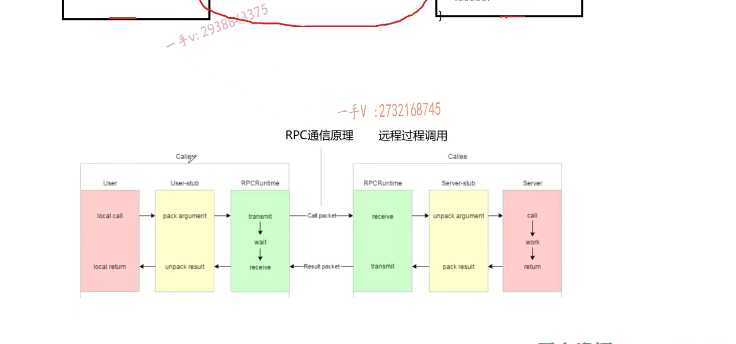

这节课呢，我们在理论上给大家讲解一下rpc的一个通信原理啊。我们虽然说的是理论，但是我们不仅仅局限于这个文字啊。我是会给大家举一下这个具体的一个调用的过程，再结合一个画的比较不错的，这么一个图。告诉大家啊。c的通信原理啊。就是听完这节课，你能够拍着胸脯说rpc通信的原理，我掌握了，甚至离开任何的。书面资料，语音视频资料我都可以自己画出来。那这节课我们的目的就达到了。

上节课我们给大家讲到了。就是最终我们通过啊，合理的把大型系统的软件啊进行模块儿，很好的模块儿划分。啊，划分成按需，什么叫按需呢？对于硬件资源需求的不同。对于并发这个需求处理能力的不同，对不对啊？把它划分成不同的这个模块儿。我可以根据模块具体对硬件的需求，对于网络高并发的需求把它。它分别进行一个分布式的部署。

也就是说呢啊，一台机器上一台服务器上运行的。这个模块可能并不能单独的构成一个聊天系统。这个分布式环境中，所有的机器。的所有的不同模块儿合起来，整体构成了一个聊天系统，对吧？我们说呢，它可以解决我们之前所提。提到的单机服务器以及集群。这个服务器系统这里边儿所遇到的一些问题啊。那么，最终我们说了。那么，

分布式固然好，但是呢，我们也需要去解决一些问题，那我们这一套这个。项目所要解决的问题，就是我们要把。分布式环境中，不同分布式节点或者是同一分布式节点，不同进程里边儿的模块儿之间方法的调用啊，业务方法的调用。其底层的定位细节。由我们框架来完成。不让用户来操心，对吧啊？可能呢，

大家现在想起来，觉得这无非就是一函数调用嘛，对吧？进程内的函数调用当然是调用的函数名，传个实参就可以了，但是不同进程，不同机器上的模块儿之间的函数调用。可就没有想象的那么简单了，是不是啊？那当我们再把主要精力再去做业务的时候呢，这底层的分布式节点上的这个。函数调用就是远程的，这个函数调用啊细节。啊，由我们框架来给它完成。

好，那这节课我主要给大家讲一下rpc通信原理，什么叫rpc通信原理？rpc就是remote procedure call。也叫做。远程过程dou。好吧啊，实际上你可以把这个分布式的这个通信就理解成rpc通信就可以了。啊，没问题，什么叫分布式的通信嘛？分布式的通信就是说构建一个服务器系统。由好多不同的模块儿组成，这些模块儿呢，进行了独立的部署，

那么模块儿跟模块儿之间的通信也就说白了，底层就是这个模块儿，可能会利用另外一个模块儿的，是不是方法呀？这个就叫做分布式通信呃，也是我们分布式部署里边主要要解决的问题，也可以称作rpc通信。对吧，就像我们之前给大家举的例子啊，用户管理这里边儿要调用的这个get user friend list获取某一个用户的好友列表。啊，但是这个方法可不在这台机器上，不在这个机器的这个进程内是在另外一个机器的。另外一个模块儿的进程里边儿呢，是不是啊？

所以这就是我们。所要去学习的东西，我们这一节课呢，就通过这个例子来讲一讲啊，讲一讲我们这个描述rpc通信原理的这一张图。

这一些模块名字都代表什么意思啊？好，

左边这个叫caller caller就是调用者。调用者相当于就是我们server 1这里边儿的角色，用户管理用户发起了一个远程的一个方法调用。要获取当前指定用户ID的这个用户的是不是好友列表信息啊？就local call本地的一个调用。哎，同学们，

这里边本地的这么一个调用local call对应的这个状态是哪个状态呢？就是我在这台机器上的这个进程里边调用了GE TU。user friend lists.但是呢，这是一个远程的lpc方法，对吧？不是一个本地在当前进程内的方法。所以呢，它首先就得去找在哪一台机器上呢？有这个远程的rpc方法呢？呃，此时它就要去查找服务的配置中心。关于服务配置中心组k片儿的讲解呢，我们给大家放到后边儿，我们先不考虑这一点，

我们就直接假设他已经知道了。这个服务在server 2的。上面好吧啊，我们先不考虑这个服务注册中心。不考虑服务，发现我们就直接知道这个服务就在这一台机器上，我们就来看这个rpc通信的这么一个原理。那么它现在呢？就要把这个函数调用的请求。要通过网络啊，发送到是不server 2上，你想一想嘛，你把这个调用rpc方法的调用请求发到server 2上。server 2得知道你想调用哪个函数啊？你看server 2的这个好友管理模块儿，

在这个进程里边儿啊，人家有好多的rpc方法呢。人家有get user friend lists，还有add friend，还有delete friend，对不对啊？获取好友列表，增加这个添加好友，删除好友都有，你到底调用哪个呀？啊，那你在这儿传输的时候呢？你你应该是把这个要调用的函数的这个标识传过来吧？你看你怎么通过什么样的这个方式来标识一下，我调用的是这个函数。

那到server 2这里边儿呢，就知道诶，你你你有一个这个远端啊，有一个远端要请求这样一个名字的是不rpc服务啊？好，

应该是把rpc方法的名字，包括这个方法在远端调用的时候所涉及的这些参数。是不是都进行一个打包啊？所以大家看啊。这个local call，这个箭头过来就是pack argument，

pack pack就是打包argument就是参数。而我们把这个称作呢？序列化。啊参数要进行序列化。好的吧啊，序列化。就是打包，你可以先理解为打包序列化好以后呢诶，这一块序列化。

好，以后我就可以把这个请求通过这个网络啊，通过网络transmit传送啊。啊，通过网络发送出去，那么网络在这里边儿，

我们用的是不是就是一个用CA加实现的开源的？model网络库。来做的事情啊

远端接收到从网络上接收到这个rpc调用请求以后，从网络底层上报上来。上报上来是打包完成以后的参数，那它要把打包网络上接收的打包以后的参数是不是要解包啊？啊，这就是数据的反序列化。就是从网络。的这个接收的这个字节流给它反序列化成具体的一个rpc调用。的一些细节的信息，包括rpc方法的这个标识啊，包括这个方法调用的时候所需要的参数啊，是不是？

诶，然后呢？

诶，然后呢？就到server 2上了这个。靠力啊，就是server 2。这个server就这里，这里边的话就靠哎，因为呢，这个rpc方法的请求已经到达这个机器上来了嘛。那就在这个机器的这个进程里边儿去执行这个函数就行了，人家把这个参数也都给你传过来了。work工作嘛，工作就是执行这个函数嘛。就相当于这个函数是不是这个函数肯定有返回值啊？啊，

你返回值。呃，你不管是正常运行还是说是运行出错了，你总归你得给调用的发起方，你返回个东西啊，人家知道什么情况了，是不是？返回的东西呢，你也得在这里边pack result，就是打包结果，那这是不是又是序列化啊？好，我们想给这个调用方返回的rpc方法的调用，结果从我们具体的数据给它序列化成一个字节数。啊字节流对吧啊，

然后再通过网络呢，这里边儿还是model网络库嘛？啊，发到这一端，发到这一端以后接收到以后呢？哎，这个网络呢

就会把字节流上报到这个users tub这一个端。呃，把字节流进行什么啊？反序列化。哎，反序列化。字节流反序列化以后呢？就可以得到具体的一一个我们程序，

我们应用程序能够认识的一个描述rpc方法调用。请求结果的这么一些数据了。啊，然后就到达local return，相当于我们这个函数就调用完成了。也得到返回结果了，那整个的过程就是这个样子的。没问题吧？

在这里边儿，大家看一下，这儿有一个stub stub server stub。所以你看啊，在分布式这个通信框架里边都有一个桩桩这么类stub，这么一个类。你可以把它认为是一个代理类。

因为呢，现在发起方呢，这个rpc方方法调用的发起方呢，现在呢，他只专注于做业务，他不用去关心底层。的这些网络上的rpc方法，通信的具体的一些细节，他把这些细节呢都包装给这个stub装这个类。来去解决做什么呢？做数据的序列化跟反序列化，做网络的发送以及网络的接收。啊，对端执行rpc方法的这一端也是的，也有一个桩这么一类啊，

执行网络的收发数据。执行数据的序列化和反序列化。没问题吧？这张图呢，你搞清楚就行了。啊，这张图虽然画的比较简单，但是已经非常清楚的描述了分布式通信rpc通信，你主要要做的事情。

好的吧啊，那么这个描述完我给大家再举一个例子，比如说我们现在想。一个这个调用一个rpc方法啊，是什么方法呢？就是这个login这么一个方法啊login这么一个方法。

呃，这个有呃。我们的name对不对？还有这个password。就name跟password就可以了吧？那么，我们要调用这个方法啊，调用这个方法，这个方法可不是在我当前机器的这个本进程内部是吧？要在进程内部我直接调用这个方法名就行了。什么框架，其他框架我都不需要使用，但是现在这个方法运行在远端了。啊，那我在这里边儿发起login，

那我需要呢？这框架里边儿的这个装类是不是就得给我把我想调用的这些这个rpc方法的方法名字啊，以及参数是不是都进行序列化啊？打包起来嘛，打包形成一个字节流嘛，通过网络进行发送嘛啊，发送到对端以后呢，哎，这边儿呢就。就要去接收网络的字节流，当然这我们不用操心，交给模组库完成就行了，然后从字节流呢啊。在反序列化出来诶，你要调用的login以及name password啊，

在远端进行一个调用。啊，进行一个调用，调用完成以后呢？哎，它返回了这个登录执行的结果，那登录成功或者登录失败，也就是返回一个true或者FALSE。是不是啊？也有可能呢？在这个远端，毕竟是一个。远程的这么一个通信嘛，有可能在这里边儿执行的时候，这个函数并不是说是执行登录成功或者登录失败了，

### 响应码

实际上不管登录成功，登录失败，人家这个方法执行都是成功的。那万一这个方法执行出现问题的话，怎么办呢？这里边儿呢，==我们返回的时候还可以带一些响应码==。比如说响应码是零，就代表了这个方法。在远rpc方法的执行，在远程呢，是正常执行完成的。啊，如果呢？那这个错误码有错误码就说明了，

我不能再去读这个返回的结果了，这表示呢？这个rbc方法在远端执行的时候出错了。是不是哎？我可以在返回的时候呢？带一些错误码错误信息以及真真正正的返回结果啊，这个我们后边儿在写项目代码的时候。我们具体给大家说就行啊，大家在这儿呢，先从这个图上啊举的这个例子上。啊，先能知道啊，它有这么一回事儿呃，我们需要考虑的好吧。然后呢，

把返回的结果，比如说是呃错误码，错误信息以及具体的返回值再进行序列化打包，成字节流通过网络发送。再到我们rpc方法调调用的这个发起端，再接收字节流啊，上报到stap类进行数据的反序列化，再上报到应用程序，我们就知道。啊，如果一读你的错误码，一看没错误码啊，那我就可以放心的去读返回值了，如果一读有错误码啊，好家伙。

那现在呢，也就意味着rpc方法在远程调用出错了，那我就直接读错误消息，错误消息描述就可以了。我不要再读返回值了，返回值。肯定是无效的。好吧呃，

明眼的同学当我讲到这里的时候。你就应该知道我们现在所要写的分布式框架啊，分布式网络的这个通信框架要完成，这里边rpc通信过程的。哪些部分呢？能不能在我画之前？自己先想出来呢。

我们的框架。这就是我们要写的。对着没？我画的对不对？我们要实现的分布式啊。分布式网络通信框架。负责这个。处理的这个范围。哎，负责处理的范围，如果这是我。这是你对吧？啊，你跟我运行在不同的进程，或者甚至我们运行在。

不同的机器上，我现在要调用你这个里边儿的一个方法。啊，实际上我不用考虑太复杂的东西，我不用考虑什么这个数据的序列化，反序列化网络的发送与接受。对不对啊？什么错误码之类的，我我根本不用担心这个，我就直接调用这个方法就行了，就跟调用我本地的方法一样简单。然后呢？我借助这个分布式网络通信框架库呢？然后呢？它就会去诶，

把这个方法的调用请求发到你这儿。你执行完，然后再给我返回，结果我只负责读结果就行了，至于结果怎么过来的？结果怎么从字节流反序列化成具体的错误码？错误消息以及返回值的，我不用关心，都由框架来完成。对于框架类的项目，它的好处呢？是毋庸置疑的。

是不是model库就是一个现成的网络通信框架，你接触model库是不是一下子就可以得到一个？哎，

非常好的，对吧？业务跟网络代码完全分离的啊，非常好的e pol加多线程的，这么一个网络IO模型。你只需要去处理业务就可以了，对吧啊？如果让你自己去写一个一加多线程，我相信并不是说你写不出来。可能得先花你几个小时来输出。诶，而且还不一定稳定。对了吧哎，这就是啊，我们写框架的好处。

而到到时候呢，写完这个框架呢啊，大家可以把这个放在get HUB上啊，对于框架进行一个详细的描述。数对不对啊？说不定呃，你写的这个框架。就会帮助到其他人。那么也就是说，我们完成这个框架。啊，最终的这个好处是什么？就是我们可以任意的啊，把我们现在大家之前写的项目。从所有模块。

构建了一个。服务器的这个进程是不是我们到我们可以，如果说是我们把我们之前写的项目进行模块儿的拆分。把他们单独部署成一个小的服务的话呢，那么如何进行rpc通信呢？非常简单，你只要。掌握我这个框架基本的使用。你就可以。把你的这个服务从本地服务部署成一个远程的rpc服务了。

啊，那到底有多简单，具体该怎么调用呢？对吧啊，那我们现在一两句话在这儿，

我们也说不完这个，我们到时候就放在我们。具体项目的书写过程中，我们肯定不能说是只给大家去做框架，我们肯定也得举个例子啊，一边儿举例子一边儿说。框架怎么使用？一边再说我们框架。底层的实现了对的吧啊。好了，那么我们这节课的这个主要的这个目的就是给大家介绍一下这个rpc通信的这个原理以及。借助这个rpc通信原理来给大家说明，我们这个分布式网络通信框架所要做的事情，在这个课件上，我也给大家说了。

## portobuf优点

啊，这黄色部分。就是设计rpc方法参数的打包跟解析数据的序列化，我们使用的是什么pro to buffer？也就黄色部分我们。由谁来完成。由pro to buffer来完成。那有人说json能不能完成啊？那json当然也可以完成了好吧啊，json也可以完成了，但是呢？在这里边啊，但是。啊，但是一出来啊，

剧情就有所反转了啊。呃，pro to buffer的这个相对于这个json的这个好处是？第一个啊protel buffer呢是？二进制存储的。okay吧，叉mail和json。都是文本存储的。什么是二进制存储？什么是文本存储？相信你在学分布式类的这个项目的时候，这些基本的内容应该已经不需要我解释了吧？哪种省空间了？当然是二进制省空间了，是不是？

所以呢？pro to buffer呢？在携带数据的时候呢？它的。带宽的资源利用率是比较高的，因为它携带同样的数据，它占的字己少啊。对不对呃，第二个。protel buffer.不需要。存储额外的。这个相关数据。额，额外的信息吧啊json json怎么存储的呢？

存储数据的呢？各位json存的是k value啊。啊k value啊你比如说它这个name。啊name对吧，张三？然后呢pwd。啊，一二三四五六。你看它有这些名字。而对于pro to buffer怎么来怎么传呢？你看啊，我就不写二进制了，我就直接这样写。它只存数据，它只存有效数据，

你说谁省地方啊？当然，又是proto巴特尔省的一方。所以呢，我们现在在这个。开源项目里边儿啊，或者说在我们大家在公司里边儿去开发项目的时候photo buffer呢？的频率是非常非常高的，尤其是在集群分布式的这样的这个后台。

高性能服务器的相关的这个研发过程中啊pro buffer是你避免不了的，所以我经常给大家说，像这些什么json啊pro buffer啊get的时候。使用啊，你最好是去公司之前你都把它搞定。对吧啊，

因为拿到offer以后去公司并不说就万事大吉了，因为你还有一个实习期呢，你总不能说是实习期的任务本来就很重，你还得自己去。来学我啊，学一下get怎么用来学这个json怎么用学pro to buffer怎么用？那你的起点就有点儿低了。好的吧啊好，这是给大家说了一下啊。

## muduo zookeeper

绿色的部分呢，那就是我们用的这个model库了啊，网络部分包括寻找rpc服务啊，发起rpc调用请求。这个不是native啊。sorry写串了啊，

说的是model网络库和什么呀？和you keeper。这个服务。配置中心。好用了，到了一个服务配置中心。或者做做什么？专门做。发现啊，在服务分布式环境当中呢，分布式系统当中一定会有一个。服务配置中心呐啊。服务配重，这是必须的啊，为什么必须的？

那到后边儿我们做项目的时候呢我们？到时候给大家把问题所遇到的场景列出来以后，你就会发现我们必须得用它，不用它不行啊。nokia现在也是大家在公司里边去做一些做真真正正实践性的项目的时候。基本上是跟red is一样啊，是必须要接触的一些服务器的，后台的一些中间件这么一些。研发任务啊，都是会遇到的好吧，那希望通过呢，我们这个分布式通信框架的项目。大家能够把他们去搞定啊。好，那这节课我们的这个主要内容就给大家说到这里，

希望大家呢，把我讲的这个根据实际的一个远程方法的调用讲。这个示例结合的这个rpc通信的这个原理啊。把它一定搞清楚好吧，这张图一定要在你的脑子搞清楚，因为我们后边在写项目的时候呢。啊，我们还会反过来看这张图，但是你对这张图不熟悉的话，写项目代码的时候。你就稀里糊涂的，我希望呢，你把这个多看两遍，然后。盖上这张图，

自己差不多能画出来一个rpc通讯的，主要涉及的模块儿。啊，通信的这个过程。啊，那你再看后边儿的这个项目代码的时候。我觉得就轻松很多了。好，这节课的主要内容我们就说到这里。