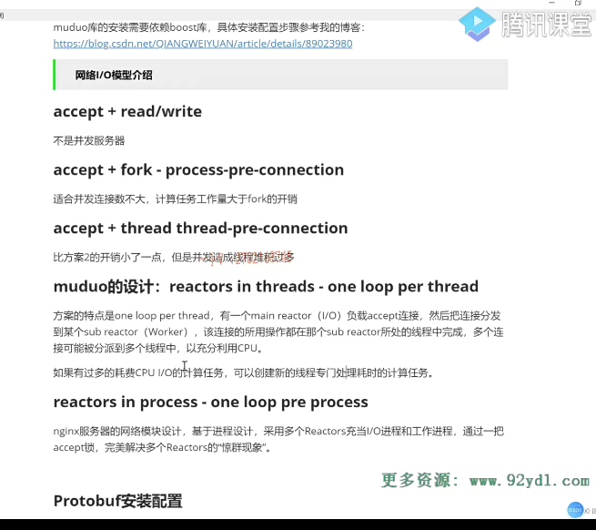
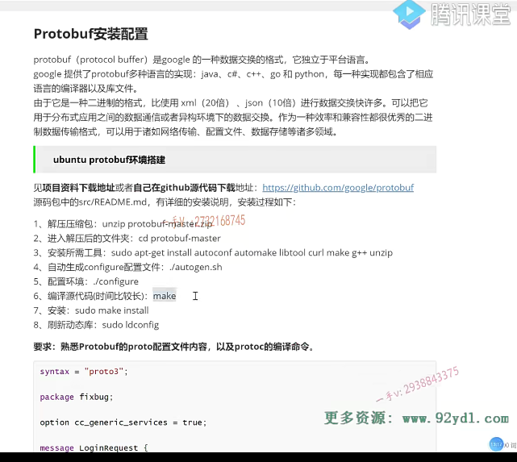
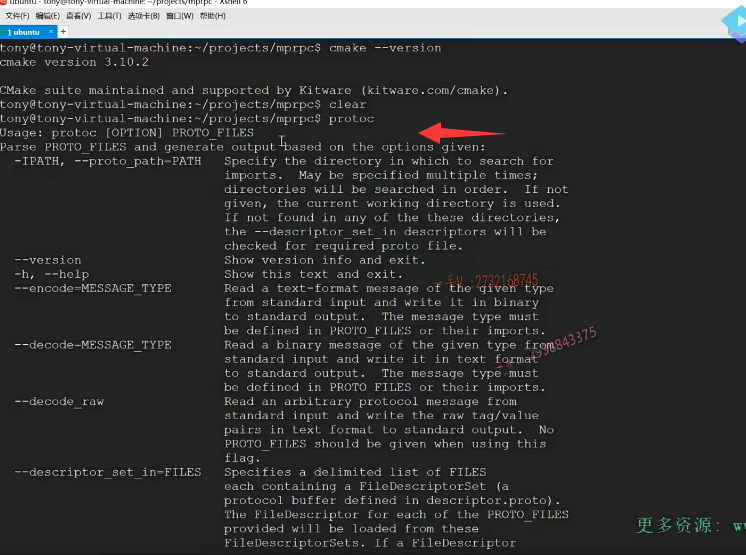

前面的课程呢，我们讲了。我们所要实现的分布式网络通信框架项目，一些理论性的内容。从这节课开始呢，我们就着手进入开发的这么一个阶段啊。在真真正正编写项目代码之前。啊，这节课呢，我们主要给大家说一下这个项目啊。相关的一些环境的配置。首先呢，我们所开发的这个环境啊，我们是在Linux系统上开发的，所以我开了。

一个虚拟机啊。然后这里边打开了一个叉shell啊，你当然也可以用其他的一些ssh工具啊，我觉得叉shell挺好用的。推荐大家使用啊，这远程呢，可以远程linux啊。去操作一些命令啊。另外呢，我所用的开发工具就是这个微软的跨平台的VS code。这里边儿呢，我已经远程成功了，远程在linux上创建一个目录啊。项目的根目录里边儿创建了一些项目基础的一些文件，这些文件有什么作用呢？

我一会儿来给大家一一说明，这就是我整个的开发环境啊。就是我是在linux上通过WINDOWS上的VS code远程开发的。那么，大家在这儿来看一下啊。至于VS code远程开发linux项目的这个环境是怎么搭建的？啊，然后呢？怎么去安装ssh插件对吧？远程linux，然后需要去下载。在远端的去下载哪些插件？这个在集群聊天项目中呢，已经给大家详细的介绍了，在这儿我就不再赘述了啊。

然后呢？另外就是呢，像这个model库的。这个安装。啊，以及编程示例，包括cm ake怎么去构建编译环境，以及它的一些。呃，配置啊，以及基本的一些使用啊，对吧？我们也是在集群的聊天，这个服务器的项目中已经给大家说了。在开这个项目之前，

我已经给大家说了，建议大家先把那个集群的项目先学习一下，再学习这个分布式。效果会更好啊。呃，那么在这里边儿给大家罗列了一些内容啊，这里边儿还是把网络m模型呢，给大家去介绍了一下。那么，同样的，在集群的聊天服务器中，给大家也去说了这么一个东西啊。啊，给大家也列了这么一东西啊，这就是我们从最初的这个普通的啊

单进程的这个网络IO。啊，逐渐的到我们model。网络库所采用的啊，one loop post red对吧，以及我们n jx在这里边儿。啊，我都罗列了一下，从最开始到现在，我们所谓的高并发网络服务器啊。所常用的一些网络IO。给大家列了一下，

然后呢，在这里边儿，我们项目工程啊，

因为我们到时候要传到git HUB上我们。一定要组织一个良好的啊，项目的这个结构目录，把代码良好的管理起来，就跟人家开源的代码一样。啊，不要再嗯乱七八糟的，没有任何的这个项目，这个代码没有任何的组织。呃，在这里边儿bin目录啊。你如果看完了集群聊天项目，这个应该不陌生。我们标准的一些开源项目都是这样做的，并里边儿放编译出来的可执行文件build就是放simic编译产品。

是我们的这个中间一些编译文件啊lab就是一些库文件，我们这个项目是一个平台框架啊，分布式网络通信框架，它肯定。肯定本身肯定要被编译成一个库文件，对吧？我们最终生成的库文件就在lab里边。src包含了这个项目的所有原文件啊test，有我们这个项目相关的一些测试代码好吧？example就是我们这个框架是怎么使用的？c make list，这就是cm ake的顶层文件啊。存储在我们项目的根目录read me，这就是项目的一些自述文件啊，描述文件。

包括我们项目的一些。呃，作用啊，项目的源码结构的一个介绍啊。啊，项目怎么编译呀？怎么使用啊？一般在正式的一些开源代码中read me文件，写的都非常的详细啊，我也是建议大家呢，写的详细一点。因为我给大家建议啊，就是你看了我的这个视频，你好好学习了项目，我希望你把它传到get HUB上。

然后把git HUB这个项目的链接地址直接复到啊。你的项目的描述里边儿好吧，那这是非常有说服力的，人家一看嗯，这个。呃，整个的这个项目代码的组织啊。基本跟开源的都比较相似，而说明呢？啊，这位同学的整个儿的开发思路啊。啊，还是很规范的。好吧啊，整体来说就。

因为你要走这个专业，对不对？做任何事情你都要去。和这一行业的一个标准嘛，比较乱七八糟的是不是啊？

呃，这个auto build就是一个一键编译脚本，因为我们。嗯，如果直接用cm ake命令我们，我们还得切到build目录里边儿什么cm ake点儿点儿生成makefile，然后再make是不是啊？没有必要那么麻烦，我们最后呢写一个一键编译脚本啊。直接运行这个脚本。

编译出我们所有啊。这个项目。代码中所需要的一些可执行文件啊。啊库文件对吧？所以我按照这个目录呢。呃，源码这个。级别的这么一个目录我。也把这个目录在我们的这个项目工程。

给它创建好了bin啊，放什么呢？把这些文件build放什么呢？哎，放simic编译。编译项目编译项目代码产生的中间的一些编译文件对吧啊，

包括makefile，包括我们。源源代码的一些。点儿文件example就是我们的测试代码，因为我们是分布式网络通信框架项目嘛，那我们怎么用呢？这个框架怎么用？一些示例代码我们。肯定给大家就放在example下边。lib，我们框架的这个代码最终编译出来的是一个库文件啊，动态库我们把它。src就放了我们这个。嗯，分布式网络通讯框架项目的所有源代码了test就是。

呃，我想把这个因为这个项目还有用到了这个pro to buffer的一些使用，还有zoo zk的一些使用啊。到这些项目相关的一些。呃，这些技术的这么一个。讲解包括它的编程我。我把代码都给大家汇总在这个台上。

这个c make list就是cm ake的顶级文件啊，read me项目自书文件auto build。啊，这就是呢，一键编译的这么一个脚本文件好吧啊，你也像我一样把这个呢都创建好吧。环境呢，

都搭建好。

好吧啊，好这个做完了以后这一节课的环境，大家还有一个就是我们的。pro to buffer啊，pro to buffer，pro to buffer在这里边儿，我摘录了一些。呃，它的一些常规的介绍啊，是谷歌的一种数据交换格式。啊，谷歌是太厉害了啊。呃，应该是全球啊。

第一阵营的啊，第一阵营的这个。非常非常厉害的这个。啊，科技公司啊，像pro to buffer啊，像给大家说了啊，这个gr PC啊，也是一个分布式这个。框架对吧啊？它开源了很多很多很多的东西，而且都是。呃，用于全世界的啊，各种各样各行各业的开发。

啊，它以pro鲁巴尔也是谷歌发明的。呃，谷歌提供了pro buffer的多种语言的实现，像JAVA c sharp啊C加加go passion都有实现。嗯，包括这个go也是。谷歌产出的对吧？每一种实现都包含了相应语言的编译器以及库文件啊，因为它是一种二进制，我给大家说了啊pro to buffer是二进制存在的。不像XML json，都是文本存储的，所以它存储同样的数据肯定占用的字节数要少，所以它。

在网络进行传输的时候呢。呃，那肯定是节省带宽资源嘛，同样的带宽资源会传的更多，传的更多，意味着效率更高，效率更高，对吧啊，可以处理更多的请求。响应是不是啊？另外呢，它存储的数据呢，是只存储它原始的数据啊。那不像叉mail这个格式的文件，还要存储很多的标签，

是不是啊？json呢？还要存这个键值键值，还要存这个键的名字，对不对啊？所以呢，它存储是相当省空间。啊，在现在的这个项目中，普通办法用的非常多啊，可以把它用于分布式应用之间的数据通信或者异构环境下的这个。数据交互。呃，异构环境吧，

客户端跟服务器啊，

不同语言写的是不是啊？那这个我们。嗯，用json也可以，用叉mail也行啊，用普通buffer更好。呃，当然了，叉mail跟json呢，学习起来呀。呃，是非常非常简单的，它基本上没有什么学习成本儿啊。尤其是像这个json，我们在集群的聊天服务器项目中也给大家用了json了，

是不是啊？用了一个开源的，一个json库啊。就用起来就跟我们的这个。呃，使用一个容器特别相似啊，非常简单，而put buffer呢，虽然强大强大的东西呢，一般来说学习成本儿。稍稍有那么一点高啊。它其实非常简单啊，非常简单，那么后边儿我会给大家专门讲一下put buffer的一些常见的编程应用啊。呃，

可以在这里边儿作为一种效率和兼容性都很优秀的二进制数据传输格式啊，用于诸如。这个网络传输配置文件啊，数据存储等诸多的这个领域。

呃，关于这个pro to buffer，更多的一些简介啊呃，你觉得读了我这一段儿话啊，你意犹未尽啊想？知道它更多的一些介绍性的东西啊。大家呢，好好的利用一下网络资源啊。好好的利用一下网络资源。呃，这个多查一查。

在这儿呢，我们既然这节课主要说的是环境搭建在这儿pro to buffer的环境怎么搭建呢啊？pro to buffer是开源的啊？呃，你可以在bred buffer的git HUB源代码上自己下载它的这个源码包，或者你如果说懒得下载嫌git HUB太慢了啊。那你可以在我我后边儿会把这个项目相关的所有的资料，包括一些安装包儿都放在云盘上啊。你可以在我指定的这个云盘地址进行下载，下载下来了以后呢？哎，就是put buffer杠master。点这个zip。那在这儿呢，你可以进行一个什么？

进行一个操作啊，用相应的命令进行一个操作好吧，这里边儿。操作的这个过程我已经给大家写出来了啊。实际上，这个不是我写的，这人家这个get HUB也是个源码嘛，跟我们一样，我们说都是照人家源码对齐的啊，人家都有一个read me。文件啊，在这样的这个。呃，protel buffer的这个工程的read me文件里边儿就已经详细的啊，说了你这个源码该怎么去？

安装好吧

我是我的这个linux环境是一个优班图的啊。那么在这里边呢？呃，pro to buffer的这个源码编译啊，它需要依赖一些库。啊，就是lab two corl。啊on zip是不是像这些东西呢？如果你没有的话呢，你要先预装一下啊，预装一下。你如果用的是虹猫或者是渗透OS的话，你在它的一个yam仓库里边儿进行一个搜索，如果你不提前安装所需的工具的话，

你直接。对于pro to buffer进行一个源码的，这个编译的话，它可能会报错啊，其实也没关系，它报错的话，你就看这个err。or嘛error这个字眼嘛，它说缺少哪个？你到时候再装哪个就行了，都成啊。相信你学到这个项目应该是有一定的动手能力的吧，各位同学是不是啊？呃，像这个以后进公司以后搭建复杂的这个服务器环境会涉及很多很多的一些包的安装啊。

大家呢，遇见问题不要怕，仔细的去看一看，找这个error是不是啊？它错误是什么？呃，要学会去分析error，缺少包，那我下载安装相应的包，如果实在看不明白，网上搜基本上都能够出结果的。好不好？这个on zip就解压包嘛，然后进入这个文件夹安装一下pro to buffer源码，编译所需要的一些其他的库啊。

这个呢，就是。进行啊，生成配置是吧啊点configure生成这个。makefile啊，然后make去编译了，编译完了以后呢？速度make in store啊。这个pro to buffer编译成的是一个动态库啊，并不是一个可执行文件啊，它是个动态库，所以呢，我们到时候呢，使用pro to buffer的时候。时候还是要链接这个protocol，

这个动态库的啊。那最后呢，为了防止啊动态库呢，找不着你把动态库啊的这个缓存刷新一下，就是速度ld config。好吧，这个不要忘啊，不要忘。那么。

成功以后呢？那相当于就是你可以这个在linux的这个命令上输入这个protocol c。pro toc相当于就是pro to buffer的一个编译器命令，它可以通过简单的这个proto的一些配置文件啊来。来生成相应的这个代码不是说了吗？人家的这个pro to buffer给你提供了JAVA CS ACA加购物焚这些语言呢，

是实现是不是啊？那么，大家可以看一看cpp out CS hop out JAVA out-s object cphp passion ruby。它可以把相应的protel文件啊的配置内容给你生成相应的，你指定的。啊源代码啊，那你说的这个proto配置文件里边儿怎么配置都有啥内容呢？你别着急，这个我们后边儿给大家说，这是属于编程实践。我们这节课主要讲的是环境配置啊。你把这个啊，有这个protocol。就OK啦。

好吧，能正常执行这个pro DC这个命令就OK了。啊，这就是pro buffer的环境呢？安装好了？行吧啊，那这一节课啊，我给大家把我们即将要进行。呃，项目编码阶段之前的跟项目环境有关的一些内容给大家说了啊。嗯，linux的这个环境叉shell还有我的VS code相应的插件远程。开发linux项目啊。以及呢，这个model库的安装啊cm ake的这个安装啊model库，如果你装好了cm ake，

它也就装了，因为model库也是。通过c mac来构建的啊。然后就是pro to buffer。安装一下好的吧啊protel buffer安装的这个。目标是什么？目标就是我们能够执行protocol。这个命令好的吧啊，至于这个命令怎么用，别着急，后边会给大家详细进行讲解。好，那这节课大家把我刚才所总结的哈，跟我们项目开发相关的环境的内容打。建好以后。

那我们这节课的目的就达到了。后边的这个课程我们。呃，下节课再继续。