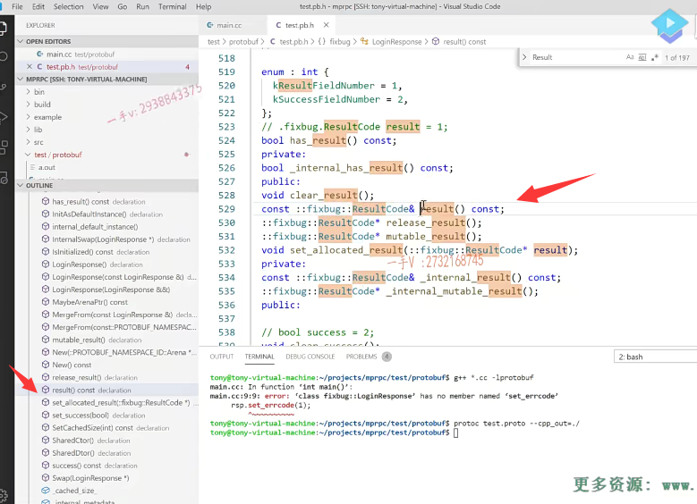
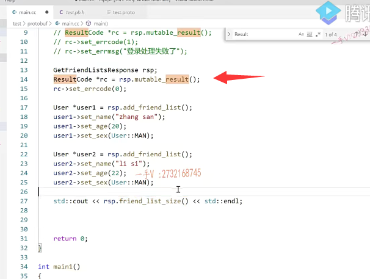
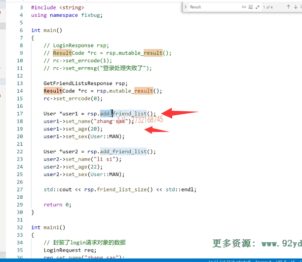

我们接着上一节课啊，给大家讲的这个put buffer的事例继续来说。那么这个呢？我们演示了一下，对于这个登录请求的这个对象的序列化跟反序列化啊。那有同学说呢，那你再给我讲讲响应呗，这有什么好讲的呢，这一模一样的，没有任何的区别好吧啊。这都同样的类型嘛，是不是？哎，你在给它设置的时候呢，你定一个这个log in response对象设置的时候就成set error code set error messages ET success了。

设置完以后，同样的还是调用它的，这个response对象的servlet servlet to stream方法就可以把这个登录响应对象进行序列，化成字符串了。好吧啊，同样的法序列化的方式一模一样。

你看这个pro to buffer生成的这个设置以及获取的这个方法名字，它有特点。这个设置就是set下横杠。你put buffer里边定义的这个成员变量的名字，对吧？啊，然后获取读取它的话就是直接你在put buffer里边定义的相应的message，这个类型的成。变量的名字没错吧啊，

把这两个记好，这是它特点。

好不好啊？好，我们继续说一下，实际上呢？嗯，我们在使用pro to buffer的时候，对于这种字符串的存储啊，实际上我们很少会用到string的啊，因为我们一般。般都会把它定义成什么呀？这里边儿是一个经验的分享。都会定义成bytes。实际上你自己去看一下源码，

对于字符串类型呢，人家基本上都定义成bytes。多字节存储是不是啊？那么，不管是放到内存上，还是通过网络发送，它处理的都是字节嘛？你写成这个string。土豆buffer是不是还要给你？做这个字节到字符之间的一些转码啊，编码或者解码，按照x码表。对不对啊？那如果你是其他语言的话，还有可能。

按照这个uni COO de这个字符的。呃字符集进行一个编码或者解码。

啊，这就是额外的一些操作了。对不对啊？这都是提升提升效率的东西。这这个就跟我们存储文件，你直接存成二进制就行了，你为什么存储文本文件了啊？你从内存上它本身放的就是二进制文件。你存到你存成文本文件的话，它存储的过程中不仅要写数据，是不是还涉及要把内存的二进？呃二进制的这个数据呢？呃字节数据是不是要转成这个什么字节数据要转成是不是相应的一个字符啊？

再传到文本文件里边儿。啊，没有必要，对不对啊？所以呢，字符串我们用bytes来存储。啊，当然写string也没有错儿，不会影响结果的好吧啊，如果你觉得这个bytes呢，看起来不顺眼。啊，你可以用string好不好啊？可以用string。好，

我们把它改成拜字，

那有些同学就会问啊，你把它这个字段的这个类型啊。从此之后，改成best的话，那它生成的方法是不是就变了？那我使用的时候有没有什么改变呢？对于字符串来说，使用的时候没有任何改变，因为它。接受的时候还是接受这个。字符串的啊，还是？就是还是接收这些东西的。啊，

它就把它直接存成什么了？直接存成这个字节数据了啊。啊存成字节数据了，就是存储的过程中呢，它不涉及任何字节的字符的一个转换好吧啊。那你可以去。自己去动手去实践一下嘛pro toc。因为你出头。文件呢，修改了啊，重新生成一下对吧？proto然后是什么东西啊？杠杠cpp下横杠out等于点儿杠。这两个文件呢？你看这是不是就重新生成了？

哎，重新生成了以后。那么，在这我们同样执行一下啊。嗯，编译执行一下。编译。执行就是使用的代码，没有做相没没有做任何的改变好不好？啊，所以呢，这个大家了解一下。okay，

那在这里边就是我们存储了一些比较简单的类型，单个的这个数据。

是不是啊？我们在存储数据的时候呢？无非就是这三种这个。类型的数据嘛，就是。数据以及。列表以及。映射表。啊及映射表呃，也就是我们。单个数据以及数组。以及map表对吧？

在pro to buffer呢？我们这个项目呢？因为我们不写业务嘛，

是不是啊？我们没有必要去定义复杂的这个映射表在这里边儿，我把列表呢。好给大家要演示一下，因为列表还是挺常用的啊。你比如说在这儿呢，各位。我定了一个。什么东西呢？message。get friend lists.request这就是我们前面给大家。说的就是。不加注释了，前面儿加注释了，

那现在这个定义什么意思呢？你应该也明白，这又是定义了一个请求的消息类型。呃，什么请求呢？获取好友这个列表对吧？那这个请求你肯定是需要一个什么东西啊？uint三二。是需要一个user ID的嘛？你获取谁的好友列表，你得给我你发这个请求得携带一个用户的ID，查这个用户ID对应的是。列表是不是这是请求啊？

那这个请求对应了一个响应的，是不是消息类型啊？

get friend lists.response.response.好的吧啊，那么这响应响应我们说呢，它不一定都能成功啊。

## 错误信息封装

它最起码。你看得有这两个东西。是不是error code跟error message？那有的人就说了。哎呀，你这里边儿这个pro文件里边儿定了好多消息的响应类型。那难道你每一个响应类型里边儿都要定一个error code跟error message吗？这感觉很麻烦啊，是不是啊？

当然了。啊，这个当然是很麻烦。大家能看到这一点也非常不错呃，这就是重复的代码呗，重复的代码我们把它定义成独立的类型就可以了。好吧，哎，在这儿呢我们。可以定一个单独的message嘛，message你随便定义好吧？result code啊。在这儿呢，我们把它。该怎么样把它封装起来？

error code错误码跟错误消息是不是啊？把它相当于打包成了一个整体的，这么一个类型啊。然后在这儿写一个。result=1，这写等于二。

那返回的是不是一个列表啊？我不一定只有一个好友啊，我可能有多个好友，那这个好友就是用户怎么表示呢？不是class啊？啊，各位message，

这是在定义proto啊。user都要返回这个用户的什么信息呢？比如说我们返回一下这个用户的这个。姓名，年龄和什么性别？好不好啊？返回下姓名，年龄和性别。姓名string bats。name年龄整数啊。也不可能是一个复数的，对吧？就uint 3。那么，在这里边就是个h等于个二。

对不对啊？有没有uint 8呢？没有，是不是哈哈？就int 16。也没有，那就写uint三二吧，大家可以查一查有没有更小的这个put buffer里边儿有没有更小的整数类型？因为age不可能长这么大，是不是啊？撑死100岁。那么。在这里边儿，还有还有什么东西啊？性别是不是性别啊？

啊，性别在这里边儿，除了男就是女嘛。是不是啊诶？你存成字符串也行。呃，你要是规矩一点的话呢，你把它存成什么呀？诶，你把它存成这个枚举。慢好吧。慢然后呢？在这里边。再写个什么东西呢？woman。

没问题吧，这里边写等于。诶，稍等一下啊，不是一啊，这个。枚举呢，跟我们什么呀？跟我们在语言上定的枚举一样啊。从零开始的，是不是啊？就这两个了啊，就这两个。这两个完了以后呢，我就可以用。

这个sex来定义一个sex一二三表示。

## 用户不可能只有1个

对的吧啊，然后呢？在这里边。定一个users。行不行啊？这肯定是不行的吧？受这么大气啊，这肯定是不行的，为什么因为你这表示的是一个用户啊？对吧哦，我一个人的好友可能有很多个呢，不仅仅只是一个好不好？

## 定义列表

啊，

就是存储如何存储这个列表呢？注意这也是非常非常常用的啊。repeated rep.peated.repeat repeat是不是就重复的意思呀？就意思是把这个字段重复这个字段重复的话，意味着这个生成的这个类里边儿。是不是有一个user这样的一个列表啊？啊，就一个users。好吧啊，或者我们把它叫做。friend list.把这个成员变量的名字呢？给它写成friend list。

这就是列表类型了。定义了一个列表类型。好吧啊，存储用户的列表类型。

## 使用protobuf

那这个在实践的编码上怎么用呢啊？我们现在定义完了，现在用protelc生成它的源码我。给大家演示一下，它怎么用啊？pro toc test点proto杠杠cpp。杠out等于点儿杠。好了，这个生成这个代码了啊，生成代码。

protoc test.proto --cpp_out=./

好了，这个生成这个代码了啊，生成代码。然后呢，

原文件的名字没有变啊。在这一块呢，我们。是需要怎么样了？啊，大家我们把这块儿代码看一看吧，因为这块儿也改了，是不是？啊，因为我们刚才在这个。log in response里边呢？也没有什么了。没有errorcode message是写了一个打包以后的，是不是这么一个类型啊？它怎么用？

啊，这个我给大家。保留着吧，我们重新写一个啊。

## vscode没反应过来

大家来看，这是logan response是不是？rsp啊rsp要设置数据了啊。哎呀，这好像没有什么。这个是。哦，这个好像还是没有怎么样啊？这个VS code好像还没有反应过来，它还是之前的error code l message对不对？你看我们。

看一下这里边儿应该已经有。result类型了。啊，result code。啊，咱们把这个刷新一下吧啊。rsp点set。还是这个啊，那我现在用一下吧，用一下它肯定出错了它。j加加。星点CC杠l。啊，没有这个方法，是不是哈哈？

这个VS code没有反应过来啊。没有反应过来嗯，在这儿呢

我们进到这个类里边我。大家来说吧啊，大家来看一下在。或者我们把这两个删一下啊。我们把这两个删一下，这两个文件呢？三除以下。重新生成一下。这个应该是要把VS code缓存清一下，对吧啊？缓存清一下。它应该记录的是还是缓存里边的这个文件数据？

嗯，还是这个啊，清一下缓存。应该简单来说。你把这个。头文件啊，我们看。给它去一下，是不是？重新让他去。拉一下这个头文件。它应该能够把改变的同步过来。哎，一看就没有c sets。air code跟set air message了，

只有一个set success。是不是啊？set success。那么在这里边呢？打到这儿，我把导航给大家打出来啊，这是request。我们要的是login，require login response，大家看这个log in response啊。我们有一个result是吧？哎，好给大家展示一下啊，这个result。这个result是成员变量的名字，

它是把这个result的值直接拿出来。我们现在想改它。它返回的值的引用，而且是个counts的话，我们根本对它的返回值改不了。对不对？看这个MA table result啊？返回了它的这个result code的一个指针。那我们现在就抓住它的特点了。

## message 类 都会提供一个可以改变的成员变量函数

## 因为message类是const,不提供就不能修改

对于protel buffer里边定义的这个什么呀？对应的这个成员变量，它本身又是另外一个类对象的话，那message生成的就是个类嘛，是不是啊？这样的话呢，

在这儿它都会。怎么样啊？提供了一个MA table MA table是不是就可改变的？result result code.啊rc等于这个。那rc。指向的。set error code，因为呃，这个result code，它本身是不是还是一个对象啊？啊，就是土豆buffer生成过来的嘛？那它就有set什么set什么这样的，对于成员变量设置值的方法了，

对吧？比如说调用成功了。那这就是。没有错误嘛，对吧啊？如果设置失败了，这就是。呃，登录。登录。处理失败了。这个带这样的一个错误的消息。好不好？

那你。如果都出现错误码了，

我们就不用再给这个rsp它的什么set success，success域再去设置值了。没有必要，我们肯定都是会先检测这个错误码的。

OK吧啊，那就这样设置就行了。对于序列化的话，还是利用这个对象的seriously to string方法。至于反序列化，跟这个也是一模一样。啊，在这里边儿主要就是给大家告诉了一下大家这个。列表该怎么使用好吧？

我们把刚才的那个叫做get什么呀？friend.list request.这个没有什么问题吧，这个非常简单，只有一个成员变量user ID，我们给大家主要说一下这个吧。response是不是啊？rsp啊rsp它都。有哪些东西呢？有result code。还有这个friend list先填写result code吧啊。

## 还是获取一个成员变量的成员又是对象

那同样的，怎么去填写成员变量又是一个对象呢？我们上边儿都给大家说过了啊。

调用它的这个mar table result。获取它成员对象的一个指针。

然后通过

这个指针可以给它成员对象设置值。set error code就是个零吧。那就没有错误嘛，就不用设置air message。对不对啊？不用设置error message了。

然后呢？再设置谁？那就是获取好友列表成功，再设置这个。设置这个啊，设置这个列表类型，刚才是不是有一句话？

表述的不准确呀。啊，我们之前。result code不是列表类型啊，这是一个本身还是一个对象类型？好吧，在这儿我们再说是列表类型啊。有时候我一边写一边讲，可能。然后某一些措辞上。啊，会有一些bug啊。大家呢，注意区分一下啊，注意区分一下。

呃，不要光。死听都去想一想啊，为什么？啊，为什么去想想它的这个道理，到底对不对？如果有什么不确定的呃，欢迎大家在QQ上啊。随时来咨询问题啊。

然后呢，在这儿大家来看啊，就是。列表非常简单。

它的方法就是add。

啊，它的特点就是add下横杠，然后加上你成员变量的名字add friend list。在干嘛呢？你看add friend list。它没有参数。它返回了一个你这个列表里边想存储的这个用户对象的一个指针哦，那也就是说呢，当你调用这个add from。类似的话，它就会知道你想增加一个用户。然后它会去生成一个user对象，并把生成的那个对象的地址返回来。没问题吧？

来看一下啊user。

user 1。诶，

然后呢user 1你就可以设。因为chooser本身也是一个对象，对吧？name张三。然后是user 1，然后再set谁呀？h20岁。

## 枚举类型访问

然后user 1。set这个sex。这个sex是个。枚举是不是一个枚举啊？这个这里边这个枚举啊，我们该怎么访问呢？

没有定义在全局是定义在这个类里边了啊。

然后呢？我看一下这个rsp的。friend list size.它给你提供了一方法，这什么方法呢？这就是你列表的成员变量的名字friend list。再加上一个下横杠size，就可以获取你好友列表的这个。什么东西啊，好友的个数嘛，

是不是？看看啊，一个耗油。再来一个好友呗。user 2。这个应该没什么问题啊。是不是两个好友了？还有两个好友了，这个数据就。添加进来了，没问题吧？

这就是我们说的如何去处理。什么东西呢？如何去处理这个？protel buffer中的这个列表类型代码上的编写就是这个样子。

它是非常有什么？非常有规律的啊。对于普通的，单个的数据呢？设置就是set恰横杠，加你proto文件里边写的。成员变量的名字，

纯粹的读取值呢话就是成员变量名字命名的一个方法名字。

如果proto里边儿啊，一个消息类型里边儿的变成员变量，本身又是另外一个对象的话呢。啊，这种对象该怎么操作？那它是有一个mart able杠，

==不能直接用它的名字，它名字的话，对应的方法反过来是一个长对象==，你根本修改不了它里边的数据。对吧，==这个MA table可改变的它的长。成员对象==，==它会返回它相应成员对象的一个指针，然后你通过这个指针。就可以修改它成员对象里边儿相应的数据了OK吧==，

最后的话呢就是列表类型。列表类型的话，它会拿一个add add下横杠，然后加上你乘。就是列表成员变量的名字，

这样的一个方法，它会去新增加一个。啊列表里边所。那个一个对象，然后把那个对象啊。它没有任何有效数据嘛，把那个对象的地址返回回来。通过这个指针去把新添加的这个对象的数据呢？好了吧啊，

好了吧啊，那在这里边儿这个数据的读取该怎么读取呢？那没有问题，首先在这儿你接收到的时候不都以。已经有friend list size，这个方法可以获取呢？你这个列表里边到底有多少个？

## friend_list加上相应的下标可以返回对象   读取

好了吧啊，那在这里边儿这个数据的读取该怎么读取呢？那没有问题，首先在这儿你接收到的时候不都以。已经有friend list size，这个方法可以获取呢？你这个列表里边到底有多少个？

是不是哎？到底有多少个数据？然后呢它？还有相应的这个方法。来大家来看啊，相应的什么方法呢？我们看一下这个。response啊。就是get friend类似。这是我们刚才看。看到的就是什么呀，就是这个。add friend list啊，我们找找这个add friend list。这是它的这个add front list。

好吧，你想获取它相应的这个。什么东西呀？相应的，这个用户哎。friend list要带下标的。我知道它有几个呀，你当然知道了。那friend list size不就告诉你这个列表里边有几个用户嘛？你想获取第几个用户？对吧啊，然后你就调用它的这个friend list。传入相应的下标，它就会把相应下标的这个用户优着给你。没问题吧啊，

# 总结

这个比较简单，相应的代码呢，大家自己可以实现一下。这两节课我们给大家讲了一下prod buffer这个。基本的这个消息类型的。这个使用啊，这个消息类型最终就被编译成了一个类嘛，这里边儿消息类型里边儿定的变量。就最终成为这个CA加里边儿类的成员变量了。啊，跟C加加一样，成员变量，你除了简单类型还可以，又成为另外一个对象嘛，叫成员对象，

对吧？然后呢，你的成员变量还可以，是一个某一个类型的，一个列表类型，对吧？存储了。这个数据的多个。啊，多个那。通过protelc从protel配置文件生成的CA加代码中，都提供了哪些好用的方法？对于成员变量。可以进行修改以及查询。对吧，

这里边代码上我们给大家做了一个详细的一个。实践参考，

希望大家呢，自己动手去写一写。把它生成的这个方法用一用，这都是一些常用的操作。好吧啊total buffer的这个使用讲解还没有完用。我们还有非常重要的一个service rpc。的这个定义，我们需要给大家详细讲解一下，这个我们就。放在下节课来给大家。

