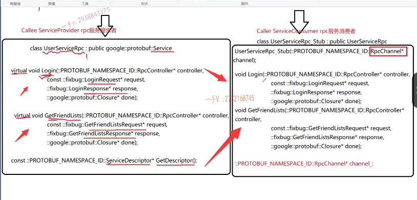

## UserServiceRpc

好，我们继续来说啊。在这个生成的这个源代码上呢，我们说不仅仅看到了这个。user service rpc我们还看到了这么一个杠stop，这么一个类。对不对诶？从谁继承而来？从我们刚才看到的user service rpc继承而来的。

从我们刚才看到的user service rpc继承而来的。对不对哎？我们写到这儿啊。==实际上，这都是以后你在说这个框架的时候啊。你应该去描述。这都比较原理性的东西。==

==对不对？我们怎么通过protel buffer在实现rpc远程调用的过程中，用protel buffer做？rpc方法调用的序列化跟反序列化呢？提供了这么一些操作，对不对？==

# caller rpc服务的消费者

好那么user service？rpc装这么一个类。那么，同学们，这个类是用在哪一堆儿的？==你在rpc方法调用的发起端的就是调用端的caller这一端的==。啊，caller这一端。

好吧，我们先写到这儿啊caller这一端的，我们也把它叫做service consumer叫做服务，叫做rpc服务。服务的消费者。啊，你在任何的rpc框架去看，去学习它的时候，你都会见到这样的词语服务的提供者==rpc服务的消费者==对吧啊？这里边儿所谓的消费服务服提供服务，主要指的就是这里边儿。服务对象里边儿的服务方法好吧啊，服务对象服务方法。

我们在oop当中呢。这个rpc方法一般都是请求的，是对象的方法对吧啊？当然你也可以请求像这种c这种方法。都是可以的啊，看具体的这个项目的这个需求好吧？

## 没有构造函数

那么，在这里边儿，大家来继续跟我看一下。在这儿这个类里边儿有什么方法？那手签的这里边有一个比较怪异的东西呢，就是。它的没有默认构造函数，不像刚才的user service rpc有默认构造函数啊。

## rpc channel

同学们来仔细的跟我看一看。它首先是有这样的一个东西。什么东西呢？就是。比较特殊的一个构造函数。它这个构造函数不是默认的构造函数。它这个构造函数是一个。带参数的构造函数。带个什么东西呢？这个rpc channel。你看这又是一个我们。==必须要关注的一个东西。rPC Channel好吧啊==。

## rpc channel初始化一下

而且呢，它有一个成员变量，你看它有一个成员变量啊。它有一个成员变量诶。还有一个成员变量。那常用变量也是rpc China。我们现在看的是test BB点h，你把test PB点CC打开以后。你肯定就会发现它的构造函数肯定就是通过构造函数接收一个实参rpc channel的一个指针。给它的成员变量rpc channel这个指针初始化一下。对不对的啊？初始化一下。

那么，各位它还有什么方法呢？诶.它也有这两个方法。你看到了吧，它也有这两个方法。它也有这两个方法。很奇怪吧，为什么这两个长得这么相似呢？到现在来看。

区别有这么几点？第一点它有没有默认构造函数？也就是说，它构造这个对象的时候呢，不需要传入任何参数，对吧？它有没有默认构造函数的？没有。

它要构造一个。user service rpc_stub这么一个桩类啊，你必须呢得传入一个rpc channel，而且它有一个成员变量。rpc channel指针接收了这个实参。

## stub类其实这些函数也是虚函数，也是重写

好吧啊，这个类里边儿还有这两个方法，但这两个方法跟这个左边儿用在。rpc服务提供者这一端的方法不一样的是，它不是虚函数。是不是虚函数？不是虚函数。对不对啊？实际上它是虚函数，为什么？

因为它从这个类继承而来的嘛？那基类的这个方法是个虚函数和派生类的，这个方法都是同名的，它就是虚函数，只不过重写了一下而已。

## 底层都调用了channel的callmethod方法

对吧啊，重写的时候实现的时候，它实现了个啥东西啊？来瞧一瞧啊。打到test_PB.CC里边儿。login，我们突然发现啊。这个login方法跟get friends list方法的实现。咋这么相似的呢？不管是调用logo方法还是调用get friend list方法，

==它好像底层都是调用了谁。啊，都是调用了这个channel的call method的方法。==

## 画一下

是不是来我这画一画啊？这个项目对于大家来说呢？绝对是有挑战性的啊。再来看这个get。大家看看啊，那也就是说呢，当你啊用这个类对象调用这个logo方法跟get friend list方法的时候呢？诶，它调用的都是这个成员变量，这个channel调用的是channel的call method的方法，也就是说呢，

==你不管用这个桩类。调用哪一个服务方法，它最终都转到这个channel的谁谁上了channel的call method方法上。==

啊，传的是这个method 0 method 1这零跟一肯定区分的是到底是哪个方法，对吧？其他的这个参数。啊，照传不误，是不是啊？现在一切的这个。呃，矛盾呢？都转到这个rpc channel上了，为什么呢？因为我这一桩类里边儿所有的方法实现根本没有实现什么具体的业务逻辑。而是都直接调用了你这个channel的call method的方法。

## 什么是RPC channel

## 纯虚函数 抽象类

对着没哎，那什么？什么是rpc channel呢？我们来看一看哦。rpc channel长得非常的清秀啊。啊，它就是一个。什么东西呀？看一看class rpc channel。它有一个什么方法？它是个抽象类。因为它有一个。纯的虚函数commerce。

## 意味着我们自己实现类，然后重写call method，到时候这个桩类调用方法时，就调用我们重写的

那也就意味着呢，我们必须自己去实现一个类从rpc channel呢，怎么样啊？继承而来，然后把这个call method是不是重写一下呀？呃，重写一下。这是必须的，这是个抽象类。这是个纯虚函数。我们必须自定义一个类。从rpc channel呢，继承上来重写这个call me ta的方法，那到时候呢，你用这个桩类调用的所有的方法。是不是都调用到了我们从我我我？

哎，我们在这儿写一下吧啊，要不然光口述呢，有些同学可能就有点木木的啊。

## 自己实现类继承，重写

==my rpc Channle继承这个public rpc Channel.这里边是不是重写的什么方法呀？重写的call method的方法。==

## 派生类对象指针用基类对象指针接收

==那也就是说呢，到时候我给你我创建你这个user service rpc stub对象的时候呢？你这构造函数需要一个rpc channel，我就把my rpc channel这个对象传给你。派生类对象是可以用基类指针来接收的嘛==，对不对？

## 基类指针指向派生类，通过多态调用 myrpc channel 的方法

哎，到时候呢，你调用这个桩类的，这个login或get friendlist 的类似方法的时候呢，你都是==通过这个基类指针指向了派生类的是不是同名覆盖方法呀？这里边儿经过多态调用，也就是说用装类不管调用哪个方法，最终都调用到了 myrPC channel的call mehtod的方法==。

我在这里边儿就可以进行一个rpc方法的一个序列化，然后发起一个远程的rpc调用请求。对吧啊，

做的这么厉害的一件事情啊，到底怎么做？啊，我们得一点一点抽丝剥茧的来告诉大家是不是哎，这一句话也说不清楚的啊。

## 总结

好，那在这里边儿呢？我们讲到说到这儿，我们大概就给大家呢介绍清楚了，不是大概，是基本上介绍清楚了。如果呢啊，你能够明白的话啊。

那也就是说，再强调一遍message定义的类型是专门用作。

还rpc方法参数跟返回值的一个序列化跟反序列化，这些类型呢，最终都是从message继承而来。好不好？不要忘了，我们会用到。

另外，我们定义的一个描述rpc这个方法的这么一个服务类，经过protelc生成以后的话呢它。会生成两个类，一个是按我们service后边儿命名的一个class user service RP。==这是用在哪一端的rpc服务提供者，就是真真正正执行rpc方法的这一端==。好吧，它是从这个service这个类继承而来，

这个service这个类不是我不是我写的，是pro to buffer人家提的。然后呢，==它里边儿有我们rpc方法的，是不是虚函数啊？啊，还有提供了一个get descriptor描述一个服务的啊，服务怎么描述嘛？有服务的名字以及服务的方法==。

对不对啊？好，就这这几个。那么，==用在rpc服务提供者这一端的user service rpc的构造函数？不用传参数啊==。

另外，它还生成了对应的一个_service stub，这么一个代理类。这个类似的角色。==就是这个是rbc调用方的这个桩类代理类==。对于我来说，我只管调用rpc方法就行了，至于rpc方法调用的数据序列化以及网络的这么一些细节，再通过网络接收响应值再反序列化，我们的结果对吧？这都交给我这个桩类来做就行了。就这个角色好吧。

哎，它的这个定义对象需要常用的rpc channel rpc channel是个抽象类，

里边儿有一个抽象方法叫做call_method。所以rpc channel本身是无法实例化对象的，我们必须自己去定义一个类。

从rpc前头这个抽象来记上来，这都是我们CA加的基本概念了。在我的CA加基础课程里边儿，都给大家讲到了好。好吧啊，这一点呃，毋庸置疑的，不用再做过多解释了。嗯，你通过这个stub这个类对象调用的这些服务方法，最终呢，它pro to buffer底层实现的都是调用的。

channel基类指针指向的派生类对象重写的这个call method的方法。

他把程序的逻辑流程都转到这儿来了。然后在这儿我们就可以统一的知道。你想调用哪个方法？对不对诶？它的参数都有哪些？那最后我还可以接受的响应。是不是啊？我进行相应的一个处理。好的吧啊，那么经过这两节课，对于这个total buffer所。描述的这个service服务类跟rpc方法描述生成以后的这个类的一个解读。它的这个常用的这个方法。以及它在我们rpc调用过程中处于哪个角色。

# 总结

实际上，你把这个图如果真真正正能够理解的话，那我们在写这个rpc框架的这个核心部分其实都已经有了。好的吧，如果呢你？还是并不太并不是太理解，那也就是说呢，我们有些同学呢啊，就学完一个C加加的基础就跑过来。去学习这个项目的话，那我不太建议啊。这样我呃，这个分布式呢，本身就比较复杂，对不对啊？

大家最好有一定的这个。嗯，项目实践基础，也就是我之前给大家建议，最好把这个。集群的聊天通信。项目做完了以后呢，再来做分布式。集群再切换到分布式。啊，结合我之前讲的这个理论知识，再到代码的这个实践。你理解的会更好一点，再者你有一定的实践能力。对吧，

你理解东西也快啊。如果这块儿我已经讲的是非常简单了，如果你还是不能了解或只只能get到百分之三四十的话呢？那就是说呢。你的能力水平可能还没有到达我们这个项目所要求的这个阶段。说到这儿，你最起码把我说的这儿能掌握到70%到80%。那基本上就差不多了，对吧？能理解它的这么一过程，至于它怎么用这个，我们到时候在项目的实践。环节中会具体给大家讲。好，那这节课的主要内容我们就先给大家说到这里，

这里边儿我们给大家揭露了一些东西，表象的东西。其深层次在分布式网络通信框架中如何去起一些非常重要的作用，你这些方法我重写了那。实现哪些代码呢？对吧？这个我们留在项目的实践过程中，再给大家写。讲解OK，那我们这节课就先给大家说到这里。

