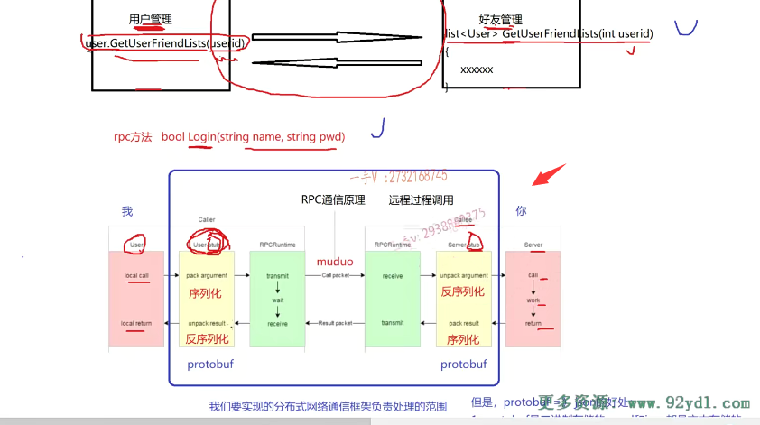

从这节课开始呢，我们就进入。我们这一项目的主题啊，分布式网络通信框架的一个编码阶段了。那么，注意我们再强调一遍，我们开发的是一个框架类。的一个项。呃，就是这个框架呢？呃，侧重于这个给上层应用啊，提供一个很方便的，你可以把你上层应用的一个本地的方法。快速的部署成一个rpc方法呃，

这个框架本身是不做任何的业务的，对吧啊？业务是属于应用级别的。框架是属于平台层。但是呢，脱离了业务呢，我们直接去写这个框架，就是只做框架开发啊，就脱离了实际的应用场景。我们只做框架的开发，大家可能呢就是。听的就不太清楚了，对吧？所以呢，我在带着大家写这个分布式网络通信框架项目的时候呢，

并不会说是从前到后呢，一直在写框架代码。实际上，我是给大家以这样的角色，就是先引出这个业务需求啊。啊，先引出这个业务需求，通过业务需求，哎，需要完成什么？我想把这个业务从本地服务变成rpc服务。而我想用你框架，我想让你框架给我提供什么样的功能，就是我以这个。呃，

业务为驱动来逐步的一点一点的完成，我们这个分布式网络通信框架的这个。代码好吧啊，以这样的方式来进行开发的话呢，大家呢呃，不仅仅最终能掌握框架的这个代码，更重要的是掌握。为什么它要这样做？它给我们应用级别的这个业务提供了哪些好处？

好的吧啊好，那我们之前几节课呢，给大家讲了pro to buffer。讲到pro to buffer的时候呢，又给大家讲了这个user service rpc，有一个logan跟一个。

get friend lists这样的。两个方法，我们就以这样的方法呢。呃，先演示他们做本地业务。哎，再把它做成rpc远程服务。在这样的业务驱动的情况下，我们看看我们需要框架给我们提供什么，我们怎么样设计设计一个良好的框架？好吧，行，那在真真正正开始编代码之前呢，先再继续跟我看一下我们。整个儿的项目的这个目录的这个结构啊，

## 目录结构

我再强调一遍，跟我一起来回忆一下bin放什么放可执行文件。啊，我们就是用这个框架的这个。嗯，服务的提供者跟服务的消费者肯定最终都是生成可执行文件的，对吧？build放的是cm ake。构建这个编译啊，我们项目。的中间的文件example放的就是使用框架的这个服务的消费者跟。服务的提供者好吧lib我们框架最终编译成这个动态库啊，给别人使用了。src，这就是放我们框架的源代码好吧？

test里边我们。给大家放的是在我们讲解这个项目过程中，给大家所教授的这个port buffer，包括后边的这个zookeeper的一些示例代码啊。那么auto build点AC，这是我们最后写的这个。一键编译啊，这个read me。写的是我们这个项目的一个自述文件啊。c make list，这就是我们这个。项目的这个顶级目录的这个cm ake所需要寻找的这个文件啊。那么，关于cm ake如何去构建项目集成编译环境，这个我们在。

前面儿给大家都说过啊，在这个集群的聊天服务器项目中，给大家已经讲解过了，在这儿我们就直接使用就可以了。大家看在这里边，我在顶级的simic list里边儿已经定义了啊。我要求的这个cm的版本不低于三点零。给我们当前这个项目起的名字叫mpr PC。就是我们框架这个名字啊。然后我统一的在全局啊，就顶级的这个simic list里边儿设置了全局，你只要编译生成这个可执行文件，你就放在这个当前。根目录下的这个b目录。你要是库文件好吧啊。

你要在这里边啊。呃，设置这个什么东西啊？库文件对不对啊？库文件要生成库文件，那就把库文件放在这个就是library output path。放在这个。项目根目录的这个lab。这个框架生成的就是。动态库文件使用框架的服务的消费者跟提供者生成的是可执行文件放到这里边啊。然后整个儿项目呢，在编写代码的时候呢，编译代码的时候需要搜索的头文件的路径，那我们给它先添加了这些啊。后边儿不够用的时候，

你再往进里边儿添加相应的这个路径就行了，这是头文件的路径，相当于就是我们j加加编译命令。或者是GCC编译命令里边的杠I杠大写的I。对吧啊，指定图文件路径啊。这个是大写的l，这个是指定库文件这个路径的好不好啊？因为我们根目录下没有这个需要编译的文件啊，所以呢add subdirectory在src下继续去找。相应的，这个c make lists。来生成呢，相应的makefile。用用于构建我们整个项目的编译好吧啊。

那么，在这里边儿呢？我们。不仅仅给添加src呀，还得添加谁呀？可以添加EX。mple.呃src这是放框架代码的，这是放我们使用框架的服务提供者跟消费者的啊。

在这儿呢，你看啊，我在example下呢，给大家又建了两个文件夹，一个是caller，一个是callee对应我们图上这里边的什么？

什么东西啊？这个caller跟caller caller里边儿就是我们。写什么服务？消费者就是调用一个rpc服务的。消费rpc服务的靠利是什么？就是提供rpc服务的。它是支撑rpc服务的。它是运行rpc服务，它可以接受远程rpc调用的请求，是不是在这儿给你执行rpc服务啊？对，这相当于就是example里边的代码，相当于就是我们业务的代码。好吧啊，业务代码我们给大家说了，

给大家讲这个框架就是通过业务来驱动我们框架的开发，大家才能真真正正的去了解框架，为什么这样开发，为什么这样写，为什么要提供这些功能？对不对啊？那src里边提供的。是框架所有代码。

好不好？那么。在这里边儿啊，给大家介绍清楚了这个项目的这个结构以后呢啊，我们。就来看了啊，我们就来看了。看什么东西呢？大家来看啊。

哪个，caller跟callee？哪个是服务的发布者呢？服务的这个提供者哪个呀？callee是不是那么大家来在这儿，

我在callee里边儿，我现处在业务方。我创建了一个文件，比如说是user service.CC。啊，各位好吧。那在这里边儿呢？大家看看啊。

假如说呢，这里边儿本来呀，它有一个本地的服务。这user service本身呢，是一个本地的服务啊。user service啊，原来。它原来是一个。本地服务。提供了两个进程内的。本地方法叫什么呀？logan和get。friend lists.好吧啊，那么大家在这来看。

## login方法

我提供了这个。login.它有用户名跟密码对不对啊？我们打印一下啊。这里边儿还得提供这个。string头文件是不是啊？这是doing。这个local。local service谁呀？login好吧。然后呢？它的这个。我们把这个参数也写一下啊。分成两行打印吧。name pwd.

好，还有一个什么东西啊？还有一个是个。user就是获取呢。所有什么呀，获取所有这个。指定用户啊的所有的这个好友信息对不对？行，这个这是另外一个方法，我们。到时候呢把。呃，这个框架写完了，再把第二个方法呢给大家再做一个示例。呃，

进一步的进行一个讲解好不好啊？那我们现在先力求简单，我们就写这样的一个方法。登录的方法。好不好啊？登录的方法。

那么大家来看看。本来呢，我这就是一个普通的类，有一个普通的方法，这个普通的方法呢？啊，我们就是专门去做用户对象的登录服务的。啊，传入这个用户名密码对吧？

在这里边儿，我们可能会去检测一些red is缓存啊，或者说是缓存上没有命中我们去。去这个什么地方啊？是这个数据库里边儿再去检验对不对啊？这就是我们所做的这个业务了。但是现在我们业务具体怎么做，我们不关心，我们在这里边儿就加一下打印就代表呢，我来做这个业务。

现在我的需求是什么？我的需求是有没有这样的一个框架，能够让我啊把user service这个类？生成的对象的logo方法啊，就是这个user service用户服务对象的log方法直接变成一个rpc远程方法。

觉得不仅仅可以在进程内部调用，我在同一台机器上的其他进程调用这个方法，或者甚至在其他的机器上来调用这个方法，都是可以调用的。怎么做呢？这就是我们想让这个框架所完成的事情。好的吧啊，那有的同学如果还不明白的话呢啊。我相信你到已经做到这个项目了，应该有人应该有一些理解力了啊，就是你现在呢？你看只能是不是去这样去调用啊？那你这样调用肯定没什么问题的。是不是啊？这就相当于是同一个进程里边儿调用当前进程内里边儿一个类对象的方法，

这是没有问题的。对吧啊，==但是现在其他进程调用你这个对象的方法呢？远程的这个机器有一个进程来调用你这台机器上的这个对象的这个方法该怎么调==？这就是涉及了我也我想把logo设计成一个rpc的方法。可以支持远程的rpc调用的分布式调用的。对不对啊？好了。那么来看啊。要做这一点，首先呢，我们知道。进行rbc远程通信不管你。用不用protobuf啊，中间这一块儿呢，

## 远程调用的要求

你要进行远程请求一个方法调用,你不仅仅得带方法的名字。还得带方法的参数。啊，在这儿把方法执行完了以后，是不是还有方法的？这个返回值啊，所以这里边儿涉及了这个方法，名字方法，参数以及方法的这个返。回值的数据的序列化跟反序列化，这里边儿你总得有一个。这个啊，中间的这么一个技术来完成这个rpc调用相关的信息的序列化。序列化在这里边儿，

我们选择的是pro to buffer。

## 定义user.proto

好吧啊，所以呢，在使用的时候呢，在这儿example这里边呢。它就定义了一个。user点proto啦。那么，这是protel文件，

大家来跟我看一下啊，这是protel 3。对不对package fix bug？这是我们说的生成的这个namespace。message这是login request。里边儿有什么东西啊？

呃，name。还有什么东西啊？password.对不对啊？

还有一个东西就是message打包的是result code。第一个是。错误码对吧啊？错误码int三二，我们写一个。air code等。一还有一个错误的有发生错误了，有错误消息error message=2。

那么我们现在在写一个登录的，一个响应的消息response。

response好，大家来看看啊。response response的话呢，首先它有一个result code。啊，result=1，然后有一个什么呢？有一个布尔值。success来表示，登录呢是否成功这个相当于就是在pro to buffer上定义了这个请求，这个方法的这个。这个啊，不是请求这个方法，是登录这个方法的请求，就是参数类型。

跟这个方法执行完了，返回值的这个类型对吧

当然你还得标识这个方法呀。啊，我们给它起名叫user service rpc。里边儿可以定义rpc方法。我们方法名字叫logo，实际上这个logo呢，跟你本地的这个方法啊。名字相不相同其实无所谓的啊，其实无所谓的，你最好保持一致啊。这里边参数类型就是login request。啊，这个returns叫做什么呀？log in response。

## 总结

我们给大家说了嘛，你远程请求无非就是你告诉我你想调哪个函数函数名字？调用这个函数参数是什么？然后我调用完了，我给你返回什么类型，这不就在这protel文件里边定义好了吗？啊，这是函数的参数类型，这是函数的返回值类型，这是这个rpc函数的描述啊，是不是就这三部分？

## service rpc 方法生成前需要加options

对，注意啊，这个service rpc方法的这个。呃，生成就是proto用pro toc生成相应的CA加代码的时候啊，这个要加一个option，否则呢？service类生生成不了，

对吧？那个option怎么加来着？各位叫做CC杠generic。杠services true。你要用proc。通过proto文件生成JAVA代码的话，把这前面改成JAVA。

## 生成

对吧啊好，那在这里边我们怎么生成呢？各位在这里。我们来打开它的这个terminal。啊，terminal在这里边儿应该是在我的example里边儿。是吧，刚才定义的这个user protel用protelc。user连proto el。杠杠cpp下横杠out等于点杠生成的。文件在当前目录下。看生成了吧。哎，生成了是不是生成了？

## CMAKELIST 文件编写，编译过程

对，那么在这里边儿，我在顶级的这个目录里边儿添加一些头文件的搜索路径，这不仅仅在src。还有在我根目录下的example里边，是不是也有啊？诶example里边也有。好的吧啊，我们现在就要去构建啊，这个编译了啊。

## 在example文件夹下新建CmakeList.txt

然后呢？这是在example目录里边儿继续去找cmake lists，在这里边儿还没有。那我们要建一下cmake list.TXT。这个里边呢？啥也没有哎。那就是继续，因为在这里边儿，我要继续深入到call里或者caller里边儿，是不是去找啊？那么在这儿，它在。添加一下一个子目录就行了。好吧，这是非常简单的，

## 在callee下新建CMAKELIST.txt

然后在callee下呢。我们创建cmakelists点TXT啊。==cm ake构建项目集成编译环境嘛，从顶级目录开始，往指定的add subdirectory就是子目录里边儿去找这个c make list。这个编译描述文件对吧啊？这个编译描述文件都非常简单的啊。==

好，那么在这里边儿大家来看啊。那我现在着手把这个要变成一个rpc服务。该怎么办？

## 定义service类proto.c生成2个

首先。上节课给大家说了，当你去定义这样的一个service类以后呢，通过protocol c生成的代码会生成两个，一个是user service rpc。一个是user service rpc_stub，

## 服务提供者 需要重写Service虚函数

==这个应该没有忘吧？哎，这个是使用在服务提供者方的。那就是说呢，它是从service继承而来==。诶，把用户提供的这些方法呢？这login，get friends lists 生成了相应的虚函数啊？==那生成虚函数，那肯定是希望在派生类中去重写一下啊==，该怎么用？

## 包含user.pb.h

大家来看看啊。那么，在这个user service.CC里边，我们得包含什么东西？我们得包含这个user.PB.h了。就包含它上边这个user .PB.h。好不好啊啊user .PB.h？

## 出现了找不到类的情况

那么在这里边呢？我们叫做public。user这个service。rpc了啊，这里边是。没有找见对吧？没有找见那是因为没有怎么样啊？

# 解决办法

## 步骤1：怀疑没有编写完CMAKEliST

没有去设置。这个原文件的这个搜索的这么一个。什么东西呢？我们看看啊，是不是是因为没有设置我们？那我们在这儿simic lists写一下吧啊。这儿set这个是src杠list，这都包含哪些原文件呢？

是user。service点CC。还有我上一季目录的谁啊？user点PB点CC就是在这个目录里边儿，因为这个user的CC要生成一个main函数嘛，因为它需要在这里边儿发布rpc方法嘛。

对吧，这是一个rpc服务的提供者。这是要生成一个可执行文件的。

这个源码的这个列表是就是通过这个文件跟user.PB.CC上一级目录user.PB.CC生成这个可执行文件啊。

user点PB点CC生成这个可执行文件啊。那么，生成可执行文件是吧？生成可执行文件就是add executable了啊？我们把它称作呢。provider provider.什么东西啊，就是服务的。提供者好不好？啊，服务的这个提供者，

这是一个可执行文件，可执行文件的名字就叫做这个provider。好，这个应该是。simic lists也非常简单。

## 1失败

但是这块儿依然是怎么样啊？依然是找不着这个类，对不对？必然是找不到这个类。找不到这个类的话呢，

## 2 怀疑包含的文件路径错误

这个应该因因为是这个头文件啊，在这。你看这个图文件应该是。我的原文件在这个co下边儿。这个。生成的这个。就是rbc提供者跟消费者。它们都是公共共享这个user点proto el，因为它们俩的。因为它们俩对于这个rpc方法。的这个类型嘛。这应该是。公共的嘛，对吧啊，不应该是一人一份儿嘛，所以把它俩放在call里呢，跟caller的这个外层目录。所以包含的时候呢，在这儿。而我们得需要呢？

这样去包含一下。上一级目录的这个里边儿是不是啊？我们去。瞅一瞅啊。我们去瞅一瞅这个里边儿是不是有这个方法？有呢，是不是有这个方法？

## 编译一下

好，大家稍等一下啊。有这个方法，为什么要给我报错呢？啊，我先编译一下吧。我先编译一下啊。

## build 里面cmake ..

我现在这个build目录里边儿用cm ake点点。

我编一下，看看情况。大家来看啊，这个。

发现错误了，需要删除src

==把顶级目录的这个先注释掉，因为src下边儿现在没代码，只有example下边儿才有==。再重新生成OK，现在生成了。

## 发现还是找不到

编译，编译以后呢，在这儿发现我们user service点CC第九行。第九行。啊，第九行这里边儿。

少一个这个东西，对吧？少一个这个东西，那主要还是因为。这找不着啊，这找不着原因很明显。

## 3.名字作用域空间

同学们在写的时候呢，可能也会经常犯这个错误，为什么呀？因为我们定义了这个生成的这个类都在名字空间中余下的。但是我现在是不是都没有用啊？

## 有了cmake 包含的头文件会去搜索

实际上，在顶级目录里边儿，我们已经添加了搜索的这个头文件，搜索路径有example，

那么也就是说呢，它是可以自己。当你在这里边直接包含user点PB点h的时候呢？有些同学认为啊啊，有些同学认为。你这个callee下边儿的这个user service点CC跟这个user点pp点h又没有在同一个目录下，怎么能直接这样包含呢？没关系啊，因为c mac会根据你指定的这个头文件的搜索路径给你去搜索你相应的想包含的头。文件的好不好啊？在这里边儿之所以有这个问题，那是因为有什么东西啊？

## 包含名字空间

你可以在前面加一个fix bug，你也可以在这using namespace。fix bark啊，

现在是不是就找找好了对，因为他们都在名字空间作用域下啊。那我们给大家一边讲一边写，忘了这回事儿了啊，大家也有可能遇见这样的问题，注意啊。啊，注意名字，空间是为了解决全局的名字冲突问题的。实际上，我们在这里边儿是为了偷懒啊，是为了偷懒写了这东西，实际上你应该都在这里边儿直接写fix bug。写写这个。对吧啊，

千万不要试图去省略这个名字，空间这不是一个好的。习惯啊，

## 服务提供者只需要继承这个类

那么各位在这里边儿，我继承了这个方法，注意这是使用在哪里的？使用在。rpc rpc服务。发布端的。发布端。啊，就是提供rpc服务的提供者。你想在网络上提供一个rpc服务，你。从这个类继承出来就行了啊，

那这个类呢？我们说了。它是不是有这样的一个方法呀？你把这个方法重写一下就行。有些同学现在就有点儿迷了啊，有点儿迷了。不要着急啊，不要着急。不要迷啊，不要迷，不要着急。

## 重写方法login

那在这里边儿这个。我们直接把它写成google protobuf好吧。

那么在这里边。我重写的这个方法。重写基类。user service rpc的。虚函数。

## 为什么要重写这个函数

有些同学说你重写的这个函数是干什么用的啊？你注意啊。这个方法呢？下面这些方法。都是。框架给我们，框架直接调用的。大家现在想一想角色啊，我们站在这个login方法的时候呢，

我们是处在呀。caller的角色还是call lee的角色呀。

## 我们login方法是服务提供者

站在这个地方。我们是属于caller的角色，还是callee的角色呀？实际上，我们是服务的发布者，我们是服务的提供者。

## 远端发起请求调用login方法

那也就是说呢。现在你这个是我啊，你是远端，你远端现在发起一个。想调用我这一端，这台机器上的user对象的这个logo方法的话。

## 请求首先被我们这边框架所接收

首先，你会发起一个rpc请求。是不是啊？是我这儿接收你的rpc请求吗？不是。啊，因为你发过来的这个远端的这个网络的rpc请求是先被我们RPC框架所接受的。

## 框架根据请求来匹配login方法

rpc框架呢？根据你发过来的这个请求诶，你是哪请求哪个方法你都有哪些参数？诶，然后呢？帮我们匹配到。这个login方法，

## 处理好之后，返回给框架，框架再返回去

然后呢，它就会帮我们把这个网络上发的这个请求。怎么样？上报上来。我们接收到这个请求，以后呢，我们从请求里边儿拿出数据，然后做本地业务，然后填相应的响应。然后再执行一个回调，相当于把这个执行完的这个rpc方法。的返回值在塞给框架，由框架给我们进行数据的序列化，再通过框架的网络。啊，响应返回去发送给你。

## 我们是用框架

在这里边，我描述的这一段文，这一段内容呢，你是否能够明白呢？实际上，这块儿不属于框架的代码，这是我们在用框架。

好吧啊，那大家。如果你没有。很好的理解，或者说是根本没有get到我刚才说的任何的这个信息，我建议你把它倒回去，把视频倒回去。

再多听几遍啊，再多听几遍。好不好哎？多听几遍，那么是我刚才说的这一段儿话呢，是非常重要的啊。好，==我在在这里边儿把这个login方法的一个基本的一个书写。啊，然后我给大家写一遍，也就是把它的整个儿的逻辑思路呢，再给大家呢捋捋清楚。==

## 下节课写login方法