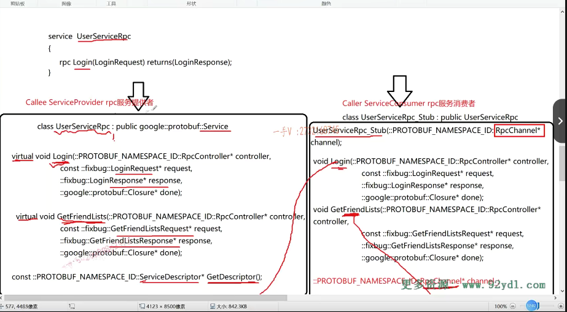

好，那我给大家把这个logo呢？给大家再梳理一遍啊，在梳理之前呢，我再把这个。问题的背景再给大家来。来写写清楚啊，以免大家呢，犯糊涂。听明白的同学再加深一下印象，看能不能你自己去把这个表述一下对吧啊，我来描述框架怎么用我们？框架是怎么基于put buffer在这里边儿做数据的序列化跟反序列化的，对不对

## 首先

首先呢？是什么呀？是你rpc就是caller。这是一个rpc的调用者，想发起一个远程的rpc请求。是不是诶，发起一个rpc请求。它把要调用的这个login。以及什么啊？以及这里边的这个login。request这都打包好，通过这个网络moduo库给我们发送到，是不是callee这一端了？发送到callee这一端的时候呢，

它不是说在这儿啊，发送过来以后不是说这个粉红色的就直接接收到了它。它通过网络发送，发送的是我这一端的蓝呃，这个绿色就是网络模块儿。啊，上报这个字节流，再到黄色的这一块儿啊，进行数据反序列化，这都是我框架做的事情，好吧啊。

那我框架在这里边啊，这个callee。根据啊，接收到的。这个东西。

根据啊，接收到的这个东西啊。然后呢？就把这个。调用啊，就把这个调用，因为他发现我想请求这个log方法。啊，就应该是想请你，想请求远端，想请求这个login方法。他就把这个logo方法呢，就教到。你重写的这个login方法上来。就交到。重写的。交到下面重写的这个log。方法上了好的吧啊。

## 首先,你想用框架，先写proto文件

那么，这是它大致的一个流程。

就是你在用我框架的时候。==你想发布成rpc方法，那你得先写一个proto文件。==

啊，对不对？来让rpc的调用方也知道你这个rpc方法是怎么提供的。啊，名字叫什么？啊，这个参数的类型是什么？返回值的类型是什么？对吧？

哎，这样呢，你服务的发布者跟服务的提供者呢？就统一都是遵照这个。约束啊，来进行rpc方法发布以及rpc方法请求的。对不对？

## 服务发布方

作为你发布方，你直接继承user service rpc作为服务的这个。

## 服务消费者

消费方你会用到user service rpc杠stub。这个类那当然这一块儿我们还没。还没说呢啊。好，

我重写这个方法。所以这个方法问题的背景已经给大家交代清楚了，

## 第一步，业务获取相应数据

在这儿第一步就是。从这是框架。给我们。框架给业务上报了，这个请求参数谁呢？login request嘛？对不对啊？那么在这里边。业务这个解析应该是反序列化。这里不用反序列化了，这框架已经帮我们反序列化完了。从这个网络的字节流反序列化成这个，是不是业务不是反序列化业务取出？

啊，业务获取相应数据诶。相应数据做本地业务。应用程序获取相应数据，做本地业务来大家看我先。来完成这个啊。

这个是login，当然是要做登录的，这个本地页登录的本地理由需要什么？需要name跟password这个请求参数呢？里边儿都已经携带过来了嘛。

是不是啊？那么大家来看啊怎么取呢？是request什么呀？name，然后是STD。string pwd=request指向的pwd。你看，这就是用protobuf的好处啊，

## protobuf好处

proto buf直接把这个网络上的这个字节流给我们反序列化成我们直接能够识别的login request对象。然后通过它生成的这个方法呢，就可以获取到姓名跟密码了，要我们自己做的话还还得自己去根据什么样的协议去解析哪一段儿哪一段儿是姓名，哪一段儿哪一段儿是密码，对不对啊？

啊，特别麻烦啊，所以这是我们用protobuf。

给我们在这个应用以及网络层呢。啊，应用我们是想直接操作对象，直接操作对象的数据，而网络层它是不认识任何数据的，它只管接收字节流。发送字节流对不对啊？那么，怎么把自己流还原成原始的数对象数据呢啊？这里边儿就涉及了对象数据到字节流的这个。序列化以及接收到字节流再还原成对象的这么一个。反序列化是不是都是由普通buffer来做的啊？

这个完了以后，你当然还可以对name跟password做一些有效性的检查，是不是啊？然后做本地业务。

## 做本地业务

做本地业务就做这个嘛login啊。然后布尔值这个login result.就等于我当前的本地业务方法按name跟pwd。大家能不能看明白，这就是在做什么呀？做本地业务。

==你远程请求的rpc方法，这参数在这儿解析参数，做本地业务。==

## 本地业务做完后，需要返回给调用方

然后呢，这相当于本地业务做完了呀，本地业务做完了，然后呢你应该做什么事情了？各位，你应该把这个响应。把响应给这个调用方是不是返回呀？

## 不需要做什么，只需要填入response

但是我作为业务层啊，我哪知道怎么给人家rpc方法返回？我又不知道网络代码怎么写这个，至于这个响应消息的序列化，以及通过网络发送，这都得交给你框架来做。看框架不是交给了你一个log in response了吗？框架交给你的时候log in response里边儿啥也没有，相当于框架只是创建了一个log in response这么一个。对象啊，然后给你把这个对象的指针传过来了，==它意思是你就不要管数据响应消息怎么序列化以及怎么通过网络发送了？你只需要填好这个东西，我帮你来做剩下的东西==，我帮你来做，你响应消息的序列化跟通过网络发送回去，明白了吧啊，把想用写入那也就是说response。

## 把响应写入

在这里边儿呢，你看啊它。它没有呃，没有发生任何的这个。异常是不是哎？没有发生任何的这个。异常好吧啊，没有发生任何的异常呃嗯。不是true，是不是就是FALSE啊？那么在这儿呢？就是。response.set这是set什么啊？set success。set success呢，就是这里边儿的这个login result。这个方法在这里边儿也没有，我们现在因为没有去写实际的业务，所以在这儿没有什么。异常可处理的。对吧啊，如果呢，这里边儿抛出异常，我们用try catch。来做一下，如果有异常的话，

我们就要写错误码了。

## 哪来的set_success?

## 写错误码

我们就要写错误码了。是不是啊？那我们现在既然是正常执行的，我们也把错误码写一下吧啊。错误码怎么写来着呢？

fix bud。然后里边是个什么呀？result code.星号这code等于啊response。这个指向的。叫个什么东西呀？mutable。result是不是

==code指向的set error code，现在是个几啊？是个零啊==

==code指向的set。errmsg.那是个啥东西？是个空呗。是不是是个空啊？啊，那这就表示没有错误。==

这就表示，既然没有错误，那就没有错误消息了。啊，能理解这意思吧啊，响应这个包括。错误码。错误消息。以及返回值。

那我们现在没有错误，错误码也是。啊空的返回消息给到这儿了。

## 执行回调操作

那你不能光填个response呀？你填个response的话呢，那在这里边接下来怎么做呢？接下来就是。调用。啊，==执行回调操作==，就是protel buffer在这里边儿给我们提供了这么一个途径啊。

## protobuf提供的closure类

就是这里边儿呢，它有一个closure，大家可以深入closure，你看closure是个啥东西哦？

closure里边儿呢，就与纯虚函数啊。所以cloclora是一个抽象类的一个run，我们可以重写这个run，让他来去做一件事情。

## 执行回调函数，但是肯定是调用的重写的run方法

那在这儿呢，你看啊，那我就down。调用它run就行了嘛。

==它肯定不会指向一个closure对象的。因为closure它是一个抽象类啊。它肯定是要怎么样啊？肯定是要定一个类，然后从这个cclosure对象继承而来，==

然后把这个run方法是不是重写一下啊？当然我们也可以给一个匿名的函数对象嘛。兰布达表达式嘛，行不行？那也可以的，对吧啊？嗯，那么在这里边儿呢？这个函数我就写完了

嗯，那么在这里边儿呢？这个函数我就写完了。有些同学说你在写框架吗？同学们，我在写框架吗？我没有写框架，这是业务代码，你想把你的一个本地服务变成远程服务。

# 把你的一个本地服务变成远程服务。

# 总结 需要做两件事

## protobuf 约定好

服务你做两件事情，首先你输出proto给你的rpc调用方啊。跟你约定一个。啊，约定一个，这个前提就是我发布的这个rpc方法，你看长这么一个样子。函数名儿参数类型以及返回值类型，你调的时候就这样调。

## 重写方法

那我发布了以后呢诶，我要从这个类继承而来，重写相应的这个login方法，这个login就是我在proto这里边写的这个rpc方法啊。

## 框架帮我们调方法

这个rpc方法呢？谁来调的？不是我们自己调的，是==框架帮我们调的框架怎么调==呢？那这是框架的代码。我给大家说了，我们以业务来驱动，来逐步来完善框架啊，这样大家就知道呢，我们。框架为什么要这样实现了好吧啊，所以呢，==你现在只需要知道这个logo是由框架帮我们调。远程发过来一个login的请求方法==，难道框架不知道你调用的是哪个函数吗？

你名字你都发过来了，你不知道调用哪个函数啊？都开玩笑的嘛。对不对？所以框架肯定会给我们匹配到哦，人家远程想调用你这个logo跟方法。然后就会把远程传过来的，

==这个请求给你通过这个参数暴露出来，你就可以通过这个请求呢解析出相应。做本地业务需要的参数，然后会去做本地业务。做完以后呢？啊，填写什么呀？填写这个响应消息，填写这个响应消息，还有一个响应消息填写好了，填写好了，一放这儿嘛，肯定不能啊，填写好这个响应消息，你得通过网络发送回去呀==。

## 网络发送前还需要序列化

而且你在网络发送之前，你得先把这个log in response，这个对象序列化成是不是字节码呀？或者是这个。字符流对不对啊？或者字节流都行pro to buffer呢？提供了啊？serious to array，serious to string，是不是这些方法序列化方法都行？那关键是你填写完这个。

## run()来完成发送前的序列化

你要让它推进下一步。你要把这个log in response响应消息进行序列化，再通过网络发送回去，这就是我们最后一步down。用down closure指向的派生类对象的这个run方法。好不好啊？

这个里边儿那肯定就是什么我们猜都能猜到执行什么执行响应。消息响应对象数据的序列化。和什么网络发送嘛？这当然都是都是由。框架来。完成的好吧啊。

任何方法都是这样的。

## 注册方法与login方法一样

任何方法都是这样的。你要在这里边儿提供一些注册方法，你要把注册方法也发布成rpc方法，可以供远程调用的话那。首先你在这里边儿定义注册方法的请求跟响应消息类型，然后在这里边儿再发布一个注册的rpc方法。

那你在这里边儿从user service rpc继承来以后呢？在这儿呢，重写一下，谁重写一下？注册方法。

那就跟这儿就。一样的好吧啊，这里边儿我们先不扩展，我们先以logan给大家做这个示例，来去做一个详细的讲解。好的吧呃okay

那么说到这儿，我们大概能够清楚啊。呃，框架帮我从远端接收到rpc请求以后，它收到了，应该是一个rpc的一个描述。述方法呀。请求参数啊，对吧？

然后它通过一系列的操作呢？啊，然后给我上报到我业务的我。重写的这个logo方法上。

我就很轻松的，只需要从他的请求才能。数据做本地业务填写响应响应消息对象执行一个回调完事儿啊。

一二三四我每一个rpc方法在这里边呢，我都相当于。做四个动作就完了。都很标准的，做四个动作。对吧，只不过不同的方法呢，它的参数不一样。调用的本地的方法也不一样。响应的字段也不一样。这儿都是一样。啊，

==过程都是一模一样。好的吧okay。==

## 总结

那么，这节课呃，相当于我给大家呢，完成了这么一件事情，就是当我们啊。在应用层，在业务层，想把一个本地的一个服务方法发布成一个rpc，可供远程调用的。一个rpc的方法，我要先做什么事情，

## 步骤一

先定义proto。啊定一个rpc方法的描述，

以及它的参数的类型跟响应的消息类型。然后生成用pro toc生成相应的这个。CA加代码，注意这个不要忘了。啊，这个不要忘了，否则呢service rpc方法呢生成。

## 步骤2

呃，接着呢。它会生成两个，一个是user service rpc，一个是user service rpc杠stub。这个user service rpc呢？是给服务的发布者提供的。啊，

就是服务的提供者用。_stub是给消费者用的，

我们现在还没有到消费者，我们现在在讲。怎么把本地服务发布成rpc？对吧，

## 步骤3

然后接着我们现在呢，从这个类继承而来。重写一下，我们在protel文件里边定义的这个rpc。这四个参数。就这个参数rpc controller还没有给大家说。

我大家实际上不用关注这个。啊，不用关注这个后边儿呢，

我们专门花一节课时间给大家讲完这个就行了，这个不重要啊，重要的是这个。这三个参数好的吧，他们都是做什么事情的啊？我刚才在写这个代码的时候，已经给大家。强调很多遍了，大家只需要知道这个方法，由框架帮我们调，到时候该怎么调呢？那这是我们框架。需要完成的核心的动作呀，对吧啊？对于我业务方来说呢，

我的框架使用越简单越好，这里边儿做。的事情就这四件事情好，

那这节课的内容呢？我就先给大家说到这里。写了这个login后，那我真真正正怎么发布呢？对不对？我需要框架给我提供什么操作呢？那下节课我们来给大家。说这些内容。

## 下一节课讲框架给我提供什么操作

