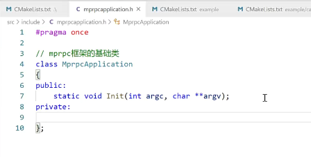
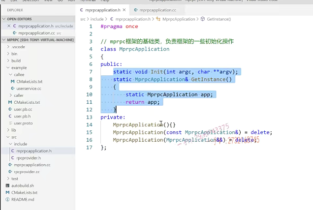

## 框架的使用

呃，大家来跟我继续看。我现在就想把这么一个类。user service用户服务对象的这个login方法发布成rpc方法。啊，我微服务嘛。我就这么一个login方法，我给它单独进行一个部署。对不对哎？跟其他的业务模块儿不做任何的偶合关系。login出问题了，我只需要修改login，重新部署login模块儿，我根本不需要动其他的模块儿。logan的业务量太大的话，

我把这个logan的这个啊，这个rpc站点我部署上多份儿，甚至我可以部署在很多很多的这个机器上。对不对啊？那么在这儿，我希希望使用框架，我希望使用框架，你看我做的这个准备工作都做好了。对不对啊？那你现在不能被函数空着呀，我作为一个rpc发布方，我最起码我也是一个服务器程序啊。我得运行起来，得不断的接收远程的，是不是连接呀？

啊，那么我现在就开始写。框架怎么用？我怎么用这个框架？让人感觉这个框架好用，用起来好简单。啊，我一想，==我要把这个本地服务发布成rpc服务，人家能想起来用我们这个框架==。好吧，

## 框架的初始化

首先呢，一般框架的使用都有一个什么？初始化框架初始化嘛，对不对？

做一些配置的这个初始化日志的初始化啊，在这个项目中像这个配置文件读取呢？还有这个日志模块儿呢。啊，日志模块儿里边儿怎么去实行呃？读写分离对吧啊？做这个读写的这个控制日志的控制这个，我在这个项目中，我们最终都会给大家去把这些模块儿。上的啊，在这儿我希望有这么一个东西。啊，就是在这儿呢先。你要使用我这个框架先调用。

框架的这个初始化操作。

框架的这个初始化操作，假如说呢，我们这里边儿有一类啊，我们这里边儿有一个类叫做什么呀？mpr PC。application就是以我们框架的名字mp rpc application。好吧诶，调用一个应用。

你这个maIn函数都有这个argc叉星星arg v的，因为我们是需要配置文件。因为rpc服务站点是最起码将来需要这个，它也是一个服务器嘛，需要服务器的IP地址端口号儿。需要zookeeper的IP地址端口号，我们不能在代码上写死，

写死就没有什么意思了。这个都是从配置文件而来。我们把这个参数呢？就有这么一个东西。好不好？就是负责我们整个儿框架的初始化操作的好不好？初始化什么呀？配置呀？日志啊？啊，你想做任何的初始化都行。这是一个套路，对吧？因为框架的使用，你最起码要得用一个东西，

让我框架可以进行一些初始化操作嘛，对不对？

## 有类让我发布服务

然后呢？哎，我希望你的框架里边儿能够给我提供这样的一个东西，叫做rpc，你r分布式网络通信框架，无非就是。能够提供服务的这个发布者，跟服务的这个消费者嘛。2 service provider跟service什么consumer嘛？是不是啊？我希望有这样的一个类。provider.r provider a pro vid啊。

这是一个什么对象，专门可以在框架上让我发布什么的。啊，让我发布这个服务的啊

## 发布服务

那你看啊。这个发布服务。notify service。哎，各位。notify service.在这里边儿，我就发布这个服务吧。我new一个吧，这个是不是相当于把这个？

把user service对象。发布到哪里去啊？发布到rpc站点上，发到rpc节点上。它是不是它它应该还具有网络功能？

## 启动服务

哎，然后在这儿呢，你看。provider点run。这里边儿启动一个rpc。服务发布节点

哎，你在这里边儿你你比如说你这个站点上想发布多个这个。rpc服务啊。那你可以调用多次这个provided notify service发布服务呗，

你什么new product商品服务？你可以把商品服务对象里边儿的方法也发布成是不是远程的rpc方法都行的？没问题吧？

如果你的框架能够这样使用，那我觉得就是相当。你看啊，如果能够这样使用的话呢，想把本地业务变成一个远程服务。服务的话，那就非常简单啦。

有定义protel文件。继承这个类重写这样的方法。

打四四套动作是不是啊？打四套动作都是固定的，这都是。

然后呢，要发布服务太简单了。先初始化框架啊。定义一个，这个可以发布服务的对象。在这个对象上发布服务，这实际上是一个网络服务对象。好吧啊，这实际上呢？是一个。provider，你可以理解成。是是一个网络。rpc网络服务对象。服务服务嘛，

它给你提供相应的服务，提供什么服务呢？发布rpc的这个什么呀？发布rpc方法。

启动哎，启动这相当于就是启动一个网络程序了，在这里边儿。run以后。这个程序这个进程啊，进入这个阻塞状态。等待远程的rpc。调用请求。

哎，由框架呢？给你就上报到你这儿来啦，你这儿来处理。在本地执行，人家想。请求的这个业务，然后再把这个结果返回。

通过框架呢，给人。发送回去对不对？整个过程就是这个样子。这能理解我的意思吧。

# 总结

我们给大家说了，我没有直接带着大家去写框架代码。因为框架不同于业务，你不了解它怎么用，在哪里用，

你直接去写框架，你根本不知道在干什么。我们是从业务直接出手的。啊，作为一个用户的角色，如何把一个本地服务发布成一个？远程的rpc服务，这就是我的一些理想化，我想把这个框架以这样简单的方式使用。你当然了，你如果觉得这个太简单了，你还可以。把它复杂点儿使用，但你这个框架呢？是给是给别人用的，

使用起来越复杂，别人就越不想用了。对吧啊，这我是非常简单，我经常相信啊，我写到这儿，这是非常简单的。对不对啊？大家也能看出来，这里边儿已经描述的很清楚了，要把一个本地服务部署成rpc服务，这已经是相当的简单了。就提供这样的几个类就OK了。对不对啊？好了，

然后我们在这儿以框架使用的这个决策啊，进入框架。来书写框架的。这个类这个类，我们先给它把大的这个方向，大的这个框架设计的类呢，给它部署出来。好的吧啊okay

那么在这里边大家跟我看。看框架的代码都在s2。一下，所以先在c make list里边儿。把src的这个子目录打通。

啊，同学们，将来我这个框架是要编译成动态库，给别人使用的。那么不能光给动态库啊头文件是不是也得给啊？所以呢，框架这个src里边儿，我又创建了一个目录，叫做include。好吧，include.有框架设计的头文件都放在src的，include下框架所涉及的源码都放在src。

所以这里边儿就是。包含的这个头文件是根目录下的src底下的。include啊，然后在include这里边儿建立这个头文件嘛。好不好建立头文件啊？

就是mp rpc application点h。OK，

## 编写mprpcapplication.h

这里边儿。一上来PR。pragma once.啊，方式头文件被重复包含。那么，在这里边儿就是。mpr PC.框架的这个。初始化。啊框架的这个。呃，初始化的。

初始化类吧好吧，负责初始化工作啊class就mpr PC APP。applicat ly.然后呢？同学们，我们刚给他提供了一个什么方法呀？我们用的时候啊，怎么用来着？是给大家提供了一静态方法，叫做in it是不是好了，那在这里边儿我写了啊。int那么在这里边儿是一个int argc叉星星AR。gv我们==既然写标准的项目，就写的标准点儿这个头文件里边儿只有声明，没有定义好吧啊。==

## 单例模式设计基础类

那么，在这儿的话。框架的这个基础类。框架的这个基础类啊。基础类框架的基础类，我不需要多个啊，我只要一个框架就行了嘛，对吧？所以我们把它设计成一个什么东？我们把它设计成一个。单例用单例来设计它。没有问题吧？用单例来设计它，因为它包含了一些整个框架所。共享的一些信息，

比如说是配置信息啊，日志信息对不对啊？我希望在框架其他地方使用的时候呢，可以以非常简便的方式。就获取这个框架的基础类，通过这个基础类对象呢？可以获取一些共享的信息啊。所以在这儿。那么各位。private要进行这个。呃，要进行这么一个什么东西啊？单例模式的设计，

我们该怎么设计呢？这是它的这个。

构造函数好不好？delete掉啊。把它所有跟拷贝构造相关的都给它去掉。好不好啊？都给它去掉。那么这里边。我们就先写成这个样子吧啊，写成这个样子。

呃，然后它得提供一个什么方法啊？专门获取实例的一个方法。static get instance.定义唯一的一个实例。return APP.是不是啊？

我先把代码在这儿写了吧？写了我后边儿改成这个。原文件再把它挪过去啊。这比较影响我们的这个思路

## cmake继承编译环境

好，那么大概在这儿呢就是。我们这儿就有了。你得包含一下什么东西啊？你得包含一下这个所谓的。mpr PC.application点h啊。啊，同学，不要以为你看我这个是这个原文件user service点CC在example call了一下。哎，

你这个头文件在src include下这差了十万八千里，怎么能引用上呢？没关系嘛。cm ake构建。项目的集成边环境，它就是这么简单。因为我们在这里边儿已经告诉了这个cmake。你上哪儿去搜索这个头文件去？是不是啊？我这样写，你虽然当前目录下没有，但是我给你指定了头文件搜索路径。你就去搜吧啊，了解了cm ake这些都不是问题好不好？好了，

那么在这儿呢，你看。那这个int就有了。是不是in it到底做一些什么样的初始化操作呢？大家不要去着急。好不好？大家不要去着急啊，我们得一步一步说，我们先把相应的类先给出来。这个rpc provider，这是一个服务对象。那它既然作为rpc。

==服务它有可能有很多人都在请求这个rpc调用的，对不对？所以它必须得做到高并发。==

所以呢，==rpc服务的发布者应该。是使用moduo库来实现==的啊，所以在这儿呢，我们先给它定义一个头文件叫做rpcprovidr.h好不好？

它提供了。pragma once.那么，同学们，这是。框架提供的。专门负责。发布这个rpc服务的。

网络对象类。啊，叫做class rpcprovider.

## 发布服务不能是UserService

这里边儿肯定要做很多事情。其中的一件事情就是叫做notify什么。service好的吧啊，notify service。

从实用的地方来看看啊。那同学们啊。我问大家一个问题啊。这个问题是对我们框架开发是必须要考虑的。notice service，这里边传的是一个user service是吗？那是不是大家觉得我们在这里边儿就得写user service？

的一个指针了。这可是我们框架代码呀。你在框架代码上去写一个user service，你觉得好吗？框架是什么？框架式，它可以接收任何的rpc服务。注册的rpc服务，而不不是说仅仅只能这个接受user service服务。所以呢，在框架开发的时候呢，我们必须呢考虑你框架肯定是不能依赖具体的某一个。一个业务的，对不对？之所以能发布成rpc服务。

那么，各位这些服务都是从我们pro to buffer里边定义的一个rpc基类继承而来的。那么你还有没有印象？我给大家。呃r，这个proto CP ro to buffer里边儿生成的这些？哪都是从哪个类继承来的呀？都是从service继承而来的。service作为一个积累，它是具有抽象意义的。也就是说，激这个service激励的指针是可以接收任意从这个service继承而来的。服务对象。好吧哎，所以在这里边儿，

我们大家就知道了，在框架上啊，你可不能在这里边儿用什么？user service

你应该是用。谷歌的protobuf。然后是。它的什么东西呀？service啊，用这个当然需要包含相应的头文件了啊。google pro buffer.service.h。好不好啊？

就包含头文件了。这就是具有抽象意义的。这里是框架提供给外部使用的可以发布rpc方法的。函数函数结构。

## 可以接收任意的service

所以你这个参数呢？必须得站在抽象的角度去看。你不能接收一个具体的业务层的service。那是不可能的事情，==你在这里边应该是可以接收任意的service都行==，对吧诶，

这就是为什么呢？我们这个rpc服务类啊，从pro to.c就是用pro to buffer生成以后呢，人家都是需要从这个service继承来。

这样一来呢，我们就可以在框架上啊。用这个google pro to buffer的service的这个指针来指向所有从这个类继承而来的。RPC服务对象。

好的吧哎，所以呢，你具体使用的时候呢，你不管是注册。哪一个服务对象？

你这服务对象从protel buffer生成的类继承而来。所以呢，它的基类又是service，那么这个是不是应该也是service类的一个派生？所以都可以用service支持。没有问题吧？哎

哎，再给大家提供一个run方法。

这是启动rpc服务节点。开始提供这个rpc这个服务远程调用,是不是服务啊？哎，这相当于是一个网络服务。

远程网络调用服务来写清楚啊。好了，那在这里边我们用的时候。这里边儿用的就比较舒服了，对吧？哎，看这里边儿有一个has no member notify service。拼写的有问题啊啊，这个sr service啊vice那么你看这样，

## 总结

我们就给框架上补充了两个类。

这个类是干嘛用的框架的基础类？这个负责框架的一些初始化操作。

这个类是干什么干什么用的RP 4？是框架提供的，

专门用于服务发布。专门用于发布rpc服务的网络对象类。

哎，现在我们在框架里边儿写这两个类，我就知道了，它有什么用，它用在哪里？如果一开始我就给大家把这两个类写出来。大家估计。就会说我你是站在上帝视角看问题。你你你了解它，所以你写了两个类，我并不了解。你写了半天，我都不知道它用在哪里？

啊，我是先从它用的地方开始说的。呃，我力求它简单的使用。越简单，用户越喜欢使用你这个开源的。对吧，然后呢，我才去反过来回到框架上去输出相应的东西。好的吧啊，那么大家注意这个。

啊，这一节呢？我们这节课我们主要给大家呢？来列了一下啊，

这个。真真正正启动一个rpc，这个。嗯，服务站点的这个时候呢，我们是怎么去使用这个框架的？啊，涉及到哪些类？对不对？可以非常方便的发布。rpc方法啊，然后启动这个rpc节点，提供了远程rpc调用服务。好，那么这节课呢？

嗯，这个主要的这个内容都已经讲完了，好吧啊？

## 建立实现文件 .cc

那么，我们还有一点时间给大家把这个怎么样啊？或者说啊。这个就布置给大家了啊。把这个相应的这个。什么东西呀？或者我们在这儿写吧，以免我们有些同学呢，不好意思问老师出问题了，又不知道该。该怎么弄？我的意思就是说呢，

你应该在这里边儿。建立这个相应的什么呀？你看mpr PC。application.点CC。你应该把这个。对应的实线写在这个。CC文件里边儿嘛，对吧？然后是rpc provider。点cca 2 PC provider啊。

这个就是include谁呀？include m.p2。pcm PR PC.

这个啊，这是什么呢？这是？rpc provider点h。

## 代码转化为类外实现

OK，那么在这里边儿啊？我把这个所有的文件先close out一下，就把它俩。那么，这些方法呢？

## 类外实现不用加static

这个方法非常简单，我就写到这儿了啊。内外实现静态方法不用带static了。这个没问题吧，这个非常简单，

是不是？

## 删除原来的代码

然后呢？这两个。这个是个空的，这个。构造函数啊，构造函数我们就写到这儿就行了，好不好？OK，那这个就完了，这代码都还没写呢，是不是啊？这个放到我们后边儿，我们一节课讲一个主题。

## 另一个文件的类内声明，类外初始化

然后对于这个。

那就是这两个方法了啊。这都是方法的声明。实现写在对应的CC文件里边。写到这儿啊。好了吧啊okay。

好了，那我们就。在框架上把这两个mp rpc application跟rpc provider这两个类呢？就先给大家输出到这。啊，先把总的这个类级别的这个框架先打好。

# 总结

好吧，行，那希望大家呢？通过这节课的学习。

啊，知道我们怎么去使用框架，使用框架发布rpc方法的时候都涉及到了这两个类，对吧？怎么去调用什它它的什么方法去发布一个服务对象？然后再启动rpc服务站。那涉及的这两个类提供了这。方法GE 2。三个方法，具体怎么实现我们后边再给大家？希望大家呢？不仅仅光听，也自己操作一下，操作的过程中想一想啊。诶，

为什么要这样用？这样用有没有道理？好吧。这个编程它属于一个科学，不是神学。啊，不是我碰诶碰诶对了，哎呀，终于编过了，哎，终于没错误了啊，我不知道改哪儿了，反正它就好了啊，它一会儿又错了。千万不要这样子。

去学习这样的学习永远是稀里糊涂。你都靠运气在这儿过日子呢，是不是这是一科学任何的操作都是有道理的啊？不管是在编码上。还有在做设计的意义上。我们这样写是有目的。简单的方式让用户喜爱的方式非常简单的方式。啊，小白都可以通过我们这个框架去把自己的本地服务发布成。可以分布式部署的远程的rpc服务。好吧啊okay，那我们这节课的内容就先给大家说到这里。

