## 其实是cmake产生的问题

实际上呢，刚才。啊，上节课呢，我们最后给大家编译这个代码的时候发现呢。在编译我们的这个框架mpr PC的时候呢，它出现了一个。符号啊，找不到的，这个链接错误，就是说load config feel跟load呢，找不着对不对啊？如果我们用它找不着。实际上呢，你如果去看一下啊。

啊，我们发现如果把这个项目build文件夹里边儿的这个文件呢？全部删掉。我们自己在这c mic编译。然后make。你看它有没有报任何的错误啊？没有报，实际上呢，就是我们刚才遇到的这个mpr PC框架的链接的这个问题呢其实。不是问题啊，是我们cm ake这里边儿产生的问题，什么意思呢？

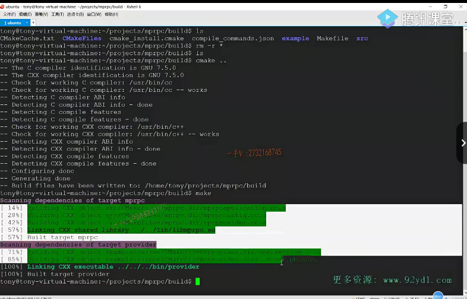

我给大家解释一下啊。那是因为呢，在我们src这个目录下的这个c make lists。

我们是用这个a ox source directory点儿，也就是说呢，cmake在编译的时候呢啊，默认把当前目录下所有的src所有的这个源文件，点CC文件都当做要参与编译的这个文件。

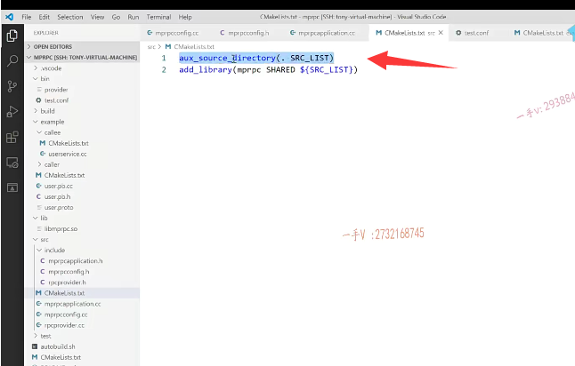

### 之前的makefile中没有记录我们的新文件

啊，但是呢，我们在编译。我们在之前编译的时候呢。就是cmake就是build文件夹下啊，已经生成过这个makefile了。好吧，那那个makefile是之前生成的，

当我们后来新添加这个mpr PC config点CC的时候呢，也就是说在makefile里边并没有记录我们mpr PC config点CC这个新增加了。

原文件好吧，

实际上呢呃有呃，有的同学问了有没有防止这样的问题呢？就是这样的错误呢？其实有你可以用。这样的方式来定义参与编译的原文件，就是set啊。那那原来就是mpr BC。application点CC是不是当我新添加一个源文件的时候呢？我需要在这里边啊，指名道姓的。把CC文件添加进来，那这样一来，

也就是说c make lists。它变了，变了以后呢？当我们去重新用simic构建的时候，它发现呢simic list里边儿变了。它就要重新去生成makefile，把这个新增加的文件。放到我们待编译的这个文件列表当中。好吧啊

### cmakelists并没有发生改变，所以cmake没有重新生成makefile文件

但是呢，我们说这种方式呢，文件少还行啊，目录下原文件比较多的话，我们就比较费事儿。是不是得把所有参与编译的原文件的名字都列出来啊？

所以aux source directive这个比较简单。但是呢啊。它是生成makefile文件以后呢，只要这个c make lists文件不做改动。那它是cm ake，是不会重新生成makefile的。对吧啊，因为只有c make lists改动了，它是不是才会重新生成makefile啊，所以这是这么这么一个问题。那如果遇见这样的错误，对不对？我明显呃明显已经写了啊，明显已经写了，为什么还给我报这个？

符号找不着呢，实际上啊，大家一方面是因为用了a ox source directory，也就是c make lists并没有改变，所以cm ake并没有重新生成makefile文件。

它无法识别我们新增加的是不是这原文件啊？而且也好办啊，你直接进入项目的这个build。就是生成的这个makefile的这个文件夹下，把所有的cm ake生成的编译文件全给它删掉，重新去构建。

那么也就是说，它会重新去当前这个目录下去，寻找所有的CC原文件，那就能够识别我们新添加的CC原文件。

件啊，再去构建的时候。那就没有什么大的问题。这编译完全OK，

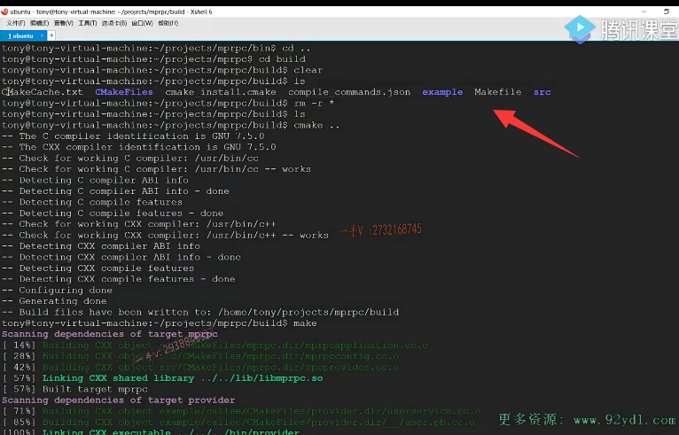

## 编译顺序

这编译完全OK，是不是啊？先编译了我们的框架的so库，为什么呢？

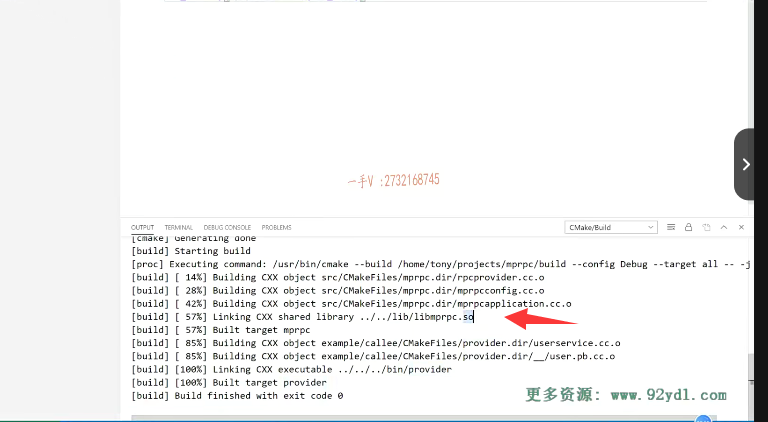

因为我们使用框架的时候呢，生成的provider它。它依赖了是不是mpr PC跟pro to buffer这两个so库啊？proto buffers o库是人家依赖的第三方的，人家已经生成好了在。这个系统目录里边mpr PC，那它要链接这个库，那它就得先看看有没有生成这个库的规则啊？

有呢，在这里边儿就是生成这个mpr PC嘛，所以它先生成了lab mp rpc点so，

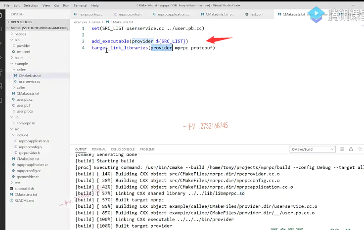

最后生成了我们。这个就是发布rpc服务的这个节点的这个。可执行文件对吧？好了，那既然生成了，以后呢？我们来运行一下啊。

## 运行

进入这个b目录。那么，在这provider。杠I test点conf那就是这样子的啊，你加个其他的。

呃invalid option没有杠a这个参数对不对啊？好了。那么在这儿大家来看看。这里边儿是。什么东西呀？这里边儿能够打印出来，能够解析出来，是不是啊？能够解析出来，但是呢？哎呀，我们看着这个结果啊。好像不太正确，为什么？因为我们打印一行就加了一个换行。

接着打印另外一行。这里边儿不应该多出来空格儿来。是不是不应该多出来空格了呀？那我们要去怎么样一下？我们要去调试一下啊，我们要去调试一下，看为什么解析出来的它？后边儿带了多余的这个换行，所以他打印的时候他自己换了一下，我们又换了一下，所以看看看出来的这个打印的。这个结果呢，又多余的换号。

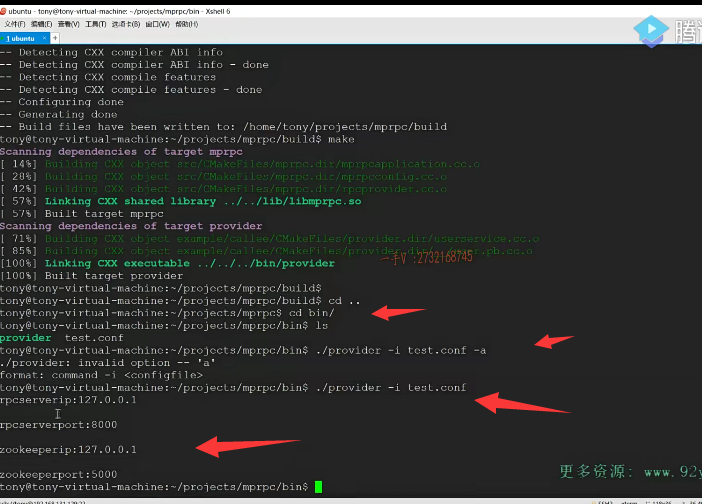

## GDB调试 版本生成

好的吧啊，那么我们肯定是要调试一下我们的程序啊，

大家对于这个linux上的这个GDP的调试一定要多多熟悉啊。

平时用的一些调试命令啊，调试多线程多进程程序啊，对不对常经常用的命令啊，这是必须掌握的，这是在Linux系统上开。开发这个。呃，项目啊，必备的一些技能啊。那么，用c mac构建呢？默认编的是release啊，我们想编译debug，让可执行文件有调试信息。

那么我们得在。项目的根目录的这个顶级的simic list里边。添加一个东西就是set。呃cm ake。诶，这个不叫应该是make。啊，我想想啊，这个。名字叫什么来着？应该就是cma ke cm ake预置的变量都是以cm ake开头的啊。啊，就是cm ake build type啊。debug.debug是不是啊？

这表示生成。debug版本。可以，那就可以进行。调试了，可以进行g db调试，那当然是在Linux系统上对吧啊？那我们重新构建一下编译啊。

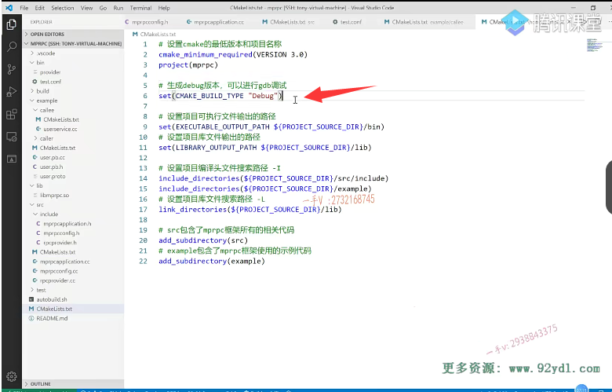

好了，那我们重新构建一下编译，以后我们在这里边啊，大家来看看。啊，我们怎么去调试一下它？j db provider.启动这个调试啊。

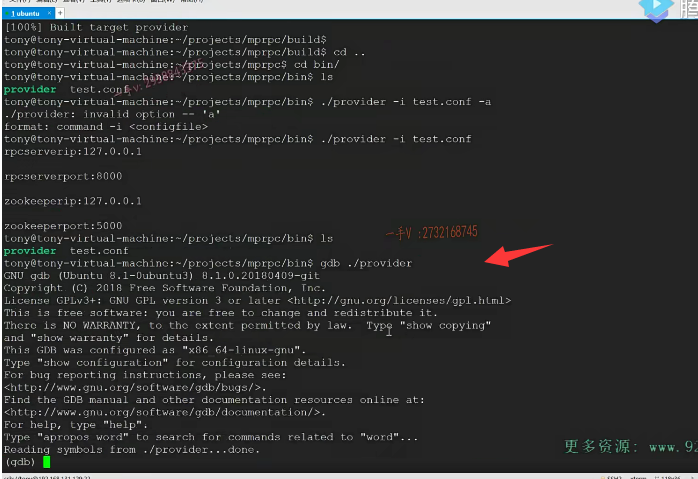

## 是否要从动态库中加载

然后我们要调试哪里呢？我们要调试的是。这个配置文件，这里边儿的啊。一行17行吧mpr PC config点CC的第17行，所以在这儿打个断点pre break m PR pcc on fh。GCC第17行啊。断点，因为我们的这个现在要打的断点，我们启动的是provider使用框架的这个应用程序，对吧？借助这个框架发布rpc服务的，但是我们想调试的源码呢，是在框架的这个so库里边儿，

所以它提示了一个啊。make a breakpoint pending on future shared library load是不是想从这个一类的啊？provider依赖的这个动态库里边加载这个符号呢，当然是yes了啊。

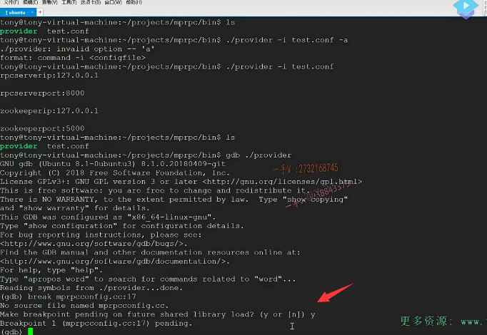

完了以后呢，那我们就run吧。啊，run杠I注意有可执行文件运行起来，需要读这个杠I的啊。然后run的话就直接跑到这个断点处啊。现在呢，我们程序的栈帧是在。这个文件的第17行没问题吧？

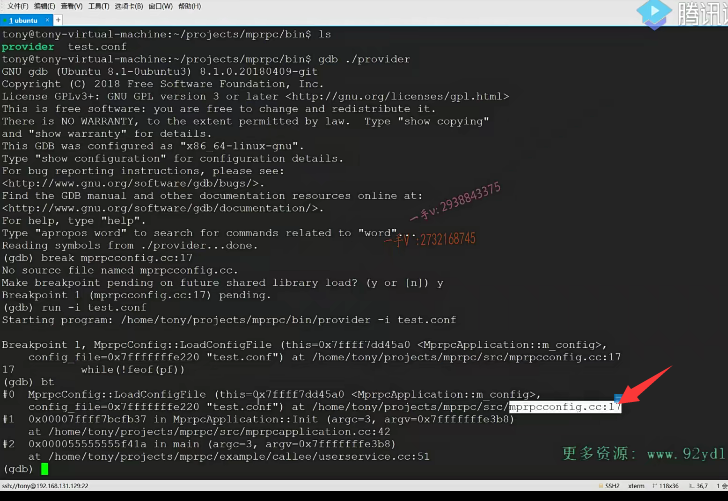

## P 是什么明令

啊，就是在这一行OK，

那我们next。next next p这个。呃，再next一下啊。p一下src杠buf。诶，这个是以井号开头的，对吧？那这就continue了啊。哎，又命中一次断点。走人pbuf。哦，就是这个样子的。那没办法，

这里读了一行，而且我们指定的缓冲区是512个那么。也就是说，这后边儿是幺二七点零点零点一后边儿带的换行，然后后边儿repeat重复了489次这种。杠零是不是？

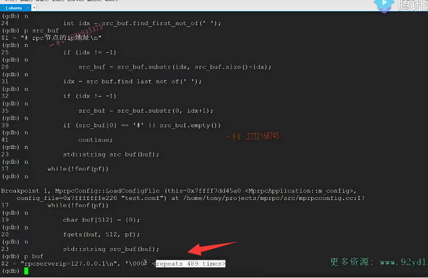

那这个value确实是那后边多了一个杠n啊，所以它加了什么？psrc杠bu。这个src。bof里边是这个。对吧，我们应该是把后边儿这个杠n。怎么样啊？给它去掉了去。

而有可能有些用户在输入的时候啊，在这个配置文件里边儿，这后边儿还给你加了很多的这个。这个空格儿，然后后边儿再是分号儿。是不是啊？

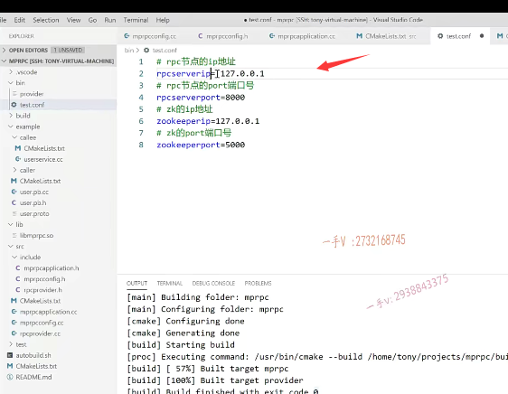

## 封装去掉空格的代码

所以有的时候呢，我们还是需要呢。你包括它可能中间加了这些空格的。对不对啊？那我们这些程序的逻辑得改一改，我们不仅仅要把读的这一行前后的空格儿全部去掉。还还要防止这种情况，是不是？把它读出来的这个数据的前后空格也给它去掉。

读一个字符串的前后儿的这个空格儿，并把它去掉，我们的代码逻辑已经实现了，就是这一段儿对吧？但是呢，我们要用在多个地方，所以索性我们就把它封装起来。

这个是去掉字符串前后的空格。啊，大家注意跟我看一下trim。啊，这个是s。是诶，小写的string用引用啊，因为我们要改变。

13把它重写一下啊，在这个config点CC里边，我们重写一下。去掉这个字符串前后的空格怎么去掉啊？这个我们都已经有了是吧？都已经有了啊，就这块儿了。我们直接就剪切掉了，就放到这儿。好，大家来跟我看一下。src buffer先从前往后找第一个空呃，第一个不是空格的地方截取字串对吧？从后往前。前找第一个啊，

不是空格的地方，再进行一个解。对不对啊，去的就是空格啊。所以呢，我们现在在这里边儿做的时候呢，就是trim。把这个src。啊，我们从起个名字吧，别叫src buffer，这个就叫做read buffer，对不对啊？读出来的这个。这是诶。

read buffer相当于去掉了read buffer前后的这个空格儿是吧？发现是首字母是井号，那就是注释empty，那就是空行，对吧？直接都continue，不做任何处理了。然后这是泛的等于啊，等号儿，如果连等号儿都没有，说明不是一个合法的配置项，在这儿直接continue读下一行去。啊，如果是的话，那么。

在这儿注意啦。k在这读取后。那没有问题。那没有问题，在这里边呢，我们把。k这个前后的空格给它读掉，是不是？因为k在前边儿嘛，value在后边儿，刚看到了这个value可能出现的是一个二七点零点零点一。后边有一个混行啊。然后甚至中间还有空格，后边还有很多的这个。杠零是不是我们不需要全部的啊？

我们不需要全部的。不需要全部的。对不对呃？找见这个。我们应该还是要从这个什么地方啊？这idx再找一下什么，再找一下这个回车在什么地方啊？idx等于瑞的。buffer点。find啊，找哪个字符呢？找回车哎，然后呢？这要有一个转译呢，是不是？

然后是从哪个位置开始呢？就是从上边儿那个位置。这什么意思呢？这个。这个就是。你看啊

我举个例子给大家来说。这个相当于就是。从这个等号的这个位置继续向后。找这个杠n。是不是这个位置啊？找这个钢n这个位置，这个肯肯定是有的啊。肯定是有的那么。找见这个位置，

以后我们要截取子串。截取这个子串的话，那么各位。因为我们还不能。把idx复用啊。得再定一个。定一个n的idx吧。然后这个就是n的idx。减去idx吧。是不是啊？要截取的这个长度。然后呢？把value呢？再怎么样一下value的前后的这个？什么多余的，

这个空格。再给它去掉。好吧啊，来我们验证一下啊，验证一下。

我们尽量让我们的这个框架呢，显得健壮一点啊。这是一个。警告啊，这是。编译完成了，但是警告。这是我们multi character啊。OK，那就就是这样就可以了，

这就是一个。字符嘛，对吧啊，这样就可以了，不用转译了。转义的话成俩字符了，一个斜杠一个n了啊。OK，

## 继续调试

那我们先执行一下我们的这个可执行程序，先退出啊，先退出。provide provider杠I test点conf。哎呦，它依然是有什么，依然是有多余的，

这个换行对吧？那这个不正确啊，这个不正确。那我们依然去调试一下。

provider，然后是break。呃mpr PC config点CC第17行。okay，然后是run杠I。点conf好，走到这儿来了。这第一个是个井号，对吧？trim一下p read杠buf。啊，

它是个这我们刚才在配置项里边儿。后边儿加了一些空格儿是吧？往后走。

等号找见了，是不是？啊string k。k先处理了。啊k没有问题，把等号前边的截取出来了，是不是啊？然后再看一下这个。pn的idx是个几是个28。那就这个位置。是吧啊，然后pi dx是什么是11？

对什么呀？零一二三四五六七八九十十一等号是11啊？呃，12，13，十四十五，16，17，18，19，20，然后中间的空格到杠n是28。是不是啊？28的话，我再执行一下，

我看一下这个value是多少？嗯，那在这里边截取的时候呢？

从这儿开始。对吧啊，从这儿开始，我应该是。还要再多减一个，你看这个杠n。它没有去掉啊。刚刚是不是没有去掉？对，没有去掉啊。我应该在这里边儿。把杠n那个字符呢？

就是不不用去拷贝它了啊，不用去拷贝它了。好了吧啊，不用去拷贝它了。重新编译，我们再看看。出现错误，不要着急去自己去思考，去定位好吧？test点conf。诶，现在是不是就没了，没有多余的，这个换行了，看到了吧？

那之前呢？我们是不是都有多余的换行？这不正确，这就说明你的值。检测的有问题啊。那我们再来看看我们能不能防止我们代码上所描述的那些一些异常的配置呢？啊，有多余的这个？有多余的空格儿，有多余的空行，对不对？这改配置文件不用重新去编译，我们的源码啊。没有问题吧？哎，

这都可以。来再多加一些无聊的这个控制。

都可以吧诶，这都是可以的，没有问题啊，没有问题。行了啊，我们就。写成这样子，那基本上来说，我们就可以保证啊，我们这个框架在读配置文件的时候啊。你加你，你加了一些没有用的空格，是不是因为这个是给？

这个配置文件是需要呢，用户去写的，写完了以后呢，由我们框架去加载，用户可能输入各种各样的。谁知道什么样的数据呢？对不对？用户是最靠不住的啊，你要容错，你作为框架，你一定要容错啊。这个用户有可能输入任何的这个。像这样啊，不合法的格式啊之类的，当然我们这个config又也不可能说是把所有的错误这个。

情况都排除了。啊，你在实际的运用过程中，你觉得我还可以排除什么样的错误，你可以在这个基础之上再去添加。啊，相应的一些。判断规则好吧啊，那这个配置文件我们现在就写到这里了。有配置文件以后呢，那我们再去访问相应的这个IP地址端口号，包括zk的IP地址端口号的时候呢？就直接通过这个配置文文件的这个load。哎，读取相应的信息就可以了

# 这个视频得重新看

## 没太理解

将来呢，我们的这个。provider啊，就是想发布一个本地服务变成rpc服务，在任何的机器上都可以发布。不需要再修改源码重，这个重新部署了，只需要修改相应的配置文件就可以了。是不是啊？只需要修改相应的配置文件，加载相应的配置文件。好吧啊，这就是。呃，动态的处理过程，

我们不要把一些跟外部依赖的像IP端口儿啊，直接在这代码上写死。这样做不好。好吧啊OK，那么在这里边儿在这里边儿再强调一下啊，我们大家在写这个项目的时候呢，写的时候多去思考思考。为什么这样去做？对不对啊？那像这个on order的map，大家觉得在这里边CA加的这个容器呢？都不是现场安装。那我们在这里边，要不要考虑啊order map的现场安全问题呢？啊，

根本不用为什么，因为整个儿整个儿服rpc服务站点启动以后呢啊rpc这个。呃，提供远程rpc服务的节点启动以后。框架只需要any的一次嘛？是不是哎，框架只需要in it一次就行了。好不好啊？只需要in it一次就可以了，不需要多次in it。OK吧啊，甚至呢，你为了防止呢框架多次in it，你还可以在框架这里边儿呢。给它添加一个静态的成员变量来记录一下框架是否已经初始化，

是不是啊？框架如果已经初始化的话呢？我们就不需要再次进行初始化，好不好啊？那这就是看你的这个。呃，越做越健壮，考虑的问题越来越全，是不是啊？那如果大家想去做任何的修改啊？大家就基于我们的这个代码做你自己想做的修改。就是欢迎大家啊。去做这些修改，因为这就说明你自己思考了对不对，对项目的理解肯定是会更深的，

在说项目的时候呢？面试说项目的时候，我觉得你说的。可能会更流畅，更有内容，更有自己的见解深度。好，那这个配置文件的这个。书写呢，以及使用啊。事例我们就说到这儿了，这个我们代码就。这个就给大家放到这儿吧，不删了啊，不删了。

啊，这儿当然不需要去打印这些东西了。好那。这节课的主要内容，我们就给大家讲到这里。

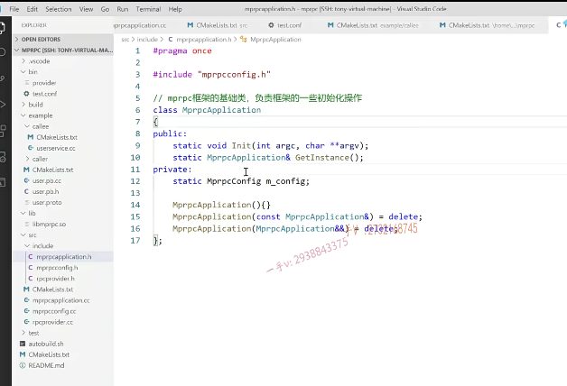