### 回顾上节课

上一节课呢，我们给大家把就是rpc provider的这个网络功能呢，给它添加上了，实际上就是对于muduo库开发网络服务器的一个非常简单的应用啊。

里边儿主要涉及了TCP server跟它的这个event loop啊，还有两个回调啊on connection杠on message。

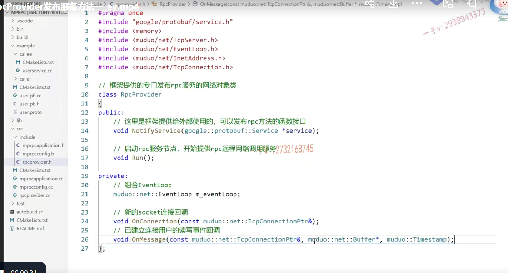

呃，这里边儿涉还涉及了这个C++的一些高级用法就是。嗯，它的这个函数对象跟绑定器对吧啊？这都是我们在编写这个稍微高级点儿的这个C++项目的时候呢，都会经常用到的一些技术手段啊。

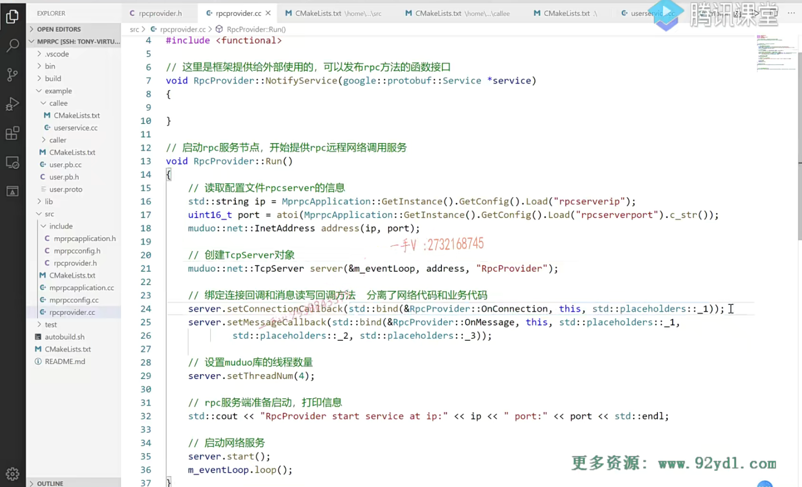

呃，如果你对muduo库应用过啊，跟着我的项目应用过，

我相信你对muduo库的编程应该是不会太陌生。

那么，当我们带着大家把rpc provider的网络功能啊，写完了以后我相信。

针对于网络功能代码这一块儿呢，我估计大部分人都应该是没有什么。啊，就理解网络这块儿没有问题。

# 本节课

### 如何向rpc provider上面发布这个rpc服务对象方法

那我们这节课要完成什么东西呢？

完成rpc provider的另外一个功能就是可以供我们用户在我们rpc provider这个rpc服务节点上呢，去发布一个rpc方法。

rpc的这个对象方法，能够提供给别人进行远程调用，是不是啊？

==那也就是说我今天呢，给大家讲rpc provider的另外一个功能就是如何向它上面发布这个rpc服务对象方法。==

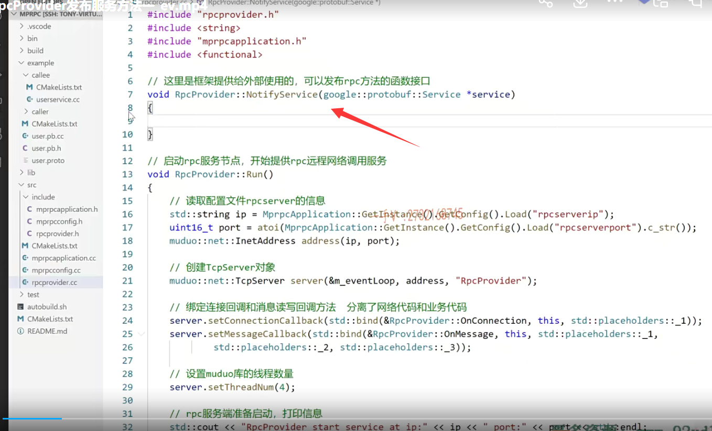

好吧啊，那在讲这个之前呢，我想给大家呢，先画一下图啊，来帮助大家呢，先理解一下。

我们在这里边儿要写的这个notify service，它的作用是什么？

那么首先呢，大家再来跟我看一下这个工程目录啊

example底下的caller跟callee，相当于我们是使用框架的这个示例代码。这个没有问题吧，

callee是什么，callee对应的就是我们图上的这么一个角色。

啊，就是rpc服务的提供者就是呢，我用你这框架可以把本地服务发布成是不是rpc服务啊？

就是我们这就是示例代码。

之前给大家说过啊caller，就是我要作为一个rpc的调用者的角色，我要去调用去访问你远端发布的一个rpc方法好吧啊，

这里边所谓的远端就是可以在不同的机器上，也可以在同一个机器的不同进程上。啊，都可以像调用本地方法一样，直接调用一个远程发布的rpc方法。

这其实就是我们大家经常所说的这个微服务的这么一个概念啊。

微服务就是把服务拆分成最小。根据它的这个对硬件这个资源的需求呢？对于这个高并发的这个需求呢啊？进行非常灵活的部署，

这是我们在最开始呢去给大家讲这个分布式理论的时候，也有给大家涉及到啊。

好，那么在这里边，大家来跟我看一看。

我要给大家画一个图。这个图呢，帮我们大家来理解我们本节课要做的东西啊。

这个呢？这个是我们mprPC的这个框架。好的吧呃，这是我们mpr PC的这个框架。

### 已经完成init部分

那么，我们已经给它完成了一部分功能。

哪一部分呢？就是呢mprpc application application.对不对？

它提供了init方法。啊，它提供了这个init的方法。

啊，我们主要在这里边儿，现在现在是加载配置文件的。对了吧啊，这个配置文件。

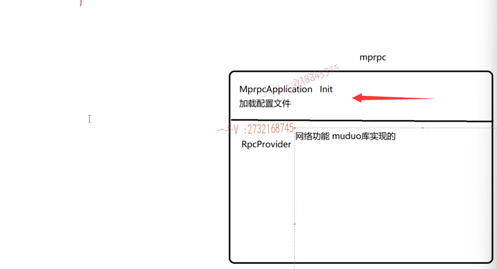

### 目前提供了provider方法，通过muduo库实现

然后呢？

我们向外部呢，又提供了一个rpc，我们先说callee这一端的啊。

又提供了一个rpc provider，provider这么一个方法。

这个方法呢，它有两个功能，目前是它有网络功能，我们是通过muduo库实现的。

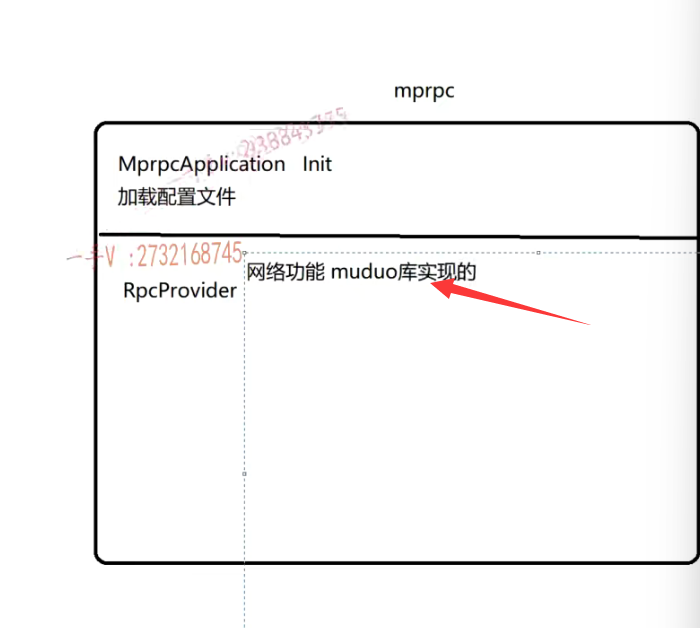

### rpc provider 的网络部分

是不是很明显嘛？

你看你看我们框架，我们框架在这里边要负责呢，我们黄色跟绿色的这两部分功能

绿色的这一部分功能是不是就是在负责网络的收发数据呀？

呃，我们看右边这个绿色的啊，这就是我们现在给rpc provider所写的muduo库网络模块的代码。

#### rpc结构中没有绝对的服务器和客户端

啊，它作为一个服务器来接收远端的这个调用啊。

实际上，在rpc的这个分布式的这个结构中，没有谁是绝对的这个rpc服务器rpc客户端对吧？

提供rpc方法，你就可以称作rpc服务器，请求一个rpc方法，你就可以称作一个RP客rpc客户端。

任何分布式节点都有可能成为rpc服务器，也都有可能去调用其他的rpc方法，而成为一个rpc客户端的角色是不是

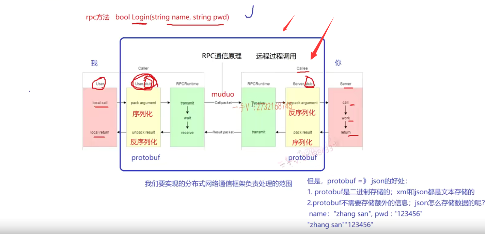

现在我们rpc provider已经实现了这个绿色？

那么，现在我们应该去实现这个黄色的，

黄色的在这里边儿呢，叫做rpc请求的这个数据的序列化跟反序列化。

那么在这里边儿呢？也就是说我们现在要给它完成这样一个功能，我们得通过提供这么一个方法notify service。这是service。

### 参数service是什么？

service是什么呢？大家没有忘记吧？service是啥？

service是一个基类的指针是不是，一个基类的指针啊？哎，基类的指针。

我们在pro to buffer这个文件里边定义的service类啊。

他们都是从这个service，这个user service rpc这些类啊，他们都是从这个service继承而来的。

那我们提供的notify service这个方法。是不是啊好？

那作为rpc provider的这个使用者。呃，作为rpc provider的这个使用者。

也就是说，rpc服务方法的发布方。

我们是怎么做来着？各位，我们是怎么做的啊？

我们首先呢，它有一个user server，

它有一个本地的方法，原来有个本地的方法。就login这是个本地的方法，

它可以在本地去做业务。是不是啊？这个。

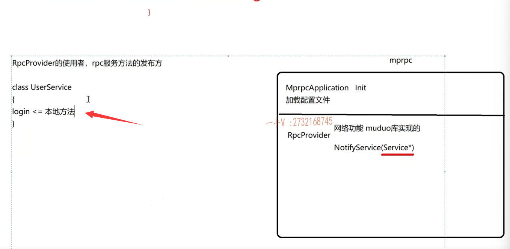

然后呢，我们为了把它发布成一个远程方法，我们说你要继承自你所描述的你rpc方法参数返回值这样的一个类啊，

你要从这个类继承上来，这个类你是通过你定义好的protel文件是不是生成的呀？生成的呃，

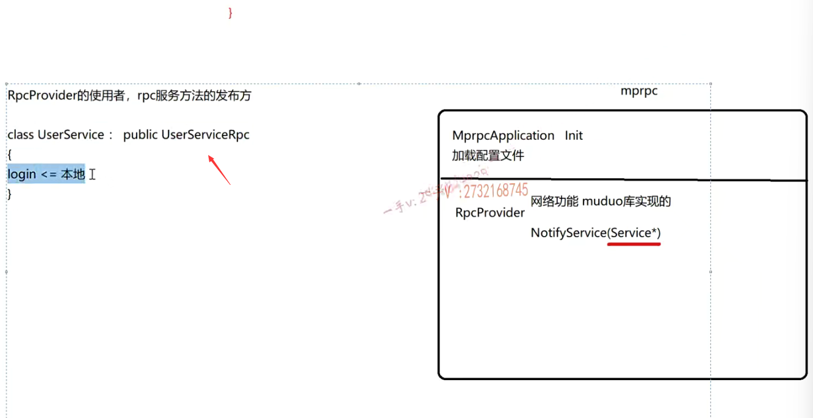

在这个类里边呢，把你所有的原来的这个本地类的方法呢？呃，全部提供成了一虚函数，而且参数呢，都是由protel buffer呢，自己封装的，你想就就这个login啊controller啊，request response down啊，对不对啊？

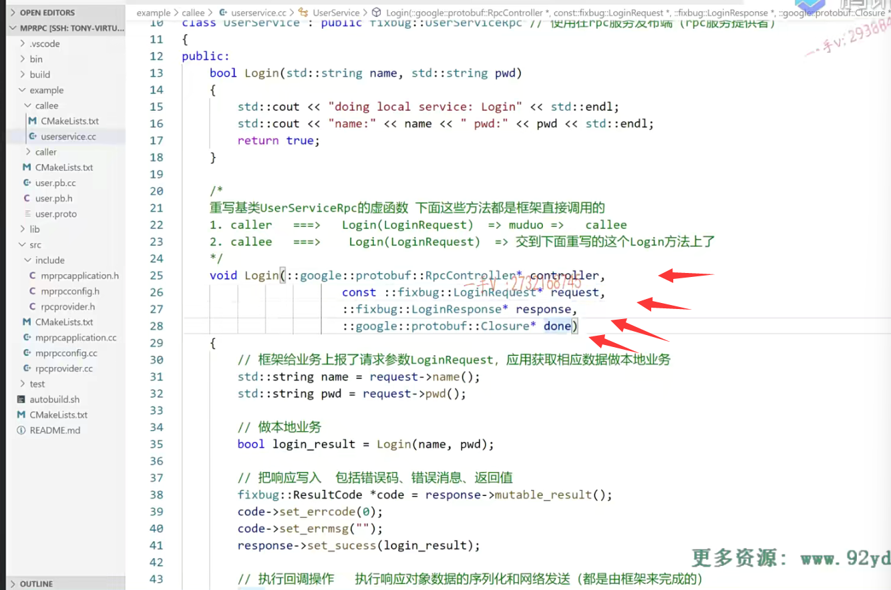

你需要去重写这个方法。重写这个protel buffer提供的 virtual虚函数。啊，

这每一个方法对应的都是一个本地方法。对不对啊？

对应的就是本地方法，这个方法是从哪儿来的呀？

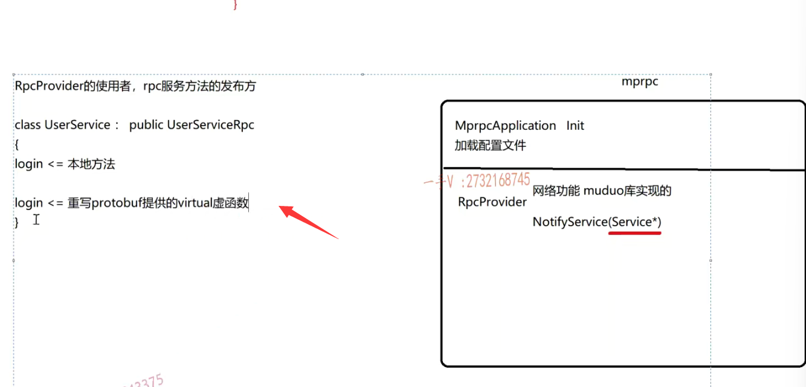

这个方法同学们是不是你从这个protel文件里边定义的service rpc这个方法而来的呀。

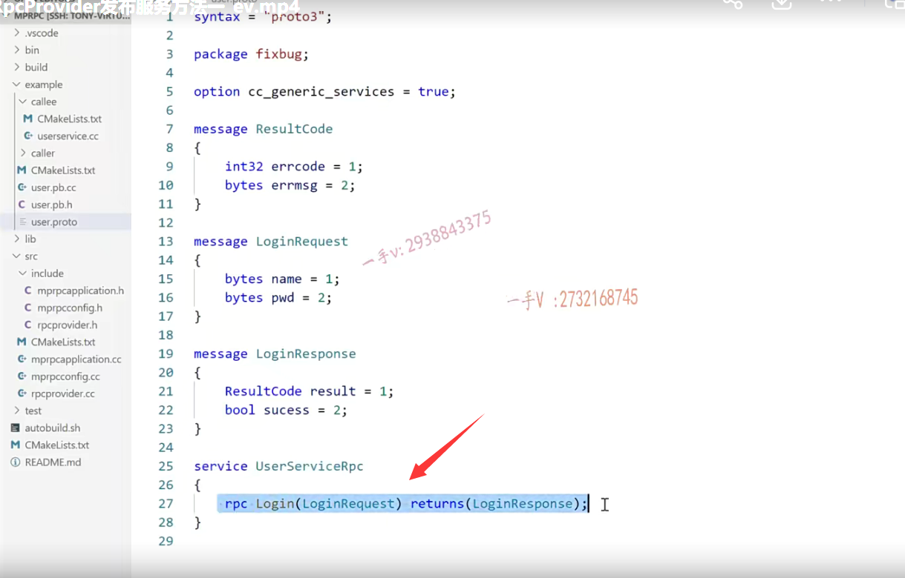

啊，当然了，你这个login啊，也没有必要说是跟本地的方法login名字就一一对应上。好不好啊？没有这么一个强制要求的。是不是

## login本地方法做的事情

好？那么我们说在这个login这个方法里边，它做的事情主要是什么事情啊？

再跟我回忆一下啊。回忆一下，

首先呢？人家直接给你把这个远端发过来的rpc调用的这个请求是不是给你报上来了？你解析参数。对不对啊？

那么第一件事情是从login request获取参数的值对不对？

第二个就是执行本地服务login。对吧啊，并获取这个返回值，

然后第三个就是打包。就是用这个上面的返回值填写谁呀？填写login response.对不对？

然后第四个呃。一个回调。把login response在发送给rpc client。

就是rpc方法的调用端。

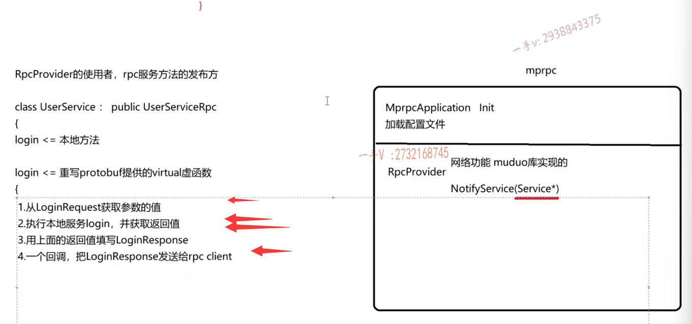

## 解析步骤

好不好诶？这就是它所做的事情。

那么，同学们来跟我看一下这里边啊，

首先呢，login request。谁负责帮我们来这个处理网络的收发呀？

当然是网络模块了。对不对哎？

你没看这个main函数启动的时候啊，各位，我把main函数在这里边也大致列一下啊。

我们main函数在这里边，是不是首先调用了mpr PC？

这是我们代码，在这儿啊。我们代码在这里边儿。就是这几个啊。我把这直接拷贝过来吧。

好，就看这几个啊，注意跟我看图啊。

### main函数执行步骤解析

### 调用init,使用这个rpc框架

首先呢，我们init调用了框架的init。先搞清楚角色啊，这是rpc provider的使用者，就是我用户方，我现在想发布这个把本地服务变成rpc服务，

我直接使用你这个框架就行了，对不对？这就是框架本身啊。

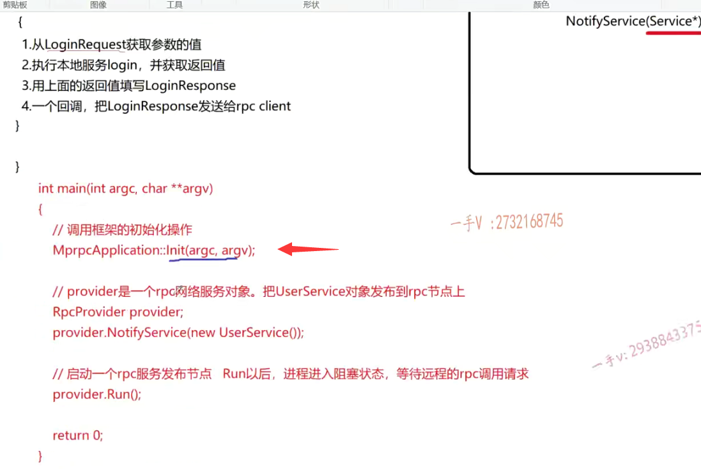

### 向provider注册login方法

然后启动了一个provider。

然后向provider上注册了服务对象的这个方法呀？

就user service这么一个对象的一个login方法。

啊，当做一个可以远程调用的rpc方法对不对？

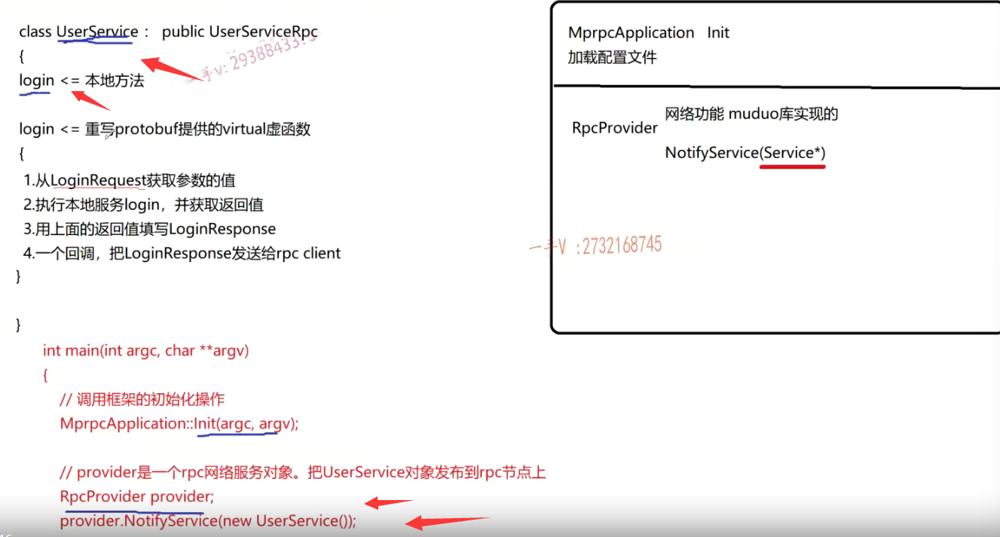

==然后启动，这也相当于它就是一个网络服务器。==

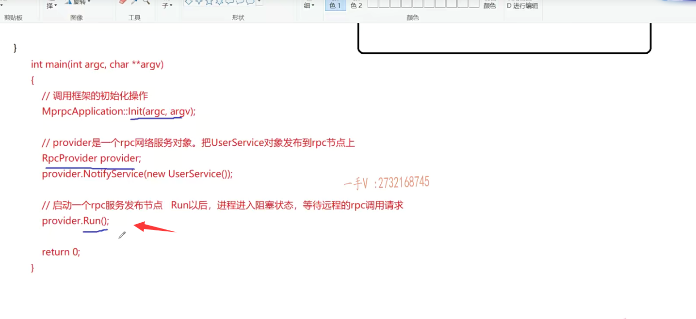

### rpc provider通过网络模块（muduo）把rpc请求上报到loginrequest

首先，如果远端有rpc请求的话，

rpc provider的网络模块是不是会帮我们去接收这个数据的呀？

接收什么数据呢？就是接收一个rpc请求嘛？rpc请求里边都有什么东西呢？

那肯定有这个函数名字。还有这个函数对应是不是所依赖的参数啊，

所以呢，由rpc provider通过网络啊，就是通过上面这个绿色的这个块儿啊，网络模块儿就是我们这里边儿的这个muduo库先把这个请求诶给我们上报到这个login request。

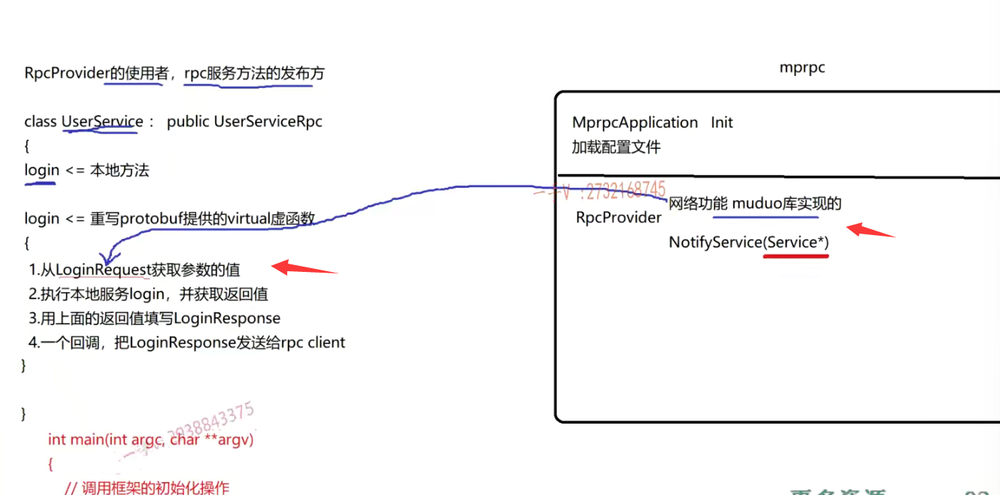

也就是说，这里边的这个参数上。我们作为用户，我们不管它底层是怎么进行网络收发？

是怎么把网络上的这个字节流啊？给它反序列化成我们具体的login request对象的数据，我们只需要用就行了。

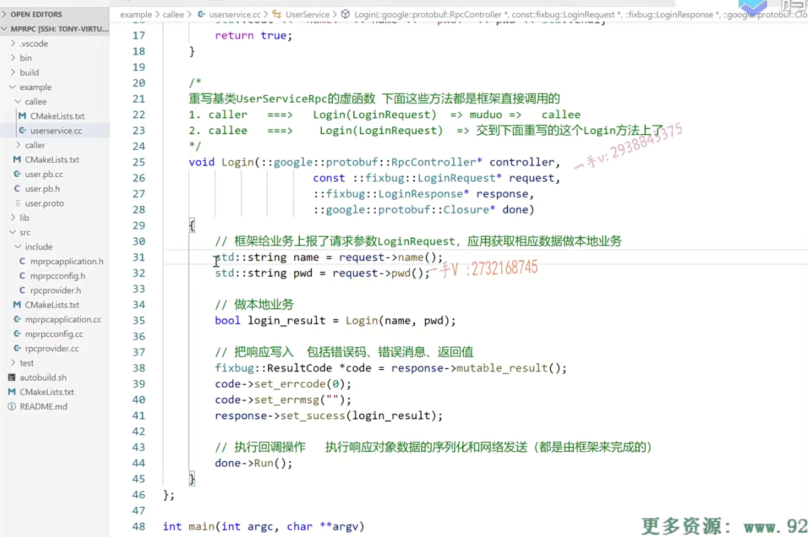

啊，这个呢，都是由谁来完成的？由muduo库来完成的。好不好啊？

当然muduo库只负责网络收发，

在这里边我们再写一个网络收发和proto buffer实现的数据序列化和反序列化啊。

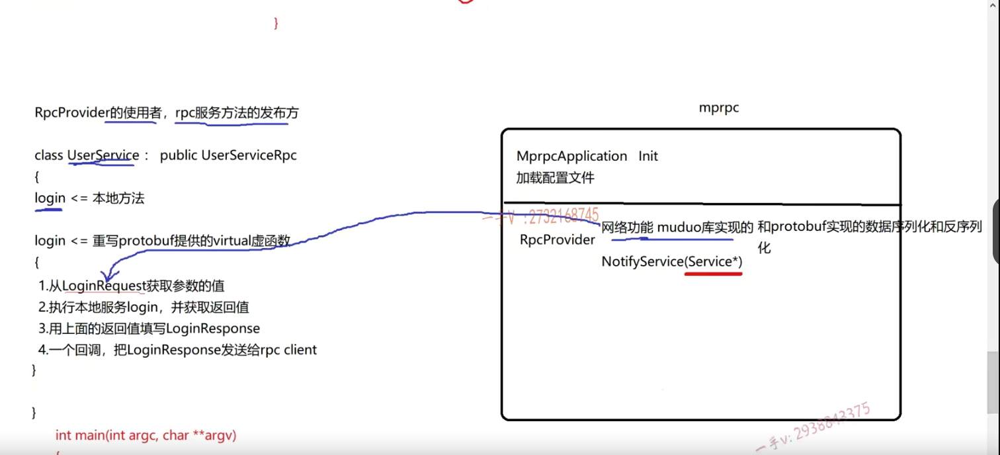

### 提供rpc服务方法的这一段它的流程

来大家注注意看我的这个箭头啊，我这个箭头画的意思是什么意思呢？

就是你看这个网络哎，有rpc请求过来了。

这个rpc provider这一端呢，先接收网络上的字节流数据啊，

然后交给这个proto buffer，这儿proto buffer，这儿进行数据的反序列化。啊，把它还原成我们相应的一些请求，对不对？

然后把这个请求呢就扔给我们的应用程序。

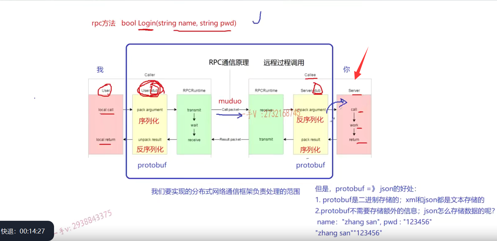

那么相当于我画的这个箭头儿，这儿相当于就是远端的这个rpc请求呢？

通过我 muduo库接收网络字节流对吧？

再通过pro to buffer反序列化成具体的一个login request就上报给我们这个user service的重写的这个方法，这儿来了，

我们就可以从这儿呢去获取参数，

然后呢，去做人家想调用的在我们这个机器上的这个模块儿进程里边儿的这个本地业务方法啊？

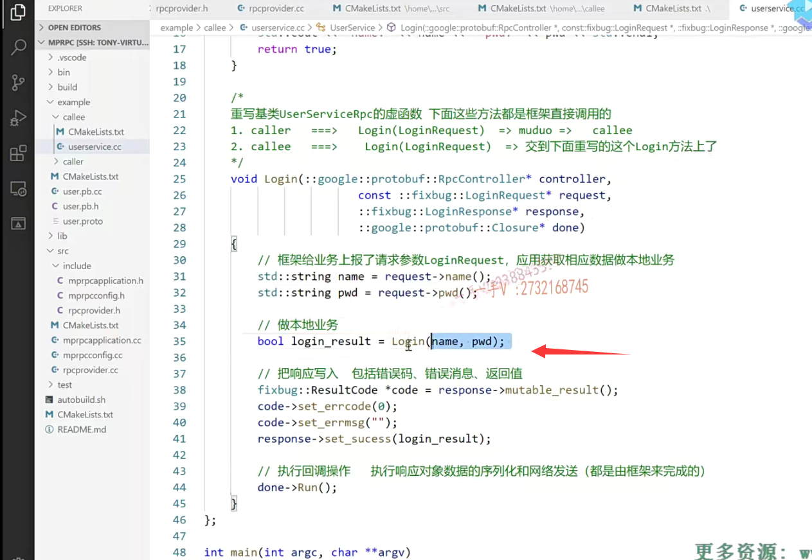

调用完了以后呢我们再通过呢，本地业务方法的返回值给它打包，是不是响应值啊？哎login request。

然后再通过回调再发送回去，也就是说呢这块儿，又把这响应的结果呢？送给谁了？

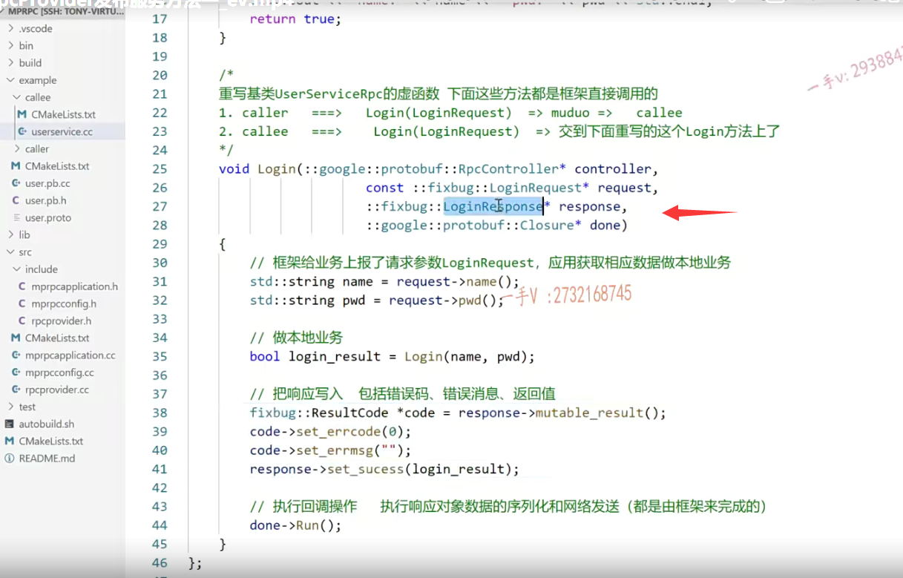

送给rpc provider。哎它呢，首先呢，把我们的这个log in response通过pro to buffer呢进行一个序列化，就是把log in response这个对象呢。给它序列化成字节流或者字符流，

然后呢，再通过muduo库给我。发送回去，

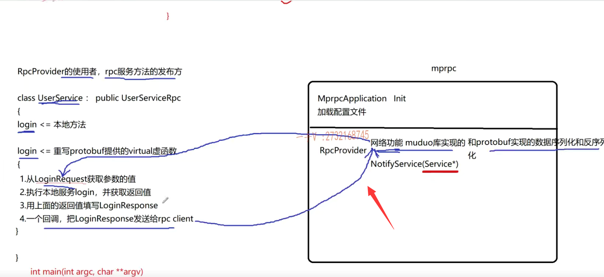

也就是说这个图上的这一块儿，哎，

这个在rpc provider这一块儿呢，本地业务work做完了以后return。对吧，

把login response呢进行序列化，序列化成这个什么东西啊？字节流是不是

或者字符流再通过网络给它把发送回去那rpc provider这一端。

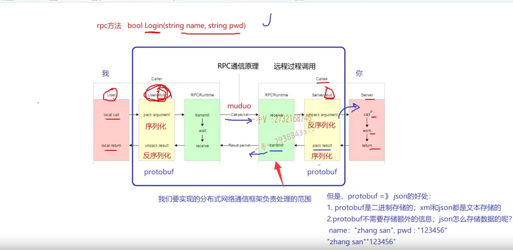

就是提供rpc服务方法的这一段，它的流程是不是就做完了？

哎，它的流程就做完了。

好吧，我讲到这儿，大家现在是否能够理解？

我们在使用的时候呢，继承user service rpc重写的这个login方法。

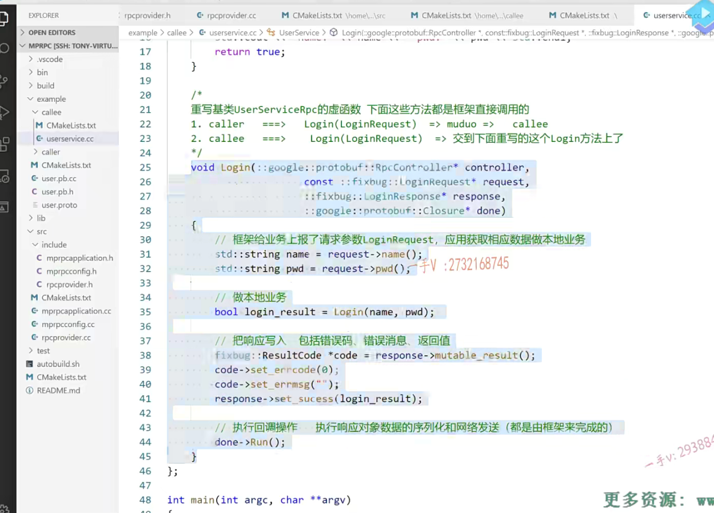

### 思考框架做了什么，我们又做了什么

跟我们框架之间有什么关系？

==就是框架帮我们做了什么？啊，我们自己做了什么？==

==我们又是怎么把返回值扔给框架？==

==框架又是帮我们怎么处理返回值？==

==pro to buffer先进行数据的序列化log in response对象的序列化，==

==然后再通过网络发回rpc的响应，这一点应该能够清楚了吧？==

这一点应该能够清楚了吧，大家好好想一想。

### 还缺一个功能，就是login request处理了请求后，能够主动调用这个login方法

okay吧啊，那么现在我们就缺一个功能，哪个功能就是？

你看啊，就是上边这个当rpc provider啊，从这个网络上接收一个rpc调用请求时啊，

就是它怎么知道？要调用这个应用程序的哪个服务对象的哪个方法，哪个rpc方法呢？这句话怎么解释呢？

==我再给大家去说一下啊，就是当人家远端发过来一个请求的话就是我想调用你user service rpc这个服务对象的什么方法呀？login方法。对不对？==

==那么我们的这个框架应该能够把这个请求呢啊，就是把这个login request呢？==

==最终处理了以后还能帮我们主动去调用这个login方法，==

我们就知道有人请求这个login方法了。

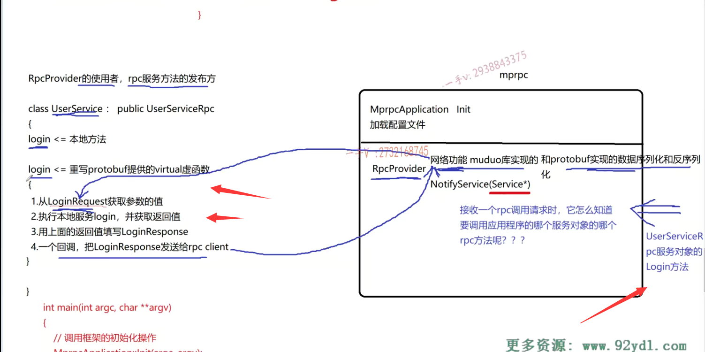

你看嘛，我在这儿写的时候，我只是把login方法的代码写了一下，

我在这儿有没有自己去调用login啊？

我有没有调用login，这个login是谁帮我们调用的？

这里边是谁帮我们调用的？哎，这方法都是由框架调用的。

由我们的mpr PC框架调用的。

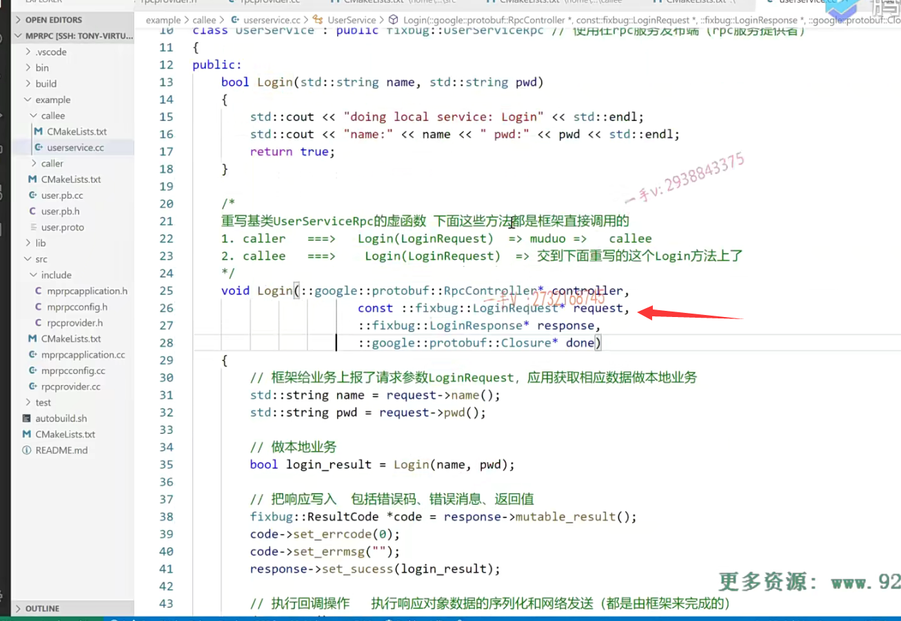

### 这应该都是由我们的框架帮我们调用

我们框架接收到远程的rpc请求的话，它会根据呢相应的一些信息它调用的服务对象的服务方法名字啊，

是不是来定位到哦，你要调用的是哪个服务对象的哪个方法，

由框架帮我们调用这个函数？相当于一个回调的操作。好不好啊？

### notify service这里应该有一张表记录这个服务对象和其发布的所有的服务方法

所以呢，我们notify service在这里边呢，是不是应该记录？

需要啊，生成一张表。

记录什么呀？记录这个服务对象和其发布的所有的服务方法。好吧，

就比如说啊，我这个user service rpc。哎，这个服务。你写成user service吧啊，

我上面发发布了login方法。rgre.gist啊，register方法是不是

我还有一个这个？friend service啊，

里边儿发布了add friend呃，delete friend。还有get friends list。

哎，我们有一个表应该记录一下这些信息

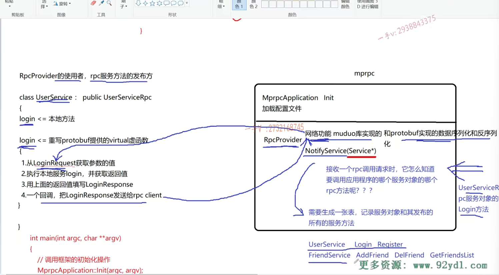

当远端呢，有rpc请求过来的时候，我们rpc provider就可以在它的这个表里边儿查一查。人家要调用哪个对象的哪个方法，

然后他就会帮我们去调用了。

调用了以后呢，我们就会看到login方法被调用了，被谁调用了，被框架调用了。

那么，它就会去执行相应的这个，我们写好的这个操作。

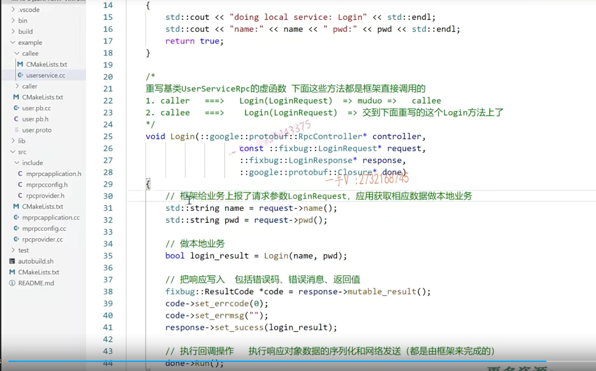

### 定义成员变量，记录这一张表

好吧啊，那么我们要接下来要做的事情呢，就是给rpc provider呢，去生成这样的一个成员变量。就这么一张表，来记录服务对象跟服务方法。

### protobuf中的service类  method类

当然呢，我们是最终调用这个服务对象的某个服务方法的，

肯定不可能只记录字符串是不是啊？

那么大家来这个注意一下啊，

在这个pro to buffer里边，这都是有pro to buffer给我们提供好的，非常好用。

啊，为什么pro to buffer呢？使用的这么的这个广泛呢？对不对啊？

它在我们拆分服务进行分布式部署的时候，提供了良好的这么一个数据的序列化跟反序列化，

以及对于rpc的描述的这么一个支持啊。

在这呢，我们的user service。就是它从user service rpc继承上来的，

这东西都是service类是不是继承而来的呀？

这里边儿的这些方法啊login register这些方法呢？

各位啊，它们在pro to buffer里都是通过这个method来描述的也就是说呢，pro to buffer里边有service类，专门可以用来描述呢。这个对象啊，

method类呢，专门可以用来描述什么？这描述对象method类专门用来描述什么？描述方法好不好啊？

那我说的这个呢，因为没有，因为大家可能之前对于protobuffer呢，没有做过太多的接触，可能我现在说到这儿。还是有一点抽象啊。

但是没关系，我们会一句一句的给大家写出来，最起码你要搞清楚啊，

我们要做rpc provider这个框架的这个rpc提供rpc服务的节点还缺少什么？

它已经实现了muduo库了。对不对

protel buffer的序列化跟反序列化？

那我们后边儿它马上就会实现的，是不是啊？马上就会实现的。

这是对于protobuf的讲解，

==我们现在需要去输出一下notify service，这是干什么的？==

==这就是接收远端的rpc请求。如何定位到人家想调用我哪个服务对象的，哪个服务方法？好不好？==

那框架就知道去调用哪个方法了。

### 只有框架才知道什么时候什么情况会去调用

因为说到底我们用户不知道什么时候调用这个login。

框架才知道什么时候调用这个login。

有人请求框架才会调login，没人请求调login干啥呢？

我们作为rpc的服务方，我们不可能自己去调用login嘛？

我们哪知道有谁或者说是谁，什么时候什么地点，是不是会去请求我们这个服务方法，我们根本不知道这，

==只有框架知道，所以这些方法都是由框架来调用的。==

啊，你要用框架调用框架就得去识别他想调用哪个服务对象，

哪个方法就得靠你这张表？好不好啊啊？

那么这节课呢？我们主要是给大家说了一下rpc provider。跟我们的这个rpc provider的使用者。啊，就使用者的代码，客户的这个代码跟我们框架代码这么一个关系啊

rpc provider三个功能一个。两个三个，我们即将现在要写notify service。里边都写哪些东西好不好啊？

把理论多想一想，理论清楚了，以后呢，再跟着我去写代码啊。

我希望大家呢，在这里边不仅仅只满足于啊。就是把代码写好，你更得去多听一听我的这么一个描述，

到时候呢，把这个项目写到简历上，再去给面试官表述的时候呢。

我相信你也会说的更清楚一点。好不好啊？这个项目是非常有价值的。

对吧啊，也是对于这个集群的这个升级分布式啊，一个非常好的这么一个了解啊。那么希望大家呢？理论能够结合实践，不仅仅能把项目代码写出来，能运行出来，结果更重要的是你能通过这个项目的学习。

能在谈论这个分布式通信的时候rpc通信的时候呢？啊，能说出道理来。好，

那我们这节课呃理论就先讲到这里，下节课我们来进行一个rpc provider notify service。相关内容的一个实现