上节课呢，我们给大家把我们的mpr PC框架的这个rpc provider啊。

呃，这个rpc provider呢？实际上你也可以起名字叫做rpc server，

它就是可以通过这个类对象来生成一个rpc server rpc服务，服务端节点对吧啊？

来给别人提供rpc服务的，

这是我们上节课写的这个on message。

这也相当于描述的啊，就是我们的这个rpc provider端哎，这个黑色的箭头儿先到绿色muduo库，

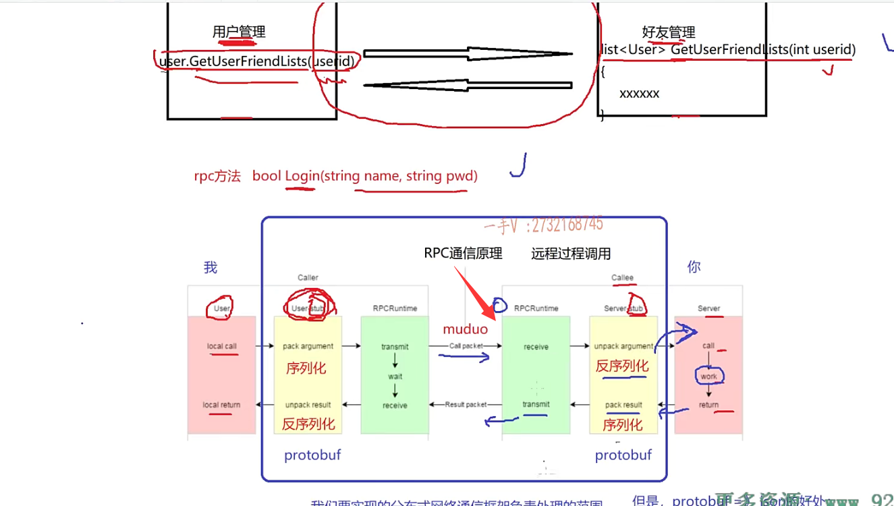

这里边儿有以这个建立连接的用户的一个rpc请求，

哎，从这个on message过来，然后呢，

经过黄色这一端。那在这里边儿就是整个的数据的这个反序列化，

就是把字符流啊，把muduo库给我们上报出来的字符流哎，从这字符列里边儿去解析相应的这个具体的数据对吧？

我们是通过proto buffer在这里边儿做这个字符流数据的反序列化的啊。

啊，最后得出来，他所想请求的这个service name method name啊，

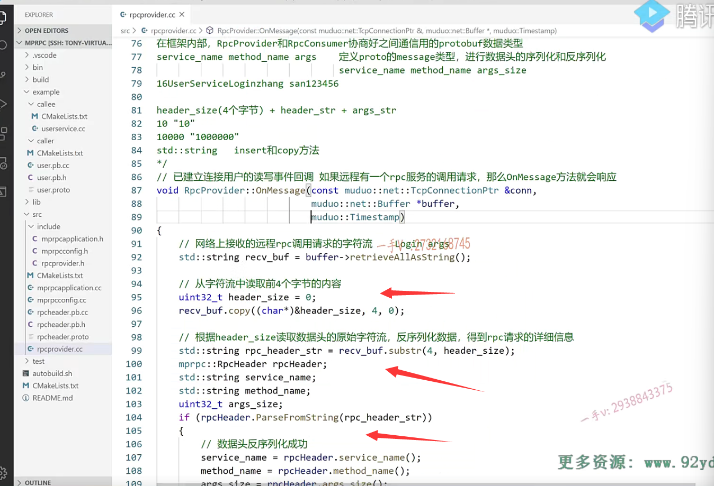

然后我们在动态的生成这个相应的方法的request跟response，是不是两个消息呀？

然后通过呢service调用call method，

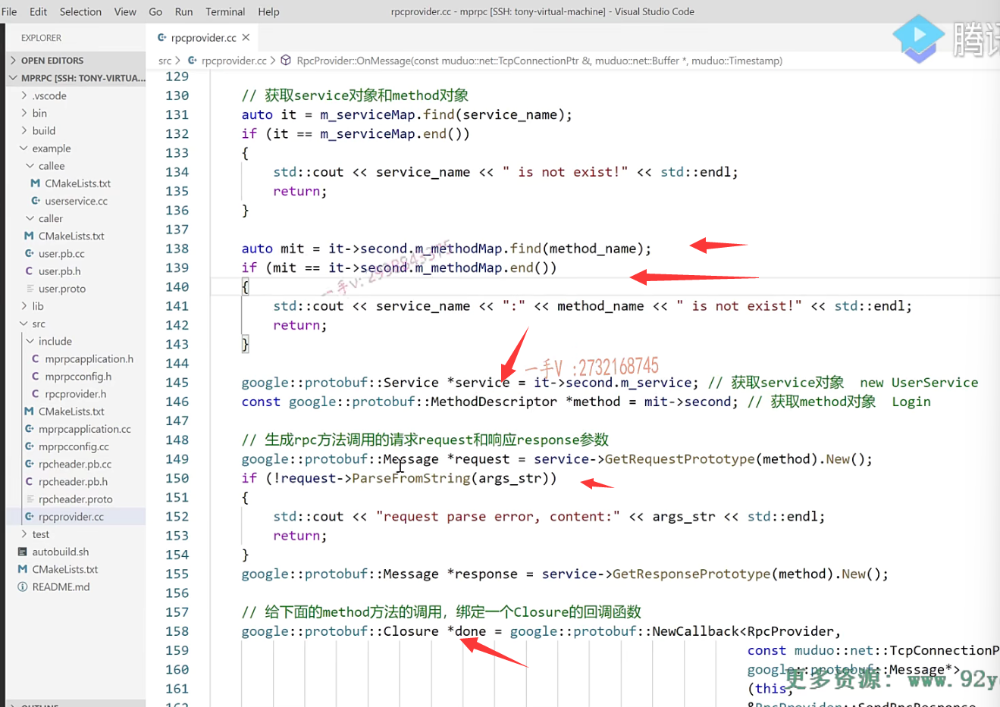

### protobuf的callmethod底层

实际上你可以呃花一些时间去了解一下pro buffer在这里边儿给你做的封装，

实际上你ctrl，然后。鼠标点进去啊，你会发现呢？

这里边儿的这个call method哦，

那就是说你只要向框架上注册过相应的服务对象方法。

在这里边儿啊，你在框架在用service调用这个call method的时候呢，

它就会跟你传统的第一个method就是这里边儿了。method你请求的这个method，

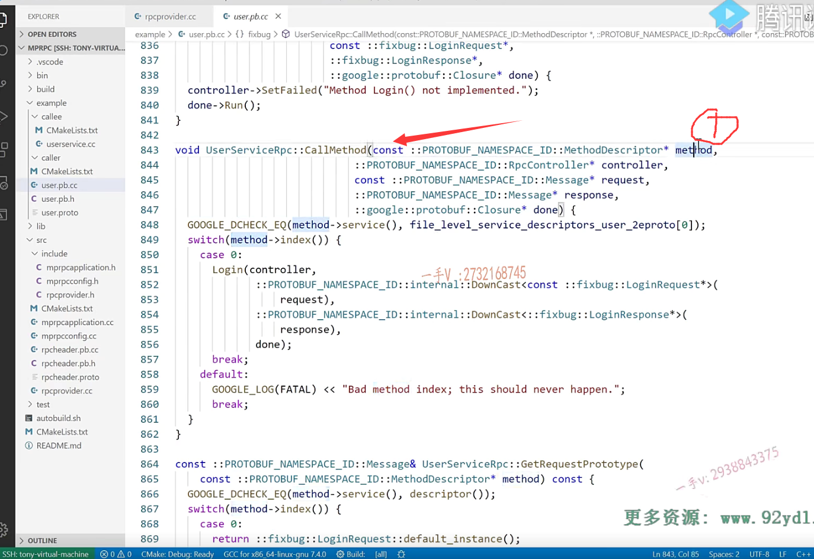

我们请求的这个method是通过什么找来的呀？

是通过method name。

哎，通过网络上传过来的method name是不是找见了一个method呀？

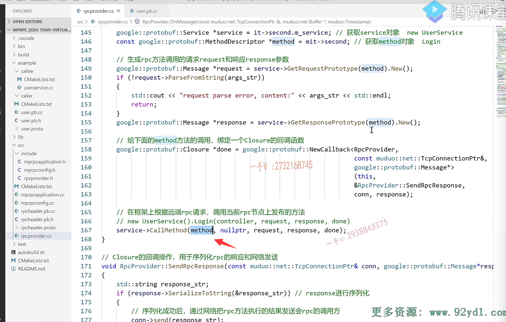

然后method index，这就是每个服务对象里边儿的方法啊，

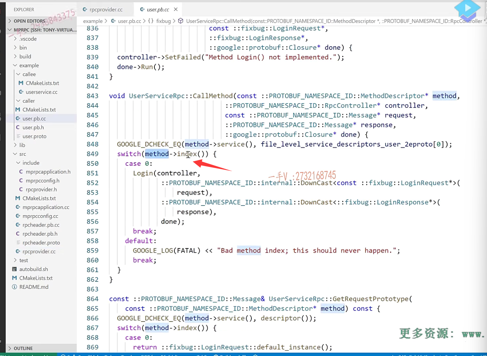

我们最开始注册的时候呢，你看啊？

就是在这个not if service的时候呢，

这儿是不是就可以通过service的什么方法  method count或者这个service对象里边儿有哪？有几个方法对吧啊？有几个rpc方法，

然后我们通过这个method+1个它的参数传入一个下标就可以知道啊，

你想获取当前服务对象的哪个rpc方法？

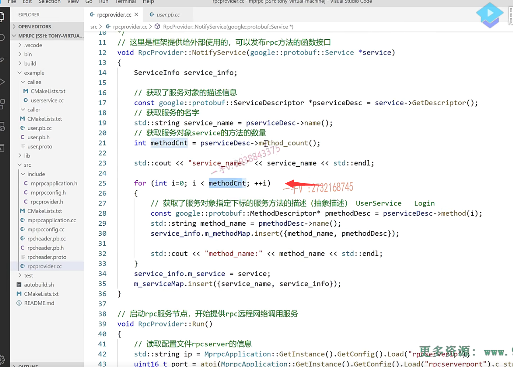

而现在同样的啊。

当你在框架上调用switch call method的时候呢，

这里边儿就根据方法相应的下标，

来一个switch case来调用你应用相应的方法。

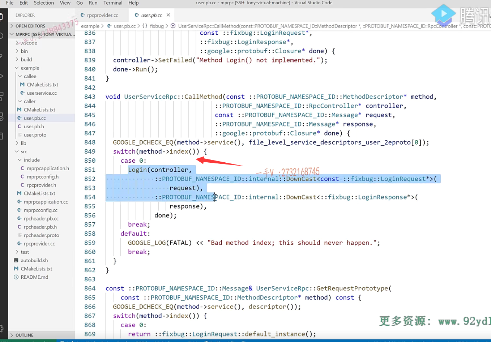

你看我们login这个应用箱的方法在这儿呢，是不是都重写过了啊？这之前我们已经说了好多遍了，

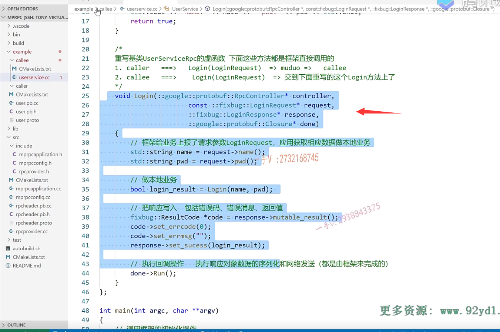

它给你呢？呃，把什么东西啊？

它给你在这里边儿。把这个controller啊controller，我们现在传的是空，

还没有说到这儿呢啊

request response以及我们生成好的一个回调，是不是都给你传？到这个login函数里边来了。那么大家呃，有一些时间的话呢，可以通过啊，这个研究一下photo buffer给你通过这个proto文件啊，生成的这个源码去看一看。

它是给你怎么去封装这底层的，这个调用的啊，它如何在框架这里边儿呢？能够调用我们应用相应的重写的这些方法呢？

rpc方法，这些rpc方法从哪儿来的？是不是就是啊？

rpc服务提供者约定的这个service rpc方法啊对。

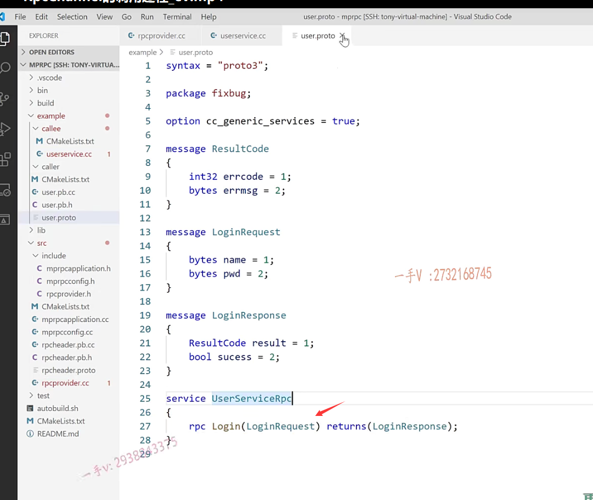

好，那这个就说到这儿了啊呃，我们说呢rpc provider这里边儿的这个功能啊，还有待验证对吧？

我们只是把代码写了，并没有验证，我们是打算把这个就是框架的这个针对rpc调用方rpc客户端这一边的相应的代码，写完以后我们就可以起两个rpc节点，

让他们发起一个rpc请求了啊呃，

这是我们上节课定了一个rpc header连proto，这是把我们rpc client跟rpc server之间传输用的这个rpc请求的这个数据头。

是不是定了一个message类型啊？生成了C++文件啊？

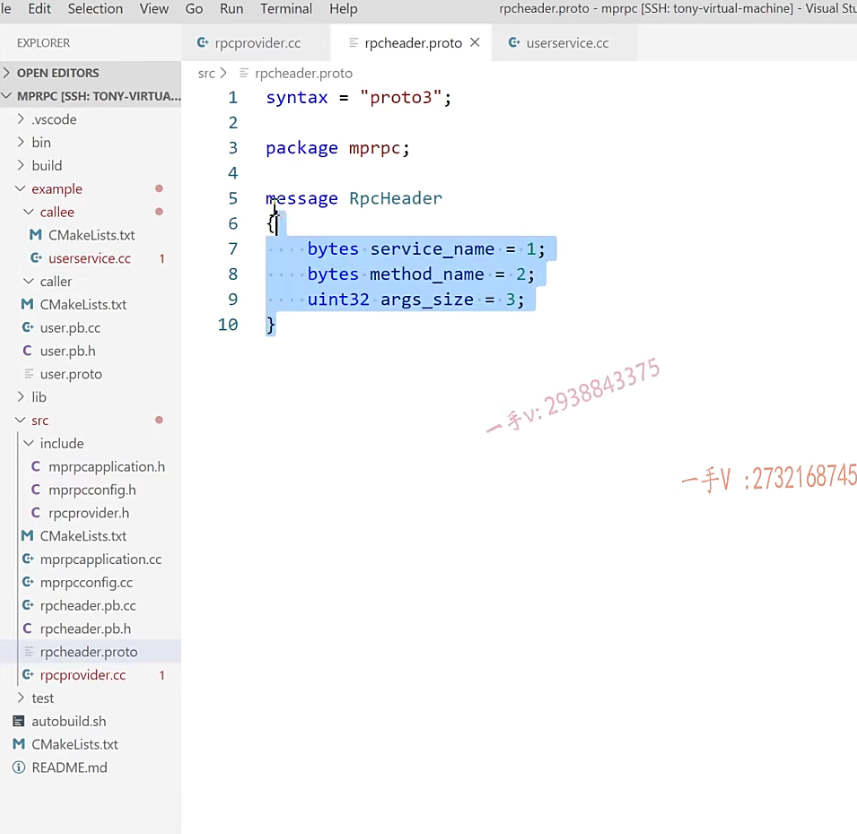

### 头文件移动到include中

那同样的，我们把这个点H文件啊。就这个啊，

同学们，我们把这个点H文件移到这个include里边来。

好吧，我们includes rc下include全部都是什么呀？

全部都是这个头文件啊，全部都是头文件呃。

外边呢，全部都是这个什么文件啊？全部都是我们的CC的，这么一个文件好吧啊CC的这么一个文件。

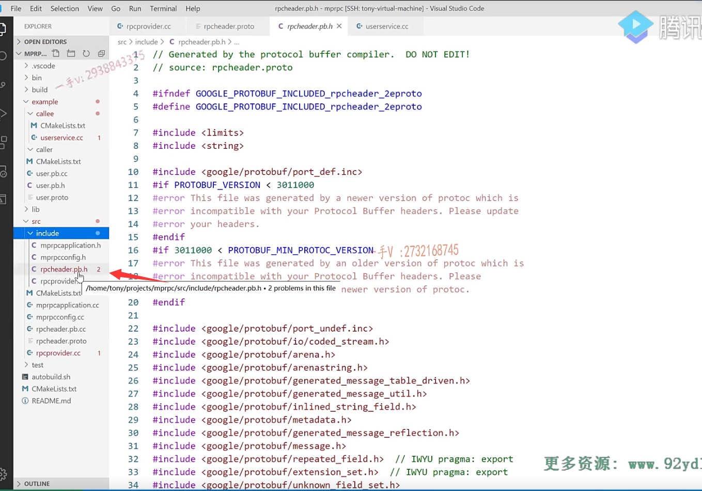

好了，那么在这儿呢，我们继续来开发我们框架针对这个rpc调用方的相关的一些业务代码。好不好啊？

好了，那么大家来跟我看啊rpc调用方是不是就是caller这里啊？哎caller这里那在这儿呢，我起一个啊call user service点CC吧，

这是上面儿是呃，这个方法的，这个提供者rPC方法的提供者。

这是消费者对吧？我call，我要调用啊，我要调用。

那么大家来看啊，这是框架的代码还是业务的代码？这是我们业务代码。

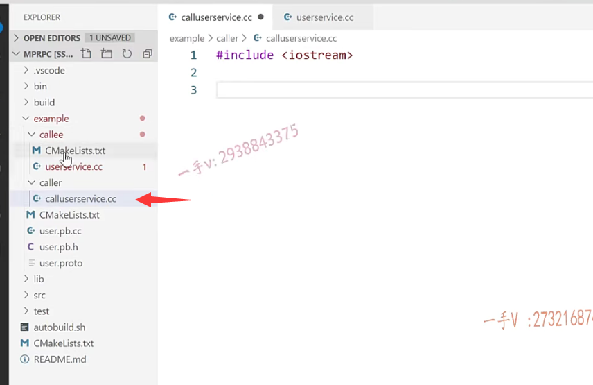

### 提供rpc服务者，约定rpc服务

我听说有人啊，发布了一个rpc服务，我可以使用啊，这个rpc服务长什么样子呢那？

==谁提供的rpc服务，谁是不是就写相应的一个proto文件啊，==

这个proto文件就是约定好了rpc服务长的这个样子嘛，是不是。

是这个类对象里边儿这个样子的一个rpc服务？

这个rpc的参数是这个类型，响应是这个类型，

那么别人就按照你约定好的这么一个service rpc服务发起一个远程的调用了，对不对？

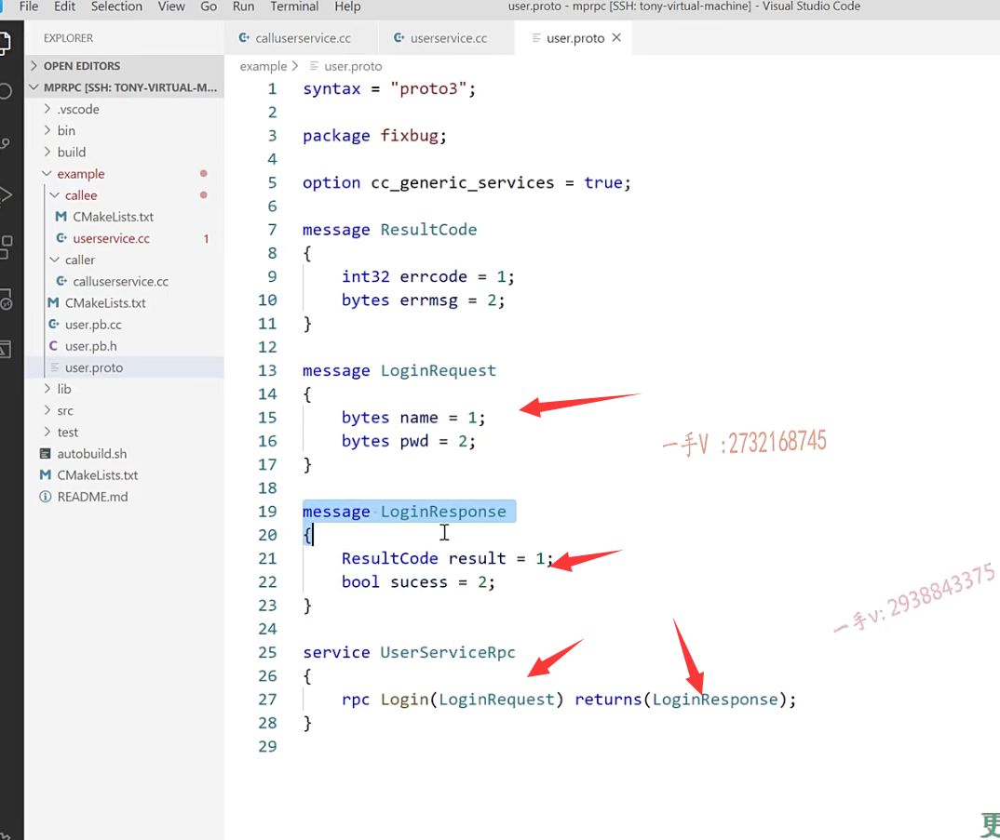

好，那么在这里边儿，我来看看这个该怎么写呢？各位。

啊，首先在这里边argc。叉星星arg v。

你要使用框架嘛，对不对哎？要使用框架，那就得先包含我们框架的什么呀？

就包含我们框架的这个mprpc application框架的这个头文件好吧。

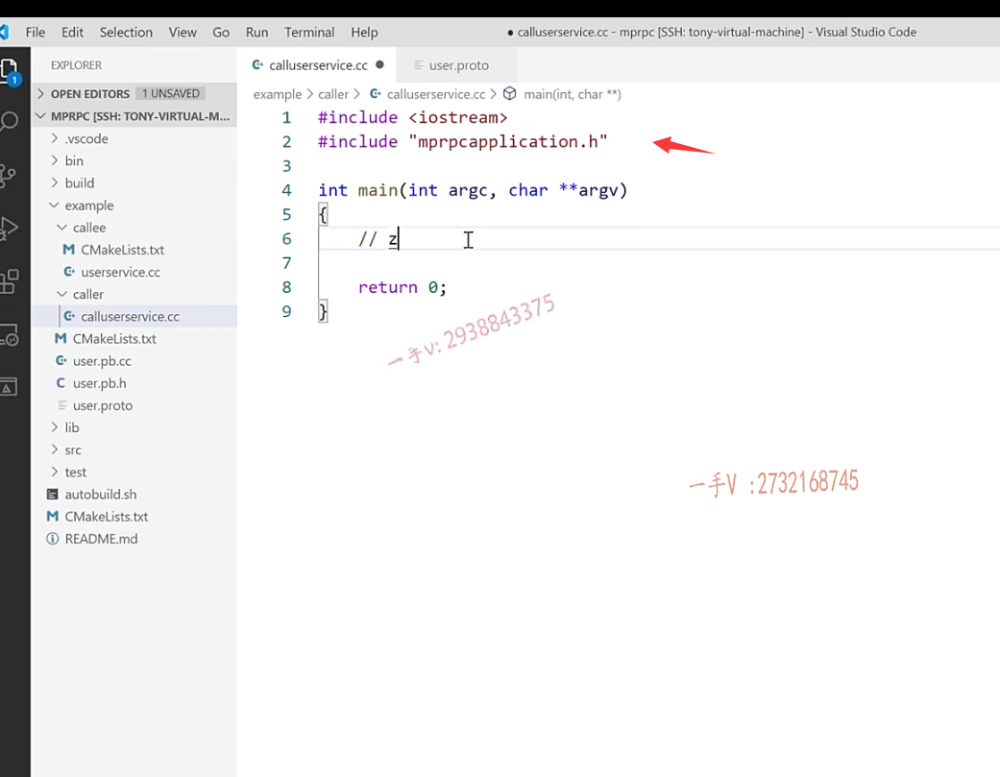

整个啊，整个这个程序启动以后啊。

这个使用mprPC这个框架啊。来享受啊rpc这个服务调用就得啊，一定需要先初始先调用框架的初始化函数啊，这里边呢？是我们约定好了框架的使用方法，对不对啊？

init，然后把made。argc跟argv

框架只初始化几次呀？各位只初始化一次就行了。

这个rpc客户端程序，这里边儿人家做业务的时候肯定可能是在很多地方随时随地的都有可能发起一个rpc的服务。对吧，

不用每次发起服务的时候都去初始化一下框架，你把框架初始化那么多次干啥呢？

在这个服务的提供者这里边儿我们框架只需要初始化一次就行了。

在这个框架中，我们现在做的事情就是读取，主要就是通过main函数的参数来读取这个配置文件，对不对？

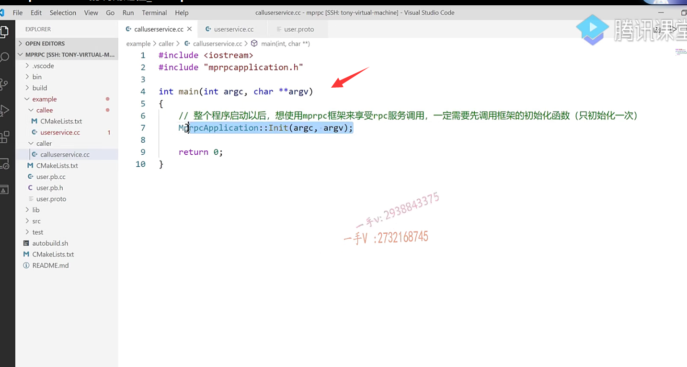

哎，配置文件里边去写了我们对于rpc client来说，

那这个配置文件里边具有这个rpc server的IP地址，端口号还有。什么呀，还有zk的IP地址端口号对不对啊？还有zk的IP地址端口号。

好有关zookeeper啊，这个分布式一致性协调服务都有哪些具体的功能？为什么我们这个项目要使用它？这一道后边我们专门来说啊。

大家来看当时我们给大家说过了啊，当我们提供rpc服务的。rpc服务提供者，

这里边儿约定好了一个proto文件，以后定了一个service rpc服务的描述以后啊。

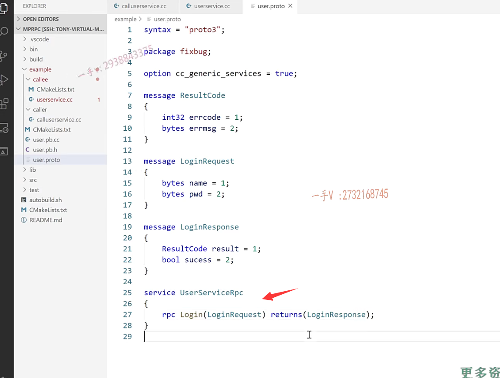

## proto文件生成的这个C++代码  生成了2个类

通过这个proto文件生成的这个C++代码啊，

它里边儿主要就提供了两个类，一个是user service rpc，那就看你定义什么名字，

另一个就是以你定义名字的这个service的名字下横杠。什么stub？

### 我们写本地服务的时候就是继承userServiceRpc

user service rpc是给服务发布者提供的，

你看我们在写什么的时候啊？

在发布服务的时候是不是就是让我们原先写的本地的这个业务类从这个user service rpc继承而来重写这个login方法，由框架帮我们调用对吧？

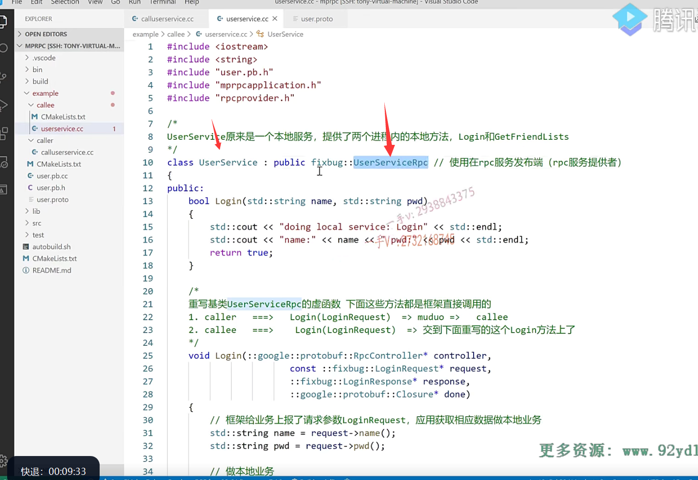

那么它还有相应的这个service类下横杠stub，这是专门给rpc调用者来使用的，

你想远程调用这个rpc login方法,

那你就得去使用这里边定义好的user service rpc杠stub。

好吧啊，在这里边儿我们演示。

### 演示调用远程发布的rpc方法login

演示调用远程发布的rpc方法什么啊？login对不对啊？这是杠呃，

我们这个是有名字空间作用域的fix bug。

叫做什么呀？这个还得包含相应的头文件啊，各位同学。

呃，user PB点h对不对啊？

来我们看看fix bug，这里边就是user services tub。

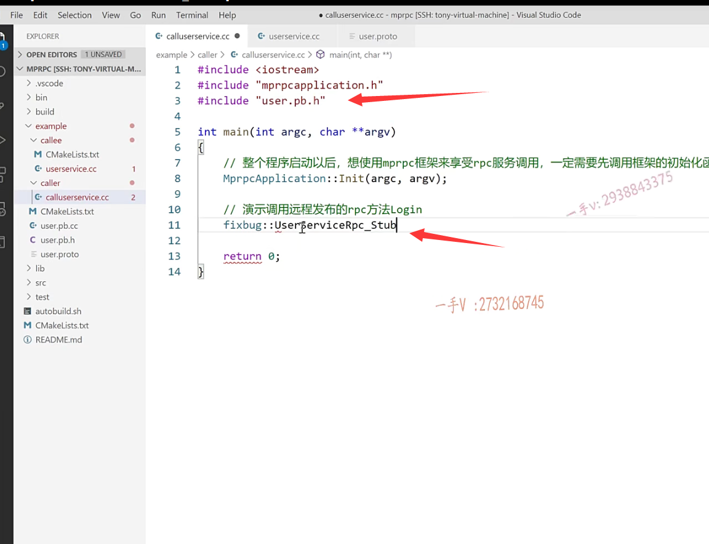

## UserServiceRpc_stub类查看

### 构造函数  必须提供RpcChannel

好吧，哎，来看一下这个stub之前呢，给大家在这里边呢，有做过一些基本的介绍啊，基本的这个介绍。

在这里边儿呢，我们看到user service rpc杠stub，

它没有默认构造函数。

它有的构造函数是一个什么？先说一个rpc channel。嗯，接收一个rpc channel，

也就是说你想去构造一个user service rpc杠top，你是必须怎么样啊？

哎，你是必须给出一个什么必须得给出一个rpc channel。

必须得给出这么一个rpc channel。

好吧啊，这是它提供的唯一的这个构造。

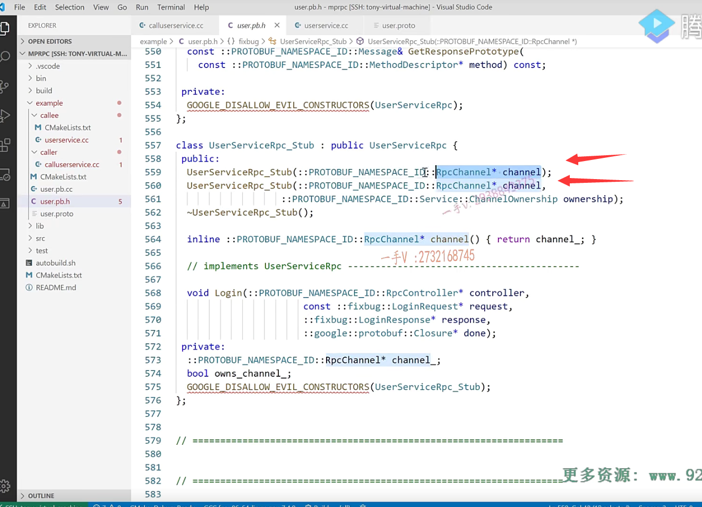

然后呢，大家来注意一下啊，注意一下这个user service rpc stub，

这里边儿也有，是不是这些约定好的这些方法啊。

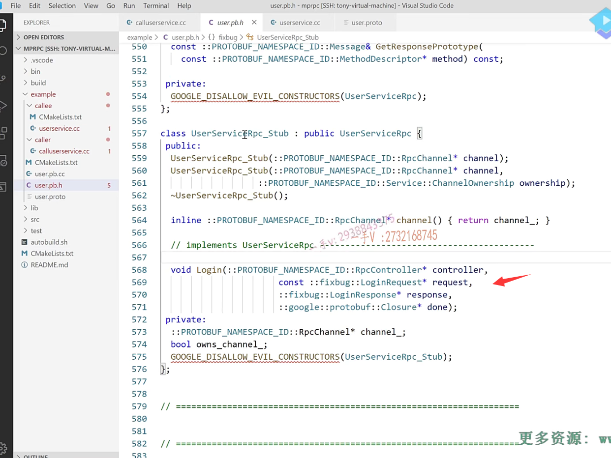

哎，这些方法我看看啊，这些方法在执行的时候呢，

实际上我之前都就给大家讲了。

这个方法在执行的时候啊。全部都是调用你通过构造函数传进来的这个rpc channel的一个call method的方法。

call method的方法我们来看一看它相应的这个源文件的实现啊。

大家来看，这是user service rpc杠stub。

当你去通过这个装对象去调用login方法的时候呢啊。

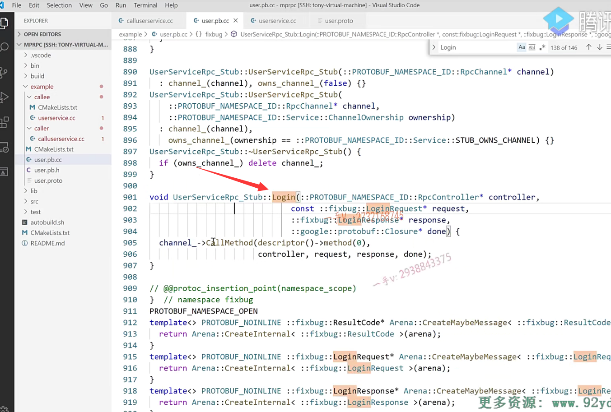

在这里边儿，相当于就是我们rpc调用方黄色的这一块儿，是不是我应用直接调用user services？user service rpc杠stub。

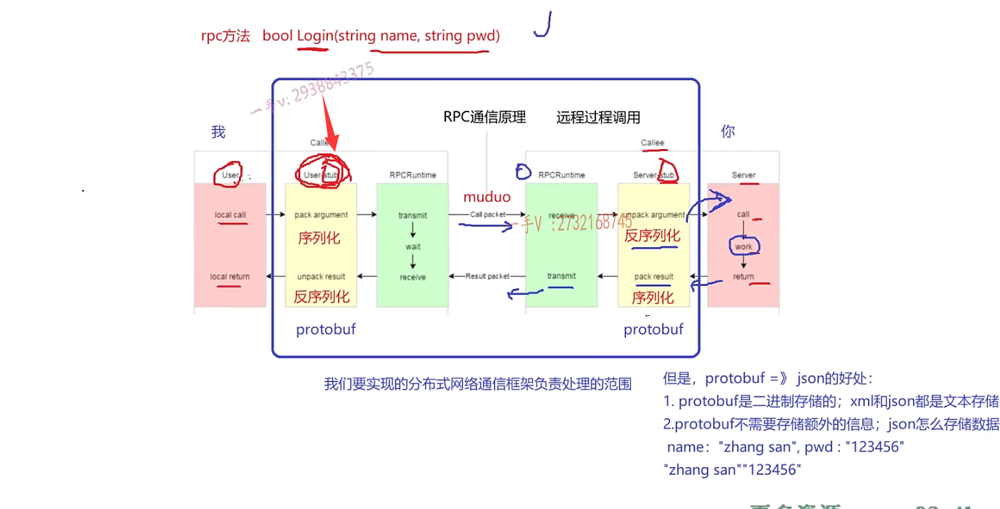

它底层调用的都是channel通道的call method的方法。都是通道的call method的方法。

OK吧啊，都是通道的，call method的方法看。

那也就是说我大致我明白了啊。

在这儿呢。你看在调用方这里边儿，

首先呢，==我创建这么一个rpc代理的对象。==对不对？

我需要给它传一个什么rpc channel。

这里边儿我先写一个伪代码好吧啊，传这个以后呢，

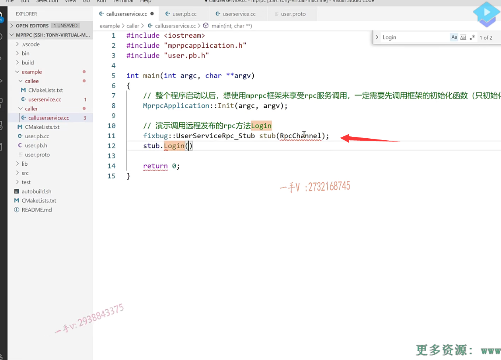

### 它最终都把方法呢调用到你传入的这个rpc channel的call method上

你看你用这个stub在调用这个login方法的时候啊。

你需要把人家相应的参数是不是传上啊？

当你去调用这个login方法的时候。

它实际上啊，这个stub的所有的方法rpc方法啊，就调用的时候，它实际上都是呢，调用了底层的这个rpc channel的method的方法。

也就是说，你通过这个stub调用所有方法的时候，

它最终都把方法呢调用到你传入的这个rpc channel的call method上了。

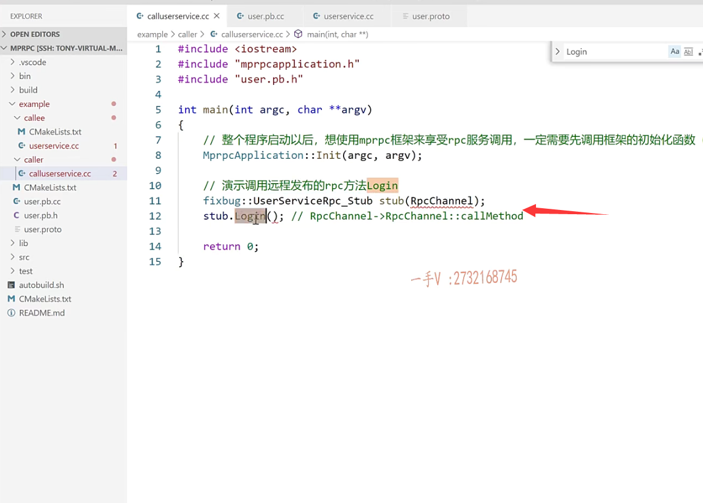

那我们在call method上主要啊，就集中来做所有rpc方法调用的参数序列化和网络发送。

没问题吧，就是由这个桩类啊，在这里边儿桩类，

不管你这儿定的是login登录还是注册还是修改密码还是添加好友，

==不管你是什么啊？在这儿呢，它调用都是最终调用，你在创建这个stub对象的时候传入的这个rpc channel。==

==这个channel的call method方法上的。==

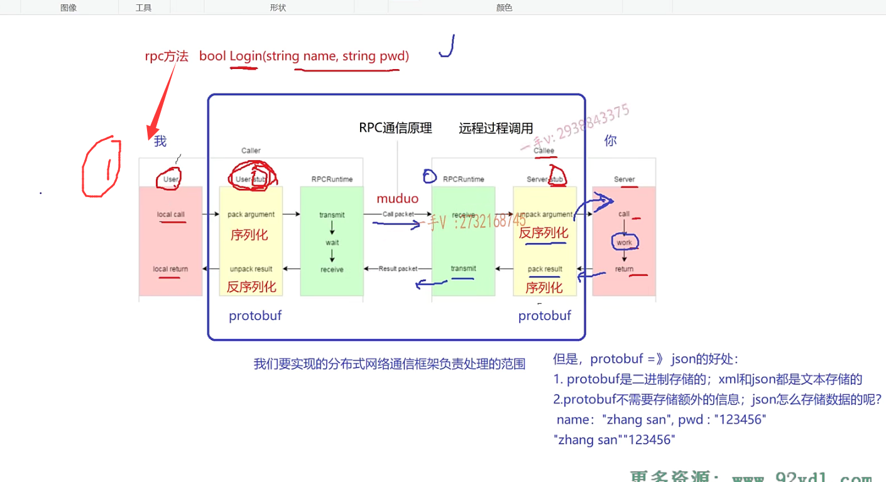

这个channel在这里边儿，不要把它理解成通道，

因为我们有些同学把它理解成通道以后就往往跟网络就联系起来了。

### 所有通过桩类调用的rpc方法最终都转到rpc channel的call method方法上

==实际上，在这里边儿呢，相当于它就是一个中继啊，它就是一中继。==

所有方法呢，看着调用是login，看着调用的是注册，好像调用的是不同的方法，

实际上它底层都是调用channel的call method。

所有通过桩类调用的rpc方法最终都转到rpc channel的call method方法上。

在这统一的去做不同rpc方法调用的一个参数序列化和网络发送，

就是做这一块儿的事情。

好吧，做这一块儿事情，

## 完整请求 响应过程 梳理

这个请求发过去了，我们也像图这儿，我们做的rpc请求是一个同步的请求，

因为我们这个rpc请求发出去以后呢？

==这块儿rpc调用方就在这里边wait就等待阻塞在这里了，==

然后呢？通过这个rpc请求发到我们的rpc provider上，

经过这一系列的muduo库，就是我们之前写的on message，对不对？

接收网络字符流，然后进行反序列化，调用我rpc provider上的一个本地服务login，

然后再返回一个，结果通过一个down点down指向的run

通过回调，然后再把这个response login跟response进行序列化，

再通过网络发送返回，

回来以后我这儿是不是再继续进行响应的反序列化以及报给我rpc调用方应用程序，你的rpc方法请求。得到结果了。

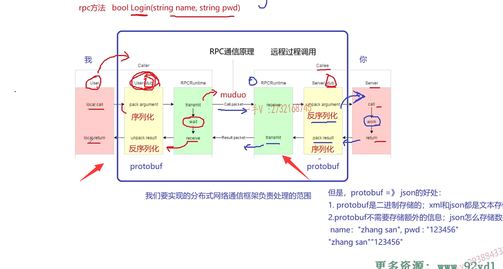

是不是这个意思啊？就是这个意思啊，

## rpc channel callmethod()处理

那我们现在在这一块儿做的。啊，这块儿做的就是我的。我给大家讲的，

==在这里边rpc channel的这个call method的方法中集中做的啊。==

那么大家别着急，我们一步一步来好吧，哎，一步一步来。

首先呢，rpc channel你不能直接使用啊。对不对？那玩意儿能使用吗？

你看这玩意儿使用不了啊，这call是一个纯虚函数啊，这是一个抽象类啊，它能去new一个对象吗？它new不了对象好吧啊，它new不了对象。

==所以我们得在框架上啊，去定义这么一个类，从rpc channel呢，怎么样啊哎？继承而来，然后重写一下靠method的方法。==

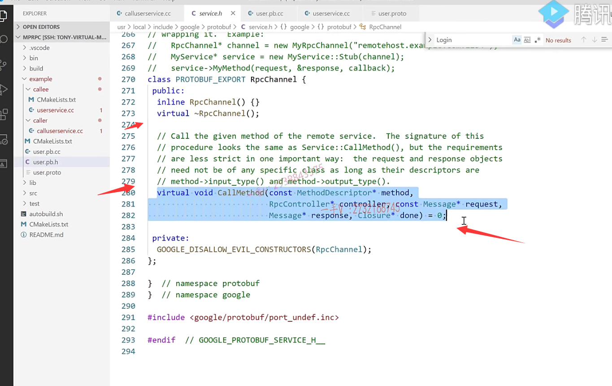

好吧啊，这才是我们呢，该做的事情。好不好啊？

那在这里边儿，我们继续给框架开发代码了，现在框架开发的代码相当于是框架提供给rpc调用方所使用的啊。

### 定义派生类，重写抽象类方法

先定义一个头文件，我们把它叫做mpr PC channel吧，好吧？mpr PC.channel点h。

ok。然后这是pragma programmer ones，

然后class叫mpr PC。channel继承自谁呀？继承自google pro to buff诶。这个得包含相应的这个东西了啊。include然后是 google呃pro to buffer。

然后我看看啊。呃，没有这个rpc channel是吧？

好，我们来看一看这个rpc channel是在哪一个头文件中去定义的啊？

啊，是在service点h里边，你看RPc channel service点h啊。

那我们就包含一下service点h这个。

没有帮助了。

重写一下google p buffer。service点h。ok吧。这里边就是google。proto嗯proto bof pro to buffer，然后是rpc channel嘛。

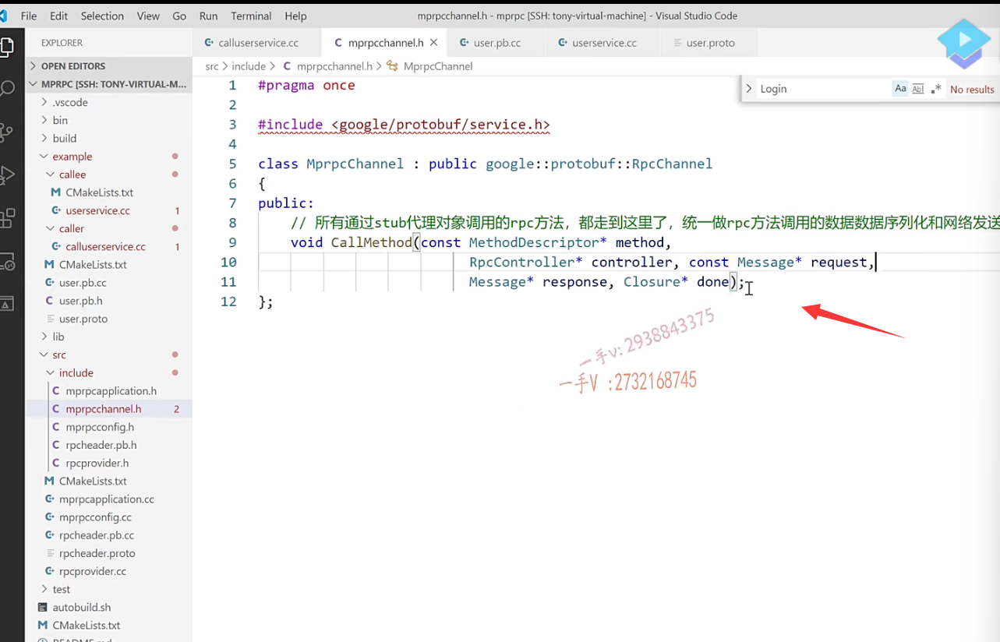

public private.能过来好吧，哎，能过来。好了，那么在这里边儿。先不管了啊，一会儿编译的时候再说吧。这个private实际上我们都用不着了。

rpc channel在这里边，主要是不是要重写这个call method的方法呀？

注意啊，在这里边。

所有通过 stub这个代理对象调用的rpc方法。都走到这里了统一做rpc方法调用的序列这个数据序列化。数据序列化和网络。网络是什么呀？网络发送。

好不好啊？网络发送。

好，那在这里边儿相应的，我还要建立一个源文件啊，就是mpr PC channel channel点CC。include mpr PC channel点h。

好吧，把这个方法呢，我们来给它重写一下啊。

在这儿。诶，不是写到这儿，是写到这儿啊。那么，在这里边儿。

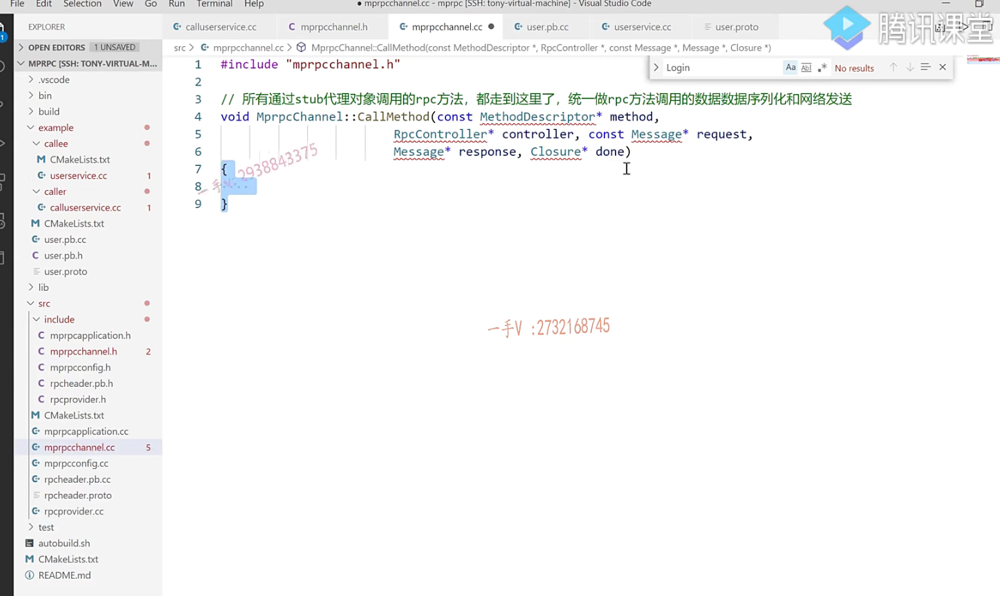

### 还要再caller中新建cmakelists.txt，来编译

我们先来编译一下吧，好吧啊。编译的话，

这个caller是不是我也得生成一个什么cmakelists.txt是不是啊？

这个编译文件啊，我把这个call里边这个cmake lists。拷贝了一份儿，好不好啊？

这是user service。点CC我们不是啊，我们是call user service点CC。是不是这个里边儿啊？靠右侧的点CC，然后是外层目录的user点PB点CC。啊，然后这个是生成的，是consumer consumer。啊，然后这个consumer肯定也得依赖我们框架也用到了pro to buffer，

是不是啊？这样定义就可以了。

### 编译出错，去掉之前写的示例

来编一下我们整个的这个项目啊。看有没有什么编译错误哦？

果然有啊，在这里边儿。user service点CC。callee怎么这儿出问题了？

Main第62行。哦，这是我们。

可能给大家之前写的事例啊，我把这儿去掉。

啊，没有问题，这是可以编译成功的啊，我们一边儿写上它编译成功啊。

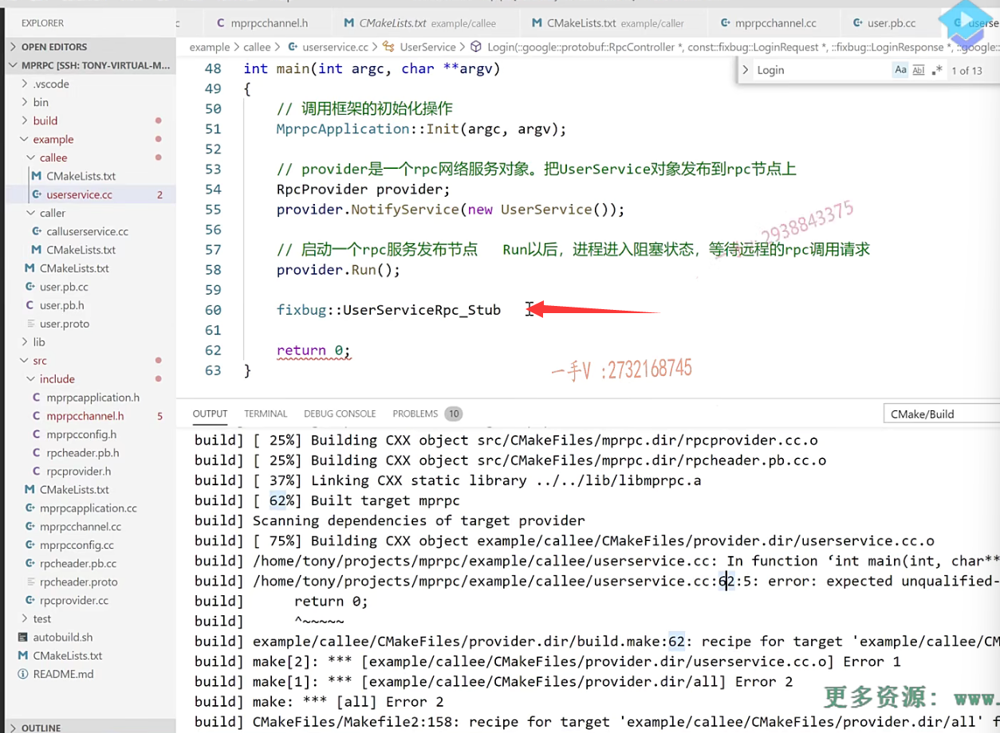

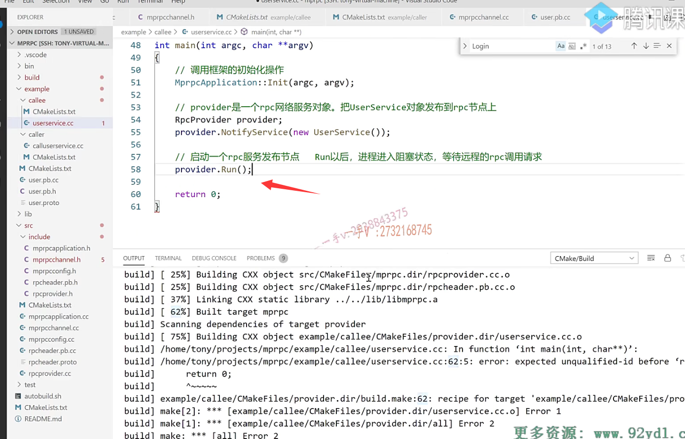

编译

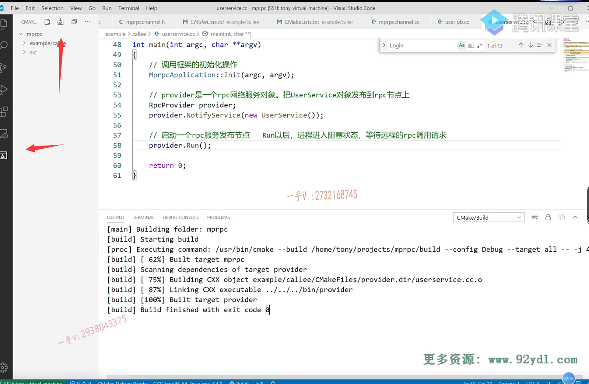

### 这里还没写完，我们需要stub传入rpcchannel

好了，那我们现在就可以专心致志的去写。

这块儿啊，那么大家再注意，我再强调一下啊，这块儿是怎么过来的呢？

是我们调用rpc服务的时候呢？

哎，我们用相应的描述的rpc这个service类杠stub这个类哎。调用的时候呢，人家是需要传入一个。什么东西的？这个rpc channel的一个对象的。

是不是这块儿的调用我们还没有写完啊？

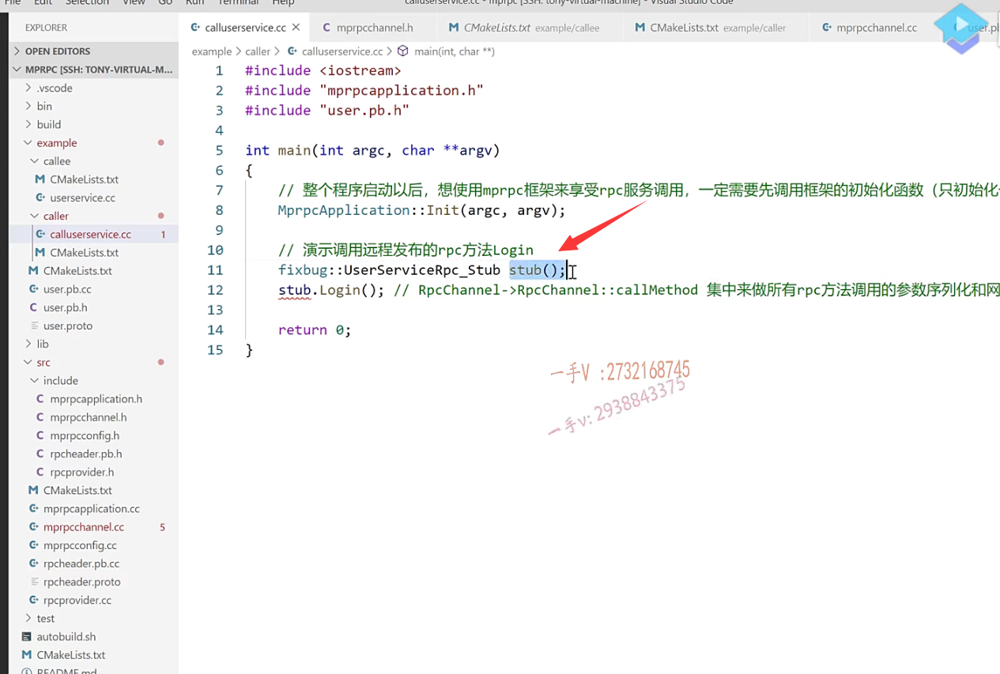

那么，当传入这个channel以后呢？

在这里边儿，它调用的所有的这些rpc方法，最终都跑到哪里去了？

最终都跑到这个channel的call method这里边儿来了。就是我们写的这个call method里边儿。

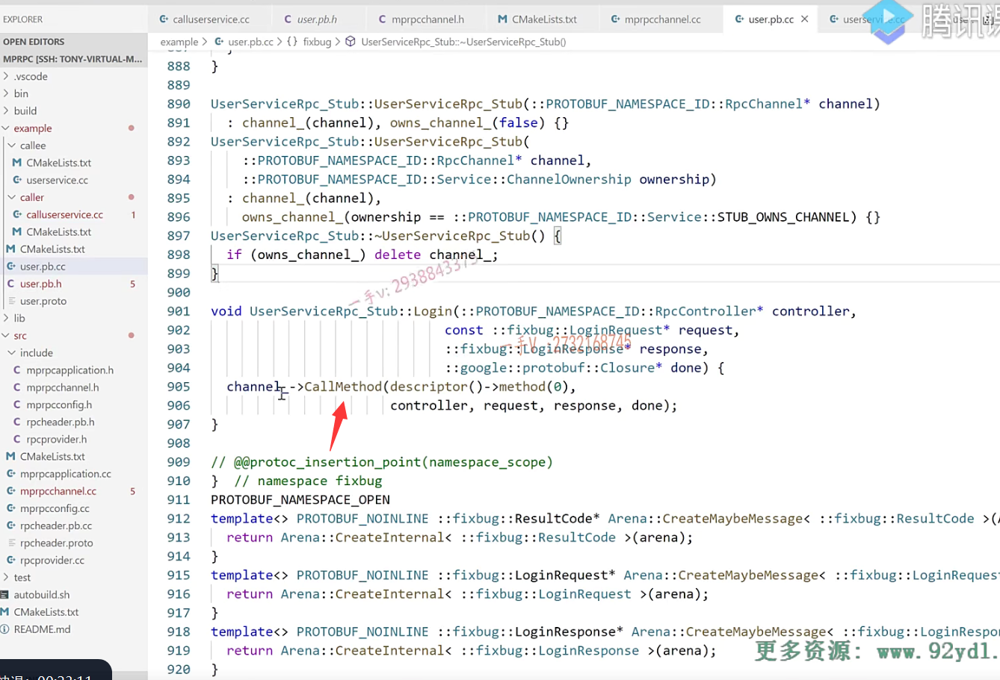

等我把这块写完了以后啊。

我想着再给大家回过头来，把这块儿相应的参数给它填完了。

大家都知道，现在我调用一个rpc方法，就这么写，调用login以后呢，它就会跑到这里边儿了啊，

我先把这个参数我填这儿吧。这include框架的mpr PC.channel点h啊。

这里边呢，就需要一个new mpr PC.channel好吧啊，就需要这么一个东西。就需要这么一个东西。

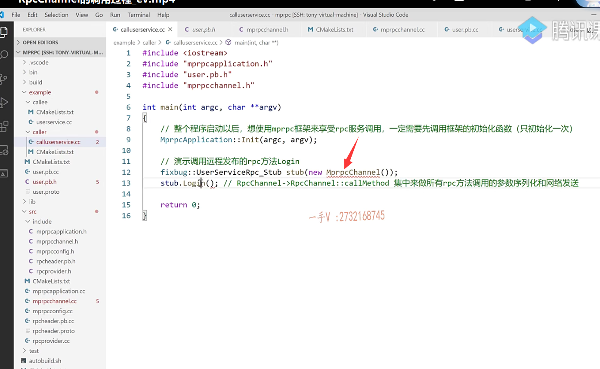

啊，在这里边儿呢，它调用的login方法都跑到什么都跑到这个channel的call method的方法里边儿了。

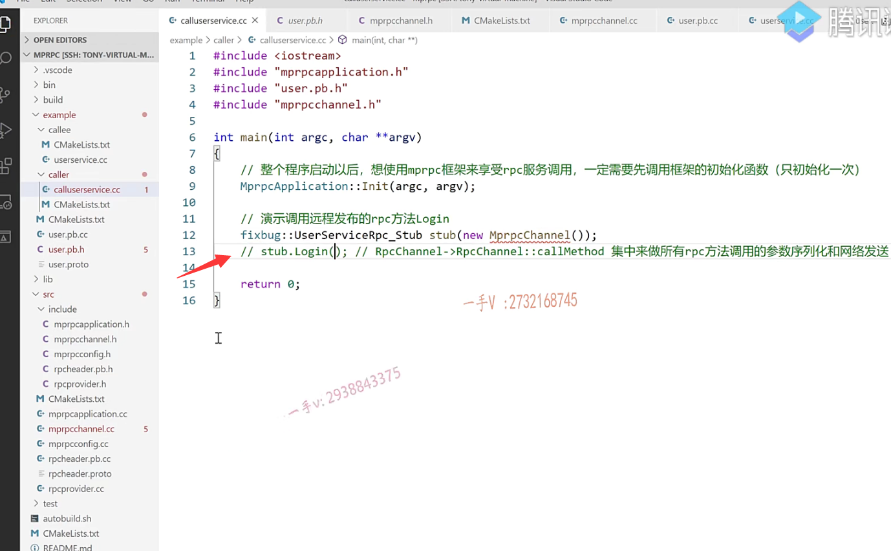

==好吧啊，行，那这个框架编译的时候呢，我们还得再加一个源文件啊，叫做m PR pcc。channel点CC。==

对准没有？把这个原文件是不是要加进来mpr PC？channel点CC啊。

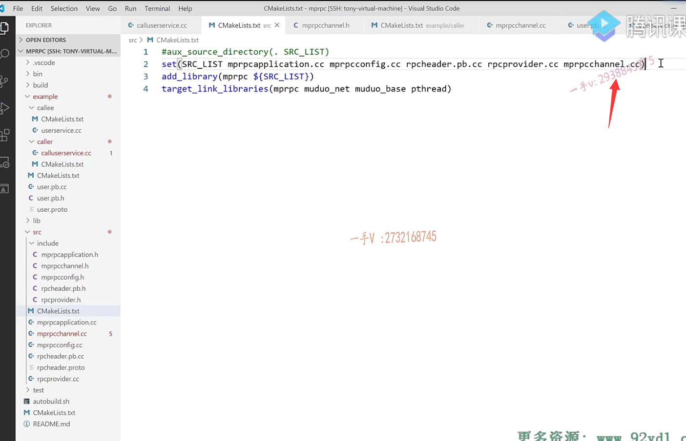

好了，那大家应该就清楚了啊，

我们在发起一个rpc调用的时候，它怎么用的？啊，以及调用这个方法，以后呢，它都跑到了这个stub代理对象的一个channel的call method方法里边来了。

==它的参数需要rpc channel，我们给的是一个mpr PC channel行不行呢？==

==当然行了，因为我们这个类就是从rpc channel继承而来的嘛，==

==基类的指针当然是可以接收派生类对象的。==

==哎，这个call method又是一个同名覆盖方法，所以通过多态的调用，==

==是不是就是调用到了我们的什么？我们重写的这个call method方法，==

==派生类对象的method，call method方法上了。==

没有问题吧啊。好在这里边儿。

这果然还是需要去包含一些头文件，这个method descriptor都不认识是吧？都不太认识，这是descriptor点h啊。re service点h。还有message点h。

我们在这个图文件里边儿都包含一下吧。google pro to buffer.descriptor点h。还有这个google。pro to buffer.message点h。好重新构建。

### 还是名字作用域的错误

还有错误哦。哈哈，

知道什么问题了吧？还是名字空间的问题，是不是啊？

所以我们写的时候呢，老想着怎么实现？具体的功能了啊，

忽略了人家的这个名字空间作用域啊。这个分号要去呃，这个分号不能去是不是？这个分号不能去啊。

在这个点儿CC里边儿，我把这个也重新替换一下啊。

这类的作用域要加上啊。

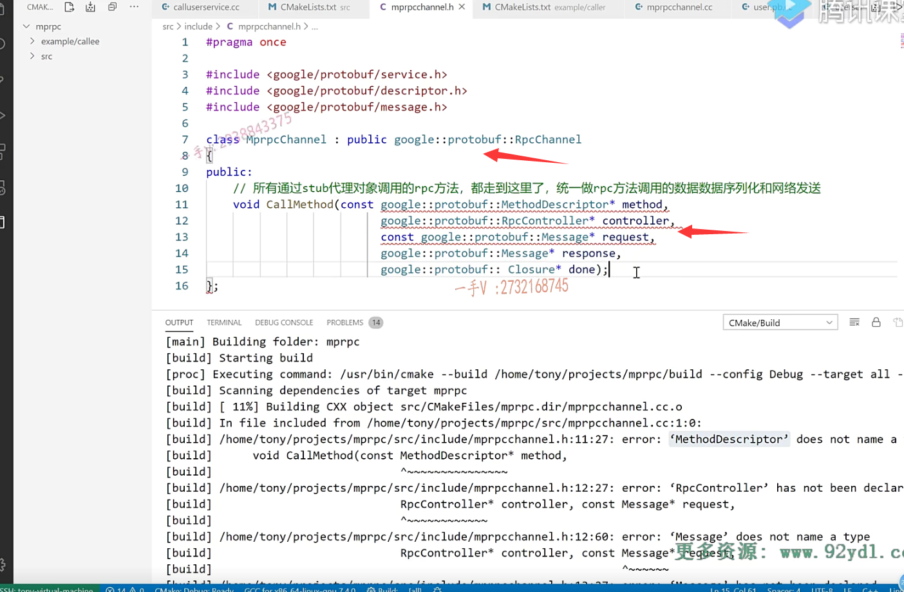

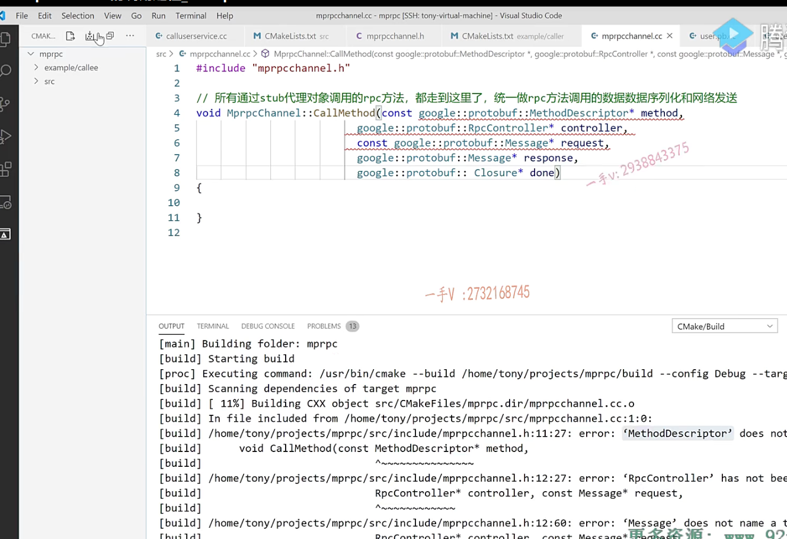

好，我重新编译一下。就没有了。

那现在就成功了，好不好？这些刚报错是因为名字空间装域没给出来。它识别不了，

## 总结

现在我们就专心一意的去写这个call method代表的就是rpc调用方呢，

这一块儿黄色跟这一块儿绿色。

对于rpc方法的请求，数据进行序列化以及网络发送。好不好？

然后在这里边儿以阻塞，以同步的方式等待rpc返回的一个结果，

然后再进行数据的这个接收反序列化以及把相应的结果上报给应用啊，

都是在我们call method这里边来完成的。非常重要。

那具体的这个代码编写过程，我们放在下一节课给大家来。

这个讲解啊，这节课我们主要就是先讲了一下，

==代码上我如何实现我rpc调用方这一块儿的这个逻辑。==

==最终都转到call method rpc channel的call method这里边了。==

希望大家呢，先好好的理解一下啊。